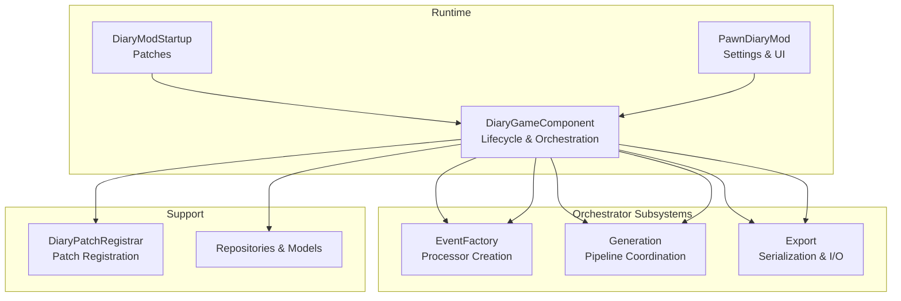
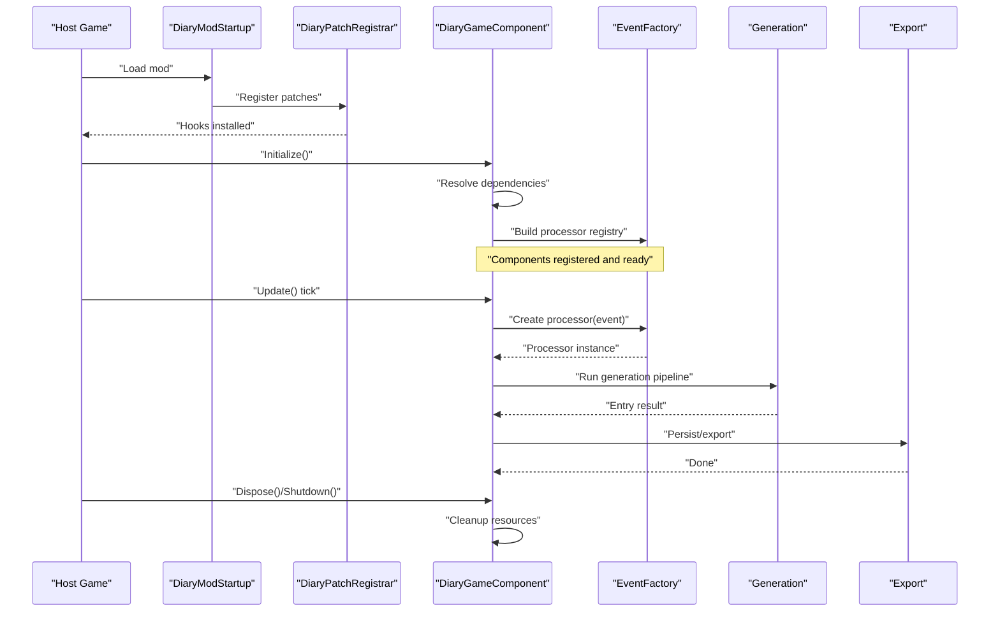
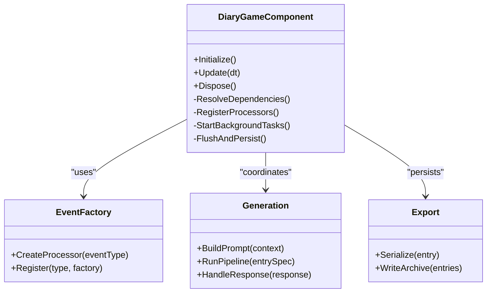
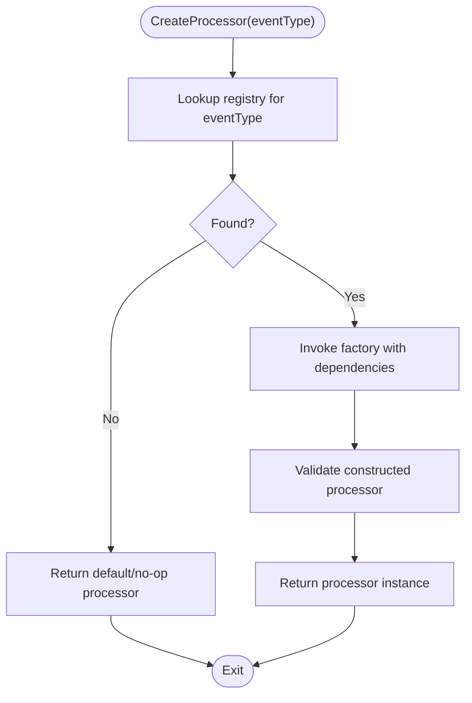
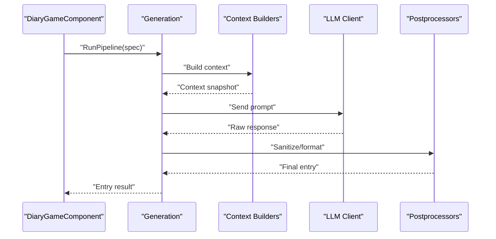
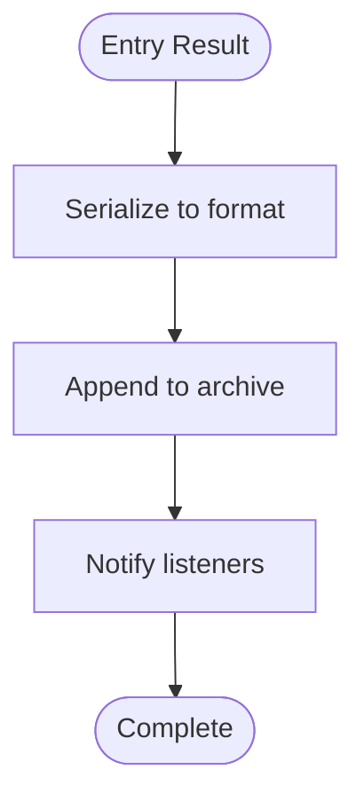
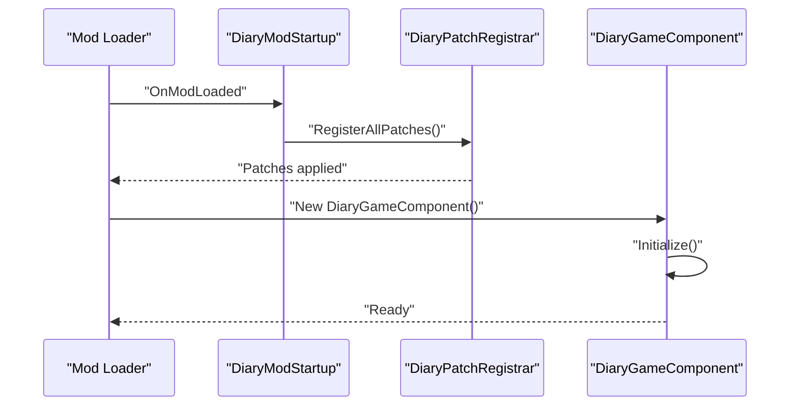
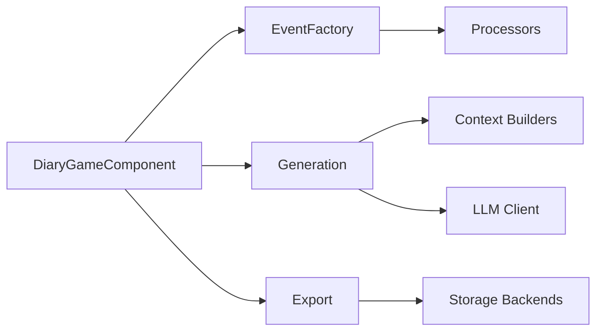

# Component Lifecycle Management

## Table of Contents
1. [Introduction](#introduction)
2. [Project Structure](#project-structure)
3. [Core Components](#core-components)
4. [Architecture Overview](#architecture-overview)
5. [Detailed Component Analysis](#detailed-component-analysis)
6. [Dependency Analysis](#dependency-analysis)
7. [Performance Considerations](#performance-considerations)
8. [Troubleshooting Guide](#troubleshooting-guide)
9. [Conclusion](#conclusion)

## Introduction
This document explains the lifecycle and initialization sequence of the main game component that orchestrates event capture, generation, and export for the Diary system. It focuses on:
- Startup procedures and dependency injection
- Component registration and extension points
- Event factory pattern for specialized processors
- Generation pipeline coordination
- Export functionality
- Extensibility patterns (adding hooks, managing dependencies)
- Initialization order, error recovery during startup, and graceful shutdown

The goal is to provide both a high-level overview and code-level details so that maintainers can extend and debug the system confidently.

## Project Structure
At runtime, the Diary system integrates with the host game via patches and a mod entry point. The central orchestrator is implemented as a GameComponent split across multiple partial classes for clarity and feature separation. Key areas include:
- Core orchestration and lifecycle
- Event factory and processor creation
- Generation pipeline coordination
- Export utilities
- Mod startup and patch registration

**Diagram sources**
- [DiaryModStartup.cs](../../../../Source/Patches/DiaryModStartup.cs)
- [DiaryGameComponent.cs](../../../../Source/Core/DiaryGameComponent.cs)
- [DiaryGameComponent.EventFactory.cs](../../../../Source/Core/DiaryGameComponent.EventFactory.cs)
- [DiaryGameComponent.Generation.cs](../../../../Source/Core/DiaryGameComponent.Generation.cs)
- [DiaryGameComponent.Export.cs](../../../../Source/Core/DiaryGameComponent.Export.cs)
- [DiaryPatchRegistrar.cs](../../../../Source/Patches/DiaryPatchRegistrar.cs)
- [PawnDiaryMod.cs](../../../../Source/Settings/PawnDiaryMod.cs)

**Section sources**
- [DiaryGameComponent.cs](../../../../Source/Core/DiaryGameComponent.cs)
- [DiaryGameComponent.EventFactory.cs](../../../../Source/Core/DiaryGameComponent.EventFactory.cs)
- [DiaryGameComponent.Generation.cs](../../../../Source/Core/DiaryGameComponent.Generation.cs)
- [DiaryGameComponent.Export.cs](../../../../Source/Core/DiaryGameComponent.Export.cs)
- [DiaryModStartup.cs](../../../../Source/Patches/DiaryModStartup.cs)
- [DiaryPatchRegistrar.cs](../../../../Source/Patches/DiaryPatchRegistrar.cs)
- [PawnDiaryMod.cs](../../../../Source/Settings/PawnDiaryMod.cs)

## Core Components
- DiaryGameComponent: Central orchestrator implementing lifecycle hooks (e.g., initialization, update, disposal). It wires subsystems, manages dependencies, and coordinates event processing and generation.
- EventFactory: Creates specialized processors based on event types or configuration, enabling extensible handling without modifying core logic.
- Generation: Coordinates prompt assembly, context building, and LLM request/response flows.
- Export: Serializes entries and metadata for persistence or external consumption.

Key responsibilities:
- Dependency resolution and registration
- Hooking into game events via patches
- Scheduling and batching work
- Error isolation and recovery
- Graceful shutdown and resource cleanup

**Section sources**
- [DiaryGameComponent.cs](../../../../Source/Core/DiaryGameComponent.cs)
- [DiaryGameComponent.EventFactory.cs](../../../../Source/Core/DiaryGameComponent.EventFactory.cs)
- [DiaryGameComponent.Generation.cs](../../../../Source/Core/DiaryGameComponent.Generation.cs)
- [DiaryGameComponent.Export.cs](../../../../Source/Core/DiaryGameComponent.Export.cs)

## Architecture Overview
The system follows a layered architecture:
- Patches layer injects events into the orchestrator
- Orchestrator resolves dependencies and dispatches work
- Factory creates domain-specific processors
- Generation builds prompts and handles model interactions
- Export persists results

**Diagram sources**
- [DiaryModStartup.cs](../../../../Source/Patches/DiaryModStartup.cs)
- [DiaryPatchRegistrar.cs](../../../../Source/Patches/DiaryPatchRegistrar.cs)
- [DiaryGameComponent.cs](../../../../Source/Core/DiaryGameComponent.cs)
- [DiaryGameComponent.EventFactory.cs](../../../../Source/Core/DiaryGameComponent.EventFactory.cs)
- [DiaryGameComponent.Generation.cs](../../../../Source/Core/DiaryGameComponent.Generation.cs)
- [DiaryGameComponent.Export.cs](../../../../Source/Core/DiaryGameComponent.Export.cs)

## Detailed Component Analysis

### DiaryGameComponent: Lifecycle and Orchestration
Responsibilities:
- Implements lifecycle methods such as initialization, per-tick updates, and disposal
- Resolves and registers dependencies (repositories, policies, registries)
- Wires event sources to processors via the factory
- Coordinates generation scheduling and export tasks
- Provides public API surface for extensions

Initialization flow highlights:
- Resolve settings and tuning
- Initialize repositories and caches
- Register event windows and observed conditions
- Build processor registry through the factory
- Start background tasks (batching, retention, snapshots)

Error recovery:
- Wrap subsystem initializations in try/catch blocks
- Log and continue with degraded mode when optional features fail
- Defer non-critical setup until first use

Graceful shutdown:
- Flush pending batches
- Persist state and archives
- Release external connections and timers

Extensibility:
- Expose registration APIs for new processors and pipelines
- Provide hook points for custom pre/post-processing steps

**Section sources**
- [DiaryGameComponent.cs](../../../../Source/Core/DiaryGameComponent.cs)

#### Class Diagram

**Diagram sources**
- [DiaryGameComponent.cs](../../../../Source/Core/DiaryGameComponent.cs)
- [DiaryGameComponent.EventFactory.cs](../../../../Source/Core/DiaryGameComponent.EventFactory.cs)
- [DiaryGameComponent.Generation.cs](../../../../Source/Core/DiaryGameComponent.Generation.cs)
- [DiaryGameComponent.Export.cs](../../../../Source/Core/DiaryGameComponent.Export.cs)

### EventFactory Pattern: Creating Specialized Processors
Purpose:
- Decouples event type identification from processor implementation
- Enables dynamic registration and lookup of processors
- Supports conditional activation based on DLCs or settings

Behavior:
- Maintains a registry mapping event types to factories
- On demand, constructs processor instances with injected dependencies
- Validates inputs and returns typed processors

Extension points:
- Add new processors by registering them during component initialization
- Override default behavior by providing alternative factories

**Diagram sources**
- [DiaryGameComponent.EventFactory.cs](../../../../Source/Core/DiaryGameComponent.EventFactory.cs)

**Section sources**
- [DiaryGameComponent.EventFactory.cs](../../../../Source/Core/DiaryGameComponent.EventFactory.cs)

### Generation Pipeline Coordination
Responsibilities:
- Assembles narrative context and prompts
- Manages memory selection and enrichment
- Executes LLM requests and parses responses
- Integrates with retention and archival policies

Flow:
- Receive an event spec from the orchestrator
- Build context using providers and policies
- Generate prompt variants and select best fit
- Execute generation and post-process output
- Store results and trigger downstream actions

**Diagram sources**
- [DiaryGameComponent.Generation.cs](../../../../Source/Core/DiaryGameComponent.Generation.cs)

**Section sources**
- [DiaryGameComponent.Generation.cs](../../../../Source/Core/DiaryGameComponent.Generation.cs)

### Export Functionality
Responsibilities:
- Serialize entries and metadata
- Write archives and incremental updates
- Support external consumers via API lanes

Key operations:
- Batch serialization for performance
- Versioned schema support for compatibility
- Idempotent writes with conflict resolution

**Diagram sources**
- [DiaryGameComponent.Export.cs](../../../../Source/Core/DiaryGameComponent.Export.cs)

**Section sources**
- [DiaryGameComponent.Export.cs](../../../../Source/Core/DiaryGameComponent.Export.cs)

### Startup Procedures and Patch Integration
- DiaryModStartup initializes the mod and triggers patch registration
- DiaryPatchRegistrar installs hooks into the host game to feed events into the orchestrator
- PawnDiaryMod provides settings and UI integration, which may influence runtime behavior

Initialization order:
1. Load mod and read settings
2. Register patches and install hooks
3. Create and initialize DiaryGameComponent
4. Resolve dependencies and register processors
5. Start background tasks and timers

**Diagram sources**
- [DiaryModStartup.cs](../../../../Source/Patches/DiaryModStartup.cs)
- [DiaryPatchRegistrar.cs](../../../../Source/Patches/DiaryPatchRegistrar.cs)
- [DiaryGameComponent.cs](../../../../Source/Core/DiaryGameComponent.cs)

**Section sources**
- [DiaryModStartup.cs](../../../../Source/Patches/DiaryModStartup.cs)
- [DiaryPatchRegistrar.cs](../../../../Source/Patches/DiaryPatchRegistrar.cs)
- [DiaryGameComponent.cs](../../../../Source/Core/DiaryGameComponent.cs)

## Dependency Analysis
Coupling and cohesion:
- DiaryGameComponent has high cohesion around orchestration and low coupling via interfaces and registries
- EventFactory encapsulates processor construction, reducing direct dependencies
- Generation depends on context builders and LLM client abstractions
- Export depends on serializers and storage backends

External dependencies:
- Host game hooks via patches
- Optional DLC integrations gated by feature flags
- External LLM endpoints through configured clients

Potential circular dependencies:
- Avoid direct references between subsystems; use registries and interfaces
- Ensure factories do not depend on full orchestrator state at construction time

**Diagram sources**
- [DiaryGameComponent.cs](../../../../Source/Core/DiaryGameComponent.cs)
- [DiaryGameComponent.EventFactory.cs](../../../../Source/Core/DiaryGameComponent.EventFactory.cs)
- [DiaryGameComponent.Generation.cs](../../../../Source/Core/DiaryGameComponent.Generation.cs)
- [DiaryGameComponent.Export.cs](../../../../Source/Core/DiaryGameComponent.Export.cs)

**Section sources**
- [DiaryGameComponent.cs](../../../../Source/Core/DiaryGameComponent.cs)
- [DiaryGameComponent.EventFactory.cs](../../../../Source/Core/DiaryGameComponent.EventFactory.cs)
- [DiaryGameComponent.Generation.cs](../../../../Source/Core/DiaryGameComponent.Generation.cs)
- [DiaryGameComponent.Export.cs](../../../../Source/Core/DiaryGameComponent.Export.cs)

## Performance Considerations
- Batch event processing to reduce overhead
- Use lazy initialization for heavy subsystems
- Cache frequently accessed context data where safe
- Limit synchronous I/O; prefer asynchronous operations for export and network calls
- Monitor memory usage for large archives and implement compaction strategies

[No sources needed since this section provides general guidance]

## Troubleshooting Guide
Common issues and remedies:
- Missing dependencies at startup: verify registration order and ensure optional components are wrapped in try/catch with fallbacks
- Processor not found: confirm event type mapping in the factory registry and check for typos or missing registrations
- Generation failures: inspect prompt assembly logs, validate context availability, and review LLM client connectivity
- Export errors: check file permissions, disk space, and version compatibility of serialized formats

Recovery strategies:
- Degraded mode: disable non-critical features while keeping core event capture active
- Retry with backoff for transient network errors
- Rollback last write if export fails mid-stream

**Section sources**
- [DiaryGameComponent.cs](../../../../Source/Core/DiaryGameComponent.cs)
- [DiaryGameComponent.Export.cs](../../../../Source/Core/DiaryGameComponent.Export.cs)

## Conclusion
The Diary system’s lifecycle centers on DiaryGameComponent, which orchestrates dependency resolution, processor creation via EventFactory, generation pipeline execution, and export operations. By following the documented initialization order, leveraging extension points, and applying robust error recovery, developers can safely extend the system, add new lifecycle hooks, and manage dependencies effectively.

[No sources needed since this section summarizes without analyzing specific files]
