# Core Architecture

<cite>
**Referenced Files in This Document**
- [DiaryGameComponent.cs](../../../../Source/Core/DiaryGameComponent.cs)
- [DiaryEventCatalog.cs](../../../../Source/Capture/Catalog/DiaryEventCatalog.cs)
- [DiaryEventSpec.cs](../../../../Source/Capture/Catalog/DiaryEventSpec.cs)
- [DiarySignal.cs](../../../../Source/Ingestion/DiarySignal.cs)
- [DiaryEvents.cs](../../../../Source/Ingestion/DiaryEvents.cs)
- [DiaryEventRepository.cs](../../../../Source/Core/DiaryEventRepository.cs)
- [DiaryArchiveRepository.cs](../../../../Source/Core/DiaryArchiveRepository.cs)
- [PawnMemoryRepository.cs](../../../../Source/Core/PawnMemoryRepository.cs)
- [DiaryPipelineContracts.cs](../../../../Source/Pipeline/DiaryPipelineContracts.cs)
- [DiaryPromptPlanner.cs](../../../../Source/Pipeline/DiaryPromptPlanner.cs)
- [DiaryResponsePostprocessor.cs](../../../../Source/Pipeline/DiaryResponsePostprocessor.cs)
- [DiaryRetentionPlan.cs](../../../../Source/Pipeline/DiaryRetentionPlan.cs)
- [DiaryLifeBoundaryPolicy.cs](../../../../Source/Pipeline/DiaryLifeBoundaryPolicy.cs)
- [DiarySaveNormalization.cs](../../../../Source/Pipeline/DiarySaveNormalization.cs)
- [DiaryEntry.cs](../../../../Source/Models/DiaryEntry.cs)
- [DiaryEvent.cs](../../../../Source/Models/DiaryEvent.cs)
- [MemoryFragment.cs](../../../../Source/Models/MemoryFragment.cs)
- [PawnDiaryRecord.cs](../../../../Source/Models/PawnDiaryRecord.cs)
- [DiaryApiLaneSnapshot.cs](../../../../Source/Integration/DiaryApiLaneSnapshot.cs)
- [ExternalEventRequest.cs](../../../../Source/Integration/ExternalEventRequest.cs)
- [PawnDiaryApi.cs](../../../../Source/Integration/PawnDiaryApi.cs)
- [DiaryPatchRegistrar.cs](../../../../Source/Patches/DiaryPatchRegistrar.cs)
- [DiaryModStartup.cs](../../../../Source/Patches/DiaryModStartup.cs)
- [CaptureCapabilityRegistry.cs](../../../../Source/Pipeline/CaptureCapabilityRegistry.cs)
- [ContextProviderRegistry.cs](../../../../Source/Pipeline/ContextProviderRegistry.cs)
- [ListenerRegistry.cs](../../../../Source/Pipeline/ListenerRegistry.cs)
- [DiaryGenerationStatus.cs](../../../../Source/Pipeline/DiaryGenerationStatus.cs)
- [DiaryDirectSpeechParser.cs](../../../../Source/Pipeline/DiaryDirectSpeechParser.cs)
- [DiaryRichTextDecorators.cs](../../../../Source/Pipeline/DiaryRichTextDecorators.cs)
- [DiaryParagraphReflow.cs](../../../../Source/Pipeline/DiaryParagraphReflow.cs)
- [DiaryNameHighlighter.cs](../../../../Source/Pipeline/DiaryNameHighlighter.cs)
- [DiaryListText.cs](../../../../Source/Pipeline/DiaryListText.cs)
- [DiarySentenceExcerpt.cs](../../../../Source/Pipeline/DiarySentenceExcerpt.cs)
- [DiaryTextDecorationContracts.cs](../../../../Source/Pipeline/DiaryTextDecorationContracts.cs)
- [DiaryTextDecorationFactCodec.cs](../../../../Source/Pipeline/DiaryTextDecorationFactCodec.cs)
- [DiaryTextDecorationMatcher.cs](../../../../Source/Pipeline/DiaryTextDecorationMatcher.cs)
- [DiaryTextDecorationText.cs](../../../../Source/Pipeline/DiaryTextDecorationText.cs)
- [DiaryPromptCapture.cs](../../../../Source/Pipeline/DiaryPromptCapture.cs)
- [DiaryPromptKeys.cs](../../../../Source/Pipeline/DiaryEventPromptKeys.cs)
- [DiaryEventDomainClassifier.cs](../../../../Source/Pipeline/DiaryEventDomainClassifier.cs)
- [DiaryEntryStatsAccumulator.cs](../../../../Source/Pipeline/DiaryEntryStatsAccumulator.cs)
- [DiaryEntryTitleFilter.cs](../../../../Source/Pipeline/DiaryEntryTitleFilter.cs)
- [DiaryArchiveEligibility.cs](../../../../Source/Pipeline/DiaryArchiveEligibility.cs)
- [DiaryArchiveFallback.cs](../../../../Source/Pipeline/DiaryArchiveFallback.cs)
- [DiaryArchiveCompactionPlanner.cs](../../../../Source/Pipeline/DiaryArchiveCompactionPlanner.cs)
- [ExternalApiBudgetPolicy.cs](../../../../Source/Pipeline/ExternalApiBudgetPolicy.cs)
- [ExternalOverrideArbitration.cs](../../../../Source/Pipeline/ExternalOverrideArbitration.cs)
- [ExternalWritingStyleOverrideText.cs](../../../../Source/Pipeline/ExternalWritingStyleOverrideText.cs)
- [PlayerWritingStyleText.cs](../../../../Source/Pipeline/PlayerWritingStyleText.cs)
- [PsychotypeResolutionPolicy.cs](../../../../Source/Pipeline/PsychotypeResolutionPolicy.cs)
- [PsychotypeRollPolicy.cs](../../../../Source/Pipeline/PsychotypeRollPolicy.cs)
- [PsychotypeTraitAffinities.cs](../../../../Source/Pipeline/PsychotypeTraitAffinities.cs)
- [PsychotypeText.cs](../../../../Source/Pipeline/PsychotypeText.cs)
- [HumorChancePolicy.cs](../../../../Source/Pipeline/HumorChancePolicy.cs)
- [ProgressionMilestonePolicy.cs](../../../../Source/Pipeline/ProgressionMilestonePolicy.cs)
- [HediffPersonaOverridePolicy.cs](../../../../Source/Pipeline/HediffPersonaOverridePolicy.cs)
- [ApiEndpointPolicy.cs](../../../../Source/Pipeline/ApiEndpointPolicy.cs)
- [ApiLaneIdentity.cs](../../../../Source/Pipeline/ApiLaneIdentity.cs)
- [ApiLaneImport.cs](../../../../Source/Pipeline/ApiLaneImport.cs)
- [ApiLaneSelector.cs](../../../../Source/Pipeline/ApiLaneSelector.cs)
- [ArcReflectionMemorySelector.cs](../../../../Source/Pipeline/ArcReflectionMemorySelector.cs)
- [ArcReflectionSchedulePolicy.cs](../../../../Source/Pipeline/ArcReflectionSchedulePolicy.cs)
- [OdysseyLandingPolicy.cs](../../../../Source/Pipeline/OdysseyLandingPolicy.cs)
- [OdysseyLifecyclePolicy.cs](../../../../Source/Pipeline/OdysseyLifecyclePolicy.cs)
- [OdysseyLocationPolicy.cs](../../../../Source/Pipeline/OdysseyLocationPolicy.cs)
- [OdysseyWriterPolicy.cs](../../../../Source/Pipeline/OdysseyWriterPolicy.cs)
- [NarrativeContextSelector.cs](../../../../Source/Pipeline/Narrative/NarrativeContextSelector.cs)
- [NarrativePersistencePolicy.cs](../../../../Source/Pipeline/Narrative/NarrativePersistencePolicy.cs)
- [NarrativeProviders.cs](../../../../Source/Pipeline/Narrative/NarrativeProviders.cs)
- [NarrativeReferencePolicy.cs](../../../../Source/Pipeline/Narrative/NarrativeReferencePolicy.cs)
- [ReflectionCoordinator.cs](../../../../Source/Pipeline/Narrative/ReflectionCoordinator.cs)
- [MemoryEvictionPlanner.cs](../../../../Source/Pipeline/Memory/MemoryEvictionPlanner.cs)
- [MemoryRecallSelector.cs](../../../../Source/Pipeline/Memory/MemoryRecallSelector.cs)
- [MemoryExtraction.cs](../../../../Source/Pipeline/Memory/MemoryExtraction.cs)
- RoyaltySuccessionPolicy.cs
- [RoyalPermitPolicy.cs](../../../../Source/Pipeline/Royalty/RoyalPermitPolicy.cs)
- [RoyalMutationRoutePolicy.cs](../../../../Source/Pipeline/Royalty/RoyalMutationRoutePolicy.cs)
- [RoyalAscentPolicy.cs](../../../../Source/Pipeline/Royalty/RoyalAscentPolicy.cs)
- [RoyalSuccessionContextFormatter.cs](../../../../Source/Pipeline/Royalty/RoyalSuccessionContextFormatter.cs)
- [RoyalMutationContextFormatter.cs](../../../../Source/Pipeline/Royalty/RoyalMutationContextFormatter.cs)
- [RoyalPermitContextFormatter.cs](../../../../Source/Pipeline/Royalty/RoyalPermitContextFormatter.cs)
- [RoyalTitleObservationPolicy.cs](../../../../Source/Pipeline/Royalty/RoyalTitleObservationPolicy.cs)
- [RoyalTitleThoughtOwnershipPolicy.cs](../../../../Source/Pipeline/Royalty/RoyalTitleThoughtOwnershipPolicy.cs)
- [RoyalTitleTransitionPolicy.cs](../../../../Source/Pipeline/Royalty/RoyalTitleTransitionPolicy.cs)
- [RoyalMutationOwnershipPolicy.cs](../../../../Source/Pipeline/Royalty/RoyalMutationOwnershipPolicy.cs)
- [RoyalMutationPageSelectionPolicy.cs](../../../../Source/Pipeline/Royalty/RoyalMutationPageSelectionPolicy.cs)
- [PersonaKillCorrelationPolicy.cs](../../../../Source/Pipeline/Royalty/PersonaKillCorrelationPolicy.cs)
- [PersonaLifecyclePolicy.cs](../../../../Source/Pipeline/Royalty/PersonaLifecyclePolicy.cs)
- [PersonaMilestoneContextFormatter.cs](../../../../Source/Pipeline/Royalty/PersonaMilestoneContextFormatter.cs)
- [PersonaMilestonePolicy.cs](../../../../Source/Pipeline/Royalty/PersonaMilestonePolicy.cs)
- [PersonaThoughtOwnershipPolicy.cs](../../../../Source/Pipeline/Royalty/PersonaThoughtOwnershipPolicy.cs)
- [PersonaWeaponContextFormatter.cs](../../../../Source/Pipeline/Royalty/PersonaWeaponContextFormatter.cs)
- [RoyaltyStatePersistence.cs](../../../../Source/Pipeline/Royalty/RoyaltyStatePersistence.cs)
- [LlmClient.cs](../../../../Source/Generation/LlmClient.cs)
- [LlmResponseParser.cs](../../../../Source/Generation/LlmResponseParser.cs)
- [DiaryContextBuilder.cs](../../../../Source/Generation/DiaryContextBuilder.cs)
- [DiaryLineCleaner.cs](../../../../Source/Generation/DiaryLineCleaner.cs)
- [DiaryPromptBuilder.cs](../../../../Source/Generation/DiaryPromptBuilder.cs)
- [PromptAssembler.cs](../../../../Source/Generation/PromptAssembler.cs)
- [PromptVariants.cs](../../../../Source/Generation/PromptVariants.cs)
- [PromptEnchantmentCollector.cs](../../../../Source/Generation/PromptEnchantmentCollector.cs)
- [PromptEnchantments.cs](../../../../Source/Generation/PromptEnchantments.cs)
- [MoodImpactClassifier.cs](../../../../Source/Generation/MoodImpactClassifier.cs)
- [MoodImpact.cs](../../../../Source/Generation/MoodImpact.cs)
- [PersonaAffinity.cs](../../../../Source/Generation/PersonaAffinity.cs)
- [BodyModContext.cs](../../../../Source/Generation/BodyModContext.cs)
- [DeathContextCache.cs](../../../../Source/Generation/DeathContextCache.cs)
- [ArrivalContextCache.cs](../../../../Source/Generation/ArrivalContextCache.cs)
- [BiotechBirthCorrelation.cs](../../../../Source/Generation/BiotechBirthCorrelation.cs)
- [BiotechGrowthCorrelation.cs](../../../../Source/Generation/BiotechGrowthCorrelation.cs)
- [BiotechGeneMutationCorrelation.cs](../../../../Source/Generation/BiotechGeneMutationCorrelation.cs)
- [CreepJoinerOutcomeScope.cs](../../../../Source/Generation/CreepJoinerOutcomeScope.cs)
- [ContainmentEscapeScopeStack.cs](../../../../Source/Generation/ContainmentEscapeScopeStack.cs)
- [AnomalyRecentStudyCache.cs](../../../../Source/Generation/AnomalyRecentStudyCache.cs)
- [AnomalyStudySuppressionCache.cs](../../../../Source/Generation/AnomalyStudySuppressionCache.cs)
- [AnomalyTransientState.cs](../../../../Source/Generation/AnomalyTransientState.cs)
- [DlcContext.cs](../../../../Source/Generation/DlcContext.cs)
- [DlcContext.Anomaly.cs](../../../../Source/Generation/DlcContext.Anomaly.cs)
- [DlcContext.Odyssey.cs](../../../../Source/Generation/DlcContext.Odyssey.cs)
- [DlcContext.Royalty.cs](../../../../Source/Generation/DlcContext.Royalty.cs)
- [HumorCues.cs](../../../../Source/Generation/HumorCues.cs)
- [PersonaKillThoughtCorrelation.cs](../../../../Source/Generation/PersonaKillThoughtCorrelation.cs)
- [PsychotypeRolls.cs](../../../../Source/Generation/PsychotypeRolls.cs)
- [RoyalMutationCorrelation.cs](../../../../Source/Generation/RoyalMutationCorrelation.cs)
- [RoyalPermitOwnerCache.cs](../../../../Source/Generation/RoyalPermitOwnerCache.cs)
- [RoyalSuccessionCorrelation.cs](../../../../Source/Generation/RoyalSuccessionCorrelation.cs)
- [RoyalTitleThoughtCorrelation.cs](../../../../Source/Generation/RoyalTitleThoughtCorrelation.cs)
- [HediffPersonaOverrides.cs](../../../../Source/Generation/HediffPersonaOverrides.cs)
- [PawnFactCapture.cs](../../../../Source/Generation/PawnFactCapture.cs)
- [DiaryBuckets.cs](../../../../Source/Generation/DiaryBuckets.cs)
- [DiaryContextFields.cs](../../../../Source/Generation/DiaryContextFields.cs)
- [DiaryPipelineAdapters.cs](../../../../Source/Generation/DiaryPipelineAdapters.cs)
- [GeneratedSpeechPlayLog.cs](../../../../Source/Core/GeneratedSpeechPlayLog.cs)
- [DiaryGameComponent.Dispatch.cs](../../../../Source/Core/DiaryGameComponent.Dispatch.cs)
- [DiaryGameComponent.EventFactory.cs](../../../../Source/Core/DiaryGameComponent.EventFactory.cs)
- [DiaryGameComponent.EventRetention.cs](../../../../Source/Core/DiaryGameComponent.EventRetention.cs)
- [DiaryGameComponent.EventWindows.cs](../../../../Source/Core/DiaryGameComponent.EventWindows.cs)
- [DiaryGameComponent.Generation.cs](../../../../Source/Core/DiaryGameComponent.Generation.cs)
- [DiaryGameComponent.GenerationDispatch.cs](../../../../Source/Core/DiaryGameComponent.GenerationDispatch.cs)
- [DiaryGameComponent.GenerationEligibility.cs](../../../../Source/Core/DiaryGameComponent.GenerationEligibility.cs)
- [DiaryGameComponent.InteractionBatching.cs](../../../../Source/Core/DiaryGameComponent.InteractionBatching.cs)
- [DiaryGameComponent.TaleBatching.cs](../../../../Source/Core/DiaryGameComponent.TaleBatching.cs)
- [DiaryGameComponent.Lookup.cs](../../../../Source/Core/DiaryGameComponent.Lookup.cs)
- [DiaryGameComponent.PublicApi.cs](../../../../Source/Core/DiaryGameComponent.PublicApi.cs)
- [DiaryGameComponent.ApiLanes.cs](../../../../Source/Core/DiaryGameComponent.ApiLanes.cs)
- [DiaryGameComponent.ExternalApiBudget.cs](../../../../Source/Core/DiaryGameComponent.ExternalApiBudget.cs)
- [DiaryGameComponent.IntegrationSnapshots.cs](../../../../Source/Core/DiaryGameComponent.IntegrationSnapshots.cs)
- [DiaryGameComponent.Dev.cs](../../../../Source/Core/DiaryGameComponent.Dev.cs)
- [DiaryGameComponent.DevTools.cs](../../../../Source/Core/DiaryGameComponent.DevTools.cs)
- [DiaryGameComponent.Export.cs](../../../../Source/Core/DiaryGameComponent.Export.cs)
- [DiaryGameComponent.Voice.cs](../../../../Source/Core/DiaryGameComponent.Voice.cs)
- [DiaryGameComponent.PlayLogSpeech.cs](../../../../Source/Core/DiaryGameComponent.PlayLogSpeech.cs)
- [DiaryGameComponent.AmbientThoughts.cs](../../../../Source/Core/DiaryGameComponent.AmbientThoughts.cs)
- [DiaryGameComponent.Anomaly.cs](../../../../Source/Core/DiaryGameComponent.Anomaly.cs)
- [DiaryGameComponent.ArcReflection.cs](../../../../Source/Core/DiaryGameComponent.ArcReflection.cs)
- [DiaryGameComponent.Arrivals.cs](../../../../Source/Core/DiaryGameComponent.Arrivals.cs)
- [DiaryGameComponent.BiotechFamily.cs](../../../../Source/Core/DiaryGameComponent.BiotechFamily.cs)
- [DiaryGameComponent.BiotechGrowth.cs](../../../../Source/Core/DiaryGameComponent.BiotechGrowth.cs)
- [DiaryGameComponent.BiotechMechanitor.cs](../../../../Source/Core/DiaryGameComponent.BiotechMechanitor.cs)
- [DiaryGameComponent.DaySummary.cs](../../../../Source/Core/DiaryGameComponent.DaySummary.cs)
- [DiaryGameComponent.Hediffs.cs](../../../../Source/Core/DiaryGameComponent.Hediffs.cs)
- [DiaryGameComponent.Interactions.cs](../../../../Source/Core/DiaryGameComponent.Interactions.cs)
- [DiaryGameComponent.ObservedConditions.cs](../../../../Source/Core/DiaryGameComponent.ObservedConditions.cs)
- [DiaryGameComponent.Odyssey.cs](../../../../Source/Core/DiaryGameComponent.Odyssey.cs)
- [DiaryGameComponent.Progression.cs](../../../../Source/Core/DiaryGameComponent.Progression.cs)
- [DiaryGameComponent.PromptPreview.cs](../../../../Source/Core/DiaryGameComponent.PromptPreview.cs)
- [DiaryGameComponent.Quests.cs](../../../../Source/Core/DiaryGameComponent.Quests.cs)
- [DiaryGameComponent.Royalty.cs](../../../../Source/Core/DiaryGameComponent.Royalty.cs)
- [DiaryGameComponent.RoyaltyMilestones.cs](../../../../Source/Core/DiaryGameComponent.RoyaltyMilestones.cs)
- [DiaryGameComponent.RoyaltyPermits.cs](../../../../Source/Core/DiaryGameComponent.RoyaltyPermits.cs)
- [DiaryGameComponent.RoyaltyProgression.cs](../../../../Source/Core/DiaryGameComponent.RoyaltyProgression.cs)
- [DiaryGameComponent.RoyaltySuccession.cs](../../../../Source/Core/DiaryGameComponent.RoyaltySuccession.cs)
- [DiaryGameComponent.ThoughtProgression.cs](../../../../Source/Core/DiaryGameComponent.ThoughtProgression.cs)
- [DiaryGameComponent.Work.cs](../../../../Source/Core/DiaryGameComponent.Work.cs)
</cite>

## Table of Contents
1. Introduction
2. Project Structure
3. Core Components
4. Architecture Overview
5. Detailed Component Analysis
6. Dependency Analysis
7. Performance Considerations
8. Troubleshooting Guide
9. Conclusion

## Introduction
This document describes the core architecture of Pawn Diary, a RimWorld mod that captures meaningful events from gameplay and generates narrative diary entries. The system is designed around an event-driven pipeline: game events are captured, normalized into domain-neutral models, enriched with context, and then used to build prompts for generation. Results are persisted as diary entries and exposed via a stable API surface.

Key design patterns include:
- Event-driven architecture with signals and catalogs
- Repository pattern for event and archive persistence
- Modular component structure via a central game component orchestrating feature modules
- Policy-based configuration and extension points for DLCs, integrations, and external APIs

The documentation covers lifecycle, data flows, integration boundaries, memory management, performance considerations, and scalability patterns.

## Project Structure
At a high level, the codebase is organized by responsibility:
- Capture: event definitions, specs, and policies that observe and capture game events
- Ingestion: signal types and event registry bridging patches to the core
- Core: main game component orchestration, repositories, and cross-cutting concerns
- Pipeline: prompt planning, response postprocessing, retention, text decoration, and policy composition
- Generation: context building, prompt assembly, LLM client, and enrichment utilities
- Integration: public API, snapshots, and external request/response contracts
- Models: persistent entities like entries, events, memories, and records
- Patches: RimWorld patch registration and safety wrappers
- Settings/UI: configuration, studios, and UI helpers (not analyzed here)

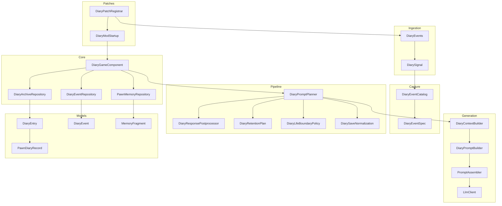

**Diagram sources**
- [DiaryPatchRegistrar.cs](../../../../Source/Patches/DiaryPatchRegistrar.cs)
- [DiaryModStartup.cs](../../../../Source/Patches/DiaryModStartup.cs)
- [DiarySignal.cs](../../../../Source/Ingestion/DiarySignal.cs)
- [DiaryEvents.cs](../../../../Source/Ingestion/DiaryEvents.cs)
- [DiaryEventCatalog.cs](../../../../Source/Capture/Catalog/DiaryEventCatalog.cs)
- [DiaryEventSpec.cs](../../../../Source/Capture/Catalog/DiaryEventSpec.cs)
- [DiaryGameComponent.cs](../../../../Source/Core/DiaryGameComponent.cs)
- [DiaryEventRepository.cs](../../../../Source/Core/DiaryEventRepository.cs)
- [DiaryArchiveRepository.cs](../../../../Source/Core/DiaryArchiveRepository.cs)
- [PawnMemoryRepository.cs](../../../../Source/Core/PawnMemoryRepository.cs)
- [DiaryPromptPlanner.cs](../../../../Source/Pipeline/DiaryPromptPlanner.cs)
- [DiaryResponsePostprocessor.cs](../../../../Source/Pipeline/DiaryResponsePostprocessor.cs)
- [DiaryRetentionPlan.cs](../../../../Source/Pipeline/DiaryRetentionPlan.cs)
- [DiaryLifeBoundaryPolicy.cs](../../../../Source/Pipeline/DiaryLifeBoundaryPolicy.cs)
- [DiarySaveNormalization.cs](../../../../Source/Pipeline/DiarySaveNormalization.cs)
- [DiaryContextBuilder.cs](../../../../Source/Generation/DiaryContextBuilder.cs)
- [DiaryPromptBuilder.cs](../../../../Source/Generation/DiaryPromptBuilder.cs)
- [PromptAssembler.cs](../../../../Source/Generation/PromptAssembler.cs)
- [LlmClient.cs](../../../../Source/Generation/LlmClient.cs)
- [DiaryEntry.cs](../../../../Source/Models/DiaryEntry.cs)
- [DiaryEvent.cs](../../../../Source/Models/DiaryEvent.cs)
- [MemoryFragment.cs](../../../../Source/Models/MemoryFragment.cs)
- [PawnDiaryRecord.cs](../../../../Source/Models/PawnDiaryRecord.cs)

**Section sources**
- [DiaryPatchRegistrar.cs](../../../../Source/Patches/DiaryPatchRegistrar.cs)
- [DiaryModStartup.cs](../../../../Source/Patches/DiaryModStartup.cs)
- [DiarySignal.cs](../../../../Source/Ingestion/DiarySignal.cs)
- [DiaryEvents.cs](../../../../Source/Ingestion/DiaryEvents.cs)
- [DiaryEventCatalog.cs](../../../../Source/Capture/Catalog/DiaryEventCatalog.cs)
- [DiaryEventSpec.cs](../../../../Source/Capture/Catalog/DiaryEventSpec.cs)
- [DiaryGameComponent.cs](../../../../Source/Core/DiaryGameComponent.cs)
- [DiaryEventRepository.cs](../../../../Source/Core/DiaryEventRepository.cs)
- [DiaryArchiveRepository.cs](../../../../Source/Core/DiaryArchiveRepository.cs)
- [PawnMemoryRepository.cs](../../../../Source/Core/PawnMemoryRepository.cs)
- [DiaryPromptPlanner.cs](../../../../Source/Pipeline/DiaryPromptPlanner.cs)
- [DiaryResponsePostprocessor.cs](../../../../Source/Pipeline/DiaryResponsePostprocessor.cs)
- [DiaryRetentionPlan.cs](../../../../Source/Pipeline/DiaryRetentionPlan.cs)
- [DiaryLifeBoundaryPolicy.cs](../../../../Source/Pipeline/DiaryLifeBoundaryPolicy.cs)
- [DiarySaveNormalization.cs](../../../../Source/Pipeline/DiarySaveNormalization.cs)
- [DiaryContextBuilder.cs](../../../../Source/Generation/DiaryContextBuilder.cs)
- [DiaryPromptBuilder.cs](../../../../Source/Generation/DiaryPromptBuilder.cs)
- [PromptAssembler.cs](../../../../Source/Generation/PromptAssembler.cs)
- [LlmClient.cs](../../../../Source/Generation/LlmClient.cs)
- [DiaryEntry.cs](../../../../Source/Models/DiaryEntry.cs)
- [DiaryEvent.cs](../../../../Source/Models/DiaryEvent.cs)
- [MemoryFragment.cs](../../../../Source/Models/MemoryFragment.cs)
- [PawnDiaryRecord.cs](../../../../Source/Models/PawnDiaryRecord.cs)

## Core Components
- Game component orchestration: A central game component coordinates subsystems such as dispatch, event windows, generation, retention, batching, lookup, public API, and voice/playlog features. It integrates with repositories and the pipeline.
- Event catalog and specs: A catalog registers event specifications that define how to capture and classify events. Specs provide typed metadata for each event kind.
- Signal ingestion: Signals represent incoming events from patches; a centralized registry maps signals to handlers and the capture layer.
- Repositories: Event repository persists and queries events; archive repository persists generated entries; pawn memory repository manages per-pawn memory fragments.
- Prompt planning and postprocessing: The planner selects relevant context and constructs prompts; the postprocessor refines responses and applies decorations.
- Retention and lifecycle: Policies govern entry lifespan, archival eligibility, normalization on save, and boundary conditions.
- Context and generation: Builders assemble rich context from multiple sources; prompt builders and assembler prepare requests for the LLM client.

**Section sources**
- [DiaryGameComponent.cs](../../../../Source/Core/DiaryGameComponent.cs)
- [DiaryEventCatalog.cs](../../../../Source/Capture/Catalog/DiaryEventCatalog.cs)
- [DiaryEventSpec.cs](../../../../Source/Capture/Catalog/DiaryEventSpec.cs)
- [DiarySignal.cs](../../../../Source/Ingestion/DiarySignal.cs)
- [DiaryEvents.cs](../../../../Source/Ingestion/DiaryEvents.cs)
- [DiaryEventRepository.cs](../../../../Source/Core/DiaryEventRepository.cs)
- [DiaryArchiveRepository.cs](../../../../Source/Core/DiaryArchiveRepository.cs)
- [PawnMemoryRepository.cs](../../../../Source/Core/PawnMemoryRepository.cs)
- [DiaryPromptPlanner.cs](../../../../Source/Pipeline/DiaryPromptPlanner.cs)
- [DiaryResponsePostprocessor.cs](../../../../Source/Pipeline/DiaryResponsePostprocessor.cs)
- [DiaryRetentionPlan.cs](../../../../Source/Pipeline/DiaryRetentionPlan.cs)
- [DiaryLifeBoundaryPolicy.cs](../../../../Source/Pipeline/DiaryLifeBoundaryPolicy.cs)
- [DiarySaveNormalization.cs](../../../../Source/Pipeline/DiarySaveNormalization.cs)
- [DiaryContextBuilder.cs](../../../../Source/Generation/DiaryContextBuilder.cs)
- [DiaryPromptBuilder.cs](../../../../Source/Generation/DiaryPromptBuilder.cs)
- [PromptAssembler.cs](../../../../Source/Generation/PromptAssembler.cs)
- [LlmClient.cs](../../../../Source/Generation/LlmClient.cs)

## Architecture Overview
The system follows an event-driven pipeline:
- Patches inject signals into the ingestion layer
- The ingestion layer routes signals to the capture catalog
- The capture layer normalizes signals into typed events
- The core orchestrates storage via repositories and triggers prompt planning
- The pipeline composes context, builds prompts, and posts results
- Entries are archived and exposed through the public API

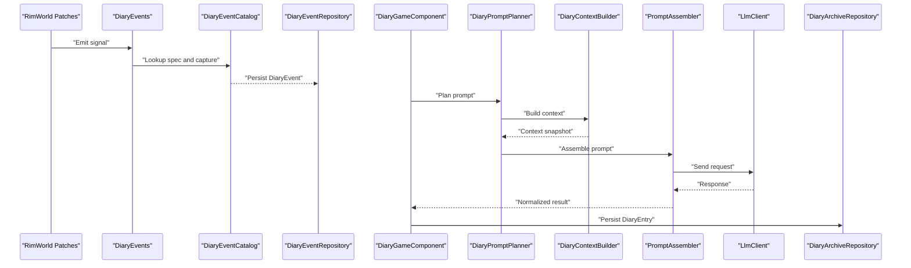

**Diagram sources**
- [DiaryEvents.cs](../../../../Source/Ingestion/DiaryEvents.cs)
- [DiaryEventCatalog.cs](../../../../Source/Capture/Catalog/DiaryEventCatalog.cs)
- [DiaryEventRepository.cs](../../../../Source/Core/DiaryEventRepository.cs)
- [DiaryGameComponent.cs](../../../../Source/Core/DiaryGameComponent.cs)
- [DiaryPromptPlanner.cs](../../../../Source/Pipeline/DiaryPromptPlanner.cs)
- [DiaryContextBuilder.cs](../../../../Source/Generation/DiaryContextBuilder.cs)
- [PromptAssembler.cs](../../../../Source/Generation/PromptAssembler.cs)
- [LlmClient.cs](../../../../Source/Generation/LlmClient.cs)
- [DiaryArchiveRepository.cs](../../../../Source/Core/DiaryArchiveRepository.cs)

## Detailed Component Analysis

### Game Component Lifecycle and Orchestration
The central game component initializes subsystems, subscribes to signals, schedules periodic tasks, and coordinates generation and retention. It exposes public API methods and integrates with external lanes and budgets.

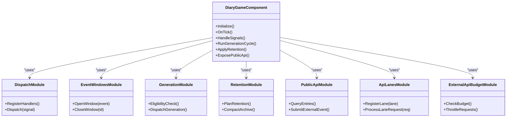

**Diagram sources**
- [DiaryGameComponent.cs](../../../../Source/Core/DiaryGameComponent.cs)
- [DiaryGameComponent.Dispatch.cs](../../../../Source/Core/DiaryGameComponent.Dispatch.cs)
- [DiaryGameComponent.EventWindows.cs](../../../../Source/Core/DiaryGameComponent.EventWindows.cs)
- [DiaryGameComponent.Generation.cs](../../../../Source/Core/DiaryGameComponent.Generation.cs)
- [DiaryGameComponent.EventRetention.cs](../../../../Source/Core/DiaryGameComponent.EventRetention.cs)
- [DiaryGameComponent.PublicApi.cs](../../../../Source/Core/DiaryGameComponent.PublicApi.cs)
- [DiaryGameComponent.ApiLanes.cs](../../../../Source/Core/DiaryGameComponent.ApiLanes.cs)
- [DiaryGameComponent.ExternalApiBudget.cs](../../../../Source/Core/DiaryGameComponent.ExternalApiBudget.cs)

**Section sources**
- [DiaryGameComponent.cs](../../../../Source/Core/DiaryGameComponent.cs)
- [DiaryGameComponent.Dispatch.cs](../../../../Source/Core/DiaryGameComponent.Dispatch.cs)
- [DiaryGameComponent.EventWindows.cs](../../../../Source/Core/DiaryGameComponent.EventWindows.cs)
- [DiaryGameComponent.Generation.cs](../../../../Source/Core/DiaryGameComponent.Generation.cs)
- [DiaryGameComponent.EventRetention.cs](../../../../Source/Core/DiaryGameComponent.EventRetention.cs)
- [DiaryGameComponent.PublicApi.cs](../../../../Source/Core/DiaryGameComponent.PublicApi.cs)
- [DiaryGameComponent.ApiLanes.cs](../../../../Source/Core/DiaryGameComponent.ApiLanes.cs)
- [DiaryGameComponent.ExternalApiBudget.cs](../../../../Source/Core/DiaryGameComponent.ExternalApiBudget.cs)

### Event Processing Pipeline: From Capture to Generation
This sequence shows how a game event becomes a diary entry.

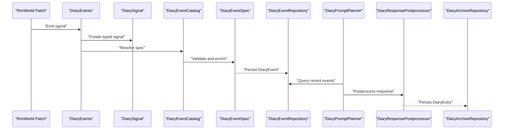

**Diagram sources**
- [DiaryEvents.cs](../../../../Source/Ingestion/DiaryEvents.cs)
- [DiarySignal.cs](../../../../Source/Ingestion/DiarySignal.cs)
- [DiaryEventCatalog.cs](../../../../Source/Capture/Catalog/DiaryEventCatalog.cs)
- [DiaryEventSpec.cs](../../../../Source/Capture/Catalog/DiaryEventSpec.cs)
- [DiaryEventRepository.cs](../../../../Source/Core/DiaryEventRepository.cs)
- [DiaryPromptPlanner.cs](../../../../Source/Pipeline/DiaryPromptPlanner.cs)
- [DiaryResponsePostprocessor.cs](../../../../Source/Pipeline/DiaryResponsePostprocessor.cs)
- [DiaryArchiveRepository.cs](../../../../Source/Core/DiaryArchiveRepository.cs)

**Section sources**
- [DiaryEvents.cs](../../../../Source/Ingestion/DiaryEvents.cs)
- [DiarySignal.cs](../../../../Source/Ingestion/DiarySignal.cs)
- [DiaryEventCatalog.cs](../../../../Source/Capture/Catalog/DiaryEventCatalog.cs)
- [DiaryEventSpec.cs](../../../../Source/Capture/Catalog/DiaryEventSpec.cs)
- [DiaryEventRepository.cs](../../../../Source/Core/DiaryEventRepository.cs)
- [DiaryPromptPlanner.cs](../../../../Source/Pipeline/DiaryPromptPlanner.cs)
- [DiaryResponsePostprocessor.cs](../../../../Source/Pipeline/DiaryResponsePostprocessor.cs)
- [DiaryArchiveRepository.cs](../../../../Source/Core/DiaryArchiveRepository.cs)

### Data Flow Between Components
Data moves through well-defined layers:
- Ingestion: signals carry raw event payloads
- Capture: specs normalize and validate payloads
- Core: repositories persist canonical models
- Pipeline: planners and builders compose context and prompts
- Generation: assembler prepares requests and parses responses
- Persistence: entries and memories are saved and normalized

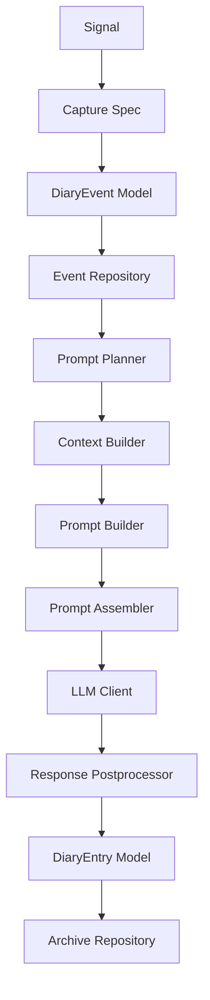

**Diagram sources**
- [DiarySignal.cs](../../../../Source/Ingestion/DiarySignal.cs)
- [DiaryEventSpec.cs](../../../../Source/Capture/Catalog/DiaryEventSpec.cs)
- [DiaryEvent.cs](../../../../Source/Models/DiaryEvent.cs)
- [DiaryEventRepository.cs](../../../../Source/Core/DiaryEventRepository.cs)
- [DiaryPromptPlanner.cs](../../../../Source/Pipeline/DiaryPromptPlanner.cs)
- [DiaryContextBuilder.cs](../../../../Source/Generation/DiaryContextBuilder.cs)
- [DiaryPromptBuilder.cs](../../../../Source/Generation/DiaryPromptBuilder.cs)
- [PromptAssembler.cs](../../../../Source/Generation/PromptAssembler.cs)
- [LlmClient.cs](../../../../Source/Generation/LlmClient.cs)
- [DiaryResponsePostprocessor.cs](../../../../Source/Pipeline/DiaryResponsePostprocessor.cs)
- [DiaryEntry.cs](../../../../Source/Models/DiaryEntry.cs)
- [DiaryArchiveRepository.cs](../../../../Source/Core/DiaryArchiveRepository.cs)

**Section sources**
- [DiarySignal.cs](../../../../Source/Ingestion/DiarySignal.cs)
- [DiaryEventSpec.cs](../../../../Source/Capture/Catalog/DiaryEventSpec.cs)
- [DiaryEvent.cs](../../../../Source/Models/DiaryEvent.cs)
- [DiaryEventRepository.cs](../../../../Source/Core/DiaryEventRepository.cs)
- [DiaryPromptPlanner.cs](../../../../Source/Pipeline/DiaryPromptPlanner.cs)
- [DiaryContextBuilder.cs](../../../../Source/Generation/DiaryContextBuilder.cs)
- [DiaryPromptBuilder.cs](../../../../Source/Generation/DiaryPromptBuilder.cs)
- [PromptAssembler.cs](../../../../Source/Generation/PromptAssembler.cs)
- [LlmClient.cs](../../../../Source/Generation/LlmClient.cs)
- [DiaryResponsePostprocessor.cs](../../../../Source/Pipeline/DiaryResponsePostprocessor.cs)
- [DiaryEntry.cs](../../../../Source/Models/DiaryEntry.cs)
- [DiaryArchiveRepository.cs](../../../../Source/Core/DiaryArchiveRepository.cs)

### Relationship Between Core Systems
- Event catalog and specs: Provide extensible mapping from signals to typed events and validation rules.
- Repositories: Abstract persistence for events, entries, and memories; enable querying and compaction.
- Memory management: Per-pawn memory fragments support recall and eviction strategies.
- Policy framework: Life boundary, retention, and normalization policies shape lifecycle and storage behavior.

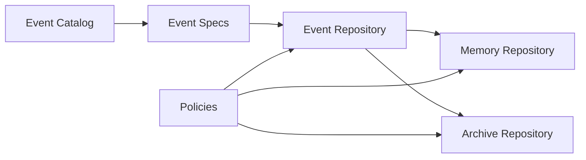

**Diagram sources**
- [DiaryEventCatalog.cs](../../../../Source/Capture/Catalog/DiaryEventCatalog.cs)
- [DiaryEventSpec.cs](../../../../Source/Capture/Catalog/DiaryEventSpec.cs)
- [DiaryEventRepository.cs](../../../../Source/Core/DiaryEventRepository.cs)
- [DiaryArchiveRepository.cs](../../../../Source/Core/DiaryArchiveRepository.cs)
- [PawnMemoryRepository.cs](../../../../Source/Core/PawnMemoryRepository.cs)
- [DiaryLifeBoundaryPolicy.cs](../../../../Source/Pipeline/DiaryLifeBoundaryPolicy.cs)
- [DiaryRetentionPlan.cs](../../../../Source/Pipeline/DiaryRetentionPlan.cs)
- [DiarySaveNormalization.cs](../../../../Source/Pipeline/DiarySaveNormalization.cs)

**Section sources**
- [DiaryEventCatalog.cs](../../../../Source/Capture/Catalog/DiaryEventCatalog.cs)
- [DiaryEventSpec.cs](../../../../Source/Capture/Catalog/DiaryEventSpec.cs)
- [DiaryEventRepository.cs](../../../../Source/Core/DiaryEventRepository.cs)
- [DiaryArchiveRepository.cs](../../../../Source/Core/DiaryArchiveRepository.cs)
- [PawnMemoryRepository.cs](../../../../Source/Core/PawnMemoryRepository.cs)
- [DiaryLifeBoundaryPolicy.cs](../../../../Source/Pipeline/DiaryLifeBoundaryPolicy.cs)
- [DiaryRetentionPlan.cs](../../../../Source/Pipeline/DiaryRetentionPlan.cs)
- [DiarySaveNormalization.cs](../../../../Source/Pipeline/DiarySaveNormalization.cs)

### System Boundaries and Integration Points
- RimWorld API integration: Patches register hooks and emit signals; startup initializes registries and components.
- Public API: Exposes query and submission endpoints for mods and tools.
- External lanes: Import/export lanes allow third-party systems to integrate via standardized requests and snapshots.
- Budget and override policies: Control external API usage and writing style overrides.

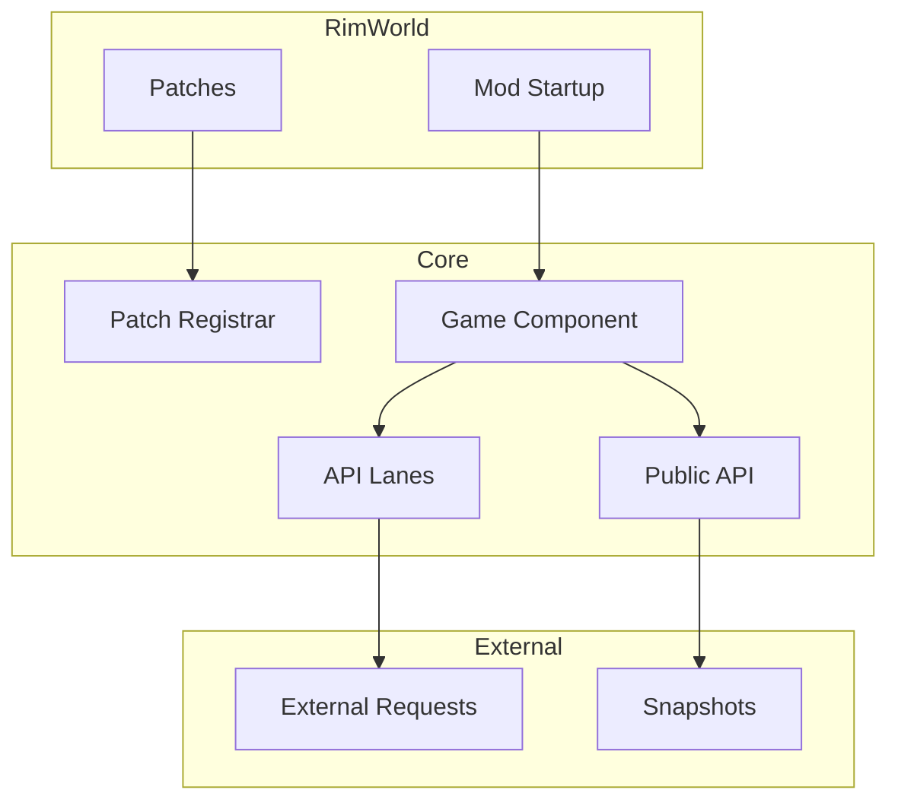

**Diagram sources**
- [DiaryPatchRegistrar.cs](../../../../Source/Patches/DiaryPatchRegistrar.cs)
- [DiaryModStartup.cs](../../../../Source/Patches/DiaryModStartup.cs)
- [DiaryGameComponent.cs](../../../../Source/Core/DiaryGameComponent.cs)
- [PawnDiaryApi.cs](../../../../Source/Integration/PawnDiaryApi.cs)
- [DiaryApiLaneSnapshot.cs](../../../../Source/Integration/DiaryApiLaneSnapshot.cs)
- [ExternalEventRequest.cs](../../../../Source/Integration/ExternalEventRequest.cs)

**Section sources**
- [DiaryPatchRegistrar.cs](../../../../Source/Patches/DiaryPatchRegistrar.cs)
- [DiaryModStartup.cs](../../../../Source/Patches/DiaryModStartup.cs)
- [DiaryGameComponent.cs](../../../../Source/Core/DiaryGameComponent.cs)
- [PawnDiaryApi.cs](../../../../Source/Integration/PawnDiaryApi.cs)
- [DiaryApiLaneSnapshot.cs](../../../../Source/Integration/DiaryApiLaneSnapshot.cs)
- [ExternalEventRequest.cs](../../../../Source/Integration/ExternalEventRequest.cs)

### Extension Mechanisms
- Capture capability registry: Allows adding new capture behaviors without modifying core logic.
- Context provider registry: Enables injecting additional context sources for prompt building.
- Listener registry: Supports subscribing to lifecycle or state changes.
- Policy framework: Offers pluggable policies for domains like royalty, odyssey, anomaly, and more.

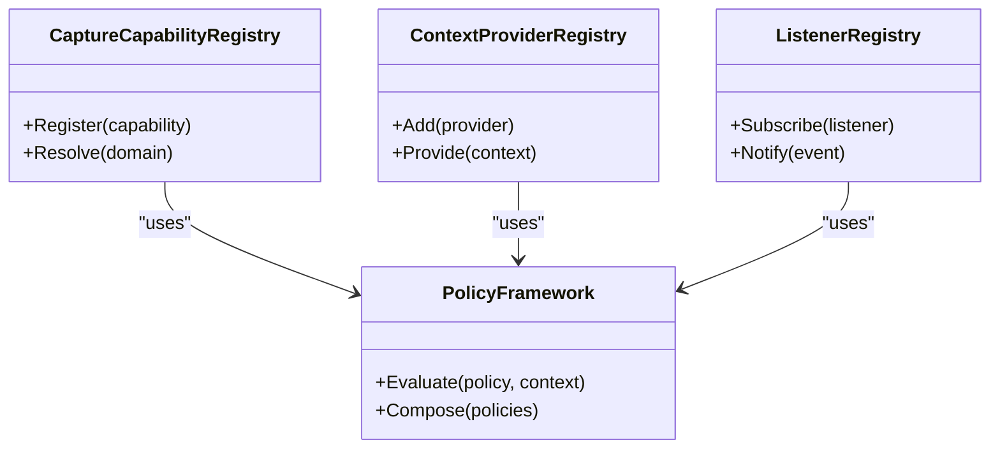

**Diagram sources**
- [CaptureCapabilityRegistry.cs](../../../../Source/Pipeline/CaptureCapabilityRegistry.cs)
- [ContextProviderRegistry.cs](../../../../Source/Pipeline/ContextProviderRegistry.cs)
- [ListenerRegistry.cs](../../../../Source/Pipeline/ListenerRegistry.cs)

**Section sources**
- [CaptureCapabilityRegistry.cs](../../../../Source/Pipeline/CaptureCapabilityRegistry.cs)
- [ContextProviderRegistry.cs](../../../../Source/Pipeline/ContextProviderRegistry.cs)
- [ListenerRegistry.cs](../../../../Source/Pipeline/ListenerRegistry.cs)

### Pipeline Contracts and Utilities
The pipeline defines contracts for prompt planning, text decoration, and formatting utilities. These ensure consistent processing across different domains and extensions.

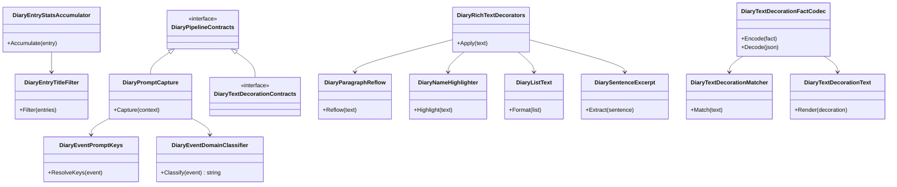

**Diagram sources**
- [DiaryPipelineContracts.cs](../../../../Source/Pipeline/DiaryPipelineContracts.cs)
- [DiaryPromptCapture.cs](../../../../Source/Pipeline/DiaryPromptCapture.cs)
- [DiaryEventPromptKeys.cs](../../../../Source/Pipeline/DiaryEventPromptKeys.cs)
- [DiaryEventDomainClassifier.cs](../../../../Source/Pipeline/DiaryEventDomainClassifier.cs)
- [DiaryEntryStatsAccumulator.cs](../../../../Source/Pipeline/DiaryEntryStatsAccumulator.cs)
- [DiaryEntryTitleFilter.cs](../../../../Source/Pipeline/DiaryEntryTitleFilter.cs)
- [DiaryRichTextDecorators.cs](../../../../Source/Pipeline/DiaryRichTextDecorators.cs)
- [DiaryParagraphReflow.cs](../../../../Source/Pipeline/DiaryParagraphReflow.cs)
- [DiaryNameHighlighter.cs](../../../../Source/Pipeline/DiaryNameHighlighter.cs)
- [DiaryListText.cs](../../../../Source/Pipeline/DiaryListText.cs)
- [DiarySentenceExcerpt.cs](../../../../Source/Pipeline/DiarySentenceExcerpt.cs)
- [DiaryTextDecorationContracts.cs](../../../../Source/Pipeline/DiaryTextDecorationContracts.cs)
- [DiaryTextDecorationFactCodec.cs](../../../../Source/Pipeline/DiaryTextDecorationFactCodec.cs)
- [DiaryTextDecorationMatcher.cs](../../../../Source/Pipeline/DiaryTextDecorationMatcher.cs)
- [DiaryTextDecorationText.cs](../../../../Source/Pipeline/DiaryTextDecorationText.cs)

**Section sources**
- [DiaryPipelineContracts.cs](../../../../Source/Pipeline/DiaryPipelineContracts.cs)
- [DiaryPromptCapture.cs](../../../../Source/Pipeline/DiaryPromptCapture.cs)
- [DiaryEventPromptKeys.cs](../../../../Source/Pipeline/DiaryEventPromptKeys.cs)
- [DiaryEventDomainClassifier.cs](../../../../Source/Pipeline/DiaryEventDomainClassifier.cs)
- [DiaryEntryStatsAccumulator.cs](../../../../Source/Pipeline/DiaryEntryStatsAccumulator.cs)
- [DiaryEntryTitleFilter.cs](../../../../Source/Pipeline/DiaryEntryTitleFilter.cs)
- [DiaryRichTextDecorators.cs](../../../../Source/Pipeline/DiaryRichTextDecorators.cs)
- [DiaryParagraphReflow.cs](../../../../Source/Pipeline/DiaryParagraphReflow.cs)
- [DiaryNameHighlighter.cs](../../../../Source/Pipeline/DiaryNameHighlighter.cs)
- [DiaryListText.cs](../../../../Source/Pipeline/DiaryListText.cs)
- [DiarySentenceExcerpt.cs](../../../../Source/Pipeline/DiarySentenceExcerpt.cs)
- [DiaryTextDecorationContracts.cs](../../../../Source/Pipeline/DiaryTextDecorationContracts.cs)
- [DiaryTextDecorationFactCodec.cs](../../../../Source/Pipeline/DiaryTextDecorationFactCodec.cs)
- [DiaryTextDecorationMatcher.cs](../../../../Source/Pipeline/DiaryTextDecorationMatcher.cs)
- [DiaryTextDecorationText.cs](../../../../Source/Pipeline/DiaryTextDecorationText.cs)

### Generation Subsystem
The generation subsystem composes context, builds prompts, and interacts with the LLM client. It includes caches and correlations for DLC-specific content and mood/persona influences.

```mermaid
classDiagram
class DiaryContextBuilder {
+Build(context)
}
class DiaryPromptBuilder {
+BuildPrompt(context)
}
class PromptAssembler {
+Assemble(prompt)
}
class LlmClient {
+Send(request) Response
}
class LlmResponseParser {
+Parse(response)
}
class MoodImpactClassifier {
+Classify(mood)
}
class PersonaAffinity {
+Compute(affinity)
}
class BodyModContext {
+Collect(context)
}
class DeathContextCache {
+Get(key)
}
class ArrivalContextCache {
+Get(key)
}
class BiotechBirthCorrelation {
+Correlate(birth)
}
class BiotechGrowthCorrelation {
+Correlate(growth)
}
class BiotechGeneMutationCorrelation {
+Correlate(mutation)
}
class CreepJoinerOutcomeScope {
+Enter(scope)
}
class ContainmentEscapeScopeStack {
+Push(scope)
}
class AnomalyRecentStudyCache {
+Get(recent)
}
class AnomalyStudySuppressionCache {
+Suppress(study)
}
class AnomalyTransientState {
+Update(state)
}
class DlcContext {
+Resolve(dlc)
}
class HumorCues {
+Select(cues)
}
class PersonaKillThoughtCorrelation {
+Correlate(kill)
}
class PsychotypeRolls {
+Roll(psychotype)
}
class RoyalMutationCorrelation {
+Correlate(mutation)
}
class RoyalPermitOwnerCache {
+Get(owner)
}
class RoyalSuccessionCorrelation {
+Correlate(succession)
}
class RoyalTitleThoughtCorrelation {
+Correlate(title)
}
class HediffPersonaOverrides {
+Apply(overrides)
}
class PawnFactCapture {
+Capture(pawn)
}
class DiaryBuckets {
+Bucket(events)
}
class DiaryContextFields {
+Extract(fields)
}
class DiaryPipelineAdapters {
+Adapt(input)
}
DiaryContextBuilder --> DiaryPromptBuilder
DiaryPromptBuilder --> PromptAssembler
PromptAssembler --> LlmClient
LlmClient --> LlmResponseParser
DiaryContextBuilder --> MoodImpactClassifier
DiaryContextBuilder --> PersonaAffinity
DiaryContextBuilder --> BodyModContext
DiaryContextBuilder --> DeathContextCache
DiaryContextBuilder --> ArrivalContextCache
DiaryContextBuilder --> BiotechBirthCorrelation
DiaryContextBuilder --> BiotechGrowthCorrelation
DiaryContextBuilder --> BiotechGeneMutationCorrelation
DiaryContextBuilder --> CreepJoinerOutcomeScope
DiaryContextBuilder --> ContainmentEscapeScopeStack
DiaryContextBuilder --> AnomalyRecentStudyCache
DiaryContextBuilder --> AnomalyStudySuppressionCache
DiaryContextBuilder --> AnomalyTransientState
DiaryContextBuilder --> DlcContext
DiaryContextBuilder --> HumorCues
DiaryContextBuilder --> PersonaKillThoughtCorrelation
DiaryContextBuilder --> PsychotypeRolls
DiaryContextBuilder --> RoyalMutationCorrelation
DiaryContextBuilder --> RoyalPermitOwnerCache
DiaryContextBuilder --> RoyalSuccessionCorrelation
DiaryContextBuilder --> RoyalTitleThoughtCorrelation
DiaryContextBuilder --> HediffPersonaOverrides
DiaryContextBuilder --> PawnFactCapture
DiaryContextBuilder --> DiaryBuckets
DiaryContextBuilder --> DiaryContextFields
DiaryContextBuilder --> DiaryPipelineAdapters
```

**Diagram sources**
- [DiaryContextBuilder.cs](../../../../Source/Generation/DiaryContextBuilder.cs)
- [DiaryPromptBuilder.cs](../../../../Source/Generation/DiaryPromptBuilder.cs)
- [PromptAssembler.cs](../../../../Source/Generation/PromptAssembler.cs)
- [LlmClient.cs](../../../../Source/Generation/LlmClient.cs)
- [LlmResponseParser.cs](../../../../Source/Generation/LlmResponseParser.cs)
- [MoodImpactClassifier.cs](../../../../Source/Generation/MoodImpactClassifier.cs)
- [PersonaAffinity.cs](../../../../Source/Generation/PersonaAffinity.cs)
- [BodyModContext.cs](../../../../Source/Generation/BodyModContext.cs)
- [DeathContextCache.cs](../../../../Source/Generation/DeathContextCache.cs)
- [ArrivalContextCache.cs](../../../../Source/Generation/ArrivalContextCache.cs)
- [BiotechBirthCorrelation.cs](../../../../Source/Generation/BiotechBirthCorrelation.cs)
- [BiotechGrowthCorrelation.cs](../../../../Source/Generation/BiotechGrowthCorrelation.cs)
- [BiotechGeneMutationCorrelation.cs](../../../../Source/Generation/BiotechGeneMutationCorrelation.cs)
- [CreepJoinerOutcomeScope.cs](../../../../Source/Generation/CreepJoinerOutcomeScope.cs)
- [ContainmentEscapeScopeStack.cs](../../../../Source/Generation/ContainmentEscapeScopeStack.cs)
- [AnomalyRecentStudyCache.cs](../../../../Source/Generation/AnomalyRecentStudyCache.cs)
- [AnomalyStudySuppressionCache.cs](../../../../Source/Generation/AnomalyStudySuppressionCache.cs)
- [AnomalyTransientState.cs](../../../../Source/Generation/AnomalyTransientState.cs)
- [DlcContext.cs](../../../../Source/Generation/DlcContext.cs)
- [HumorCues.cs](../../../../Source/Generation/HumorCues.cs)
- [PersonaKillThoughtCorrelation.cs](../../../../Source/Generation/PersonaKillThoughtCorrelation.cs)
- [PsychotypeRolls.cs](../../../../Source/Generation/PsychotypeRolls.cs)
- [RoyalMutationCorrelation.cs](../../../../Source/Generation/RoyalMutationCorrelation.cs)
- [RoyalPermitOwnerCache.cs](../../../../Source/Generation/RoyalPermitOwnerCache.cs)
- [RoyalSuccessionCorrelation.cs](../../../../Source/Generation/RoyalSuccessionCorrelation.cs)
- [RoyalTitleThoughtCorrelation.cs](../../../../Source/Generation/RoyalTitleThoughtCorrelation.cs)
- [HediffPersonaOverrides.cs](../../../../Source/Generation/HediffPersonaOverrides.cs)
- [PawnFactCapture.cs](../../../../Source/Generation/PawnFactCapture.cs)
- [DiaryBuckets.cs](../../../../Source/Generation/DiaryBuckets.cs)
- [DiaryContextFields.cs](../../../../Source/Generation/DiaryContextFields.cs)
- [DiaryPipelineAdapters.cs](../../../../Source/Generation/DiaryPipelineAdapters.cs)

**Section sources**
- [DiaryContextBuilder.cs](../../../../Source/Generation/DiaryContextBuilder.cs)
- [DiaryPromptBuilder.cs](../../../../Source/Generation/DiaryPromptBuilder.cs)
- [PromptAssembler.cs](../../../../Source/Generation/PromptAssembler.cs)
- [LlmClient.cs](../../../../Source/Generation/LlmClient.cs)
- [LlmResponseParser.cs](../../../../Source/Generation/LlmResponseParser.cs)
- [MoodImpactClassifier.cs](../../../../Source/Generation/MoodImpactClassifier.cs)
- [PersonaAffinity.cs](../../../../Source/Generation/PersonaAffinity.cs)
- [BodyModContext.cs](../../../../Source/Generation/BodyModContext.cs)
- [DeathContextCache.cs](../../../../Source/Generation/DeathContextCache.cs)
- [ArrivalContextCache.cs](../../../../Source/Generation/ArrivalContextCache.cs)
- [BiotechBirthCorrelation.cs](../../../../Source/Generation/BiotechBirthCorrelation.cs)
- [BiotechGrowthCorrelation.cs](../../../../Source/Generation/BiotechGrowthCorrelation.cs)
- [BiotechGeneMutationCorrelation.cs](../../../../Source/Generation/BiotechGeneMutationCorrelation.cs)
- [CreepJoinerOutcomeScope.cs](../../../../Source/Generation/CreepJoinerOutcomeScope.cs)
- [ContainmentEscapeScopeStack.cs](../../../../Source/Generation/ContainmentEscapeScopeStack.cs)
- [AnomalyRecentStudyCache.cs](../../../../Source/Generation/AnomalyRecentStudyCache.cs)
- [AnomalyStudySuppressionCache.cs](../../../../Source/Generation/AnomalyStudySuppressionCache.cs)
- [AnomalyTransientState.cs](../../../../Source/Generation/AnomalyTransientState.cs)
- [DlcContext.cs](../../../../Source/Generation/DlcContext.cs)
- [HumorCues.cs](../../../../Source/Generation/HumorCues.cs)
- [PersonaKillThoughtCorrelation.cs](../../../../Source/Generation/PersonaKillThoughtCorrelation.cs)
- [PsychotypeRolls.cs](../../../../Source/Generation/PsychotypeRolls.cs)
- [RoyalMutationCorrelation.cs](../../../../Source/Generation/RoyalMutationCorrelation.cs)
- [RoyalPermitOwnerCache.cs](../../../../Source/Generation/RoyalPermitOwnerCache.cs)
- [RoyalSuccessionCorrelation.cs](../../../../Source/Generation/RoyalSuccessionCorrelation.cs)
- [RoyalTitleThoughtCorrelation.cs](../../../../Source/Generation/RoyalTitleThoughtCorrelation.cs)
- [HediffPersonaOverrides.cs](../../../../Source/Generation/HediffPersonaOverrides.cs)
- [PawnFactCapture.cs](../../../../Source/Generation/PawnFactCapture.cs)
- [DiaryBuckets.cs](../../../../Source/Generation/DiaryBuckets.cs)
- [DiaryContextFields.cs](../../../../Source/Generation/DiaryContextFields.cs)
- [DiaryPipelineAdapters.cs](../../../../Source/Generation/DiaryPipelineAdapters.cs)

### Memory Management Strategies
- Memory fragments: Represent discrete recollections tied to pawns.
- Eviction planning: Determines which memories to remove based on relevance and age.
- Recall selection: Chooses appropriate memories for context building.
- Extraction: Converts raw events into structured memory units.

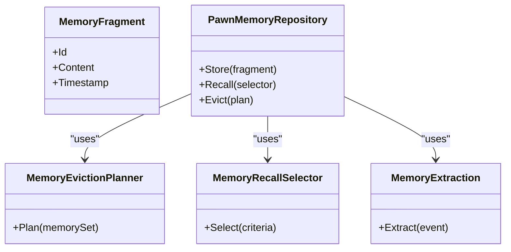

**Diagram sources**
- [MemoryFragment.cs](../../../../Source/Models/MemoryFragment.cs)
- [PawnMemoryRepository.cs](../../../../Source/Core/PawnMemoryRepository.cs)
- [MemoryEvictionPlanner.cs](../../../../Source/Pipeline/Memory/MemoryEvictionPlanner.cs)
- [MemoryRecallSelector.cs](../../../../Source/Pipeline/Memory/MemoryRecallSelector.cs)
- [MemoryExtraction.cs](../../../../Source/Pipeline/Memory/MemoryExtraction.cs)

**Section sources**
- [MemoryFragment.cs](../../../../Source/Models/MemoryFragment.cs)
- [PawnMemoryRepository.cs](../../../../Source/Core/PawnMemoryRepository.cs)
- [MemoryEvictionPlanner.cs](../../../../Source/Pipeline/Memory/MemoryEvictionPlanner.cs)
- [MemoryRecallSelector.cs](../../../../Source/Pipeline/Memory/MemoryRecallSelector.cs)
- [MemoryExtraction.cs](../../../../Source/Pipeline/Memory/MemoryExtraction.cs)

### Narrative Continuity and Reflection
Narrative continuity ensures coherent storytelling across sessions and events. Reflection coordination helps schedule and process reflective entries.

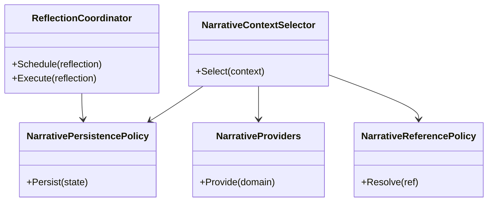

**Diagram sources**
- [NarrativeContextSelector.cs](../../../../Source/Pipeline/Narrative/NarrativeContextSelector.cs)
- [NarrativePersistencePolicy.cs](../../../../Source/Pipeline/Narrative/NarrativePersistencePolicy.cs)
- [NarrativeProviders.cs](../../../../Source/Pipeline/Narrative/NarrativeProviders.cs)
- [NarrativeReferencePolicy.cs](../../../../Source/Pipeline/Narrative/NarrativeReferencePolicy.cs)
- [ReflectionCoordinator.cs](../../../../Source/Pipeline/Narrative/ReflectionCoordinator.cs)

**Section sources**
- [NarrativeContextSelector.cs](../../../../Source/Pipeline/Narrative/NarrativeContextSelector.cs)
- [NarrativePersistencePolicy.cs](../../../../Source/Pipeline/Narrative/NarrativePersistencePolicy.cs)
- [NarrativeProviders.cs](../../../../Source/Pipeline/Narrative/NarrativeProviders.cs)
- [NarrativeReferencePolicy.cs](../../../../Source/Pipeline/Narrative/NarrativeReferencePolicy.cs)
- [ReflectionCoordinator.cs](../../../../Source/Pipeline/Narrative/ReflectionCoordinator.cs)

### Royalty Domain Policies
Specialized policies handle royal ascent, mutations, permits, succession, titles, and persona-related correlations.

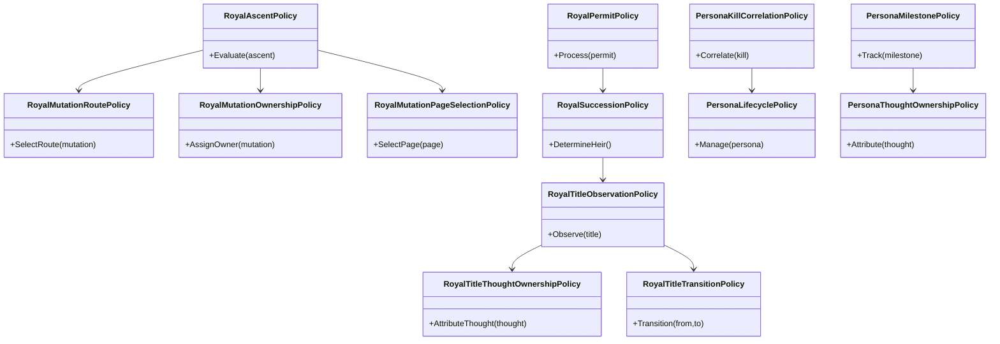

**Diagram sources**
- [RoyalAscentPolicy.cs](../../../../Source/Pipeline/Royalty/RoyalAscentPolicy.cs)
- [RoyalMutationRoutePolicy.cs](../../../../Source/Pipeline/Royalty/RoyalMutationRoutePolicy.cs)
- [RoyalMutationOwnershipPolicy.cs](../../../../Source/Pipeline/Royalty/RoyalMutationOwnershipPolicy.cs)
- [RoyalMutationPageSelectionPolicy.cs](../../../../Source/Pipeline/Royalty/RoyalMutationPageSelectionPolicy.cs)
- [RoyalPermitPolicy.cs](../../../../Source/Pipeline/Royalty/RoyalPermitPolicy.cs)
- [RoyalSuccessionPolicy.cs](../../../../Source/Pipeline/Royalty/RoyalSuccessionPolicy.cs)
- [RoyalTitleObservationPolicy.cs](../../../../Source/Pipeline/Royalty/RoyalTitleObservationPolicy.cs)
- [RoyalTitleThoughtOwnershipPolicy.cs](../../../../Source/Pipeline/Royalty/RoyalTitleThoughtOwnershipPolicy.cs)
- [RoyalTitleTransitionPolicy.cs](../../../../Source/Pipeline/Royalty/RoyalTitleTransitionPolicy.cs)
- [PersonaKillCorrelationPolicy.cs](../../../../Source/Pipeline/Royalty/PersonaKillCorrelationPolicy.cs)
- [PersonaLifecyclePolicy.cs](../../../../Source/Pipeline/Royalty/PersonaLifecyclePolicy.cs)
- [PersonaMilestonePolicy.cs](../../../../Source/Pipeline/Royalty/PersonaMilestonePolicy.cs)
- [PersonaThoughtOwnershipPolicy.cs](../../../../Source/Pipeline/Royalty/PersonaThoughtOwnershipPolicy.cs)

**Section sources**
- [RoyalAscentPolicy.cs](../../../../Source/Pipeline/Royalty/RoyalAscentPolicy.cs)
- [RoyalMutationRoutePolicy.cs](../../../../Source/Pipeline/Royalty/RoyalMutationRoutePolicy.cs)
- [RoyalMutationOwnershipPolicy.cs](../../../../Source/Pipeline/Royalty/RoyalMutationOwnershipPolicy.cs)
- [RoyalMutationPageSelectionPolicy.cs](../../../../Source/Pipeline/Royalty/RoyalMutationPageSelectionPolicy.cs)
- [RoyalPermitPolicy.cs](../../../../Source/Pipeline/Royalty/RoyalPermitPolicy.cs)
- [RoyalSuccessionPolicy.cs](../../../../Source/Pipeline/Royalty/RoyalSuccessionPolicy.cs)
- [RoyalTitleObservationPolicy.cs](../../../../Source/Pipeline/Royalty/RoyalTitleObservationPolicy.cs)
- [RoyalTitleThoughtOwnershipPolicy.cs](../../../../Source/Pipeline/Royalty/RoyalTitleThoughtOwnershipPolicy.cs)
- [RoyalTitleTransitionPolicy.cs](../../../../Source/Pipeline/Royalty/RoyalTitleTransitionPolicy.cs)
- [PersonaKillCorrelationPolicy.cs](../../../../Source/Pipeline/Royalty/PersonaKillCorrelationPolicy.cs)
- [PersonaLifecyclePolicy.cs](../../../../Source/Pipeline/Royalty/PersonaLifecyclePolicy.cs)
- [PersonaMilestonePolicy.cs](../../../../Source/Pipeline/Royalty/PersonaMilestonePolicy.cs)
- [PersonaThoughtOwnershipPolicy.cs](../../../../Source/Pipeline/Royalty/PersonaThoughtOwnershipPolicy.cs)

## Dependency Analysis
High-level dependencies between major subsystems:

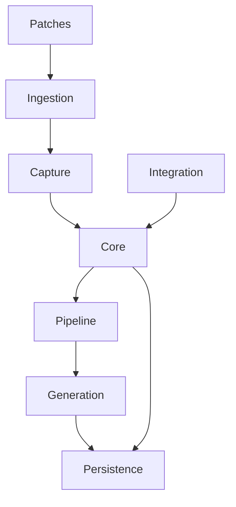

**Diagram sources**
- [DiaryPatchRegistrar.cs](../../../../Source/Patches/DiaryPatchRegistrar.cs)
- [DiaryEvents.cs](../../../../Source/Ingestion/DiaryEvents.cs)
- [DiaryEventCatalog.cs](../../../../Source/Capture/Catalog/DiaryEventCatalog.cs)
- [DiaryGameComponent.cs](../../../../Source/Core/DiaryGameComponent.cs)
- [DiaryPromptPlanner.cs](../../../../Source/Pipeline/DiaryPromptPlanner.cs)
- [DiaryContextBuilder.cs](../../../../Source/Generation/DiaryContextBuilder.cs)
- [DiaryArchiveRepository.cs](../../../../Source/Core/DiaryArchiveRepository.cs)
- [PawnDiaryApi.cs](../../../../Source/Integration/PawnDiaryApi.cs)

**Section sources**
- [DiaryPatchRegistrar.cs](../../../../Source/Patches/DiaryPatchRegistrar.cs)
- [DiaryEvents.cs](../../../../Source/Ingestion/DiaryEvents.cs)
- [DiaryEventCatalog.cs](../../../../Source/Capture/Catalog/DiaryEventCatalog.cs)
- [DiaryGameComponent.cs](../../../../Source/Core/DiaryGameComponent.cs)
- [DiaryPromptPlanner.cs](../../../../Source/Pipeline/DiaryPromptPlanner.cs)
- [DiaryContextBuilder.cs](../../../../Source/Generation/DiaryContextBuilder.cs)
- [DiaryArchiveRepository.cs](../../../../Source/Core/DiaryArchiveRepository.cs)
- [PawnDiaryApi.cs](../../../../Source/Integration/PawnDiaryApi.cs)

## Performance Considerations
- Batch processing: Interaction and tale batching reduce overhead during high-frequency events.
- Caching: Context caches (death, arrival), study caches (anomaly), and permit owner caches minimize repeated lookups.
- Budget control: External API budget policies throttle and prioritize requests to avoid spikes.
- Text optimization: Paragraph reflow, name highlighting, and list formatting improve rendering efficiency.
- Normalization: Save normalization reduces complexity and improves load times.
- Retention planning: Compaction and eligibility checks keep archives lean.

[No sources needed since this section provides general guidance]

## Troubleshooting Guide
Common areas to inspect when diagnosing issues:
- Patch registration and safety wrappers: Ensure patches are correctly registered and safe.
- Signal routing: Verify signals reach the ingestion layer and resolve to correct specs.
- Repository consistency: Check event and archive persistence for missing or corrupted entries.
- Prompt planning failures: Inspect planner decisions and context availability.
- LLM client errors: Review request construction and response parsing.
- Retention anomalies: Validate retention plans and archival eligibility.

**Section sources**
- [DiaryPatchRegistrar.cs](../../../../Source/Patches/DiaryPatchRegistrar.cs)
- [DiaryPatchSafety.cs](../../../../Source/Patches/DiaryPatchSafety.cs)
- [DiaryEvents.cs](../../../../Source/Ingestion/DiaryEvents.cs)
- [DiaryEventRepository.cs](../../../../Source/Core/DiaryEventRepository.cs)
- [DiaryArchiveRepository.cs](../../../../Source/Core/DiaryArchiveRepository.cs)
- [DiaryPromptPlanner.cs](../../../../Source/Pipeline/DiaryPromptPlanner.cs)
- [LlmClient.cs](../../../../Source/Generation/LlmClient.cs)
- [LlmResponseParser.cs](../../../../Source/Generation/LlmResponseParser.cs)
- [DiaryRetentionPlan.cs](../../../../Source/Pipeline/DiaryRetentionPlan.cs)
- [DiaryArchiveEligibility.cs](../../../../Source/Pipeline/DiaryArchiveEligibility.cs)

## Conclusion
Pawn Diary’s architecture leverages event-driven design, repository abstractions, and modular components to deliver a scalable and extensible narrative system. The clear separation of concerns—capture, ingestion, core orchestration, pipeline, generation, and persistence—enables robust integration with RimWorld and external systems while maintaining performance and memory efficiency. Policy-based extension points facilitate DLC support and third-party bridges, ensuring long-term adaptability.
