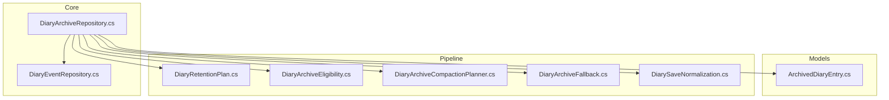
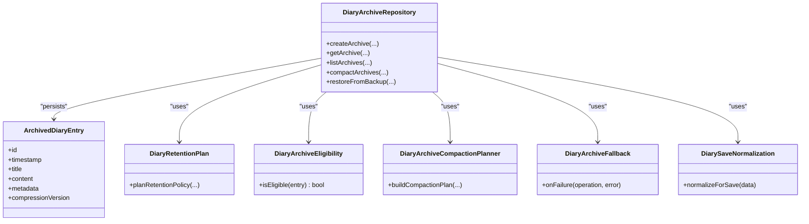
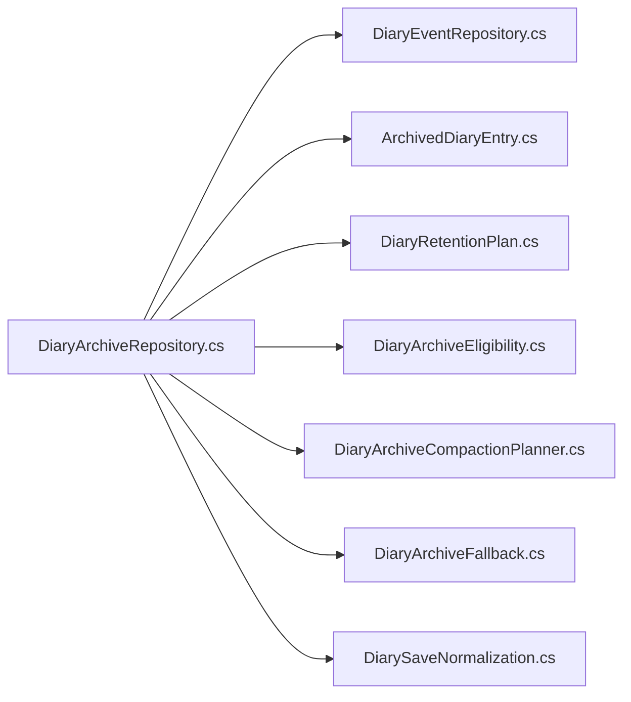

# Archive Management

<cite>
**Referenced Files in This Document**
- [DiaryArchiveRepository.cs](../../../../../Source/Core/DiaryArchiveRepository.cs)
- [ArchivedDiaryEntry.cs](../../../../../Source/Models/ArchivedDiaryEntry.cs)
- [DiaryEventRepository.cs](../../../../../Source/Core/DiaryEventRepository.cs)
- [DiaryRetentionPlan.cs](../../../../../Source/Pipeline/DiaryRetentionPlan.cs)
- [DiaryArchiveCompactionPlanner.cs](../../../../../Source/Pipeline/DiaryArchiveCompactionPlanner.cs)
- [DiaryArchiveEligibility.cs](../../../../../Source/Pipeline/DiaryArchiveEligibility.cs)
- [DiaryArchiveFallback.cs](../../../../../Source/Pipeline/DiaryArchiveFallback.cs)
- [DiarySaveNormalization.cs](../../../../../Source/Pipeline/DiarySaveNormalization.cs)
</cite>

## Table of Contents
1. [Introduction](#introduction)
2. [Project Structure](#project-structure)
3. [Core Components](#core-components)
4. [Architecture Overview](#architecture-overview)
5. [Detailed Component Analysis](#detailed-component-analysis)
6. [Dependency Analysis](#dependency-analysis)
7. [Performance Considerations](#performance-considerations)
8. [Troubleshooting Guide](#troubleshooting-guide)
9. [Conclusion](#conclusion)
10. [Appendices](#appendices)

## Introduction
This document explains the archive management system used for long-term storage of diary entries. It focuses on how archived entries are created, compressed, stored, and retrieved efficiently; how compaction strategies reduce storage footprint; and how versioning, migration, and backup procedures can be implemented around the existing components. The primary repository class is DiaryArchiveRepository, which coordinates archival workflows with supporting pipeline components for retention planning, eligibility checks, compaction planning, fallback handling, and save normalization.

## Project Structure
The archive subsystem spans core repositories, models, and pipeline policies:
- Core repository orchestrating archives and events
- Model representing an archived entry
- Pipeline components for retention planning, eligibility, compaction, fallback, and normalization

**Diagram sources**
- [DiaryArchiveRepository.cs](../../../../../Source/Core/DiaryArchiveRepository.cs)
- [DiaryEventRepository.cs](../../../../../Source/Core/DiaryEventRepository.cs)
- [ArchivedDiaryEntry.cs](../../../../../Source/Models/ArchivedDiaryEntry.cs)
- [DiaryRetentionPlan.cs](../../../../../Source/Pipeline/DiaryRetentionPlan.cs)
- [DiaryArchiveEligibility.cs](../../../../../Source/Pipeline/DiaryArchiveEligibility.cs)
- [DiaryArchiveCompactionPlanner.cs](../../../../../Source/Pipeline/DiaryArchiveCompactionPlanner.cs)
- [DiaryArchiveFallback.cs](../../../../../Source/Pipeline/DiaryArchiveFallback.cs)
- [DiarySaveNormalization.cs](../../../../../Source/Pipeline/DiarySaveNormalization.cs)

**Section sources**
- [DiaryArchiveRepository.cs](../../../../../Source/Core/DiaryArchiveRepository.cs)
- [DiaryEventRepository.cs](../../../../../Source/Core/DiaryEventRepository.cs)
- [ArchivedDiaryEntry.cs](../../../../../Source/Models/ArchivedDiaryEntry.cs)
- [DiaryRetentionPlan.cs](../../../../../Source/Pipeline/DiaryRetentionPlan.cs)
- [DiaryArchiveEligibility.cs](../../../../../Source/Pipeline/DiaryArchiveEligibility.cs)
- [DiaryArchiveCompactionPlanner.cs](../../../../../Source/Pipeline/DiaryArchiveCompactionPlanner.cs)
- [DiaryArchiveFallback.cs](../../../../../Source/Pipeline/DiaryArchiveFallback.cs)
- [DiarySaveNormalization.cs](../../../../../Source/Pipeline/DiarySaveNormalization.cs)

## Core Components
- DiaryArchiveRepository: Central coordinator for creating, retrieving, and managing archives. It integrates with event repositories and pipeline policies to plan, execute, and recover from archival operations.
- ArchivedDiaryEntry: Data model for a single archived diary entry, including metadata and payload fields suitable for compression and persistence.
- DiaryRetentionPlan: Determines which entries qualify for archiving based on time-based or policy-driven rules.
- DiaryArchiveEligibility: Encapsulates criteria that decide whether an entry should be moved into long-term storage.
- DiaryArchiveCompactionPlanner: Designs compaction plans to merge or reorganize archived data to improve space efficiency.
- DiaryArchiveFallback: Provides safe fallback behavior when archival or compaction fails, ensuring consistency.
- DiarySaveNormalization: Normalizes serialized forms before saving to ensure consistent versions and compatibility.

**Section sources**
- [DiaryArchiveRepository.cs](../../../../../Source/Core/DiaryArchiveRepository.cs)
- [ArchivedDiaryEntry.cs](../../../../../Source/Models/ArchivedDiaryEntry.cs)
- [DiaryRetentionPlan.cs](../../../../../Source/Pipeline/DiaryRetentionPlan.cs)
- [DiaryArchiveEligibility.cs](../../../../../Source/Pipeline/DiaryArchiveEligibility.cs)
- [DiaryArchiveCompactionPlanner.cs](../../../../../Source/Pipeline/DiaryArchiveCompactionPlanner.cs)
- [DiaryArchiveFallback.cs](../../../../../Source/Pipeline/DiaryArchiveFallback.cs)
- [DiarySaveNormalization.cs](../../../../../Source/Pipeline/DiarySaveNormalization.cs)

## Architecture Overview
The archive system follows a layered architecture:
- Repository layer (DiaryArchiveRepository) exposes high-level operations for archive lifecycle management.
- Model layer (ArchivedDiaryEntry) defines the persisted shape of archived content.
- Pipeline layer provides pluggable policies for retention, eligibility, compaction, fallback, and normalization.

**Diagram sources**
- [DiaryArchiveRepository.cs](../../../../../Source/Core/DiaryArchiveRepository.cs)
- [ArchivedDiaryEntry.cs](../../../../../Source/Models/ArchivedDiaryEntry.cs)
- [DiaryRetentionPlan.cs](../../../../../Source/Pipeline/DiaryRetentionPlan.cs)
- [DiaryArchiveEligibility.cs](../../../../../Source/Pipeline/DiaryArchiveEligibility.cs)
- [DiaryArchiveCompactionPlanner.cs](../../../../../Source/Pipeline/DiaryArchiveCompactionPlanner.cs)
- [DiaryArchiveFallback.cs](../../../../../Source/Pipeline/DiaryArchiveFallback.cs)
- [DiarySaveNormalization.cs](../../../../../Source/Pipeline/DiarySaveNormalization.cs)

## Detailed Component Analysis

### DiaryArchiveRepository
Responsibilities:
- Orchestrates creation of new archives by selecting eligible entries and applying retention policies.
- Retrieves historical entries from archives with efficient access patterns.
- Manages compaction cycles to consolidate and compress archived data.
- Handles failures via fallback mechanisms and ensures normalized saves.

Key interactions:
- Uses DiaryEventRepository to source entries for archival.
- Applies DiaryRetentionPlan and DiaryArchiveEligibility to determine what to archive.
- Leverages DiaryArchiveCompactionPlanner to build compaction tasks.
- Ensures data integrity using DiaryArchiveFallback and DiarySaveNormalization.

Example usage scenarios:
- Creating an archive:
  - Identify eligible entries using retention and eligibility policies.
  - Compress and persist entries as ArchivedDiaryEntry objects.
  - Record metadata and version information for future migrations.
- Retrieving historical entries:
  - Query archives by date range or filters.
  - Decompress and reconstruct entries for consumption.
- Managing lifecycle:
  - Schedule periodic compaction to reduce storage overhead.
  - Validate and repair archives using fallback logic.
- Optimizing storage:
  - Apply compaction plans to merge small segments.
  - Normalize saved formats to maintain compatibility across versions.

**Section sources**
- [DiaryArchiveRepository.cs](../../../../../Source/Core/DiaryArchiveRepository.cs)
- [DiaryEventRepository.cs](../../../../../Source/Core/DiaryEventRepository.cs)
- [DiaryRetentionPlan.cs](../../../../../Source/Pipeline/DiaryRetentionPlan.cs)
- [DiaryArchiveEligibility.cs](../../../../../Source/Pipeline/DiaryArchiveEligibility.cs)
- [DiaryArchiveCompactionPlanner.cs](../../../../../Source/Pipeline/DiaryArchiveCompactionPlanner.cs)
- [DiaryArchiveFallback.cs](../../../../../Source/Pipeline/DiaryArchiveFallback.cs)
- [DiarySaveNormalization.cs](../../../../../Source/Pipeline/DiarySaveNormalization.cs)

### ArchivedDiaryEntry Model
Structure overview:
- Identifier: unique ID for each archived entry.
- Timestamp: creation or capture time for chronological ordering.
- Title: human-readable summary of the entry.
- Content: main body text or structured payload.
- Metadata: additional context such as tags, provenance, or external references.
- Compression version: indicates the algorithm and format version used for this entry’s payload.

Design considerations:
- Fields are chosen to support efficient indexing and retrieval.
- Compression version enables migration and backward compatibility.
- Metadata supports flexible enrichment without changing core schema.

**Section sources**
- [ArchivedDiaryEntry.cs](../../../../../Source/Models/ArchivedDiaryEntry.cs)

### Retention Planning and Eligibility
Retention planning determines which entries should be archived based on configurable policies (e.g., age thresholds, event types). Eligibility refines selection by checking specific conditions (e.g., relevance, sensitivity, size). Together they form a two-stage filter:
- Plan stage: broad categorization and scheduling.
- Eligibility stage: fine-grained validation per entry.

Operational flow:
- Build retention plan for a given time window.
- For each candidate entry, evaluate eligibility.
- Produce a list of entries ready for archival.

**Section sources**
- [DiaryRetentionPlan.cs](../../../../../Source/Pipeline/DiaryRetentionPlan.cs)
- [DiaryArchiveEligibility.cs](../../../../../Source/Pipeline/DiaryArchiveEligibility.cs)

### Compaction Strategy
Compaction consolidates multiple small archives into fewer, larger segments to improve read performance and reduce overhead. The compaction planner:
- Analyzes current archive layout.
- Identifies candidates for merging based on size, recency, and fragmentation.
- Produces a plan detailing which segments to combine and how to update indexes.

Benefits:
- Reduced number of files or segments.
- Better sequential reads for historical queries.
- Lower metadata overhead.

**Section sources**
- [DiaryArchiveCompactionPlanner.cs](../../../../../Source/Pipeline/DiaryArchiveCompactionPlanner.cs)

### Fallback and Save Normalization
Fallback strategy ensures resilience:
- On failure during create or compact operations, rollback partial changes.
- Log diagnostics and mark affected archives for retry.
- Provide safe defaults to keep the system operational.

Save normalization guarantees:
- Consistent serialization format across versions.
- Compatibility checks before writing.
- Version tagging to enable future migrations.

**Section sources**
- [DiaryArchiveFallback.cs](../../../../../Source/Pipeline/DiaryArchiveFallback.cs)
- [DiarySaveNormalization.cs](../../../../../Source/Pipeline/DiarySaveNormalization.cs)

## Dependency Analysis
The following diagram shows how the repository depends on pipeline components and the model:

**Diagram sources**
- [DiaryArchiveRepository.cs](../../../../../Source/Core/DiaryArchiveRepository.cs)
- [DiaryEventRepository.cs](../../../../../Source/Core/DiaryEventRepository.cs)
- [ArchivedDiaryEntry.cs](../../../../../Source/Models/ArchivedDiaryEntry.cs)
- [DiaryRetentionPlan.cs](../../../../../Source/Pipeline/DiaryRetentionPlan.cs)
- [DiaryArchiveEligibility.cs](../../../../../Source/Pipeline/DiaryArchiveEligibility.cs)
- [DiaryArchiveCompactionPlanner.cs](../../../../../Source/Pipeline/DiaryArchiveCompactionPlanner.cs)
- [DiaryArchiveFallback.cs](../../../../../Source/Pipeline/DiaryArchiveFallback.cs)
- [DiarySaveNormalization.cs](../../../../../Source/Pipeline/DiarySaveNormalization.cs)

**Section sources**
- [DiaryArchiveRepository.cs](../../../../../Source/Core/DiaryArchiveRepository.cs)
- [DiaryEventRepository.cs](../../../../../Source/Core/DiaryEventRepository.cs)
- [ArchivedDiaryEntry.cs](../../../../../Source/Models/ArchivedDiaryEntry.cs)
- [DiaryRetentionPlan.cs](../../../../../Source/Pipeline/DiaryRetentionPlan.cs)
- [DiaryArchiveEligibility.cs](../../../../../Source/Pipeline/DiaryArchiveEligibility.cs)
- [DiaryArchiveCompactionPlanner.cs](../../../../../Source/Pipeline/DiaryArchiveCompactionPlanner.cs)
- [DiaryArchiveFallback.cs](../../../../../Source/Pipeline/DiaryArchiveFallback.cs)
- [DiarySaveNormalization.cs](../../../../../Source/Pipeline/DiarySaveNormalization.cs)

## Performance Considerations
- Batch operations: Group entries into batches for create and retrieve to minimize I/O overhead.
- Indexing: Maintain lightweight indexes over timestamps and titles to accelerate queries.
- Compression tuning: Choose algorithms and block sizes that balance CPU usage and storage savings.
- Compaction frequency: Schedule compaction during low-activity periods to avoid contention.
- Read path optimization: Cache frequently accessed recent archives while keeping older ones on slower storage.

[No sources needed since this section provides general guidance]

## Troubleshooting Guide
Common issues and resolutions:
- Archive creation failures:
  - Check eligibility and retention policies for misconfigurations.
  - Inspect fallback logs for detailed error context.
- Slow retrieval:
  - Verify index integrity and consider running compaction.
  - Ensure normalization has not introduced incompatible formats.
- Storage growth:
  - Review compaction plan effectiveness and adjust thresholds.
  - Confirm that old archives are being pruned according to retention policy.

Operational steps:
- Use fallback mechanisms to roll back partial writes.
- Re-run normalization on corrupted or mismatched entries.
- Monitor compaction metrics to detect fragmentation early.

**Section sources**
- [DiaryArchiveFallback.cs](../../../../../Source/Pipeline/DiaryArchiveFallback.cs)
- [DiarySaveNormalization.cs](../../../../../Source/Pipeline/DiarySaveNormalization.cs)

## Conclusion
The archive management system centers on DiaryArchiveRepository, which coordinates retention planning, eligibility checks, compaction, fallback handling, and save normalization to provide robust long-term storage for diary entries. By leveraging the ArchivedDiaryEntry model and pipeline policies, the system achieves efficient compression, reliable retrieval, and scalable storage management. Proper versioning, migration strategies, and backup procedures further enhance durability and maintainability.

[No sources needed since this section summarizes without analyzing specific files]

## Appendices

### Example Workflows

#### Creating Archives
- Select entries using retention and eligibility policies.
- Compress payloads and construct ArchivedDiaryEntry instances.
- Persist with normalized formats and version tags.
- Update indexes and metadata.

#### Retrieving Historical Entries
- Query by date range or filters.
- Load relevant archives and decompress entries.
- Return results in a stable order and format.

#### Managing Archive Lifecycle
- Schedule periodic compaction to consolidate segments.
- Validate archives and repair inconsistencies using fallback logic.
- Prune outdated archives per retention policy.

#### Optimizing Storage Space
- Tune compression parameters for better ratio vs. CPU trade-offs.
- Increase compaction aggressiveness if fragmentation grows.
- Normalize formats to prevent duplication and drift.

#### Versioning and Migration Strategies
- Track compressionVersion in ArchivedDiaryEntry to support upgrades.
- Implement migration routines to convert legacy formats to newer schemas.
- Use normalization to enforce consistent serialization across versions.

#### Backup Procedures
- Snapshot archive segments and indexes regularly.
- Include metadata and version manifests for restore accuracy.
- Validate backups periodically and test restoration flows.

[No sources needed since this section provides general guidance]
