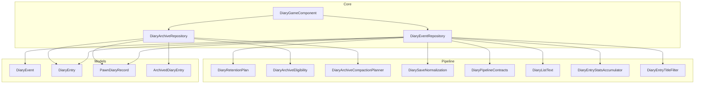
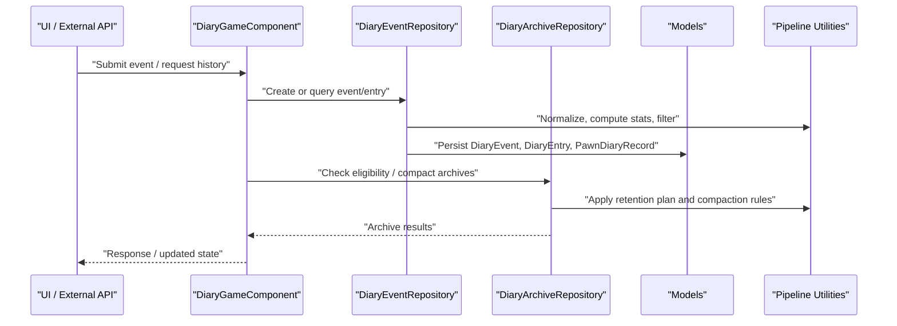
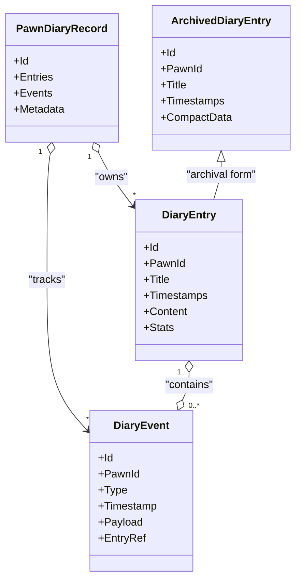
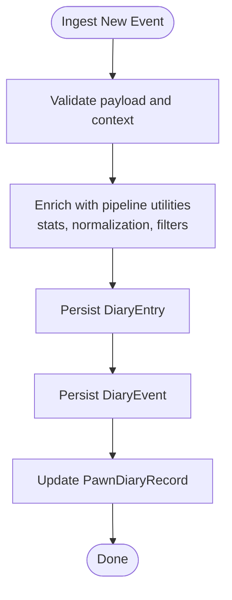
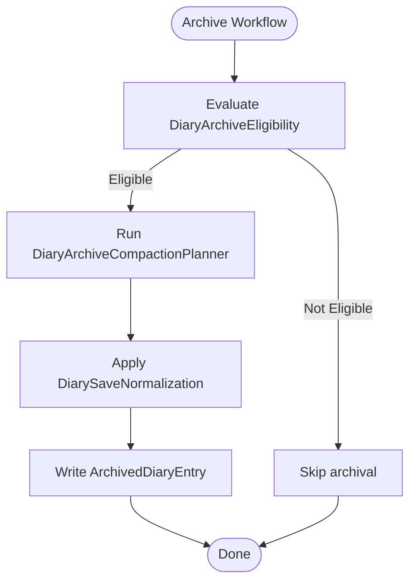
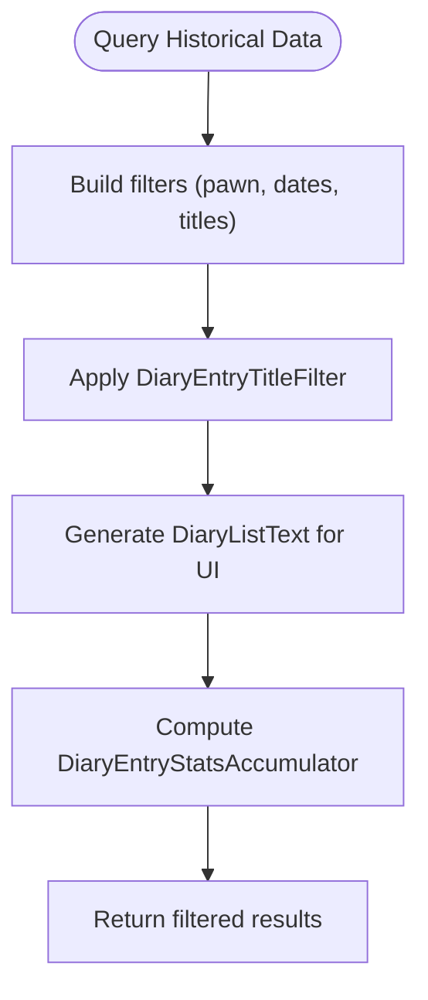
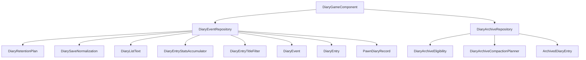

# Data Management Layer

## Table of Contents
1. [Introduction](#introduction)
2. [Project Structure](#project-structure)
3. [Core Components](#core-components)
4. [Architecture Overview](#architecture-overview)
5. [Detailed Component Analysis](#detailed-component-analysis)
6. [Dependency Analysis](#dependency-analysis)
7. [Performance Considerations](#performance-considerations)
8. [Troubleshooting Guide](#troubleshooting-guide)
9. [Conclusion](#conclusion)
10. [Appendices](#appendices)

## Introduction
This document describes the data management layer that implements a repository pattern for persistent storage of diary-related entities. It focuses on:
- The event repository abstraction and its responsibilities
- Archive management for long-term storage, including eligibility, compaction, and normalization
- Data model relationships among DiaryEvent, DiaryEntry, and PawnDiaryRecord
- Persistence strategies, query mechanisms, and indexing approaches
- Examples of storing new events, querying historical data, managing archives, and handling migrations
- Transaction management, backup strategies, and performance optimization for large datasets

The goal is to provide both high-level architecture guidance and code-level details so developers can extend, maintain, and optimize the system effectively.

## Project Structure
The data management layer spans several areas:
- Core repositories and game component orchestration
- Domain models representing events, entries, and per-pawn records
- Pipeline utilities for retention planning, archival eligibility, compaction, and save normalization
- Querying and filtering helpers for efficient retrieval and display

**Diagram sources**
- [DiaryEventRepository.cs](../../../../../Source/Core/DiaryEventRepository.cs)
- [DiaryArchiveRepository.cs](../../../../../Source/Core/DiaryArchiveRepository.cs)
- [DiaryGameComponent.cs](../../../../../Source/Core/DiaryGameComponent.cs)
- [DiaryEvent.cs](../../../../../Source/Models/DiaryEvent.cs)
- [DiaryEntry.cs](../../../../../Source/Models/DiaryEntry.cs)
- [PawnDiaryRecord.cs](../../../../../Source/Models/PawnDiaryRecord.cs)
- [ArchivedDiaryEntry.cs](../../../../../Source/Models/ArchivedDiaryEntry.cs)
- [DiaryRetentionPlan.cs](../../../../../Source/Pipeline/DiaryRetentionPlan.cs)
- [DiaryArchiveEligibility.cs](../../../../../Source/Pipeline/DiaryArchiveEligibility.cs)
- [DiaryArchiveCompactionPlanner.cs](../../../../../Source/Pipeline/DiaryArchiveCompactionPlanner.cs)
- [DiarySaveNormalization.cs](../../../../../Source/Pipeline/DiarySaveNormalization.cs)
- [DiaryPipelineContracts.cs](../../../../../Source/Pipeline/DiaryPipelineContracts.cs)
- [DiaryListText.cs](../../../../../Source/Pipeline/DiaryListText.cs)
- [DiaryEntryStatsAccumulator.cs](../../../../../Source/Pipeline/DiaryEntryStatsAccumulator.cs)
- [DiaryEntryTitleFilter.cs](../../../../../Source/Pipeline/DiaryEntryTitleFilter.cs)

**Section sources**
- [DiaryEventRepository.cs](../../../../../Source/Core/DiaryEventRepository.cs)
- [DiaryArchiveRepository.cs](../../../../../Source/Core/DiaryArchiveRepository.cs)
- [DiaryGameComponent.cs](../../../../../Source/Core/DiaryGameComponent.cs)
- [DiaryEvent.cs](../../../../../Source/Models/DiaryEvent.cs)
- [DiaryEntry.cs](../../../../../Source/Models/DiaryEntry.cs)
- [PawnDiaryRecord.cs](../../../../../Source/Models/PawnDiaryRecord.cs)
- [ArchivedDiaryEntry.cs](../../../../../Source/Models/ArchivedDiaryEntry.cs)
- [DiaryRetentionPlan.cs](../../../../../Source/Pipeline/DiaryRetentionPlan.cs)
- [DiaryArchiveEligibility.cs](../../../../../Source/Pipeline/DiaryArchiveEligibility.cs)
- [DiaryArchiveCompactionPlanner.cs](../../../../../Source/Pipeline/DiaryArchiveCompactionPlanner.cs)
- [DiarySaveNormalization.cs](../../../../../Source/Pipeline/DiarySaveNormalization.cs)
- [DiaryPipelineContracts.cs](../../../../../Source/Pipeline/DiaryPipelineContracts.cs)
- [DiaryListText.cs](../../../../../Source/Pipeline/DiaryListText.cs)
- [DiaryEntryStatsAccumulator.cs](../../../../../Source/Pipeline/DiaryEntryStatsAccumulator.cs)
- [DiaryEntryTitleFilter.cs](../../../../../Source/Pipeline/DiaryEntryTitleFilter.cs)

## Core Components
- DiaryEventRepository: Central persistence facade for creating, updating, querying, and archiving diary events and entries. It coordinates with pipeline utilities for retention, normalization, and statistics.
- DiaryArchiveRepository: Specialized repository for long-term storage operations, including archive eligibility checks, compaction planning, and migration-friendly normalization.
- DiaryGameComponent: Orchestrates lifecycle hooks (load/save, periodic tasks) and delegates to repositories for persistence and archival work.

Responsibilities:
- Repository pattern: Encapsulate data access behind clear interfaces, hiding storage specifics from callers.
- Event lifecycle: Persist new events, link them to entries, and manage their visibility and retention.
- Archive management: Identify eligible entries, compact archives, and normalize saved formats.
- Query support: Provide efficient lookups by pawn, time windows, titles, and filters.

**Section sources**
- [DiaryEventRepository.cs](../../../../../Source/Core/DiaryEventRepository.cs)
- [DiaryArchiveRepository.cs](../../../../../Source/Core/DiaryArchiveRepository.cs)
- [DiaryGameComponent.cs](../../../../../Source/Core/DiaryGameComponent.cs)

## Architecture Overview
The data management layer follows a layered design:
- Presentation/UI calls into the game component
- Game component orchestrates workflows and delegates to repositories
- Repositories use domain models and pipeline utilities for processing and persistence
- Archives are managed separately for long-term storage and compaction

**Diagram sources**
- [DiaryGameComponent.cs](../../../../../Source/Core/DiaryGameComponent.cs)
- [DiaryEventRepository.cs](../../../../../Source/Core/DiaryEventRepository.cs)
- [DiaryArchiveRepository.cs](../../../../../Source/Core/DiaryArchiveRepository.cs)
- [DiaryRetentionPlan.cs](../../../../../Source/Pipeline/DiaryRetentionPlan.cs)
- [DiaryArchiveCompactionPlanner.cs](../../../../../Source/Pipeline/DiaryArchiveCompactionPlanner.cs)
- [DiarySaveNormalization.cs](../../../../../Source/Pipeline/DiarySaveNormalization.cs)

## Detailed Component Analysis

### Data Model Relationships
The core entities form a clear hierarchy:
- PawnDiaryRecord represents per-pawn aggregate state and references
- DiaryEntry captures narrative content and metadata for a specific period or topic
- DiaryEvent represents discrete occurrences linked to entries and pawns

**Diagram sources**
- [PawnDiaryRecord.cs](../../../../../Source/Models/PawnDiaryRecord.cs)
- [DiaryEntry.cs](../../../../../Source/Models/DiaryEntry.cs)
- [DiaryEvent.cs](../../../../../Source/Models/DiaryEvent.cs)
- [ArchivedDiaryEntry.cs](../../../../../Source/Models/ArchivedDiaryEntry.cs)

**Section sources**
- [PawnDiaryRecord.cs](../../../../../Source/Models/PawnDiaryRecord.cs)
- [DiaryEntry.cs](../../../../../Source/Models/DiaryEntry.cs)
- [DiaryEvent.cs](../../../../../Source/Models/DiaryEvent.cs)
- [ArchivedDiaryEntry.cs](../../../../../Source/Models/ArchivedDiaryEntry.cs)

### Event Repository Abstraction
The event repository provides:
- Create and update operations for events and entries
- Query APIs for recent and historical data
- Integration with retention and normalization pipelines
- Indexing and filtering support via pipeline utilities

Key behaviors:
- New event ingestion: validate, enrich context, persist entry and event, update pawn record
- Historical queries: filter by pawn, date ranges, title keywords, and list text criteria
- Normalization: ensure consistent serialization across saves and upgrades

**Diagram sources**
- [DiaryEventRepository.cs](../../../../../Source/Core/DiaryEventRepository.cs)
- [DiarySaveNormalization.cs](../../../../../Source/Pipeline/DiarySaveNormalization.cs)
- [DiaryEntryStatsAccumulator.cs](../../../../../Source/Pipeline/DiaryEntryStatsAccumulator.cs)
- [DiaryEntryTitleFilter.cs](../../../../../Source/Pipeline/DiaryEntryTitleFilter.cs)
- [DiaryListText.cs](../../../../../Source/Pipeline/DiaryListText.cs)

**Section sources**
- [DiaryEventRepository.cs](../../../../../Source/Core/DiaryEventRepository.cs)
- [DiarySaveNormalization.cs](../../../../../Source/Pipeline/DiarySaveNormalization.cs)
- [DiaryEntryStatsAccumulator.cs](../../../../../Source/Pipeline/DiaryEntryStatsAccumulator.cs)
- [DiaryEntryTitleFilter.cs](../../../../../Source/Pipeline/DiaryEntryTitleFilter.cs)
- [DiaryListText.cs](../../../../../Source/Pipeline/DiaryListText.cs)

### Archive Management for Long-Term Storage
Archive management includes:
- Eligibility assessment based on retention plans
- Compaction planning to reduce storage footprint
- Normalization for compatibility across versions

**Diagram sources**
- [DiaryArchiveRepository.cs](../../../../../Source/Core/DiaryArchiveRepository.cs)
- [DiaryArchiveEligibility.cs](../../../../../Source/Pipeline/DiaryArchiveEligibility.cs)
- [DiaryArchiveCompactionPlanner.cs](../../../../../Source/Pipeline/DiaryArchiveCompactionPlanner.cs)
- [DiarySaveNormalization.cs](../../../../../Source/Pipeline/DiarySaveNormalization.cs)
- [ArchivedDiaryEntry.cs](../../../../../Source/Models/ArchivedDiaryEntry.cs)

**Section sources**
- [DiaryArchiveRepository.cs](../../../../../Source/Core/DiaryArchiveRepository.cs)
- [DiaryArchiveEligibility.cs](../../../../../Source/Pipeline/DiaryArchiveEligibility.cs)
- [DiaryArchiveCompactionPlanner.cs](../../../../../Source/Pipeline/DiaryArchiveCompactionPlanner.cs)
- [DiarySaveNormalization.cs](../../../../../Source/Pipeline/DiarySaveNormalization.cs)
- [ArchivedDiaryEntry.cs](../../../../../Source/Models/ArchivedDiaryEntry.cs)

### Query Mechanisms and Indexing Approaches
Querying leverages:
- Title-based filtering for fast keyword searches
- List text generation for rendering and pagination
- Statistics accumulation for summary views
- Contract-driven structures for consistent responses

Indexing strategies:
- Maintain indices on pawn identifiers and timestamps for range queries
- Use title filters to precompute searchable tokens
- Cache frequently accessed lists and summaries where appropriate

**Diagram sources**
- [DiaryEntryTitleFilter.cs](../../../../../Source/Pipeline/DiaryEntryTitleFilter.cs)
- [DiaryListText.cs](../../../../../Source/Pipeline/DiaryListText.cs)
- [DiaryEntryStatsAccumulator.cs](../../../../../Source/Pipeline/DiaryEntryStatsAccumulator.cs)
- [DiaryPipelineContracts.cs](../../../../../Source/Pipeline/DiaryPipelineContracts.cs)

**Section sources**
- [DiaryEntryTitleFilter.cs](../../../../../Source/Pipeline/DiaryEntryTitleFilter.cs)
- [DiaryListText.cs](../../../../../Source/Pipeline/DiaryListText.cs)
- [DiaryEntryStatsAccumulator.cs](../../../../../Source/Pipeline/DiaryEntryStatsAccumulator.cs)
- [DiaryPipelineContracts.cs](../../../../../Source/Pipeline/DiaryPipelineContracts.cs)

### Data Persistence Strategies
- In-memory staging: Events and entries are staged before batched writes to minimize I/O overhead
- Normalization: Ensure schema compatibility during load/save cycles
- Retention planning: Decide which entries remain active versus archived
- Compaction: Reduce redundant data in archives for long-term storage efficiency

Examples:
- Storing new events: create entry, attach event, update pawn record, apply normalization
- Querying historical data: build filters, generate list text, accumulate stats, return results
- Managing archives: check eligibility, plan compaction, normalize, persist archived entries
- Handling migrations: rely on normalization and contracts to adapt to schema changes

**Section sources**
- [DiaryRetentionPlan.cs](../../../../../Source/Pipeline/DiaryRetentionPlan.cs)
- [DiarySaveNormalization.cs](../../../../../Source/Pipeline/DiarySaveNormalization.cs)
- [DiaryPipelineContracts.cs](../../../../../Source/Pipeline/DiaryPipelineContracts.cs)

## Dependency Analysis
Repositories depend on pipeline utilities for processing and models for persistence. The game component coordinates these dependencies.

**Diagram sources**
- [DiaryGameComponent.cs](../../../../../Source/Core/DiaryGameComponent.cs)
- [DiaryEventRepository.cs](../../../../../Source/Core/DiaryEventRepository.cs)
- [DiaryArchiveRepository.cs](../../../../../Source/Core/DiaryArchiveRepository.cs)
- [DiaryRetentionPlan.cs](../../../../../Source/Pipeline/DiaryRetentionPlan.cs)
- [DiarySaveNormalization.cs](../../../../../Source/Pipeline/DiarySaveNormalization.cs)
- [DiaryListText.cs](../../../../../Source/Pipeline/DiaryListText.cs)
- [DiaryEntryStatsAccumulator.cs](../../../../../Source/Pipeline/DiaryEntryStatsAccumulator.cs)
- [DiaryEntryTitleFilter.cs](../../../../../Source/Pipeline/DiaryEntryTitleFilter.cs)
- [DiaryArchiveEligibility.cs](../../../../../Source/Pipeline/DiaryArchiveEligibility.cs)
- [DiaryArchiveCompactionPlanner.cs](../../../../../Source/Pipeline/DiaryArchiveCompactionPlanner.cs)
- [DiaryEvent.cs](../../../../../Source/Models/DiaryEvent.cs)
- [DiaryEntry.cs](../../../../../Source/Models/DiaryEntry.cs)
- [PawnDiaryRecord.cs](../../../../../Source/Models/PawnDiaryRecord.cs)
- [ArchivedDiaryEntry.cs](../../../../../Source/Models/ArchivedDiaryEntry.cs)

**Section sources**
- [DiaryGameComponent.cs](../../../../../Source/Core/DiaryGameComponent.cs)
- [DiaryEventRepository.cs](../../../../../Source/Core/DiaryEventRepository.cs)
- [DiaryArchiveRepository.cs](../../../../../Source/Core/DiaryArchiveRepository.cs)
- [DiaryRetentionPlan.cs](../../../../../Source/Pipeline/DiaryRetentionPlan.cs)
- [DiarySaveNormalization.cs](../../../../../Source/Pipeline/DiarySaveNormalization.cs)
- [DiaryListText.cs](../../../../../Source/Pipeline/DiaryListText.cs)
- [DiaryEntryStatsAccumulator.cs](../../../../../Source/Pipeline/DiaryEntryStatsAccumulator.cs)
- [DiaryEntryTitleFilter.cs](../../../../../Source/Pipeline/DiaryEntryTitleFilter.cs)
- [DiaryArchiveEligibility.cs](../../../../../Source/Pipeline/DiaryArchiveEligibility.cs)
- [DiaryArchiveCompactionPlanner.cs](../../../../../Source/Pipeline/DiaryArchiveCompactionPlanner.cs)
- [DiaryEvent.cs](../../../../../Source/Models/DiaryEvent.cs)
- [DiaryEntry.cs](../../../../../Source/Models/DiaryEntry.cs)
- [PawnDiaryRecord.cs](../../../../../Source/Models/PawnDiaryRecord.cs)
- [ArchivedDiaryEntry.cs](../../../../../Source/Models/ArchivedDiaryEntry.cs)

## Performance Considerations
- Batch writes: Group multiple event and entry updates to reduce I/O pressure
- Filtering early: Apply title filters and date bounds before generating list text or computing stats
- Caching: Reuse computed stats and list text for repeated queries within a session
- Compaction: Periodically compact archives to keep long-term storage lean
- Indexing: Maintain indices on primary keys and common query fields (pawn id, timestamp)
- Memory management: Evict inactive entries according to retention plans to prevent unbounded growth

[No sources needed since this section provides general guidance]

## Troubleshooting Guide
Common issues and resolutions:
- Serialization errors: Verify normalization steps and contract compliance during save/load
- Missing entries: Confirm retention plan thresholds and archive eligibility logic
- Slow queries: Review index usage and filter application order; consider caching
- Archive bloat: Adjust compaction planner parameters and retention policies
- Migration failures: Ensure normalization handles schema changes gracefully

Operational tips:
- Log pipeline stages for ingestion and archival workflows
- Validate model integrity after normalization
- Monitor retention metrics to tune policies

**Section sources**
- [DiarySaveNormalization.cs](../../../../../Source/Pipeline/DiarySaveNormalization.cs)
- [DiaryRetentionPlan.cs](../../../../../Source/Pipeline/DiaryRetentionPlan.cs)
- [DiaryArchiveEligibility.cs](../../../../../Source/Pipeline/DiaryArchiveEligibility.cs)
- [DiaryArchiveCompactionPlanner.cs](../../../../../Source/Pipeline/DiaryArchiveCompactionPlanner.cs)

## Conclusion
The data management layer provides a robust repository pattern implementation for diary persistence, with clear separation between event handling, archival management, and query support. By leveraging pipeline utilities for retention, normalization, and compaction, the system maintains performance and compatibility over time. Following the recommended practices for batching, indexing, and caching will help scale to large datasets while preserving data integrity and user experience.

[No sources needed since this section summarizes without analyzing specific files]

## Appendices

### Example Workflows

#### Storing a New Event
- Validate input and enrich context using pipeline utilities
- Persist DiaryEntry and DiaryEvent, then update PawnDiaryRecord
- Apply normalization and compute stats for consistency and display

**Section sources**
- [DiaryEventRepository.cs](../../../../../Source/Core/DiaryEventRepository.cs)
- [DiarySaveNormalization.cs](../../../../../Source/Pipeline/DiarySaveNormalization.cs)
- [DiaryEntryStatsAccumulator.cs](../../../../../Source/Pipeline/DiaryEntryStatsAccumulator.cs)

#### Querying Historical Data
- Build filters for pawn, date range, and title keywords
- Apply title filters and generate list text for UI
- Accumulate stats and return results efficiently

**Section sources**
- [DiaryEntryTitleFilter.cs](../../../../../Source/Pipeline/DiaryEntryTitleFilter.cs)
- [DiaryListText.cs](../../../../../Source/Pipeline/DiaryListText.cs)
- [DiaryEntryStatsAccumulator.cs](../../../../../Source/Pipeline/DiaryEntryStatsAccumulator.cs)

#### Managing Archives
- Evaluate eligibility based on retention plans
- Plan compaction to reduce size
- Normalize and persist archived entries

**Section sources**
- [DiaryArchiveRepository.cs](../../../../../Source/Core/DiaryArchiveRepository.cs)
- [DiaryArchiveEligibility.cs](../../../../../Source/Pipeline/DiaryArchiveEligibility.cs)
- [DiaryArchiveCompactionPlanner.cs](../../../../../Source/Pipeline/DiaryArchiveCompactionPlanner.cs)
- [DiarySaveNormalization.cs](../../../../../Source/Pipeline/DiarySaveNormalization.cs)

#### Handling Data Migrations
- Rely on normalization to adapt schemas across versions
- Use contracts to ensure consistent payloads and responses
- Validate integrity post-migration and log discrepancies

**Section sources**
- [DiarySaveNormalization.cs](../../../../../Source/Pipeline/DiarySaveNormalization.cs)
- [DiaryPipelineContracts.cs](../../../../../Source/Pipeline/DiaryPipelineContracts.cs)
