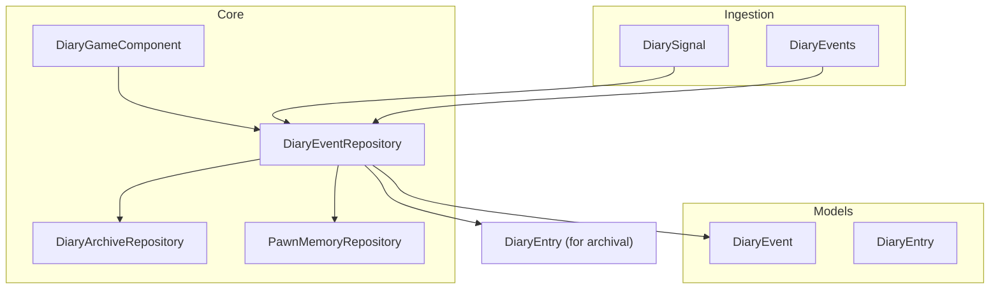
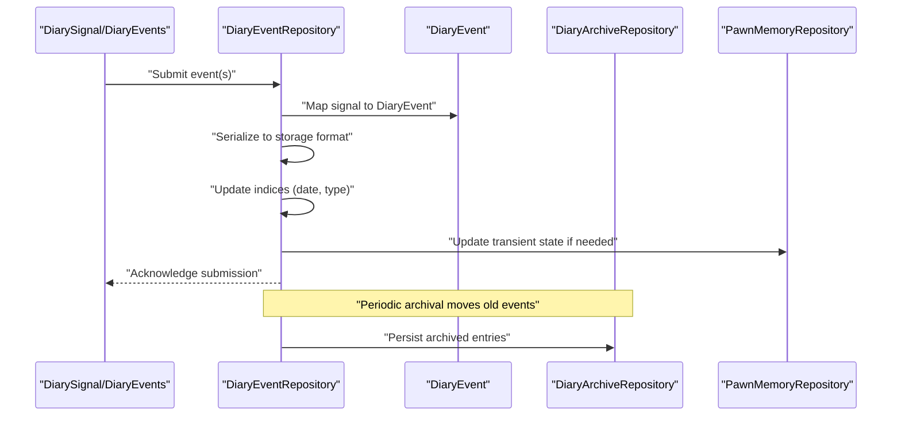
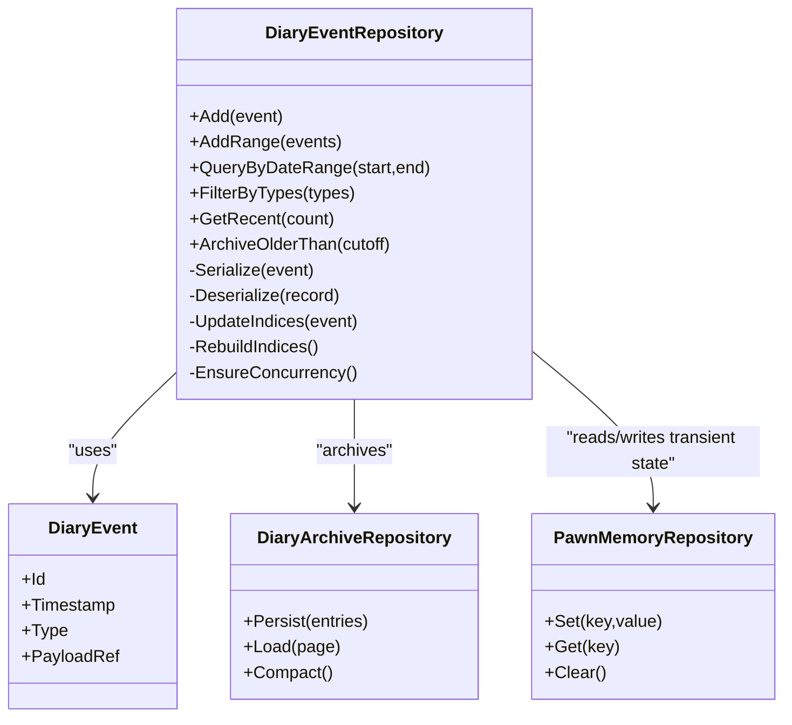
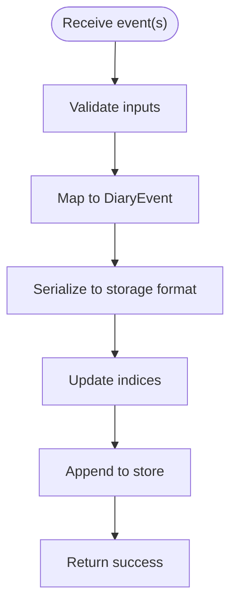
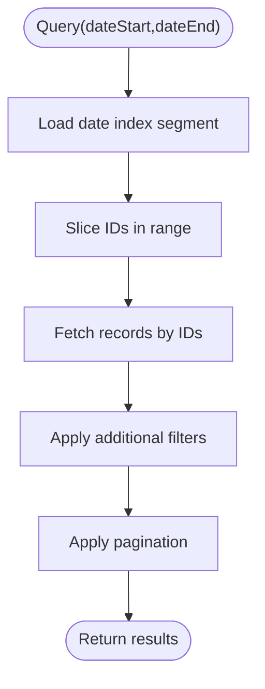
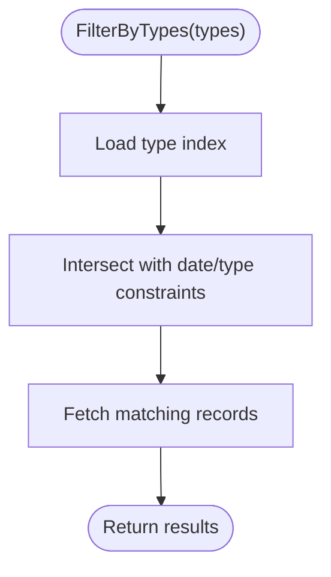
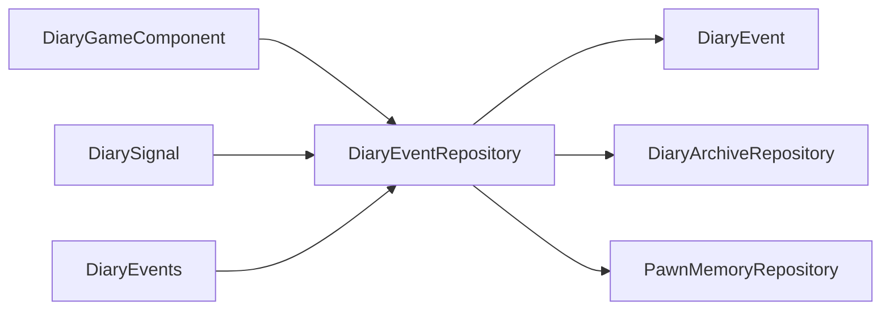

# Event Repository

- [DiaryEventRepository.cs](../../../../../Source/Core/DiaryEventRepository.cs)
- [DiaryArchiveRepository.cs](../../../../../Source/Core/DiaryArchiveRepository.cs)
- [DiaryEvent.cs](../../../../../Source/Models/DiaryEvent.cs)
- [DiaryEntry.cs](../../../../../Source/Models/DiaryEntry.cs)
- [PawnMemoryRepository.cs](../../../../../Source/Core/PawnMemoryRepository.cs)
- [DiaryGameComponent.cs](../../../../../Source/Core/DiaryGameComponent.cs)
- [DiarySignal.cs](../../../../../Source/Ingestion/DiarySignal.cs)
- [DiaryEvents.cs](../../../../../Source/Ingestion/DiaryEvents.cs)
## Table of Contents
1. [Introduction](#introduction)
2. [Project Structure](#project-structure)
3. [Core Components](#core-components)
4. [Architecture Overview](#architecture-overview)
5. [Detailed Component Analysis](#detailed-component-analysis)
6. [Dependency Analysis](#dependency-analysis)
7. [Performance Considerations](#performance-considerations)
8. [Troubleshooting Guide](#troubleshooting-guide)
9. [Conclusion](#conclusion)

## Introduction
This document explains the event repository system that provides persistent storage for game events. It focuses on the DiaryEventRepository class, its architecture, and how it serializes, indexes, and retrieves events efficiently. It also covers query operations such as date range filtering and type-based filtering, concurrent access handling, performance considerations for large datasets, indexing strategies, memory management, and the relationship between the DiaryEvent model and the storage format.

## Project Structure
The event repository is implemented within the Core layer and integrates with models and ingestion pipelines:
- Core repositories manage persistence and retrieval
- Models define the in-memory representation of events and entries
- Ingestion components produce signals and events that feed into the repository
- Game component orchestrates lifecycle and coordination

**Diagram sources**
- [DiaryEventRepository.cs](../../../../../Source/Core/DiaryEventRepository.cs)
- [DiaryArchiveRepository.cs](../../../../../Source/Core/DiaryArchiveRepository.cs)
- [DiaryEvent.cs](../../../../../Source/Models/DiaryEvent.cs)
- [DiaryEntry.cs](../../../../../Source/Models/DiaryEntry.cs)
- [PawnMemoryRepository.cs](../../../../../Source/Core/PawnMemoryRepository.cs)
- [DiaryGameComponent.cs](../../../../../Source/Core/DiaryGameComponent.cs)
- [DiarySignal.cs](../../../../../Source/Ingestion/DiarySignal.cs)
- [DiaryEvents.cs](../../../../../Source/Ingestion/DiaryEvents.cs)

**Section sources**
- [DiaryEventRepository.cs](../../../../../Source/Core/DiaryEventRepository.cs)
- [DiaryArchiveRepository.cs](../../../../../Source/Core/DiaryArchiveRepository.cs)
- [DiaryEvent.cs](../../../../../Source/Models/DiaryEvent.cs)
- [DiaryEntry.cs](../../../../../Source/Models/DiaryEntry.cs)
- [PawnMemoryRepository.cs](../../../../../Source/Core/PawnMemoryRepository.cs)
- [DiaryGameComponent.cs](../../../../../Source/Core/DiaryGameComponent.cs)
- [DiarySignal.cs](../../../../../Source/Ingestion/DiarySignal.cs)
- [DiaryEvents.cs](../../../../../Source/Ingestion/DiaryEvents.cs)

## Core Components
- DiaryEventRepository: Central coordinator for storing, indexing, querying, and archiving events. Provides APIs to add events, retrieve by date ranges, filter by types, and perform bulk operations.
- DiaryArchiveRepository: Handles long-term storage and compaction of archived entries.
- PawnMemoryRepository: Manages per-pawn transient or short-lived state used during processing.
- DiaryEvent: The domain model representing a single event with metadata such as timestamp, type, and payload references.
- DiaryEntry: A richer record used for archival and rendering, often derived from one or more events.
- DiarySignal and DiaryEvents: Ingestion abstractions that carry incoming events into the pipeline.

Key responsibilities:
- Serialization: Convert DiaryEvent instances to a compact, stable storage format suitable for persistence.
- Indexing: Maintain efficient indices (e.g., by date and type) to support fast queries.
- Retrieval: Provide filtered and paginated reads optimized for UI and analytics.
- Concurrency: Ensure thread-safe writes and consistent reads under concurrent access.
- Archival: Move older events to archive storage to keep active sets small.

**Section sources**
- [DiaryEventRepository.cs](../../../../../Source/Core/DiaryEventRepository.cs)
- [DiaryArchiveRepository.cs](../../../../../Source/Core/DiaryArchiveRepository.cs)
- [DiaryEvent.cs](../../../../../Source/Models/DiaryEvent.cs)
- [DiaryEntry.cs](../../../../../Source/Models/DiaryEntry.cs)
- [PawnMemoryRepository.cs](../../../../../Source/Core/PawnMemoryRepository.cs)
- [DiarySignal.cs](../../../../../Source/Ingestion/DiarySignal.cs)
- [DiaryEvents.cs](../../../../../Source/Ingestion/DiaryEvents.cs)

## Architecture Overview
The repository sits at the boundary between ingestion and persistence. Events flow from signals into the repository, which serializes them, updates indices, and persists them. Queries traverse indices first, then fetch serialized records as needed. Archival moves cold data out of the hot set.

**Diagram sources**
- [DiaryEventRepository.cs](../../../../../Source/Core/DiaryEventRepository.cs)
- [DiaryArchiveRepository.cs](../../../../../Source/Core/DiaryArchiveRepository.cs)
- [DiaryEvent.cs](../../../../../Source/Models/DiaryEvent.cs)
- [PawnMemoryRepository.cs](../../../../../Source/Core/PawnMemoryRepository.cs)
- [DiarySignal.cs](../../../../../Source/Ingestion/DiarySignal.cs)
- [DiaryEvents.cs](../../../../../Source/Ingestion/DiaryEvents.cs)

## Detailed Component Analysis

### DiaryEventRepository Class
Responsibilities:
- Add new events and batch submissions
- Serialize events to a compact format
- Maintain indices by date and event type
- Query events by date ranges and filters
- Coordinate archival and memory management
- Provide thread-safe access for concurrent writers/readers

**Diagram sources**
- [DiaryEventRepository.cs](../../../../../Source/Core/DiaryEventRepository.cs)
- [DiaryEvent.cs](../../../../../Source/Models/DiaryEvent.cs)
- [DiaryArchiveRepository.cs](../../../../../Source/Core/DiaryArchiveRepository.cs)
- [PawnMemoryRepository.cs](../../../../../Source/Core/PawnMemoryRepository.cs)

**Section sources**
- [DiaryEventRepository.cs](../../../../../Source/Core/DiaryEventRepository.cs)
- [DiaryEvent.cs](../../../../../Source/Models/DiaryEvent.cs)
- [DiaryArchiveRepository.cs](../../../../../Source/Core/DiaryArchiveRepository.cs)
- [PawnMemoryRepository.cs](../../../../../Source/Core/PawnMemoryRepository.cs)

### Event Storage Mechanisms
- Serialization: Events are converted into a compact, versioned storage format. The format includes minimal metadata required for indexing and reconstruction of the DiaryEvent model.
- Persistence: Serialized records are written to durable storage. Batch writes are preferred to reduce I/O overhead.
- Deserialization: On read, only necessary fields are deserialized to minimize memory pressure.

Operational notes:
- Use append-only writes where possible to avoid random I/O.
- Compress payloads when appropriate to reduce disk usage.
- Version the storage schema to allow safe upgrades.

**Section sources**
- [DiaryEventRepository.cs](../../../../../Source/Core/DiaryEventRepository.cs)
- [DiaryEvent.cs](../../../../../Source/Models/DiaryEvent.cs)

### Indexing Strategy
Indexes maintained by the repository typically include:
- Date index: Sorted structure mapping time buckets to event IDs for range queries.
- Type index: Map of event type to lists of IDs for filtering.
- Reverse lookup: ID to position in the primary store for fast retrieval.

Index maintenance:
- Incremental updates on write paths.
- Periodic rebuilds after corruption detection or major compactions.
- Lazy loading of index segments to reduce startup cost.

**Section sources**
- [DiaryEventRepository.cs](../../../../../Source/Core/DiaryEventRepository.cs)

### Query Operations
Common operations:
- Query by date range: Uses the date index to locate candidate IDs, then fetches and filters records.
- Filter by event types: Uses the type index to intersect with date-filtered results.
- Recent events: Reads from the tail of the date index for low-latency access.
- Pagination: Supports offset/limit patterns for UI paging.

Optimization tips:
- Combine filters early using index intersections.
- Stream results to avoid materializing large result sets.
- Cache frequently accessed windows (e.g., last N days).

**Section sources**
- [DiaryEventRepository.cs](../../../../../Source/Core/DiaryEventRepository.cs)

### Concurrent Access Handling
- Write serialization: Writers acquire a lock or use a queue to serialize mutations.
- Read concurrency: Readers can proceed concurrently without blocking writers, using snapshot semantics or lock-free structures where feasible.
- Consistency: Queries see a consistent view based on committed writes; partial writes are not visible.

Practical guidance:
- Prefer batching writes to reduce contention.
- Avoid holding locks across long-running operations.
- Use background threads for archival and index maintenance.

**Section sources**
- [DiaryEventRepository.cs](../../../../../Source/Core/DiaryEventRepository.cs)

### Relationship Between DiaryEvent Model and Storage Format
- DiaryEvent represents the runtime object with typed fields and references.
- Storage format is a flattened, versioned record optimized for durability and speed.
- Mapping logic ensures forward/backward compatibility and minimizes payload size.
- Indices reference storage positions rather than full objects to save memory.

**Section sources**
- [DiaryEvent.cs](../../../../../Source/Models/DiaryEvent.cs)
- [DiaryEventRepository.cs](../../../../../Source/Core/DiaryEventRepository.cs)

### Example Workflows

#### Storing New Events

**Diagram sources**
- [DiaryEventRepository.cs](../../../../../Source/Core/DiaryEventRepository.cs)
- [DiaryEvent.cs](../../../../../Source/Models/DiaryEvent.cs)
- [DiarySignal.cs](../../../../../Source/Ingestion/DiarySignal.cs)
- [DiaryEvents.cs](../../../../../Source/Ingestion/DiaryEvents.cs)

**Section sources**
- [DiaryEventRepository.cs](../../../../../Source/Core/DiaryEventRepository.cs)
- [DiarySignal.cs](../../../../../Source/Ingestion/DiarySignal.cs)
- [DiaryEvents.cs](../../../../../Source/Ingestion/DiaryEvents.cs)

#### Querying by Date Range

**Diagram sources**
- [DiaryEventRepository.cs](../../../../../Source/Core/DiaryEventRepository.cs)

**Section sources**
- [DiaryEventRepository.cs](../../../../../Source/Core/DiaryEventRepository.cs)

#### Filtering by Event Types

**Diagram sources**
- [DiaryEventRepository.cs](../../../../../Source/Core/DiaryEventRepository.cs)

**Section sources**
- [DiaryEventRepository.cs](../../../../../Source/Core/DiaryEventRepository.cs)

## Dependency Analysis
The repository depends on models for domain representation, archives for long-term storage, and memory repositories for transient state. The game component coordinates lifecycle and exposes higher-level APIs.

**Diagram sources**
- [DiaryGameComponent.cs](../../../../../Source/Core/DiaryGameComponent.cs)
- [DiaryEventRepository.cs](../../../../../Source/Core/DiaryEventRepository.cs)
- [DiaryEvent.cs](../../../../../Source/Models/DiaryEvent.cs)
- [DiaryArchiveRepository.cs](../../../../../Source/Core/DiaryArchiveRepository.cs)
- [PawnMemoryRepository.cs](../../../../../Source/Core/PawnMemoryRepository.cs)
- [DiarySignal.cs](../../../../../Source/Ingestion/DiarySignal.cs)
- [DiaryEvents.cs](../../../../../Source/Ingestion/DiaryEvents.cs)

**Section sources**
- [DiaryGameComponent.cs](../../../../../Source/Core/DiaryGameComponent.cs)
- [DiaryEventRepository.cs](../../../../../Source/Core/DiaryEventRepository.cs)
- [DiaryEvent.cs](../../../../../Source/Models/DiaryEvent.cs)
- [DiaryArchiveRepository.cs](../../../../../Source/Core/DiaryArchiveRepository.cs)
- [PawnMemoryRepository.cs](../../../../../Source/Core/PawnMemoryRepository.cs)
- [DiarySignal.cs](../../../../../Source/Ingestion/DiarySignal.cs)
- [DiaryEvents.cs](../../../../../Source/Ingestion/DiaryEvents.cs)

## Performance Considerations
- Batch writes: Group multiple events into a single transaction or append operation to reduce I/O and lock contention.
- Streaming reads: Return iterators or streams instead of materializing entire result sets.
- Index locality: Keep hot indices in memory; load cold segments lazily.
- Compaction: Periodically compact stores and archives to reclaim space and improve scan performance.
- Memory management: Avoid retaining large payloads in memory; prefer references and lazy loads.
- Caching: Cache recent windows and frequent queries behind a bounded cache.
- Concurrency: Serialize writes and allow concurrent reads; avoid long-held locks.

[No sources needed since this section provides general guidance]

## Troubleshooting Guide
Common issues and remedies:
- Slow queries: Verify indices are up-to-date; consider rebuilding indices or increasing index cache size.
- High memory usage: Reduce payload retention, enable streaming, and ensure archival runs regularly.
- Deadlocks or stalls: Check for long operations inside write locks; move heavy work to background tasks.
- Data inconsistency: Ensure atomic commits and verify index integrity after crashes.
- Archive growth: Tune archival thresholds and compaction frequency.

**Section sources**
- [DiaryEventRepository.cs](../../../../../Source/Core/DiaryEventRepository.cs)
- [DiaryArchiveRepository.cs](../../../../../Source/Core/DiaryArchiveRepository.cs)

## Conclusion
The event repository system provides a robust foundation for persistent event storage with efficient indexing and retrieval. By separating concerns among serialization, indexing, persistence, and archival, it scales well to large datasets while maintaining responsiveness. Proper batching, streaming, and concurrency practices further enhance performance and reliability.

[No sources needed since this section summarizes without analyzing specific files]
