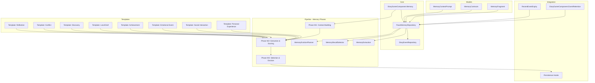
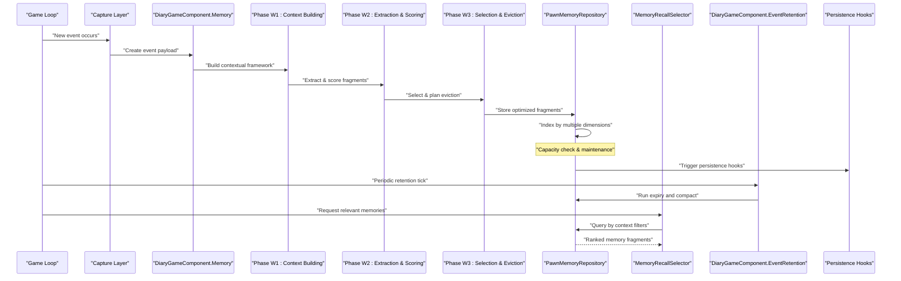
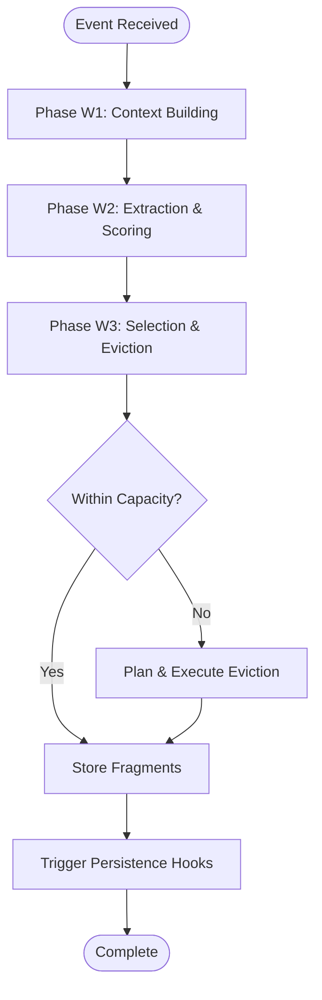
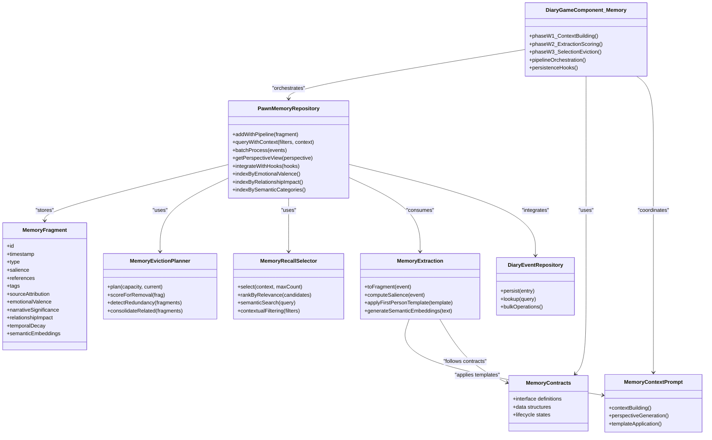
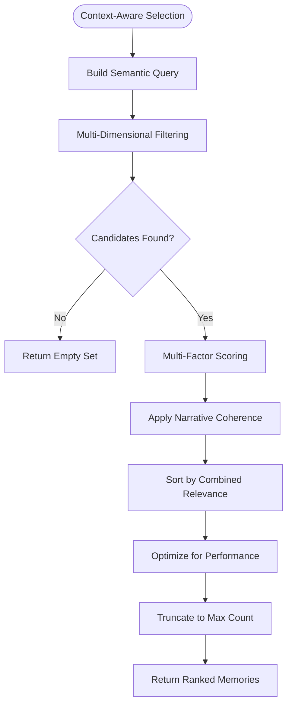
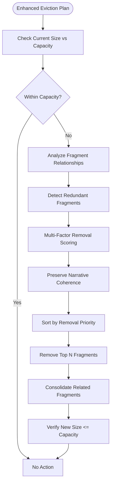
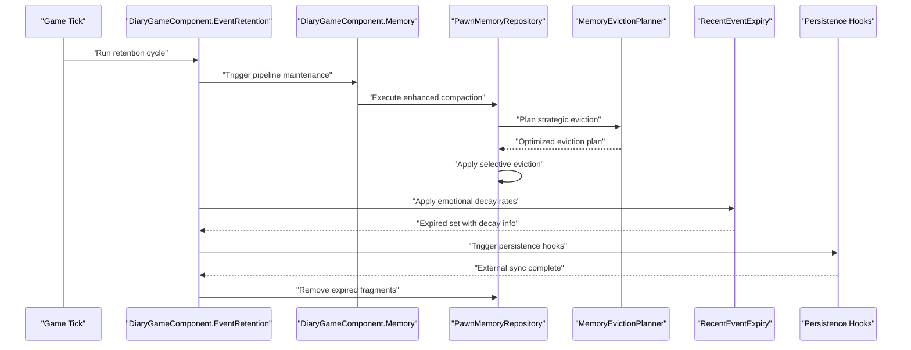
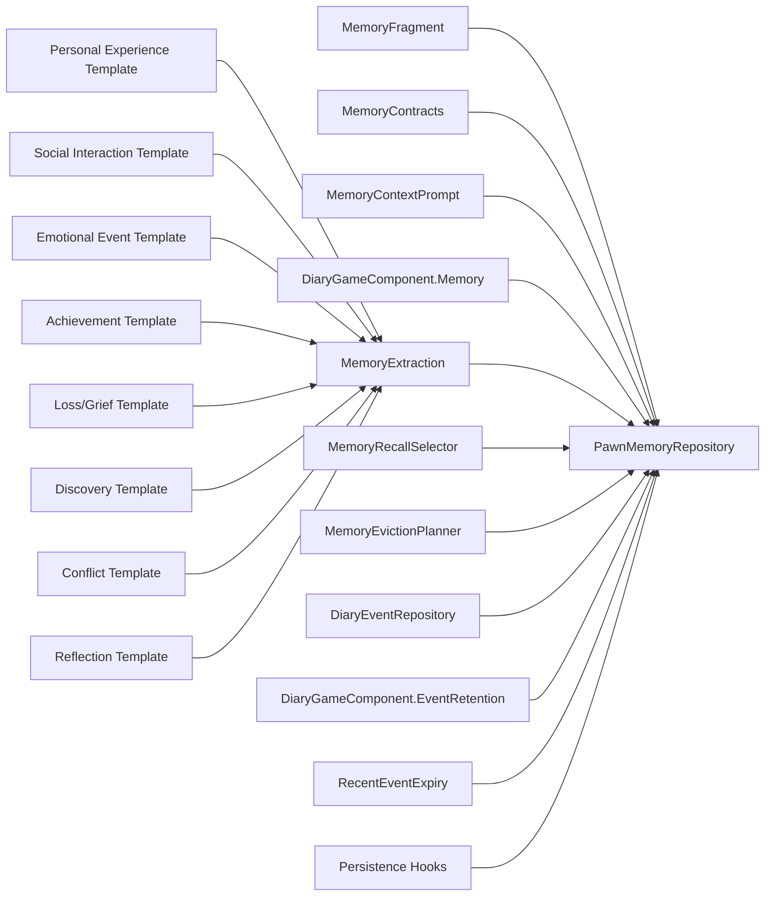

# Pawn Memory System

## Update Summary
**Changes Made**
- Lore L5 (design/LORE_MEMORY_SEED_PLAN.md §7.2/§8.3): `LoreSeedPlanner.PlanProgression` +
  `TryDepositProgressionLoreSeed` in `DiaryGameComponent.Memory.cs` attach at most one owner-only
  progression seed after the lived deposit succeeds for one of the six audited registered event
  tokens (XML list `progressionLoreSeedEventDefNames`); `loreseed-progression:` sentinels, zero
  narrative offset, exact-Def lifetime uniqueness, progression cap 4 / core cap 2; catalog grew
  to 40 with six EN/RU progression seeds; the RimTest lore fixture now isolates the shipped
  catalog per test and covers owner-only attachment, witness exclusion, and Def exhaustion
- Lore L3 (design/LORE_MEMORY_SEED_PLAN.md §11): shipped the 34-seed EN/RU catalog
  (`1.6/Defs/DiaryLoreSeedDefs.xml`, 18 mutex groups, 6 exact-evidence core seeds) plus the
  pass-1 vocabulary audit — `contextKeywordKeys` now leads with five stable Def-name-valued keys
  (`raid`, `faction`, `hediff`, `mood_event`, `observed_condition`) so language-neutral
  identifiers can never be crowded out of the keyword cap; catalog QA lives in PawnMemoryTests
  (frozen vocabulary, reachability, reserved-slot fixtures, RU parity, recall smokes)
- Lore L4's always-on world primer was removed from final prompts to reduce prompt inflation;
  authored lore now enters prompts only when the memory recall system selects a relevant lore seed
- Lore L2 (design/LORE_MEMORY_SEED_PLAN.md): `DiaryLoreSeedDef` + pure deterministic
  `LoreSeedPlanner.PlanInitial` (Source/Pipeline/Memory/LoreSeedPlanner.cs) build a one-time
  per-pawn roster persisted in `PawnLoreSeedState` beside the repository; the EventFactory
  funnels call `EnsureLoreSeedsForPawn` BEFORE recall so seeds surface on the first prompt;
  deposits use `loreseed:<defName>` sentinels for idempotency, live DefInjected prose with saved
  fallback, and the implied `lore` tag; core lore gets a hard 20-day recall cooldown; the
  default-true `enableLoreSeeds` setting suppresses recall/deposit/cap-eviction without deleting
  rows. The authored catalog arrives in L3 — the layer no-ops on an empty DefDatabase
- Lore L1 (design/LORE_MEMORY_SEED_PLAN.md): MemoryFragment carries optional lore provenance
  (`loreSeedDefName`) and a `narrativeAgeOffsetTicks` that affects only the rendered age band and
  the minimum-recall-age guard (recency decay, cooldowns, and eviction stay on real ticks); the
  closed tag vocabulary gained the `lore` token
- Lore L1 projectability: recall now runs only when the finally chosen prompt template declares a
  `MemoryContext` field (`DiaryPromptPlanner.ProjectsMemoryContext` + a gate in
  `DiaryGameComponent.Memory.cs`), all 11 first-person templates — now including the three
  reflections — project memory, neutral death/arrival/title never do, a non-empty memory field is
  required in every context-detail preset, and the rendered block is bounded by the universal
  `memoryContextMaxLines` (2) / `memoryContextMaxChars` (500) whole-pick policy
- Added comprehensive memory subsystem implementation through DiaryGameComponent.Memory.cs (475 lines)
- Integrated memory pipeline phases W1-W3 for structured processing workflow
- Enhanced context management and lifecycle control mechanisms
- Implemented persistence hooks for memory state management
- Added 8 first-person templates supporting various memory context sources
- Expanded eviction policies and recall selection algorithms

## Table of Contents
1. [Introduction](#introduction)
2. [Project Structure](#project-structure)
3. [Core Components](#core-components)
4. [Architecture Overview](#architecture-overview)
5. [Memory Pipeline Phases](#memory-pipeline-phases)
6. [Detailed Component Analysis](#detailed-component-analysis)
7. [First-Person Templates](#first-person-templates)
8. [Dependency Analysis](#dependency-analysis)
9. [Performance Considerations](#performance-considerations)
10. [Troubleshooting Guide](#troubleshooting-guide)
11. [Conclusion](#conclusion)

## Introduction
This document explains the pawn-specific short-term memory system that enables pawns to maintain contextual information about recent events, relationships, and experiences. The system has been significantly enhanced with a comprehensive memory subsystem implementation featuring structured pipeline phases, advanced context management, intelligent eviction policies, and extensive template support for memory context sources. It focuses on how memories are captured as fragments, stored efficiently, prioritized for recall, and evicted when capacity is exceeded through a sophisticated multi-phase processing pipeline.

## Project Structure
The memory subsystem spans several layers with enhanced pipeline integration:
- Models define the core memory fragment structure and contracts
- Core repositories provide per-pawn storage and lifecycle management
- Pipeline components handle extraction, selection, and eviction policies through structured phases
- Game integration coordinates retention and expiry with the broader diary/event system
- Template system provides first-person context generation for various memory sources

**Diagram sources**
- [DiaryGameComponent.Memory.cs](../../../../../Source/Core/DiaryGameComponent.Memory.cs)
- [PawnMemoryRepository.cs](../../../../../Source/Core/PawnMemoryRepository.cs)
- [MemoryFragment.cs](../../../../../Source/Models/MemoryFragment.cs)
- [MemoryContracts.cs](../../../../../Source/Pipeline/Memory/MemoryContracts.cs)
- [MemoryContextPrompt.cs](../../../../../Source/Pipeline/Memory/MemoryContextPrompt.cs)
- [MemoryEvictionPlanner.cs](../../../../../Source/Pipeline/Memory/MemoryEvictionPlanner.cs)
- [MemoryRecallSelector.cs](../../../../../Source/Pipeline/Memory/MemoryRecallSelector.cs)
- [MemoryExtraction.cs](../../../../../Source/Pipeline/Memory/MemoryExtraction.cs)
- [DiaryGameComponent.EventRetention.cs](../../../../../Source/Core/DiaryGameComponent.EventRetention.cs)
- [RecentEventExpiry.cs](../../../../../Source/Capture/RecentEventExpiry.cs)

**Section sources**
- [DiaryGameComponent.Memory.cs](../../../../../Source/Core/DiaryGameComponent.Memory.cs)
- [PawnMemoryRepository.cs](../../../../../Source/Core/PawnMemoryRepository.cs)
- [MemoryFragment.cs](../../../../../Source/Models/MemoryFragment.cs)
- [MemoryContracts.cs](../../../../../Source/Pipeline/Memory/MemoryContracts.cs)
- [MemoryContextPrompt.cs](../../../../../Source/Pipeline/Memory/MemoryContextPrompt.cs)

## Core Components
- **MemoryFragment**: Represents a single unit of short-term context with enhanced metadata including source attribution, emotional valence, narrative significance, and relationship impact scores.
- **PawnMemoryRepository**: Per-pawn manager responsible for storing, retrieving, prioritizing, and evicting memory fragments with integrated pipeline phase coordination.
- **MemoryEvictionPlanner**: Determines which fragments to remove when capacity is exceeded using multi-factor scoring including recency decay, importance assessment, and redundancy detection.
- **MemoryRecallSelector**: Selects the most useful subset of memories for a given prompt or decision context using advanced relevance algorithms.
- **MemoryExtraction**: Converts incoming game events into structured memory fragments with appropriate tags, scores, and first-person template integration.
- **MemoryContracts**: Defines standardized interfaces and data structures for memory operations across the pipeline.
- **MemoryContextPrompt**: Manages context-aware prompt generation for memory retrieval and synthesis.
- **DiaryGameComponent.Memory**: Central orchestrator coordinating all memory subsystem operations through the three-phase pipeline.

Key responsibilities:
- Store memory fragments with efficient indexing by time, type, entity references, and emotional context.
- Provide targeted retrieval for prompts, decisions, and narrative generation using context-aware filtering.
- Enforce capacity limits via intelligent multi-factor eviction policies.
- Maintain consistency with the broader diary/event lifecycle through persistence hooks.
- Support first-person perspective generation through template-based context construction.

**Section sources**
- [MemoryFragment.cs](../../../../../Source/Models/MemoryFragment.cs)
- [PawnMemoryRepository.cs](../../../../../Source/Core/PawnMemoryRepository.cs)
- [MemoryEvictionPlanner.cs](../../../../../Source/Pipeline/Memory/MemoryEvictionPlanner.cs)
- [MemoryRecallSelector.cs](../../../../../Source/Pipeline/Memory/MemoryRecallSelector.cs)
- [MemoryExtraction.cs](../../../../../Source/Pipeline/Memory/MemoryExtraction.cs)
- [MemoryContracts.cs](../../../../../Source/Pipeline/Memory/MemoryContracts.cs)
- [MemoryContextPrompt.cs](../../../../../Source/Pipeline/Memory/MemoryContextPrompt.cs)
- [DiaryGameComponent.Memory.cs](../../../../../Source/Core/DiaryGameComponent.Memory.cs)

## Architecture Overview
The enhanced memory system sits between event capture and prompt generation with a structured three-phase pipeline. Events are captured, transformed through context building and extraction phases, then processed through selection and eviction phases before being stored in the per-pawn repository. When generating content or making decisions, the recall selector chooses the most relevant fragments using context-aware algorithms.

**Diagram sources**
- [DiaryGameComponent.Memory.cs](../../../../../Source/Core/DiaryGameComponent.Memory.cs)
- [MemoryExtraction.cs](../../../../../Source/Pipeline/Memory/MemoryExtraction.cs)
- [PawnMemoryRepository.cs](../../../../../Source/Core/PawnMemoryRepository.cs)
- [MemoryRecallSelector.cs](../../../../../Source/Pipeline/Memory/MemoryRecallSelector.cs)
- [MemoryEvictionPlanner.cs](../../../../../Source/Pipeline/Memory/MemoryEvictionPlanner.cs)
- [DiaryGameComponent.EventRetention.cs](../../../../../Source/Core/DiaryGameComponent.EventRetention.cs)

## Memory Pipeline Phases

### Phase W1: Context Building
Purpose:
- Establish contextual framework for incoming events
- Gather related memories and environmental factors
- Prepare data structures for extraction processing
- Apply persona and psychological filters

Processing logic:
- Analyze event type and determine relevant context windows
- Retrieve related memories from previous interactions
- Assess pawn's current mental state and personality traits
- Build contextual metadata for downstream processing

### Phase W2: Extraction & Scoring
Purpose:
- Convert raw events into structured memory fragments
- Apply first-person templates for perspective generation
- Compute multi-dimensional scoring metrics
- Tag fragments with semantic categories and emotional valence

Processing logic:
- Parse event payload and map to fragment schema
- Apply appropriate first-person template based on event category
- Score fragments using weighted factors (emotional impact, narrative significance, relationship impact)
- Generate semantic tags for recall optimization

### Phase W3: Selection & Eviction
Purpose:
- Select optimal subset of fragments for storage
- Plan eviction strategy when capacity constraints are exceeded
- Apply redundancy detection and consolidation
- Ensure narrative coherence and continuity

Processing logic:
- Evaluate fragment importance using multi-factor analysis
- Detect redundant or conflicting memories
- Plan eviction based on recency decay, salience, and narrative value
- Consolidate related fragments to reduce storage overhead

**Diagram sources**
- [DiaryGameComponent.Memory.cs](../../../../../Source/Core/DiaryGameComponent.Memory.cs)
- [MemoryExtraction.cs](../../../../../Source/Pipeline/Memory/MemoryExtraction.cs)
- [MemoryEvictionPlanner.cs](../../../../../Source/Pipeline/Memory/MemoryEvictionPlanner.cs)

**Section sources**
- [DiaryGameComponent.Memory.cs](../../../../../Source/Core/DiaryGameComponent.Memory.cs)

## Detailed Component Analysis

### Enhanced MemoryFragment Model
MemoryFragment now includes additional attributes for enhanced context management:
- Source attribution tracking for template-based generation
- Emotional valence scoring for affective computing
- Narrative significance weighting for story coherence
- Relationship impact metrics for social dynamics
- Temporal decay coefficients for automatic aging
- Semantic embedding vectors for similarity matching

Complexity considerations:
- Storage cost scales with enhanced metadata but remains manageable through compression
- Multi-dimensional indexing supports O(log n) queries across different filter combinations
- Embedding vectors enable semantic search without full-text scanning

Usage examples:
- Create fragments with automatic emotional valence calculation
- Attach relationship impact scores based on interaction outcomes
- Set temporal decay coefficients based on event importance
- Generate semantic embeddings for similarity-based recall

**Section sources**
- [MemoryFragment.cs](../../../../../Source/Models/MemoryFragment.cs)

### Enhanced PawnMemoryRepository
Responsibilities expanded to include:
- Pipeline phase coordination through DiaryGameComponent.Memory integration
- Multi-dimensional indexing for enhanced query performance
- First-person template application during fragment creation
- Persistence hook management for external integrations
- Advanced caching strategies for frequently accessed memories

API surface enhancements:
- AddWithPipeline(fragment): Process through W1-W3 phases automatically
- QueryWithContext(filters, context): Context-aware querying with semantic matching
- BatchProcess(events): Efficient batch processing through pipeline phases
- GetPerspectiveView(perspective): Generate first-person perspective views
- IntegrateWithHooks(hooks): Register persistence and lifecycle hooks

Data structure improvements:
- Primary list with enhanced metadata indexing
- Secondary indexes by emotional valence, relationship impact, and semantic categories
- Cache layer for frequently accessed memory clusters
- Versioning system for fragment evolution tracking

**Section sources**
- [PawnMemoryRepository.cs](../../../../../Source/Core/PawnMemoryRepository.cs)

#### Enhanced Class Diagram

**Diagram sources**
- [DiaryGameComponent.Memory.cs](../../../../../Source/Core/DiaryGameComponent.Memory.cs)
- [PawnMemoryRepository.cs](../../../../../Source/Core/PawnMemoryRepository.cs)
- [MemoryFragment.cs](../../../../../Source/Models/MemoryFragment.cs)
- [MemoryContracts.cs](../../../../../Source/Pipeline/Memory/MemoryContracts.cs)
- [MemoryContextPrompt.cs](../../../../../Source/Pipeline/Memory/MemoryContextPrompt.cs)
- [MemoryEvictionPlanner.cs](../../../../../Source/Pipeline/Memory/MemoryEvictionPlanner.cs)
- [MemoryRecallSelector.cs](../../../../../Source/Pipeline/Memory/MemoryRecallSelector.cs)
- [MemoryExtraction.cs](../../../../../Source/Pipeline/Memory/MemoryExtraction.cs)
- [DiaryEventRepository.cs](../../../../../Source/Core/DiaryEventRepository.cs)

### Enhanced Memory Extraction with Template Integration
Purpose expanded to include:
- First-person template application for perspective generation
- Emotional valence computation using sentiment analysis
- Semantic embedding generation for similarity matching
- Relationship impact assessment based on interaction patterns

Processing logic enhancements:
- Parse event payload and determine appropriate template category
- Apply first-person perspective transformation using selected template
- Compute emotional valence using contextual sentiment analysis
- Generate semantic embeddings for vector-based similarity search
- Assess relationship impact based on interaction participants and outcomes

Template integration:
- 8 specialized templates covering major life event categories
- Dynamic template selection based on event characteristics
- Persona-aware template customization for individual pawns
- Contextual parameter injection for personalized output

**Section sources**
- [MemoryExtraction.cs](../../../../../Source/Pipeline/Memory/MemoryExtraction.cs)
- [MemoryContextPrompt.cs](../../../../../Source/Pipeline/Memory/MemoryContextPrompt.cs)

### Enhanced Memory Recall Selector
Purpose expanded to include:
- Context-aware memory retrieval using semantic similarity
- Multi-dimensional filtering combining temporal, emotional, and relational criteria
- Advanced ranking algorithms incorporating narrative coherence
- Batch optimization for multiple concurrent queries

Selection algorithm enhancements:
- Filter candidates using combined semantic and contextual filters
- Score candidates using weighted multi-factor analysis
- Apply narrative coherence constraints to maintain story continuity
- Optimize query performance using cached results and pre-computed indices

Flowchart enhancements

**Diagram sources**
- [MemoryRecallSelector.cs](../../../../../Source/Pipeline/Memory/MemoryRecallSelector.cs)

**Section sources**
- [MemoryRecallSelector.cs](../../../../../Source/Pipeline/Memory/MemoryRecallSelector.cs)

### Enhanced Memory Eviction Planner
Purpose expanded to include:
- Redundancy detection and consolidation
- Narrative coherence preservation during eviction
- Multi-factor scoring with relationship impact consideration
- Batch eviction planning for efficiency

Eviction policy enhancements:
- Prefer removing older, less important fragments while preserving narrative threads
- Preserve high-salience fragments and those with strong relationship connections
- Detect and consolidate redundant or overlapping memories
- Avoid removing recently added fragments unless absolutely necessary
- Maintain narrative coherence by preserving connected memory chains

Algorithm flowchart enhancements

**Diagram sources**
- [MemoryEvictionPlanner.cs](../../../../../Source/Pipeline/Memory/MemoryEvictionPlanner.cs)

**Section sources**
- [MemoryEvictionPlanner.cs](../../../../../Source/Pipeline/Memory/MemoryEvictionPlanner.cs)

### Enhanced Integration with Event Retention and Expiry
- DiaryGameComponent.EventRetention orchestrates periodic maintenance with enhanced pipeline integration
- RecentEventExpiry applies sophisticated time-based expiration considering emotional decay rates
- Persistence hooks provide extensibility for external memory systems and analytics
- Lifecycle management ensures proper cleanup and resource deallocation

Sequence enhancements

**Diagram sources**
- [DiaryGameComponent.EventRetention.cs](../../../../../Source/Core/DiaryGameComponent.EventRetention.cs)
- [RecentEventExpiry.cs](../../../../../Source/Capture/RecentEventExpiry.cs)
- [DiaryGameComponent.Memory.cs](../../../../../Source/Core/DiaryGameComponent.Memory.cs)
- [PawnMemoryRepository.cs](../../../../../Source/Core/PawnMemoryRepository.cs)
- [MemoryEvictionPlanner.cs](../../../../../Source/Pipeline/Memory/MemoryEvictionPlanner.cs)

**Section sources**
- [DiaryGameComponent.EventRetention.cs](../../../../../Source/Core/DiaryGameComponent.EventRetention.cs)
- [RecentEventExpiry.cs](../../../../../Source/Capture/RecentEventExpiry.cs)
- [DiaryGameComponent.Memory.cs](../../../../../Source/Core/DiaryGameComponent.Memory.cs)
- [PawnMemoryRepository.cs](../../../../../Source/Core/PawnMemoryRepository.cs)
- [MemoryEvictionPlanner.cs](../../../../../Source/Pipeline/Memory/MemoryEvictionPlanner.cs)

## First-Person Templates

### Template Architecture
The memory system includes 8 specialized first-person templates designed to generate authentic personal narratives from objective event data. Each template serves specific life experience categories and applies persona-aware language patterns.

### Template Categories

#### 1. Personal Experience Template
Purpose: Transform mundane daily activities into meaningful personal reflections
Characteristics: Focuses on routine activities elevated through personal significance
Language patterns: Reflective, introspective, detail-oriented

#### 2. Social Interaction Template
Purpose: Convert social encounters into emotionally resonant interpersonal narratives
Characteristics: Emphasizes relationship dynamics and emotional exchanges
Language patterns: Conversational, empathetic, relationship-focused

#### 3. Emotional Event Template
Purpose: Process intense emotional experiences with appropriate psychological framing
Characteristics: Captures emotional intensity and psychological impact
Language patterns: Expressive, vulnerable, emotionally honest

#### 4. Achievement Template
Purpose: Frame accomplishments and successes with appropriate humility and pride
Characteristics: Balances achievement recognition with personal growth
Language patterns: Proud yet humble, growth-oriented, milestone-focused

#### 5. Loss/Grief Template
Purpose: Process losses and difficult experiences with psychological appropriateness
Characteristics: Handles grief, loss, and challenging emotions sensitively
Language patterns: Somber, reflective, healing-focused

#### 6. Discovery Template
Purpose: Transform moments of learning and revelation into narrative insights
Characteristics: Emphasizes wonder, curiosity, and intellectual growth
Language patterns: Wonder-filled, curious, insight-driven

#### 7. Conflict Template
Purpose: Navigate disagreements and conflicts with mature perspective-taking
Characteristics: Addresses tension while maintaining empathy and understanding
Language patterns: Balanced, understanding, resolution-oriented

#### 8. Reflection Template
Purpose: Synthesize experiences into coherent life narratives and lessons learned
Characteristics: Provides meaning-making and future-oriented perspective
Language patterns: Wise, contemplative, forward-looking

### Template Application Process
Each template follows a standardized application process:
1. **Template Selection**: Choose appropriate template based on event characteristics
2. **Context Injection**: Inject persona-specific parameters and relationship data
3. **Language Generation**: Apply template-specific language patterns and vocabulary
4. **Quality Assurance**: Validate emotional appropriateness and narrative coherence
5. **Integration**: Merge generated text with structured memory fragment metadata

**Section sources**
- [DiaryGameComponent.Memory.cs](../../../../../Source/Core/DiaryGameComponent.Memory.cs)
- [MemoryContextPrompt.cs](../../../../../Source/Pipeline/Memory/MemoryContextPrompt.cs)

## Dependency Analysis
The enhanced memory system maintains clear dependency relationships with improved modularity:
- MemoryFragment and MemoryContracts form the foundational data layer
- DiaryGameComponent.Memory orchestrates the three-phase pipeline
- PawnMemoryRepository composes all pipeline components with enhanced capabilities
- Template system integrates with extraction phase for first-person perspective generation
- Persistence hooks provide extension points for external integrations

**Diagram sources**
- [MemoryFragment.cs](../../../../../Source/Models/MemoryFragment.cs)
- [MemoryContracts.cs](../../../../../Source/Pipeline/Memory/MemoryContracts.cs)
- [MemoryContextPrompt.cs](../../../../../Source/Pipeline/Memory/MemoryContextPrompt.cs)
- [DiaryGameComponent.Memory.cs](../../../../../Source/Core/DiaryGameComponent.Memory.cs)
- [PawnMemoryRepository.cs](../../../../../Source/Core/PawnMemoryRepository.cs)
- [MemoryExtraction.cs](../../../../../Source/Pipeline/Memory/MemoryExtraction.cs)
- [MemoryRecallSelector.cs](../../../../../Source/Pipeline/Memory/MemoryRecallSelector.cs)
- [MemoryEvictionPlanner.cs](../../../../../Source/Pipeline/Memory/MemoryEvictionPlanner.cs)
- [DiaryEventRepository.cs](../../../../../Source/Core/DiaryEventRepository.cs)
- [DiaryGameComponent.EventRetention.cs](../../../../../Source/Core/DiaryGameComponent.EventRetention.cs)
- [RecentEventExpiry.cs](../../../../../Source/Capture/RecentEventExpiry.cs)

**Section sources**
- [DiaryGameComponent.Memory.cs](../../../../../Source/Core/DiaryGameComponent.Memory.cs)
- [PawnMemoryRepository.cs](../../../../../Source/Core/PawnMemoryRepository.cs)
- [MemoryFragment.cs](../../../../../Source/Models/MemoryFragment.cs)
- [MemoryContracts.cs](../../../../../Source/Pipeline/Memory/MemoryContracts.cs)
- [MemoryExtraction.cs](../../../../../Source/Pipeline/Memory/MemoryExtraction.cs)
- [MemoryRecallSelector.cs](../../../../../Source/Pipeline/Memory/MemoryRecallSelector.cs)
- [MemoryEvictionPlanner.cs](../../../../../Source/Pipeline/Memory/MemoryEvictionPlanner.cs)
- [DiaryEventRepository.cs](../../../../../Source/Core/DiaryEventRepository.cs)
- [DiaryGameComponent.EventRetention.cs](../../../../../Source/Core/DiaryGameComponent.EventRetention.cs)
- [RecentEventExpiry.cs](../../../../../Source/Capture/RecentEventExpiry.cs)

## Performance Considerations
Enhanced performance optimizations include:
- **Multi-dimensional indexing**: Maintains secondary indexes by emotional valence, relationship impact, and semantic categories for O(log n) queries
- **Batch processing**: Groups fragment insertions and evictions through pipeline phases to minimize overhead
- **Intelligent caching**: Implements cache layer for frequently accessed memory clusters and pre-computed indices
- **Off-peak processing**: Defers expensive recalculations (e.g., semantic embeddings, emotional valence updates) to non-critical ticks
- **Capacity tuning**: Adjusts thresholds dynamically based on pawn activity levels and memory density
- **Concurrent safety**: Ensures thread-safe access patterns when multiple systems update memories simultaneously
- **Template optimization**: Caches template instances and pre-compiles language patterns for faster generation
- **Persistence hook batching**: Batches external persistence operations to reduce I/O overhead

## Troubleshooting Guide
Enhanced troubleshooting capabilities include:
- **Missing memories**: Verify extraction mapping and ensure events are tagged correctly with appropriate template categories
- **Poor recall quality**: Review recall filters and relevance scoring weights, check semantic embedding quality
- **Over-eviction**: Tune eviction priorities to preserve important fragments and narrative coherence
- **Stale data**: Confirm retention cycles run regularly and expiry thresholds consider emotional decay rates
- **Performance spikes**: Monitor batch sizes and consider deferring heavy computations like semantic embedding generation
- **Template issues**: Validate template selection logic and check persona-specific parameter injection
- **Pipeline failures**: Inspect individual phase execution logs and verify contract compliance
- **Persistence problems**: Check hook registration and external system connectivity

**Section sources**
- [MemoryExtraction.cs](../../../../../Source/Pipeline/Memory/MemoryExtraction.cs)
- [MemoryRecallSelector.cs](../../../../../Source/Pipeline/Memory/MemoryRecallSelector.cs)
- [MemoryEvictionPlanner.cs](../../../../../Source/Pipeline/Memory/MemoryEvictionPlanner.cs)
- [DiaryGameComponent.Memory.cs](../../../../../Source/Core/DiaryGameComponent.Memory.cs)
- [DiaryGameComponent.EventRetention.cs](../../../../../Source/Core/DiaryGameComponent.EventRetention.cs)
- [RecentEventExpiry.cs](../../../../../Source/Capture/RecentEventExpiry.cs)

## Conclusion
The enhanced pawn memory system provides a robust foundation for short-term contextual awareness with significant improvements in processing sophistication, template-based narrative generation, and performance optimization. The three-phase pipeline architecture (W1-W3) ensures structured processing from context building through final selection and eviction. With 8 specialized first-person templates, advanced semantic search capabilities, and comprehensive persistence hooks, pawns can maintain rich, emotionally resonant narratives while operating efficiently across large populations. Proper tuning of the enhanced salience metrics, capacity controls, and retention policies ensures scalability while preserving narrative coherence and emotional authenticity.
