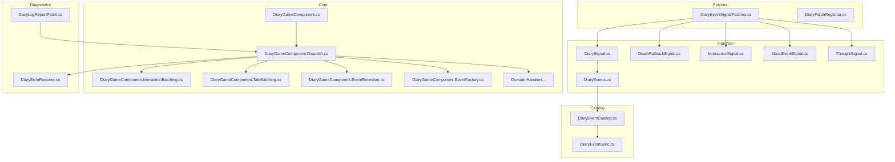
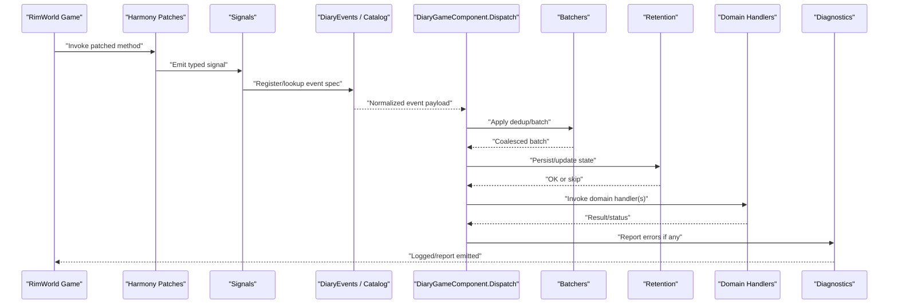
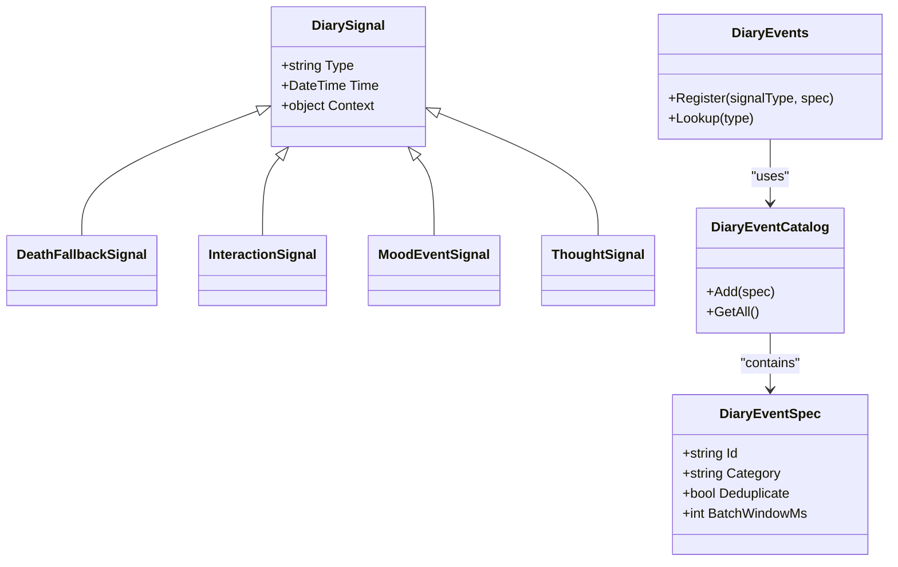
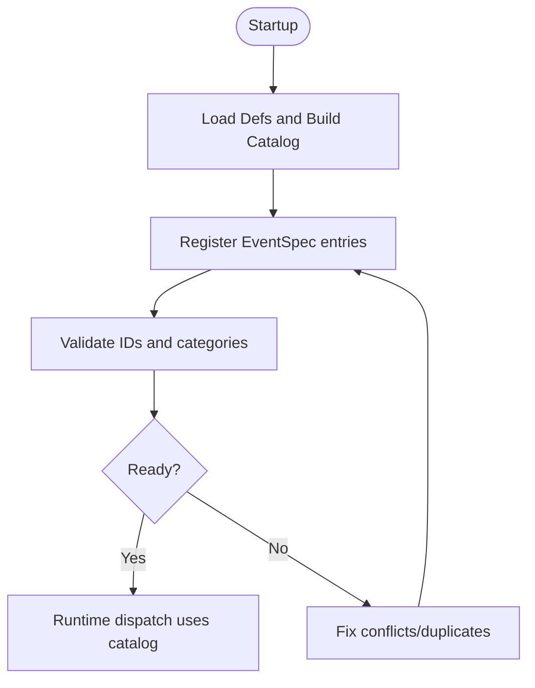
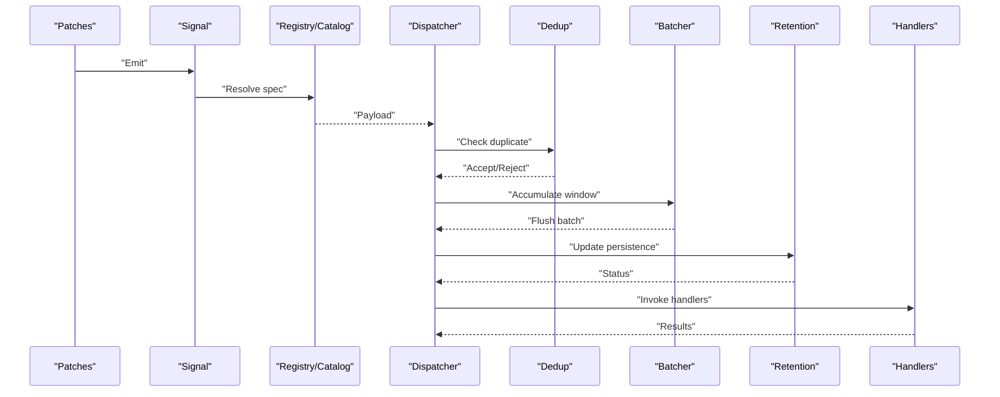
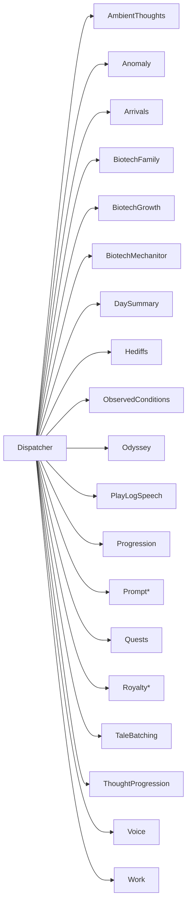
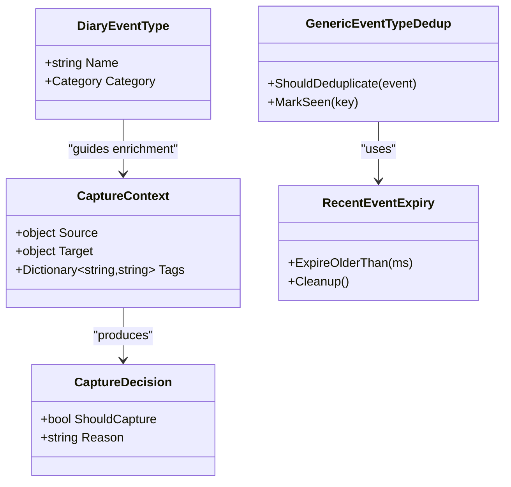
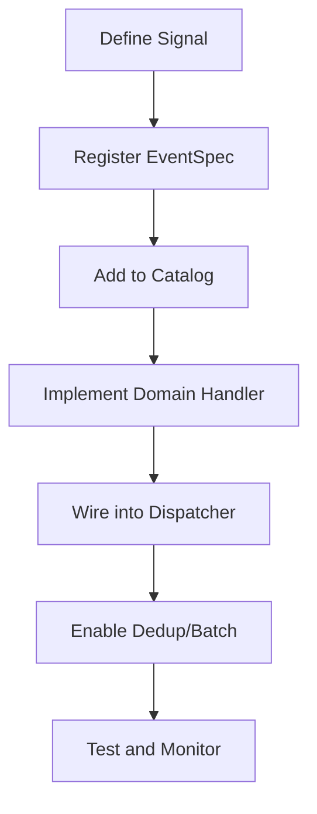
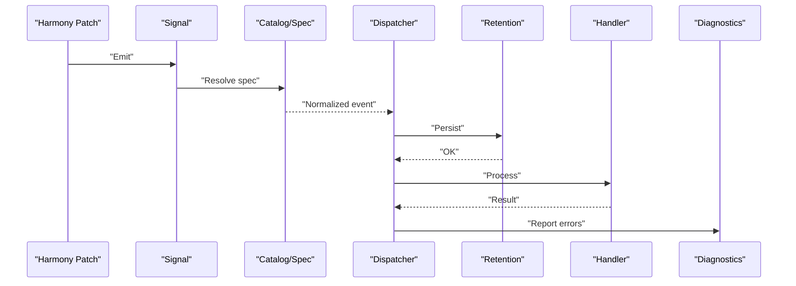
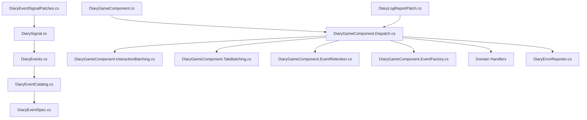

# Event Processing System

## Table of Contents
1. [Introduction](#introduction)
2. [Project Structure](#project-structure)
3. [Core Components](#core-components)
4. [Architecture Overview](#architecture-overview)
5. [Detailed Component Analysis](#detailed-component-analysis)
6. [Dependency Analysis](#dependency-analysis)
7. [Performance Considerations](#performance-considerations)
8. [Troubleshooting Guide](#troubleshooting-guide)
9. [Conclusion](#conclusion)
10. [Appendices](#appendices)

## Introduction
This document explains the event processing system used by the mod. It focuses on a signal-based architecture where game events are captured via Harmony patches, converted into structured signals, and then dispatched through a pipeline that supports deduplication, batching, retention, and error handling. You will learn how to register event types, define capture policies for different domains (death, interaction, mood, etc.), create custom handlers, and optimize performance for high-frequency events.

## Project Structure
The event system spans several areas:
- Patches: Capture raw game events and emit signals
- Ingestion: Signal definitions and typed event registry
- Catalog: Event type catalog and spec registration
- Core: Game component orchestration, dispatch, batching, retention, and domain-specific handlers
- Diagnostics: Error reporting and logging integration

**Diagram sources**
- [DiaryEventSignalPatches.cs](../../../../Source/Patches/DiaryEventSignalPatches.cs)
- [DiaryPatchRegistrar.cs](../../../../Source/Patches/DiaryPatchRegistrar.cs)
- [DiarySignal.cs](../../../../Source/Ingestion/DiarySignal.cs)
- [DiaryEvents.cs](../../../../Source/Ingestion/DiaryEvents.cs)
- [DeathFallbackSignal.cs](../../../../Source/Ingestion/Sources/DeathFallbackSignal.cs)
- [InteractionSignal.cs](../../../../Source/Ingestion/Sources/InteractionSignal.cs)
- [MoodEventSignal.cs](../../../../Source/Ingestion/Sources/MoodEventSignal.cs)
- [ThoughtSignal.cs](../../../../Source/Ingestion/Sources/ThoughtSignal.cs)
- [DiaryEventCatalog.cs](../../../../Source/Capture/Catalog/DiaryEventCatalog.cs)
- [DiaryEventSpec.cs](../../../../Source/Capture/Catalog/DiaryEventSpec.cs)
- [DiaryGameComponent.cs](../../../../Source/Core/DiaryGameComponent.cs)
- [DiaryGameComponent.Dispatch.cs](../../../../Source/Core/DiaryGameComponent.Dispatch.cs)
- [DiaryGameComponent.InteractionBatching.cs](../../../../Source/Core/DiaryGameComponent.InteractionBatching.cs)
- [DiaryGameComponent.TaleBatching.cs](../../../../Source/Core/DiaryGameComponent.TaleBatching.cs)
- [DiaryGameComponent.EventRetention.cs](../../../../Source/Core/DiaryGameComponent.EventRetention.cs)
- [DiaryGameComponent.EventFactory.cs](../../../../Source/Core/DiaryGameComponent.EventFactory.cs)
- [DiaryErrorReporter.cs](../../../../Source/Diagnostics/DiaryErrorReporter.cs)
- [DiaryLogReportPatch.cs](../../../../Source/Diagnostics/DiaryLogReportPatch.cs)

**Section sources**
- [DiaryGameComponent.cs](../../../../Source/Core/DiaryGameComponent.cs)
- [DiaryEventSignalPatches.cs](../../../../Source/Patches/DiaryEventSignalPatches.cs)
- [DiaryPatchRegistrar.cs](../../../../Source/Patches/DiaryPatchRegistrar.cs)
- [DiarySignal.cs](../../../../Source/Ingestion/DiarySignal.cs)
- [DiaryEvents.cs](../../../../Source/Ingestion/DiaryEvents.cs)
- [DiaryEventCatalog.cs](../../../../Source/Capture/Catalog/DiaryEventCatalog.cs)
- [DiaryEventSpec.cs](../../../../Source/Capture/Catalog/DiaryEventSpec.cs)
- [DiaryGameComponent.Dispatch.cs](../../../../Source/Core/DiaryGameComponent.Dispatch.cs)
- [DiaryGameComponent.InteractionBatching.cs](../../../../Source/Core/DiaryGameComponent.InteractionBatching.cs)
- [DiaryGameComponent.TaleBatching.cs](../../../../Source/Core/DiaryGameComponent.TaleBatching.cs)
- [DiaryGameComponent.EventRetention.cs](../../../../Source/Core/DiaryGameComponent.EventRetention.cs)
- [DiaryGameComponent.EventFactory.cs](../../../../Source/Core/DiaryGameComponent.EventFactory.cs)
- [DiaryErrorReporter.cs](../../../../Source/Diagnostics/DiaryErrorReporter.cs)
- [DiaryLogReportPatch.cs](../../../../Source/Diagnostics/DiaryLogReportPatch.cs)

## Core Components
- Patch layer: Hooks into game methods using Harmony and emits strongly-typed signals.
- Signal ingestion: A central registry maps signals to event specs and catalogs.
- Catalog and specs: Centralized registration of event types and their metadata.
- Dispatch pipeline: Orchestrates deduplication, batching, retention, and handler invocation.
- Domain handlers: Specialized logic per event category (e.g., death, interactions, mood).
- Diagnostics: Error reporting and log integration.

Key responsibilities:
- Capture: Convert patch-time context into signals with minimal overhead.
- Normalize: Map signals to event specs and enrich with context.
- Route: Apply deduplication and batching before dispatch.
- Process: Invoke domain handlers and persist results.
- Observe: Provide snapshots and API access for external consumers.

**Section sources**
- [DiaryEventSignalPatches.cs](../../../../Source/Patches/DiaryEventSignalPatches.cs)
- [DiarySignal.cs](../../../../Source/Ingestion/DiarySignal.cs)
- [DiaryEvents.cs](../../../../Source/Ingestion/DiaryEvents.cs)
- [DiaryEventCatalog.cs](../../../../Source/Capture/Catalog/DiaryEventCatalog.cs)
- [DiaryEventSpec.cs](../../../../Source/Capture/Catalog/DiaryEventSpec.cs)
- [DiaryGameComponent.Dispatch.cs](../../../../Source/Core/DiaryGameComponent.Dispatch.cs)
- [DiaryGameComponent.InteractionBatching.cs](../../../../Source/Core/DiaryGameComponent.InteractionBatching.cs)
- [DiaryGameComponent.TaleBatching.cs](../../../../Source/Core/DiaryGameComponent.TaleBatching.cs)
- [DiaryGameComponent.EventRetention.cs](../../../../Source/Core/DiaryGameComponent.EventRetention.cs)
- [DiaryGameComponent.EventFactory.cs](../../../../Source/Core/DiaryGameComponent.EventFactory.cs)

## Architecture Overview
The system follows a clear separation between capture (patches), ingestion (signals), catalog/spec registration, and dispatch. The core game component coordinates lifecycle and delegates to specialized modules.

**Diagram sources**
- [DiaryEventSignalPatches.cs](../../../../Source/Patches/DiaryEventSignalPatches.cs)
- [DiarySignal.cs](../../../../Source/Ingestion/DiarySignal.cs)
- [DiaryEvents.cs](../../../../Source/Ingestion/DiaryEvents.cs)
- [DiaryEventCatalog.cs](../../../../Source/Capture/Catalog/DiaryEventCatalog.cs)
- [DiaryEventSpec.cs](../../../../Source/Capture/Catalog/DiaryEventSpec.cs)
- [DiaryGameComponent.Dispatch.cs](../../../../Source/Core/DiaryGameComponent.Dispatch.cs)
- [DiaryGameComponent.InteractionBatching.cs](../../../../Source/Core/DiaryGameComponent.InteractionBatching.cs)
- [DiaryGameComponent.TaleBatching.cs](../../../../Source/Core/DiaryGameComponent.TaleBatching.cs)
- [DiaryGameComponent.EventRetention.cs](../../../../Source/Core/DiaryGameComponent.EventRetention.cs)
- [DiaryErrorReporter.cs](../../../../Source/Diagnostics/DiaryErrorReporter.cs)

## Detailed Component Analysis

### Signal-Based Capture and Registration
- Signals represent discrete occurrences (e.g., death, interaction, mood change). They are emitted from patches and consumed by the ingestion layer.
- The event registry maps signals to event specifications and catalogs, enabling consistent normalization and routing.

**Diagram sources**
- [DiarySignal.cs](../../../../Source/Ingestion/DiarySignal.cs)
- [DeathFallbackSignal.cs](../../../../Source/Ingestion/Sources/DeathFallbackSignal.cs)
- [InteractionSignal.cs](../../../../Source/Ingestion/Sources/InteractionSignal.cs)
- [MoodEventSignal.cs](../../../../Source/Ingestion/Sources/MoodEventSignal.cs)
- [ThoughtSignal.cs](../../../../Source/Ingestion/Sources/ThoughtSignal.cs)
- [DiaryEvents.cs](../../../../Source/Ingestion/DiaryEvents.cs)
- [DiaryEventCatalog.cs](../../../../Source/Capture/Catalog/DiaryEventCatalog.cs)
- [DiaryEventSpec.cs](../../../../Source/Capture/Catalog/DiaryEventSpec.cs)

**Section sources**
- [DiarySignal.cs](../../../../Source/Ingestion/DiarySignal.cs)
- [DeathFallbackSignal.cs](../../../../Source/Ingestion/Sources/DeathFallbackSignal.cs)
- [InteractionSignal.cs](../../../../Source/Ingestion/Sources/InteractionSignal.cs)
- [MoodEventSignal.cs](../../../../Source/Ingestion/Sources/MoodEventSignal.cs)
- [ThoughtSignal.cs](../../../../Source/Ingestion/Sources/ThoughtSignal.cs)
- [DiaryEvents.cs](../../../../Source/Ingestion/DiaryEvents.cs)
- [DiaryEventCatalog.cs](../../../../Source/Capture/Catalog/DiaryEventCatalog.cs)
- [DiaryEventSpec.cs](../../../../Source/Capture/Catalog/DiaryEventSpec.cs)

### Event Catalog and Spec Registration
- The catalog centralizes event definitions and provides lookup during dispatch.
- Specs describe event identity, category, deduplication behavior, and batching windows.

**Diagram sources**
- [DiaryEventCatalog.cs](../../../../Source/Capture/Catalog/DiaryEventCatalog.cs)
- [DiaryEventSpec.cs](../../../../Source/Capture/Catalog/DiaryEventSpec.cs)

**Section sources**
- [DiaryEventCatalog.cs](../../../../Source/Capture/Catalog/DiaryEventCatalog.cs)
- [DiaryEventSpec.cs](../../../../Source/Capture/Catalog/DiaryEventSpec.cs)

### Dispatch Pipeline
The dispatcher normalizes signals, applies deduplication and batching, persists state, and invokes domain handlers.

**Diagram sources**
- [DiaryGameComponent.Dispatch.cs](../../../../Source/Core/DiaryGameComponent.Dispatch.cs)
- [DiaryGameComponent.InteractionBatching.cs](../../../../Source/Core/DiaryGameComponent.InteractionBatching.cs)
- [DiaryGameComponent.TaleBatching.cs](../../../../Source/Core/DiaryGameComponent.TaleBatching.cs)
- [DiaryGameComponent.EventRetention.cs](../../../../Source/Core/DiaryGameComponent.EventRetention.cs)
- [DiaryEventCatalog.cs](../../../../Source/Capture/Catalog/DiaryEventCatalog.cs)
- [DiaryEventSpec.cs](../../../../Source/Capture/Catalog/DiaryEventSpec.cs)

**Section sources**
- [DiaryGameComponent.Dispatch.cs](../../../../Source/Core/DiaryGameComponent.Dispatch.cs)
- [DiaryGameComponent.InteractionBatching.cs](../../../../Source/Core/DiaryGameComponent.InteractionBatching.cs)
- [DiaryGameComponent.TaleBatching.cs](../../../../Source/Core/DiaryGameComponent.TaleBatching.cs)
- [DiaryGameComponent.EventRetention.cs](../../../../Source/Core/DiaryGameComponent.EventRetention.cs)

### Domain-Specific Handlers
Domain handlers encapsulate processing logic for specific event categories. Examples include ambient thoughts, anomaly events, arrivals, biotech family/growth/mechanitor flows, day summaries, hediffs, observed conditions, odyssey journeys, playlog speech, progression, prompts, quests, royalty systems, tales, thought progression, voice, and work.

**Diagram sources**
- [DiaryGameComponent.AmbientThoughts.cs](../../../../Source/Core/DiaryGameComponent.AmbientThoughts.cs)
- [DiaryGameComponent.Anomaly.cs](../../../../Source/Core/DiaryGameComponent.Anomaly.cs)
- [DiaryGameComponent.Arrivals.cs](../../../../Source/Core/DiaryGameComponent.Arrivals.cs)
- [DiaryGameComponent.BiotechFamily.cs](../../../../Source/Core/DiaryGameComponent.BiotechFamily.cs)
- [DiaryGameComponent.BiotechGrowth.cs](../../../../Source/Core/DiaryGameComponent.BiotechGrowth.cs)
- [DiaryGameComponent.BiotechMechanitor.cs](../../../../Source/Core/DiaryGameComponent.BiotechMechanitor.cs)
- [DiaryGameComponent.DaySummary.cs](../../../../Source/Core/DiaryGameComponent.DaySummary.cs)
- [DiaryGameComponent.Hediffs.cs](../../../../Source/Core/DiaryGameComponent.Hediffs.cs)
- [DiaryGameComponent.ObservedConditions.cs](../../../../Source/Core/DiaryGameComponent.ObservedConditions.cs)
- [DiaryGameComponent.Odyssey.cs](../../../../Source/Core/DiaryGameComponent.Odyssey.cs)
- [DiaryGameComponent.PlayLogSpeech.cs](../../../../Source/Core/DiaryGameComponent.PlayLogSpeech.cs)
- [DiaryGameComponent.Progression.cs](../../../../Source/Core/DiaryGameComponent.Progression.cs)
- [DiaryGameComponent.PromptPreview.cs](../../../../Source/Core/DiaryGameComponent.PromptPreview.cs)
- [DiaryGameComponent.PromptTestSuite.cs](../../../../Source/Core/DiaryGameComponent.PromptTestSuite.cs)
- [DiaryGameComponent.Quests.cs](../../../../Source/Core/DiaryGameComponent.Quests.cs)
- [DiaryGameComponent.Royalty.cs](../../../../Source/Core/DiaryGameComponent.Royalty.cs)
- [DiaryGameComponent.RoyaltyMilestones.cs](../../../../Source/Core/DiaryGameComponent.RoyaltyMilestones.cs)
- [DiaryGameComponent.RoyaltyPermits.cs](../../../../Source/Core/DiaryGameComponent.RoyaltyPermits.cs)
- [DiaryGameComponent.RoyaltyProgression.cs](../../../../Source/Core/DiaryGameComponent.RoyaltyProgression.cs)
- [DiaryGameComponent.TaleBatching.cs](../../../../Source/Core/DiaryGameComponent.TaleBatching.cs)
- [DiaryGameComponent.ThoughtProgression.cs](../../../../Source/Core/DiaryGameComponent.ThoughtProgression.cs)
- [DiaryGameComponent.Voice.cs](../../../../Source/Core/DiaryGameComponent.Voice.cs)
- [DiaryGameComponent.Work.cs](../../../../Source/Core/DiaryGameComponent.Work.cs)

**Section sources**
- [DiaryGameComponent.AmbientThoughts.cs](../../../../Source/Core/DiaryGameComponent.AmbientThoughts.cs)
- [DiaryGameComponent.Anomaly.cs](../../../../Source/Core/DiaryGameComponent.Anomaly.cs)
- [DiaryGameComponent.Arrivals.cs](../../../../Source/Core/DiaryGameComponent.Arrivals.cs)
- [DiaryGameComponent.BiotechFamily.cs](../../../../Source/Core/DiaryGameComponent.BiotechFamily.cs)
- [DiaryGameComponent.BiotechGrowth.cs](../../../../Source/Core/DiaryGameComponent.BiotechGrowth.cs)
- [DiaryGameComponent.BiotechMechanitor.cs](../../../../Source/Core/DiaryGameComponent.BiotechMechanitor.cs)
- [DiaryGameComponent.DaySummary.cs](../../../../Source/Core/DiaryGameComponent.DaySummary.cs)
- [DiaryGameComponent.Hediffs.cs](../../../../Source/Core/DiaryGameComponent.Hediffs.cs)
- [DiaryGameComponent.ObservedConditions.cs](../../../../Source/Core/DiaryGameComponent.ObservedConditions.cs)
- [DiaryGameComponent.Odyssey.cs](../../../../Source/Core/DiaryGameComponent.Odyssey.cs)
- [DiaryGameComponent.PlayLogSpeech.cs](../../../../Source/Core/DiaryGameComponent.PlayLogSpeech.cs)
- [DiaryGameComponent.Progression.cs](../../../../Source/Core/DiaryGameComponent.Progression.cs)
- [DiaryGameComponent.PromptPreview.cs](../../../../Source/Core/DiaryGameComponent.PromptPreview.cs)
- [DiaryGameComponent.PromptTestSuite.cs](../../../../Source/Core/DiaryGameComponent.PromptTestSuite.cs)
- [DiaryGameComponent.Quests.cs](../../../../Source/Core/DiaryGameComponent.Quests.cs)
- [DiaryGameComponent.Royalty.cs](../../../../Source/Core/DiaryGameComponent.Royalty.cs)
- [DiaryGameComponent.RoyaltyMilestones.cs](../../../../Source/Core/DiaryGameComponent.RoyaltyMilestones.cs)
- [DiaryGameComponent.RoyaltyPermits.cs](../../../../Source/Core/DiaryGameComponent.RoyaltyPermits.cs)
- [DiaryGameComponent.RoyaltyProgression.cs](../../../../Source/Core/DiaryGameComponent.RoyaltyProgression.cs)
- [DiaryGameComponent.TaleBatching.cs](../../../../Source/Core/DiaryGameComponent.TaleBatching.cs)
- [DiaryGameComponent.ThoughtProgression.cs](../../../../Source/Core/DiaryGameComponent.ThoughtProgression.cs)
- [DiaryGameComponent.Voice.cs](../../../../Source/Core/DiaryGameComponent.Voice.cs)
- [DiaryGameComponent.Work.cs](../../../../Source/Core/DiaryGameComponent.Work.cs)

### Capture Policies and Event Types
- Event types are defined centrally and referenced by both signals and handlers.
- Capture decisions and contexts determine whether an event should be processed, enriched, or skipped.
- Deduplication strategies prevent redundant processing for high-frequency events.

**Diagram sources**
- [DiaryEventType.cs](../../../../Source/Capture/DiaryEventType.cs)
- [CaptureContext.cs](../../../../Source/Capture/CaptureContext.cs)
- [CaptureDecision.cs](../../../../Source/Capture/CaptureDecision.cs)
- [GenericEventTypeDedup.cs](../../../../Source/Capture/GenericEventTypeDedup.cs)
- [RecentEventExpiry.cs](../../../../Source/Capture/RecentEventExpiry.cs)

**Section sources**
- [DiaryEventType.cs](../../../../Source/Capture/DiaryEventType.cs)
- [CaptureContext.cs](../../../../Source/Capture/CaptureContext.cs)
- [CaptureDecision.cs](../../../../Source/Capture/CaptureDecision.cs)
- [GenericEventTypeDedup.cs](../../../../Source/Capture/GenericEventTypeDedup.cs)
- [RecentEventExpiry.cs](../../../../Source/Capture/RecentEventExpiry.cs)

### Creating Custom Event Handlers
To add a new event type and handler:
- Define a signal type under the ingestion sources folder.
- Register the event spec and add it to the catalog.
- Implement a domain handler module under Core and wire it into the dispatcher.
- Optionally configure deduplication and batching via the event spec.

[No sources needed since this section provides general guidance]

### Event Lifecycle: From Patch to Processing
A typical flow:
- A Harmony patch detects a game action and emits a signal.
- The ingestion layer resolves the event spec and normalizes the payload.
- The dispatcher applies deduplication and batching.
- Retention updates persistent state.
- Domain handlers process the event and produce outputs.
- Diagnostics capture any errors.

**Diagram sources**
- [DiaryEventSignalPatches.cs](../../../../Source/Patches/DiaryEventSignalPatches.cs)
- [DiaryEventCatalog.cs](../../../../Source/Capture/Catalog/DiaryEventCatalog.cs)
- [DiaryEventSpec.cs](../../../../Source/Capture/Catalog/DiaryEventSpec.cs)
- [DiaryGameComponent.Dispatch.cs](../../../../Source/Core/DiaryGameComponent.Dispatch.cs)
- [DiaryGameComponent.EventRetention.cs](../../../../Source/Core/DiaryGameComponent.EventRetention.cs)
- [DiaryErrorReporter.cs](../../../../Source/Diagnostics/DiaryErrorReporter.cs)

**Section sources**
- [DiaryEventSignalPatches.cs](../../../../Source/Patches/DiaryEventSignalPatches.cs)
- [DiaryEventCatalog.cs](../../../../Source/Capture/Catalog/DiaryEventCatalog.cs)
- [DiaryEventSpec.cs](../../../../Source/Capture/Catalog/DiaryEventSpec.cs)
- [DiaryGameComponent.Dispatch.cs](../../../../Source/Core/DiaryGameComponent.Dispatch.cs)
- [DiaryGameComponent.EventRetention.cs](../../../../Source/Core/DiaryGameComponent.EventRetention.cs)
- [DiaryErrorReporter.cs](../../../../Source/Diagnostics/DiaryErrorReporter.cs)

## Dependency Analysis
The following diagram shows key dependencies among core components involved in event processing.

**Diagram sources**
- [DiaryEventSignalPatches.cs](../../../../Source/Patches/DiaryEventSignalPatches.cs)
- [DiarySignal.cs](../../../../Source/Ingestion/DiarySignal.cs)
- [DiaryEvents.cs](../../../../Source/Ingestion/DiaryEvents.cs)
- [DiaryEventCatalog.cs](../../../../Source/Capture/Catalog/DiaryEventCatalog.cs)
- [DiaryEventSpec.cs](../../../../Source/Capture/Catalog/DiaryEventSpec.cs)
- [DiaryGameComponent.cs](../../../../Source/Core/DiaryGameComponent.cs)
- [DiaryGameComponent.Dispatch.cs](../../../../Source/Core/DiaryGameComponent.Dispatch.cs)
- [DiaryGameComponent.InteractionBatching.cs](../../../../Source/Core/DiaryGameComponent.InteractionBatching.cs)
- [DiaryGameComponent.TaleBatching.cs](../../../../Source/Core/DiaryGameComponent.TaleBatching.cs)
- [DiaryGameComponent.EventRetention.cs](../../../../Source/Core/DiaryGameComponent.EventRetention.cs)
- [DiaryGameComponent.EventFactory.cs](../../../../Source/Core/DiaryGameComponent.EventFactory.cs)
- [DiaryErrorReporter.cs](../../../../Source/Diagnostics/DiaryErrorReporter.cs)
- [DiaryLogReportPatch.cs](../../../../Source/Diagnostics/DiaryLogReportPatch.cs)

**Section sources**
- [DiaryEventSignalPatches.cs](../../../../Source/Patches/DiaryEventSignalPatches.cs)
- [DiarySignal.cs](../../../../Source/Ingestion/DiarySignal.cs)
- [DiaryEvents.cs](../../../../Source/Ingestion/DiaryEvents.cs)
- [DiaryEventCatalog.cs](../../../../Source/Capture/Catalog/DiaryEventCatalog.cs)
- [DiaryEventSpec.cs](../../../../Source/Capture/Catalog/DiaryEventSpec.cs)
- [DiaryGameComponent.cs](../../../../Source/Core/DiaryGameComponent.cs)
- [DiaryGameComponent.Dispatch.cs](../../../../Source/Core/DiaryGameComponent.Dispatch.cs)
- [DiaryGameComponent.InteractionBatching.cs](../../../../Source/Core/DiaryGameComponent.InteractionBatching.cs)
- [DiaryGameComponent.TaleBatching.cs](../../../../Source/Core/DiaryGameComponent.TaleBatching.cs)
- [DiaryGameComponent.EventRetention.cs](../../../../Source/Core/DiaryGameComponent.EventRetention.cs)
- [DiaryGameComponent.EventFactory.cs](../../../../Source/Core/DiaryGameComponent.EventFactory.cs)
- [DiaryErrorReporter.cs](../../../../Source/Diagnostics/DiaryErrorReporter.cs)
- [DiaryLogReportPatch.cs](../../../../Source/Diagnostics/DiaryLogReportPatch.cs)

## Performance Considerations
- Prefer lightweight patches: minimize allocations and avoid heavy computations inside patched methods.
- Use batching for high-frequency events (e.g., interactions, tales) to reduce dispatch overhead.
- Enable deduplication for noisy events to avoid redundant processing.
- Tune retention windows to balance memory usage and narrative continuity.
- Avoid synchronous I/O in hot paths; defer to background or batched operations.
- Profile critical paths and monitor error rates to detect regressions early.

[No sources needed since this section provides general guidance]

## Troubleshooting Guide
Common issues and patterns:
- Duplicate events: Verify dedup keys and expiry settings.
- Missing events: Ensure patch registration and signal emission occur at the correct hook points.
- High CPU spikes: Check batching windows and handler complexity.
- Errors in handlers: Inspect diagnostics reports and logs for stack traces and payloads.

Operational tips:
- Use the diagnostic reporter to capture structured error information.
- Leverage log report patches to correlate runtime issues with game state.
- Validate catalog registrations to avoid ID collisions.

**Section sources**
- [DiaryErrorReporter.cs](../../../../Source/Diagnostics/DiaryErrorReporter.cs)
- [DiaryLogReportPatch.cs](../../../../Source/Diagnostics/DiaryLogReportPatch.cs)

## Conclusion
The event processing system provides a robust, extensible framework for capturing, normalizing, and dispatching game events. By leveraging signals, a centralized catalog, and a flexible dispatch pipeline with deduplication and batching, the mod achieves both reliability and performance. Domain handlers encapsulate complex logic cleanly, while diagnostics ensure maintainability. Following the guidelines here will help you integrate new events efficiently and keep the system performant under load.

[No sources needed since this section summarizes without analyzing specific files]

## Appendices

### Example Event Types and Their Handlers
- Death: handled via fallback signal and dedicated domain logic.
- Interactions: captured through interaction signals and processed with batching.
- Mood changes: captured via mood event signals and routed to relevant handlers.
- Thoughts: captured via thought signals and integrated with progression systems.

**Section sources**
- [DeathFallbackSignal.cs](../../../../Source/Ingestion/Sources/DeathFallbackSignal.cs)
- [InteractionSignal.cs](../../../../Source/Ingestion/Sources/InteractionSignal.cs)
- [MoodEventSignal.cs](../../../../Source/Ingestion/Sources/MoodEventSignal.cs)
- [ThoughtSignal.cs](../../../../Source/Ingestion/Sources/ThoughtSignal.cs)
- [DiaryGameComponent.InteractionBatching.cs](../../../../Source/Core/DiaryGameComponent.InteractionBatching.cs)
- [DiaryGameComponent.TaleBatching.cs](../../../../Source/Core/DiaryGameComponent.TaleBatching.cs)
- [DiaryGameComponent.AmbientThoughts.cs](../../../../Source/Core/DiaryGameComponent.AmbientThoughts.cs)
