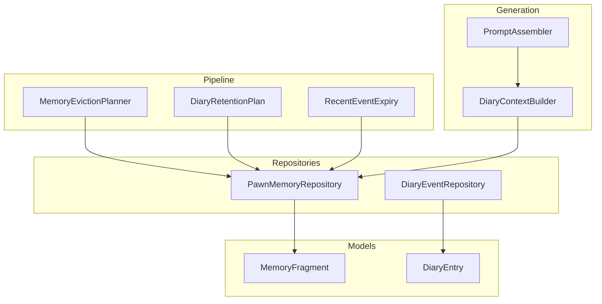
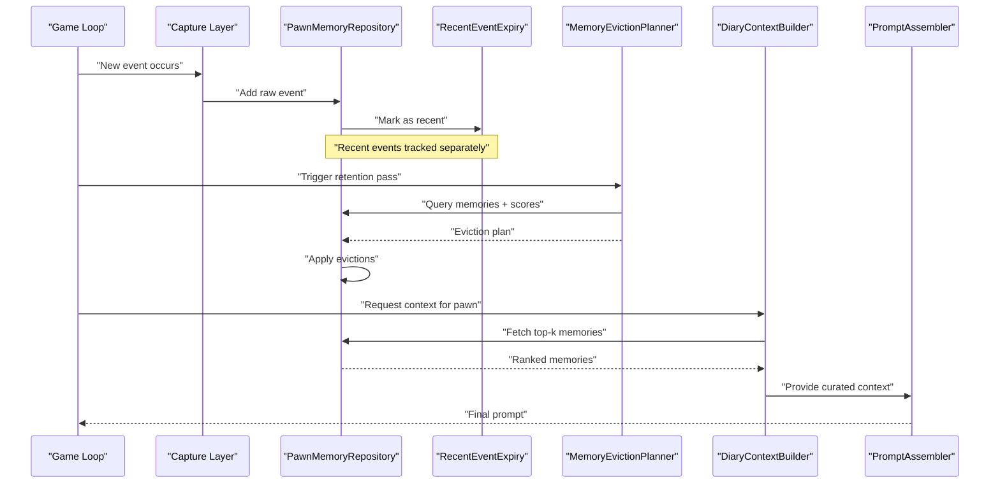
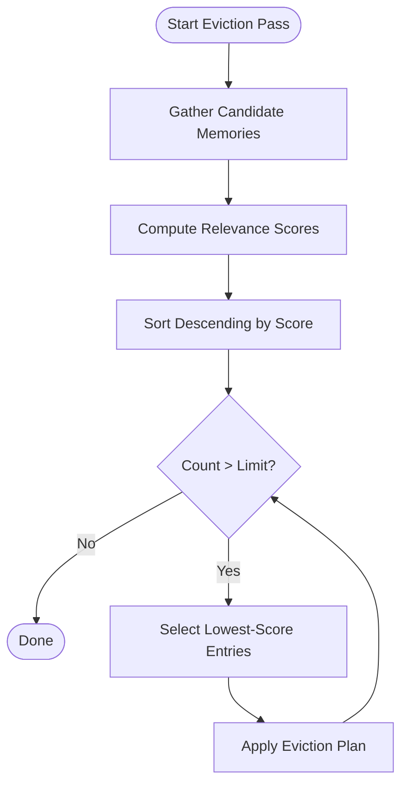
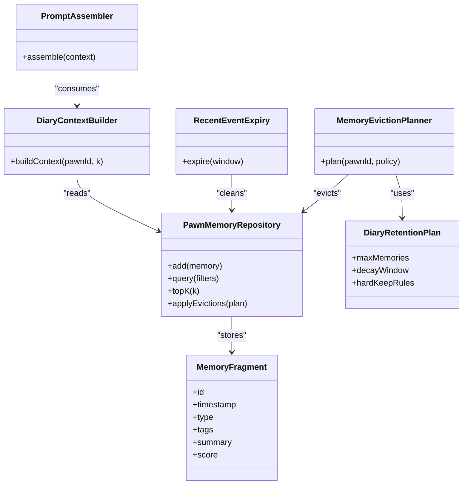

# Memory Management

- [PawnMemoryRepository.cs](../../../../Source/Core/PawnMemoryRepository.cs)
- [MemoryFragment.cs](../../../../Source/Models/MemoryFragment.cs)
- [MemoryEvictionPlanner.cs](../../../../Source/Pipeline/Memory/MemoryEvictionPlanner.cs)
- [DiaryEventRepository.cs](../../../../Source/Core/DiaryEventRepository.cs)
- [DiaryRetentionPlan.cs](../../../../Source/Pipeline/DiaryRetentionPlan.cs)
- [RecentEventExpiry.cs](../../../../Source/Capture/RecentEventExpiry.cs)
- [DiaryGameComponent.EventRetention.cs](../../../../Source/Core/DiaryGameComponent.EventRetention.cs)
- [DiaryContextBuilder.cs](../../../../Source/Generation/DiaryContextBuilder.cs)
- [PromptAssembler.cs](../../../../Source/Generation/PromptAssembler.cs)
## Table of Contents
1. [Introduction](#introduction)
2. [Project Structure](#project-structure)
3. [Core Components](#core-components)
4. [Architecture Overview](#architecture-overview)
5. [Detailed Component Analysis](#detailed-component-analysis)
6. [Dependency Analysis](#dependency-analysis)
7. [Performance Considerations](#performance-considerations)
8. [Troubleshooting Guide](#troubleshooting-guide)
9. [Conclusion](#conclusion)

## Introduction
This document explains the memory management system that provides short-term context for AI generation. It focuses on:
- The pawn-specific memory repository and how it stores recent events and contextual information
- The memory fragment structure used to represent concise, reusable pieces of context
- Eviction planning algorithms that prioritize and clean up memories to optimize prompt construction
- How relevance scoring, retention policies, and limits are applied
- Practical examples of accessing pawn memories and configuring retention behavior
- Garbage collection strategies and their performance impact on gameplay

## Project Structure
The memory subsystem spans several layers:
- Models define core data structures such as memory fragments and diary entries
- Repositories provide per-pawn storage and retrieval
- Pipeline components implement eviction planning, retention, and recall selection
- Generation components consume curated memory to build prompts

**Diagram sources**
- [PawnMemoryRepository.cs](../../../../Source/Core/PawnMemoryRepository.cs)
- [MemoryFragment.cs](../../../../Source/Models/MemoryFragment.cs)
- [DiaryEventRepository.cs](../../../../Source/Core/DiaryEventRepository.cs)
- [MemoryEvictionPlanner.cs](../../../../Source/Pipeline/Memory/MemoryEvictionPlanner.cs)
- [DiaryRetentionPlan.cs](../../../../Source/Pipeline/DiaryRetentionPlan.cs)
- [RecentEventExpiry.cs](../../../../Source/Capture/RecentEventExpiry.cs)
- [DiaryContextBuilder.cs](../../../../Source/Generation/DiaryContextBuilder.cs)
- [PromptAssembler.cs](../../../../Source/Generation/PromptAssembler.cs)

**Section sources**
- [PawnMemoryRepository.cs](../../../../Source/Core/PawnMemoryRepository.cs)
- [MemoryFragment.cs](../../../../Source/Models/MemoryFragment.cs)
- [DiaryEventRepository.cs](../../../../Source/Core/DiaryEventRepository.cs)
- [MemoryEvictionPlanner.cs](../../../../Source/Pipeline/Memory/MemoryEvictionPlanner.cs)
- [DiaryRetentionPlan.cs](../../../../Source/Pipeline/DiaryRetentionPlan.cs)
- [RecentEventExpiry.cs](../../../../Source/Capture/RecentEventExpiry.cs)
- [DiaryContextBuilder.cs](../../../../Source/Generation/DiaryContextBuilder.cs)
- [PromptAssembler.cs](../../../../Source/Generation/PromptAssembler.cs)

## Core Components
- PawnMemoryRepository: Per-pawn store for short-term memories and recent events; exposes methods to add, query, and prune memories.
- MemoryFragment: Lightweight representation of a single memory unit with metadata (timestamp, type, tags, score).
- MemoryEvictionPlanner: Computes which memories to evict based on retention policies, recency, and relevance scores.
- DiaryRetentionPlan: Encapsulates global and per-pawn retention rules (limits, decay windows, thresholds).
- RecentEventExpiry: Manages time-based expiration of very recent events before they become formal memories.
- DiaryContextBuilder and PromptAssembler: Consume curated memories to assemble AI prompts efficiently.

Key responsibilities:
- Maintain a bounded set of recent, relevant memories per pawn
- Score and rank memories by relevance and recency
- Evict low-value memories when limits are exceeded
- Provide stable access patterns for generation pipelines

**Section sources**
- [PawnMemoryRepository.cs](../../../../Source/Core/PawnMemoryRepository.cs)
- [MemoryFragment.cs](../../../../Source/Models/MemoryFragment.cs)
- [MemoryEvictionPlanner.cs](../../../../Source/Pipeline/Memory/MemoryEvictionPlanner.cs)
- [DiaryRetentionPlan.cs](../../../../Source/Pipeline/DiaryRetentionPlan.cs)
- [RecentEventExpiry.cs](../../../../Source/Capture/RecentEventExpiry.cs)
- [DiaryContextBuilder.cs](../../../../Source/Generation/DiaryContextBuilder.cs)
- [PromptAssembler.cs](../../../../Source/Generation/PromptAssembler.cs)

## Architecture Overview
The memory lifecycle flows from event capture through repositories into eviction planning and finally into prompt assembly.

**Diagram sources**
- [PawnMemoryRepository.cs](../../../../Source/Core/PawnMemoryRepository.cs)
- [RecentEventExpiry.cs](../../../../Source/Capture/RecentEventExpiry.cs)
- [MemoryEvictionPlanner.cs](../../../../Source/Pipeline/Memory/MemoryEvictionPlanner.cs)
- [DiaryContextBuilder.cs](../../../../Source/Generation/DiaryContextBuilder.cs)
- [PromptAssembler.cs](../../../../Source/Generation/PromptAssembler.cs)

## Detailed Component Analysis

### Pawn-Specific Memory Repository
Responsibilities:
- Store and retrieve memories per pawn
- Index by time, type, and tags
- Support queries for top-k most relevant memories
- Apply eviction plans produced by the planner

Access patterns:
- Add new memories or recent events
- Query by filters (time window, types, tags)
- Retrieve ranked list for prompt building
- Purge expired or evicted entries

Relevance scoring inputs:
- Recency weight
- Type importance
- Tag presence
- Interaction frequency or narrative significance

Garbage collection hooks:
- Batched removals after eviction planning
- Time-based cleanup via recent event expiry

**Section sources**
- [PawnMemoryRepository.cs](../../../../Source/Core/PawnMemoryRepository.cs)

### Memory Fragment Structure
A memory fragment encapsulates:
- Identifier and timestamp
- Event type and associated tags
- A concise textual summary suitable for prompt inclusion
- Relevance score and optional priority flags

Design considerations:
- Small size to minimize memory footprint
- Immutable after creation where possible
- Serializable for save/load compatibility

Complexity:
- Insertion is O(1) amortized
- Retrieval and ranking depend on repository indexing strategy

**Section sources**
- [MemoryFragment.cs](../../../../Source/Models/MemoryFragment.cs)

### Eviction Planning Algorithms
Goals:
- Keep memory count within configured limits
- Preserve high-relevance, recent memories
- Remove low-signal or stale entries first

Algorithm outline:
- Compute scores for all candidate memories
- Sort by descending score
- Select candidates for eviction until under limit
- Respect hard constraints (e.g., keep critical milestones)

Policy integration:
- Uses DiaryRetentionPlan for limits and decay windows
- Considers RecentEventExpiry to avoid premature eviction of fresh events

**Diagram sources**
- [MemoryEvictionPlanner.cs](../../../../Source/Pipeline/Memory/MemoryEvictionPlanner.cs)
- [DiaryRetentionPlan.cs](../../../../Source/Pipeline/DiaryRetentionPlan.cs)
- [RecentEventExpiry.cs](../../../../Source/Capture/RecentEventExpiry.cs)

**Section sources**
- [MemoryEvictionPlanner.cs](../../../../Source/Pipeline/Memory/MemoryEvictionPlanner.cs)
- [DiaryRetentionPlan.cs](../../../../Source/Pipeline/DiaryRetentionPlan.cs)
- [RecentEventExpiry.cs](../../../../Source/Capture/RecentEventExpiry.cs)

### Retention Policies and Limits
Retention policy elements:
- Maximum number of memories per pawn
- Time windows for “recent” vs “long-term”
- Decay rates for older memories
- Hard-keep rules for important events (e.g., deaths, major milestones)

Configuration points:
- Global defaults and per-pawn overrides
- Tuning parameters for score weighting and thresholds

Integration:
- Applied during eviction planning
- Influences scoring and eligibility for retention

**Section sources**
- [DiaryRetentionPlan.cs](../../../../Source/Pipeline/DiaryRetentionPlan.cs)
- [DiaryGameComponent.EventRetention.cs](../../../../Source/Core/DiaryGameComponent.EventRetention.cs)

### Recent Events and Context Maintenance
Recent events:
- Tracked separately from formal memories
- Short-lived and quickly transitioned into memories or discarded
- Used to ensure freshness in immediate context

Cleanup:
- Automatic expiry after a configurable window
- Prevents duplication and reduces noise in scoring

**Section sources**
- [RecentEventExpiry.cs](../../../../Source/Capture/RecentEventExpiry.cs)

### Integration with Prompt Construction
Context building:
- DiaryContextBuilder requests top-k memories for a pawn
- Memories are filtered and ordered according to current needs
- PromptAssembler integrates memories into the final prompt template

Optimization:
- Batching of memory fetches
- Avoiding redundant text by deduplication at the builder level

**Section sources**
- [DiaryContextBuilder.cs](../../../../Source/Generation/DiaryContextBuilder.cs)
- [PromptAssembler.cs](../../../../Source/Generation/PromptAssembler.cs)

## Dependency Analysis
High-level dependencies among memory components:

**Diagram sources**
- [PawnMemoryRepository.cs](../../../../Source/Core/PawnMemoryRepository.cs)
- [MemoryFragment.cs](../../../../Source/Models/MemoryFragment.cs)
- [MemoryEvictionPlanner.cs](../../../../Source/Pipeline/Memory/MemoryEvictionPlanner.cs)
- [DiaryRetentionPlan.cs](../../../../Source/Pipeline/DiaryRetentionPlan.cs)
- [RecentEventExpiry.cs](../../../../Source/Capture/RecentEventExpiry.cs)
- [DiaryContextBuilder.cs](../../../../Source/Generation/DiaryContextBuilder.cs)
- [PromptAssembler.cs](../../../../Source/Generation/PromptAssembler.cs)

**Section sources**
- [PawnMemoryRepository.cs](../../../../Source/Core/PawnMemoryRepository.cs)
- [MemoryFragment.cs](../../../../Source/Models/MemoryFragment.cs)
- [MemoryEvictionPlanner.cs](../../../../Source/Pipeline/Memory/MemoryEvictionPlanner.cs)
- [DiaryRetentionPlan.cs](../../../../Source/Pipeline/DiaryRetentionPlan.cs)
- [RecentEventExpiry.cs](../../../../Source/Capture/RecentEventExpiry.cs)
- [DiaryContextBuilder.cs](../../../../Source/Generation/DiaryContextBuilder.cs)
- [PromptAssembler.cs](../../../../Source/Generation/PromptAssembler.cs)

## Performance Considerations
- Bounded memory usage: Enforce strict per-pawn limits to prevent unbounded growth.
- Efficient querying: Use indexed lookups by time and type to reduce scan costs.
- Batched operations: Group evictions and expirations to minimize GC pressure.
- Scoring cost: Keep scoring functions lightweight; cache intermediate results where safe.
- Prompt assembly: Prefer small, focused memory sets to reduce token counts and latency.

[No sources needed since this section provides general guidance]

## Troubleshooting Guide
Common issues and checks:
- Missing memories in prompts: Verify retention limits and eviction thresholds; confirm recent event expiry is not too aggressive.
- High CPU spikes during generation: Inspect eviction pass frequency and scoring complexity; consider batching or throttling.
- Stale context: Ensure recent events transition into memories correctly and decay windows align with gameplay pacing.
- Save bloat: Confirm that evicted memories are fully removed and not retained indirectly.

Operational tips:
- Log eviction decisions and scores for debugging.
- Monitor memory counts per pawn and overall heap usage.
- Validate retention policy tuning against observed gameplay length and event density.

**Section sources**
- [DiaryGameComponent.EventRetention.cs](../../../../Source/Core/DiaryGameComponent.EventRetention.cs)
- [MemoryEvictionPlanner.cs](../../../../Source/Pipeline/Memory/MemoryEvictionPlanner.cs)
- [RecentEventExpiry.cs](../../../../Source/Capture/RecentEventExpiry.cs)

## Conclusion
The memory management system balances relevance and brevity to deliver high-quality short-term context for AI generation. By combining a per-pawn repository, structured memory fragments, and robust eviction planning guided by retention policies, the system maintains a compact, timely knowledge base. Proper configuration of limits, decay windows, and scoring weights ensures predictable performance and consistent narrative continuity across varied gameplay scenarios.
