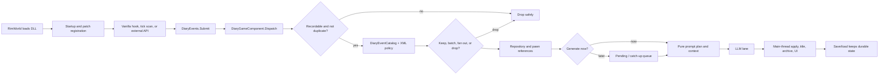

# Repository Map & Runtime Flow

This is the short human guide to where Pawn Diary lives and how one diary item moves through the mod.

## Repository map

| Area | What it owns | Change it when… |
|---|---|---|
| `About/`, `LoadFolders.xml` | RimWorld metadata and load order | the mod identity or folder layout changes |
| `1.6/Defs/` | Interaction groups, prompts, styles, tuning, windows, policies | behavior should be configurable without recompiling |
| `Languages/` | Player-facing and DefInjected text | UI or localized Def text changes |
| `Source/Capture/` | Plain event payloads and pure capture decisions | an event needs new facts or classification |
| `Source/Ingestion/` | `DiaryEvents.Submit` and signal DTOs | a producer submits a new signal |
| `Source/Core/` | lifecycle, dispatch, storage, retention, generation queue | runtime ownership or persistence changes |
| `Source/Generation/`, `Source/Pipeline/` | context, prompt planning, LLM transport, parsing, decoration | generation behavior changes |
| `Source/Integration/` | stable `PawnDiary.Integration` API and DTOs | another mod needs a supported integration capability |
| `Source/Patches/` | Harmony and reflection hooks | a vanilla event needs capture |
| `Source/Settings/`, `Source/UI/` | saved settings and Diary tab/settings UI | player controls or presentation changes |
| `tests/`, `integrations/` | pure tests and buildable adapter example | a contract or integration scenario changes |

## Runtime flow

## Boundaries that matter

- Capture reads RimWorld state once, then passes plain typed data inward.
- Catalog, prompt planning, parsing, formatting, and policy helpers should stay pure where possible.
- LLM calls, settings, DefDatabase, Scribe, Unity UI, and live pawns stay at the outer adapters.
- A no-DLC installation must still load; optional DLC data is guarded and omitted when absent.
- `DiaryEvents.Submit` is the common ingestion path. New producers should not write directly to storage or generation.

## Persistence in one sentence

Live events and pawn references are retained by the game component; completed pages are represented by compact archived rows, and transient queue/budget state is rebuilt or discarded across save/load as defined by the current XML tuning.

## Related pages

- [Event-to-Prompt Map](../Event%20System/Event-to-Prompt%20Map.md)
- [Integration Framework](../Integration%20Framework/Integration%20Framework.md)
- [External API Quickstart](../Integration%20Framework/Public%20API%20Reference/External%20API%20Quickstart.md)
- [Maintainer workflow](../Development%20Guide/Development%20Guide.md)
