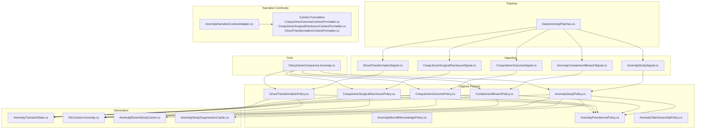
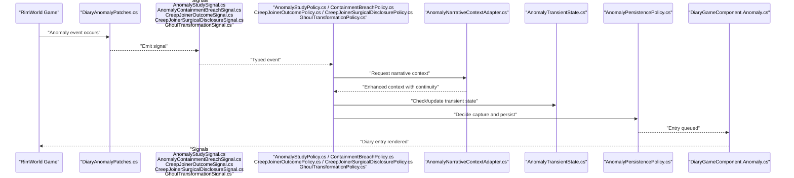
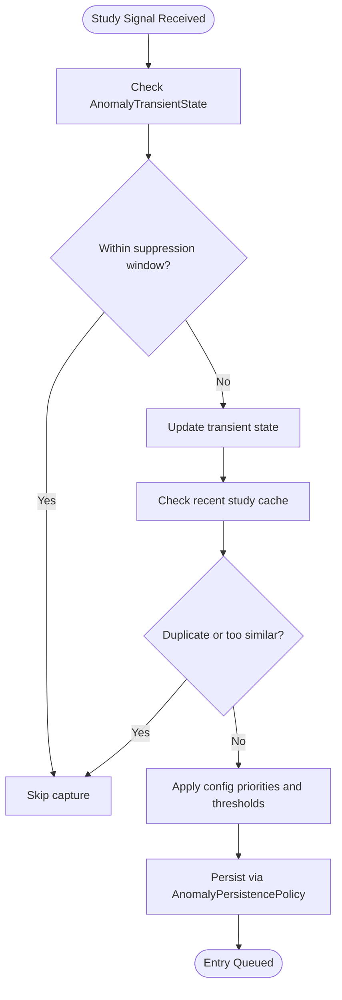
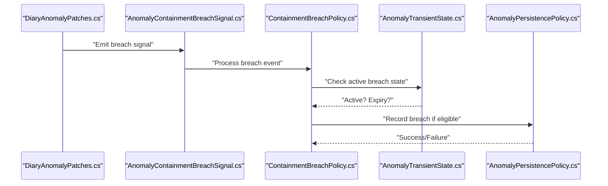
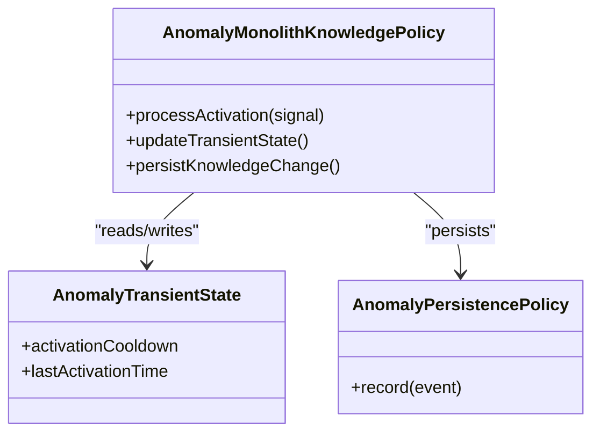
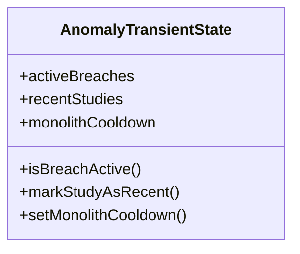
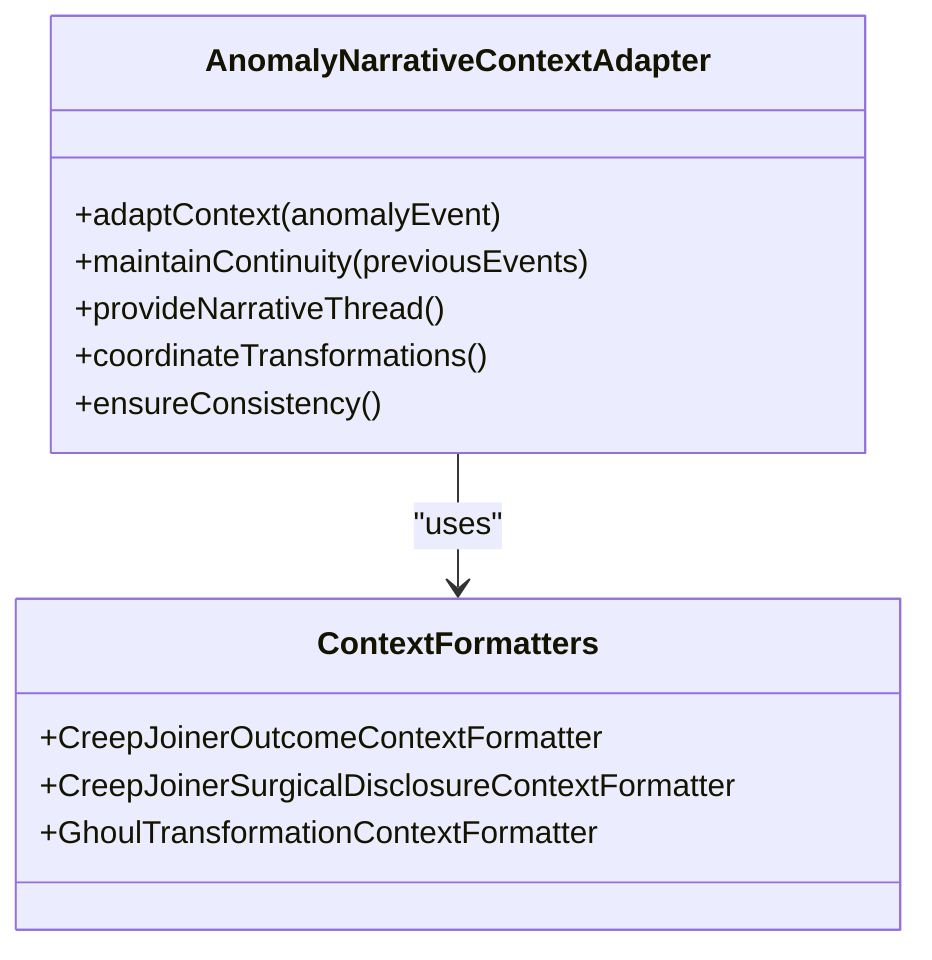
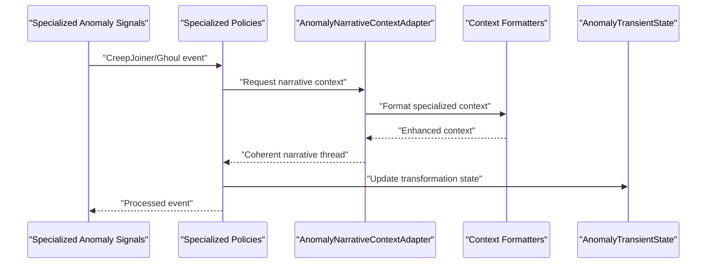
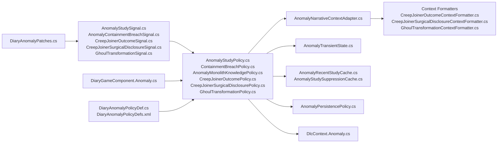

# Anomaly Study & Containment

<cite>
**Referenced Files in This Document**
- [AnomalyStudyPolicy.cs](../../../../../Source/Capture/Policies/AnomalyStudyPolicy.cs)
- [ContainmentBreachPolicy.cs](../../../../../Source/Capture/Policies/ContainmentBreachPolicy.cs)
- [AnomalyMonolithKnowledgePolicy.cs](../../../../../Source/Capture/Policies/AnomalyMonolithKnowledgePolicy.cs)
- [AnomalyTransientState.cs](../../../../../Source/Generation/AnomalyTransientState.cs)
- [DiaryGameComponent.Anomaly.cs](../../../../../Source/Core/DiaryGameComponent.Anomaly.cs)
- [AnomalyEventSpec.cs](../../../../../Source/Capture/Specs/AnomalyEventSpec.cs)
- [AnomalyEventData.cs](../../../../../Source/Capture/Events/AnomalyEventData.cs)
- [AnomalyStudySignal.cs](../../../../../Source/Ingestion/Sources/AnomalyStudySignal.cs)
- [AnomalyContainmentBreachSignal.cs](../../../../../Source/Ingestion/Sources/AnomalyContainmentBreachSignal.cs)
- [DiaryAnomalyPatches.cs](../../../../../Source/Patches/DiaryAnomalyPatches.cs)
- [DlcContext.Anomaly.cs](../../../../../Source/Generation/DlcContext.Anomaly.cs)
- [AnomalyPersistencePolicy.cs](../../../../../Source/Capture/Policies/AnomalyPersistencePolicy.cs)
- [AnomalyContracts.cs](../../../../../Source/Capture/Policies/AnomalyContracts.cs)
- [AnomalyTaleOwnershipPolicy.cs](../../../../../Source/Capture/Policies/AnomalyTaleOwnershipPolicy.cs)
- [AnomalyRecentStudyCache.cs](../../../../../Source/Generation/AnomalyRecentStudyCache.cs)
- [AnomalyStudySuppressionCache.cs](../../../../../Source/Generation/AnomalyStudySuppressionCache.cs)
- [DiaryAnomalyPolicyDef.cs](../../../../../Source/Defs/DiaryAnomalyPolicyDef.cs)
- [DiaryAnomalyPolicyDefs.xml](../../../../../1.6/Defs/DiaryAnomalyPolicyDefs.xml)
- [AnomalyNarrativeContextAdapter.cs](../../../../../Source/Generation/AnomalyNarrativeContextAdapter.cs)
- [CreepJoinerOutcomePolicy.cs](../../../../../Source/Capture/Policies/CreepJoinerOutcomePolicy.cs)
- [CreepJoinerSurgicalDisclosurePolicy.cs](../../../../../Source/Capture/Policies/CreepJoinerSurgicalDisclosurePolicy.cs)
- [GhoulTransformationPolicy.cs](../../../../../Source/Capture/Policies/GhoulTransformationPolicy.cs)
- [CreepJoinerOutcomeContextFormatter.cs](../../../../../Source/Capture/Policies/CreepJoinerOutcomeContextFormatter.cs)
- [CreepJoinerSurgicalDisclosureContextFormatter.cs](../../../../../Source/Capture/Policies/CreepJoinerSurgicalDisclosureContextFormatter.cs)
- [GhoulTransformationContextFormatter.cs](../../../../../Source/Capture/Policies/GhoulTransformationContextFormatter.cs)
</cite>

## Update Summary
**Changes Made**
- Added comprehensive documentation for AnomalyNarrativeContextAdapter providing visible anomaly narrative continuity
- Enhanced signal processing coverage for containment breaches, creep joiner outcomes, surgical disclosures, and ghoul transformations
- Updated policy definitions section to include new anomaly-related policies and templates
- Expanded context formatting capabilities for specialized anomaly events

## Table of Contents
1. [Introduction](#introduction)
2. [Project Structure](#project-structure)
3. [Core Components](#core-components)
4. [Architecture Overview](#architecture-overview)
5. [Detailed Component Analysis](#detailed-component-analysis)
6. [Enhanced Narrative Continuity System](#enhanced-narrative-continuity-system)
7. [Specialized Anomaly Event Processing](#specialized-anomaly-event-processing)
8. [Dependency Analysis](#dependency-analysis)
9. [Performance Considerations](#performance-considerations)
10. [Troubleshooting Guide](#troubleshooting-guide)
11. [Conclusion](#conclusion)
12. [Appendices](#appendices)

## Introduction
This document explains how the Anomaly DLC integration captures and narrates:
- Anomaly research progress (studies, knowledge accumulation)
- Containment breaches and security incidents
- Monolith activations and artifact study outcomes
- Transient conditions around anomalies
- **Enhanced**: Visible anomaly narrative continuity through sophisticated context adaptation
- **Enhanced**: Specialized processing for creep joiner outcomes, surgical disclosures, and ghoul transformations

It focuses on the policies that govern capture decisions, the signals and events that feed them, the transient state used to coordinate short-lived anomaly behaviors, and the enhanced narrative continuity system that provides coherent storytelling across complex anomaly scenarios.

## Project Structure
The Anomaly integration spans several layers with enhanced narrative continuity capabilities:
- Patches hook into game systems to emit signals when anomaly events occur
- Ingestion sources convert patches into typed signals
- Policies decide whether and how to capture events into diary entries
- **Enhanced**: Narrative context adapters provide visible continuity across complex anomaly scenarios
- Generation utilities build context and manage transient state
- Persistence and contracts define shared data structures and lifecycle rules

**Diagram sources**
- [DiaryAnomalyPatches.cs](../../../../../Source/Patches/DiaryAnomalyPatches.cs)
- [AnomalyStudySignal.cs](../../../../../Source/Ingestion/Sources/AnomalyStudySignal.cs)
- [AnomalyContainmentBreachSignal.cs](../../../../../Source/Ingestion/Sources/AnomalyContainmentBreachSignal.cs)
- [CreepJoinerOutcomeSignal.cs](../../../../../Source/Ingestion/Sources/CreepJoinerOutcomeSignal.cs)
- [CreepJoinerSurgicalDisclosureSignal.cs](../../../../../Source/Ingestion/Sources/CreepJoinerSurgicalDisclosureSignal.cs)
- [GhoulTransformationSignal.cs](../../../../../Source/Ingestion/Sources/GhoulTransformationSignal.cs)
- [AnomalyStudyPolicy.cs](../../../../../Source/Capture/Policies/AnomalyStudyPolicy.cs)
- [ContainmentBreachPolicy.cs](../../../../../Source/Capture/Policies/ContainmentBreachPolicy.cs)
- [CreepJoinerOutcomePolicy.cs](../../../../../Source/Capture/Policies/CreepJoinerOutcomePolicy.cs)
- [CreepJoinerSurgicalDisclosurePolicy.cs](../../../../../Source/Capture/Policies/CreepJoinerSurgicalDisclosurePolicy.cs)
- [GhoulTransformationPolicy.cs](../../../../../Source/Capture/Policies/GhoulTransformationPolicy.cs)
- [AnomalyNarrativeContextAdapter.cs](../../../../../Source/Generation/AnomalyNarrativeContextAdapter.cs)
- [CreepJoinerOutcomeContextFormatter.cs](../../../../../Source/Capture/Policies/CreepJoinerOutcomeContextFormatter.cs)
- [CreepJoinerSurgicalDisclosureContextFormatter.cs](../../../../../Source/Capture/Policies/CreepJoinerSurgicalDisclosureContextFormatter.cs)
- [GhoulTransformationContextFormatter.cs](../../../../../Source/Capture/Policies/GhoulTransformationContextFormatter.cs)
- [AnomalyTransientState.cs](../../../../../Source/Generation/AnomalyTransientState.cs)
- [DlcContext.Anomaly.cs](../../../../../Source/Generation/DlcContext.Anomaly.cs)
- [AnomalyRecentStudyCache.cs](../../../../../Source/Generation/AnomalyRecentStudyCache.cs)
- [AnomalyStudySuppressionCache.cs](../../../../../Source/Generation/AnomalyStudySuppressionCache.cs)
- [DiaryGameComponent.Anomaly.cs](../../../../../Source/Core/DiaryGameComponent.Anomaly.cs)

## Core Components
- AnomalyStudyPolicy: Captures and prioritizes research progress on anomalies and artifacts, including knowledge accumulation and study milestones.
- ContainmentBreachPolicy: Records containment failures and related security incidents, linking them to affected pawns and locations.
- AnomalyMonolithKnowledgePolicy: Tracks monolith activations and subsequent knowledge gains or transformations.
- **Enhanced**: CreepJoinerOutcomePolicy: Processes creep joiner transformation outcomes and their narrative implications.
- **Enhanced**: CreepJoinerSurgicalDisclosurePolicy: Handles surgical disclosure events during creep joiner procedures.
- **Enhanced**: GhoulTransformationPolicy: Manages ghoul transformation events and their lasting effects.
- AnomalyTransientState: Manages temporary conditions such as ongoing studies, active breaches, and cooldowns to avoid duplicate entries.
- **New**: AnomalyNarrativeContextAdapter: Provides visible anomaly narrative continuity across complex multi-stage anomaly scenarios.

These components work together with signals from patches, event specs, persistence policies, and enhanced narrative context adapters to produce coherent diary entries with rich storytelling continuity.

## Architecture Overview
End-to-end flow for anomaly events with enhanced narrative continuity:
- Patches detect game-side anomaly activity and emit signals
- Signals are ingested and converted into typed events
- Policies evaluate capture decisions using configs, caches, and transient state
- **Enhanced**: Narrative context adapters provide continuity across complex anomaly scenarios
- Context is assembled and persisted via persistence policy
- Diary entries are generated and stored with enhanced narrative coherence

**Diagram sources**
- [DiaryAnomalyPatches.cs](../../../../../Source/Patches/DiaryAnomalyPatches.cs)
- [AnomalyStudySignal.cs](../../../../../Source/Ingestion/Sources/AnomalyStudySignal.cs)
- [AnomalyContainmentBreachSignal.cs](../../../../../Source/Ingestion/Sources/AnomalyContainmentBreachSignal.cs)
- [CreepJoinerOutcomeSignal.cs](../../../../../Source/Ingestion/Sources/CreepJoinerOutcomeSignal.cs)
- [CreepJoinerSurgicalDisclosureSignal.cs](../../../../../Source/Ingestion/Sources/CreepJoinerSurgicalDisclosureSignal.cs)
- [GhoulTransformationSignal.cs](../../../../../Source/Ingestion/Sources/GhoulTransformationSignal.cs)
- [AnomalyStudyPolicy.cs](../../../../../Source/Capture/Policies/AnomalyStudyPolicy.cs)
- [ContainmentBreachPolicy.cs](../../../../../Source/Capture/Policies/ContainmentBreachPolicy.cs)
- [CreepJoinerOutcomePolicy.cs](../../../../../Source/Capture/Policies/CreepJoinerOutcomePolicy.cs)
- [CreepJoinerSurgicalDisclosurePolicy.cs](../../../../../Source/Capture/Policies/CreepJoinerSurgicalDisclosurePolicy.cs)
- [GhoulTransformationPolicy.cs](../../../../../Source/Capture/Policies/GhoulTransformationPolicy.cs)
- [AnomalyNarrativeContextAdapter.cs](../../../../../Source/Generation/AnomalyNarrativeContextAdapter.cs)
- [AnomalyTransientState.cs](../../../../../Source/Generation/AnomalyTransientState.cs)
- [AnomalyPersistencePolicy.cs](../../../../../Source/Capture/Policies/AnomalyPersistencePolicy.cs)
- [DiaryGameComponent.Anomaly.cs](../../../../../Source/Core/DiaryGameComponent.Anomaly.cs)

## Detailed Component Analysis

### AnomalyStudyPolicy
Purpose:
- Captures research progress on anomalies and artifacts
- Tracks knowledge accumulation and milestone achievements
- Applies suppression and recency filters to avoid noisy duplicates

Key responsibilities:
- Evaluate incoming study signals against configuration and transient state
- Determine priority and deduplication windows
- Coordinate with recent study cache and suppression cache
- Contribute to narrative context for richer entries

**Section sources**
- [AnomalyStudyPolicy.cs](../../../../../Source/Capture/Policies/AnomalyStudyPolicy.cs)
- [AnomalyRecentStudyCache.cs](../../../../../Source/Generation/AnomalyRecentStudyCache.cs)
- [AnomalyStudySuppressionCache.cs](../../../../../Source/Generation/AnomalyStudySuppressionCache.cs)
- [AnomalyTransientState.cs](../../../../../Source/Generation/AnomalyTransientState.cs)
- [AnomalyPersistencePolicy.cs](../../../../../Source/Capture/Policies/AnomalyPersistencePolicy.cs)

### ContainmentBreachPolicy
Purpose:
- Records containment failures and associated security incidents
- Links breaches to affected pawns, locations, and timeline context
- Coordinates with transient state to prevent overlapping breach entries

Key responsibilities:
- Validate breach signals and correlate with current containment status
- Use transient state to track active breach windows
- Apply configuration-based thresholds for severity and frequency
- Persist breach records for later narrative assembly

**Section sources**
- [ContainmentBreachPolicy.cs](../../../../../Source/Capture/Policies/ContainmentBreachPolicy.cs)
- [AnomalyContainmentBreachSignal.cs](../../../../../Source/Ingestion/Sources/AnomalyContainmentBreachSignal.cs)
- [AnomalyTransientState.cs](../../../../../Source/Generation/AnomalyTransientState.cs)
- [AnomalyPersistencePolicy.cs](../../../../../Source/Capture/Policies/AnomalyPersistencePolicy.cs)

### AnomalyMonolithKnowledgePolicy
Purpose:
- Tracks monolith activations and resulting knowledge changes
- Associates knowledge gains with specific artifacts or sites
- Integrates with narrative context to reflect cognitive impacts

Key responsibilities:
- Process monolith activation signals
- Update transient state for activation cooldowns
- Persist knowledge accumulation events
- Provide context for diary entries about insights or transformations

**Section sources**
- [AnomalyMonolithKnowledgePolicy.cs](../../../../../Source/Capture/Policies/AnomalyMonolithKnowledgePolicy.cs)
- [AnomalyTransientState.cs](../../../../../Source/Generation/AnomalyTransientState.cs)
- [AnomalyPersistencePolicy.cs](../../../../../Source/Capture/Policies/AnomalyPersistencePolicy.cs)

### AnomalyTransientState
Purpose:
- Holds temporary conditions for anomaly activities
- Prevents duplicate entries within configured time windows
- Tracks active breaches, ongoing studies, and activation cooldowns

Key fields and behaviors:
- Active breach flags and expiry times
- Last study timestamps and recency windows
- Monolith activation cooldowns
- Methods to update and query transient conditions safely

**Section sources**
- [AnomalyTransientState.cs](../../../../../Source/Generation/AnomalyTransientState.cs)

## Enhanced Narrative Continuity System

### AnomalyNarrativeContextAdapter
**New** The AnomalyNarrativeContextAdapter provides sophisticated narrative continuity across complex anomaly scenarios, ensuring that diary entries maintain coherent storytelling even when dealing with multi-stage anomaly events.

Key capabilities:
- Maintains narrative threads across related anomaly events
- Provides contextual information for complex transformation sequences
- Ensures consistency in character descriptions and emotional states
- Coordinates between different anomaly event types for unified storytelling

**Diagram sources**
- [AnomalyNarrativeContextAdapter.cs](../../../../../Source/Generation/AnomalyNarrativeContextAdapter.cs)
- [CreepJoinerOutcomeContextFormatter.cs](../../../../../Source/Capture/Policies/CreepJoinerOutcomeContextFormatter.cs)
- [CreepJoinerSurgicalDisclosureContextFormatter.cs](../../../../../Source/Capture/Policies/CreepJoinerSurgicalDisclosureContextFormatter.cs)
- [GhoulTransformationContextFormatter.cs](../../../../../Source/Capture/Policies/GhoulTransformationContextFormatter.cs)

**Section sources**
- [AnomalyNarrativeContextAdapter.cs](../../../../../Source/Generation/AnomalyNarrativeContextAdapter.cs)
- [CreepJoinerOutcomeContextFormatter.cs](../../../../../Source/Capture/Policies/CreepJoinerOutcomeContextFormatter.cs)
- [CreepJoinerSurgicalDisclosureContextFormatter.cs](../../../../../Source/Capture/Policies/CreepJoinerSurgicalDisclosureContextFormatter.cs)
- [GhoulTransformationContextFormatter.cs](../../../../../Source/Capture/Policies/GhoulTransformationContextFormatter.cs)

## Specialized Anomaly Event Processing

### CreepJoinerOutcomePolicy
**New** Processes creep joiner transformation outcomes and their narrative implications, tracking the complete transformation journey from initial exposure to final outcome.

Key responsibilities:
- Monitor creep joiner infection progression
- Track transformation milestones and complications
- Coordinate with narrative context adapter for consistent storytelling
- Handle both successful and failed transformation attempts

### CreepJoinerSurgicalDisclosurePolicy
**New** Handles surgical disclosure events during creep joiner procedures, capturing critical medical information and its impact on the pawn's condition.

Key responsibilities:
- Process surgical discovery of creep joiner infection
- Document medical findings and treatment decisions
- Integrate with transformation narrative for cohesive storytelling
- Track long-term health implications

### GhoulTransformationPolicy
**New** Manages ghoul transformation events and their lasting effects, providing comprehensive coverage of the transformation process and its consequences.

Key responsibilities:
- Monitor ghoul transformation triggers and progression
- Track physical and psychological changes
- Coordinate with narrative context for dramatic storytelling
- Handle permanent transformation outcomes

**Diagram sources**
- [CreepJoinerOutcomePolicy.cs](../../../../../Source/Capture/Policies/CreepJoinerOutcomePolicy.cs)
- [CreepJoinerSurgicalDisclosurePolicy.cs](../../../../../Source/Capture/Policies/CreepJoinerSurgicalDisclosurePolicy.cs)
- [GhoulTransformationPolicy.cs](../../../../../Source/Capture/Policies/GhoulTransformationPolicy.cs)
- [AnomalyNarrativeContextAdapter.cs](../../../../../Source/Generation/AnomalyNarrativeContextAdapter.cs)
- [CreepJoinerOutcomeContextFormatter.cs](../../../../../Source/Capture/Policies/CreepJoinerOutcomeContextFormatter.cs)
- [CreepJoinerSurgicalDisclosureContextFormatter.cs](../../../../../Source/Capture/Policies/CreepJoinerSurgicalDisclosureContextFormatter.cs)
- [GhoulTransformationContextFormatter.cs](../../../../../Source/Capture/Policies/GhoulTransformationContextFormatter.cs)
- [AnomalyTransientState.cs](../../../../../Source/Generation/AnomalyTransientState.cs)

**Section sources**
- [CreepJoinerOutcomePolicy.cs](../../../../../Source/Capture/Policies/CreepJoinerOutcomePolicy.cs)
- [CreepJoinerSurgicalDisclosurePolicy.cs](../../../../../Source/Capture/Policies/CreepJoinerSurgicalDisclosurePolicy.cs)
- [GhoulTransformationPolicy.cs](../../../../../Source/Capture/Policies/GhoulTransformationPolicy.cs)
- [CreepJoinerOutcomeContextFormatter.cs](../../../../../Source/Capture/Policies/CreepJoinerOutcomeContextFormatter.cs)
- [CreepJoinerSurgicalDisclosureContextFormatter.cs](../../../../../Source/Capture/Policies/CreepJoinerSurgicalDisclosureContextFormatter.cs)
- [GhoulTransformationContextFormatter.cs](../../../../../Source/Capture/Policies/GhoulTransformationContextFormatter.cs)

### Event Specs and Data Models
- AnomalyEventSpec: Defines the structure and metadata for anomaly events consumed by policies
- AnomalyEventData: Carries payload details for study and breach events

These types ensure consistent data passing between ingestion and capture layers.

**Section sources**
- [AnomalyEventSpec.cs](../../../../../Source/Capture/Specs/AnomalyEventSpec.cs)
- [AnomalyEventData.cs](../../../../../Source/Capture/Events/AnomalyEventData.cs)

### Contracts and Ownership
- AnomalyContracts: Shared interfaces and constants for anomaly domain
- AnomalyTaleOwnershipPolicy: Determines ownership attribution for anomaly-related tales and entries

**Section sources**
- [AnomalyContracts.cs](../../../../../Source/Capture/Policies/AnomalyContracts.cs)
- [AnomalyTaleOwnershipPolicy.cs](../../../../../Source/Capture/Policies/AnomalyTaleOwnershipPolicy.cs)

### Context Building
- DlcContext.Anomaly: Assembles contextual information for anomaly events, enriching diary entries with relevant background

**Section sources**
- [DlcContext.Anomaly.cs](../../../../../Source/Generation/DlcContext.Anomaly.cs)

## Dependency Analysis
High-level dependencies among core anomaly components with enhanced narrative continuity:

**Diagram sources**
- [DiaryAnomalyPatches.cs](../../../../../Source/Patches/DiaryAnomalyPatches.cs)
- [AnomalyStudySignal.cs](../../../../../Source/Ingestion/Sources/AnomalyStudySignal.cs)
- [AnomalyContainmentBreachSignal.cs](../../../../../Source/Ingestion/Sources/AnomalyContainmentBreachSignal.cs)
- [CreepJoinerOutcomeSignal.cs](../../../../../Source/Ingestion/Sources/CreepJoinerOutcomeSignal.cs)
- [CreepJoinerSurgicalDisclosureSignal.cs](../../../../../Source/Ingestion/Sources/CreepJoinerSurgicalDisclosureSignal.cs)
- [GhoulTransformationSignal.cs](../../../../../Source/Ingestion/Sources/GhoulTransformationSignal.cs)
- [AnomalyStudyPolicy.cs](../../../../../Source/Capture/Policies/AnomalyStudyPolicy.cs)
- [ContainmentBreachPolicy.cs](../../../../../Source/Capture/Policies/ContainmentBreachPolicy.cs)
- [AnomalyMonolithKnowledgePolicy.cs](../../../../../Source/Capture/Policies/AnomalyMonolithKnowledgePolicy.cs)
- [CreepJoinerOutcomePolicy.cs](../../../../../Source/Capture/Policies/CreepJoinerOutcomePolicy.cs)
- [CreepJoinerSurgicalDisclosurePolicy.cs](../../../../../Source/Capture/Policies/CreepJoinerSurgicalDisclosurePolicy.cs)
- [GhoulTransformationPolicy.cs](../../../../../Source/Capture/Policies/GhoulTransformationPolicy.cs)
- [AnomalyNarrativeContextAdapter.cs](../../../../../Source/Generation/AnomalyNarrativeContextAdapter.cs)
- [CreepJoinerOutcomeContextFormatter.cs](../../../../../Source/Capture/Policies/CreepJoinerOutcomeContextFormatter.cs)
- [CreepJoinerSurgicalDisclosureContextFormatter.cs](../../../../../Source/Capture/Policies/CreepJoinerSurgicalDisclosureContextFormatter.cs)
- [GhoulTransformationContextFormatter.cs](../../../../../Source/Capture/Policies/GhoulTransformationContextFormatter.cs)
- [AnomalyTransientState.cs](../../../../../Source/Generation/AnomalyTransientState.cs)
- [AnomalyRecentStudyCache.cs](../../../../../Source/Generation/AnomalyRecentStudyCache.cs)
- [AnomalyStudySuppressionCache.cs](../../../../../Source/Generation/AnomalyStudySuppressionCache.cs)
- [AnomalyPersistencePolicy.cs](../../../../../Source/Capture/Policies/AnomalyPersistencePolicy.cs)
- [DlcContext.Anomaly.cs](../../../../../Source/Generation/DlcContext.Anomaly.cs)
- [DiaryGameComponent.Anomaly.cs](../../../../../Source/Core/DiaryGameComponent.Anomaly.cs)
- [DiaryAnomalyPolicyDef.cs](../../../../../Source/Defs/DiaryAnomalyPolicyDef.cs)
- [DiaryAnomalyPolicyDefs.xml](../../../../../1.6/Defs/DiaryAnomalyPolicyDefs.xml)

## Performance Considerations
- Deduplication and suppression: Use recent study cache and suppression cache to avoid redundant processing and excessive diary entries
- Transient state checks: Keep transient operations lightweight; batch updates where possible
- Config-driven thresholds: Tune suppression windows and recency limits to balance fidelity and performance
- Context assembly: Defer heavy context building until after capture decisions to minimize overhead
- **Enhanced**: Narrative context caching: Leverage AnomalyNarrativeContextAdapter to avoid redundant narrative computations
- **Enhanced**: Specialized event optimization: Optimize processing for high-frequency creep joiner and ghoul transformation events

## Troubleshooting Guide
Common issues and resolutions:
- Missing anomaly diary entries
  - Verify patches are loading and emitting signals
  - Confirm signals are being ingested and reaching policies
  - Check transient state for active suppression windows
  - Review persistence policy decisions and logs
- Duplicate or overly frequent entries
  - Adjust suppression cache settings and recency thresholds
  - Inspect AnomalyStudyPolicy decision logic and config values
- Breach entries not appearing
  - Ensure breach signals include required identifiers and timestamps
  - Validate transient state breach flags and expiry handling
- Monolith knowledge entries absent
  - Confirm activation signals are emitted and processed
  - Check cooldowns and persistence records
- **New**: Narrative continuity issues
  - Verify AnomalyNarrativeContextAdapter is properly initialized
  - Check context formatter configurations for specialized events
  - Ensure proper coordination between policies and narrative adapter
- **New**: Specialized event processing problems
  - Confirm creep joiner, surgical disclosure, and ghoul transformation signals are being emitted
  - Check policy-specific configuration settings
  - Validate context formatter implementations for proper narrative generation

Diagnostic pointers:
- Entry queue and rendering path: DiaryGameComponent.Anomaly
- Configuration definitions: DiaryAnomalyPolicyDef and DiaryAnomalyPolicyDefs.xml
- Context enrichment: DlcContext.Anomaly and AnomalyNarrativeContextAdapter
- **Enhanced**: Specialized event diagnostics: Check individual policy logs and context formatter outputs

**Section sources**
- [DiaryGameComponent.Anomaly.cs](../../../../../Source/Core/DiaryGameComponent.Anomaly.cs)
- [DiaryAnomalyPolicyDef.cs](../../../../../Source/Defs/DiaryAnomalyPolicyDef.cs)
- [DiaryAnomalyPolicyDefs.xml](../../../../../1.6/Defs/DiaryAnomalyPolicyDefs.xml)
- [DlcContext.Anomaly.cs](../../../../../Source/Generation/DlcContext.Anomaly.cs)
- [AnomalyNarrativeContextAdapter.cs](../../../../../Source/Generation/AnomalyNarrativeContextAdapter.cs)
- [AnomalyStudyPolicy.cs](../../../../../Source/Capture/Policies/AnomalyStudyPolicy.cs)
- [ContainmentBreachPolicy.cs](../../../../../Source/Capture/Policies/ContainmentBreachPolicy.cs)
- [AnomalyMonolithKnowledgePolicy.cs](../../../../../Source/Capture/Policies/AnomalyMonolithKnowledgePolicy.cs)
- [CreepJoinerOutcomePolicy.cs](../../../../../Source/Capture/Policies/CreepJoinerOutcomePolicy.cs)
- [CreepJoinerSurgicalDisclosurePolicy.cs](../../../../../Source/Capture/Policies/CreepJoinerSurgicalDisclosurePolicy.cs)
- [GhoulTransformationPolicy.cs](../../../../../Source/Capture/Policies/GhoulTransformationPolicy.cs)
- [AnomalyTransientState.cs](../../../../../Source/Generation/AnomalyTransientState.cs)
- [AnomalyPersistencePolicy.cs](../../../../../Source/Capture/Policies/AnomalyPersistencePolicy.cs)

## Conclusion
The Anomaly DLC integration uses a layered architecture with enhanced narrative continuity to capture research progress, containment breaches, monolith activations, and complex transformation scenarios. The new AnomalyNarrativeContextAdapter provides visible continuity across multi-stage anomaly events, while specialized policies handle creep joiner outcomes, surgical disclosures, and ghoul transformations with sophisticated context formatting. Policies enforce capture decisions based on configuration, caches, and transient conditions, while persistence and context builders ensure coherent diary entries with rich storytelling capabilities. Proper tuning of suppression and recency settings improves both fidelity and performance, while the enhanced narrative system ensures compelling and consistent anomaly storytelling.

## Appendices

### Configuration Options
- Anomaly event toggles: Enable/disable capture of study, breach, and monolith events
- Study priorities: Weighting factors for different study milestones and knowledge gains
- Suppression windows: Time-based deduplication for repeated or near-duplicate events
- Recency thresholds: Limits on how recent an event must be to influence capture decisions
- Breach severity thresholds: Criteria for recording significant containment failures
- **Enhanced**: Narrative continuity settings: Configure AnomalyNarrativeContextAdapter behavior and context retention
- **Enhanced**: Specialized event configurations: Fine-tune creep joiner, surgical disclosure, and ghoul transformation processing

Configuration sources:
- [DiaryAnomalyPolicyDef.cs](../../../../../Source/Defs/DiaryAnomalyPolicyDef.cs)
- [DiaryAnomalyPolicyDefs.xml](../../../../../1.6/Defs/DiaryAnomalyPolicyDefs.xml)

**Section sources**
- [DiaryAnomalyPolicyDef.cs](../../../../../Source/Defs/DiaryAnomalyPolicyDef.cs)
- [DiaryAnomalyPolicyDefs.xml](../../../../../1.6/Defs/DiaryAnomalyPolicyDefs.xml)
