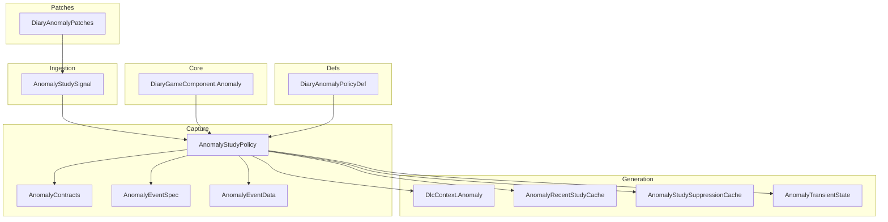
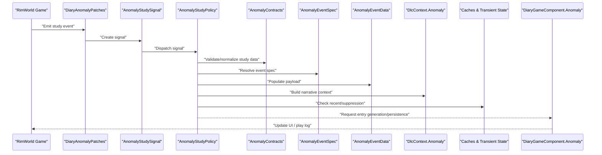
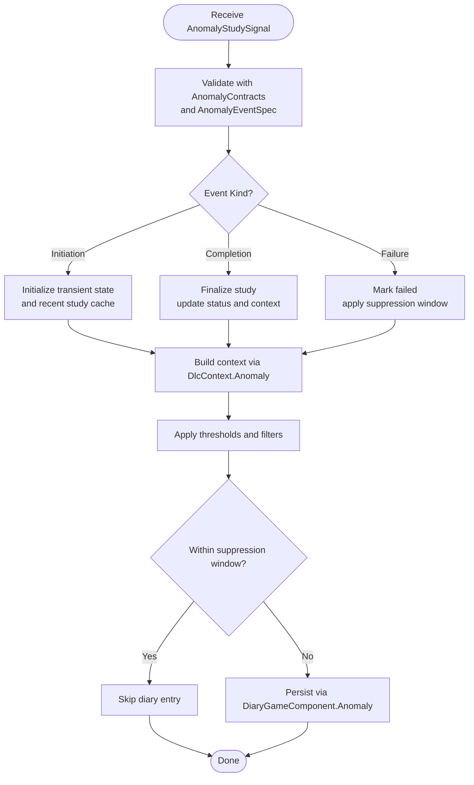
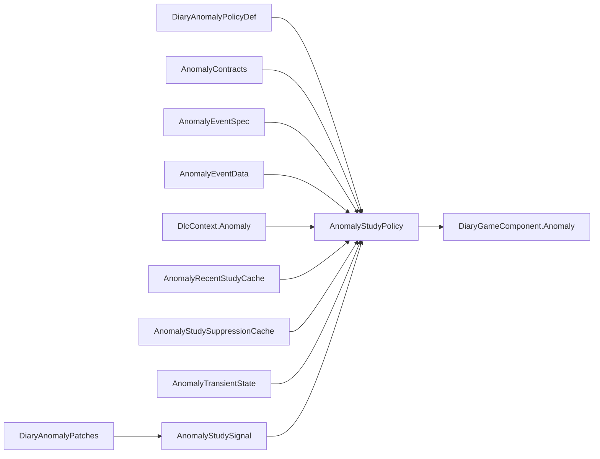

# Anomaly Study Tracking

- [AnomalyStudyPolicy.cs](../../../../../Source/Capture/Policies/AnomalyStudyPolicy.cs)
- [AnomalyContracts.cs](../../../../../Source/Capture/Policies/AnomalyContracts.cs)
- [DlcContext.Anomaly.cs](../../../../../Source/Generation/DlcContext.Anomaly.cs)
- [DiaryGameComponent.Anomaly.cs](../../../../../Source/Core/DiaryGameComponent.Anomaly.cs)
- [AnomalyStudySignal.cs](../../../../../Source/Ingestion/Sources/AnomalyStudySignal.cs)
- [AnomalyEventSpec.cs](../../../../../Source/Capture/Specs/AnomalyEventSpec.cs)
- [AnomalyEventData.cs](../../../../../Source/Capture/Events/AnomalyEventData.cs)
- [DiaryAnomalyPolicyDef.cs](../../../../../Source/Defs/DiaryAnomalyPolicyDef.cs)
- [DiaryAnomalyPatches.cs](../../../../../Source/Patches/DiaryAnomalyPatches.cs)
- [AnomalyRecentStudyCache.cs](../../../../../Source/Generation/AnomalyRecentStudyCache.cs)
- [AnomalyStudySuppressionCache.cs](../../../../../Source/Generation/AnomalyStudySuppressionCache.cs)
- [AnomalyTransientState.cs](../../../../../Source/Generation/AnomalyTransientState.cs)
## Table of Contents
1. [Introduction](#introduction)
2. [Project Structure](#project-structure)
3. [Core Components](#core-components)
4. [Architecture Overview](#architecture-overview)
5. [Detailed Component Analysis](#detailed-component-analysis)
6. [Dependency Analysis](#dependency-analysis)
7. [Performance Considerations](#performance-considerations)
8. [Troubleshooting Guide](#troubleshooting-guide)
9. [Conclusion](#conclusion)
10. [Appendices](#appendices)

## Introduction
This document explains the Anomaly study tracking system, focusing on how research progress is captured and processed across study initiation, completion, and failure events. It documents the AnomalyContracts interface for study data structures, the integration with DlcContext.Anomaly for context building, and provides examples of event capture and priority handling. It also includes troubleshooting guidance for study-related diary entries and configuration options for thresholds and notifications.

## Project Structure
The Anomaly study tracking spans several layers:
- Ingestion: Signals that carry raw anomaly study events into the pipeline.
- Capture: Policies and contracts that model study lifecycle and data structures.
- Generation: Context builders and caches that enrich and persist state.
- Core: Game component hooks that coordinate processing and persistence.
- Patches: Integration points that inject signals from game code.
- Definitions: Policy tuning and behavior configuration.

**Diagram sources**
- [AnomalyStudySignal.cs](../../../../../Source/Ingestion/Sources/AnomalyStudySignal.cs)
- [AnomalyStudyPolicy.cs](../../../../../Source/Capture/Policies/AnomalyStudyPolicy.cs)
- [AnomalyContracts.cs](../../../../../Source/Capture/Policies/AnomalyContracts.cs)
- [AnomalyEventSpec.cs](../../../../../Source/Capture/Specs/AnomalyEventSpec.cs)
- [AnomalyEventData.cs](../../../../../Source/Capture/Events/AnomalyEventData.cs)
- [DlcContext.Anomaly.cs](../../../../../Source/Generation/DlcContext.Anomaly.cs)
- [AnomalyRecentStudyCache.cs](../../../../../Source/Generation/AnomalyRecentStudyCache.cs)
- [AnomalyStudySuppressionCache.cs](../../../../../Source/Generation/AnomalyStudySuppressionCache.cs)
- [AnomalyTransientState.cs](../../../../../Source/Generation/AnomalyTransientState.cs)
- [DiaryGameComponent.Anomaly.cs](../../../../../Source/Core/DiaryGameComponent.Anomaly.cs)
- [DiaryAnomalyPatches.cs](../../../../../Source/Patches/DiaryAnomalyPatches.cs)
- [DiaryAnomalyPolicyDef.cs](../../../../../Source/Defs/DiaryAnomalyPolicyDef.cs)

**Section sources**
- [AnomalyStudyPolicy.cs](../../../../../Source/Capture/Policies/AnomalyStudyPolicy.cs)
- [AnomalyContracts.cs](../../../../../Source/Capture/Policies/AnomalyContracts.cs)
- [DlcContext.Anomaly.cs](../../../../../Source/Generation/DlcContext.Anomaly.cs)
- [DiaryGameComponent.Anomaly.cs](../../../../../Source/Core/DiaryGameComponent.Anomaly.cs)
- [AnomalyStudySignal.cs](../../../../../Source/Ingestion/Sources/AnomalyStudySignal.cs)
- [AnomalyEventSpec.cs](../../../../../Source/Capture/Specs/AnomalyEventSpec.cs)
- [AnomalyEventData.cs](../../../../../Source/Capture/Events/AnomalyEventData.cs)
- [DiaryAnomalyPolicyDef.cs](../../../../../Source/Defs/DiaryAnomalyPolicyDef.cs)
- [DiaryAnomalyPatches.cs](../../../../../Source/Patches/DiaryAnomalyPatches.cs)
- [AnomalyRecentStudyCache.cs](../../../../../Source/Generation/AnomalyRecentStudyCache.cs)
- [AnomalyStudySuppressionCache.cs](../../../../../Source/Generation/AnomalyStudySuppressionCache.cs)
- [AnomalyTransientState.cs](../../../../../Source/Generation/AnomalyTransientState.cs)

## Core Components
- AnomalyStudyPolicy: Orchestrates study lifecycle by consuming signals, applying rules, updating transient state, and emitting diary entries or prompts.
- AnomalyContracts: Defines the canonical data structures for study entities (e.g., identifiers, status, timestamps, metadata).
- DlcContext.Anomaly: Provides context-building helpers to assemble narrative context for anomalies and studies.
- DiaryGameComponent.Anomaly: Integrates study processing into the core game loop and coordinates persistence and UI updates.
- AnomalyStudySignal: Carries incoming study events (initiation, completion, failure) into the ingestion layer.
- AnomalyEventSpec and AnomalyEventData: Describe event shapes and payloads used during capture.
- DiariesAnomalyPolicyDef: Configuration surface for policy tuning (thresholds, notification preferences).
- Patches: Inject signals from game code into the ingestion pipeline.
- Caches and Transient State: Manage recent studies, suppression windows, and runtime state.

**Section sources**
- [AnomalyStudyPolicy.cs](../../../../../Source/Capture/Policies/AnomalyStudyPolicy.cs)
- [AnomalyContracts.cs](../../../../../Source/Capture/Policies/AnomalyContracts.cs)
- [DlcContext.Anomaly.cs](../../../../../Source/Generation/DlcContext.Anomaly.cs)
- [DiaryGameComponent.Anomaly.cs](../../../../../Source/Core/DiaryGameComponent.Anomaly.cs)
- [AnomalyStudySignal.cs](../../../../../Source/Ingestion/Sources/AnomalyStudySignal.cs)
- [AnomalyEventSpec.cs](../../../../../Source/Capture/Specs/AnomalyEventSpec.cs)
- [AnomalyEventData.cs](../../../../../Source/Capture/Events/AnomalyEventData.cs)
- [DiaryAnomalyPolicyDef.cs](../../../../../Source/Defs/DiaryAnomalyPolicyDef.cs)
- [DiaryAnomalyPatches.cs](../../../../../Source/Patches/DiaryAnomalyPatches.cs)
- [AnomalyRecentStudyCache.cs](../../../../../Source/Generation/AnomalyRecentStudyCache.cs)
- [AnomalyStudySuppressionCache.cs](../../../../../Source/Generation/AnomalyStudySuppressionCache.cs)
- [AnomalyTransientState.cs](../../../../../Source/Generation/AnomalyTransientState.cs)

## Architecture Overview
The Anomaly study tracking follows a signal-driven pipeline:
- Game patches emit AnomalyStudySignal when relevant events occur.
- The ingestion layer forwards signals to AnomalyStudyPolicy.
- The policy validates and normalizes data using AnomalyContracts and AnomalyEventSpec.
- It consults DlcContext.Anomaly to build rich context and uses caches/transient state to avoid noise and maintain continuity.
- The core game component persists results and triggers UI updates.

**Diagram sources**
- [DiaryAnomalyPatches.cs](../../../../../Source/Patches/DiaryAnomalyPatches.cs)
- [AnomalyStudySignal.cs](../../../../../Source/Ingestion/Sources/AnomalyStudySignal.cs)
- [AnomalyStudyPolicy.cs](../../../../../Source/Capture/Policies/AnomalyStudyPolicy.cs)
- [AnomalyContracts.cs](../../../../../Source/Capture/Policies/AnomalyContracts.cs)
- [AnomalyEventSpec.cs](../../../../../Source/Capture/Specs/AnomalyEventSpec.cs)
- [AnomalyEventData.cs](../../../../../Source/Capture/Events/AnomalyEventData.cs)
- [DlcContext.Anomaly.cs](../../../../../Source/Generation/DlcContext.Anomaly.cs)
- [AnomalyRecentStudyCache.cs](../../../../../Source/Generation/AnomalyRecentStudyCache.cs)
- [AnomalyStudySuppressionCache.cs](../../../../../Source/Generation/AnomalyStudySuppressionCache.cs)
- [AnomalyTransientState.cs](../../../../../Source/Generation/AnomalyTransientState.cs)
- [DiaryGameComponent.Anomaly.cs](../../../../../Source/Core/DiaryGameComponent.Anomaly.cs)

## Detailed Component Analysis

### AnomalyContracts Interface
Purpose:
- Defines canonical study data structures used throughout the pipeline.
- Ensures consistent shape for identifiers, statuses, timestamps, and metadata.

Key responsibilities:
- Provide strongly-typed models for study entities.
- Enforce validation invariants at boundaries between components.
- Serve as the contract between capture, generation, and persistence layers.

Usage patterns:
- Consumed by AnomalyStudyPolicy to normalize incoming signals.
- Used by DlcContext.Anomaly to populate context fields.
- Referenced by tests and integrations to ensure compatibility.

**Section sources**
- [AnomalyContracts.cs](../../../../../Source/Capture/Policies/AnomalyContracts.cs)

### AnomalyStudyPolicy Lifecycle
Responsibilities:
- Consume AnomalyStudySignal and map to internal study state.
- Handle three primary events:
  - Initiation: Start tracking a new study; initialize transient state and caches.
  - Completion: Finalize study; update status and generate concluding diary content.
  - Failure: Mark study failed; apply suppression logic and notify if configured.

Processing flow:
- Validate input via AnomalyContracts and AnomalyEventSpec.
- Build context using DlcContext.Anomaly.
- Apply thresholds and suppression windows to avoid noisy entries.
- Persist outcomes through DiaryGameComponent.Anomaly.

**Diagram sources**
- [AnomalyStudyPolicy.cs](../../../../../Source/Capture/Policies/AnomalyStudyPolicy.cs)
- [AnomalyContracts.cs](../../../../../Source/Capture/Policies/AnomalyContracts.cs)
- [AnomalyEventSpec.cs](../../../../../Source/Capture/Specs/AnomalyEventSpec.cs)
- [DlcContext.Anomaly.cs](../../../../../Source/Generation/DlcContext.Anomaly.cs)
- [AnomalyRecentStudyCache.cs](../../../../../Source/Generation/AnomalyRecentStudyCache.cs)
- [AnomalyStudySuppressionCache.cs](../../../../../Source/Generation/AnomalyStudySuppressionCache.cs)
- [AnomalyTransientState.cs](../../../../../Source/Generation/AnomalyTransientState.cs)
- [DiaryGameComponent.Anomaly.cs](../../../../../Source/Core/DiaryGameComponent.Anomaly.cs)

**Section sources**
- [AnomalyStudyPolicy.cs](../../../../../Source/Capture/Policies/AnomalyStudyPolicy.cs)
- [AnomalyContracts.cs](../../../../../Source/Capture/Policies/AnomalyContracts.cs)
- [AnomalyEventSpec.cs](../../../../../Source/Capture/Specs/AnomalyEventSpec.cs)
- [DlcContext.Anomaly.cs](../../../../../Source/Generation/DlcContext.Anomaly.cs)
- [AnomalyRecentStudyCache.cs](../../../../../Source/Generation/AnomalyRecentStudyCache.cs)
- [AnomalyStudySuppressionCache.cs](../../../../../Source/Generation/AnomalyStudySuppressionCache.cs)
- [AnomalyTransientState.cs](../../../../../Source/Generation/AnomalyTransientState.cs)
- [DiaryGameComponent.Anomaly.cs](../../../../../Source/Core/DiaryGameComponent.Anomaly.cs)

### DlcContext.Anomaly Integration
Role:
- Builds narrative context for anomaly studies by assembling facts, relationships, and prior history.
- Supplies structured context lines and references consumed by prompt builders and text decorators.

Integration points:
- Called by AnomalyStudyPolicy after normalization to enrich event details.
- Uses transient state and caches to include recent studies and suppress redundant information.

**Section sources**
- [DlcContext.Anomaly.cs](../../../../../Source/Generation/DlcContext.Anomaly.cs)
- [AnomalyTransientState.cs](../../../../../Source/Generation/AnomalyTransientState.cs)
- [AnomalyRecentStudyCache.cs](../../../../../Source/Generation/AnomalyRecentStudyCache.cs)
- [AnomalyStudySuppressionCache.cs](../../../../../Source/Generation/AnomalyStudySuppressionCache.cs)

### Signal Ingestion and Patching
- DiaryAnomalyPatches intercept game events and create AnomalyStudySignal instances.
- Signals are dispatched into the capture pipeline where AnomalyStudyPolicy processes them.

**Section sources**
- [DiaryAnomalyPatches.cs](../../../../../Source/Patches/DiaryAnomalyPatches.cs)
- [AnomalyStudySignal.cs](../../../../../Source/Ingestion/Sources/AnomalyStudySignal.cs)

### Event Specs and Data Shapes
- AnomalyEventSpec defines the event taxonomy and routing keys for anomaly studies.
- AnomalyEventData carries payload details such as timestamps, participants, and outcome indicators.

**Section sources**
- [AnomalyEventSpec.cs](../../../../../Source/Capture/Specs/AnomalyEventSpec.cs)
- [AnomalyEventData.cs](../../../../../Source/Capture/Events/AnomalyEventData.cs)

### Configuration and Tuning
- DiaryAnomalyPolicyDef exposes configuration options for thresholds and notification preferences.
- Typical settings include:
  - Minimum significance threshold for initiating study entries.
  - Suppression window length to prevent duplicate entries.
  - Notification toggles for completion/failure alerts.

How it affects behavior:
- Policy reads these definitions to decide whether to proceed with entry creation.
- Caches use thresholds to determine recency and suppression windows.

**Section sources**
- [DiaryAnomalyPolicyDef.cs](../../../../../Source/Defs/DiaryAnomalyPolicyDef.cs)
- [AnomalyStudyPolicy.cs](../../../../../Source/Capture/Policies/AnomalyStudyPolicy.cs)
- [AnomalyStudySuppressionCache.cs](../../../../../Source/Generation/AnomalyStudySuppressionCache.cs)

## Dependency Analysis
High-level dependencies:
- AnomalyStudyPolicy depends on:
  - AnomalyContracts for data modeling.
  - AnomalyEventSpec for event routing.
  - DlcContext.Anomaly for context assembly.
  - Caches and transient state for deduplication and continuity.
  - DiaryGameComponent.Anomaly for persistence and UI updates.
- Patches depend on game hooks to emit signals.
- Definitions drive policy behavior.

**Diagram sources**
- [DiaryAnomalyPolicyDef.cs](../../../../../Source/Defs/DiaryAnomalyPolicyDef.cs)
- [AnomalyStudyPolicy.cs](../../../../../Source/Capture/Policies/AnomalyStudyPolicy.cs)
- [AnomalyContracts.cs](../../../../../Source/Capture/Policies/AnomalyContracts.cs)
- [AnomalyEventSpec.cs](../../../../../Source/Capture/Specs/AnomalyEventSpec.cs)
- [AnomalyEventData.cs](../../../../../Source/Capture/Events/AnomalyEventData.cs)
- [DlcContext.Anomaly.cs](../../../../../Source/Generation/DlcContext.Anomaly.cs)
- [AnomalyRecentStudyCache.cs](../../../../../Source/Generation/AnomalyRecentStudyCache.cs)
- [AnomalyStudySuppressionCache.cs](../../../../../Source/Generation/AnomalyStudySuppressionCache.cs)
- [AnomalyTransientState.cs](../../../../../Source/Generation/AnomalyTransientState.cs)
- [DiaryAnomalyPatches.cs](../../../../../Source/Patches/DiaryAnomalyPatches.cs)
- [AnomalyStudySignal.cs](../../../../../Source/Ingestion/Sources/AnomalyStudySignal.cs)
- [DiaryGameComponent.Anomaly.cs](../../../../../Source/Core/DiaryGameComponent.Anomaly.cs)

**Section sources**
- [AnomalyStudyPolicy.cs](../../../../../Source/Capture/Policies/AnomalyStudyPolicy.cs)
- [DiaryAnomalyPatches.cs](../../../../../Source/Patches/DiaryAnomalyPatches.cs)
- [DiaryAnomalyPolicyDef.cs](../../../../../Source/Defs/DiaryAnomalyPolicyDef.cs)

## Performance Considerations
- Use recent study cache to avoid reprocessing identical or near-duplicate events.
- Apply suppression windows to reduce churn and memory pressure.
- Keep context building lightweight; defer heavy computations to background or batched operations.
- Prefer immutable contracts and minimal copying to reduce allocations.

[No sources needed since this section provides general guidance]

## Troubleshooting Guide
Common issues and resolutions:
- No diary entries for study initiation:
  - Verify that patches are emitting AnomalyStudySignal.
  - Check thresholds in DiaryAnomalyPolicyDef; lower minimum significance if needed.
  - Ensure recent study cache is not suppressing due to too-short window.
- Duplicate or excessive entries:
  - Increase suppression window length.
  - Review AnomalyStudySuppressionCache configuration.
- Missing context details:
  - Confirm DlcContext.Anomaly is receiving normalized data via AnomalyContracts.
  - Validate AnomalyEventSpec routing keys match expected event kinds.
- Failure events not recorded:
  - Inspect transient state initialization and completion transitions.
  - Ensure DiaryGameComponent.Anomaly persistence path is active.

Diagnostic steps:
- Enable debug logging around AnomalyStudyPolicy decision points.
- Inspect transient state snapshots for study lifecycle markers.
- Cross-check patch hooks to confirm signal emission timing.

**Section sources**
- [AnomalyStudyPolicy.cs](../../../../../Source/Capture/Policies/AnomalyStudyPolicy.cs)
- [DiaryAnomalyPatches.cs](../../../../../Source/Patches/DiaryAnomalyPatches.cs)
- [AnomalyStudySuppressionCache.cs](../../../../../Source/Generation/AnomalyStudySuppressionCache.cs)
- [AnomalyRecentStudyCache.cs](../../../../../Source/Generation/AnomalyRecentStudyCache.cs)
- [AnomalyTransientState.cs](../../../../../Source/Generation/AnomalyTransientState.cs)
- [DlcContext.Anomaly.cs](../../../../../Source/Generation/DlcContext.Anomaly.cs)
- [DiaryGameComponent.Anomaly.cs](../../../../../Source/Core/DiaryGameComponent.Anomaly.cs)

## Conclusion
The Anomaly study tracking system integrates cleanly with the broader diary pipeline, providing robust lifecycle management for research activities. By leveraging standardized contracts, context builders, and caching strategies, it ensures accurate, concise, and meaningful diary entries while remaining configurable for different gameplay styles and performance needs.

[No sources needed since this section summarizes without analyzing specific files]

## Appendices

### Example Scenarios
- Study initiation:
  - A patch emits an initiation signal; policy initializes transient state and creates a first diary entry if above threshold.
- Study completion:
  - A completion signal finalizes the study; context is enriched with milestones and outcomes; a concluding entry is generated.
- Study failure:
  - A failure signal marks the study failed; suppression window prevents immediate follow-up entries; optional notification is sent based on configuration.

[No sources needed since this section provides conceptual examples]
