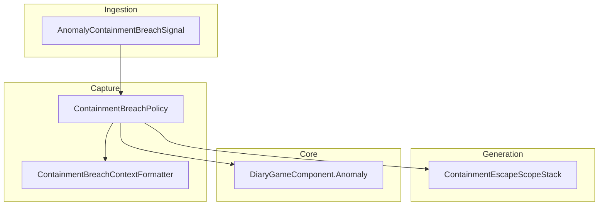
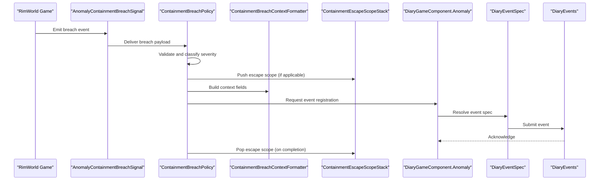
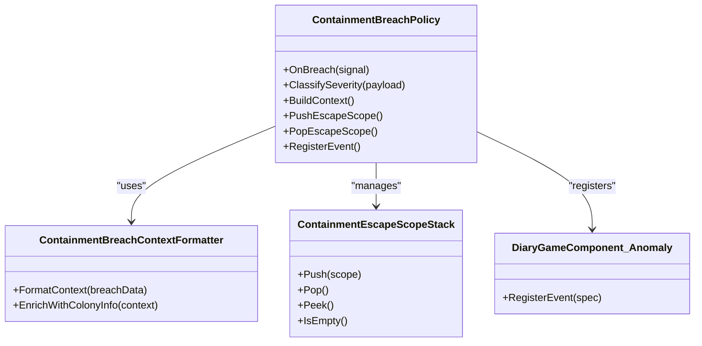
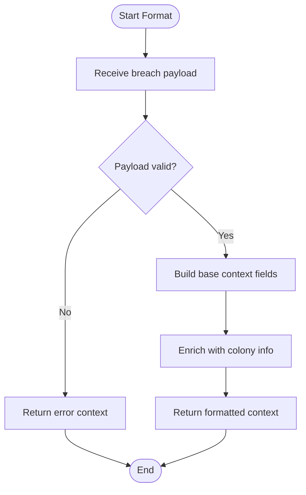
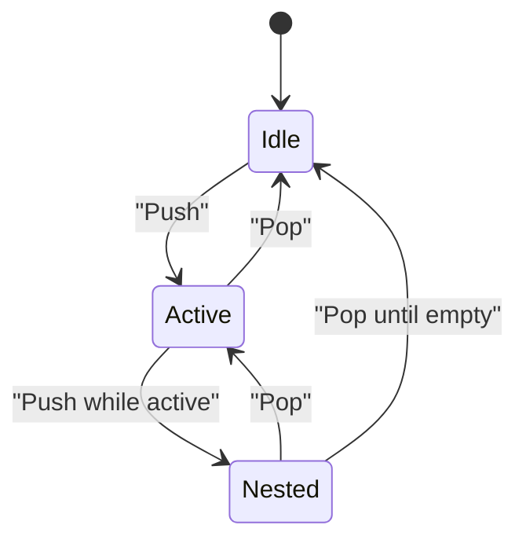
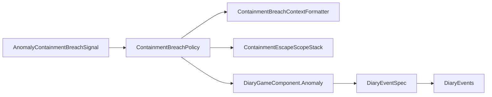

# Containment Breach Events

<cite>
**Referenced Files in This Document**
- [ContainmentBreachPolicy.cs](../../../../../Source/Capture/Policies/ContainmentBreachPolicy.cs)
- [ContainmentBreachContextFormatter.cs](../../../../../Source/Capture/Policies/ContainmentBreachContextFormatter.cs)
- [ContainmentEscapeScopeStack.cs](../../../../../Source/Generation/ContainmentEscapeScopeStack.cs)
- [AnomalyContainmentBreachSignal.cs](../../../../../Source/Ingestion/Sources/AnomalyContainmentBreachSignal.cs)
- [DiaryGameComponent.Anomaly.cs](../../../../../Source/Core/DiaryGameComponent.Anomaly.cs)
- [DiaryEventSpec.cs](../../../../../Source/Capture/Catalog/DiaryEventSpec.cs)
- [DiaryEvents.cs](../../../../../Source/Ingestion/DiaryEvents.cs)
</cite>

## Table of Contents
1. [Introduction](#introduction)
2. [Project Structure](#project-structure)
3. [Core Components](#core-components)
4. [Architecture Overview](#architecture-overview)
5. [Detailed Component Analysis](#detailed-component-analysis)
6. [Dependency Analysis](#dependency-analysis)
7. [Performance Considerations](#performance-considerations)
8. [Troubleshooting Guide](#troubleshooting-guide)
9. [Conclusion](#conclusion)

## Introduction
This document explains how the system detects, records, and narratively contextualizes containment breach events in anomaly containment facilities. It focuses on:
- How ContainmentBreachPolicy monitors and responds to security incidents
- How ContainmentBreachContextFormatter generates contextual information for diary entries
- How ContainmentEscapeScopeStack manages escape sequences across nested scopes
- Examples of breach detection, response protocols, and integration with colony defense systems
- Configuration options for breach severity levels and automated responses

## Project Structure
The containment breach feature spans several layers:
- Ingestion layer receives raw signals from the game world
- Capture policies observe and decide whether to record an event
- Generation utilities build narrative context and manage escape scope state
- Core components coordinate lifecycle and dispatch

**Diagram sources**
- [AnomalyContainmentBreachSignal.cs](../../../../../Source/Ingestion/Sources/AnomalyContainmentBreachSignal.cs)
- [ContainmentBreachPolicy.cs](../../../../../Source/Capture/Policies/ContainmentBreachPolicy.cs)
- [ContainmentBreachContextFormatter.cs](../../../../../Source/Capture/Policies/ContainmentBreachContextFormatter.cs)
- [ContainmentEscapeScopeStack.cs](../../../../../Source/Generation/ContainmentEscapeScopeStack.cs)
- [DiaryGameComponent.Anomaly.cs](../../../../../Source/Core/DiaryGameComponent.Anomaly.cs)

**Section sources**
- [AnomalyContainmentBreachSignal.cs](../../../../../Source/Ingestion/Sources/AnomalyContainmentBreachSignal.cs)
- [ContainmentBreachPolicy.cs](../../../../../Source/Capture/Policies/ContainmentBreachPolicy.cs)
- [ContainmentBreachContextFormatter.cs](../../../../../Source/Capture/Policies/ContainmentBreachContextFormatter.cs)
- [ContainmentEscapeScopeStack.cs](../../../../../Source/Generation/ContainmentEscapeScopeStack.cs)
- [DiaryGameComponent.Anomaly.cs](../../../../../Source/Core/DiaryGameComponent.Anomaly.cs)

## Core Components
- ContainmentBreachPolicy: Observes anomaly containment breaches, evaluates conditions, and triggers capture or escalation workflows.
- ContainmentBreachContextFormatter: Produces structured context fields used by the diary pipeline to render breach-related entries.
- ContainmentEscapeScopeStack: Tracks active escape sequences and nesting to avoid duplicate or conflicting narratives.
- AnomalyContainmentBreachSignal: The ingestion signal that carries breach details into the system.
- DiaryGameComponent.Anomaly: Coordinates anomaly-related lifecycle hooks and dispatches events to capture pipelines.

Key responsibilities:
- Detection and validation of breach signals
- Context enrichment for narrative generation
- Scope management for multi-stage escapes
- Integration points with colony defense and external systems via the diary API surface

**Section sources**
- [ContainmentBreachPolicy.cs](../../../../../Source/Capture/Policies/ContainmentBreachPolicy.cs)
- [ContainmentBreachContextFormatter.cs](../../../../../Source/Capture/Policies/ContainmentBreachContextFormatter.cs)
- [ContainmentEscapeScopeStack.cs](../../../../../Source/Generation/ContainmentEscapeScopeStack.cs)
- [AnomalyContainmentBreachSignal.cs](../../../../../Source/Ingestion/Sources/AnomalyContainmentBreachSignal.cs)
- [DiaryGameComponent.Anomaly.cs](../../../../../Source/Core/DiaryGameComponent.Anomaly.cs)

## Architecture Overview
End-to-end flow from breach detection to diary entry creation:

**Diagram sources**
- [AnomalyContainmentBreachSignal.cs](../../../../../Source/Ingestion/Sources/AnomalyContainmentBreachSignal.cs)
- [ContainmentBreachPolicy.cs](../../../../../Source/Capture/Policies/ContainmentBreachPolicy.cs)
- [ContainmentBreachContextFormatter.cs](../../../../../Source/Capture/Policies/ContainmentBreachContextFormatter.cs)
- [ContainmentEscapeScopeStack.cs](../../../../../Source/Generation/ContainmentEscapeScopeStack.cs)
- [DiaryGameComponent.Anomaly.cs](../../../../../Source/Core/DiaryGameComponent.Anomaly.cs)
- [DiaryEventSpec.cs](../../../../../Source/Capture/Catalog/DiaryEventSpec.cs)
- [DiaryEvents.cs](../../../../../Source/Ingestion/DiaryEvents.cs)

## Detailed Component Analysis

### ContainmentBreachPolicy
Responsibilities:
- Receives breach signals and validates inputs
- Classifies breach severity and determines response actions
- Coordinates with context formatter and escape scope stack
- Integrates with core anomaly component to register events

Operational highlights:
- Severity classification influences which context fields are included and whether automated responses are triggered
- Escape scope is pushed when a multi-stage escape begins and popped upon resolution
- Delegates context assembly to ContainmentBreachContextFormatter
- Uses catalog and registry abstractions to submit events consistently

**Diagram sources**
- [ContainmentBreachPolicy.cs](../../../../../Source/Capture/Policies/ContainmentBreachPolicy.cs)
- [ContainmentBreachContextFormatter.cs](../../../../../Source/Capture/Policies/ContainmentBreachContextFormatter.cs)
- [ContainmentEscapeScopeStack.cs](../../../../../Source/Generation/ContainmentEscapeScopeStack.cs)
- [DiaryGameComponent.Anomaly.cs](../../../../../Source/Core/DiaryGameComponent.Anomaly.cs)

**Section sources**
- [ContainmentBreachPolicy.cs](../../../../../Source/Capture/Policies/ContainmentBreachPolicy.cs)
- [DiaryGameComponent.Anomaly.cs](../../../../../Source/Core/DiaryGameComponent.Anomaly.cs)

### ContainmentBreachContextFormatter
Responsibilities:
- Builds structured context for breach events
- Enriches context with colony-level information (e.g., nearby defenses, affected zones)
- Ensures consistent field naming and formatting for downstream rendering

Design notes:
- Accepts breach data and returns a context object consumed by the diary pipeline
- May include flags indicating severity, containment status, and involved entities
- Designed to be deterministic and idempotent for repeatable results

**Diagram sources**
- [ContainmentBreachContextFormatter.cs](../../../../../Source/Capture/Policies/ContainmentBreachContextFormatter.cs)

**Section sources**
- [ContainmentBreachContextFormatter.cs](../../../../../Source/Capture/Policies/ContainmentBreachContextFormatter.cs)

### ContainmentEscapeScopeStack
Responsibilities:
- Manages a stack of active escape sequences
- Prevents duplicate or conflicting narratives during nested escapes
- Provides push/pop semantics aligned with breach lifecycle

Behavioral notes:
- Push occurs when a new escape sequence starts
- Pop occurs when the escape completes or is aborted
- Peek allows inspection without altering state
- Empty check guards against invalid pops

**Diagram sources**
- [ContainmentEscapeScopeStack.cs](../../../../../Source/Generation/ContainmentEscapeScopeStack.cs)

**Section sources**
- [ContainmentEscapeScopeStack.cs](../../../../../Source/Generation/ContainmentEscapeScopeStack.cs)

### Ingestion and Event Registration
- AnomalyContainmentBreachSignal: Carries breach details from the game into the capture pipeline.
- DiaryEventSpec and DiaryEvents: Provide standardized mechanisms for event specification and submission.

Integration points:
- Signals are routed to ContainmentBreachPolicy for processing
- Policy uses catalog and registry to create durable diary entries
- Core anomaly component coordinates timing and lifecycle

**Section sources**
- [AnomalyContainmentBreachSignal.cs](../../../../../Source/Ingestion/Sources/AnomalyContainmentBreachSignal.cs)
- [DiaryEventSpec.cs](../../../../../Source/Capture/Catalog/DiaryEventSpec.cs)
- [DiaryEvents.cs](../../../../../Source/Ingestion/DiaryEvents.cs)

## Dependency Analysis
High-level dependencies among key components:

**Diagram sources**
- [AnomalyContainmentBreachSignal.cs](../../../../../Source/Ingestion/Sources/AnomalyContainmentBreachSignal.cs)
- [ContainmentBreachPolicy.cs](../../../../../Source/Capture/Policies/ContainmentBreachPolicy.cs)
- [ContainmentBreachContextFormatter.cs](../../../../../Source/Capture/Policies/ContainmentBreachContextFormatter.cs)
- [ContainmentEscapeScopeStack.cs](../../../../../Source/Generation/ContainmentEscapeScopeStack.cs)
- [DiaryGameComponent.Anomaly.cs](../../../../../Source/Core/DiaryGameComponent.Anomaly.cs)
- [DiaryEventSpec.cs](../../../../../Source/Capture/Catalog/DiaryEventSpec.cs)
- [DiaryEvents.cs](../../../../../Source/Ingestion/DiaryEvents.cs)

**Section sources**
- [ContainmentBreachPolicy.cs](../../../../../Source/Capture/Policies/ContainmentBreachPolicy.cs)
- [DiaryEventSpec.cs](../../../../../Source/Capture/Catalog/DiaryEventSpec.cs)
- [DiaryEvents.cs](../../../../../Source/Ingestion/DiaryEvents.cs)

## Performance Considerations
- Keep context formatting lightweight; defer heavy computations to background tasks if available
- Avoid redundant pushes/pops on the escape scope stack; ensure balanced lifecycle calls
- Use efficient lookups for colony-level enrichment to minimize frame-time impact
- Batch event submissions where possible through the registry interface

[No sources needed since this section provides general guidance]

## Troubleshooting Guide
Common issues and resolutions:
- Missing context fields: Verify that ContainmentBreachContextFormatter is invoked with a valid breach payload and that enrichment steps complete successfully.
- Duplicate diary entries: Ensure ContainmentEscapeScopeStack is properly managed; confirm that each push has a corresponding pop and that nested escapes do not trigger duplicate registrations.
- Severity misclassification: Review policy logic for severity thresholds and input validation paths.
- Integration failures: Confirm that DiaryEventSpec and DiaryEvents are correctly wired and that the core anomaly component is initialized before event registration.

**Section sources**
- [ContainmentBreachPolicy.cs](../../../../../Source/Capture/Policies/ContainmentBreachPolicy.cs)
- [ContainmentBreachContextFormatter.cs](../../../../../Source/Capture/Policies/ContainmentBreachContextFormatter.cs)
- [ContainmentEscapeScopeStack.cs](../../../../../Source/Generation/ContainmentEscapeScopeStack.cs)
- [DiaryEventSpec.cs](../../../../../Source/Capture/Catalog/DiaryEventSpec.cs)
- [DiaryEvents.cs](../../../../../Source/Ingestion/DiaryEvents.cs)

## Conclusion
The containment breach subsystem integrates ingestion, policy-driven decision-making, context formatting, and scope management to produce coherent, timely diary entries about anomaly containment incidents. By adhering to the documented flows and using the provided components, developers can implement robust breach detection, response protocols, and integrations with colony defense systems while maintaining performance and reliability.

[No sources needed since this section summarizes without analyzing specific files]
