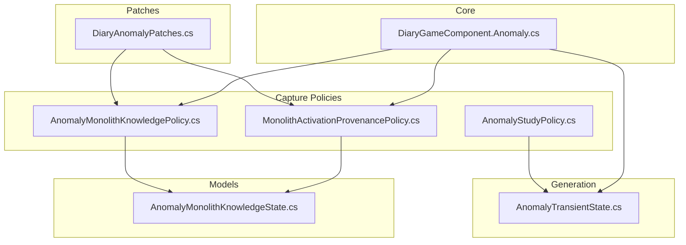
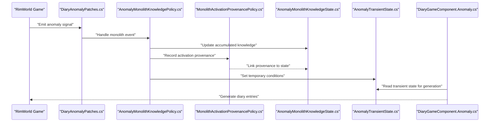
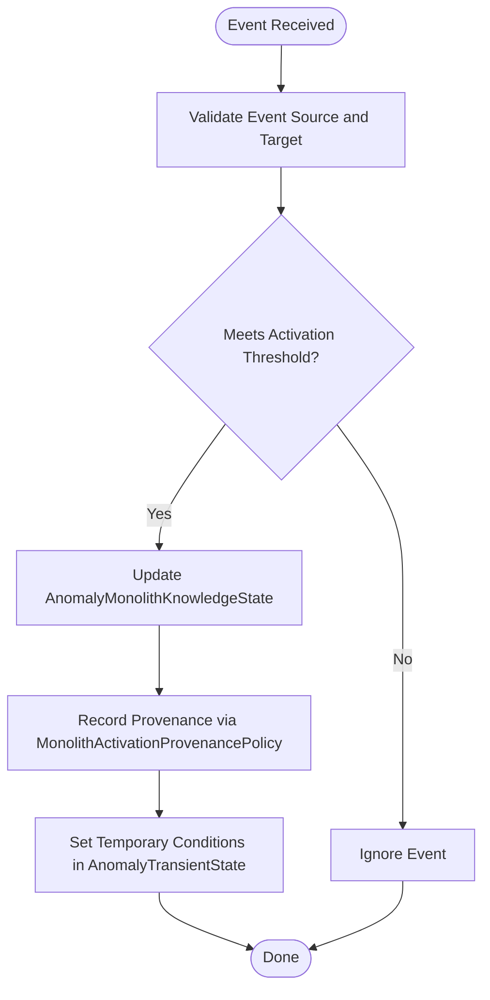
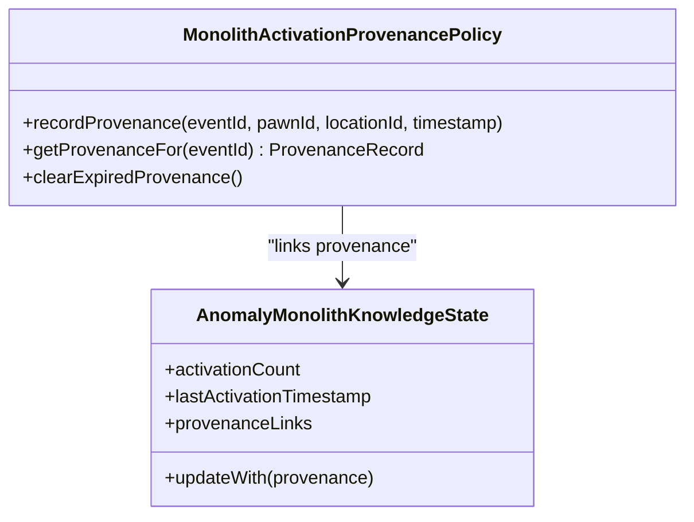
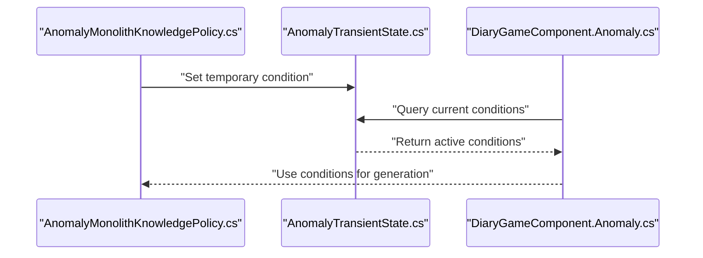
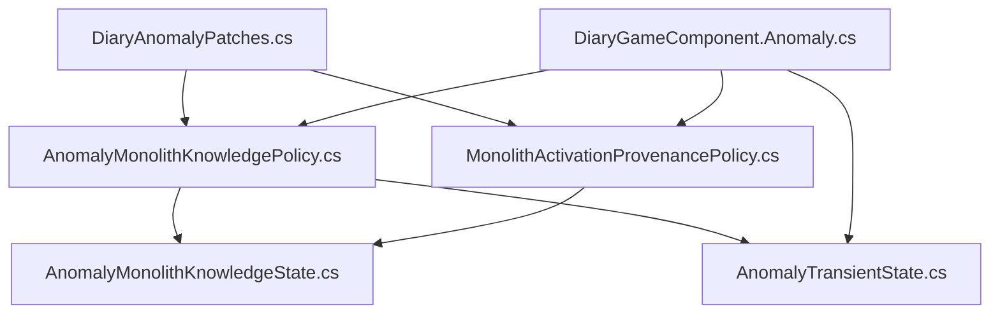

# Monolith Knowledge System

<cite>
**Referenced Files in This Document**
- [AnomalyMonolithKnowledgePolicy.cs](../../../../../Source/Capture/Policies/AnomalyMonolithKnowledgePolicy.cs)
- [MonolithActivationProvenancePolicy.cs](../../../../../Source/Capture/MonolithActivationProvenancePolicy.cs)
- [AnomalyTransientState.cs](../../../../../Source/Generation/AnomalyTransientState.cs)
- [AnomalyMonolithKnowledgeState.cs](../../../../../Source/Models/AnomalyMonolithKnowledgeState.cs)
- [DiaryAnomalyPatches.cs](../../../../../Source/Patches/DiaryAnomalyPatches.cs)
- [DiaryGameComponent.Anomaly.cs](../../../../../Source/Core/DiaryGameComponent.Anomaly.cs)
- [AnomalyStudyPolicy.cs](../../../../../Source/Capture/Policies/AnomalyStudyPolicy.cs)
- [AnomalyEventSpec.cs](../../../../../Source/Capture/Specs/AnomalyEventSpec.cs)
- [AnomalyEventData.cs](../../../../../Source/Capture/Events/AnomalyEventData.cs)
</cite>

## Table of Contents
1. [Introduction](#introduction)
2. [Project Structure](#project-structure)
3. [Core Components](#core-components)
4. [Architecture Overview](#architecture-overview)
5. [Detailed Component Analysis](#detailed-component-analysis)
6. [Dependency Analysis](#dependency-analysis)
7. [Performance Considerations](#performance-considerations)
8. [Troubleshooting Guide](#troubleshooting-guide)
9. [Conclusion](#conclusion)
10. [Appendices](#appendices)

## Introduction
This document explains how the monolith knowledge system captures, accumulates, and tracks provenance for monolith-related events. It focuses on:
- How AnomalyMonolithKnowledgePolicy tracks monolith activations and accumulates knowledge
- How MonolithActivationProvenancePolicy records provenance for activation events
- How AnomalyTransientState provides temporary knowledge conditions that influence generation and retention
- Examples of monolith interaction events and knowledge transfer mechanisms
- Troubleshooting guidance for diary entries related to monoliths
- Configuration options for knowledge thresholds and activation requirements

The goal is to provide both a high-level understanding and code-level traceability for modders and maintainers working with the anomaly subsystem.

## Project Structure
The monolith knowledge system spans several layers:
- Patches inject hooks into game events (e.g., study or containment breach signals)
- Policies capture event data and update state
- Models persist structured knowledge states
- Transient state holds short-lived context used during generation
- Core components coordinate lifecycle and persistence

**Diagram sources**
- [DiaryAnomalyPatches.cs](../../../../../Source/Patches/DiaryAnomalyPatches.cs)
- [AnomalyMonolithKnowledgePolicy.cs](../../../../../Source/Capture/Policies/AnomalyMonolithKnowledgePolicy.cs)
- [MonolithActivationProvenancePolicy.cs](../../../../../Source/Capture/MonolithActivationProvenancePolicy.cs)
- [AnomalyMonolithKnowledgeState.cs](../../../../../Source/Models/AnomalyMonolithKnowledgeState.cs)
- [AnomalyTransientState.cs](../../../../../Source/Generation/AnomalyTransientState.cs)
- [DiaryGameComponent.Anomaly.cs](../../../../../Source/Core/DiaryGameComponent.Anomaly.cs)

**Section sources**
- [DiaryAnomalyPatches.cs](../../../../../Source/Patches/DiaryAnomalyPatches.cs)
- [DiaryGameComponent.Anomaly.cs](../../../../../Source/Core/DiaryGameComponent.Anomaly.cs)

## Core Components
- AnomalyMonolithKnowledgePolicy: Captures monolith-related events, updates accumulated knowledge, and enforces thresholds for activation recognition.
- MonolithActivationProvenancePolicy: Records provenance metadata for each activation event, linking it to relevant entities and contexts.
- AnomalyTransientState: Holds temporary knowledge conditions that influence prompt assembly and entry generation without long-term persistence.
- AnomalyMonolithKnowledgeState: The persistent model representing accumulated monolith knowledge, including counts, timestamps, and references.

Key responsibilities:
- Event ingestion from patches and signals
- State mutation and validation
- Provenance linkage for auditability
- Temporary condition exposure for generation

**Section sources**
- [AnomalyMonolithKnowledgePolicy.cs](../../../../../Source/Capture/Policies/AnomalyMonolithKnowledgePolicy.cs)
- [MonolithActivationProvenancePolicy.cs](../../../../../Source/Capture/MonolithActivationProvenancePolicy.cs)
- [AnomalyTransientState.cs](../../../../../Source/Generation/AnomalyTransientState.cs)
- [AnomalyMonolithKnowledgeState.cs](../../../../../Source/Models/AnomalyMonolithKnowledgeState.cs)

## Architecture Overview
The monolith knowledge pipeline integrates with the broader Diary system through patches and core components. Events are captured by policies, transformed into state updates, and optionally exposed via transient state for generation.

**Diagram sources**
- [DiaryAnomalyPatches.cs](../../../../../Source/Patches/DiaryAnomalyPatches.cs)
- [AnomalyMonolithKnowledgePolicy.cs](../../../../../Source/Capture/Policies/AnomalyMonolithKnowledgePolicy.cs)
- [MonolithActivationProvenancePolicy.cs](../../../../../Source/Capture/MonolithActivationProvenancePolicy.cs)
- [AnomalyMonolithKnowledgeState.cs](../../../../../Source/Models/AnomalyMonolithKnowledgeState.cs)
- [AnomalyTransientState.cs](../../../../../Source/Generation/AnomalyTransientState.cs)
- [DiaryGameComponent.Anomaly.cs](../../../../../Source/Core/DiaryGameComponent.Anomaly.cs)

## Detailed Component Analysis

### AnomalyMonolithKnowledgePolicy
Responsibilities:
- Ingests monolith-related events and validates them against configuration thresholds
- Updates AnomalyMonolithKnowledgeState with new activations and associated metadata
- Coordinates with provenance policy to ensure each activation is traceable
- Exposes transient conditions when thresholds are met

Processing logic:
- Validates event source and target entities
- Applies threshold checks before recording an activation
- Aggregates counts and timestamps for later analysis
- Triggers transient state updates for immediate generation needs

**Diagram sources**
- [AnomalyMonolithKnowledgePolicy.cs](../../../../../Source/Capture/Policies/AnomalyMonolithKnowledgePolicy.cs)
- [AnomalyMonolithKnowledgeState.cs](../../../../../Source/Models/AnomalyMonolithKnowledgeState.cs)
- [MonolithActivationProvenancePolicy.cs](../../../../../Source/Capture/MonolithActivationProvenancePolicy.cs)
- [AnomalyTransientState.cs](../../../../../Source/Generation/AnomalyTransientState.cs)

**Section sources**
- [AnomalyMonolithKnowledgePolicy.cs](../../../../../Source/Capture/Policies/AnomalyMonolithKnowledgePolicy.cs)

### MonolithActivationProvenancePolicy
Responsibilities:
- Captures provenance metadata for each monolith activation
- Links activations to specific pawns, locations, and contextual factors
- Ensures auditability and traceability across diary entries

Data relationships:
- Associates activation events with unique identifiers
- Stores timestamps and contextual tags for filtering and display
- Integrates with knowledge state to maintain referential integrity

**Diagram sources**
- [MonolithActivationProvenancePolicy.cs](../../../../../Source/Capture/MonolithActivationProvenancePolicy.cs)
- [AnomalyMonolithKnowledgeState.cs](../../../../../Source/Models/AnomalyMonolithKnowledgeState.cs)

**Section sources**
- [MonolithActivationProvenancePolicy.cs](../../../../../Source/Capture/MonolithActivationProvenancePolicy.cs)
- [AnomalyMonolithKnowledgeState.cs](../../../../../Source/Models/AnomalyMonolithKnowledgeState.cs)

### AnomalyTransientState
Responsibilities:
- Holds temporary knowledge conditions that influence prompt assembly and entry generation
- Provides short-lived context for recent activations or threshold crossings
- Resets or expires based on time or game state changes

Integration points:
- Consumed by generation components to tailor narrative output
- Updated by policies when significant events occur
- Designed to be lightweight and non-persistent

**Diagram sources**
- [AnomalyMonolithKnowledgePolicy.cs](../../../../../Source/Capture/Policies/AnomalyMonolithKnowledgePolicy.cs)
- [AnomalyTransientState.cs](../../../../../Source/Generation/AnomalyTransientState.cs)
- [DiaryGameComponent.Anomaly.cs](../../../../../Source/Core/DiaryGameComponent.Anomaly.cs)

**Section sources**
- [AnomalyTransientState.cs](../../../../../Source/Generation/AnomalyTransientState.cs)

### Data Models and Specifications
- AnomalyMonolithKnowledgeState: Persistent representation of accumulated knowledge, including counts, timestamps, and provenance links
- AnomalyEventSpec and AnomalyEventData: Structured definitions for capturing and transporting monolith-related event data

These models ensure consistent serialization, validation, and integration with the broader Diary system.

**Section sources**
- [AnomalyMonolithKnowledgeState.cs](../../../../../Source/Models/AnomalyMonolithKnowledgeState.cs)
- [AnomalyEventSpec.cs](../../../../../Source/Capture/Specs/AnomalyEventSpec.cs)
- [AnomalyEventData.cs](../../../../../Source/Capture/Events/AnomalyEventData.cs)

## Dependency Analysis
The monolith knowledge system depends on:
- Patches to intercept game events
- Core components for lifecycle management
- Generation subsystem for transient state usage
- Models for persistence and structure

**Diagram sources**
- [DiaryAnomalyPatches.cs](../../../../../Source/Patches/DiaryAnomalyPatches.cs)
- [AnomalyMonolithKnowledgePolicy.cs](../../../../../Source/Capture/Policies/AnomalyMonolithKnowledgePolicy.cs)
- [MonolithActivationProvenancePolicy.cs](../../../../../Source/Capture/MonolithActivationProvenancePolicy.cs)
- [AnomalyMonolithKnowledgeState.cs](../../../../../Source/Models/AnomalyMonolithKnowledgeState.cs)
- [AnomalyTransientState.cs](../../../../../Source/Generation/AnomalyTransientState.cs)
- [DiaryGameComponent.Anomaly.cs](../../../../../Source/Core/DiaryGameComponent.Anomaly.cs)

**Section sources**
- [DiaryAnomalyPatches.cs](../../../../../Source/Patches/DiaryAnomalyPatches.cs)
- [DiaryGameComponent.Anomaly.cs](../../../../../Source/Core/DiaryGameComponent.Anomaly.cs)

## Performance Considerations
- Avoid excessive polling of transient state; prefer event-driven updates
- Batch provenance updates where possible to reduce overhead
- Use thresholds judiciously to prevent frequent state mutations
- Ensure transient conditions expire promptly to avoid memory growth

[No sources needed since this section provides general guidance]

## Troubleshooting Guide
Common issues and resolutions:
- Missing diary entries for monolith activations: Verify patch registration and event emission paths
- Incorrect provenance links: Check entity IDs and timestamp consistency in provenance policy
- Stale transient conditions: Confirm expiration logic and reset triggers in transient state
- Threshold misconfiguration: Review tuning values and validate against expected gameplay patterns

Diagnostic steps:
- Inspect event logs around activation times
- Query transient state snapshots for active conditions
- Validate model serialization and deserialization round-trips

**Section sources**
- [DiaryAnomalyPatches.cs](../../../../../Source/Patches/DiaryAnomalyPatches.cs)
- [AnomalyTransientState.cs](../../../../../Source/Generation/AnomalyTransientState.cs)

## Conclusion
The monolith knowledge system provides a robust framework for tracking activations, accumulating knowledge, and maintaining provenance. By integrating with transient state and leveraging well-defined models, it supports rich narrative generation while remaining performant and debuggable. Proper configuration of thresholds and careful attention to event flows ensure reliable behavior across diverse gameplay scenarios.

[No sources needed since this section summarizes without analyzing specific files]

## Appendices

### Configuration Options
- Knowledge thresholds: Define minimum activation counts or recency windows required to trigger notable knowledge accumulation
- Activation requirements: Specify entity types, locations, or contextual tags that qualify for activation recording
- Provenance retention: Control how long provenance metadata is retained and whether it influences future generations

[No sources needed since this section provides general guidance]

### Example Interaction Events
- Study completion: Records successful research milestones linked to monolith interactions
- Containment breach: Captures emergency events that may influence knowledge urgency
- Ritual participation: Tracks ceremonial activities that contribute to collective knowledge

[No sources needed since this section provides general guidance]
