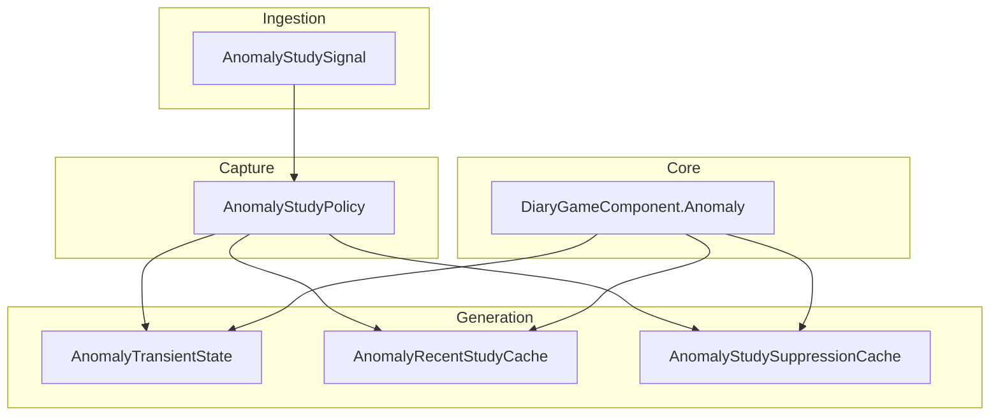
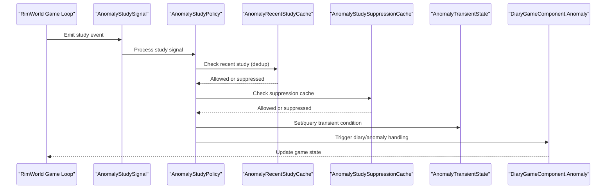
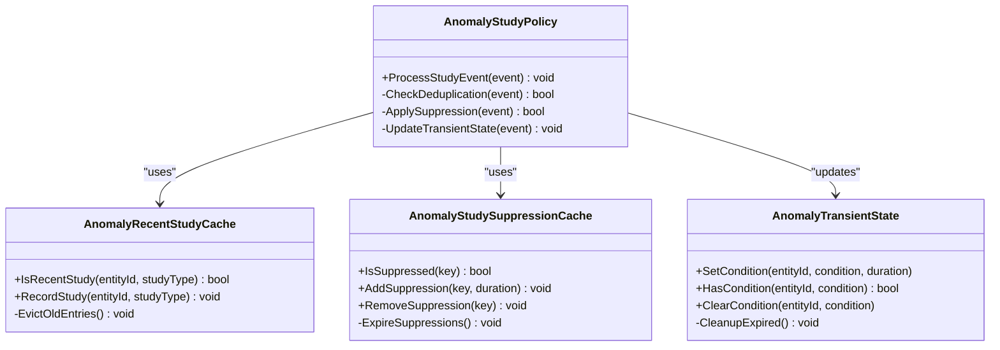
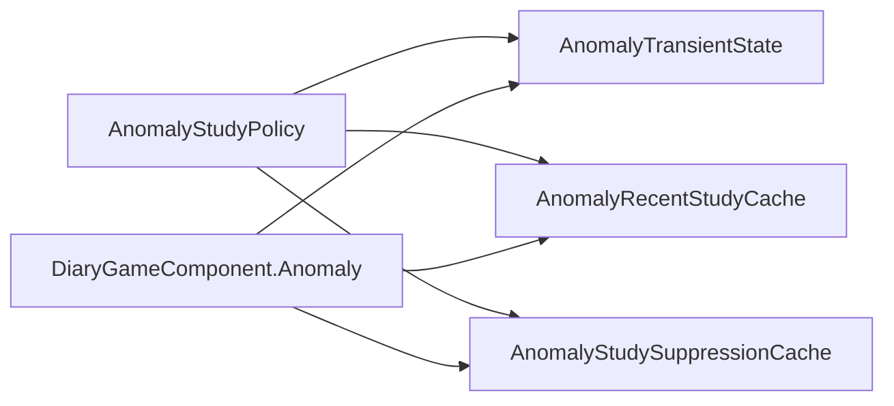

# Transient State Management

<cite>
**Referenced Files in This Document**
- [AnomalyTransientState.cs](../../../../../Source/Generation/AnomalyTransientState.cs)
- [AnomalyRecentStudyCache.cs](../../../../../Source/Generation/AnomalyRecentStudyCache.cs)
- [AnomalyStudySuppressionCache.cs](../../../../../Source/Generation/AnomalyStudySuppressionCache.cs)
- [DiaryGameComponent.Anomaly.cs](../../../../../Source/Core/DiaryGameComponent.Anomaly.cs)
- [AnomalyStudyPolicy.cs](../../../../../Source/Capture/Policies/AnomalyStudyPolicy.cs)
- [AnomalyStudySignal.cs](../../../../../Source/Ingestion/Sources/AnomalyStudySignal.cs)
</cite>

## Table of Contents
1. [Introduction](#introduction)
2. [Project Structure](#project-structure)
3. [Core Components](#core-components)
4. [Architecture Overview](#architecture-overview)
5. [Detailed Component Analysis](#detailed-component-analysis)
6. [Dependency Analysis](#dependency-analysis)
7. [Performance Considerations](#performance-considerations)
8. [Troubleshooting Guide](#troubleshooting-guide)
9. [Conclusion](#conclusion)

## Introduction
This document explains how transient state and caching are used to manage temporary conditions during anomaly events, focusing on:
- AnomalyTransientState for short-lived pawn and colony conditions
- AnomalyRecentStudyCache for deduplicating recent study events
- AnomalyStudySuppressionCache for suppressing repeated or redundant study-related processing
It also covers state transitions, cache invalidation strategies, memory management considerations, and configuration options for duration limits and cache sizes.

## Project Structure
The transient state and caching logic is implemented under the Generation layer and integrated via core game components and ingestion signals. The key files are:
- Source/Generation/AnomalyTransientState.cs
- Source/Generation/AnomalyRecentStudyCache.cs
- Source/Generation/AnomalyStudySuppressionCache.cs
- Source/Core/DiaryGameComponent.Anomaly.cs
- Source/Capture/Policies/AnomalyStudyPolicy.cs
- Source/Ingestion/Sources/AnomalyStudySignal.cs

**Diagram sources**
- [AnomalyTransientState.cs](../../../../../Source/Generation/AnomalyTransientState.cs)
- [AnomalyRecentStudyCache.cs](../../../../../Source/Generation/AnomalyRecentStudyCache.cs)
- [AnomalyStudySuppressionCache.cs](../../../../../Source/Generation/AnomalyStudySuppressionCache.cs)
- [DiaryGameComponent.Anomaly.cs](../../../../../Source/Core/DiaryGameComponent.Anomaly.cs)
- [AnomalyStudyPolicy.cs](../../../../../Source/Capture/Policies/AnomalyStudyPolicy.cs)
- [AnomalyStudySignal.cs](../../../../../Source/Ingestion/Sources/AnomalyStudySignal.cs)

**Section sources**
- [AnomalyTransientState.cs](../../../../../Source/Generation/AnomalyTransientState.cs)
- [AnomalyRecentStudyCache.cs](../../../../../Source/Generation/AnomalyRecentStudyCache.cs)
- [AnomalyStudySuppressionCache.cs](../../../../../Source/Generation/AnomalyStudySuppressionCache.cs)
- [DiaryGameComponent.Anomaly.cs](../../../../../Source/Core/DiaryGameComponent.Anomaly.cs)
- [AnomalyStudyPolicy.cs](../../../../../Source/Capture/Policies/AnomalyStudyPolicy.cs)
- [AnomalyStudySignal.cs](../../../../../Source/Ingestion/Sources/AnomalyStudySignal.cs)

## Core Components
- AnomalyTransientState: Tracks temporary conditions affecting pawns and colonies during anomaly events. It provides methods to set, query, and expire transient flags with configurable durations.
- AnomalyRecentStudyCache: Deduplicates study events within a time window to avoid redundant processing and narrative generation.
- AnomalyStudySuppressionCache: Suppresses repeated or redundant study-related processing by tracking suppression keys and expiration times.

These components work together to ensure that anomaly-related events are processed efficiently without overloading the system or generating duplicate content.

**Section sources**
- [AnomalyTransientState.cs](../../../../../Source/Generation/AnomalyTransientState.cs)
- [AnomalyRecentStudyCache.cs](../../../../../Source/Generation/AnomalyRecentStudyCache.cs)
- [AnomalyStudySuppressionCache.cs](../../../../../Source/Generation/AnomalyStudySuppressionCache.cs)

## Architecture Overview
The anomaly study flow integrates ingestion signals with policy evaluation and transient state management.

**Diagram sources**
- [AnomalyStudySignal.cs](../../../../../Source/Ingestion/Sources/AnomalyStudySignal.cs)
- [AnomalyStudyPolicy.cs](../../../../../Source/Capture/Policies/AnomalyStudyPolicy.cs)
- [AnomalyRecentStudyCache.cs](../../../../../Source/Generation/AnomalyRecentStudyCache.cs)
- [AnomalyStudySuppressionCache.cs](../../../../../Source/Generation/AnomalyStudySuppressionCache.cs)
- [AnomalyTransientState.cs](../../../../../Source/Generation/AnomalyTransientState.cs)
- [DiaryGameComponent.Anomaly.cs](../../../../../Source/Core/DiaryGameComponent.Anomaly.cs)

## Detailed Component Analysis

### AnomalyTransientState
Purpose:
- Manages short-lived conditions for pawns and colonies during anomaly events.
- Provides APIs to set transient flags, check current status, and handle expiration.

Key behaviors:
- Duration-based expiration: Conditions automatically expire after a configured time window.
- Scope-aware: Supports both pawn-level and colony-level transient states.
- Thread-safety: Designed for concurrent access from multiple game systems.

Example transitions:
- Start: Condition not present
- Set: Apply transient condition with duration
- Query: Check if condition is active
- Expire: Condition removed after duration elapses

Configuration options:
- Default duration for transient conditions
- Maximum number of concurrent transient states per entity
- Cleanup interval for expired entries

Memory management:
- Entries are evicted when they expire
- Optional size-based eviction to prevent unbounded growth
- Periodic cleanup tasks to reclaim memory

**Section sources**
- [AnomalyTransientState.cs](../../../../../Source/Generation/AnomalyTransientState.cs)

### AnomalyRecentStudyCache
Purpose:
- Deduplicates study events within a time window to prevent redundant processing.

Key behaviors:
- Time-windowed deduplication: Only one study event per entity within the configured window is allowed.
- Key-based lookup: Uses entity identifiers and study type as cache keys.
- Automatic expiration: Entries expire after the configured time window.

Cache invalidation:
- Expiration-based: Entries are removed after the time window elapses.
- Manual invalidation: Can be triggered by specific game events.

Configuration options:
- Time window size for deduplication
- Maximum cache size to prevent memory growth
- Eviction strategy when cache is full

Performance characteristics:
- O(1) average-time lookups using hash-based storage
- Low memory overhead with bounded cache size
- Minimal CPU impact due to simple key hashing

**Section sources**
- [AnomalyRecentStudyCache.cs](../../../../../Source/Generation/AnomalyRecentStudyCache.cs)

### AnomalyStudySuppressionCache
Purpose:
- Suppresses repeated or redundant study-related processing by tracking suppression keys and expiration times.

Key behaviors:
- Suppression key management: Tracks unique keys that should be suppressed.
- Duration-based suppression: Suppressions expire after a configured duration.
- Batch operations: Supports adding/removing multiple suppression keys at once.

Cache invalidation:
- Automatic expiration: Suppressions are removed after their duration elapses.
- Explicit removal: Can be manually cleared based on game state changes.

Configuration options:
- Default suppression duration
- Maximum number of active suppressions
- Memory limit for suppression entries

Memory management:
- Bounded cache size with LRU eviction
- Periodic cleanup of expired suppressions
- Efficient key storage using compact data structures

**Section sources**
- [AnomalyStudySuppressionCache.cs](../../../../../Source/Generation/AnomalyStudySuppressionCache.cs)

### Integration Points
The transient state and caching components integrate with the broader anomaly system through:

- DiaryGameComponent.Anomaly: Orchestrates anomaly-related game logic and coordinates with transient state management.
- AnomalyStudyPolicy: Evaluates study events and applies caching/transient state rules.
- AnomalyStudySignal: Ingests study events from the game loop and triggers policy evaluation.

**Diagram sources**
- [AnomalyTransientState.cs](../../../../../Source/Generation/AnomalyTransientState.cs)
- [AnomalyRecentStudyCache.cs](../../../../../Source/Generation/AnomalyRecentStudyCache.cs)
- [AnomalyStudySuppressionCache.cs](../../../../../Source/Generation/AnomalyStudySuppressionCache.cs)
- [AnomalyStudyPolicy.cs](../../../../../Source/Capture/Policies/AnomalyStudyPolicy.cs)

**Section sources**
- [DiaryGameComponent.Anomaly.cs](../../../../../Source/Core/DiaryGameComponent.Anomaly.cs)
- [AnomalyStudyPolicy.cs](../../../../../Source/Capture/Policies/AnomalyStudyPolicy.cs)
- [AnomalyStudySignal.cs](../../../../../Source/Ingestion/Sources/AnomalyStudySignal.cs)

## Dependency Analysis
The transient state and caching components have well-defined dependencies:

- AnomalyTransientState has no external dependencies and manages its own lifecycle
- AnomalyRecentStudyCache depends on basic collection types and time utilities
- AnomalyStudySuppressionCache depends on similar primitives as RecentStudyCache
- AnomalyStudyPolicy orchestrates all three components
- DiaryGameComponent.Anomaly provides integration with the core game loop

**Diagram sources**
- [AnomalyTransientState.cs](../../../../../Source/Generation/AnomalyTransientState.cs)
- [AnomalyRecentStudyCache.cs](../../../../../Source/Generation/AnomalyRecentStudyCache.cs)
- [AnomalyStudySuppressionCache.cs](../../../../../Source/Generation/AnomalyStudySuppressionCache.cs)
- [AnomalyStudyPolicy.cs](../../../../../Source/Capture/Policies/AnomalyStudyPolicy.cs)
- [DiaryGameComponent.Anomaly.cs](../../../../../Source/Core/DiaryGameComponent.Anomaly.cs)

**Section sources**
- [AnomalyTransientState.cs](../../../../../Source/Generation/AnomalyTransientState.cs)
- [AnomalyRecentStudyCache.cs](../../../../../Source/Generation/AnomalyRecentStudyCache.cs)
- [AnomalyStudySuppressionCache.cs](../../../../../Source/Generation/AnomalyStudySuppressionCache.cs)
- [AnomalyStudyPolicy.cs](../../../../../Source/Capture/Policies/AnomalyStudyPolicy.cs)
- [DiaryGameComponent.Anomaly.cs](../../../../../Source/Core/DiaryGameComponent.Anomaly.cs)

## Performance Considerations
- Cache sizing: Configure appropriate cache sizes based on expected event volume to balance memory usage and performance
- Expiration intervals: Tune expiration times to match gameplay pacing and avoid premature or delayed state clearing
- Memory pressure: Monitor memory usage during high-frequency anomaly events and adjust cache limits accordingly
- Threading: Ensure thread-safe operations when accessing shared state from multiple game systems
- Garbage collection: Minimize object allocations in hot paths by reusing objects where possible

## Troubleshooting Guide
Common issues and solutions:
- Cache overflow: If caches grow too large, review maximum size configurations and eviction policies
- Stale conditions: Verify that transient state expiration is working correctly and cleanup tasks are running
- Duplicate processing: Check deduplication windows and suppression keys to ensure proper event filtering
- Memory leaks: Monitor for unbounded growth in any of the cache implementations
- Performance degradation: Profile cache operations during peak anomaly activity and optimize as needed

**Section sources**
- [AnomalyTransientState.cs](../../../../../Source/Generation/AnomalyTransientState.cs)
- [AnomalyRecentStudyCache.cs](../../../../../Source/Generation/AnomalyRecentStudyCache.cs)
- [AnomalyStudySuppressionCache.cs](../../../../../Source/Generation/AnomalyStudySuppressionCache.cs)

## Conclusion
The anomaly transient state management system provides robust support for handling temporary conditions during anomaly events. Through careful use of caching mechanisms and configurable duration limits, it ensures efficient processing while maintaining game state consistency. The modular design allows for easy tuning and maintenance, making it suitable for complex anomaly scenarios that require precise control over timing and resource usage.
