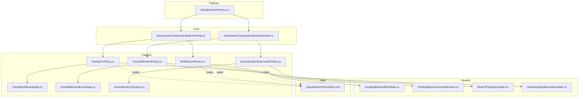
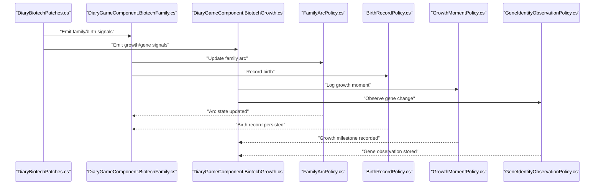
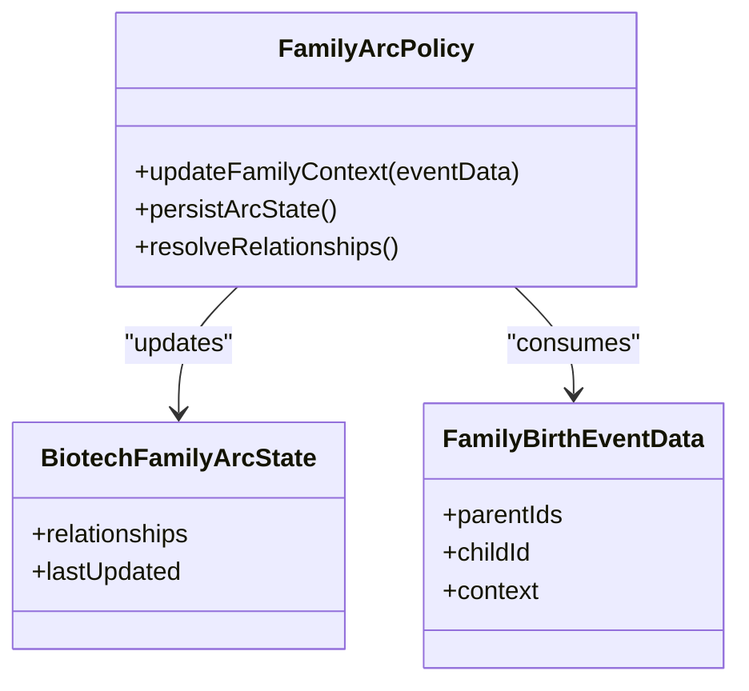
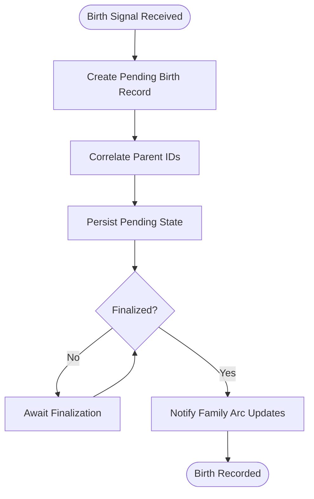
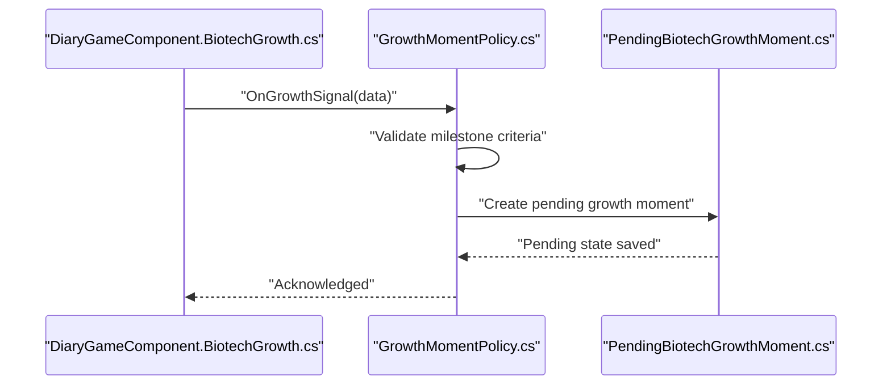
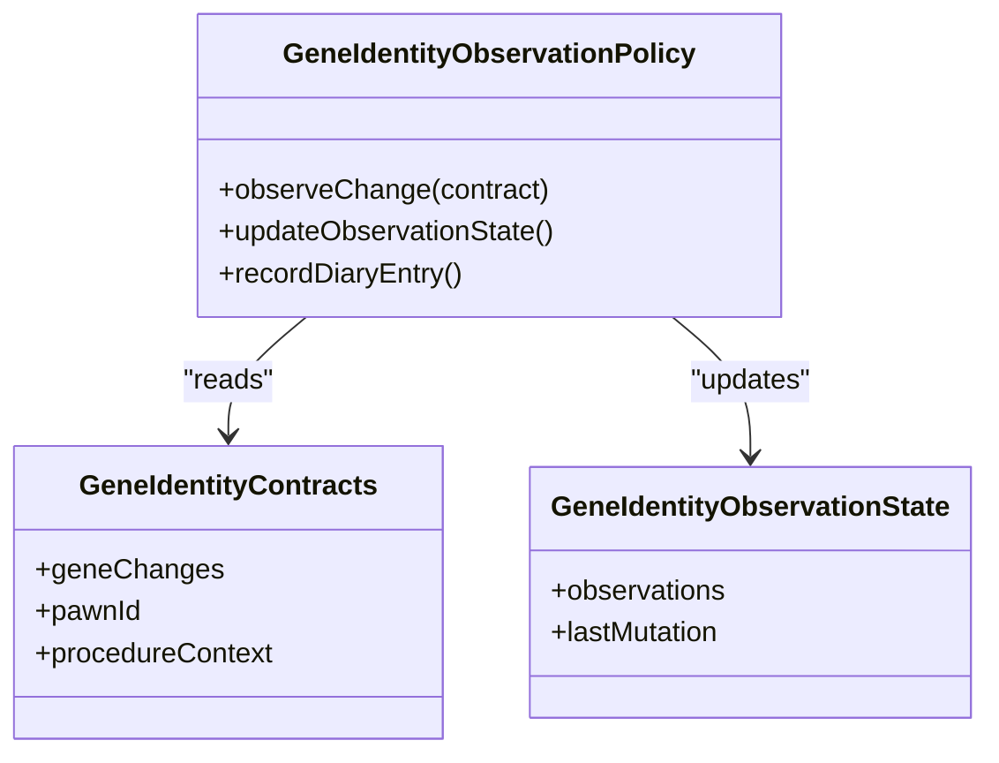
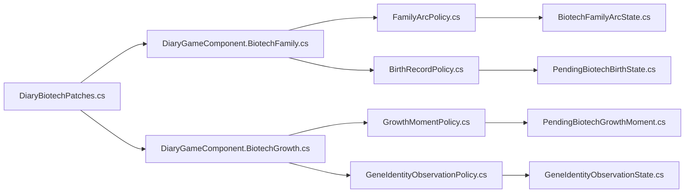

# Biotech Family & Growth Systems

<cite>
**Referenced Files in This Document**
- [FamilyArcPolicy.cs](../../../../../Source/Capture/Biotech/FamilyArcPolicy.cs)
- [BirthRecordPolicy.cs](../../../../../Source/Capture/Biotech/BirthRecordPolicy.cs)
- [GrowthMomentPolicy.cs](../../../../../Source/Capture/Biotech/GrowthMomentPolicy.cs)
- [GeneIdentityObservationPolicy.cs](../../../../../Source/Capture/Biotech/GeneIdentityObservationPolicy.cs)
- [BiotechContracts.cs](../../../../../Source/Capture/Biotech/BiotechContracts.cs)
- [FamilyBirthEventData.cs](../../../../../Source/Capture/Events/FamilyBirthEventData.cs)
- [GrowthMomentEventData.cs](../../../../../Source/Capture/Events/GrowthMomentEventData.cs)
- [GeneIdentityContracts.cs](../../../../../Source/Capture/Biotech/GeneIdentityContracts.cs)
- [DiaryGameComponent.BiotechFamily.cs](../../../../../Source/Core/DiaryGameComponent.BiotechFamily.cs)
- [DiaryGameComponent.BiotechGrowth.cs](../../../../../Source/Core/DiaryGameComponent.BiotechGrowth.cs)
- [PendingBiotechBirthState.cs](../../../../../Source/Models/PendingBiotechBirthState.cs)
- [PendingBiotechGrowthMoment.cs](../../../../../Source/Models/PendingBiotechGrowthMoment.cs)
- [BiotechFamilyArcState.cs](../../../../../Source/Models/BiotechFamilyArcState.cs)
- [GeneIdentityObservationState.cs](../../../../../Source/Models/GeneIdentityObservationState.cs)
- [DiaryBiotechPatches.cs](../../../../../Source/Patches/DiaryBiotechPatches.cs)
- [DiaryBiotechPolicyDefs.xml](../../../../../1.6/Defs/DiaryBiotechPolicyDefs.xml)
</cite>

## Table of Contents
1. [Introduction](#introduction)
2. [Project Structure](#project-structure)
3. [Core Components](#core-components)
4. [Architecture Overview](#architecture-overview)
5. [Detailed Component Analysis](#detailed-component-analysis)
6. [Dependency Analysis](#dependency-analysis)
7. [Performance Considerations](#performance-considerations)
8. [Troubleshooting Guide](#troubleshooting-guide)
9. [Conclusion](#conclusion)

## Introduction
This document explains how the Biotech DLC integration captures and narrates biotech-specific events: family arcs, births, growth milestones, and gene identity changes. It focuses on four policies that implement the core behavior:
- FamilyArcPolicy for tracking family relationships and narrative arcs
- BirthRecordPolicy for capturing pawn births and lineage
- GrowthMomentPolicy for developmental stages and milestones
- GeneIdentityObservationPolicy for genetic modifications and identity shifts

It also covers configuration via policy definitions, event data contracts, game component orchestration, and troubleshooting guidance for diary entries related to these features.

## Project Structure
The Biotech integration spans several layers:
- Patches inject hooks into Biotech systems to emit signals
- Game components coordinate lifecycle and persistence
- Policies implement capture logic and state transitions
- Event data models carry structured information from sources to policies
- Models persist state across sessions

**Diagram sources**
- [DiaryBiotechPatches.cs](../../../../../Source/Patches/DiaryBiotechPatches.cs)
- [DiaryGameComponent.BiotechFamily.cs](../../../../../Source/Core/DiaryGameComponent.BiotechFamily.cs)
- [DiaryGameComponent.BiotechGrowth.cs](../../../../../Source/Core/DiaryGameComponent.BiotechGrowth.cs)
- [FamilyArcPolicy.cs](../../../../../Source/Capture/Biotech/FamilyArcPolicy.cs)
- [BirthRecordPolicy.cs](../../../../../Source/Capture/Biotech/BirthRecordPolicy.cs)
- [GrowthMomentPolicy.cs](../../../../../Source/Capture/Biotech/GrowthMomentPolicy.cs)
- [GeneIdentityObservationPolicy.cs](../../../../../Source/Capture/Biotech/GeneIdentityObservationPolicy.cs)
- [FamilyBirthEventData.cs](../../../../../Source/Capture/Events/FamilyBirthEventData.cs)
- [GrowthMomentEventData.cs](../../../../../Source/Capture/Events/GrowthMomentEventData.cs)
- [GeneIdentityContracts.cs](../../../../../Source/Capture/Biotech/GeneIdentityContracts.cs)
- [PendingBiotechBirthState.cs](../../../../../Source/Models/PendingBiotechBirthState.cs)
- [PendingBiotechGrowthMoment.cs](../../../../../Source/Models/PendingBiotechGrowthMoment.cs)
- [BiotechFamilyArcState.cs](../../../../../Source/Models/BiotechFamilyArcState.cs)
- [GeneIdentityObservationState.cs](../../../../../Source/Models/GeneIdentityObservationState.cs)
- [DiaryBiotechPolicyDefs.xml](../../../../../1.6/Defs/DiaryBiotechPolicyDefs.xml)

**Section sources**
- [DiaryBiotechPatches.cs](../../../../../Source/Patches/DiaryBiotechPatches.cs)
- [DiaryGameComponent.BiotechFamily.cs](../../../../../Source/Core/DiaryGameComponent.BiotechFamily.cs)
- [DiaryGameComponent.BiotechGrowth.cs](../../../../../Source/Core/DiaryGameComponent.BiotechGrowth.cs)
- [DiaryBiotechPolicyDefs.xml](../../../../../1.6/Defs/DiaryBiotechPolicyDefs.xml)

## Core Components
- FamilyArcPolicy: Maintains family relationship context and updates arc state when relevant events occur (e.g., births, adoptions).
- BirthRecordPolicy: Captures birth events, correlates parents and offspring, and persists pending birth records until finalized.
- GrowthMomentPolicy: Observes developmental milestones (e.g., age transitions, maturation), recording growth moments with contextual details.
- GeneIdentityObservationPolicy: Tracks genetic modifications, mutations, or identity-altering procedures and logs observations tied to pawns.

These policies consume typed event data and write to persistent models, enabling coherent diary entries over time.

**Section sources**
- [FamilyArcPolicy.cs](../../../../../Source/Capture/Biotech/FamilyArcPolicy.cs)
- [BirthRecordPolicy.cs](../../../../../Source/Capture/Biotech/BirthRecordPolicy.cs)
- [GrowthMomentPolicy.cs](../../../../../Source/Capture/Biotech/GrowthMomentPolicy.cs)
- [GeneIdentityObservationPolicy.cs](../../../../../Source/Capture/Biotech/GeneIdentityObservationPolicy.cs)

## Architecture Overview
The system follows a signal-to-policy pipeline:
- Patches detect Biotech events and forward them to game components
- Game components route signals to appropriate policies
- Policies update state and produce diary content through the broader Diary pipeline

**Diagram sources**
- [DiaryBiotechPatches.cs](../../../../../Source/Patches/DiaryBiotechPatches.cs)
- [DiaryGameComponent.BiotechFamily.cs](../../../../../Source/Core/DiaryGameComponent.BiotechFamily.cs)
- [DiaryGameComponent.BiotechGrowth.cs](../../../../../Source/Core/DiaryGameComponent.BiotechGrowth.cs)
- [FamilyArcPolicy.cs](../../../../../Source/Capture/Biotech/FamilyArcPolicy.cs)
- [BirthRecordPolicy.cs](../../../../../Source/Capture/Biotech/BirthRecordPolicy.cs)
- [GrowthMomentPolicy.cs](../../../../../Source/Capture/Biotech/GrowthMomentPolicy.cs)
- [GeneIdentityObservationPolicy.cs](../../../../../Source/Capture/Biotech/GeneIdentityObservationPolicy.cs)

## Detailed Component Analysis

### FamilyArcPolicy
Purpose:
- Maintain and evolve family relationship context for pawns
- Update arc state based on family-related events (births, adoption, separation)
- Provide context for narrative generation around family dynamics

Key behaviors:
- Consumes family event data to infer parent-child and sibling relationships
- Persists family arc state for long-term continuity
- Coordinates with birth records to ensure accurate lineage

**Diagram sources**
- [FamilyArcPolicy.cs](../../../../../Source/Capture/Biotech/FamilyArcPolicy.cs)
- [BiotechFamilyArcState.cs](../../../../../Source/Models/BiotechFamilyArcState.cs)
- [FamilyBirthEventData.cs](../../../../../Source/Capture/Events/FamilyBirthEventData.cs)

**Section sources**
- [FamilyArcPolicy.cs](../../../../../Source/Capture/Biotech/FamilyArcPolicy.cs)
- [BiotechFamilyArcState.cs](../../../../../Source/Models/BiotechFamilyArcState.cs)
- [FamilyBirthEventData.cs](../../../../../Source/Capture/Events/FamilyBirthEventData.cs)

### BirthRecordPolicy
Purpose:
- Capture and track pawn births, including parentage and ownership
- Manage pending birth records until finalization
- Ensure lineage accuracy for subsequent family arc updates

Processing flow:
- Receives birth signals and creates pending records
- Correlates parents and child using provided identifiers
- Finalizes records and triggers downstream family updates

**Diagram sources**
- [BirthRecordPolicy.cs](../../../../../Source/Capture/Biotech/BirthRecordPolicy.cs)
- [PendingBiotechBirthState.cs](../../../../../Source/Models/PendingBiotechBirthState.cs)
- [FamilyBirthEventData.cs](../../../../../Source/Capture/Events/FamilyBirthEventData.cs)

**Section sources**
- [BirthRecordPolicy.cs](../../../../../Source/Capture/Biotech/BirthRecordPolicy.cs)
- [PendingBiotechBirthState.cs](../../../../../Source/Models/PendingBiotechBirthState.cs)
- [FamilyBirthEventData.cs](../../../../../Source/Capture/Events/FamilyBirthEventData.cs)

### GrowthMomentPolicy
Purpose:
- Observe and record developmental milestones (e.g., age-based transitions)
- Attach contextual metadata to growth events for richer narratives
- Coordinate with growth correlation utilities to enrich context

Lifecycle:
- Detects growth signals and validates eligibility
- Records growth moments with timestamps and context
- Persists pending growth moments until committed

**Diagram sources**
- [DiaryGameComponent.BiotechGrowth.cs](../../../../../Source/Core/DiaryGameComponent.BiotechGrowth.cs)
- [GrowthMomentPolicy.cs](../../../../../Source/Capture/Biotech/GrowthMomentPolicy.cs)
- [PendingBiotechGrowthMoment.cs](../../../../../Source/Models/PendingBiotechGrowthMoment.cs)
- [GrowthMomentEventData.cs](../../../../../Source/Capture/Events/GrowthMomentEventData.cs)

**Section sources**
- [DiaryGameComponent.BiotechGrowth.cs](../../../../../Source/Core/DiaryGameComponent.BiotechGrowth.cs)
- [GrowthMomentPolicy.cs](../../../../../Source/Capture/Biotech/GrowthMomentPolicy.cs)
- [PendingBiotechGrowthMoment.cs](../../../../../Source/Models/PendingBiotechGrowthMoment.cs)
- [GrowthMomentEventData.cs](../../../../../Source/Capture/Events/GrowthMomentEventData.cs)

### GeneIdentityObservationPolicy
Purpose:
- Track genetic modifications, mutations, and identity-altering procedures
- Associate observations with specific pawns and contexts
- Persist gene identity states for continuity across sessions

Behavior highlights:
- Consumes gene identity contracts to interpret changes
- Updates observation state with before/after gene profiles
- Integrates with growth and family systems where applicable

**Diagram sources**
- [GeneIdentityObservationPolicy.cs](../../../../../Source/Capture/Biotech/GeneIdentityObservationPolicy.cs)
- [GeneIdentityContracts.cs](../../../../../Source/Capture/Biotech/GeneIdentityContracts.cs)
- [GeneIdentityObservationState.cs](../../../../../Source/Models/GeneIdentityObservationState.cs)

**Section sources**
- [GeneIdentityObservationPolicy.cs](../../../../../Source/Capture/Biotech/GeneIdentityObservationPolicy.cs)
- [GeneIdentityContracts.cs](../../../../../Source/Capture/Biotech/GeneIdentityContracts.cs)
- [GeneIdentityObservationState.cs](../../../../../Source/Models/GeneIdentityObservationState.cs)

## Dependency Analysis
High-level dependencies among Biotech components:

**Diagram sources**
- [DiaryBiotechPatches.cs](../../../../../Source/Patches/DiaryBiotechPatches.cs)
- [DiaryGameComponent.BiotechFamily.cs](../../../../../Source/Core/DiaryGameComponent.BiotechFamily.cs)
- [DiaryGameComponent.BiotechGrowth.cs](../../../../../Source/Core/DiaryGameComponent.BiotechGrowth.cs)
- [FamilyArcPolicy.cs](../../../../../Source/Capture/Biotech/FamilyArcPolicy.cs)
- [BirthRecordPolicy.cs](../../../../../Source/Capture/Biotech/BirthRecordPolicy.cs)
- [GrowthMomentPolicy.cs](../../../../../Source/Capture/Biotech/GrowthMomentPolicy.cs)
- [GeneIdentityObservationPolicy.cs](../../../../../Source/Capture/Biotech/GeneIdentityObservationPolicy.cs)
- [PendingBiotechBirthState.cs](../../../../../Source/Models/PendingBiotechBirthState.cs)
- [PendingBiotechGrowthMoment.cs](../../../../../Source/Models/PendingBiotechGrowthMoment.cs)
- [BiotechFamilyArcState.cs](../../../../../Source/Models/BiotechFamilyArcState.cs)
- [GeneIdentityObservationState.cs](../../../../../Source/Models/GeneIdentityObservationState.cs)

**Section sources**
- [DiaryBiotechPatches.cs](../../../../../Source/Patches/DiaryBiotechPatches.cs)
- [DiaryGameComponent.BiotechFamily.cs](../../../../../Source/Core/DiaryGameComponent.BiotechFamily.cs)
- [DiaryGameComponent.BiotechGrowth.cs](../../../../../Source/Core/DiaryGameComponent.BiotechGrowth.cs)

## Performance Considerations
- Batch processing: Prefer batching growth and gene observation updates to reduce per-frame overhead
- State persistence: Persist only delta changes to minimize save size and load times
- Event filtering: Use policy definitions to disable low-value events in large colonies
- Caching: Cache resolved relationships and gene profiles to avoid repeated lookups

[No sources needed since this section provides general guidance]

## Troubleshooting Guide
Common issues and resolutions:
- Missing diary entries for births: Verify that pending birth records are being finalized and that family arc updates are triggered after finalization
- Incomplete growth milestones: Check that growth signals are emitted at correct life stages and that pending growth moments are committed
- Gene identity not observed: Confirm that gene change contracts include valid pawn identifiers and procedure context; ensure observation state is persisted
- Configuration problems: Review policy definition XML for enabled flags and thresholds; validate that patches are loaded and active

Diagnostic steps:
- Inspect pending state models for unresolved records
- Validate event data payloads for required fields
- Confirm patch registration and hook execution order
- Cross-check policy definition settings against expected behavior

**Section sources**
- [DiaryBiotechPatches.cs](../../../../../Source/Patches/DiaryBiotechPatches.cs)
- [DiaryBiotechPolicyDefs.xml](../../../../../1.6/Defs/DiaryBiotechPolicyDefs.xml)
- [PendingBiotechBirthState.cs](../../../../../Source/Models/PendingBiotechBirthState.cs)
- [PendingBiotechGrowthMoment.cs](../../../../../Source/Models/PendingBiotechGrowthMoment.cs)

## Conclusion
The Biotech DLC integration provides a robust framework for capturing family arcs, births, growth milestones, and gene identity changes. The four core policies coordinate with game components and patches to maintain consistent state and generate meaningful diary entries. Proper configuration and attention to pending state finalization ensure reliable behavior across complex scenarios.

[No sources needed since this section summarizes without analyzing specific files]
