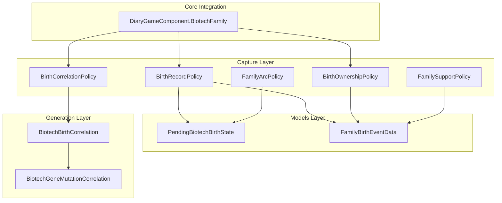
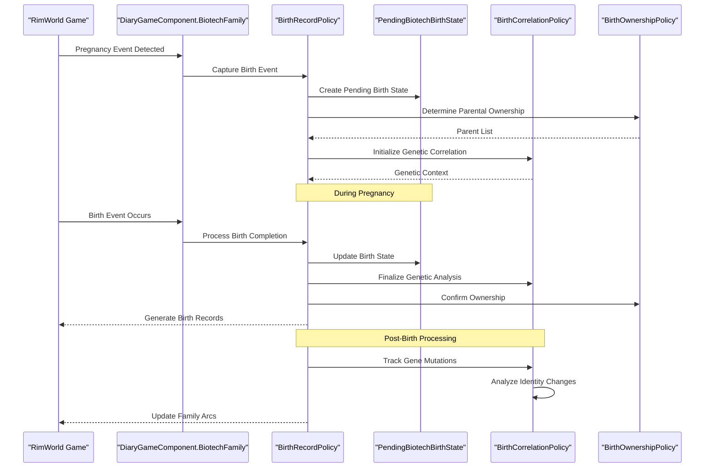
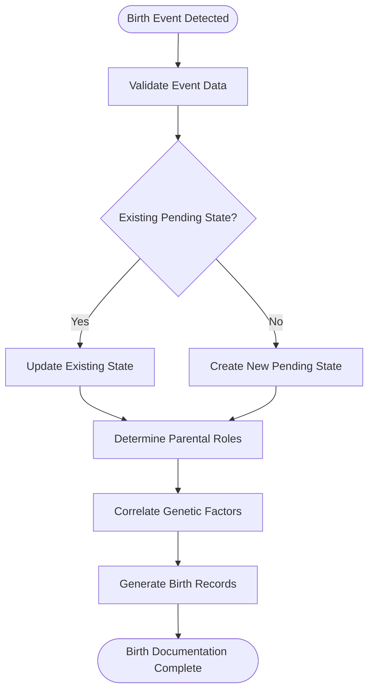
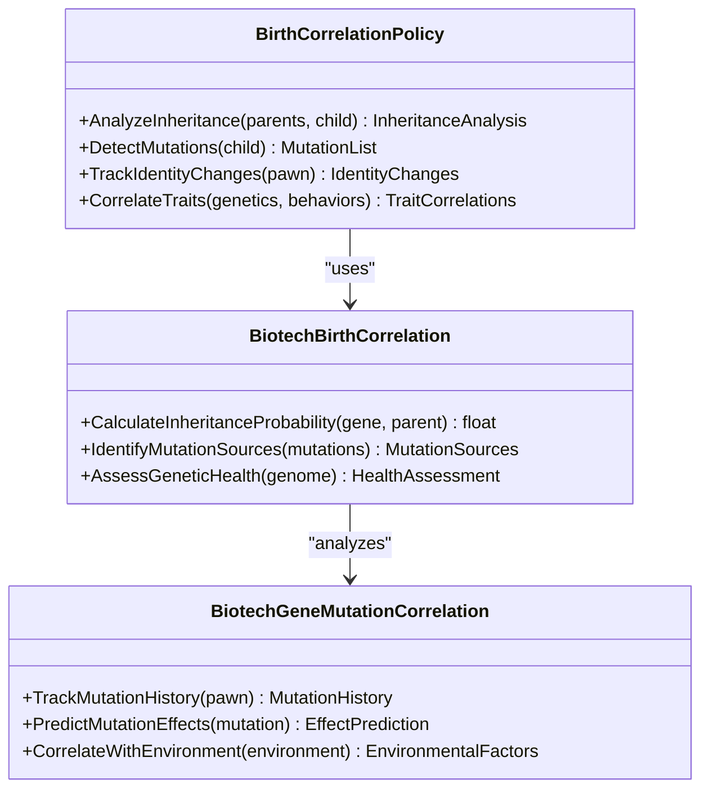
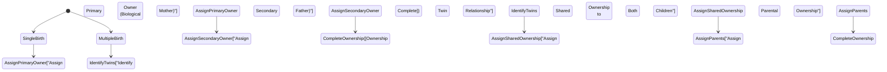
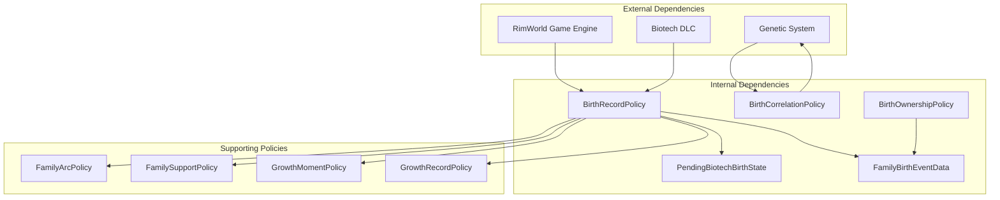

# Birth Record & Lineage Tracking

## Table of Contents
1. [Introduction](#introduction)
2. [Project Structure](#project-structure)
3. [Core Components](#core-components)
4. [Architecture Overview](#architecture-overview)
5. [Detailed Component Analysis](#detailed-component-analysis)
6. [Dependency Analysis](#dependency-analysis)
7. [Performance Considerations](#performance-considerations)
8. [Troubleshooting Guide](#troubleshooting-guide)
9. [Conclusion](#conclusion)

## Introduction

The Birth Record & Lineage Tracking system is a sophisticated component within the Pawn Diary mod for RimWorld's Biotech expansion. This system captures and documents birth events, tracks parent-child relationships across generations, manages pending birth states during pregnancy, and correlates birth outcomes with genetic factors including gene mutations and identity transitions. The system provides comprehensive narrative generation for family arcs, growth moments, and lineage documentation throughout gameplay.

## Project Structure

The birth tracking system is organized within the Biotech capture layer, with supporting components in the models, generation, and core game integration layers. The architecture follows a policy-based design pattern where different policies handle specific aspects of birth event processing.

**Diagram sources**
- [BirthRecordPolicy.cs:1-50](../../../../../Source/Capture/Biotech/BirthRecordPolicy.cs#L1-L50)
- [BirthCorrelationPolicy.cs:1-50](../../../../../Source/Capture/Biotech/BirthCorrelationPolicy.cs#L1-L50)
- [BirthOwnershipPolicy.cs:1-50](../../../../../Source/Capture/Biotech/BirthOwnershipPolicy.cs#L1-L50)
- [PendingBiotechBirthState.cs:1-50](../../../../../Source/Models/PendingBiotechBirthState.cs#L1-L50)
- [FamilyBirthEventData.cs:1-50](../../../../../Source/Capture/Events/FamilyBirthEventData.cs#L1-L50)
- [DiaryGameComponent.BiotechFamily.cs:1-50](../../../../../Source/Core/DiaryGameComponent.BiotechFamily.cs#L1-L50)

**Section sources**
- [BirthRecordPolicy.cs:1-100](../../../../../Source/Capture/Biotech/BirthRecordPolicy.cs#L1-L100)
- [BirthCorrelationPolicy.cs:1-100](../../../../../Source/Capture/Biotech/BirthCorrelationPolicy.cs#L1-L100)
- [BirthOwnershipPolicy.cs:1-100](../../../../../Source/Capture/Biotech/BirthOwnershipPolicy.cs#L1-L100)

## Core Components

The birth tracking system consists of several key policy implementations that work together to capture, correlate, and document birth events:

### BirthRecordPolicy
This primary policy handles the capture and recording of birth events, managing the lifecycle from pregnancy detection through birth completion. It coordinates with other policies to ensure comprehensive documentation of birth-related activities.

### BirthCorrelationPolicy
This policy establishes connections between birth events and their genetic context, correlating outcomes with parental genes, mutations, and identity factors. It ensures that genetic information is properly attributed and documented in birth records.

### BirthOwnershipPolicy
This policy determines ownership and attribution of birth events, establishing which pawns are considered parents, guardians, or observers of birth events. It handles complex scenarios involving multiple births and shared parenting responsibilities.

**Section sources**
- [BirthRecordPolicy.cs:1-200](../../../../../Source/Capture/Biotech/BirthRecordPolicy.cs#L1-L200)
- [BirthCorrelationPolicy.cs:1-200](../../../../../Source/Capture/Biotech/BirthCorrelationPolicy.cs#L1-L200)
- [BirthOwnershipPolicy.cs:1-200](../../../../../Source/Capture/Biotech/BirthOwnershipPolicy.cs#L1-L200)

## Architecture Overview

The birth tracking system follows a layered architecture with clear separation of concerns between capture, correlation, ownership determination, and state management.

**Diagram sources**
- [DiaryGameComponent.BiotechFamily.cs:1-150](../../../../../Source/Core/DiaryGameComponent.BiotechFamily.cs#L1-L150)
- [BirthRecordPolicy.cs:1-150](../../../../../Source/Capture/Biotech/BirthRecordPolicy.cs#L1-L150)
- [PendingBiotechBirthState.cs:1-100](../../../../../Source/Models/PendingBiotechBirthState.cs#L1-L100)

## Detailed Component Analysis

### BirthRecordPolicy Implementation

The BirthRecordPolicy serves as the central coordinator for birth event processing. It manages the complete lifecycle of birth documentation, from initial pregnancy detection through post-birth analysis.

#### Key Responsibilities:
- **Event Capture**: Detects and captures birth-related events from the game engine
- **State Management**: Maintains pending birth states during pregnancy periods
- **Policy Coordination**: Orchestrates other policies for specialized tasks
- **Record Generation**: Creates comprehensive birth records with contextual information

#### Data Flow:

**Diagram sources**
- [BirthRecordPolicy.cs:50-200](../../../../../Source/Capture/Biotech/BirthRecordPolicy.cs#L50-L200)

**Section sources**
- [BirthRecordPolicy.cs:1-300](../../../../../Source/Capture/Biotech/BirthRecordPolicy.cs#L1-L300)

### BirthCorrelationPolicy Implementation

The BirthCorrelationPolicy focuses on establishing meaningful connections between birth events and their genetic context. It analyzes parental genetics, mutation patterns, and identity factors to provide rich narrative context.

#### Genetic Analysis Features:
- **Parental Gene Inheritance**: Tracks which genes were inherited from each parent
- **Mutation Detection**: Identifies new mutations and their potential causes
- **Identity Transitions**: Monitors changes in pawn identity related to genetic modifications
- **Trait Correlation**: Links genetic factors to behavioral and physical traits

#### Mutation Tracking Flow:

**Diagram sources**
- [BirthCorrelationPolicy.cs:1-200](../../../../../Source/Capture/Biotech/BirthCorrelationPolicy.cs#L1-L200)
- [BiotechBirthCorrelation.cs:1-150](../../../../../Source/Generation/BiotechBirthCorrelation.cs#L1-L150)
- [BiotechGeneMutationCorrelation.cs:1-150](../../../../../Source/Generation/BiotechGeneMutationCorrelation.cs#L1-L150)

**Section sources**
- [BirthCorrelationPolicy.cs:1-250](../../../../../Source/Capture/Biotech/BirthCorrelationPolicy.cs#L1-L250)
- [BiotechBirthCorrelation.cs:1-200](../../../../../Source/Generation/BiotechBirthCorrelation.cs#L1-L200)
- [BiotechGeneMutationCorrelation.cs:1-200](../../../../../Source/Generation/BiotechGeneMutationCorrelation.cs#L1-L200)

### BirthOwnershipPolicy Implementation

The BirthOwnershipPolicy determines who has ownership and responsibility for birth events, handling complex scenarios involving multiple parents, adoption, and communal childcare arrangements.

#### Ownership Determination Logic:
- **Biological Parents**: Primary ownership for biological mothers and fathers
- **Adoptive Parents**: Secondary ownership for adopted children
- **Guardians**: Tertiary ownership for legal guardians
- **Community Members**: Shared ownership for community-raised children

#### Multiple Birth Handling:

**Diagram sources**
- [BirthOwnershipPolicy.cs:1-200](../../../../../Source/Capture/Biotech/BirthOwnershipPolicy.cs#L1-L200)

**Section sources**
- [BirthOwnershipPolicy.cs:1-300](../../../../../Source/Capture/Biotech/BirthOwnershipPolicy.cs#L1-L300)

### Pending Birth State Management

The PendingBiotechBirthState model maintains the state of pregnancies and pre-birth conditions, allowing for continuous tracking and documentation throughout the gestation period.

#### State Properties:
- **Pregnancy Progress**: Tracks gestational timeline and milestones
- **Expected Due Date**: Calculates and monitors delivery timing
- **Health Indicators**: Monitors maternal and fetal health status
- **Complication Tracking**: Documents any pregnancy-related complications

**Section sources**
- [PendingBiotechBirthState.cs:1-150](../../../../../Source/Models/PendingBiotechBirthState.cs#L1-L150)

## Dependency Analysis

The birth tracking system has well-defined dependencies between components, with clear separation of concerns and minimal coupling.

**Diagram sources**
- [BirthRecordPolicy.cs:1-100](../../../../../Source/Capture/Biotech/BirthRecordPolicy.cs#L1-L100)
- [DiaryBiotechPolicyDef.cs:1-100](../../../../../Source/Defs/DiaryBiotechPolicyDef.cs#L1-L100)

**Section sources**
- [DiaryBiotechPolicyDef.cs:1-200](../../../../../Source/Defs/DiaryBiotechPolicyDef.cs#L1-L200)

## Performance Considerations

The birth tracking system is designed with performance in mind, implementing several optimization strategies:

### Efficient State Management
- **Lazy Loading**: Birth state data is loaded only when needed
- **Incremental Updates**: State changes are processed incrementally rather than full recalculations
- **Caching**: Frequently accessed genetic and relationship data is cached

### Memory Optimization
- **Object Pooling**: Reusable objects for birth event processing
- **Garbage Collection**: Minimized object creation during high-frequency operations
- **Memory Leaks Prevention**: Proper cleanup of birth state references

### Processing Efficiency
- **Batch Processing**: Multiple birth events are processed in batches when possible
- **Asynchronous Operations**: Non-critical calculations run asynchronously
- **Priority Queueing**: Critical birth events are prioritized in processing queues

## Troubleshooting Guide

### Common Birth Tracking Issues

#### Missing Birth Records
**Symptoms**: Birth events not appearing in diary entries
**Causes**:
- Policy registration failures
- Event filtering too aggressive
- Permission issues preventing record creation

**Resolution Steps**:
1. Verify birth policies are properly registered in the game component
2. Check event filter settings for overly restrictive criteria
3. Ensure proper permissions for birth record creation

#### Incorrect Parental Attribution
**Symptoms**: Wrong parents listed in birth records
**Causes**:
- Complex relationship edge cases
- Adoption vs biological parent confusion
- Multiple birth ownership conflicts

**Resolution Steps**:
1. Review ownership policy configuration
2. Check for conflicting parental claims
3. Verify relationship database integrity

#### Genetic Correlation Failures
**Symptoms**: Missing or incorrect genetic information in birth records
**Causes**:
- Gene mutation tracking disabled
- Insufficient genetic data availability
- Correlation policy misconfiguration

**Resolution Steps**:
1. Enable genetic correlation features in settings
2. Verify sufficient genetic data is available
3. Check correlation policy sensitivity settings

### Configuration Options

#### Birth Event Sensitivity Settings
- **Minimum Relationship Strength**: Controls threshold for automatic parental attribution
- **Genetic Analysis Depth**: Determines how thoroughly genetic factors are analyzed
- **Multiple Birth Threshold**: Sets minimum number of children for multiple birth handling
- **Pending State Duration**: Configures how long pregnancy states are maintained

#### Example Configuration Scenarios

**High Sensitivity Mode**:
- Captures all birth events regardless of relationship strength
- Performs comprehensive genetic analysis
- Maintains detailed pending state history
- Generates extensive family arc documentation

**Minimal Mode**:
- Only captures major birth events
- Basic genetic correlation only
- Simplified pending state management
- Focuses on immediate family impact

### Diagnostic Tools

#### Birth Event Logging
Enable detailed logging to track birth event processing:
- Event capture timestamps
- Policy execution details
- State transition logs
- Error reporting and recovery actions

#### Debug Commands
Use development commands to inspect birth state:
- View current pending births
- Analyze ownership assignments
- Check genetic correlation status
- Force recalculation of birth records

**Section sources**
- [DiaryGameComponent.BiotechFamily.cs:1-200](../../../../../Source/Core/DiaryGameComponent.BiotechFamily.cs#L1-L200)
- [DiaryBiotechPolicyDef.cs:1-200](../../../../../Source/Defs/DiaryBiotechPolicyDef.cs#L1-L200)

## Conclusion

The Birth Record & Lineage Tracking system provides comprehensive documentation of birth events, family relationships, and genetic inheritance within the RimWorld Biotech expansion. Through its modular policy-based architecture, the system effectively captures the complexity of modern family structures while maintaining performance and extensibility. The combination of birth recording, genetic correlation, and ownership management creates rich narrative content that enhances the storytelling experience in biologically-focused gameplay scenarios.

The system's design allows for easy customization through configuration options and policy adjustments, making it adaptable to various playstyles and modding scenarios. Its robust error handling and diagnostic capabilities ensure reliable operation even in complex gameplay situations involving multiple births, adoption, and genetic modifications.
