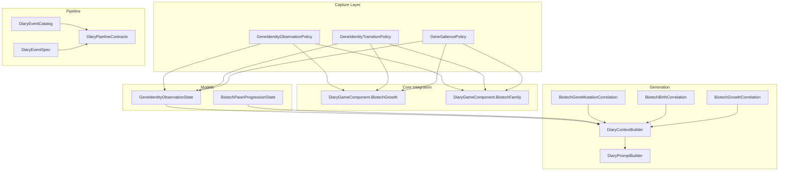
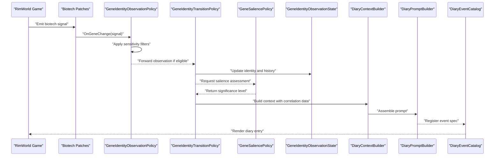
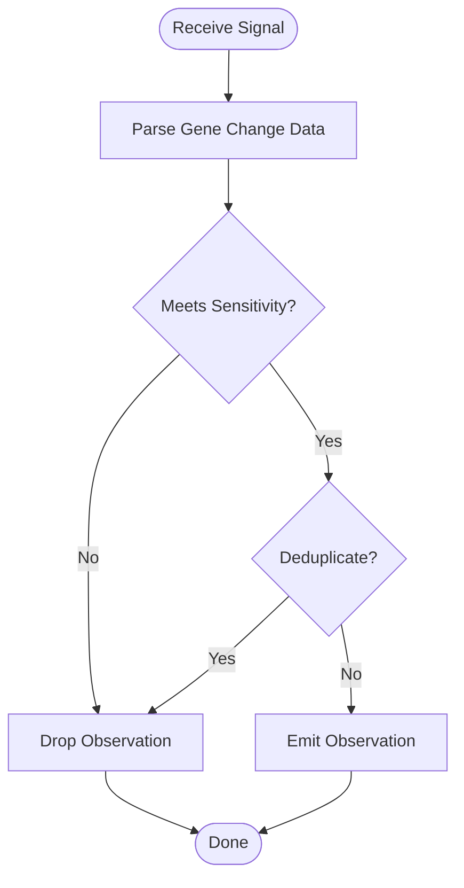
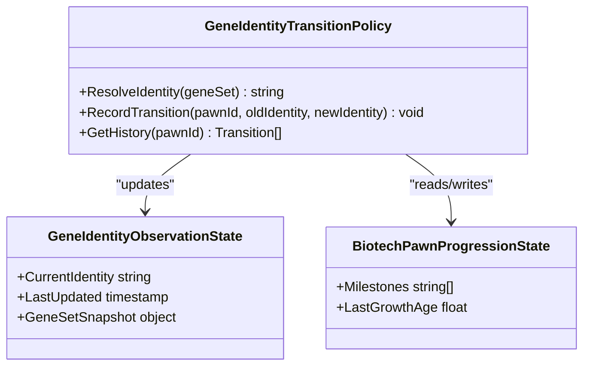
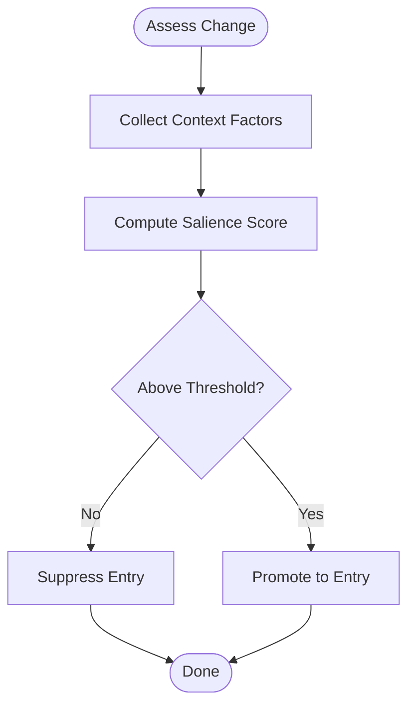
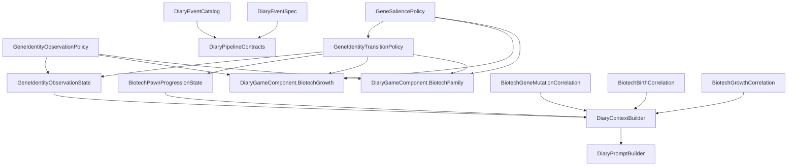

# Gene Identity & Genetic Modification Tracking

- [GeneIdentityObservationPolicy.cs](../../../../../Source/Capture/Biotech/GeneIdentityObservationPolicy.cs)
- [GeneIdentityTransitionPolicy.cs](../../../../../Source/Capture/Biotech/GeneIdentityTransitionPolicy.cs)
- [GeneSaliencePolicy.cs](../../../../../Source/Capture/Biotech/GeneSaliencePolicy.cs)
- [GeneIdentityObservationState.cs](../../../../../Source/Models/GeneIdentityObservationState.cs)
- [DiaryBiotechPolicyDef.cs](../../../../../Source/Defs/DiaryBiotechPolicyDef.cs)
- [DiaryBiotechPolicyDefs.xml](../../../../../1.6/Defs/DiaryBiotechPolicyDefs.xml)
- [DiaryGameComponent.BiotechGrowth.cs](../../../../../Source/Core/DiaryGameComponent.BiotechGrowth.cs)
- [DiaryGameComponent.BiotechFamily.cs](../../../../../Source/Core/DiaryGameComponent.BiotechFamily.cs)
- [BiotechPawnProgressionState.cs](../../../../../Source/Models/BiotechPawnProgressionState.cs)
- [BiotechBirthCorrelation.cs](../../../../../Source/Generation/BiotechBirthCorrelation.cs)
- [BiotechGeneMutationCorrelation.cs](../../../../../Source/Generation/BiotechGeneMutationCorrelation.cs)
- [BiotechGrowthCorrelation.cs](../../../../../Source/Generation/BiotechGrowthCorrelation.cs)
- [DiaryEventSpec.cs](../../../../../Source/Capture/Catalog/DiaryEventSpec.cs)
- [DiaryEventCatalog.cs](../../../../../Source/Capture/Catalog/DiaryEventCatalog.cs)
- [DiaryContextBuilder.cs](../../../../../Source/Generation/DiaryContextBuilder.cs)
- [DiaryPromptBuilder.cs](../../../../../Source/Generation/DiaryPromptBuilder.cs)
- [DiaryPipelineContracts.cs](../../../../../Source/Pipeline/DiaryPipelineContracts.cs)
- [DiaryTuningDef.cs](../../../../../Source/Defs/DiaryTuningDef.cs)
- [PawnDiarySettings.cs](../../../../../Source/Settings/PawnDiarySettings.cs)
## Table of Contents
1. [Introduction](#introduction)
2. [Project Structure](#project-structure)
3. [Core Components](#core-components)
4. [Architecture Overview](#architecture-overview)
5. [Detailed Component Analysis](#detailed-component-analysis)
6. [Dependency Analysis](#dependency-analysis)
7. [Performance Considerations](#performance-considerations)
8. [Troubleshooting Guide](#troubleshooting-guide)
9. [Conclusion](#conclusion)
10. [Appendices](#appendices)

## Introduction
This document explains the Gene Identity and Genetic Modification Tracking system within the Pawn Diary mod for RimWorld. It focuses on how the system observes genetic changes, tracks gene identity transitions, manages gene salience, and generates narrative entries about genetic modifications. The documentation covers the three core policies:
- GeneIdentityObservationPolicy
- GeneIdentityTransitionPolicy
- GeneSaliencePolicy

It also provides examples of diary entries, configuration options for observation sensitivity, handling complex scenarios (e.g., mutations, cloning, growth), and troubleshooting guidance.

## Project Structure
The gene tracking features are implemented under the Biotech capture layer and integrate with the broader diary pipeline to produce narrative entries. Key areas include:
- Capture policies for observing and interpreting gene-related events
- Models for persistent observation state
- Generation components that correlate biotech events and build context
- Pipeline contracts and prompt builders that render final diary text

**Diagram sources**
- [GeneIdentityObservationPolicy.cs](../../../../../Source/Capture/Biotech/GeneIdentityObservationPolicy.cs)
- [GeneIdentityTransitionPolicy.cs](../../../../../Source/Capture/Biotech/GeneIdentityTransitionPolicy.cs)
- [GeneSaliencePolicy.cs](../../../../../Source/Capture/Biotech/GeneSaliencePolicy.cs)
- [GeneIdentityObservationState.cs](../../../../../Source/Models/GeneIdentityObservationState.cs)
- [BiotechPawnProgressionState.cs](../../../../../Source/Models/BiotechPawnProgressionState.cs)
- [DiaryGameComponent.BiotechGrowth.cs](../../../../../Source/Core/DiaryGameComponent.BiotechGrowth.cs)
- [DiaryGameComponent.BiotechFamily.cs](../../../../../Source/Core/DiaryGameComponent.BiotechFamily.cs)
- [DiaryContextBuilder.cs](../../../../../Source/Generation/DiaryContextBuilder.cs)
- [DiaryPromptBuilder.cs](../../../../../Source/Generation/DiaryPromptBuilder.cs)
- [BiotechGeneMutationCorrelation.cs](../../../../../Source/Generation/BiotechGeneMutationCorrelation.cs)
- [BiotechBirthCorrelation.cs](../../../../../Source/Generation/BiotechBirthCorrelation.cs)
- [BiotechGrowthCorrelation.cs](../../../../../Source/Generation/BiotechGrowthCorrelation.cs)
- [DiaryEventCatalog.cs](../../../../../Source/Capture/Catalog/DiaryEventCatalog.cs)
- [DiaryEventSpec.cs](../../../../../Source/Capture/Catalog/DiaryEventSpec.cs)
- [DiaryPipelineContracts.cs](../../../../../Source/Pipeline/DiaryPipelineContracts.cs)

**Section sources**
- [GeneIdentityObservationPolicy.cs](../../../../../Source/Capture/Biotech/GeneIdentityObservationPolicy.cs)
- [GeneIdentityTransitionPolicy.cs](../../../../../Source/Capture/Biotech/GeneIdentityTransitionPolicy.cs)
- [GeneSaliencePolicy.cs](../../../../../Source/Capture/Biotech/GeneSaliencePolicy.cs)
- [GeneIdentityObservationState.cs](../../../../../Source/Models/GeneIdentityObservationState.cs)
- [DiaryGameComponent.BiotechGrowth.cs](../../../../../Source/Core/DiaryGameComponent.BiotechGrowth.cs)
- [DiaryGameComponent.BiotechFamily.cs](../../../../../Source/Core/DiaryGameComponent.BiotechFamily.cs)
- [DiaryContextBuilder.cs](../../../../../Source/Generation/DiaryContextBuilder.cs)
- [DiaryPromptBuilder.cs](../../../../../Source/Generation/DiaryPromptBuilder.cs)
- [BiotechGeneMutationCorrelation.cs](../../../../../Source/Generation/BiotechGeneMutationCorrelation.cs)
- [BiotechBirthCorrelation.cs](../../../../../Source/Generation/BiotechBirthCorrelation.cs)
- [BiotechGrowthCorrelation.cs](../../../../../Source/Generation/BiotechGrowthCorrelation.cs)
- [DiaryEventCatalog.cs](../../../../../Source/Capture/Catalog/DiaryEventCatalog.cs)
- [DiaryEventSpec.cs](../../../../../Source/Capture/Catalog/DiaryEventSpec.cs)
- [DiaryPipelineContracts.cs](../../../../../Source/Pipeline/DiaryPipelineContracts.cs)

## Core Components
This section summarizes the responsibilities of each policy and model involved in gene identity tracking.

- GeneIdentityObservationPolicy
  - Observes incoming biotech signals and determines whether a gene-related event should be captured.
  - Applies sensitivity thresholds and filters to avoid noise from trivial or redundant changes.
  - Emits observations into the diary pipeline when criteria are met.

- GeneIdentityTransitionPolicy
  - Tracks transitions between gene identities over time (e.g., base genome vs. modified genome).
  - Maintains transition history and ensures consistent identity labeling across related events.
  - Coordinates with growth and family lifecycle events to maintain continuity.

- GeneSaliencePolicy
  - Determines which gene changes are narratively significant.
  - Adjusts prominence based on context such as mutation type, source (natural vs. engineered), and pawn life stage.
  - Influences whether an entry is generated and how it is emphasized.

- GeneIdentityObservationState
  - Persistent snapshot of observed gene states for a pawn.
  - Stores current gene set, last known identity, and metadata used by transition logic.

- Supporting models and integrations
  - BiotechPawnProgressionState: captures broader progression data including gene-related milestones.
  - Correlations: Birth, Growth, and Mutation correlations enrich context for narrative generation.
  - Game components: Biotech growth and family components provide hooks for capturing relevant events.

**Section sources**
- [GeneIdentityObservationPolicy.cs](../../../../../Source/Capture/Biotech/GeneIdentityObservationPolicy.cs)
- [GeneIdentityTransitionPolicy.cs](../../../../../Source/Capture/Biotech/GeneIdentityTransitionPolicy.cs)
- [GeneSaliencePolicy.cs](../../../../../Source/Capture/Biotech/GeneSaliencePolicy.cs)
- [GeneIdentityObservationState.cs](../../../../../Source/Models/GeneIdentityObservationState.cs)
- [BiotechPawnProgressionState.cs](../../../../../Source/Models/BiotechPawnProgressionState.cs)
- [BiotechBirthCorrelation.cs](../../../../../Source/Generation/BiotechBirthCorrelation.cs)
- [BiotechGrowthCorrelation.cs](../../../../../Source/Generation/BiotechGrowthCorrelation.cs)
- [BiotechGeneMutationCorrelation.cs](../../../../../Source/Generation/BiotechGeneMutationCorrelation.cs)
- [DiaryGameComponent.BiotechGrowth.cs](../../../../../Source/Core/DiaryGameComponent.BiotechGrowth.cs)
- [DiaryGameComponent.BiotechFamily.cs](../../../../../Source/Core/DiaryGameComponent.BiotechFamily.cs)

## Architecture Overview
The system integrates with the broader Pawn Diary architecture. Events flow from game patches and signals through capture policies, into state management, then into context building and prompt rendering.

**Diagram sources**
- [GeneIdentityObservationPolicy.cs](../../../../../Source/Capture/Biotech/GeneIdentityObservationPolicy.cs)
- [GeneIdentityTransitionPolicy.cs](../../../../../Source/Capture/Biotech/GeneIdentityTransitionPolicy.cs)
- [GeneSaliencePolicy.cs](../../../../../Source/Capture/Biotech/GeneSaliencePolicy.cs)
- [GeneIdentityObservationState.cs](../../../../../Source/Models/GeneIdentityObservationState.cs)
- [DiaryContextBuilder.cs](../../../../../Source/Generation/DiaryContextBuilder.cs)
- [DiaryPromptBuilder.cs](../../../../../Source/Generation/DiaryPromptBuilder.cs)
- [DiaryEventCatalog.cs](../../../../../Source/Capture/Catalog/DiaryEventCatalog.cs)

## Detailed Component Analysis

### GeneIdentityObservationPolicy
Responsibilities:
- Decide whether a gene change warrants observation based on sensitivity settings and event type.
- Normalize inputs and extract relevant gene identifiers.
- Emit observations only when meaningful, reducing noise.

Key behaviors:
- Sensitivity filtering: Uses thresholds to ignore minor or transient changes.
- Deduplication: Avoids repeated observations for the same effective change within a short window.
- Context enrichment: Attaches metadata such as source (mutation, implant, cloning) for downstream processing.

**Diagram sources**
- [GeneIdentityObservationPolicy.cs](../../../../../Source/Capture/Biotech/GeneIdentityObservationPolicy.cs)
- [DiaryBiotechPolicyDef.cs](../../../../../Source/Defs/DiaryBiotechPolicyDef.cs)
- [DiaryBiotechPolicyDefs.xml](../../../../../1.6/Defs/DiaryBiotechPolicyDefs.xml)

**Section sources**
- [GeneIdentityObservationPolicy.cs](../../../../../Source/Capture/Biotech/GeneIdentityObservationPolicy.cs)
- [DiaryBiotechPolicyDef.cs](../../../../../Source/Defs/DiaryBiotechPolicyDef.cs)
- [DiaryBiotechPolicyDefs.xml](../../../../../1.6/Defs/DiaryBiotechPolicyDefs.xml)

### GeneIdentityTransitionPolicy
Responsibilities:
- Maintain a coherent identity label for a pawn’s gene set across time.
- Record transitions and ensure continuity across related events (birth, growth, mutation).
- Coordinate with salience policy to determine narrative emphasis.

Key behaviors:
- Identity resolution: Maps raw gene sets to stable identity labels.
- Transition logging: Appends new states while preserving history.
- Lifecycle awareness: Integrates with growth and family components to handle edge cases like cloning or rebirth.

**Diagram sources**
- [GeneIdentityTransitionPolicy.cs](../../../../../Source/Capture/Biotech/GeneIdentityTransitionPolicy.cs)
- [GeneIdentityObservationState.cs](../../../../../Source/Models/GeneIdentityObservationState.cs)
- [BiotechPawnProgressionState.cs](../../../../../Source/Models/BiotechPawnProgressionState.cs)

**Section sources**
- [GeneIdentityTransitionPolicy.cs](../../../../../Source/Capture/Biotech/GeneIdentityTransitionPolicy.cs)
- [GeneIdentityObservationState.cs](../../../../../Source/Models/GeneIdentityObservationState.cs)
- [BiotechPawnProgressionState.cs](../../../../../Source/Models/BiotechPawnProgressionState.cs)

### GeneSaliencePolicy
Responsibilities:
- Assess the narrative importance of a gene change.
- Factor in mutation type, source, and pawn context to adjust salience.
- Influence whether an entry is generated and its prominence.

Key behaviors:
- Scoring: Assigns a significance score based on multiple factors.
- Thresholding: Only promotes changes above a salience threshold to diary entries.
- Contextual weighting: Considers recent events and life stage to avoid repetitive or low-value entries.

**Diagram sources**
- [GeneSaliencePolicy.cs](../../../../../Source/Capture/Biotech/GeneSaliencePolicy.cs)
- [BiotechGeneMutationCorrelation.cs](../../../../../Source/Generation/BiotechGeneMutationCorrelation.cs)
- [BiotechGrowthCorrelation.cs](../../../../../Source/Generation/BiotechGrowthCorrelation.cs)

**Section sources**
- [GeneSaliencePolicy.cs](../../../../../Source/Capture/Biotech/GeneSaliencePolicy.cs)
- [BiotechGeneMutationCorrelation.cs](../../../../../Source/Generation/BiotechGeneMutationCorrelation.cs)
- [BiotechGrowthCorrelation.cs](../../../../../Source/Generation/BiotechGrowthCorrelation.cs)

### Example Narrative Entries
Examples below illustrate typical diary entries produced by the system. Replace placeholders with actual names and details.

- Mutation acquisition
  - “During a routine procedure, [Pawn] acquired a new gene, altering their biological profile. The change was noted and logged.”
- Cloning with modifications
  - “[Pawn] emerged from the cloning vat with a modified gene set compared to the original template. The divergence was recorded as a distinct identity.”
- Growth-linked gene expression
  - “As [Pawn] matured, certain genes became active, shaping their physical and behavioral traits. This developmental shift was captured.”
- Complex scenario: multiple mutations
  - “[Pawn] underwent several gene alterations in quick succession. After evaluating salience, the most impactful changes were summarized in this entry.”

[No sources needed since this section provides conceptual examples]

### Configuration Options for Gene Observation Sensitivity
Configuration is typically provided via policy definitions and tuning files. Relevant areas include:
- Policy definitions for Biotech: define thresholds and behavior flags.
- Tuning definitions: global sensitivity parameters and thresholds.
- Settings overrides: runtime toggles and advanced options.

Key configuration points:
- Observation sensitivity thresholds: control minimum change magnitude to trigger observation.
- Deduplication windows: prevent duplicate entries for near-identical changes.
- Salience thresholds: determine when a change becomes narratively significant.
- Event filters: allow enabling/disabling specific gene-related event types.

Where to look:
- Policy definition schema and defaults
- XML definitions for Biotech policies
- Global tuning and settings

**Section sources**
- [DiaryBiotechPolicyDef.cs](../../../../../Source/Defs/DiaryBiotechPolicyDef.cs)
- [DiaryBiotechPolicyDefs.xml](../../../../../1.6/Defs/DiaryBiotechPolicyDefs.xml)
- [DiaryTuningDef.cs](../../../../../Source/Defs/DiaryTuningDef.cs)
- [PawnDiarySettings.cs](../../../../../Source/Settings/PawnDiarySettings.cs)

### Handling Complex Genetic Scenarios
The system accounts for nuanced situations:
- Multiple simultaneous mutations: aggregated and prioritized by salience.
- Cloning and template drift: tracked as identity transitions relative to the original template.
- Growth-stage gene activation: correlated with development milestones.
- Family lineage effects: birth and familial relationships influence context and continuity.

Integration points:
- Growth component: detects age-related gene expression changes.
- Family component: correlates births and lineage with identity transitions.
- Correlations: mutation, birth, and growth correlations supply rich context for narrative generation.

**Section sources**
- [DiaryGameComponent.BiotechGrowth.cs](../../../../../Source/Core/DiaryGameComponent.BiotechGrowth.cs)
- [DiaryGameComponent.BiotechFamily.cs](../../../../../Source/Core/DiaryGameComponent.BiotechFamily.cs)
- [BiotechBirthCorrelation.cs](../../../../../Source/Generation/BiotechBirthCorrelation.cs)
- [BiotechGrowthCorrelation.cs](../../../../../Source/Generation/BiotechGrowthCorrelation.cs)
- [BiotechGeneMutationCorrelation.cs](../../../../../Source/Generation/BiotechGeneMutationCorrelation.cs)

## Dependency Analysis
The following diagram shows key dependencies among capture policies, models, and generation components.

**Diagram sources**
- [GeneIdentityObservationPolicy.cs](../../../../../Source/Capture/Biotech/GeneIdentityObservationPolicy.cs)
- [GeneIdentityTransitionPolicy.cs](../../../../../Source/Capture/Biotech/GeneIdentityTransitionPolicy.cs)
- [GeneSaliencePolicy.cs](../../../../../Source/Capture/Biotech/GeneSaliencePolicy.cs)
- [GeneIdentityObservationState.cs](../../../../../Source/Models/GeneIdentityObservationState.cs)
- [BiotechPawnProgressionState.cs](../../../../../Source/Models/BiotechPawnProgressionState.cs)
- [DiaryGameComponent.BiotechGrowth.cs](../../../../../Source/Core/DiaryGameComponent.BiotechGrowth.cs)
- [DiaryGameComponent.BiotechFamily.cs](../../../../../Source/Core/DiaryGameComponent.BiotechFamily.cs)
- [DiaryContextBuilder.cs](../../../../../Source/Generation/DiaryContextBuilder.cs)
- [DiaryPromptBuilder.cs](../../../../../Source/Generation/DiaryPromptBuilder.cs)
- [BiotechGeneMutationCorrelation.cs](../../../../../Source/Generation/BiotechGeneMutationCorrelation.cs)
- [BiotechBirthCorrelation.cs](../../../../../Source/Generation/BiotechBirthCorrelation.cs)
- [BiotechGrowthCorrelation.cs](../../../../../Source/Generation/BiotechGrowthCorrelation.cs)
- [DiaryEventCatalog.cs](../../../../../Source/Capture/Catalog/DiaryEventCatalog.cs)
- [DiaryEventSpec.cs](../../../../../Source/Capture/Catalog/DiaryEventSpec.cs)
- [DiaryPipelineContracts.cs](../../../../../Source/Pipeline/DiaryPipelineContracts.cs)

**Section sources**
- [GeneIdentityObservationPolicy.cs](../../../../../Source/Capture/Biotech/GeneIdentityObservationPolicy.cs)
- [GeneIdentityTransitionPolicy.cs](../../../../../Source/Capture/Biotech/GeneIdentityTransitionPolicy.cs)
- [GeneSaliencePolicy.cs](../../../../../Source/Capture/Biotech/GeneSaliencePolicy.cs)
- [GeneIdentityObservationState.cs](../../../../../Source/Models/GeneIdentityObservationState.cs)
- [BiotechPawnProgressionState.cs](../../../../../Source/Models/BiotechPawnProgressionState.cs)
- [DiaryGameComponent.BiotechGrowth.cs](../../../../../Source/Core/DiaryGameComponent.BiotechGrowth.cs)
- [DiaryGameComponent.BiotechFamily.cs](../../../../../Source/Core/DiaryGameComponent.BiotechFamily.cs)
- [DiaryContextBuilder.cs](../../../../../Source/Generation/DiaryContextBuilder.cs)
- [DiaryPromptBuilder.cs](../../../../../Source/Generation/DiaryPromptBuilder.cs)
- [BiotechGeneMutationCorrelation.cs](../../../../../Source/Generation/BiotechGeneMutationCorrelation.cs)
- [BiotechBirthCorrelation.cs](../../../../../Source/Generation/BiotechBirthCorrelation.cs)
- [BiotechGrowthCorrelation.cs](../../../../../Source/Generation/BiotechGrowthCorrelation.cs)
- [DiaryEventCatalog.cs](../../../../../Source/Capture/Catalog/DiaryEventCatalog.cs)
- [DiaryEventSpec.cs](../../../../../Source/Capture/Catalog/DiaryEventSpec.cs)
- [DiaryPipelineContracts.cs](../../../../../Source/Pipeline/DiaryPipelineContracts.cs)

## Performance Considerations
- Sensitivity thresholds: Tune observation and salience thresholds to balance detail with performance. Overly sensitive settings can generate excessive entries and increase processing overhead.
- Deduplication windows: Ensure appropriate deduplication intervals to avoid redundant computations and memory churn.
- Correlation caching: Leverage existing correlation caches where available to reduce recomputation during context building.
- Batch processing: Prefer batching gene change evaluations when possible to minimize per-event overhead.

[No sources needed since this section provides general guidance]

## Troubleshooting Guide
Common issues and resolutions:
- No entries generated despite visible gene changes
  - Check observation sensitivity thresholds; they may be too high.
  - Verify deduplication windows are not suppressing legitimate changes.
  - Confirm that relevant Biotech signals are being emitted by patches.
- Duplicate or noisy entries
  - Lower sensitivity or increase deduplication intervals.
  - Review salience thresholds to filter out low-impact changes.
- Inconsistent identity labels
  - Inspect transition policy logic for identity resolution rules.
  - Ensure growth and family components are correctly integrated.
- Missing context in entries
  - Validate correlation data (birth, growth, mutation) is present and up-to-date.
  - Confirm context builder receives required fields from observation state.

Diagnostic pointers:
- Policy definitions and tuning files: verify thresholds and flags.
- Game components: confirm hooks for growth and family events are active.
- Catalog and specs: ensure event registration is functioning.

**Section sources**
- [DiaryBiotechPolicyDef.cs](../../../../../Source/Defs/DiaryBiotechPolicyDef.cs)
- [DiaryBiotechPolicyDefs.xml](../../../../../1.6/Defs/DiaryBiotechPolicyDefs.xml)
- [DiaryTuningDef.cs](../../../../../Source/Defs/DiaryTuningDef.cs)
- [PawnDiarySettings.cs](../../../../../Source/Settings/PawnDiarySettings.cs)
- [DiaryGameComponent.BiotechGrowth.cs](../../../../../Source/Core/DiaryGameComponent.BiotechGrowth.cs)
- [DiaryGameComponent.BiotechFamily.cs](../../../../../Source/Core/DiaryGameComponent.BiotechFamily.cs)
- [DiaryEventCatalog.cs](../../../../../Source/Capture/Catalog/DiaryEventCatalog.cs)
- [DiaryEventSpec.cs](../../../../../Source/Capture/Catalog/DiaryEventSpec.cs)

## Conclusion
The Gene Identity and Genetic Modification Tracking system provides a robust framework for observing, transitioning, and narrating genetic changes in RimWorld. By combining sensitive observation policies, coherent identity transitions, and contextual salience assessment, it produces meaningful diary entries that reflect a pawn’s biological evolution. Proper configuration and troubleshooting ensure reliable performance and rich narrative output.

[No sources needed since this section summarizes without analyzing specific files]

## Appendices
- Glossary
  - Gene identity: A stable label representing a pawn’s effective gene set at a given time.
  - Salience: A measure of narrative importance assigned to a gene change.
  - Transition: A recorded change from one gene identity to another.
- Related systems
  - Biotech growth and family components
  - Correlation modules for mutation, birth, and growth events
  - Diary pipeline contracts and catalog for event registration and rendering

[No sources needed since this section provides general reference material]
