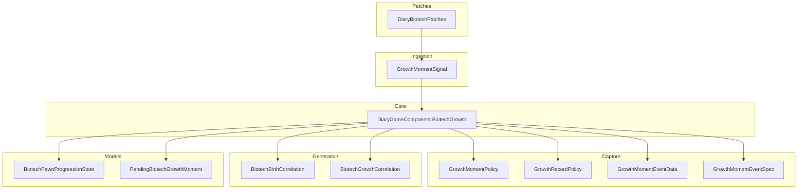
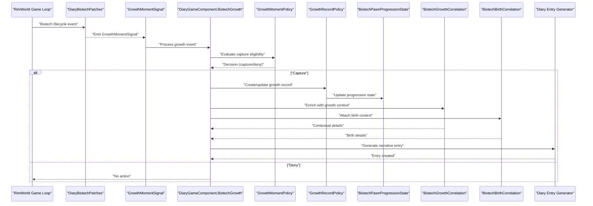
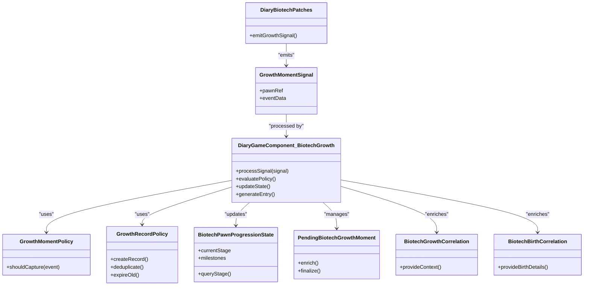

# Growth Moment & Development Tracking

## Table of Contents
1. [Introduction](#introduction)
2. [Project Structure](#project-structure)
3. [Core Components](#core-components)
4. [Architecture Overview](#architecture-overview)
5. [Detailed Component Analysis](#detailed-component-analysis)
6. [Dependency Analysis](#dependency-analysis)
7. [Performance Considerations](#performance-considerations)
8. [Troubleshooting Guide](#troubleshooting-guide)
9. [Conclusion](#conclusion)
10. [Appendices](#appendices)

## Introduction
This document explains the Growth Moment and Development Tracking system used to capture developmental milestones, track pawn progression through life stages, manage growth records, and generate narrative entries about character development. It focuses on the Biotech integration for capturing growth events, correlating them with birth and gene-related context, and producing diary entries that reflect a pawn’s maturation and biological changes over time.

The system is built around:
- Policies that decide when and how to record growth moments
- Event data and specs that describe what happened
- A game component that coordinates ingestion and generation
- Correlation utilities that enrich growth narratives with birth and gene context
- Patches that hook into Biotech lifecycle events

## Project Structure
The Growth Moment and Development Tracking system spans several layers:
- Capture layer: policies and event definitions for growth moments
- Ingestion layer: signals that bring raw events into the pipeline
- Core layer: game component orchestrating processing and entry creation
- Generation layer: correlation logic that adds contextual detail
- Patch layer: hooks into Biotech runtime events
- Models: state and pending structures for growth tracking

**Diagram sources**
- [GrowthMomentPolicy.cs](../../../../../Source/Capture/Biotech/GrowthMomentPolicy.cs)
- [GrowthRecordPolicy.cs](../../../../../Source/Capture/Biotech/GrowthRecordPolicy.cs)
- [GrowthMomentEventData.cs](../../../../../Source/Capture/Events/GrowthMomentEventData.cs)
- [GrowthMomentEventSpec.cs](../../../../../Source/Capture/Specs/GrowthMomentEventSpec.cs)
- [GrowthMomentSignal.cs](../../../../../Source/Ingestion/Sources/GrowthMomentSignal.cs)
- [DiaryGameComponent.BiotechGrowth.cs](../../../../../Source/Core/DiaryGameComponent.BiotechGrowth.cs)
- [BiotechBirthCorrelation.cs](../../../../../Source/Generation/BiotechBirthCorrelation.cs)
- [BiotechGrowthCorrelation.cs](../../../../../Source/Generation/BiotechGrowthCorrelation.cs)
- [DiaryBiotechPatches.cs](../../../../../Source/Patches/DiaryBiotechPatches.cs)
- [BiotechPawnProgressionState.cs](../../../../../Source/Models/BiotechPawnProgressionState.cs)
- [PendingBiotechGrowthMoment.cs](../../../../../Source/Models/PendingBiotechGrowthMoment.cs)

**Section sources**
- [GrowthMomentPolicy.cs](../../../../../Source/Capture/Biotech/GrowthMomentPolicy.cs)
- [GrowthRecordPolicy.cs](../../../../../Source/Capture/Biotech/GrowthRecordPolicy.cs)
- [GrowthMomentEventData.cs](../../../../../Source/Capture/Events/GrowthMomentEventData.cs)
- [GrowthMomentEventSpec.cs](../../../../../Source/Capture/Specs/GrowthMomentEventSpec.cs)
- [GrowthMomentSignal.cs](../../../../../Source/Ingestion/Sources/GrowthMomentSignal.cs)
- [DiaryGameComponent.BiotechGrowth.cs](../../../../../Source/Core/DiaryGameComponent.BiotechGrowth.cs)
- [BiotechBirthCorrelation.cs](../../../../../Source/Generation/BiotechBirthCorrelation.cs)
- [BiotechGrowthCorrelation.cs](../../../../../Source/Generation/BiotechGrowthCorrelation.cs)
- [DiaryBiotechPatches.cs](../../../../../Source/Patches/DiaryBiotechPatches.cs)
- [BiotechPawnProgressionState.cs](../../../../../Source/Models/BiotechPawnProgressionState.cs)
- [PendingBiotechGrowthMoment.cs](../../../../../Source/Models/PendingBiotechGrowthMoment.cs)

## Core Components
- GrowthMomentPolicy: Determines whether a growth moment should be captured based on current conditions and thresholds. It encapsulates decision logic for sensitivity and eligibility.
- GrowthRecordPolicy: Manages persistence and lifecycle of growth records, including deduplication and aging out old records.
- BiotechPawnProgressionState: Tracks per-pawn progression state relevant to growth, such as age bands, stage transitions, and milestone flags.
- PendingBiotechGrowthMoment: Represents a deferred growth event awaiting validation or enrichment before finalization.
- DiaryGameComponent.BiotechGrowth: Orchestrates ingestion, policy evaluation, correlation, and diary entry generation for growth moments.
- GrowthMomentSignal: The ingestion signal carrying raw growth event data from patches.
- GrowthMomentEventData and GrowthMomentEventSpec: Data contracts describing the event payload and its schema.
- BiotechBirthCorrelation and BiotechGrowthCorrelation: Provide contextual details (birth info, gene traits) to enhance narrative richness.
- DiaryBiotechPatches: Hooks into Biotech lifecycle events to emit GrowthMomentSignal instances.

Key responsibilities:
- Capture: Decide if a growth moment qualifies for recording
- Track: Maintain progression state and pending items
- Enrich: Attach birth/gene context
- Generate: Produce diary entries reflecting developmental milestones

**Section sources**
- [GrowthMomentPolicy.cs](../../../../../Source/Capture/Biotech/GrowthMomentPolicy.cs)
- [GrowthRecordPolicy.cs](../../../../../Source/Capture/Biotech/GrowthRecordPolicy.cs)
- [BiotechPawnProgressionState.cs](../../../../../Source/Models/BiotechPawnProgressionState.cs)
- [PendingBiotechGrowthMoment.cs](../../../../../Source/Models/PendingBiotechGrowthMoment.cs)
- [DiaryGameComponent.BiotechGrowth.cs](../../../../../Source/Core/DiaryGameComponent.BiotechGrowth.cs)
- [GrowthMomentSignal.cs](../../../../../Source/Ingestion/Sources/GrowthMomentSignal.cs)
- [GrowthMomentEventData.cs](../../../../../Source/Capture/Events/GrowthMomentEventData.cs)
- [GrowthMomentEventSpec.cs](../../../../../Source/Capture/Specs/GrowthMomentEventSpec.cs)
- [BiotechBirthCorrelation.cs](../../../../../Source/Generation/BiotechBirthCorrelation.cs)
- [BiotechGrowthCorrelation.cs](../../../../../Source/Generation/BiotechGrowthCorrelation.cs)
- [DiaryBiotechPatches.cs](../../../../../Source/Patches/DiaryBiotechPatches.cs)

## Architecture Overview
The growth tracking flow begins with Biotech lifecycle hooks emitting signals, which are processed by the core game component. Policies evaluate eligibility, correlation enriches context, and diary entries are generated.

**Diagram sources**
- [DiaryBiotechPatches.cs](../../../../../Source/Patches/DiaryBiotechPatches.cs)
- [GrowthMomentSignal.cs](../../../../../Source/Ingestion/Sources/GrowthMomentSignal.cs)
- [DiaryGameComponent.BiotechGrowth.cs](../../../../../Source/Core/DiaryGameComponent.BiotechGrowth.cs)
- [GrowthMomentPolicy.cs](../../../../../Source/Capture/Biotech/GrowthMomentPolicy.cs)
- [GrowthRecordPolicy.cs](../../../../../Source/Capture/Biotech/GrowthRecordPolicy.cs)
- [BiotechPawnProgressionState.cs](../../../../../Source/Models/BiotechPawnProgressionState.cs)
- [BiotechGrowthCorrelation.cs](../../../../../Source/Generation/BiotechGrowthCorrelation.cs)
- [BiotechBirthCorrelation.cs](../../../../../Source/Generation/BiotechBirthCorrelation.cs)

## Detailed Component Analysis

### GrowthMomentPolicy
Purpose:
- Evaluates whether a growth moment should be recorded based on sensitivity settings, pawn age/stage, and event type.
- Applies thresholds and filters to avoid noise while ensuring meaningful milestones are captured.

Key behaviors:
- Sensitivity-based gating: Adjusts likelihood of capture via configurable parameters.
- Stage-aware decisions: Considers current life stage and prior milestones to prevent duplicates.
- Type-specific rules: Differentiates between physical, mental, and social growth types.

Configuration influences:
- Growth sensitivity controls impact decision thresholds.
- Growth type modifiers adjust capture probability.

**Section sources**
- [GrowthMomentPolicy.cs](../../../../../Source/Capture/Biotech/GrowthMomentPolicy.cs)
- [DiaryBiotechPolicyDefs.xml](../../../../../1.6/Defs/DiaryBiotechPolicyDefs.xml)

### GrowthRecordPolicy
Purpose:
- Manages the lifecycle of growth records, including creation, updates, deduplication, and expiration.
- Ensures only significant growth events persist and contribute to narrative continuity.

Key behaviors:
- Deduplication: Prevents multiple entries for the same milestone within a timeframe.
- Aging: Gradually reduces prominence of older records.
- State synchronization: Keeps BiotechPawnProgressionState consistent with recorded milestones.

**Section sources**
- [GrowthRecordPolicy.cs](../../../../../Source/Capture/Biotech/GrowthRecordPolicy.cs)
- [BiotechPawnProgressionState.cs](../../../../../Source/Models/BiotechPawnProgressionState.cs)

### BiotechPawnProgressionState
Purpose:
- Holds per-pawn progression information relevant to growth, such as current stage, recent milestones, and counters.
- Provides queryable state for policies and correlation logic.

Key fields and methods:
- Current stage indicators
- Milestone history
- Transition timestamps
- Query helpers for stage checks

**Section sources**
- [BiotechPawnProgressionState.cs](../../../../../Source/Models/BiotechPawnProgressionState.cs)

### PendingBiotechGrowthMoment
Purpose:
- Represents a growth event that has been detected but not yet finalized.
- Allows enrichment and validation before committing to persistent records.

Lifecycle:
- Creation upon initial detection
- Enrichment with context (growth/birth)
- Finalization or discard based on policy decisions

**Section sources**
- [PendingBiotechGrowthMoment.cs](../../../../../Source/Models/PendingBiotechGrowthMoment.cs)

### DiaryGameComponent.BiotechGrowth
Purpose:
- Central coordinator for growth moment processing.
- Bridges ingestion signals, policy evaluation, correlation, and diary generation.

Workflow highlights:
- Receives GrowthMomentSignal
- Invokes GrowthMomentPolicy for capture decision
- Uses GrowthRecordPolicy to manage records
- Updates BiotechPawnProgressionState
- Calls correlation services for context
- Generates diary entries

**Section sources**
- [DiaryGameComponent.BiotechGrowth.cs](../../../../../Source/Core/DiaryGameComponent.BiotechGrowth.cs)
- [GrowthMomentSignal.cs](../../../../../Source/Ingestion/Sources/GrowthMomentSignal.cs)
- [GrowthMomentEventData.cs](../../../../../Source/Capture/Events/GrowthMomentEventData.cs)
- [GrowthMomentEventSpec.cs](../../../../../Source/Capture/Specs/GrowthMomentEventSpec.cs)
- [BiotechGrowthCorrelation.cs](../../../../../Source/Generation/BiotechGrowthCorrelation.cs)
- [BiotechBirthCorrelation.cs](../../../../../Source/Generation/BiotechBirthCorrelation.cs)

### GrowthMomentSignal, GrowthMomentEventData, GrowthMomentEventSpec
Purpose:
- Define the ingestion contract and data schema for growth events.
- Ensure consistent payloads across patches and processing components.

Responsibilities:
- Signal carries event metadata and target pawn reference
- EventData holds structured payload
- EventSpec defines validation and transformation rules

**Section sources**
- [GrowthMomentSignal.cs](../../../../../Source/Ingestion/Sources/GrowthMomentSignal.cs)
- [GrowthMomentEventData.cs](../../../../../Source/Capture/Events/GrowthMomentEventData.cs)
- [GrowthMomentEventSpec.cs](../../../../../Source/Capture/Specs/GrowthMomentEventSpec.cs)

### BiotechBirthCorrelation and BiotechGrowthCorrelation
Purpose:
- Enrich growth narratives with birth and gene-related context.
- Provide additional details like genetic traits, family background, and mutation history.

Outputs:
- Context lines for prompt assembly
- Fact references for narrative continuity

**Section sources**
- [BiotechBirthCorrelation.cs](../../../../../Source/Generation/BiotechBirthCorrelation.cs)
- [BiotechGrowthCorrelation.cs](../../../../../Source/Generation/BiotechGrowthCorrelation.cs)

### DiaryBiotechPatches
Purpose:
- Hook into Biotech lifecycle events to detect growth opportunities.
- Emit GrowthMomentSignal instances when appropriate triggers occur.

Integration points:
- Age advancement
- Gene expression changes
- Life stage transitions

**Section sources**
- [DiaryBiotechPatches.cs](../../../../../Source/Patches/DiaryBiotechPatches.cs)

## Dependency Analysis
The growth tracking system exhibits clear separation of concerns:
- Patches depend on Biotech runtime APIs and emit signals
- Core depends on policies, models, and correlation services
- Policies depend on configuration and state
- Correlation depends on birth and growth context providers

**Diagram sources**
- [DiaryBiotechPatches.cs](../../../../../Source/Patches/DiaryBiotechPatches.cs)
- [GrowthMomentSignal.cs](../../../../../Source/Ingestion/Sources/GrowthMomentSignal.cs)
- [DiaryGameComponent.BiotechGrowth.cs](../../../../../Source/Core/DiaryGameComponent.BiotechGrowth.cs)
- [GrowthMomentPolicy.cs](../../../../../Source/Capture/Biotech/GrowthMomentPolicy.cs)
- [GrowthRecordPolicy.cs](../../../../../Source/Capture/Biotech/GrowthRecordPolicy.cs)
- [BiotechPawnProgressionState.cs](../../../../../Source/Models/BiotechPawnProgressionState.cs)
- [PendingBiotechGrowthMoment.cs](../../../../../Source/Models/PendingBiotechGrowthMoment.cs)
- [BiotechGrowthCorrelation.cs](../../../../../Source/Generation/BiotechGrowthCorrelation.cs)
- [BiotechBirthCorrelation.cs](../../../../../Source/Generation/BiotechBirthCorrelation.cs)

**Section sources**
- [DiaryBiotechPatches.cs](../../../../../Source/Patches/DiaryBiotechPatches.cs)
- [GrowthMomentSignal.cs](../../../../../Source/Ingestion/Sources/GrowthMomentSignal.cs)
- [DiaryGameComponent.BiotechGrowth.cs](../../../../../Source/Core/DiaryGameComponent.BiotechGrowth.cs)
- [GrowthMomentPolicy.cs](../../../../../Source/Capture/Biotech/GrowthMomentPolicy.cs)
- [GrowthRecordPolicy.cs](../../../../../Source/Capture/Biotech/GrowthRecordPolicy.cs)
- [BiotechPawnProgressionState.cs](../../../../../Source/Models/BiotechPawnProgressionState.cs)
- [PendingBiotechGrowthMoment.cs](../../../../../Source/Models/PendingBiotechGrowthMoment.cs)
- [BiotechGrowthCorrelation.cs](../../../../../Source/Generation/BiotechGrowthCorrelation.cs)
- [BiotechBirthCorrelation.cs](../../../../../Source/Generation/BiotechBirthCorrelation.cs)

## Performance Considerations
- Avoid excessive polling: Rely on patch-driven signals rather than frequent scans.
- Deduplicate aggressively: Prevent redundant diary entries and state churn.
- Batch updates: Coalesce multiple growth events within short windows.
- Limit correlation scope: Only compute necessary context to reduce overhead.
- Use efficient state queries: Cache frequently accessed progression state.

[No sources needed since this section provides general guidance]

## Troubleshooting Guide
Common issues and resolutions:
- No growth entries appearing:
  - Verify patches are active and emitting signals
  - Check policy sensitivity settings; increase if too restrictive
  - Confirm pawn meets stage requirements
- Duplicate entries:
  - Review deduplication window in GrowthRecordPolicy
  - Ensure milestone identifiers are unique
- Missing context in entries:
  - Validate birth correlation availability
  - Check gene trait presence for growth correlation
- State inconsistencies:
  - Rebuild progression state from records
  - Clear pending growth moments if stuck

Diagnostic steps:
- Inspect signal emission logs
- Review policy decision outcomes
- Examine progression state snapshots
- Validate event spec compliance

**Section sources**
- [DiaryBiotechPatches.cs](../../../../../Source/Patches/DiaryBiotechPatches.cs)
- [GrowthMomentPolicy.cs](../../../../../Source/Capture/Biotech/GrowthMomentPolicy.cs)
- [GrowthRecordPolicy.cs](../../../../../Source/Capture/Biotech/GrowthRecordPolicy.cs)
- [BiotechPawnProgressionState.cs](../../../../../Source/Models/BiotechPawnProgressionState.cs)
- [GrowthMomentSignal.cs](../../../../../Source/Ingestion/Sources/GrowthMomentSignal.cs)

## Conclusion
The Growth Moment and Development Tracking system provides a robust framework for capturing and narrating pawn development in Biotech-enabled games. Through well-defined policies, state management, and correlation services, it ensures meaningful milestones are recorded and presented as rich diary entries. Proper configuration and troubleshooting can address common issues and optimize performance.

[No sources needed since this section summarizes without analyzing specific files]

## Appendices

### Example Growth Milestone Diary Entries
- Physical growth: “Your pawn’s body matured, gaining strength and resilience.”
- Mental growth: “A new perspective emerged, sharpening their resolve.”
- Social growth: “Interactions deepened, forging stronger bonds within the colony.”

These examples illustrate the narrative style produced by the system. Actual content varies based on context and configuration.

[No sources needed since this section provides conceptual examples]

### Configuration Options for Growth Sensitivity
- Growth sensitivity multiplier: Adjusts capture probability
- Stage thresholds: Define minimum ages for different growth types
- Deduplication window: Timeframe to prevent duplicate entries
- Growth type weights: Modify emphasis on physical, mental, or social growth

Refer to policy definitions for exact keys and defaults.

**Section sources**
- [DiaryBiotechPolicyDefs.xml](../../../../../1.6/Defs/DiaryBiotechPolicyDefs.xml)

### Handling Different Growth Types
- Physical growth: Focuses on bodily changes and capabilities
- Mental growth: Emphasizes cognitive and emotional development
- Social growth: Highlights interpersonal relationships and roles

Each type may have distinct thresholds and narrative templates.

**Section sources**
- [GrowthMomentPolicy.cs](../../../../../Source/Capture/Biotech/GrowthMomentPolicy.cs)
- [GrowthMomentEventData.cs](../../../../../Source/Capture/Events/GrowthMomentEventData.cs)
