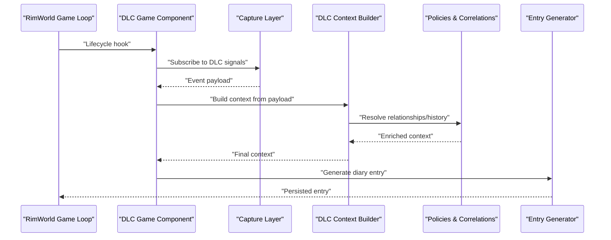
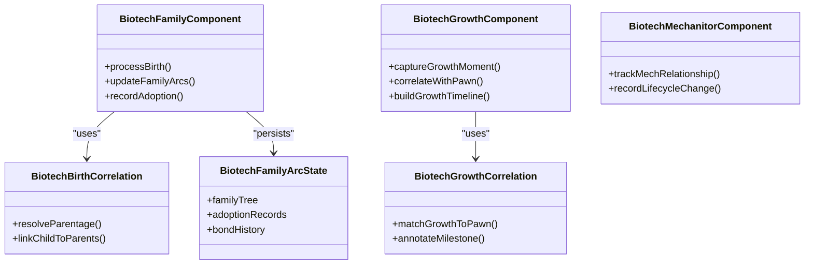
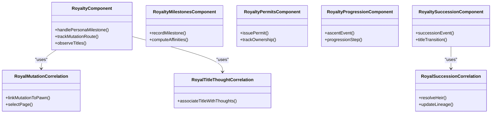
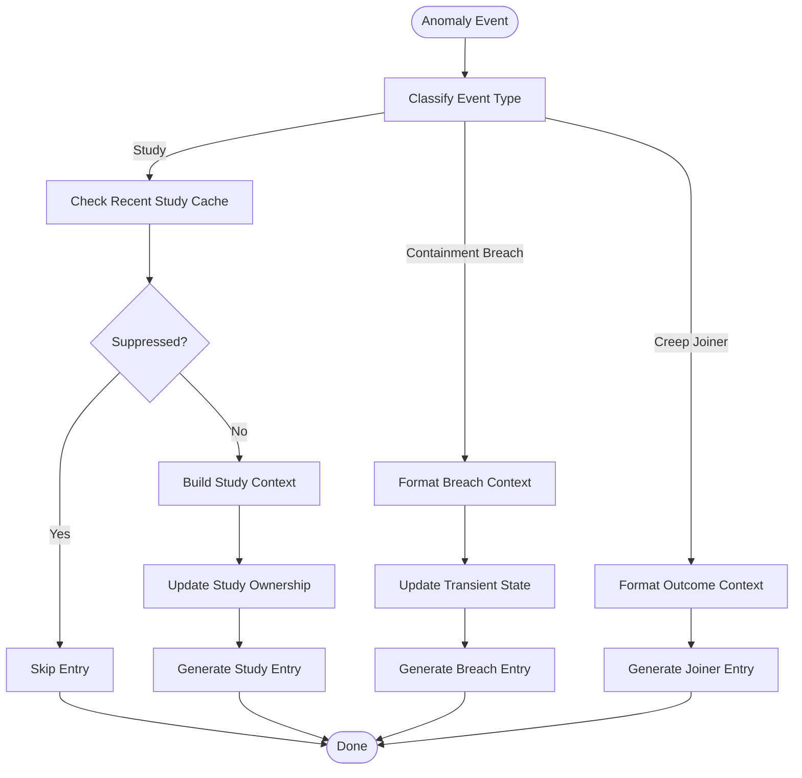
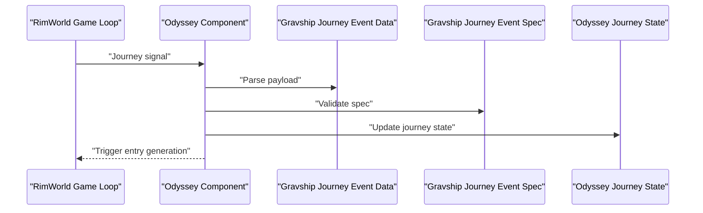
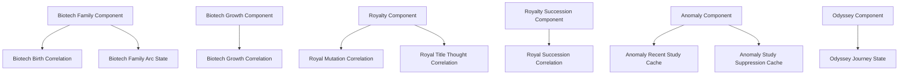

# DLC Integrations

<cite>
**Referenced Files in This Document**
- [DlcContext.cs](../../../../Source/Generation/DlcContext.cs)
- [DlcContext.Anomaly.cs](../../../../Source/Generation/DlcContext.Anomaly.cs)
- [DlcContext.Royalty.cs](../../../../Source/Generation/DlcContext.Royalty.cs)
- [DlcContext.Odyssey.cs](../../../../Source/Generation/DlcContext.Odyssey.cs)
- [DiaryGameComponent.BiotechFamily.cs](../../../../Source/Core/DiaryGameComponent.BiotechFamily.cs)
- [DiaryGameComponent.BiotechGrowth.cs](../../../../Source/Core/DiaryGameComponent.BiotechGrowth.cs)
- [DiaryGameComponent.BiotechMechanitor.cs](../../../../Source/Core/DiaryGameComponent.BiotechMechanitor.cs)
- [DiaryGameComponent.Royalty.cs](../../../../Source/Core/DiaryGameComponent.Royalty.cs)
- [DiaryGameComponent.RoyaltyMilestones.cs](../../../../Source/Core/DiaryGameComponent.RoyaltyMilestones.cs)
- [DiaryGameComponent.RoyaltyPermits.cs](../../../../Source/Core/DiaryGameComponent.RoyaltyPermits.cs)
- [DiaryGameComponent.RoyaltyProgression.cs](../../../../Source/Core/DiaryGameComponent.RoyaltyProgression.cs)
- [DiaryGameComponent.RoyaltySuccession.cs](../../../../Source/Core/DiaryGameComponent.RoyaltySuccession.cs)
- [DiaryGameComponent.Anomaly.cs](../../../../Source/Core/DiaryGameComponent.Anomaly.cs)
- [DiaryGameComponent.Odyssey.cs](../../../../Source/Core/DiaryGameComponent.Odyssey.cs)
- [BiotechContracts.cs](../../../../Source/Capture/Biotech/BiotechContracts.cs)
- [GeneIdentityContracts.cs](../../../../Source/Capture/Biotech/GeneIdentityContracts.cs)
- [AnomalyContracts.cs](../../../../Source/Capture/Policies/AnomalyContracts.cs)
- [GravshipJourneyEventData.cs](../../../../Source/Capture/Events/GravshipJourneyEventData.cs)
- [GravshipJourneyEventSpec.cs](../../../../Source/Capture/Specs/GravshipJourneyEventSpec.cs)
- [DiaryBiotechPolicyDefs.xml](../../../../1.6/Defs/DiaryBiotechPolicyDefs.xml)
- [DiaryRoyaltyPolicyDefs.xml](../../../../1.6/Defs/DiaryRoyaltyPolicyDefs.xml)
- [DiaryAnomalyPolicyDefs.xml](../../../../1.6/Defs/DiaryAnomalyPolicyDefs.xml)
- [DiaryOdysseyPolicyDefs.xml](../../../../1.6/Defs/DiaryOdysseyPolicyDefs.xml)
- [BiotechBirthCorrelation.cs](../../../../Source/Generation/BiotechBirthCorrelation.cs)
- [BiotechGrowthCorrelation.cs](../../../../Source/Generation/BiotechGrowthCorrelation.cs)
- [RoyalMutationCorrelation.cs](../../../../Source/Generation/RoyalMutationCorrelation.cs)
- [RoyalSuccessionCorrelation.cs](../../../../Source/Generation/RoyalSuccessionCorrelation.cs)
- [RoyalTitleThoughtCorrelation.cs](../../../../Source/Generation/RoyalTitleThoughtCorrelation.cs)
- [AnomalyRecentStudyCache.cs](../../../../Source/Generation/AnomalyRecentStudyCache.cs)
- [AnomalyStudySuppressionCache.cs](../../../../Source/Generation/AnomalyStudySuppressionCache.cs)
- [AnomalyTransientState.cs](../../../../Source/Generation/AnomalyTransientState.cs)
- [BiotechFamilyArcState.cs](../../../../Source/Models/BiotechFamilyArcState.cs)
- [OdysseyJourneyState.cs](../../../../Source/Models/OdysseyJourneyState.cs)
- [DiaryGameComponent.Dispatch.cs](../../../../Source/Core/DiaryGameComponent.Dispatch.cs)
- [DiaryGameComponent.EventFactory.cs](../../../../Source/Core/DiaryGameComponent.EventFactory.cs)
- [DiaryGameComponent.IntegrationSnapshots.cs](../../../../Source/Core/DiaryGameComponent.IntegrationSnapshots.cs)
</cite>

## Table of Contents
1. [Introduction](#introduction)
2. [Project Structure](#project-structure)
3. [Core Components](#core-components)
4. [Architecture Overview](#architecture-overview)
5. [Detailed Component Analysis](#detailed-component-analysis)
6. [Dependency Analysis](#dependency-analysis)
7. [Performance Considerations](#performance-considerations)
8. [Troubleshooting Guide](#troubleshooting-guide)
9. [Conclusion](#conclusion)
10. [Appendices](#appendices)

## Introduction
This document explains how the mod integrates with four major DLCs: Biotech, Royalty, Anomaly, and Odyssey. It covers how DLC-specific events are captured, contextualized, and turned into diary entries. It also documents unique features such as family arcs (Biotech), royal personas and succession (Royalty), anomaly studies and containment (Anomaly), and journey tracking (Odyssey). Configuration options per DLC and troubleshooting guidance are included.

## Project Structure
The DLC integrations are organized across several layers:
- Capture layer: contracts, event data, and specs for each DLC domain
- Core game components: lifecycle hooks and orchestration for each DLC
- Generation context: shared and DLC-specific context builders
- Policies and correlations: rules that enrich context and drive narrative continuity
- Models: persistent state for arcs, journeys, and transient runtime caches
- Defs: policy definitions and tuning XML files per DLC

```mermaid
graph TB
subgraph "Capture"
C1["Biotech Contracts"]
C2["Anomaly Contracts"]
C3["Gravship Journey Event Data"]
C4["Gravship Journey Event Spec"]
end
subgraph "Core Components"
K1["Biotech Family Component"]
K2["Biotech Growth Component"]
K3["Biotech Mechanitor Component"]
K4["Royalty Component"]
K5["Royalty Milestones Component"]
K6["Royalty Permits Component"]
K7["Royalty Progression Component"]
K8["Royalty Succession Component"]
K9["Anomaly Component"]
K10["Odyssey Component"]
end
subgraph "Generation Context"
G1["DLC Context Base"]
G2["DLC Context - Anomaly"]
G3["DLC Context - Royalty"]
G4["DLC Context - Odyssey"]
end
subgraph "Policies & Correlations"
P1["Biotech Birth Correlation"]
P2["Biotech Growth Correlation"]
P3["Royal Mutation Correlation"]
P4["Royal Succession Correlation"]
P5["Royal Title Thought Correlation"]
P6["Anomaly Recent Study Cache"]
P7["Anomaly Study Suppression Cache"]
P8["Anomaly Transient State"]
end
subgraph "Models"
M1["Biotech Family Arc State"]
M2["Odyssey Journey State"]
end
subgraph "Defs"
D1["Biotech Policy Defs"]
D2["Royalty Policy Defs"]
D3["Anomaly Policy Defs"]
D4["Odyssey Policy Defs"]
end
C1 --> K1
C1 --> K2
C2 --> K9
C3 --> K10
C4 --> K10
K1 --> G1
K2 --> G1
K9 --> G1
K10 --> G1
G1 --> G2
G1 --> G3
G1 --> G4
P1 --> K1
P2 --> K2
P3 --> K4
P4 --> K8
P5 --> K4
P6 --> K9
P7 --> K9
P8 --> K9
M1 --> K1
M2 --> K10
D1 --> K1
D1 --> K2
D2 --> K4
D2 --> K5
D2 --> K6
D2 --> K7
D2 --> K8
D3 --> K9
D4 --> K10
```

**Diagram sources**
- [DlcContext.cs](../../../../Source/Generation/DlcContext.cs)
- [DlcContext.Anomaly.cs](../../../../Source/Generation/DlcContext.Anomaly.cs)
- [DlcContext.Royalty.cs](../../../../Source/Generation/DlcContext.Royalty.cs)
- [DlcContext.Odyssey.cs](../../../../Source/Generation/DlcContext.Odyssey.cs)
- [DiaryGameComponent.BiotechFamily.cs](../../../../Source/Core/DiaryGameComponent.BiotechFamily.cs)
- [DiaryGameComponent.BiotechGrowth.cs](../../../../Source/Core/DiaryGameComponent.BiotechGrowth.cs)
- [DiaryGameComponent.BiotechMechanitor.cs](../../../../Source/Core/DiaryGameComponent.BiotechMechanitor.cs)
- [DiaryGameComponent.Royalty.cs](../../../../Source/Core/DiaryGameComponent.Royalty.cs)
- [DiaryGameComponent.RoyaltyMilestones.cs](../../../../Source/Core/DiaryGameComponent.RoyaltyMilestones.cs)
- [DiaryGameComponent.RoyaltyPermits.cs](../../../../Source/Core/DiaryGameComponent.RoyaltyPermits.cs)
- [DiaryGameComponent.RoyaltyProgression.cs](../../../../Source/Core/DiaryGameComponent.RoyaltyProgression.cs)
- [DiaryGameComponent.RoyaltySuccession.cs](../../../../Source/Core/DiaryGameComponent.RoyaltySuccession.cs)
- [DiaryGameComponent.Anomaly.cs](../../../../Source/Core/DiaryGameComponent.Anomaly.cs)
- [DiaryGameComponent.Odyssey.cs](../../../../Source/Core/DiaryGameComponent.Odyssey.cs)
- [BiotechBirthCorrelation.cs](../../../../Source/Generation/BiotechBirthCorrelation.cs)
- [BiotechGrowthCorrelation.cs](../../../../Source/Generation/BiotechGrowthCorrelation.cs)
- [RoyalMutationCorrelation.cs](../../../../Source/Generation/RoyalMutationCorrelation.cs)
- [RoyalSuccessionCorrelation.cs](../../../../Source/Generation/RoyalSuccessionCorrelation.cs)
- [RoyalTitleThoughtCorrelation.cs](../../../../Source/Generation/RoyalTitleThoughtCorrelation.cs)
- [AnomalyRecentStudyCache.cs](../../../../Source/Generation/AnomalyRecentStudyCache.cs)
- [AnomalyStudySuppressionCache.cs](../../../../Source/Generation/AnomalyStudySuppressionCache.cs)
- [AnomalyTransientState.cs](../../../../Source/Generation/AnomalyTransientState.cs)
- [BiotechFamilyArcState.cs](../../../../Source/Models/BiotechFamilyArcState.cs)
- [OdysseyJourneyState.cs](../../../../Source/Models/OdysseyJourneyState.cs)
- [DiaryBiotechPolicyDefs.xml](../../../../1.6/Defs/DiaryBiotechPolicyDefs.xml)
- [DiaryRoyaltyPolicyDefs.xml](../../../../1.6/Defs/DiaryRoyaltyPolicyDefs.xml)
- [DiaryAnomalyPolicyDefs.xml](../../../../1.6/Defs/DiaryAnomalyPolicyDefs.xml)
- [DiaryOdysseyPolicyDefs.xml](../../../../1.6/Defs/DiaryOdysseyPolicyDefs.xml)

**Section sources**
- [DlcContext.cs](../../../../Source/Generation/DlcContext.cs)
- [DlcContext.Anomaly.cs](../../../../Source/Generation/DlcContext.Anomaly.cs)
- [DlcContext.Royalty.cs](../../../../Source/Generation/DlcContext.Royalty.cs)
- [DlcContext.Odyssey.cs](../../../../Source/Generation/DlcContext.Odyssey.cs)
- [DiaryGameComponent.BiotechFamily.cs](../../../../Source/Core/DiaryGameComponent.BiotechFamily.cs)
- [DiaryGameComponent.BiotechGrowth.cs](../../../../Source/Core/DiaryGameComponent.BiotechGrowth.cs)
- [DiaryGameComponent.BiotechMechanitor.cs](../../../../Source/Core/DiaryGameComponent.BiotechMechanitor.cs)
- [DiaryGameComponent.Royalty.cs](../../../../Source/Core/DiaryGameComponent.Royalty.cs)
- [DiaryGameComponent.RoyaltyMilestones.cs](../../../../Source/Core/DiaryGameComponent.RoyaltyMilestones.cs)
- [DiaryGameComponent.RoyaltyPermits.cs](../../../../Source/Core/DiaryGameComponent.RoyaltyPermits.cs)
- [DiaryGameComponent.RoyaltyProgression.cs](../../../../Source/Core/DiaryGameComponent.RoyaltyProgression.cs)
- [DiaryGameComponent.RoyaltySuccession.cs](../../../../Source/Core/DiaryGameComponent.RoyaltySuccession.cs)
- [DiaryGameComponent.Anomaly.cs](../../../../Source/Core/DiaryGameComponent.Anomaly.cs)
- [DiaryGameComponent.Odyssey.cs](../../../../Source/Core/DiaryGameComponent.Odyssey.cs)
- [BiotechBirthCorrelation.cs](../../../../Source/Generation/BiotechBirthCorrelation.cs)
- [BiotechGrowthCorrelation.cs](../../../../Source/Generation/BiotechGrowthCorrelation.cs)
- [RoyalMutationCorrelation.cs](../../../../Source/Generation/RoyalMutationCorrelation.cs)
- [RoyalSuccessionCorrelation.cs](../../../../Source/Generation/RoyalSuccessionCorrelation.cs)
- [RoyalTitleThoughtCorrelation.cs](../../../../Source/Generation/RoyalTitleThoughtCorrelation.cs)
- [AnomalyRecentStudyCache.cs](../../../../Source/Generation/AnomalyRecentStudyCache.cs)
- [AnomalyStudySuppressionCache.cs](../../../../Source/Generation/AnomalyStudySuppressionCache.cs)
- [AnomalyTransientState.cs](../../../../Source/Generation/AnomalyTransientState.cs)
- [BiotechFamilyArcState.cs](../../../../Source/Models/BiotechFamilyArcState.cs)
- [OdysseyJourneyState.cs](../../../../Source/Models/OdysseyJourneyState.cs)
- [DiaryBiotechPolicyDefs.xml](../../../../1.6/Defs/DiaryBiotechPolicyDefs.xml)
- [DiaryRoyaltyPolicyDefs.xml](../../../../1.6/Defs/DiaryRoyaltyPolicyDefs.xml)
- [DiaryAnomalyPolicyDefs.xml](../../../../1.6/Defs/DiaryAnomalyPolicyDefs.xml)
- [DiaryOdysseyPolicyDefs.xml](../../../../1.6/Defs/DiaryOdysseyPolicyDefs.xml)

## Core Components
- Shared DLC context base provides common helpers and accessors used by all expansion contexts.
- Expansion-specific context classes extend the base to expose fields relevant to each DLC’s mechanics.
- Game components implement lifecycle hooks for each DLC, coordinating capture, enrichment, and entry generation.
- Policies and correlations compute relationships (e.g., parent-child, mutation lineage, study ownership) to build rich context.
- Models persist long-lived states like family arcs and journey progress; caches manage short-lived runtime data.

Key responsibilities:
- Biotech: family arcs, birth/growth moments, gene identity transitions, mechanitor lifecycle
- Royalty: persona milestones, mutations, permits, progression, succession
- Anomaly: monolith knowledge, studies, containment breaches, creep joiner outcomes
- Odyssey: gravship landings, journey phases, location changes, writer policies

**Section sources**
- [DlcContext.cs](../../../../Source/Generation/DlcContext.cs)
- [DlcContext.Anomaly.cs](../../../../Source/Generation/DlcContext.Anomaly.cs)
- [DlcContext.Royalty.cs](../../../../Source/Generation/DlcContext.Royalty.cs)
- [DlcContext.Odyssey.cs](../../../../Source/Generation/DlcContext.Odyssey.cs)
- [DiaryGameComponent.BiotechFamily.cs](../../../../Source/Core/DiaryGameComponent.BiotechFamily.cs)
- [DiaryGameComponent.BiotechGrowth.cs](../../../../Source/Core/DiaryGameComponent.BiotechGrowth.cs)
- [DiaryGameComponent.BiotechMechanitor.cs](../../../../Source/Core/DiaryGameComponent.BiotechMechanitor.cs)
- [DiaryGameComponent.Royalty.cs](../../../../Source/Core/DiaryGameComponent.Royalty.cs)
- [DiaryGameComponent.RoyaltyMilestones.cs](../../../../Source/Core/DiaryGameComponent.RoyaltyMilestones.cs)
- [DiaryGameComponent.RoyaltyPermits.cs](../../../../Source/Core/DiaryGameComponent.RoyaltyPermits.cs)
- [DiaryGameComponent.RoyaltyProgression.cs](../../../../Source/Core/DiaryGameComponent.RoyaltyProgression.cs)
- [DiaryGameComponent.RoyaltySuccession.cs](../../../../Source/Core/DiaryGameComponent.RoyaltySuccession.cs)
- [DiaryGameComponent.Anomaly.cs](../../../../Source/Core/DiaryGameComponent.Anomaly.cs)
- [DiaryGameComponent.Odyssey.cs](../../../../Source/Core/DiaryGameComponent.Odyssey.cs)

## Architecture Overview
The system follows a layered pipeline:
- Events are captured via contracts and event data/specs
- Core components coordinate processing and dispatch
- Context is built using shared and DLC-specific builders
- Policies/correlations enrich context with relationships and history
- Entries are generated and persisted

**Diagram sources**
- [DiaryGameComponent.Dispatch.cs](../../../../Source/Core/DiaryGameComponent.Dispatch.cs)
- [DiaryGameComponent.EventFactory.cs](../../../../Source/Core/DiaryGameComponent.EventFactory.cs)
- [DlcContext.cs](../../../../Source/Generation/DlcContext.cs)
- [DlcContext.Anomaly.cs](../../../../Source/Generation/DlcContext.Anomaly.cs)
- [DlcContext.Royalty.cs](../../../../Source/Generation/DlcContext.Royalty.cs)
- [DlcContext.Odyssey.cs](../../../../Source/Generation/DlcContext.Odyssey.cs)

## Detailed Component Analysis

### Biotech Integration
Unique features:
- Family arcs: tracks lineage, births, adoptions, and familial bonds
- Growth moments: captures developmental milestones and growth records
- Gene identity: observes gene-related transitions and salience
- Mechanitor lifecycle: monitors pawn-mech relationship changes

Processing flow:
- Capture contracts define event payloads for births, growth, gene identity, and mechanitor lifecycle
- Correlations link parents/children and associate growth moments with pawns
- Context builder populates family trees, growth timelines, and gene observations
- Policies tune which events produce entries and how often

**Diagram sources**
- [DiaryGameComponent.BiotechFamily.cs](../../../../Source/Core/DiaryGameComponent.BiotechFamily.cs)
- [DiaryGameComponent.BiotechGrowth.cs](../../../../Source/Core/DiaryGameComponent.BiotechGrowth.cs)
- [DiaryGameComponent.BiotechMechanitor.cs](../../../../Source/Core/DiaryGameComponent.BiotechMechanitor.cs)
- [BiotechBirthCorrelation.cs](../../../../Source/Generation/BiotechBirthCorrelation.cs)
- [BiotechGrowthCorrelation.cs](../../../../Source/Generation/BiotechGrowthCorrelation.cs)
- [BiotechFamilyArcState.cs](../../../../Source/Models/BiotechFamilyArcState.cs)

Configuration options:
- Policy definitions control thresholds, frequency, and inclusion criteria for biotech events
- Tuning parameters influence memory retention and narrative emphasis

**Section sources**
- [BiotechContracts.cs](../../../../Source/Capture/Biotech/BiotechContracts.cs)
- [GeneIdentityContracts.cs](../../../../Source/Capture/Biotech/GeneIdentityContracts.cs)
- [BiotechBirthCorrelation.cs](../../../../Source/Generation/BiotechBirthCorrelation.cs)
- [BiotechGrowthCorrelation.cs](../../../../Source/Generation/BiotechGrowthCorrelation.cs)
- [BiotechFamilyArcState.cs](../../../../Source/Models/BiotechFamilyArcState.cs)
- [DiaryBiotechPolicyDefs.xml](../../../../1.6/Defs/DiaryBiotechPolicyDefs.xml)
- [DiaryGameComponent.BiotechFamily.cs](../../../../Source/Core/DiaryGameComponent.BiotechFamily.cs)
- [DiaryGameComponent.BiotechGrowth.cs](../../../../Source/Core/DiaryGameComponent.BiotechGrowth.cs)
- [DiaryGameComponent.BiotechMechanitor.cs](../../../../Source/Core/DiaryGameComponent.BiotechMechanitor.cs)

### Royalty Integration
Unique features:
- Royal personas: milestone tracking, trait affinities, weapon associations
- Mutations: route selection, page selection, ownership correlation
- Permits: permit issuance, ownership, and contextual framing
- Progression and succession: ascent events, title transitions, thought ownership

Processing flow:
- Core components handle persona lifecycle, mutation pages, permit events, and succession
- Correlations connect mutations to pawns, titles to thoughts, and succession to narratives
- Context builder aggregates persona traits, mutation routes, and permit history

**Diagram sources**
- [DiaryGameComponent.Royalty.cs](../../../../Source/Core/DiaryGameComponent.Royalty.cs)
- [DiaryGameComponent.RoyaltyMilestones.cs](../../../../Source/Core/DiaryGameComponent.RoyaltyMilestones.cs)
- [DiaryGameComponent.RoyaltyPermits.cs](../../../../Source/Core/DiaryGameComponent.RoyaltyPermits.cs)
- [DiaryGameComponent.RoyaltyProgression.cs](../../../../Source/Core/DiaryGameComponent.RoyaltyProgression.cs)
- [DiaryGameComponent.RoyaltySuccession.cs](../../../../Source/Core/DiaryGameComponent.RoyaltySuccession.cs)
- [RoyalMutationCorrelation.cs](../../../../Source/Generation/RoyalMutationCorrelation.cs)
- [RoyalSuccessionCorrelation.cs](../../../../Source/Generation/RoyalSuccessionCorrelation.cs)
- [RoyalTitleThoughtCorrelation.cs](../../../../Source/Generation/RoyalTitleThoughtCorrelation.cs)

Configuration options:
- Policy definitions govern persona milestone thresholds, mutation page preferences, permit issuance rules, and succession triggers

**Section sources**
- [DlcContext.Royalty.cs](../../../../Source/Generation/DlcContext.Royalty.cs)
- [RoyalMutationCorrelation.cs](../../../../Source/Generation/RoyalMutationCorrelation.cs)
- [RoyalSuccessionCorrelation.cs](../../../../Source/Generation/RoyalSuccessionCorrelation.cs)
- [RoyalTitleThoughtCorrelation.cs](../../../../Source/Generation/RoyalTitleThoughtCorrelation.cs)
- [DiaryRoyaltyPolicyDefs.xml](../../../../1.6/Defs/DiaryRoyaltyPolicyDefs.xml)
- [DiaryGameComponent.Royalty.cs](../../../../Source/Core/DiaryGameComponent.Royalty.cs)
- [DiaryGameComponent.RoyaltyMilestones.cs](../../../../Source/Core/DiaryGameComponent.RoyaltyMilestones.cs)
- [DiaryGameComponent.RoyaltyPermits.cs](../../../../Source/Core/DiaryGameComponent.RoyaltyPermits.cs)
- [DiaryGameComponent.RoyaltyProgression.cs](../../../../Source/Core/DiaryGameComponent.RoyaltyProgression.cs)
- [DiaryGameComponent.RoyaltySuccession.cs](../../../../Source/Core/DiaryGameComponent.RoyaltySuccession.cs)

### Anomaly Integration
Unique features:
- Monolith knowledge: activation provenance and knowledge accumulation
- Studies: ownership, recent activity, suppression to avoid noise
- Containment breaches: context formatting and outcome handling
- Creep joiner outcomes: contextual framing and ownership

Processing flow:
- Core component coordinates anomaly events and maintains transient state
- Caches track recent studies and suppress repetitive entries
- Context builder formats breach and study details for coherent narrative

**Diagram sources**
- [DiaryGameComponent.Anomaly.cs](../../../../Source/Core/DiaryGameComponent.Anomaly.cs)
- [AnomalyRecentStudyCache.cs](../../../../Source/Generation/AnomalyRecentStudyCache.cs)
- [AnomalyStudySuppressionCache.cs](../../../../Source/Generation/AnomalyStudySuppressionCache.cs)
- [AnomalyTransientState.cs](../../../../Source/Generation/AnomalyTransientState.cs)
- [AnomalyContracts.cs](../../../../Source/Capture/Policies/AnomalyContracts.cs)

Configuration options:
- Policy definitions control suppression windows, study thresholds, and breach severity filters

**Section sources**
- [DlcContext.Anomaly.cs](../../../../Source/Generation/DlcContext.Anomaly.cs)
- [AnomalyRecentStudyCache.cs](../../../../Source/Generation/AnomalyRecentStudyCache.cs)
- [AnomalyStudySuppressionCache.cs](../../../../Source/Generation/AnomalyStudySuppressionCache.cs)
- [AnomalyTransientState.cs](../../../../Source/Generation/AnomalyTransientState.cs)
- [AnomalyContracts.cs](../../../../Source/Capture/Policies/AnomalyContracts.cs)
- [DiaryAnomalyPolicyDefs.xml](../../../../1.6/Defs/DiaryAnomalyPolicyDefs.xml)
- [DiaryGameComponent.Anomaly.cs](../../../../Source/Core/DiaryGameComponent.Anomaly.cs)

### Odyssey Integration
Unique features:
- Gravship journey tracking: landing events, phase transitions, location updates
- Writer policies: tailor prose based on journey stage and destination
- Location policy: contextualize environment and narrative tone

Processing flow:
- Event data and spec define gravship journey payloads
- Core component manages journey lifecycle and persists journey state
- Context builder integrates location and writer policies for cohesive entries

**Diagram sources**
- [DiaryGameComponent.Odyssey.cs](../../../../Source/Core/DiaryGameComponent.Odyssey.cs)
- [GravshipJourneyEventData.cs](../../../../Source/Capture/Events/GravshipJourneyEventData.cs)
- [GravshipJourneyEventSpec.cs](../../../../Source/Capture/Specs/GravshipJourneyEventSpec.cs)
- [OdysseyJourneyState.cs](../../../../Source/Models/OdysseyJourneyState.cs)

Configuration options:
- Policy definitions adjust journey phase thresholds, landing criteria, and writer style overrides

**Section sources**
- [DlcContext.Odyssey.cs](../../../../Source/Generation/DlcContext.Odyssey.cs)
- [GravshipJourneyEventData.cs](../../../../Source/Capture/Events/GravshipJourneyEventData.cs)
- [GravshipJourneyEventSpec.cs](../../../../Source/Capture/Specs/GravshipJourneyEventSpec.cs)
- [OdysseyJourneyState.cs](../../../../Source/Models/OdysseyJourneyState.cs)
- [DiaryOdysseyPolicyDefs.xml](../../../../1.6/Defs/DiaryOdysseyPolicyDefs.xml)
- [DiaryGameComponent.Odyssey.cs](../../../../Source/Core/DiaryGameComponent.Odyssey.cs)

## Dependency Analysis
Inter-component dependencies:
- Core components depend on capture contracts and event specs to receive structured inputs
- Context builders rely on correlations to resolve relationships and enrich context
- Policies and caches provide filtering and deduplication to maintain narrative quality
- Models persist long-term state; caches manage short-term runtime behavior

**Diagram sources**
- [DiaryGameComponent.BiotechFamily.cs](../../../../Source/Core/DiaryGameComponent.BiotechFamily.cs)
- [BiotechBirthCorrelation.cs](../../../../Source/Generation/BiotechBirthCorrelation.cs)
- [BiotechFamilyArcState.cs](../../../../Source/Models/BiotechFamilyArcState.cs)
- [DiaryGameComponent.BiotechGrowth.cs](../../../../Source/Core/DiaryGameComponent.BiotechGrowth.cs)
- [BiotechGrowthCorrelation.cs](../../../../Source/Generation/BiotechGrowthCorrelation.cs)
- [DiaryGameComponent.Royalty.cs](../../../../Source/Core/DiaryGameComponent.Royalty.cs)
- [RoyalMutationCorrelation.cs](../../../../Source/Generation/RoyalMutationCorrelation.cs)
- [RoyalTitleThoughtCorrelation.cs](../../../../Source/Generation/RoyalTitleThoughtCorrelation.cs)
- [DiaryGameComponent.RoyaltySuccession.cs](../../../../Source/Core/DiaryGameComponent.RoyaltySuccession.cs)
- [RoyalSuccessionCorrelation.cs](../../../../Source/Generation/RoyalSuccessionCorrelation.cs)
- [DiaryGameComponent.Anomaly.cs](../../../../Source/Core/DiaryGameComponent.Anomaly.cs)
- [AnomalyRecentStudyCache.cs](../../../../Source/Generation/AnomalyRecentStudyCache.cs)
- [AnomalyStudySuppressionCache.cs](../../../../Source/Generation/AnomalyStudySuppressionCache.cs)
- [DiaryGameComponent.Odyssey.cs](../../../../Source/Core/DiaryGameComponent.Odyssey.cs)
- [OdysseyJourneyState.cs](../../../../Source/Models/OdysseyJourneyState.cs)

**Section sources**
- [DiaryGameComponent.IntegrationSnapshots.cs](../../../../Source/Core/DiaryGameComponent.IntegrationSnapshots.cs)
- [DlcContext.cs](../../../../Source/Generation/DlcContext.cs)

## Performance Considerations
- Use suppression caches for high-frequency events (e.g., anomaly studies) to reduce entry churn
- Limit correlation computations to necessary scopes (e.g., only active pawns or recent families)
- Batch event processing where possible to minimize overhead during peak gameplay moments
- Tune policy thresholds to balance narrative richness with performance constraints

[No sources needed since this section provides general guidance]

## Troubleshooting Guide
Common issues and resolutions:
- Missing entries for expected DLC events: verify policy definitions and thresholds; ensure capture contracts are enabled
- Duplicate or noisy entries: check suppression caches and recent study windows; adjust suppression durations
- Incorrect relationships (e.g., parentage): review correlation logic and ensure birth/adoption events are captured
- Odyssey journey not updating: confirm gravship journey event data/spec parsing and state persistence
- Royalty persona milestones not triggering: validate milestone thresholds and affinity calculations

Diagnostic aids:
- Integration snapshots can help inspect current state and identify missing context
- Dispatch and event factory logs reveal whether events are being routed correctly

**Section sources**
- [DiaryGameComponent.IntegrationSnapshots.cs](../../../../Source/Core/DiaryGameComponent.IntegrationSnapshots.cs)
- [DiaryGameComponent.Dispatch.cs](../../../../Source/Core/DiaryGameComponent.Dispatch.cs)
- [DiaryGameComponent.EventFactory.cs](../../../../Source/Core/DiaryGameComponent.EventFactory.cs)
- [DiaryAnomalyPolicyDefs.xml](../../../../1.6/Defs/DiaryAnomalyPolicyDefs.xml)
- [DiaryBiotechPolicyDefs.xml](../../../../1.6/Defs/DiaryBiotechPolicyDefs.xml)
- [DiaryRoyaltyPolicyDefs.xml](../../../../1.6/Defs/DiaryRoyaltyPolicyDefs.xml)
- [DiaryOdysseyPolicyDefs.xml](../../../../1.6/Defs/DiaryOdysseyPolicyDefs.xml)

## Conclusion
The DLC integration architecture cleanly separates capture, context building, policy-driven enrichment, and entry generation. Each expansion contributes specialized components and policies while sharing a common foundation. Proper configuration and attention to caching and correlation logic ensure high-quality, performant diary entries tailored to each DLC’s unique mechanics.

[No sources needed since this section summarizes without analyzing specific files]

## Appendices
- For detailed policy keys and tuning parameters, consult the respective policy definition files under the 1.6/Defs directory for each DLC.
- For API surface and external integration points, refer to the public API components and snapshot utilities.

[No sources needed since this section provides general guidance]
