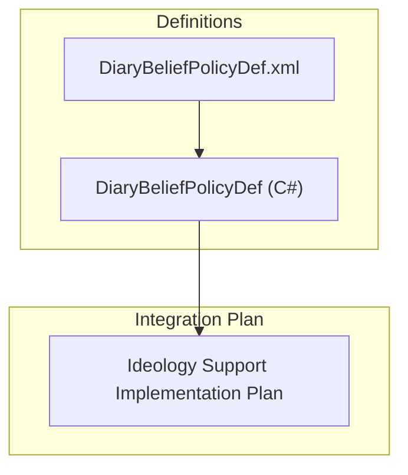
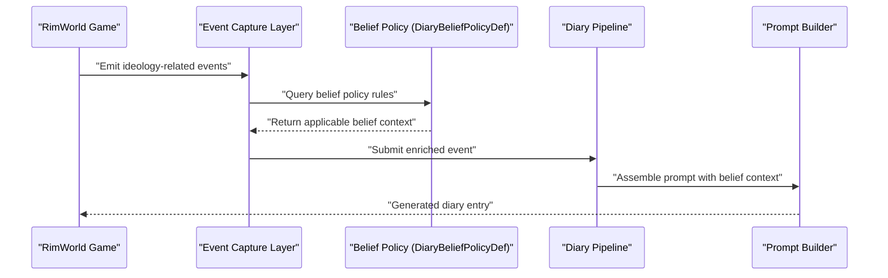
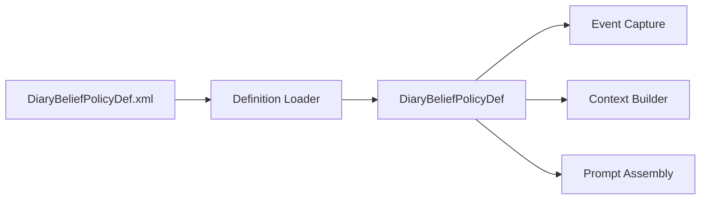
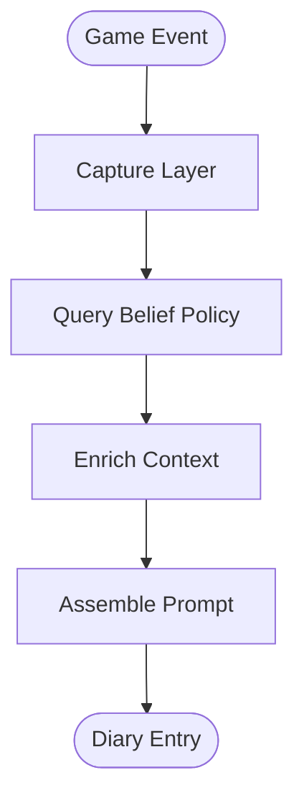

# Ideology Belief & Stance System

- [DiaryBeliefPolicyDef.cs](../../../../Source/Defs/DiaryBeliefPolicyDef.cs)
- [DiaryBeliefPolicyDef.xml](../../../../1.6/Defs/DiaryBeliefPolicyDef.xml)
- [IdeologySupportImplementationPlan.md](../../../../IDEOLOGY_SUPPORT_IMPLEMENTATION_PLAN.md)
## Table of Contents
1. [Introduction](#introduction)
2. [Project Structure](#project-structure)
3. [Core Components](#core-components)
4. [Architecture Overview](#architecture-overview)
5. [Detailed Component Analysis](#detailed-component-analysis)
6. [Dependency Analysis](#dependency-analysis)
7. [Performance Considerations](#performance-considerations)
8. [Troubleshooting Guide](#troubleshooting-guide)
9. [Conclusion](#conclusion)
10. [Appendices](#appendices)

## Introduction
This document describes the Ideology Belief & Stance System as implemented within the project. It explains how beliefs and stances are modeled, captured, and integrated into the diary pipeline to influence narrative generation and UI presentation. The system is designed to be extensible via definitions and policies, enabling modders to tailor belief-related behavior without modifying core logic.

## Project Structure
The ideology subsystem is primarily defined through:
- A policy definition type for beliefs
- XML definitions that configure belief policies at runtime
- An implementation plan outlining integration points with the broader diary pipeline

**Diagram sources**
- [DiaryBeliefPolicyDef.cs](../../../../Source/Defs/DiaryBeliefPolicyDef.cs)
- [DiaryBeliefPolicyDef.xml](../../../../1.6/Defs/DiaryBeliefPolicyDef.xml)
- [IdeologySupportImplementationPlan.md](../../../../IDEOLOGY_SUPPORT_IMPLEMENTATION_PLAN.md)

**Section sources**
- [DiaryBeliefPolicyDef.cs](../../../../Source/Defs/DiaryBeliefPolicyDef.cs)
- [DiaryBeliefPolicyDef.xml](../../../../1.6/Defs/DiaryBeliefPolicyDef.xml)
- [IdeologySupportImplementationPlan.md](../../../../IDEOLOGY_SUPPORT_IMPLEMENTATION_PLAN.md)

## Core Components
- DiaryBeliefPolicyDef: Defines the schema and behavior hooks for belief-related policies used by the diary pipeline.
- DiaryBeliefPolicyDef.xml: Provides concrete belief policy configurations loaded at runtime.
- Ideology Support Implementation Plan: Describes how belief and stance data flows into capture, context building, and prompt generation stages.

Key responsibilities:
- Define belief policy metadata and configuration options
- Provide extension points for capturing ideology-relevant events and states
- Integrate with the diary pipeline to enrich prompts and entries with belief context

**Section sources**
- [DiaryBeliefPolicyDef.cs](../../../../Source/Defs/DiaryBeliefPolicyDef.cs)
- [DiaryBeliefPolicyDef.xml](../../../../1.6/Defs/DiaryBeliefPolicyDef.xml)
- [IdeologySupportImplementationPlan.md](../../../../IDEOLOGY_SUPPORT_IMPLEMENTATION_PLAN.md)

## Architecture Overview
The ideology belief and stance system integrates into the diary pipeline through a policy-driven approach. Beliefs are represented as configurable entities that can influence event capture, context enrichment, and prompt assembly.

**Diagram sources**
- [DiaryBeliefPolicyDef.cs](../../../../Source/Defs/DiaryBeliefPolicyDef.cs)
- [DiaryBeliefPolicyDef.xml](../../../../1.6/Defs/DiaryBeliefPolicyDef.xml)
- [IdeologySupportImplementationPlan.md](../../../../IDEOLOGY_SUPPORT_IMPLEMENTATION_PLAN.md)

## Detailed Component Analysis

### DiaryBeliefPolicyDef
Purpose:
- Declares the structure and behavior contract for belief policies consumed by the diary pipeline.
- Enables configuration of belief-related behaviors via XML definitions.

Design highlights:
- Policy-based abstraction allows multiple belief strategies to coexist.
- Configuration-driven setup supports easy tuning and modding.

Usage patterns:
- Load from XML definitions during game initialization.
- Query during event capture to determine relevant belief context.
- Apply to prompt assembly to influence narrative tone and content.

**Section sources**
- [DiaryBeliefPolicyDef.cs](../../../../Source/Defs/DiaryBeliefPolicyDef.cs)
- [DiaryBeliefPolicyDef.xml](../../../../1.6/Defs/DiaryBeliefPolicyDef.xml)

### DiaryBeliefPolicyDef.xml
Purpose:
- Provides concrete belief policy instances and their parameters.
- Serves as the primary authoring surface for modders and designers.

Configuration aspects:
- Identifiers and display names for beliefs
- Behavioral flags or thresholds influencing capture and prompting
- References to related systems or tags used by the pipeline

Authoring guidance:
- Ensure unique identifiers per belief policy
- Validate required fields before loading
- Keep descriptions concise for UI consumption

**Section sources**
- [DiaryBeliefPolicyDef.xml](../../../../1.6/Defs/DiaryBeliefPolicyDef.xml)

### Ideology Support Implementation Plan
Purpose:
- Outlines the roadmap and integration points for ideology support across capture, context, and generation phases.

Key areas covered:
- Event signals and observation points tied to ideology mechanics
- Context enrichment steps for belief and stance data
- Prompt templates and variations influenced by active beliefs
- Testing and validation strategies for ideology scenarios

Operational flow:
- Identify ideology-relevant game events
- Map them to capture policies and observed conditions
- Enrich diary context with belief state snapshots
- Adjust prompt construction based on belief affinity and salience

**Section sources**
- [IdeologySupportImplementationPlan.md](../../../../IDEOLOGY_SUPPORT_IMPLEMENTATION_PLAN.md)

## Dependency Analysis
The ideology subsystem depends on:
- Definition loader infrastructure to parse XML into DiaryBeliefPolicyDef instances
- Diary pipeline components for event capture, context building, and prompt assembly
- Optional integration points for ideology-specific game features

**Diagram sources**
- [DiaryBeliefPolicyDef.cs](../../../../Source/Defs/DiaryBeliefPolicyDef.cs)
- [DiaryBeliefPolicyDef.xml](../../../../1.6/Defs/DiaryBeliefPolicyDef.xml)
- [IdeologySupportImplementationPlan.md](../../../../IDEOLOGY_SUPPORT_IMPLEMENTATION_PLAN.md)

**Section sources**
- [DiaryBeliefPolicyDef.cs](../../../../Source/Defs/DiaryBeliefPolicyDef.cs)
- [DiaryBeliefPolicyDef.xml](../../../../1.6/Defs/DiaryBeliefPolicyDef.xml)
- [IdeologySupportImplementationPlan.md](../../../../IDEOLOGY_SUPPORT_IMPLEMENTATION_PLAN.md)

## Performance Considerations
- Minimize repeated lookups of belief policies by caching resolved instances where appropriate.
- Defer heavy computations until necessary stages (e.g., prompt assembly) to avoid overhead during frequent event emission.
- Use efficient filtering and matching when selecting applicable belief contexts for a given event.

[No sources needed since this section provides general guidance]

## Troubleshooting Guide
Common issues and resolutions:
- Missing or malformed belief policy definitions: Verify XML schema compliance and required fields.
- No belief context applied: Confirm that ideology events are being emitted and captured correctly.
- Unexpected prompt behavior: Inspect belief policy configuration and ensure it aligns with intended narrative effects.

Validation steps:
- Load definitions and confirm successful registration
- Emit test ideology events and verify context enrichment
- Review generated prompts for expected belief influences

**Section sources**
- [DiaryBeliefPolicyDef.xml](../../../../1.6/Defs/DiaryBeliefPolicyDef.xml)
- [IdeologySupportImplementationPlan.md](../../../../IDEOLOGY_SUPPORT_IMPLEMENTATION_PLAN.md)

## Conclusion
The Ideology Belief & Stance System provides a flexible, policy-driven mechanism to integrate belief and stance data into the diary pipeline. By defining clear contracts and leveraging configuration-driven setups, the system enables rich, context-aware narrative generation while remaining accessible to modders and maintainers.

[No sources needed since this section summarizes without analyzing specific files]

## Appendices

### Data Flow Summary

**Diagram sources**
- [DiaryBeliefPolicyDef.cs](../../../../Source/Defs/DiaryBeliefPolicyDef.cs)
- [DiaryBeliefPolicyDef.xml](../../../../1.6/Defs/DiaryBeliefPolicyDef.xml)
- [IdeologySupportImplementationPlan.md](../../../../IDEOLOGY_SUPPORT_IMPLEMENTATION_PLAN.md)
