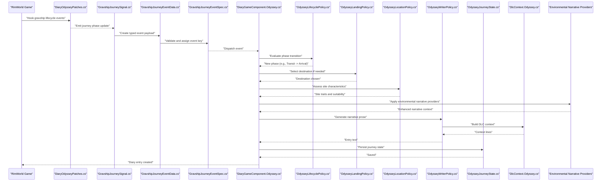
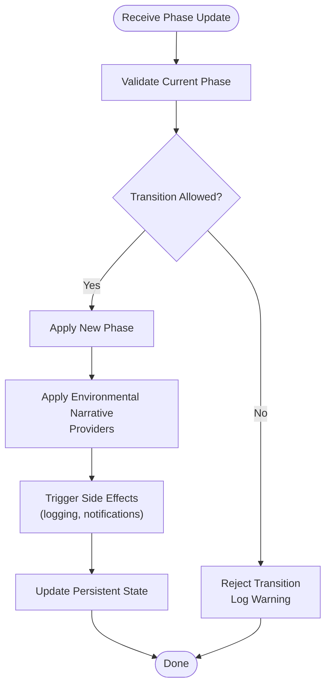
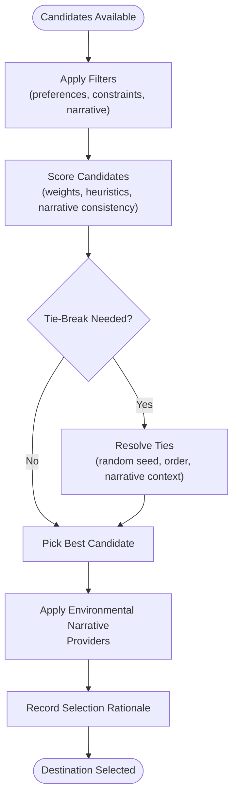
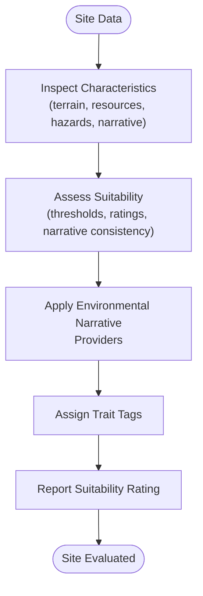
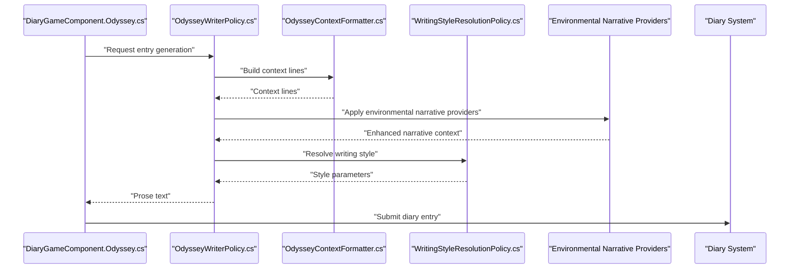
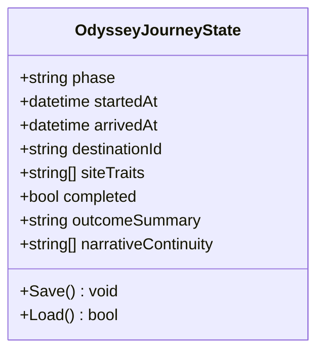
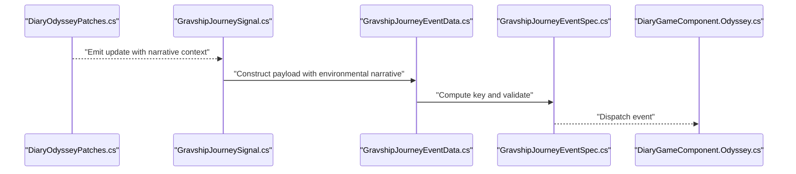
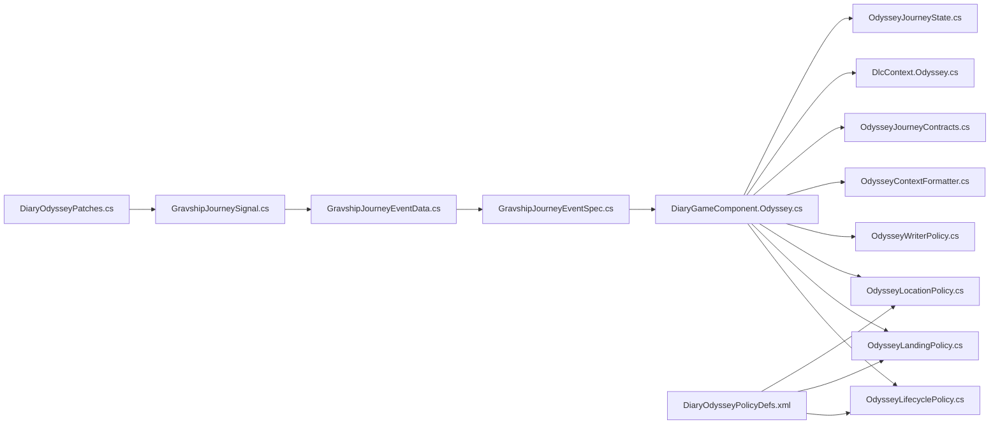

# Odyssey Journey Tracking

<cite>
**Referenced Files in This Document**
- [DiaryGameComponent.Odyssey.cs](../../../../Source/Core/DiaryGameComponent.Odyssey.cs)
- [GravshipJourneyEventData.cs](../../../../Source/Capture/Events/GravshipJourneyEventData.cs)
- [GravshipJourneyEventSpec.cs](../../../../Source/Capture/Specs/GravshipJourneyEventSpec.cs)
- [GravshipJourneySignal.cs](../../../../Source/Ingestion/Sources/GravshipJourneySignal.cs)
- [DiaryOdysseyPatches.cs](../../../../Source/Patches/DiaryOdysseyPatches.cs)
- [DlcContext.Odyssey.cs](../../../../Source/Generation/DlcContext.Odyssey.cs)
- [OdysseyLandingPolicy.cs](../../../../Source/Pipeline/OdysseyLandingPolicy.cs)
- [OdysseyLifecyclePolicy.cs](../../../../Source/Pipeline/OdysseyLifecyclePolicy.cs)
- [OdysseyLocationPolicy.cs](../../../../Source/Pipeline/OdysseyLocationPolicy.cs)
- [OdysseyWriterPolicy.cs](../../../../Source/Pipeline/OdysseyWriterPolicy.cs)
- [OdysseyJourneyContracts.cs](../../../../Source/Pipeline/OdysseyJourneyContracts.cs)
- [OdysseyContextFormatter.cs](../../../../Source/Pipeline/OdysseyContextFormatter.cs)
- [OdysseyJourneyState.cs](../../../../Source/Models/OdysseyJourneyState.cs)
- [DiaryOdysseyPolicyDefs.xml](../../../../1.6/Defs/DiaryOdysseyPolicyDefs.xml)
</cite>

## Update Summary
**Changes Made**
- Enhanced narrative continuity with environmental narrative providers for improved storytelling consistency
- Expanded policy definitions to support more sophisticated journey scenario handling
- Extended journey contracts to provide better context sharing across Odyssey scenarios
- Improved narrative consistency mechanisms throughout the Odyssey DLC integration

## Table of Contents
1. [Introduction](#introduction)
2. [Project Structure](#project-structure)
3. [Core Components](#core-components)
4. [Architecture Overview](#architecture-overview)
5. [Detailed Component Analysis](#detailed-component-analysis)
6. [Dependency Analysis](#dependency-analysis)
7. [Performance Considerations](#performance-considerations)
8. [Troubleshooting Guide](#troubleshooting-guide)
9. [Conclusion](#conclusion)

## Introduction
This document explains how the Odyssey DLC integration tracks gravship journeys, captures landing events, discovers locations, and manages lifecycle phases. The system has been enhanced with improved narrative continuity features that provide environmental narrative providers, expanded policy definitions, and extended journey contracts for better consistency across Odyssey scenarios. It focuses on:
- Capturing journey phases from game signals to structured events
- Selecting landing sites and recording location characteristics
- Generating narrative entries with context-aware writing policies and enhanced narrative continuity
- Persisting journey state across sessions with improved consistency mechanisms
- Configuring behavior via policy definitions and tuning options

The goal is to provide a clear understanding for both developers and modders integrating or extending Odyssey journey tracking with the latest narrative continuity enhancements.

## Project Structure
Odyssey-related functionality spans several layers with enhanced narrative continuity support:
- Patches hook into game systems to emit signals
- Ingestion transforms signals into typed event data
- Capture specs define event schemas and deduplication
- Core orchestrates processing and dispatch with narrative continuity
- Policies implement destination decisions, lifecycle transitions, and site characteristics with environmental narrative providers
- Models persist journey state with enhanced consistency
- Writers format narrative output with improved narrative continuity

```mermaid
graph TB
subgraph "Patches"
P["DiaryOdysseyPatches.cs"]
end
subgraph "Ingestion"
S["GravshipJourneySignal.cs"]
end
subgraph "Capture"
E["GravshipJourneyEventData.cs"]
Spec["GravshipJourneyEventSpec.cs"]
end
subgraph "Core"
C["DiaryGameComponent.Odyssey.cs"]
end
subgraph "Pipeline"
Lp["OdysseyLifecyclePolicy.cs"]
Ol["OdysseyLandingPolicy.cs"]
Oc["OdysseyLocationPolicy.cs"]
Ow["OdysseyWriterPolicy.cs"]
Ocf["OdysseyContextFormatter.cs"]
Ojc["OdysseyJourneyContracts.cs"]
end
subgraph "Generation"
Dlc["DlcContext.Odyssey.cs"]
end
subgraph "Models"
St["OdysseyJourneyState.cs"]
end
subgraph "Defs"
Defs["DiaryOdysseyPolicyDefs.xml"]
end
P --> S --> E --> Spec --> C
C --> Lp
C --> Ol
C --> Oc
C --> Ow
C --> Ocf
C --> Ojc
C --> Dlc
C --> St
Defs --> Lp
Defs --> Ol
Defs --> Oc
```

**Diagram sources**
- [DiaryOdysseyPatches.cs](../../../../Source/Patches/DiaryOdysseyPatches.cs)
- [GravshipJourneySignal.cs](../../../../Source/Ingestion/Sources/GravshipJourneySignal.cs)
- [GravshipJourneyEventData.cs](../../../../Source/Capture/Events/GravshipJourneyEventData.cs)
- [GravshipJourneyEventSpec.cs](../../../../Source/Capture/Specs/GravshipJourneyEventSpec.cs)
- [DiaryGameComponent.Odyssey.cs](../../../../Source/Core/DiaryGameComponent.Odyssey.cs)
- [OdysseyLifecyclePolicy.cs](../../../../Source/Pipeline/OdysseyLifecyclePolicy.cs)
- [OdysseyLandingPolicy.cs](../../../../Source/Pipeline/OdysseyLandingPolicy.cs)
- [OdysseyLocationPolicy.cs](../../../../Source/Pipeline/OdysseyLocationPolicy.cs)
- [OdysseyWriterPolicy.cs](../../../../Source/Pipeline/OdysseyWriterPolicy.cs)
- [OdysseyContextFormatter.cs](../../../../Source/Pipeline/OdysseyContextFormatter.cs)
- [OdysseyJourneyContracts.cs](../../../../Source/Pipeline/OdysseyJourneyContracts.cs)
- [DlcContext.Odyssey.cs](../../../../Source/Generation/DlcContext.Odyssey.cs)
- [OdysseyJourneyState.cs](../../../../Source/Models/OdysseyJourneyState.cs)
- [DiaryOdysseyPolicyDefs.xml](../../../../1.6/Defs/DiaryOdysseyPolicyDefs.xml)

**Section sources**
- [DiaryGameComponent.Odyssey.cs](../../../../Source/Core/DiaryGameComponent.Odyssey.cs)
- [DiaryOdysseyPatches.cs](../../../../Source/Patches/DiaryOdysseyPatches.cs)
- [GravshipJourneySignal.cs](../../../../Source/Ingestion/Sources/GravshipJourneySignal.cs)
- [GravshipJourneyEventData.cs](../../../../Source/Capture/Events/GravshipJourneyEventData.cs)
- [GravshipJourneyEventSpec.cs](../../../../Source/Capture/Specs/GravshipJourneyEventSpec.cs)
- [OdysseyLifecyclePolicy.cs](../../../../Source/Pipeline/OdysseyLifecyclePolicy.cs)
- [OdysseyLandingPolicy.cs](../../../../Source/Pipeline/OdysseyLandingPolicy.cs)
- [OdysseyLocationPolicy.cs](../../../../Source/Pipeline/OdysseyLocationPolicy.cs)
- [OdysseyWriterPolicy.cs](../../../../Source/Pipeline/OdysseyWriterPolicy.cs)
- [OdysseyContextFormatter.cs](../../../../Source/Pipeline/OdysseyContextFormatter.cs)
- [OdysseyJourneyContracts.cs](../../../../Source/Pipeline/OdysseyJourneyContracts.cs)
- [DlcContext.Odyssey.cs](../../../../Source/Generation/DlcContext.Odyssey.cs)
- [OdysseyJourneyState.cs](../../../../Source/Models/OdysseyJourneyState.cs)
- [DiaryOdysseyPolicyDefs.xml](../../../../1.6/Defs/DiaryOdysseyPolicyDefs.xml)

## Core Components
- GravshipJourneySignal: Emits raw journey phase updates from game hooks.
- GravshipJourneyEventData: Structured payload carrying phase details, timestamps, and contextual fields.
- GravshipJourneyEventSpec: Defines schema, keys, and deduplication rules for journey events.
- DiaryGameComponent.Odyssey: Orchestrates ingestion, policy evaluation, state persistence, and entry generation with narrative continuity.
- OdysseyLifecyclePolicy: Determines journey phase transitions (e.g., departure, transit, arrival) with enhanced narrative consistency.
- OdysseyLandingPolicy: Selects landing destinations based on preferences and constraints with improved decision-making.
- OdysseyLocationPolicy: Evaluates site characteristics and suitability for exploration with environmental narrative providers.
- OdysseyWriterPolicy: Formats narrative prose using context and style with enhanced narrative continuity.
- OdysseyContextFormatter: Builds rich context lines for prompts and entries with environmental narrative support.
- OdysseyJourneyContracts: Shared contracts and enums used across components with extended journey contract definitions.
- OdysseyJourneyState: Persistent model storing current journey progress and outcomes with improved consistency.
- DlcContext.Odyssey: Supplies DLC-specific context to the narrative pipeline with enhanced narrative continuity.
- DiaryOdysseyPolicyDefs.xml: Configuration for policies, weights, and filters with expanded narrative continuity options.

Key responsibilities:
- Capture: Convert low-level signals into typed events with stable identifiers and narrative context.
- Policy: Apply configurable logic for lifecycle transitions, landing selection, and site traits with environmental narrative providers.
- Persistence: Save and restore journey state to maintain continuity across sessions with enhanced consistency mechanisms.
- Generation: Produce diary entries with consistent tone and structure using improved narrative continuity.

**Updated** Enhanced with environmental narrative providers and extended journey contracts for improved narrative consistency across Odyssey scenarios.

**Section sources**
- [GravshipJourneySignal.cs](../../../../Source/Ingestion/Sources/GravshipJourneySignal.cs)
- [GravshipJourneyEventData.cs](../../../../Source/Capture/Events/GravshipJourneyEventData.cs)
- [GravshipJourneyEventSpec.cs](../../../../Source/Capture/Specs/GravshipJourneyEventSpec.cs)
- [DiaryGameComponent.Odyssey.cs](../../../../Source/Core/DiaryGameComponent.Odyssey.cs)
- [OdysseyLifecyclePolicy.cs](../../../../Source/Pipeline/OdysseyLifecyclePolicy.cs)
- [OdysseyLandingPolicy.cs](../../../../Source/Pipeline/OdysseyLandingPolicy.cs)
- [OdysseyLocationPolicy.cs](../../../../Source/Pipeline/OdysseyLocationPolicy.cs)
- [OdysseyWriterPolicy.cs](../../../../Source/Pipeline/OdysseyWriterPolicy.cs)
- [OdysseyContextFormatter.cs](../../../../Source/Pipeline/OdysseyContextFormatter.cs)
- [OdysseyJourneyContracts.cs](../../../../Source/Pipeline/OdysseyJourneyContracts.cs)
- [OdysseyJourneyState.cs](../../../../Source/Models/OdysseyJourneyState.cs)
- [DlcContext.Odyssey.cs](../../../../Source/Generation/DlcContext.Odyssey.cs)
- [DiaryOdysseyPolicyDefs.xml](../../../../1.6/Defs/DiaryOdysseyPolicyDefs.xml)

## Architecture Overview
The Odyssey integration follows a signal-to-event pipeline with policy-driven decision-making, persistent state management, and enhanced narrative continuity through environmental narrative providers.



**Updated** Added environmental narrative providers to enhance narrative continuity across Odyssey scenarios.

**Diagram sources**
- [DiaryOdysseyPatches.cs](../../../../Source/Patches/DiaryOdysseyPatches.cs)
- [GravshipJourneySignal.cs](../../../../Source/Ingestion/Sources/GravshipJourneySignal.cs)
- [GravshipJourneyEventData.cs](../../../../Source/Capture/Events/GravshipJourneyEventData.cs)
- [GravshipJourneyEventSpec.cs](../../../../Source/Capture/Specs/GravshipJourneyEventSpec.cs)
- [DiaryGameComponent.Odyssey.cs](../../../../Source/Core/DiaryGameComponent.Odyssey.cs)
- [OdysseyLifecyclePolicy.cs](../../../../Source/Pipeline/OdysseyLifecyclePolicy.cs)
- [OdysseyLandingPolicy.cs](../../../../Source/Pipeline/OdysseyLandingPolicy.cs)
- [OdysseyLocationPolicy.cs](../../../../Source/Pipeline/OdysseyLocationPolicy.cs)
- [OdysseyWriterPolicy.cs](../../../../Source/Pipeline/OdysseyWriterPolicy.cs)
- [OdysseyJourneyState.cs](../../../../Source/Models/OdysseyJourneyState.cs)
- [DlcContext.Odyssey.cs](../../../../Source/Generation/DlcContext.Odyssey.cs)

## Detailed Component Analysis

### OdysseyLifecyclePolicy
Responsibilities:
- Define valid phase transitions (e.g., Departure, Transit, Arrival, Exploration, Completed).
- Enforce ordering and guard against invalid jumps.
- Trigger side effects such as logging or additional capture when transitioning.
- Apply enhanced narrative continuity through environmental narrative providers.

Implementation patterns:
- Uses contract enums for phases and transition rules with extended journey contracts.
- Applies configuration from policy defs to allow tuning of allowed transitions.
- Integrates with core to update persistent state upon successful transitions.
- Incorporates environmental narrative context for improved story consistency.



**Updated** Enhanced with environmental narrative providers for improved narrative continuity during phase transitions.

**Diagram sources**
- [OdysseyLifecyclePolicy.cs](../../../../Source/Pipeline/OdysseyLifecyclePolicy.cs)
- [OdysseyJourneyContracts.cs](../../../../Source/Pipeline/OdysseyJourneyContracts.cs)
- [DiaryOdysseyPolicyDefs.xml](../../../../1.6/Defs/DiaryOdysseyPolicyDefs.xml)

**Section sources**
- [OdysseyLifecyclePolicy.cs](../../../../Source/Pipeline/OdysseyLifecyclePolicy.cs)
- [OdysseyJourneyContracts.cs](../../../../Source/Pipeline/OdysseyJourneyContracts.cs)
- [DiaryOdysseyPolicyDefs.xml](../../../../1.6/Defs/DiaryOdysseyPolicyDefs.xml)

### OdysseyLandingPolicy
Responsibilities:
- Choose landing destinations based on preferences, constraints, and available candidates.
- Incorporate player-defined filters and weights from policy definitions.
- Ensure deterministic selection with tie-breaking rules.
- Apply enhanced narrative consistency through environmental narrative context.

Decision flow:
- Gather candidate sites from context with environmental narrative information.
- Score candidates using preference weights, constraints, and narrative consistency factors.
- Select best candidate and record rationale for narrative context.
- Apply environmental narrative providers for improved story coherence.



**Updated** Enhanced with environmental narrative consistency factors and narrative provider integration for improved landing site selection.

**Diagram sources**
- [OdysseyLandingPolicy.cs](../../../../Source/Pipeline/OdysseyLandingPolicy.cs)
- [DiaryOdysseyPolicyDefs.xml](../../../../1.6/Defs/DiaryOdysseyPolicyDefs.xml)

**Section sources**
- [OdysseyLandingPolicy.cs](../../../../Source/Pipeline/OdysseyLandingPolicy.cs)
- [DiaryOdysseyPolicyDefs.xml](../../../../1.6/Defs/DiaryOdysseyPolicyDefs.xml)

### OdysseyLocationPolicy
Responsibilities:
- Evaluate site characteristics (terrain, resources, hazards) with environmental narrative context.
- Determine exploration suitability and potential risks with narrative consistency.
- Provide context lines for narrative generation with enhanced environmental narrative support.
- Apply environmental narrative providers for improved location storytelling.

Evaluation steps:
- Inspect site metadata and environment with narrative context integration.
- Apply scoring thresholds and risk assessments with narrative consistency factors.
- Output trait tags and suitability rating with environmental narrative enhancement.
- Generate narrative context through environmental narrative providers.



**Updated** Enhanced with environmental narrative providers for improved location evaluation and narrative consistency.

**Diagram sources**
- [OdysseyLocationPolicy.cs](../../../../Source/Pipeline/OdysseyLocationPolicy.cs)
- [DlcContext.Odyssey.cs](../../../../Source/Generation/DlcContext.Odyssey.cs)

**Section sources**
- [OdysseyLocationPolicy.cs](../../../../Source/Pipeline/OdysseyLocationPolicy.cs)
- [DlcContext.Odyssey.cs](../../../../Source/Generation/DlcContext.Odyssey.cs)

### OdysseyWriterPolicy
Responsibilities:
- Compose narrative prose using collected context and site evaluations with enhanced narrative continuity.
- Integrate DLC-specific flavor and terminology with environmental narrative support.
- Maintain consistency with writing style settings and narrative consistency requirements.
- Apply environmental narrative providers for improved story coherence.

Integration points:
- Consumes context lines from OdysseyContextFormatter with environmental narrative enhancement.
- Uses writer tuning and style resolution policies with narrative consistency.
- Produces final entry text for the diary system with improved narrative continuity.
- Integrates environmental narrative providers for consistent storytelling.



**Updated** Enhanced with environmental narrative providers for improved narrative consistency and storytelling quality.

**Diagram sources**
- [OdysseyWriterPolicy.cs](../../../../Source/Pipeline/OdysseyWriterPolicy.cs)
- [OdysseyContextFormatter.cs](../../../../Source/Pipeline/OdysseyContextFormatter.cs)
- [DiaryGameComponent.Odyssey.cs](../../../../Source/Core/DiaryGameComponent.Odyssey.cs)

**Section sources**
- [OdysseyWriterPolicy.cs](../../../../Source/Pipeline/OdysseyWriterPolicy.cs)
- [OdysseyContextFormatter.cs](../../../../Source/Pipeline/OdysseyContextFormatter.cs)
- [DiaryGameComponent.Odyssey.cs](../../../../Source/Core/DiaryGameComponent.Odyssey.cs)

### OdysseyJourneyState
Responsibilities:
- Persist current journey phase, selected destination, site traits, and outcomes with enhanced consistency.
- Support save/load across sessions to maintain continuity with improved narrative consistency.
- Provide queryable state for UI and diagnostics with environmental narrative context.
- Store narrative continuity information for improved story coherence.

Data model highlights:
- Phase identifier and timestamps with narrative context.
- Destination reference and selection rationale with environmental narrative information.
- Site characteristics and exploration results with narrative consistency data.
- Outcome flags and completion markers with enhanced narrative continuity.



**Updated** Enhanced with narrative continuity fields for improved story consistency across Odyssey scenarios.

**Diagram sources**
- [OdysseyJourneyState.cs](../../../../Source/Models/OdysseyJourneyState.cs)

**Section sources**
- [OdysseyJourneyState.cs](../../../../Source/Models/OdysseyJourneyState.cs)

### Event Capture and Specs
- GravshipJourneySignal emits updates when the game reports gravship lifecycle changes with enhanced narrative context.
- GravshipJourneyEventData structures these updates into typed payloads with environmental narrative information.
- GravshipJourneyEventSpec defines unique keys and deduplication to prevent duplicate diary entries with narrative consistency.



**Updated** Enhanced with environmental narrative context for improved narrative continuity during event capture.

**Diagram sources**
- [DiaryOdysseyPatches.cs](../../../../Source/Patches/DiaryOdysseyPatches.cs)
- [GravshipJourneySignal.cs](../../../../Source/Ingestion/Sources/GravshipJourneySignal.cs)
- [GravshipJourneyEventData.cs](../../../../Source/Capture/Events/GravshipJourneyEventData.cs)
- [GravshipJourneyEventSpec.cs](../../../../Source/Capture/Specs/GravshipJourneyEventSpec.cs)
- [DiaryGameComponent.Odyssey.cs](../../../../Source/Core/DiaryGameComponent.Odyssey.cs)

**Section sources**
- [GravshipJourneySignal.cs](../../../../Source/Ingestion/Sources/GravshipJourneySignal.cs)
- [GravshipJourneyEventData.cs](../../../../Source/Capture/Events/GravshipJourneyEventData.cs)
- [GravshipJourneyEventSpec.cs](../../../../Source/Capture/Specs/GravshipJourneyEventSpec.cs)
- [DiaryGameComponent.Odyssey.cs](../../../../Source/Core/DiaryGameComponent.Odyssey.cs)

## Dependency Analysis
The Odyssey subsystem depends on patches for input, capture/specs for normalization, core orchestration, policies for decisions, models for persistence, and generation for context with enhanced narrative continuity support.



**Updated** Enhanced dependency relationships with environmental narrative providers and extended journey contracts for improved narrative consistency.

**Diagram sources**
- [DiaryOdysseyPatches.cs](../../../../Source/Patches/DiaryOdysseyPatches.cs)
- [GravshipJourneySignal.cs](../../../../Source/Ingestion/Sources/GravshipJourneySignal.cs)
- [GravshipJourneyEventData.cs](../../../../Source/Capture/Events/GravshipJourneyEventData.cs)
- [GravshipJourneyEventSpec.cs](../../../../Source/Capture/Specs/GravshipJourneyEventSpec.cs)
- [DiaryGameComponent.Odyssey.cs](../../../../Source/Core/DiaryGameComponent.Odyssey.cs)
- [OdysseyLifecyclePolicy.cs](../../../../Source/Pipeline/OdysseyLifecyclePolicy.cs)
- [OdysseyLandingPolicy.cs](../../../../Source/Pipeline/OdysseyLandingPolicy.cs)
- [OdysseyLocationPolicy.cs](../../../../Source/Pipeline/OdysseyLocationPolicy.cs)
- [OdysseyWriterPolicy.cs](../../../../Source/Pipeline/OdysseyWriterPolicy.cs)
- [OdysseyContextFormatter.cs](../../../../Source/Pipeline/OdysseyContextFormatter.cs)
- [OdysseyJourneyContracts.cs](../../../../Source/Pipeline/OdysseyJourneyContracts.cs)
- [DlcContext.Odyssey.cs](../../../../Source/Generation/DlcContext.Odyssey.cs)
- [OdysseyJourneyState.cs](../../../../Source/Models/OdysseyJourneyState.cs)
- [DiaryOdysseyPolicyDefs.xml](../../../../1.6/Defs/DiaryOdysseyPolicyDefs.xml)

**Section sources**
- [DiaryOdysseyPatches.cs](../../../../Source/Patches/DiaryOdysseyPatches.cs)
- [GravshipJourneySignal.cs](../../../../Source/Ingestion/Sources/GravshipJourneySignal.cs)
- [GravshipJourneyEventData.cs](../../../../Source/Capture/Events/GravshipJourneyEventData.cs)
- [GravshipJourneyEventSpec.cs](../../../../Source/Capture/Specs/GravshipJourneyEventSpec.cs)
- [DiaryGameComponent.Odyssey.cs](../../../../Source/Core/DiaryGameComponent.Odyssey.cs)
- [OdysseyLifecyclePolicy.cs](../../../../Source/Pipeline/OdysseyLifecyclePolicy.cs)
- [OdysseyLandingPolicy.cs](../../../../Source/Pipeline/OdysseyLandingPolicy.cs)
- [OdysseyLocationPolicy.cs](../../../../Source/Pipeline/OdysseyLocationPolicy.cs)
- [OdysseyWriterPolicy.cs](../../../../Source/Pipeline/OdysseyWriterPolicy.cs)
- [OdysseyContextFormatter.cs](../../../../Source/Pipeline/OdysseyContextFormatter.cs)
- [OdysseyJourneyContracts.cs](../../../../Source/Pipeline/OdysseyJourneyContracts.cs)
- [DlcContext.Odyssey.cs](../../../../Source/Generation/DlcContext.Odyssey.cs)
- [OdysseyJourneyState.cs](../../../../Source/Models/OdysseyJourneyState.cs)
- [DiaryOdysseyPolicyDefs.xml](../../../../1.6/Defs/DiaryOdysseyPolicyDefs.xml)

## Performance Considerations
- Deduplication: Use event specs to avoid redundant diary entries during rapid phase updates.
- Scoring efficiency: Keep landing and location scoring lightweight; cache expensive computations where possible.
- State persistence: Batch state updates to minimize I/O overhead during frequent transitions.
- Context building: Reuse context lines and avoid recomputation across multiple writers.
- Narrative continuity: Optimize environmental narrative provider calls to maintain performance while enhancing storytelling.

**Updated** Added considerations for environmental narrative provider performance optimization.

## Troubleshooting Guide
Common issues and resolutions:
- Missing journey entries:
  - Verify that patches are active and emitting signals.
  - Check event spec keys and deduplication settings.
- Incorrect phase transitions:
  - Review lifecycle policy configuration and allowed transitions.
  - Ensure current phase matches expected state before applying updates.
- Landing site not selected:
  - Confirm candidate availability and filter criteria.
  - Inspect scoring weights and tie-breaking rules.
- Poor site evaluation:
  - Validate site characteristic inputs and thresholds.
  - Adjust suitability ratings and trait tags.
- Narrative inconsistencies:
  - Check context formatting and writing style resolution.
  - Ensure DLC context is populated correctly.
  - Verify environmental narrative providers are functioning properly.
- Enhanced narrative continuity issues:
  - Check environmental narrative provider configuration.
  - Verify extended journey contracts are properly initialized.
  - Ensure narrative consistency settings are correctly configured.

Diagnostic tips:
- Enable detailed logs around signal emission and policy evaluation.
- Inspect persisted OdysseyJourneyState for anomalies.
- Cross-check policy definition XML for typos or missing values.
- Monitor environmental narrative provider performance and output.
- Verify extended journey contract initialization and usage.

**Updated** Added troubleshooting guidance for environmental narrative providers and enhanced narrative continuity features.

**Section sources**
- [DiaryOdysseyPatches.cs](../../../../Source/Patches/DiaryOdysseyPatches.cs)
- [GravshipJourneyEventSpec.cs](../../../../Source/Capture/Specs/GravshipJourneyEventSpec.cs)
- [OdysseyLifecyclePolicy.cs](../../../../Source/Pipeline/OdysseyLifecyclePolicy.cs)
- [OdysseyLandingPolicy.cs](../../../../Source/Pipeline/OdysseyLandingPolicy.cs)
- [OdysseyLocationPolicy.cs](../../../../Source/Pipeline/OdysseyLocationPolicy.cs)
- [OdysseyWriterPolicy.cs](../../../../Source/Pipeline/OdysseyWriterPolicy.cs)
- [OdysseyContextFormatter.cs](../../../../Source/Pipeline/OdysseyContextFormatter.cs)
- [DlcContext.Odyssey.cs](../../../../Source/Generation/DlcContext.Odyssey.cs)
- [OdysseyJourneyState.cs](../../../../Source/Models/OdysseyJourneyState.cs)
- [DiaryOdysseyPolicyDefs.xml](../../../../1.6/Defs/DiaryOdysseyPolicyDefs.xml)

## Conclusion
The Odyssey DLC integration provides a robust framework for tracking gravship journeys, selecting landing sites, evaluating locations, and generating narrative entries. With the recent enhancements including environmental narrative providers, expanded policy definitions, and extended journey contracts, the system now delivers improved narrative consistency across Odyssey scenarios. By leveraging policy-driven decisions, persistent state, structured event capture, and enhanced narrative continuity mechanisms, it ensures coherent storytelling and reliable gameplay continuity. Modders can extend behavior through policy definitions and context enhancements while maintaining performance and stability with the new narrative continuity features.

**Updated** Enhanced conclusion reflecting the new environmental narrative providers and improved narrative consistency capabilities.
