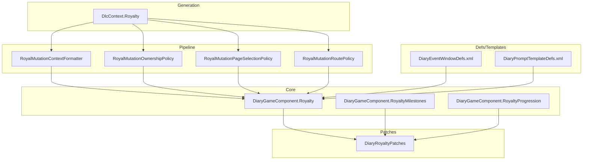
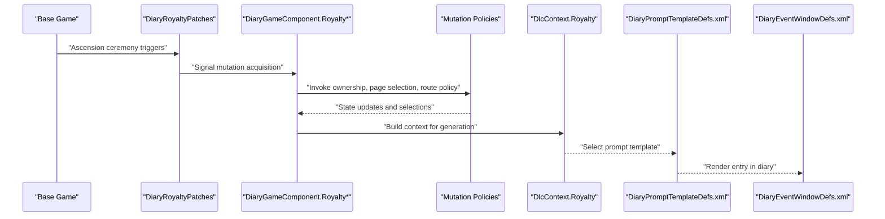
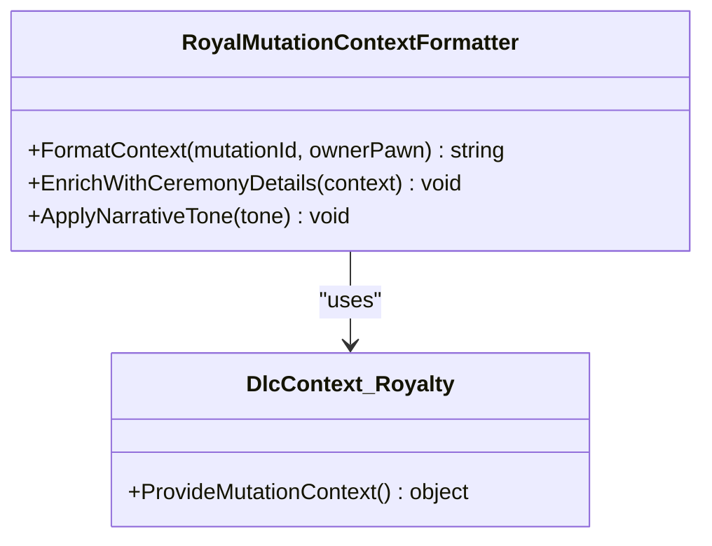
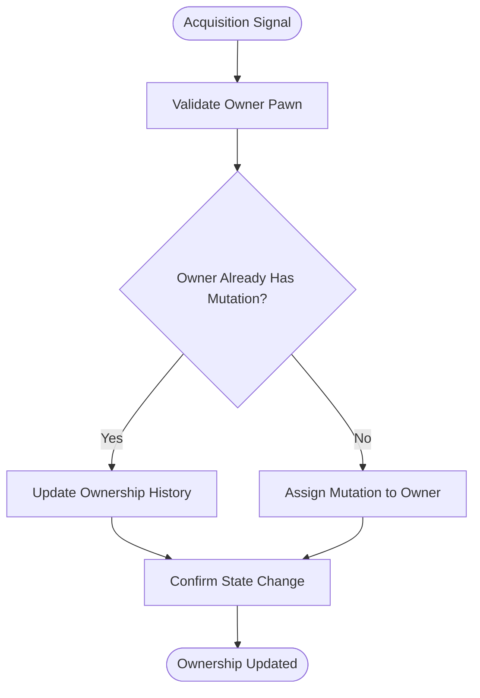
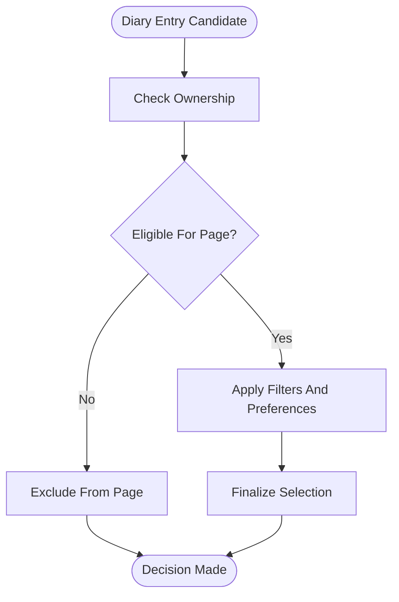
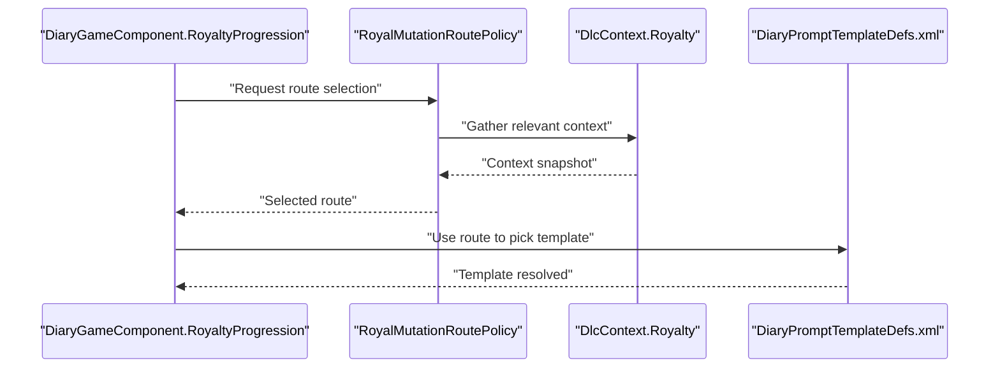
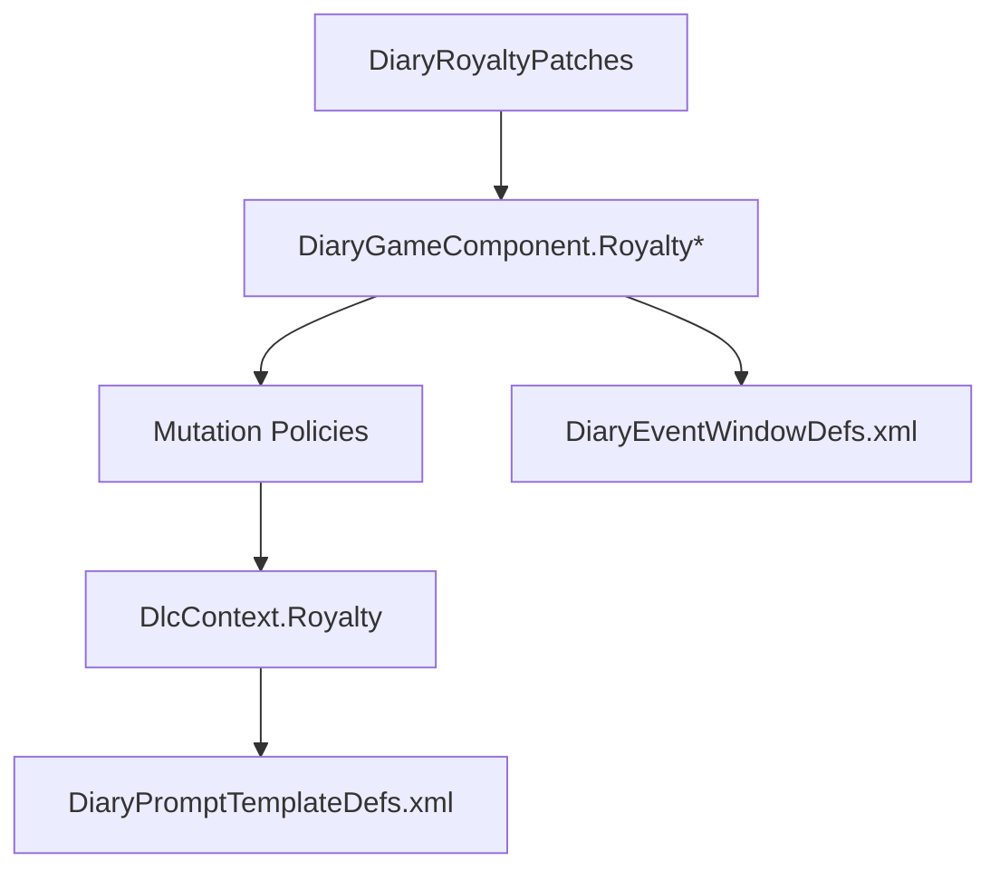
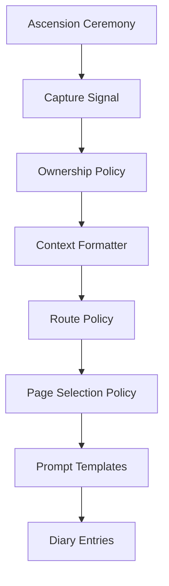

# Royal Mutations & Ascension

- [RoyalMutationContextFormatter.cs](../../../../../Source/Pipeline/Royalty/RoyalMutationContextFormatter.cs)
- [RoyalMutationOwnershipPolicy.cs](../../../../../Source/Pipeline/Royalty/RoyalMutationOwnershipPolicy.cs)
- [RoyalMutationPageSelectionPolicy.cs](../../../../../Source/Pipeline/Royalty/RoyalMutationPageSelectionPolicy.cs)
- [RoyalMutationRoutePolicy.cs](../../../../../Source/Pipeline/Royalty/RoyalMutationRoutePolicy.cs)
- [DiaryGameComponent.Royalty.cs](../../../../../Source/Core/DiaryGameComponent.Royalty.cs)
- [DiaryGameComponent.RoyaltyMilestones.cs](../../../../../Source/Core/DiaryGameComponent.RoyaltyMilestones.cs)
- [DiaryGameComponent.RoyaltyProgression.cs](../../../../../Source/Core/DiaryGameComponent.RoyaltyProgression.cs)
- [DiaryRoyaltyPatches.cs](../../../../../Source/Patches/DiaryRoyaltyPatches.cs)
- [DlcContext.Royalty.cs](../../../../../Source/Generation/DlcContext.Royalty.cs)
- DiaryEventSpec.cs
- [RitualEventData.cs](../../../../../Source/Capture/Events/RitualEventData.cs)
- [DiaryEventWindowDefs.xml](../../../../../1.6/Defs/DiaryEventWindowDefs.xml)
- [DiaryPromptTemplateDefs.xml](../../../../../1.6/Defs/DiaryPromptTemplateDefs.xml)
## Table of Contents
1. [Introduction](#introduction)
2. [Project Structure](#project-structure)
3. [Core Components](#core-components)
4. [Architecture Overview](#architecture-overview)
5. [Detailed Component Analysis](#detailed-component-analysis)
6. [Dependency Analysis](#dependency-analysis)
7. [Performance Considerations](#performance-considerations)
8. [Troubleshooting Guide](#troubleshooting-guide)
9. [Conclusion](#conclusion)
10. [Appendices](#appendices)

## Introduction
This document explains the Royal Mutations and Ascension system as implemented in the project. It covers how mutations are acquired during ascension ceremonies, how they are tracked in the diary, and how they integrate into narrative generation. It also documents the following key components:
- RoyalMutationContextFormatter for mutation context and descriptions
- RoyalMutationOwnershipPolicy for mutation ownership tracking
- RoyalMutationPageSelectionPolicy for page selection mechanics
- RoyalMutationRoutePolicy for mutation path determination

Configuration options for mutation effects, ascension requirements, and troubleshooting guidance are included to help modders and players understand and customize behavior.

## Project Structure
The Royal Mutations and Ascension features span several areas:
- Pipeline policies that implement mutation logic (context formatting, ownership, page selection, route determination)
- Core game component hooks that capture events and coordinate progression
- Patches that integrate with the base game’s royal systems
- Generation context builders that supply data to prompts
- Defs and templates that define UI windows and prompt templates used by the system

**Diagram sources**
- [RoyalMutationContextFormatter.cs](../../../../../Source/Pipeline/Royalty/RoyalMutationContextFormatter.cs)
- [RoyalMutationOwnershipPolicy.cs](../../../../../Source/Pipeline/Royalty/RoyalMutationOwnershipPolicy.cs)
- [RoyalMutationPageSelectionPolicy.cs](../../../../../Source/Pipeline/Royalty/RoyalMutationPageSelectionPolicy.cs)
- [RoyalMutationRoutePolicy.cs](../../../../../Source/Pipeline/Royalty/RoyalMutationRoutePolicy.cs)
- [DiaryGameComponent.Royalty.cs](../../../../../Source/Core/DiaryGameComponent.Royalty.cs)
- [DiaryGameComponent.RoyaltyMilestones.cs](../../../../../Source/Core/DiaryGameComponent.RoyaltyMilestones.cs)
- [DiaryGameComponent.RoyaltyProgression.cs](../../../../../Source/Core/DiaryGameComponent.RoyaltyProgression.cs)
- [DiaryRoyaltyPatches.cs](../../../../../Source/Patches/DiaryRoyaltyPatches.cs)
- [DlcContext.Royalty.cs](../../../../../Source/Generation/DlcContext.Royalty.cs)
- [DiaryEventWindowDefs.xml](../../../../../1.6/Defs/DiaryEventWindowDefs.xml)
- [DiaryPromptTemplateDefs.xml](../../../../../1.6/Defs/DiaryPromptTemplateDefs.xml)

**Section sources**
- [DiaryGameComponent.Royalty.cs](../../../../../Source/Core/DiaryGameComponent.Royalty.cs)
- [DiaryGameComponent.RoyaltyMilestones.cs](../../../../../Source/Core/DiaryGameComponent.RoyaltyMilestones.cs)
- [DiaryGameComponent.RoyaltyProgression.cs](../../../../../Source/Core/DiaryGameComponent.RoyaltyProgression.cs)
- [DiaryRoyaltyPatches.cs](../../../../../Source/Patches/DiaryRoyaltyPatches.cs)
- [DlcContext.Royalty.cs](../../../../../Source/Generation/DlcContext.Royalty.cs)
- [DiaryEventWindowDefs.xml](../../../../../1.6/Defs/DiaryEventWindowDefs.xml)
- [DiaryPromptTemplateDefs.xml](../../../../../1.6/Defs/DiaryPromptTemplateDefs.xml)

## Core Components
This section summarizes the responsibilities of each core component involved in royal mutations and ascension.

- RoyalMutationContextFormatter
  - Produces contextual lines and descriptions for mutations, including titles, effects, and ceremonial details.
  - Integrates with the broader context pipeline to ensure consistent phrasing across entries.

- RoyalMutationOwnershipPolicy
  - Tracks which pawns own or have been affected by specific mutations.
  - Maintains ownership metadata for later correlation and narrative continuity.

- RoyalMutationPageSelectionPolicy
  - Determines which diary pages or sections should include mutation-related content based on state and filters.
  - Coordinates with event window definitions to control visibility and grouping.

- RoyalMutationRoutePolicy
  - Selects the appropriate mutation path or variant based on conditions such as ceremony type, pawn traits, and prior history.
  - Works with generation context to influence prompt selection and outcome text.

These components collaborate with core game components and patches to capture ascension events, update state, and generate coherent diary entries.

**Section sources**
- [RoyalMutationContextFormatter.cs](../../../../../Source/Pipeline/Royalty/RoyalMutationContextFormatter.cs)
- [RoyalMutationOwnershipPolicy.cs](../../../../../Source/Pipeline/Royalty/RoyalMutationOwnershipPolicy.cs)
- [RoyalMutationPageSelectionPolicy.cs](../../../../../Source/Pipeline/Royalty/RoyalMutationPageSelectionPolicy.cs)
- [RoyalMutationRoutePolicy.cs](../../../../../Source/Pipeline/Royalty/RoyalMutationRoutePolicy.cs)

## Architecture Overview
The system integrates at multiple layers:
- Event capture via patches and core components
- Policy-driven processing for mutation context, ownership, page selection, and route determination
- Context building for generation and prompt assembly
- UI and template integration through defs and prompt templates

**Diagram sources**
- [DiaryRoyaltyPatches.cs](../../../../../Source/Patches/DiaryRoyaltyPatches.cs)
- [DiaryGameComponent.Royalty.cs](../../../../../Source/Core/DiaryGameComponent.Royalty.cs)
- [DiaryGameComponent.RoyaltyMilestones.cs](../../../../../Source/Core/DiaryGameComponent.RoyaltyMilestones.cs)
- [DiaryGameComponent.RoyaltyProgression.cs](../../../../../Source/Core/DiaryGameComponent.RoyaltyProgression.cs)
- [RoyalMutationOwnershipPolicy.cs](../../../../../Source/Pipeline/Royalty/RoyalMutationOwnershipPolicy.cs)
- [RoyalMutationPageSelectionPolicy.cs](../../../../../Source/Pipeline/Royalty/RoyalMutationPageSelectionPolicy.cs)
- [RoyalMutationRoutePolicy.cs](../../../../../Source/Pipeline/Royalty/RoyalMutationRoutePolicy.cs)
- [DlcContext.Royalty.cs](../../../../../Source/Generation/DlcContext.Royalty.cs)
- [DiaryPromptTemplateDefs.xml](../../../../../1.6/Defs/DiaryPromptTemplateDefs.xml)
- [DiaryEventWindowDefs.xml](../../../../../1.6/Defs/DiaryEventWindowDefs.xml)

## Detailed Component Analysis

### RoyalMutationContextFormatter
Purpose:
- Formats mutation context lines and descriptions for diary entries.
- Ensures consistent terminology and integrates with other context providers.

Key behaviors:
- Resolves mutation identifiers and associated metadata.
- Produces human-readable summaries suitable for narrative generation.
- Coordinates with generation context to enrich output.

Integration points:
- Consumed by the generation pipeline when assembling prompts.
- Uses shared context builders to maintain coherence across entries.

**Diagram sources**
- [RoyalMutationContextFormatter.cs](../../../../../Source/Pipeline/Royalty/RoyalMutationContextFormatter.cs)
- [DlcContext.Royalty.cs](../../../../../Source/Generation/DlcContext.Royalty.cs)

**Section sources**
- [RoyalMutationContextFormatter.cs](../../../../../Source/Pipeline/Royalty/RoyalMutationContextFormatter.cs)
- [DlcContext.Royalty.cs](../../../../../Source/Generation/DlcContext.Royalty.cs)

### RoyalMutationOwnershipPolicy
Purpose:
- Tracks which pawns own or are linked to specific mutations.
- Provides queries for ownership checks and historical linkage.

Key behaviors:
- Records ownership upon successful mutation acquisition.
- Supports deduplication and conflict resolution when multiple candidates exist.
- Exposes APIs for other policies to query current ownership state.

Integration points:
- Called by core components after ceremony completion.
- Used by page selection and route policies to tailor behavior per owner.

**Diagram sources**
- [RoyalMutationOwnershipPolicy.cs](../../../../../Source/Pipeline/Royalty/RoyalMutationOwnershipPolicy.cs)
- [DiaryGameComponent.Royalty.cs](../../../../../Source/Core/DiaryGameComponent.Royalty.cs)

**Section sources**
- [RoyalMutationOwnershipPolicy.cs](../../../../../Source/Pipeline/Royalty/RoyalMutationOwnershipPolicy.cs)
- [DiaryGameComponent.Royalty.cs](../../../../../Source/Core/DiaryGameComponent.Royalty.cs)

### RoyalMutationPageSelectionPolicy
Purpose:
- Decides which diary pages or sections should display mutation-related content.
- Applies filters based on ownership, ceremony type, and player preferences.

Key behaviors:
- Evaluates eligibility criteria for inclusion in specific pages.
- Coordinates with event window definitions to group related entries.
- Supports toggles and overrides from configuration.

Integration points:
- Invoked during diary rendering and filtering.
- Relies on ownership and context data produced by other policies.

**Diagram sources**
- [RoyalMutationPageSelectionPolicy.cs](../../../../../Source/Pipeline/Royalty/RoyalMutationPageSelectionPolicy.cs)
- [DiaryEventWindowDefs.xml](../../../../../1.6/Defs/DiaryEventWindowDefs.xml)

**Section sources**
- [RoyalMutationPageSelectionPolicy.cs](../../../../../Source/Pipeline/Royalty/RoyalMutationPageSelectionPolicy.cs)
- [DiaryEventWindowDefs.xml](../../../../../1.6/Defs/DiaryEventWindowDefs.xml)

### RoyalMutationRoutePolicy
Purpose:
- Determines the mutation path or variant selected during ascension.
- Considers ceremony specifics, pawn attributes, and prior history.

Key behaviors:
- Computes candidate routes and selects one according to defined rules.
- Influences subsequent narrative choices and outcomes.
- Integrates with generation context to inform prompt selection.

Integration points:
- Called by core progression components during ascension processing.
- Feeds results into context builders and template selectors.

**Diagram sources**
- [RoyalMutationRoutePolicy.cs](../../../../../Source/Pipeline/Royalty/RoyalMutationRoutePolicy.cs)
- [DiaryGameComponent.RoyaltyProgression.cs](../../../../../Source/Core/DiaryGameComponent.RoyaltyProgression.cs)
- [DlcContext.Royalty.cs](../../../../../Source/Generation/DlcContext.Royalty.cs)
- [DiaryPromptTemplateDefs.xml](../../../../../1.6/Defs/DiaryPromptTemplateDefs.xml)

**Section sources**
- [RoyalMutationRoutePolicy.cs](../../../../../Source/Pipeline/Royalty/RoyalMutationRoutePolicy.cs)
- [DiaryGameComponent.RoyaltyProgression.cs](../../../../../Source/Core/DiaryGameComponent.RoyaltyProgression.cs)
- [DlcContext.Royalty.cs](../../../../../Source/Generation/DlcContext.Royalty.cs)
- [DiaryPromptTemplateDefs.xml](../../../../../1.6/Defs/DiaryPromptTemplateDefs.xml)

## Dependency Analysis
The following diagram shows how the mutation policies depend on core components, patches, and generation context.

**Diagram sources**
- [DiaryRoyaltyPatches.cs](../../../../../Source/Patches/DiaryRoyaltyPatches.cs)
- [DiaryGameComponent.Royalty.cs](../../../../../Source/Core/DiaryGameComponent.Royalty.cs)
- [DiaryGameComponent.RoyaltyMilestones.cs](../../../../../Source/Core/DiaryGameComponent.RoyaltyMilestones.cs)
- [DiaryGameComponent.RoyaltyProgression.cs](../../../../../Source/Core/DiaryGameComponent.RoyaltyProgression.cs)
- [RoyalMutationContextFormatter.cs](../../../../../Source/Pipeline/Royalty/RoyalMutationContextFormatter.cs)
- [RoyalMutationOwnershipPolicy.cs](../../../../../Source/Pipeline/Royalty/RoyalMutationOwnershipPolicy.cs)
- [RoyalMutationPageSelectionPolicy.cs](../../../../../Source/Pipeline/Royalty/RoyalMutationPageSelectionPolicy.cs)
- [RoyalMutationRoutePolicy.cs](../../../../../Source/Pipeline/Royalty/RoyalMutationRoutePolicy.cs)
- [DlcContext.Royalty.cs](../../../../../Source/Generation/DlcContext.Royalty.cs)
- [DiaryPromptTemplateDefs.xml](../../../../../1.6/Defs/DiaryPromptTemplateDefs.xml)
- [DiaryEventWindowDefs.xml](../../../../../1.6/Defs/DiaryEventWindowDefs.xml)

**Section sources**
- [DiaryRoyaltyPatches.cs](../../../../../Source/Patches/DiaryRoyaltyPatches.cs)
- [DiaryGameComponent.Royalty.cs](../../../../../Source/Core/DiaryGameComponent.Royalty.cs)
- [DiaryGameComponent.RoyaltyMilestones.cs](../../../../../Source/Core/DiaryGameComponent.RoyaltyMilestones.cs)
- [DiaryGameComponent.RoyaltyProgression.cs](../../../../../Source/Core/DiaryGameComponent.RoyaltyProgression.cs)
- [RoyalMutationContextFormatter.cs](../../../../../Source/Pipeline/Royalty/RoyalMutationContextFormatter.cs)
- [RoyalMutationOwnershipPolicy.cs](../../../../../Source/Pipeline/Royalty/RoyalMutationOwnershipPolicy.cs)
- [RoyalMutationPageSelectionPolicy.cs](../../../../../Source/Pipeline/Royalty/RoyalMutationPageSelectionPolicy.cs)
- [RoyalMutationRoutePolicy.cs](../../../../../Source/Pipeline/Royalty/RoyalMutationRoutePolicy.cs)
- [DlcContext.Royalty.cs](../../../../../Source/Generation/DlcContext.Royalty.cs)
- [DiaryPromptTemplateDefs.xml](../../../../../1.6/Defs/DiaryPromptTemplateDefs.xml)
- [DiaryEventWindowDefs.xml](../../../../../1.6/Defs/DiaryEventWindowDefs.xml)

## Performance Considerations
- Minimize redundant ownership checks by caching recent mutation states where appropriate.
- Defer heavy context enrichment until necessary to avoid blocking ceremony flows.
- Use efficient filtering in page selection to reduce diary rendering overhead.
- Avoid excessive branching in route selection; prefer deterministic rules with clear priorities.

[No sources needed since this section provides general guidance]

## Troubleshooting Guide
Common issues and resolutions:
- Missing mutation entries in diary
  - Verify that ascension signals reach core components and that ownership is recorded.
  - Ensure page selection filters are not excluding valid entries.
- Incorrect ownership attribution
  - Check ownership policy logic for conflicts and deduplication.
  - Confirm that patches correctly identify the intended owner pawn.
- Wrong mutation route selected
  - Inspect route policy inputs and context availability.
  - Validate that generation context includes required ceremony and pawn data.
- Prompt template mismatch
  - Confirm that template IDs align with selected routes and contexts.
  - Review event window definitions for correct grouping and visibility.

Diagnostic references:
- Event signaling and patching: [DiaryRoyaltyPatches.cs](../../../../../Source/Patches/DiaryRoyaltyPatches.cs)
- Core coordination: [DiaryGameComponent.Royalty.cs](../../../../../Source/Core/DiaryGameComponent.Royalty.cs), [DiaryGameComponent.RoyaltyMilestones.cs](../../../../../Source/Core/DiaryGameComponent.RoyaltyMilestones.cs), [DiaryGameComponent.RoyaltyProgression.cs](../../../../../Source/Core/DiaryGameComponent.RoyaltyProgression.cs)
- Ownership and context: [RoyalMutationOwnershipPolicy.cs](../../../../../Source/Pipeline/Royalty/RoyalMutationOwnershipPolicy.cs), [RoyalMutationContextFormatter.cs](../../../../../Source/Pipeline/Royalty/RoyalMutationContextFormatter.cs)
- Page selection and templates: [RoyalMutationPageSelectionPolicy.cs](../../../../../Source/Pipeline/Royalty/RoyalMutationPageSelectionPolicy.cs), [DiaryEventWindowDefs.xml](../../../../../1.6/Defs/DiaryEventWindowDefs.xml), [DiaryPromptTemplateDefs.xml](../../../../../1.6/Defs/DiaryPromptTemplateDefs.xml)

**Section sources**
- [DiaryRoyaltyPatches.cs](../../../../../Source/Patches/DiaryRoyaltyPatches.cs)
- [DiaryGameComponent.Royalty.cs](../../../../../Source/Core/DiaryGameComponent.Royalty.cs)
- [DiaryGameComponent.RoyaltyMilestones.cs](../../../../../Source/Core/DiaryGameComponent.RoyaltyMilestones.cs)
- [DiaryGameComponent.RoyaltyProgression.cs](../../../../../Source/Core/DiaryGameComponent.RoyaltyProgression.cs)
- [RoyalMutationOwnershipPolicy.cs](../../../../../Source/Pipeline/Royalty/RoyalMutationOwnershipPolicy.cs)
- [RoyalMutationContextFormatter.cs](../../../../../Source/Pipeline/Royalty/RoyalMutationContextFormatter.cs)
- [RoyalMutationPageSelectionPolicy.cs](../../../../../Source/Pipeline/Royalty/RoyalMutationPageSelectionPolicy.cs)
- [DiaryEventWindowDefs.xml](../../../../../1.6/Defs/DiaryEventWindowDefs.xml)
- [DiaryPromptTemplateDefs.xml](../../../../../1.6/Defs/DiaryPromptTemplateDefs.xml)

## Conclusion
The Royal Mutations and Ascension system combines event capture, policy-driven processing, and generation context to deliver coherent diary narratives around royal mutations. The four core policies—context formatting, ownership tracking, page selection, and route determination—work together with core components and patches to ensure accurate tracking and rich storytelling. Proper configuration of templates and event windows further enhances user experience and moddability.

[No sources needed since this section summarizes without analyzing specific files]

## Appendices

### Configuration Options
- Mutation Effects
  - Define effect descriptors and tags for use in context formatting and route selection.
  - Reference effect keys in prompt templates for dynamic text.
- Ascension Requirements
  - Specify prerequisites such as ceremony type, pawn traits, and prior milestones.
  - Tie requirements to route policy decisions and page selection filters.
- Diary Integration
  - Adjust event window definitions to group mutation entries appropriately.
  - Customize prompt templates to reflect mutation-specific narrative nuances.

[No sources needed since this section provides general guidance]

### Data Flow Summary

**Diagram sources**
- [DiaryRoyaltyPatches.cs](../../../../../Source/Patches/DiaryRoyaltyPatches.cs)
- [RoyalMutationOwnershipPolicy.cs](../../../../../Source/Pipeline/Royalty/RoyalMutationOwnershipPolicy.cs)
- [RoyalMutationContextFormatter.cs](../../../../../Source/Pipeline/Royalty/RoyalMutationContextFormatter.cs)
- [RoyalMutationRoutePolicy.cs](../../../../../Source/Pipeline/Royalty/RoyalMutationRoutePolicy.cs)
- [RoyalMutationPageSelectionPolicy.cs](../../../../../Source/Pipeline/Royalty/RoyalMutationPageSelectionPolicy.cs)
- [DiaryPromptTemplateDefs.xml](../../../../../1.6/Defs/DiaryPromptTemplateDefs.xml)
