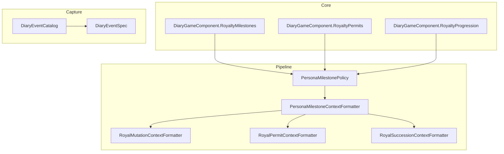
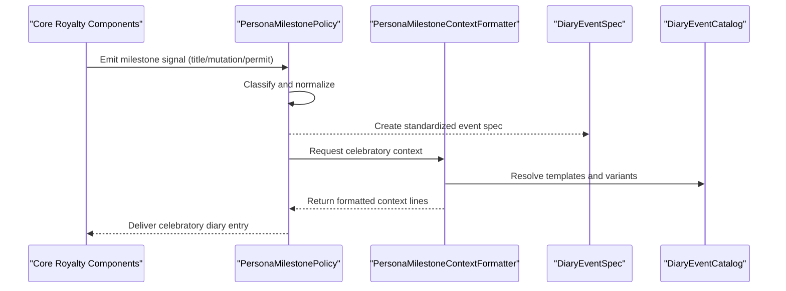
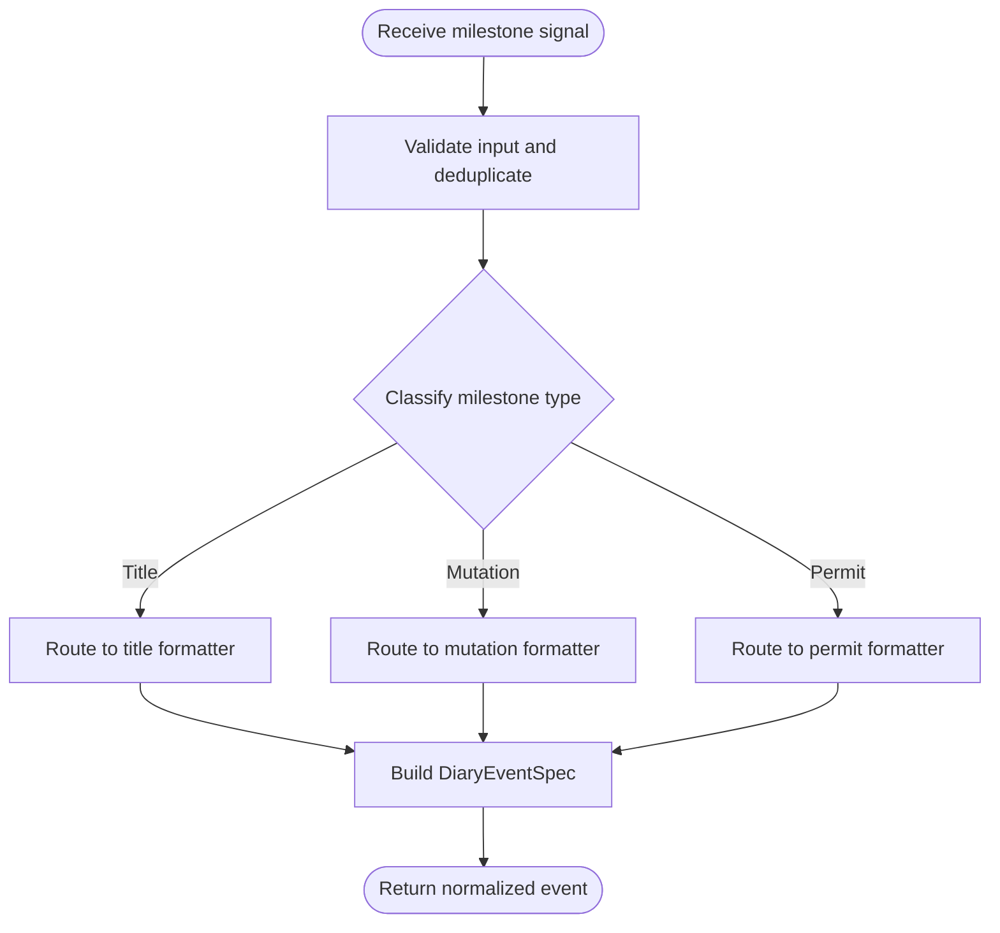
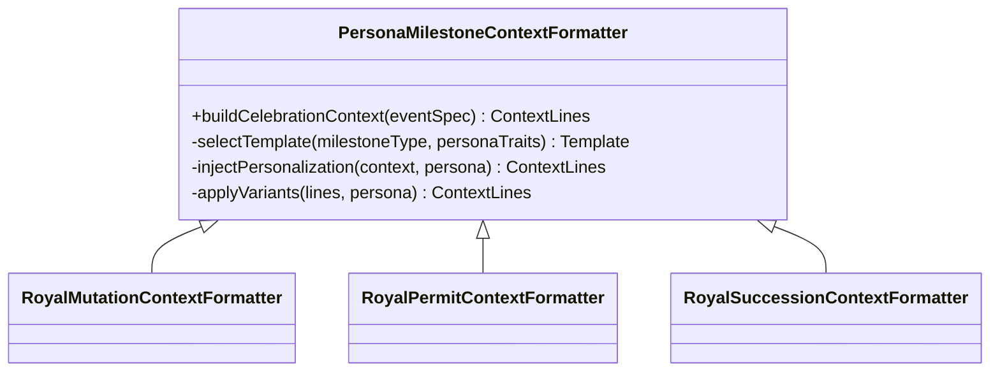
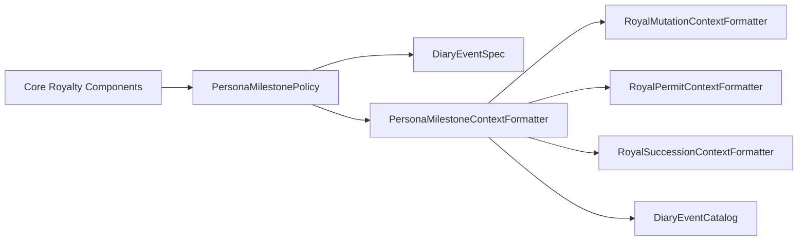

# Milestone Celebration System

- DiaryEventSpec.cs
- [DiaryEventCatalog.cs](../../../../../../Source/Capture/Catalog/DiaryEventCatalog.cs)
## Table of Contents
1. [Introduction](#introduction)
2. [Project Structure](#project-structure)
3. [Core Components](#core-components)
4. [Architecture Overview](#architecture-overview)
5. [Detailed Component Analysis](#detailed-component-analysis)
6. [Dependency Analysis](#dependency-analysis)
7. [Performance Considerations](#performance-considerations)
8. [Troubleshooting Guide](#troubleshooting-guide)
9. [Conclusion](#conclusion)

## Introduction
This document explains the milestone celebration system used by persona management to generate special diary entries when significant royal achievements and events occur. It focuses on how milestones such as title acquisition, mutations, and permits are detected and transformed into celebratory content via context formatters. The documentation covers detection flows, context formatting, personalization strategies, and customization options for milestone types and content variations.

## Project Structure
The milestone celebration system spans several layers:
- Core game components that detect and dispatch milestone events
- Pipeline policies that capture and classify milestone signals
- Context formatters that build rich, personalized narrative context around each milestone
- Catalog and spec definitions that standardize event shapes and routing

**Diagram sources**
- [DiaryGameComponent.RoyaltyMilestones.cs](../../../../../../Source/Core/DiaryGameComponent.RoyaltyMilestones.cs)
- [DiaryGameComponent.RoyaltyPermits.cs](../../../../../../Source/Core/DiaryGameComponent.RoyaltyPermits.cs)
- [DiaryGameComponent.RoyaltyProgression.cs](../../../../../../Source/Core/DiaryGameComponent.RoyaltyProgression.cs)
- [PersonaMilestonePolicy.cs](../../../../../../Source/Pipeline/Royalty/PersonaMilestonePolicy.cs)
- [PersonaMilestoneContextFormatter.cs](../../../../../../Source/Pipeline/Royalty/PersonaMilestoneContextFormatter.cs)
- [RoyalMutationContextFormatter.cs](../../../../../../Source/Pipeline/Royalty/RoyalMutationContextFormatter.cs)
- [RoyalPermitContextFormatter.cs](../../../../../../Source/Pipeline/Royalty/RoyalPermitContextFormatter.cs)
- [RoyalSuccessionContextFormatter.cs](../../../../../../Source/Pipeline/Royalty/RoyalSuccessionContextFormatter.cs)
- [DiaryEventCatalog.cs](../../../../../../Source/Capture/Catalog/DiaryEventCatalog.cs)
- DiaryEventSpec.cs

**Section sources**
- [DiaryGameComponent.RoyaltyMilestones.cs](../../../../../../Source/Core/DiaryGameComponent.RoyaltyMilestones.cs)
- [DiaryGameComponent.RoyaltyPermits.cs](../../../../../../Source/Core/DiaryGameComponent.RoyaltyPermits.cs)
- [DiaryGameComponent.RoyaltyProgression.cs](../../../../../../Source/Core/DiaryGameComponent.RoyaltyProgression.cs)
- [PersonaMilestonePolicy.cs](../../../../../../Source/Pipeline/Royalty/PersonaMilestonePolicy.cs)
- [PersonaMilestoneContextFormatter.cs](../../../../../../Source/Pipeline/Royalty/PersonaMilestoneContextFormatter.cs)
- [RoyalMutationContextFormatter.cs](../../../../../../Source/Pipeline/Royalty/RoyalMutationContextFormatter.cs)
- [RoyalPermitContextFormatter.cs](../../../../../../Source/Pipeline/Royalty/RoyalPermitContextFormatter.cs)
- [RoyalSuccessionContextFormatter.cs](../../../../../../Source/Pipeline/Royalty/RoyalSuccessionContextFormatter.cs)
- [DiaryEventCatalog.cs](../../../../../../Source/Capture/Catalog/DiaryEventCatalog.cs)
- DiaryEventSpec.cs

## Core Components
- PersonaMilestonePolicy: Observes and classifies milestone-related signals (e.g., titles, mutations, permits), normalizes them into a unified event shape, and routes them to the appropriate formatter.
- PersonaMilestoneContextFormatter: Builds celebratory narrative context from normalized milestone data, selecting templates and injecting persona-specific details.
- RoyalMutationContextFormatter: Specialized formatter for mutation milestones with tailored phrasing and contextual facts.
- RoyalPermitContextFormatter: Specialized formatter for permit milestones with relevant permissions and privileges.
- RoyalSuccessionContextFormatter: Specialized formatter for succession milestones with lineage and court context.
- Core Game Components: Detect changes in royal state (titles, permits, progression) and emit signals consumed by the pipeline.

Key responsibilities:
- Detection: Identify when a milestone occurs (title change, mutation gained, permit granted).
- Normalization: Convert raw signals into structured event specs.
- Formatting: Produce celebratory text using persona-aware context and template selection.
- Personalization: Inject traits, relationships, and recent history to make entries feel unique.

**Section sources**
- [PersonaMilestonePolicy.cs](../../../../../../Source/Pipeline/Royalty/PersonaMilestonePolicy.cs)
- [PersonaMilestoneContextFormatter.cs](../../../../../../Source/Pipeline/Royalty/PersonaMilestoneContextFormatter.cs)
- [RoyalMutationContextFormatter.cs](../../../../../../Source/Pipeline/Royalty/RoyalMutationContextFormatter.cs)
- [RoyalPermitContextFormatter.cs](../../../../../../Source/Pipeline/Royalty/RoyalPermitContextFormatter.cs)
- [RoyalSuccessionContextFormatter.cs](../../../../../../Source/Pipeline/Royalty/RoyalSuccessionContextFormatter.cs)
- [DiaryGameComponent.RoyaltyMilestones.cs](../../../../../../Source/Core/DiaryGameComponent.RoyaltyMilestones.cs)
- [DiaryGameComponent.RoyaltyPermits.cs](../../../../../../Source/Core/DiaryGameComponent.RoyaltyPermits.cs)
- [DiaryGameComponent.RoyaltyProgression.cs](../../../../../../Source/Core/DiaryGameComponent.RoyaltyProgression.cs)

## Architecture Overview
The milestone celebration flow integrates core detection, policy classification, and context formatting into a cohesive pipeline.

**Diagram sources**
- [DiaryGameComponent.RoyaltyMilestones.cs](../../../../../../Source/Core/DiaryGameComponent.RoyaltyMilestones.cs)
- [DiaryGameComponent.RoyaltyPermits.cs](../../../../../../Source/Core/DiaryGameComponent.RoyaltyPermits.cs)
- [DiaryGameComponent.RoyaltyProgression.cs](../../../../../../Source/Core/DiaryGameComponent.RoyaltyProgression.cs)
- [PersonaMilestonePolicy.cs](../../../../../../Source/Pipeline/Royalty/PersonaMilestonePolicy.cs)
- [PersonaMilestoneContextFormatter.cs](../../../../../../Source/Pipeline/Royalty/PersonaMilestoneContextFormatter.cs)
- DiaryEventSpec.cs
- [DiaryEventCatalog.cs](../../../../../../Source/Capture/Catalog/DiaryEventCatalog.cs)

## Detailed Component Analysis

### PersonaMilestonePolicy
Responsibilities:
- Observe core signals for royal milestones (title acquisition, mutation gains, permit grants).
- Normalize signals into a consistent event structure suitable for downstream processing.
- Route events to specialized formatters based on milestone type.

Processing logic:
- Input validation and deduplication to avoid duplicate celebrations.
- Mapping of raw signals to canonical milestone categories.
- Enrichment with pawn identity and relevant state snapshots.

**Diagram sources**
- [PersonaMilestonePolicy.cs](../../../../../../Source/Pipeline/Royalty/PersonaMilestonePolicy.cs)
- DiaryEventSpec.cs

**Section sources**
- [PersonaMilestonePolicy.cs](../../../../../../Source/Pipeline/Royalty/PersonaMilestonePolicy.cs)

### PersonaMilestoneContextFormatter
Responsibilities:
- Construct celebratory narrative context from normalized milestone events.
- Select appropriate templates and variants based on persona traits, recent history, and milestone specifics.
- Inject personalized details (names, titles, relationships) to enhance immersion.

Formatting process:
- Extract key fields from the event spec (pawn, milestone type, target entity).
- Choose a base template keyed by milestone category.
- Apply persona-driven modifiers (tone, humor cues, stylistic preferences).
- Compose final context lines for diary rendering.

**Diagram sources**
- [PersonaMilestoneContextFormatter.cs](../../../../../../Source/Pipeline/Royalty/PersonaMilestoneContextFormatter.cs)
- [RoyalMutationContextFormatter.cs](../../../../../../Source/Pipeline/Royalty/RoyalMutationContextFormatter.cs)
- [RoyalPermitContextFormatter.cs](../../../../../../Source/Pipeline/Royalty/RoyalPermitContextFormatter.cs)
- [RoyalSuccessionContextFormatter.cs](../../../../../../Source/Pipeline/Royalty/RoyalSuccessionContextFormatter.cs)

**Section sources**
- [PersonaMilestoneContextFormatter.cs](../../../../../../Source/Pipeline/Royalty/PersonaMilestoneContextFormatter.cs)
- [RoyalMutationContextFormatter.cs](../../../../../../Source/Pipeline/Royalty/RoyalMutationContextFormatter.cs)
- [RoyalPermitContextFormatter.cs](../../../../../../Source/Pipeline/Royalty/RoyalPermitContextFormatter.cs)
- [RoyalSuccessionContextFormatter.cs](../../../../../../Source/Pipeline/Royalty/RoyalSuccessionContextFormatter.cs)

### RoyalMutationContextFormatter
Focus:
- Celebrates genetic or hediff-based mutations tied to royal themes.
- Emphasizes physical transformation, new abilities, and cultural significance.
- Integrates mutation names, rarity, and associated thought impacts.

Customization:
- Variant selection based on mutation severity and persona affinity.
- Optional humor or solemn tone depending on trait profile.

**Section sources**
- [RoyalMutationContextFormatter.cs](../../../../../../Source/Pipeline/Royalty/RoyalMutationContextFormatter.cs)

### RoyalPermitContextFormatter
Focus:
- Celebrates acquisition of royal permits granting privileges or access.
- Highlights practical benefits and social implications within the realm.
- Incorporates permit scope, restrictions, and ceremonial aspects.

Customization:
- Tone adjusted by persona’s relationship with authority and court dynamics.
- Variants reflect permit importance and prior experience.

**Section sources**
- [RoyalPermitContextFormatter.cs](../../../../../../Source/Pipeline/Royalty/RoyalPermitContextFormatter.cs)

### RoyalSuccessionContextFormatter
Focus:
- Celebrates succession events such as ascension or inheritance.
- Emphasizes lineage, legitimacy, and political ramifications.
- Adds ceremonial language and references to predecessors.

Customization:
- Variants selected by dynasty strength, rival claims, and persona’s role.
- Personalization includes family ties and notable ancestors.

**Section sources**
- [RoyalSuccessionContextFormatter.cs](../../../../../../Source/Pipeline/Royalty/RoyalSuccessionContextFormatter.cs)

### Core Detection Components
These components monitor game state and emit milestone signals:
- DiaryGameComponent.RoyaltyMilestones: Tracks title transitions and related milestones.
- DiaryGameComponent.RoyaltyPermits: Monitors permit acquisition and revocation.
- DiaryGameComponent.RoyaltyProgression: Observes broader royal progression events.

They ensure timely detection and provide necessary context (pawn identity, timestamps, related entities) to downstream policies.

**Section sources**
- [DiaryGameComponent.RoyaltyMilestones.cs](../../../../../../Source/Core/DiaryGameComponent.RoyaltyMilestones.cs)
- [DiaryGameComponent.RoyaltyPermits.cs](../../../../../../Source/Core/DiaryGameComponent.RoyaltyPermits.cs)
- [DiaryGameComponent.RoyaltyProgression.cs](../../../../../../Source/Core/DiaryGameComponent.RoyaltyProgression.cs)

## Dependency Analysis
The milestone celebration system exhibits clear separation of concerns:
- Core components depend only on game state and emit signals.
- Policies depend on signals and produce normalized specs.
- Formatters depend on specs and catalog resources to render celebratory content.

**Diagram sources**
- [DiaryGameComponent.RoyaltyMilestones.cs](../../../../../../Source/Core/DiaryGameComponent.RoyaltyMilestones.cs)
- [DiaryGameComponent.RoyaltyPermits.cs](../../../../../../Source/Core/DiaryGameComponent.RoyaltyPermits.cs)
- [DiaryGameComponent.RoyaltyProgression.cs](../../../../../../Source/Core/DiaryGameComponent.RoyaltyProgression.cs)
- [PersonaMilestonePolicy.cs](../../../../../../Source/Pipeline/Royalty/PersonaMilestonePolicy.cs)
- [PersonaMilestoneContextFormatter.cs](../../../../../../Source/Pipeline/Royalty/PersonaMilestoneContextFormatter.cs)
- [RoyalMutationContextFormatter.cs](../../../../../../Source/Pipeline/Royalty/RoyalMutationContextFormatter.cs)
- [RoyalPermitContextFormatter.cs](../../../../../../Source/Pipeline/Royalty/RoyalPermitContextFormatter.cs)
- [RoyalSuccessionContextFormatter.cs](../../../../../../Source/Pipeline/Royalty/RoyalSuccessionContextFormatter.cs)
- [DiaryEventCatalog.cs](../../../../../../Source/Capture/Catalog/DiaryEventCatalog.cs)
- DiaryEventSpec.cs

**Section sources**
- [PersonaMilestonePolicy.cs](../../../../../../Source/Pipeline/Royalty/PersonaMilestonePolicy.cs)
- [PersonaMilestoneContextFormatter.cs](../../../../../../Source/Pipeline/Royalty/PersonaMilestoneContextFormatter.cs)
- [DiaryEventCatalog.cs](../../../../../../Source/Capture/Catalog/DiaryEventCatalog.cs)
- DiaryEventSpec.cs

## Performance Considerations
- Deduplication at the policy layer prevents redundant celebrations and reduces formatting overhead.
- Template selection is localized to formatters; keep variant catalogs concise to minimize lookup time.
- Avoid heavy computations during formatting; defer expensive operations to background processes where possible.
- Cache persona traits and recent history snapshots to reduce repeated reads.

[No sources needed since this section provides general guidance]

## Troubleshooting Guide
Common issues and resolutions:
- Duplicate milestone entries: Verify deduplication logic in the policy and ensure signals are not emitted multiple times by core components.
- Missing personalization: Confirm that persona traits and recent history are available when building context; check catalog template keys.
- Incorrect milestone type: Inspect classification logic in the policy and validate event spec fields before formatting.
- Formatter not invoked: Ensure routing maps milestone categories to the correct specialized formatter.

**Section sources**
- [PersonaMilestonePolicy.cs](../../../../../../Source/Pipeline/Royalty/PersonaMilestonePolicy.cs)
- [PersonaMilestoneContextFormatter.cs](../../../../../../Source/Pipeline/Royalty/PersonaMilestoneContextFormatter.cs)

## Conclusion
The milestone celebration system integrates robust detection, normalization, and personalized formatting to create meaningful diary entries for royal achievements. By separating concerns across core components, policies, and specialized formatters, the system remains extensible and maintainable. Customization points allow fine-tuning of tone, variants, and personalization, ensuring celebratory content feels authentic and engaging.

[No sources needed since this section summarizes without analyzing specific files]
