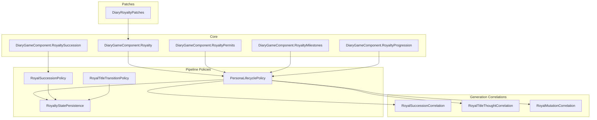
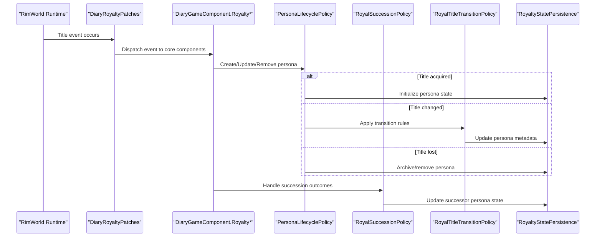
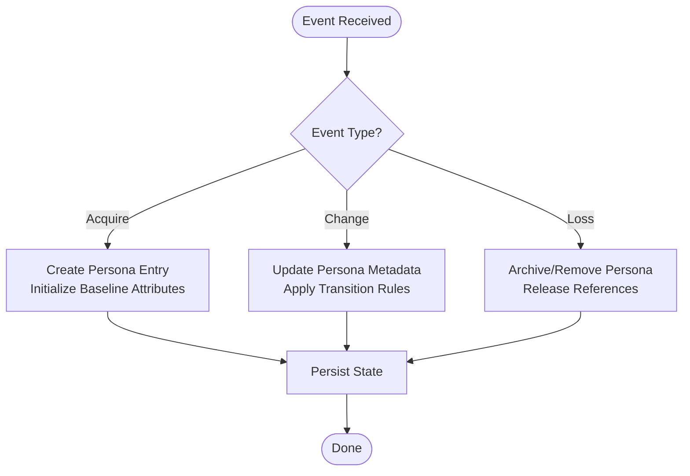
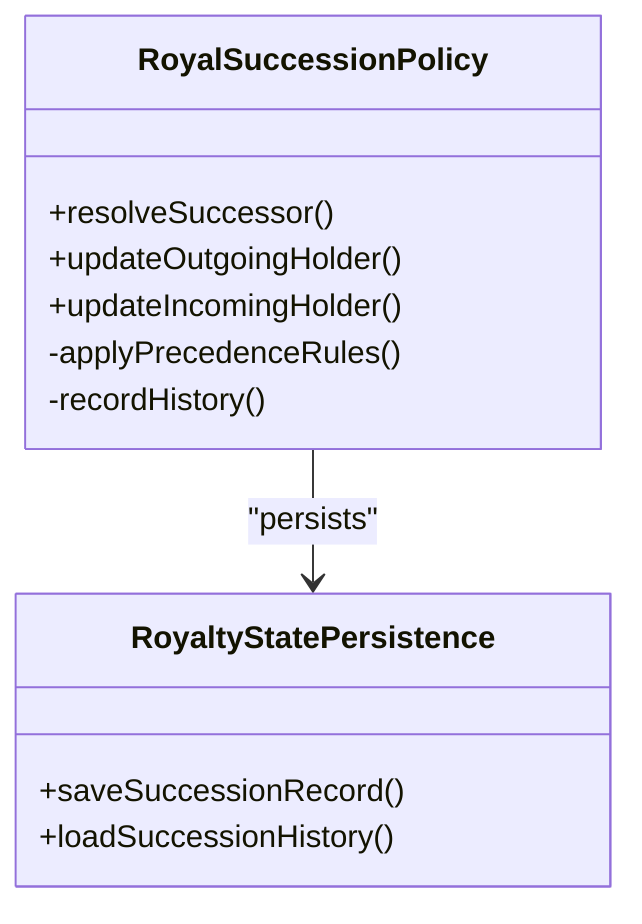
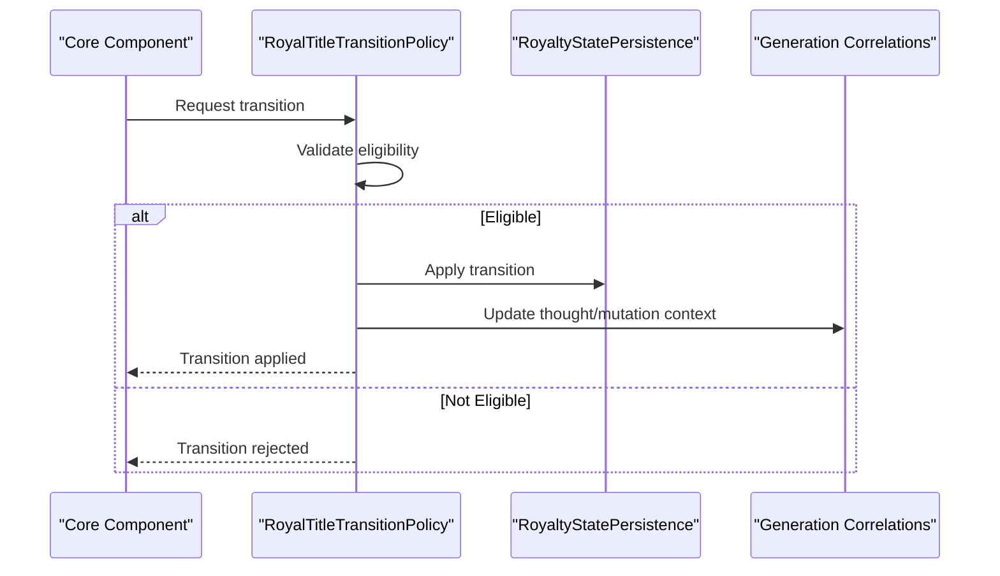
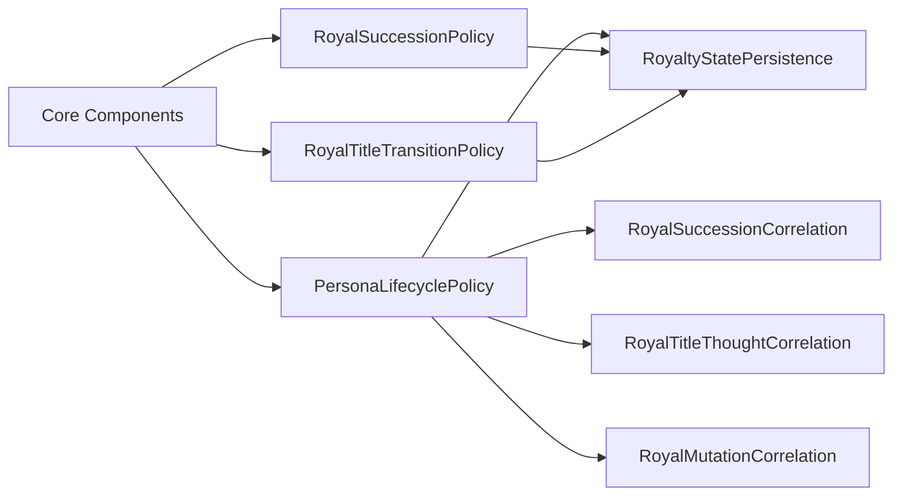

# Persona Lifecycle Management

- [PersonaLifecyclePolicy.cs](../../../../../../Source/Pipeline/Royalty/PersonaLifecyclePolicy.cs)
- [RoyalSuccessionPolicy.cs](../../../../../../Source/Pipeline/Royalty/RoyalSuccessionPolicy.cs)
- [RoyalTitleTransitionPolicy.cs](../../../../../../Source/Pipeline/Royalty/RoyalTitleTransitionPolicy.cs)
- [RoyaltyStatePersistence.cs](../../../../../../Source/Pipeline/Royalty/RoyaltyStatePersistence.cs)
- [DiaryGameComponent.Royalty.cs](../../../../../../Source/Core/DiaryGameComponent.Royalty.cs)
- [DiaryGameComponent.RoyaltySuccession.cs](../../../../../../Source/Core/DiaryGameComponent.RoyaltySuccession.cs)
- [DiaryGameComponent.RoyaltyPermits.cs](../../../../../../Source/Core/DiaryGameComponent.RoyaltyPermits.cs)
- [DiaryGameComponent.RoyaltyMilestones.cs](../../../../../../Source/Core/DiaryGameComponent.RoyaltyMilestones.cs)
- [DiaryGameComponent.RoyaltyProgression.cs](../../../../../../Source/Core/DiaryGameComponent.RoyaltyProgression.cs)
- [DiaryRoyaltyPatches.cs](../../../../../../Source/Patches/DiaryRoyaltyPatches.cs)
- [RoyalSuccessionCorrelation.cs](../../../../../../Source/Generation/RoyalSuccessionCorrelation.cs)
- [RoyalTitleThoughtCorrelation.cs](../../../../../../Source/Generation/RoyalTitleThoughtCorrelation.cs)
- [RoyalMutationCorrelation.cs](../../../../../../Source/Generation/RoyalMutationCorrelation.cs)
- [DiaryPersonaDef.cs](../../../../../../Source/Defs/DiaryPersonaDef.cs)
- [DiaryRoyaltyPolicyDef.cs](../../../../../../Source/Defs/DiaryRoyaltyPolicyDef.cs)
## Table of Contents
1. [Introduction](#introduction)
2. [Project Structure](#project-structure)
3. [Core Components](#core-components)
4. [Architecture Overview](#architecture-overview)
5. [Detailed Component Analysis](#detailed-component-analysis)
6. [Dependency Analysis](#dependency-analysis)
7. [Performance Considerations](#performance-considerations)
8. [Troubleshooting Guide](#troubleshooting-guide)
9. [Conclusion](#conclusion)
10. [Appendices](#appendices)

## Introduction
This document explains the persona lifecycle management system for pawns with royal titles. It covers how personas are created when a pawn gains a royal title, how they evolve during title changes and succession events, and how they are removed or archived when titles are lost. The focus is on the implementation of the PersonaLifecyclePolicy and its integration with the broader royal system, including event hooks, state transitions, cleanup procedures, memory management, performance considerations, and conflict resolution strategies.

## Project Structure
The persona lifecycle spans several layers:
- Core game component orchestration for royalty-related events
- Pipeline policies that implement lifecycle logic (creation, transition, cleanup)
- Persistence layer for saving and restoring persona state
- Generation correlations that enrich persona context with title-related facts
- Patches that inject lifecycle triggers into the game’s runtime

**Diagram sources**
- [DiaryGameComponent.Royalty.cs](../../../../../../Source/Core/DiaryGameComponent.Royalty.cs)
- [DiaryGameComponent.RoyaltySuccession.cs](../../../../../../Source/Core/DiaryGameComponent.RoyaltySuccession.cs)
- [DiaryGameComponent.RoyaltyPermits.cs](../../../../../../Source/Core/DiaryGameComponent.RoyaltyPermits.cs)
- [DiaryGameComponent.RoyaltyMilestones.cs](../../../../../../Source/Core/DiaryGameComponent.RoyaltyMilestones.cs)
- [DiaryGameComponent.RoyaltyProgression.cs](../../../../../../Source/Core/DiaryGameComponent.RoyaltyProgression.cs)
- [PersonaLifecyclePolicy.cs](../../../../../../Source/Pipeline/Royalty/PersonaLifecyclePolicy.cs)
- [RoyalSuccessionPolicy.cs](../../../../../../Source/Pipeline/Royalty/RoyalSuccessionPolicy.cs)
- [RoyalTitleTransitionPolicy.cs](../../../../../../Source/Pipeline/Royalty/RoyalTitleTransitionPolicy.cs)
- [RoyaltyStatePersistence.cs](../../../../../../Source/Pipeline/Royalty/RoyaltyStatePersistence.cs)
- [DiaryRoyaltyPatches.cs](../../../../../../Source/Patches/DiaryRoyaltyPatches.cs)
- [RoyalSuccessionCorrelation.cs](../../../../../../Source/Generation/RoyalSuccessionCorrelation.cs)
- [RoyalTitleThoughtCorrelation.cs](../../../../../../Source/Generation/RoyalTitleThoughtCorrelation.cs)
- [RoyalMutationCorrelation.cs](../../../../../../Source/Generation/RoyalMutationCorrelation.cs)

**Section sources**
- [DiaryGameComponent.Royalty.cs](../../../../../../Source/Core/DiaryGameComponent.Royalty.cs)
- [DiaryGameComponent.RoyaltySuccession.cs](../../../../../../Source/Core/DiaryGameComponent.RoyaltySuccession.cs)
- [DiaryGameComponent.RoyaltyPermits.cs](../../../../../../Source/Core/DiaryGameComponent.RoyaltyPermits.cs)
- [DiaryGameComponent.RoyaltyMilestones.cs](../../../../../../Source/Core/DiaryGameComponent.RoyaltyMilestones.cs)
- [DiaryGameComponent.RoyaltyProgression.cs](../../../../../../Source/Core/DiaryGameComponent.RoyaltyProgression.cs)
- [PersonaLifecyclePolicy.cs](../../../../../../Source/Pipeline/Royalty/PersonaLifecyclePolicy.cs)
- [RoyalSuccessionPolicy.cs](../../../../../../Source/Pipeline/Royalty/RoyalSuccessionPolicy.cs)
- [RoyalTitleTransitionPolicy.cs](../../../../../../Source/Pipeline/Royalty/RoyalTitleTransitionPolicy.cs)
- [RoyaltyStatePersistence.cs](../../../../../../Source/Pipeline/Royalty/RoyaltyStatePersistence.cs)
- [DiaryRoyaltyPatches.cs](../../../../../../Source/Patches/DiaryRoyaltyPatches.cs)
- [RoyalSuccessionCorrelation.cs](../../../../../../Source/Generation/RoyalSuccessionCorrelation.cs)
- [RoyalTitleThoughtCorrelation.cs](../../../../../../Source/Generation/RoyalTitleThoughtCorrelation.cs)
- [RoyalMutationCorrelation.cs](../../../../../../Source/Generation/RoyalMutationCorrelation.cs)

## Core Components
- PersonaLifecyclePolicy: Central orchestrator for persona creation, updates, and removal tied to royal title events. Implements event hooks for title acquisition, change, and loss; coordinates state transitions; and triggers cleanup.
- RoyalSuccessionPolicy: Handles succession outcomes, updating persona states when titles pass between pawns.
- RoyalTitleTransitionPolicy: Manages granular title transitions (e.g., rank changes, temporary grants), ensuring persona data remains consistent.
- RoyaltyStatePersistence: Persists persona state across saves and loads, including title history and milestones.
- DiaryGameComponent.* (Royalty*): High-level components that subscribe to game events and dispatch them to pipeline policies.
- DiaryRoyaltyPatches: Injects lifecycle triggers into the game’s runtime at appropriate points.
- Generation Correlations: Enrich persona context with title-related facts (succession, thoughts, mutations).

Key responsibilities:
- Creation: When a pawn acquires a royal title, create a new persona entry and initialize baseline attributes.
- Modification: On title changes (rank, type, ownership), update persona metadata and relevant narrative context.
- Removal: When a pawn loses a title, archive or remove persona entries according to policy rules.
- Cleanup: Ensure references, caches, and transient state are released to prevent leaks.

**Section sources**
- [PersonaLifecyclePolicy.cs](../../../../../../Source/Pipeline/Royalty/PersonaLifecyclePolicy.cs)
- [RoyalSuccessionPolicy.cs](../../../../../../Source/Pipeline/Royalty/RoyalSuccessionPolicy.cs)
- [RoyalTitleTransitionPolicy.cs](../../../../../../Source/Pipeline/Royalty/RoyalTitleTransitionPolicy.cs)
- [RoyaltyStatePersistence.cs](../../../../../../Source/Pipeline/Royalty/RoyaltyStatePersistence.cs)
- [DiaryGameComponent.Royalty.cs](../../../../../../Source/Core/DiaryGameComponent.Royalty.cs)
- [DiaryGameComponent.RoyaltySuccession.cs](../../../../../../Source/Core/DiaryGameComponent.RoyaltySuccession.cs)
- [DiaryGameComponent.RoyaltyPermits.cs](../../../../../../Source/Core/DiaryGameComponent.RoyaltyPermits.cs)
- [DiaryGameComponent.RoyaltyMilestones.cs](../../../../../../Source/Core/DiaryGameComponent.RoyaltyMilestones.cs)
- [DiaryGameComponent.RoyaltyProgression.cs](../../../../../../Source/Core/DiaryGameComponent.RoyaltyProgression.cs)
- [DiaryRoyaltyPatches.cs](../../../../../../Source/Patches/DiaryRoyaltyPatches.cs)
- [RoyalSuccessionCorrelation.cs](../../../../../../Source/Generation/RoyalSuccessionCorrelation.cs)
- [RoyalTitleThoughtCorrelation.cs](../../../../../../Source/Generation/RoyalTitleThoughtCorrelation.cs)
- [RoyalMutationCorrelation.cs](../../../../../../Source/Generation/RoyalMutationCorrelation.cs)

## Architecture Overview
The persona lifecycle integrates with the royal system through event-driven hooks. Core components detect title events and delegate to pipeline policies, which manage persona state and persistence.

**Diagram sources**
- [DiaryRoyaltyPatches.cs](../../../../../../Source/Patches/DiaryRoyaltyPatches.cs)
- [DiaryGameComponent.Royalty.cs](../../../../../../Source/Core/DiaryGameComponent.Royalty.cs)
- [PersonaLifecyclePolicy.cs](../../../../../../Source/Pipeline/Royalty/PersonaLifecyclePolicy.cs)
- [RoyalSuccessionPolicy.cs](../../../../../../Source/Pipeline/Royalty/RoyalSuccessionPolicy.cs)
- [RoyalTitleTransitionPolicy.cs](../../../../../../Source/Pipeline/Royalty/RoyalTitleTransitionPolicy.cs)
- [RoyaltyStatePersistence.cs](../../../../../../Source/Pipeline/Royalty/RoyaltyStatePersistence.cs)

## Detailed Component Analysis

### PersonaLifecyclePolicy
Responsibilities:
- Event hooks: Subscribes to title acquisition, modification, and loss events via core components.
- State transitions: Moves persona from “inactive” to “active,” then to “archived” or “removed.”
- Cleanup: Releases references, clears caches, and ensures no dangling pointers remain.

Implementation patterns:
- Observer-style event handling within core components.
- Guarded transitions to avoid invalid state changes.
- Batched updates for multiple title changes to reduce overhead.

**Diagram sources**
- [PersonaLifecyclePolicy.cs](../../../../../../Source/Pipeline/Royalty/PersonaLifecyclePolicy.cs)
- [RoyaltyStatePersistence.cs](../../../../../../Source/Pipeline/Royalty/RoyaltyStatePersistence.cs)

**Section sources**
- [PersonaLifecyclePolicy.cs](../../../../../../Source/Pipeline/Royalty/PersonaLifecyclePolicy.cs)
- [RoyaltyStatePersistence.cs](../../../../../../Source/Pipeline/Royalty/RoyaltyStatePersistence.cs)

### RoyalSuccessionPolicy
Responsibilities:
- Determines successor based on inheritance rules.
- Updates persona state for both outgoing and incoming title holders.
- Coordinates with persistence to record succession history.

Conflict resolution:
- Applies precedence rules when multiple candidates exist.
- Ensures atomic updates to avoid inconsistent persona states.

**Diagram sources**
- [RoyalSuccessionPolicy.cs](../../../../../../Source/Pipeline/Royalty/RoyalSuccessionPolicy.cs)
- [RoyaltyStatePersistence.cs](../../../../../../Source/Pipeline/Royalty/RoyaltyStatePersistence.cs)

**Section sources**
- [RoyalSuccessionPolicy.cs](../../../../../../Source/Pipeline/Royalty/RoyalSuccessionPolicy.cs)
- [RoyaltyStatePersistence.cs](../../../../../../Source/Pipeline/Royalty/RoyaltyStatePersistence.cs)

### RoyalTitleTransitionPolicy
Responsibilities:
- Handles granular title transitions such as rank upgrades, temporary grants, and conditional revocations.
- Validates transition eligibility before applying changes.
- Updates persona metadata and related thought correlations.

**Diagram sources**
- [RoyalTitleTransitionPolicy.cs](../../../../../../Source/Pipeline/Royalty/RoyalTitleTransitionPolicy.cs)
- [RoyaltyStatePersistence.cs](../../../../../../Source/Pipeline/Royalty/RoyaltyStatePersistence.cs)
- [RoyalTitleThoughtCorrelation.cs](../../../../../../Source/Generation/RoyalTitleThoughtCorrelation.cs)
- [RoyalMutationCorrelation.cs](../../../../../../Source/Generation/RoyalMutationCorrelation.cs)

**Section sources**
- [RoyalTitleTransitionPolicy.cs](../../../../../../Source/Pipeline/Royalty/RoyalTitleTransitionPolicy.cs)
- [RoyaltyStatePersistence.cs](../../../../../../Source/Pipeline/Royalty/RoyaltyStatePersistence.cs)
- [RoyalTitleThoughtCorrelation.cs](../../../../../../Source/Generation/RoyalTitleThoughtCorrelation.cs)
- [RoyalMutationCorrelation.cs](../../../../../../Source/Generation/RoyalMutationCorrelation.cs)

### Core Integration Points
- DiaryGameComponent.Royalty*: Detects title events and delegates to policies.
- DiaryRoyaltyPatches: Hooks into the game’s runtime to ensure timely event delivery.
- DiaryPersonaDef and DiaryRoyaltyPolicyDef: Define persona templates and policy configurations used by the lifecycle.

**Section sources**
- [DiaryGameComponent.Royalty.cs](../../../../../../Source/Core/DiaryGameComponent.Royalty.cs)
- [DiaryGameComponent.RoyaltySuccession.cs](../../../../../../Source/Core/DiaryGameComponent.RoyaltySuccession.cs)
- [DiaryGameComponent.RoyaltyPermits.cs](../../../../../../Source/Core/DiaryGameComponent.RoyaltyPermits.cs)
- [DiaryGameComponent.RoyaltyMilestones.cs](../../../../../../Source/Core/DiaryGameComponent.RoyaltyMilestones.cs)
- [DiaryGameComponent.RoyaltyProgression.cs](../../../../../../Source/Core/DiaryGameComponent.RoyaltyProgression.cs)
- [DiaryRoyaltyPatches.cs](../../../../../../Source/Patches/DiaryRoyaltyPatches.cs)
- [DiaryPersonaDef.cs](../../../../../../Source/Defs/DiaryPersonaDef.cs)
- [DiaryRoyaltyPolicyDef.cs](../../../../../../Source/Defs/DiaryRoyaltyPolicyDef.cs)

## Dependency Analysis
The persona lifecycle depends on:
- Core components for event detection and dispatch
- Pipeline policies for state management and transitions
- Persistence for save/load operations
- Generation correlations for contextual enrichment

**Diagram sources**
- [DiaryGameComponent.Royalty.cs](../../../../../../Source/Core/DiaryGameComponent.Royalty.cs)
- [PersonaLifecyclePolicy.cs](../../../../../../Source/Pipeline/Royalty/PersonaLifecyclePolicy.cs)
- [RoyalSuccessionPolicy.cs](../../../../../../Source/Pipeline/Royalty/RoyalSuccessionPolicy.cs)
- [RoyalTitleTransitionPolicy.cs](../../../../../../Source/Pipeline/Royalty/RoyalTitleTransitionPolicy.cs)
- [RoyaltyStatePersistence.cs](../../../../../../Source/Pipeline/Royalty/RoyaltyStatePersistence.cs)
- [RoyalSuccessionCorrelation.cs](../../../../../../Source/Generation/RoyalSuccessionCorrelation.cs)
- [RoyalTitleThoughtCorrelation.cs](../../../../../../Source/Generation/RoyalTitleThoughtCorrelation.cs)
- [RoyalMutationCorrelation.cs](../../../../../../Source/Generation/RoyalMutationCorrelation.cs)

**Section sources**
- [DiaryGameComponent.Royalty.cs](../../../../../../Source/Core/DiaryGameComponent.Royalty.cs)
- [PersonaLifecyclePolicy.cs](../../../../../../Source/Pipeline/Royalty/PersonaLifecyclePolicy.cs)
- [RoyalSuccessionPolicy.cs](../../../../../../Source/Pipeline/Royalty/RoyalSuccessionPolicy.cs)
- [RoyalTitleTransitionPolicy.cs](../../../../../../Source/Pipeline/Royalty/RoyalTitleTransitionPolicy.cs)
- [RoyaltyStatePersistence.cs](../../../../../../Source/Pipeline/Royalty/RoyaltyStatePersistence.cs)
- [RoyalSuccessionCorrelation.cs](../../../../../../Source/Generation/RoyalSuccessionCorrelation.cs)
- [RoyalTitleThoughtCorrelation.cs](../../../../../../Source/Generation/RoyalTitleThoughtCorrelation.cs)
- [RoyalMutationCorrelation.cs](../../../../../../Source/Generation/RoyalMutationCorrelation.cs)

## Performance Considerations
- Batch updates: Group multiple title changes to minimize persistence writes.
- Lazy loading: Defer heavy correlation computations until needed.
- Cache invalidation: Clear persona caches only when necessary to avoid unnecessary recomputation.
- Memory hygiene: Ensure all references are released upon persona removal to prevent leaks.

[No sources needed since this section provides general guidance]

## Troubleshooting Guide
Common issues and resolutions:
- Missing persona after title acquisition: Verify event patching and core component subscriptions.
- Inconsistent persona state after succession: Check succession policy precedence rules and persistence integrity.
- Stale references after title loss: Confirm cleanup procedures in lifecycle policy and persistence rollback.

Diagnostic steps:
- Inspect event logs around title changes.
- Validate persona state snapshots before and after transitions.
- Review persistence records for missing or duplicate entries.

**Section sources**
- [DiaryRoyaltyPatches.cs](../../../../../../Source/Patches/DiaryRoyaltyPatches.cs)
- [PersonaLifecyclePolicy.cs](../../../../../../Source/Pipeline/Royalty/PersonaLifecyclePolicy.cs)
- [RoyalSuccessionPolicy.cs](../../../../../../Source/Pipeline/Royalty/RoyalSuccessionPolicy.cs)
- [RoyaltyStatePersistence.cs](../../../../../../Source/Pipeline/Royalty/RoyaltyStatePersistence.cs)

## Conclusion
The persona lifecycle management system provides a robust framework for managing pawns’ royal personas throughout their reigns. Through well-defined event hooks, clear state transitions, and thorough cleanup procedures, it ensures consistency and performance while integrating seamlessly with the broader royal system. Proper configuration and adherence to policy rules enable reliable creation, modification, and removal of personas in response to dynamic title events.

[No sources needed since this section summarizes without analyzing specific files]

## Appendices
- Example triggers:
  - Pawn gains a royal title → Persona creation
  - Title rank upgrade → Persona update
  - Title revoked → Persona archiving/removal
- Conflict resolution:
  - Succession precedence rules determine the next holder
  - Temporary grants revert to previous holder upon expiration
- Memory management:
  - Release all persona references upon removal
  - Purge transient caches associated with the persona

[No sources needed since this section provides general guidance]
