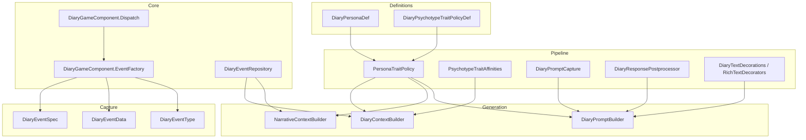
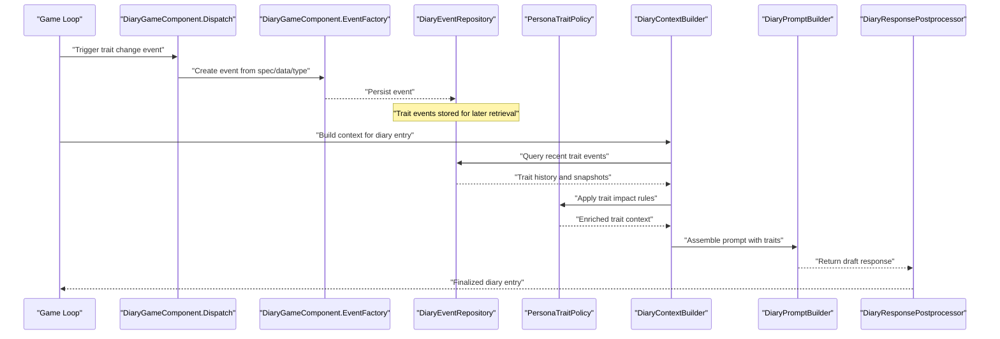
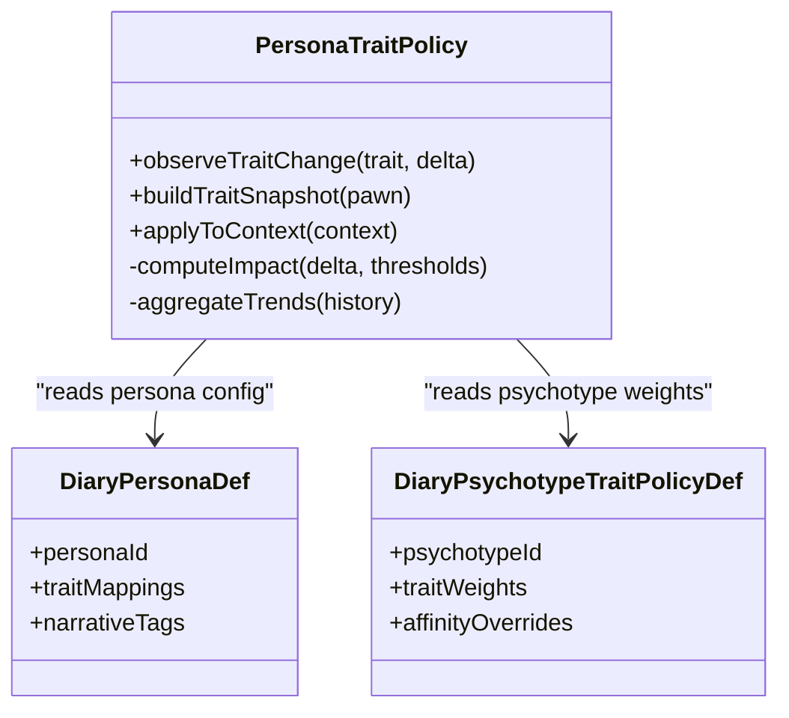
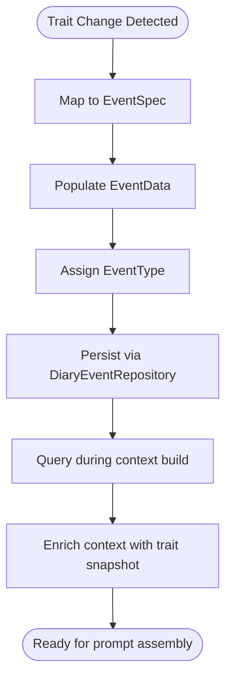
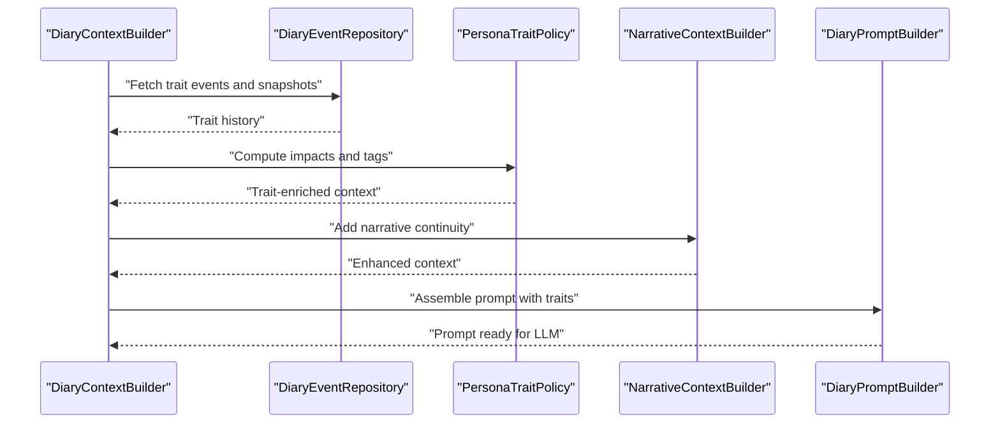
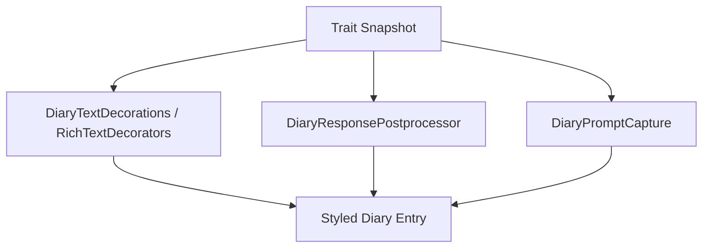
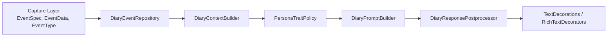

# Persona Trait Tracking

- [PersonaTraitPolicy.cs](../../../../../../Source/Pipeline/Royalty/PersonaTraitPolicy.cs)
- [DiaryPersonaDef.cs](../../../../../../Source/Defs/DiaryPersonaDef.cs)
- [DiaryPsychotypeTraitPolicyDef.cs](../../../../../../Source/Defs/DiaryPsychotypeTraitPolicyDef.cs)
- [PsychotypeTraitAffinities.cs](../../../../../../Source/Pipeline/PsychotypeTraitAffinities.cs)
- [DiaryContextBuilder.cs](../../../../../../Source/Generation/DiaryContextBuilder.cs)
- [NarrativeContextBuilder.cs](../../../../../../Source/Generation/NarrativeContextBuilder.cs)
- [DiaryPromptBuilder.cs](../../../../../../Source/Generation/DiaryPromptBuilder.cs)
- [DiaryEventRepository.cs](../../../../../../Source/Core/DiaryEventRepository.cs)
- [DiaryGameComponent.Generation.cs](../../../../../../Source/Core/DiaryGameComponent.Generation.cs)
- [DiaryGameComponent.Dispatch.cs](../../../../../../Source/Core/DiaryGameComponent.Dispatch.cs)
- [DiaryGameComponent.EventFactory.cs](../../../../../../Source/Core/DiaryGameComponent.EventFactory.cs)
- DiaryEventSpec.cs
- [DiaryEventData.cs](../../../../../../Source/Capture/DiaryEventData.cs)
- [DiaryEventType.cs](../../../../../../Source/Capture/DiaryEventType.cs)
- [DiaryPromptCapture.cs](../../../../../../Source/Pipeline/DiaryPromptCapture.cs)
- [DiaryResponsePostprocessor.cs](../../../../../../Source/Pipeline/DiaryResponsePostprocessor.cs)
- [DiaryTextDecorations.cs](../../../../../../Source/Pipeline/DiaryTextDecorations.cs)
- [DiaryRichTextDecorators.cs](../../../../../../Source/Pipeline/DiaryRichTextDecorators.cs)
## Table of Contents
1. [Introduction](#introduction)
2. [Project Structure](#project-structure)
3. [Core Components](#core-components)
4. [Architecture Overview](#architecture-overview)
5. [Detailed Component Analysis](#detailed-component-analysis)
6. [Dependency Analysis](#dependency-analysis)
7. [Performance Considerations](#performance-considerations)
8. [Troubleshooting Guide](#troubleshooting-guide)
9. [Conclusion](#conclusion)
10. [Appendices](#appendices)

## Introduction
This document explains how the persona trait tracking system captures, stores, and utilizes personality traits to influence diary entry generation. It focuses on monitoring trait changes through a dedicated policy, integrating traits into narrative context, and customizing diary content based on trait values and combinations. Guidance is provided for defining custom traits and integrating with external personality systems.

## Project Structure
The persona trait tracking system spans several layers:
- Definitions: Data contracts for personas, psychotypes, and trait policies
- Pipeline: Policies that observe trait changes and enrich prompts
- Generation: Context builders and prompt assembly that incorporate traits
- Core: Event dispatching and repositories that persist and retrieve events
- UI and Settings: Optional surfaces for tuning and inspection

**Diagram sources**
- [PersonaTraitPolicy.cs](../../../../../../Source/Pipeline/Royalty/PersonaTraitPolicy.cs)
- [DiaryPersonaDef.cs](../../../../../../Source/Defs/DiaryPersonaDef.cs)
- [DiaryPsychotypeTraitPolicyDef.cs](../../../../../../Source/Defs/DiaryPsychotypeTraitPolicyDef.cs)
- [PsychotypeTraitAffinities.cs](../../../../../../Source/Pipeline/PsychotypeTraitAffinities.cs)
- [DiaryContextBuilder.cs](../../../../../../Source/Generation/DiaryContextBuilder.cs)
- [NarrativeContextBuilder.cs](../../../../../../Source/Generation/NarrativeContextBuilder.cs)
- [DiaryPromptBuilder.cs](../../../../../../Source/Generation/DiaryPromptBuilder.cs)
- [DiaryPromptCapture.cs](../../../../../../Source/Pipeline/DiaryPromptCapture.cs)
- [DiaryResponsePostprocessor.cs](../../../../../../Source/Pipeline/DiaryResponsePostprocessor.cs)
- [DiaryTextDecorations.cs](../../../../../../Source/Pipeline/DiaryTextDecorations.cs)
- [DiaryRichTextDecorators.cs](../../../../../../Source/Pipeline/DiaryRichTextDecorators.cs)
- [DiaryGameComponent.Dispatch.cs](../../../../../../Source/Core/DiaryGameComponent.Dispatch.cs)
- [DiaryGameComponent.EventFactory.cs](../../../../../../Source/Core/DiaryGameComponent.EventFactory.cs)
- [DiaryEventRepository.cs](../../../../../../Source/Core/DiaryEventRepository.cs)
- DiaryEventSpec.cs
- [DiaryEventData.cs](../../../../../../Source/Capture/DiaryEventData.cs)
- [DiaryEventType.cs](../../../../../../Source/Capture/DiaryEventType.cs)

**Section sources**
- [PersonaTraitPolicy.cs](../../../../../../Source/Pipeline/Royalty/PersonaTraitPolicy.cs)
- [DiaryPersonaDef.cs](../../../../../../Source/Defs/DiaryPersonaDef.cs)
- [DiaryPsychotypeTraitPolicyDef.cs](../../../../../../Source/Defs/DiaryPsychotypeTraitPolicyDef.cs)
- [PsychotypeTraitAffinities.cs](../../../../../../Source/Pipeline/PsychotypeTraitAffinities.cs)
- [DiaryContextBuilder.cs](../../../../../../Source/Generation/DiaryContextBuilder.cs)
- [NarrativeContextBuilder.cs](../../../../../../Source/Generation/NarrativeContextBuilder.cs)
- [DiaryPromptBuilder.cs](../../../../../../Source/Generation/DiaryPromptBuilder.cs)
- [DiaryPromptCapture.cs](../../../../../../Source/Pipeline/DiaryPromptCapture.cs)
- [DiaryResponsePostprocessor.cs](../../../../../../Source/Pipeline/DiaryResponsePostprocessor.cs)
- [DiaryTextDecorations.cs](../../../../../../Source/Pipeline/DiaryTextDecorations.cs)
- [DiaryRichTextDecorators.cs](../../../../../../Source/Pipeline/DiaryRichTextDecorators.cs)
- [DiaryGameComponent.Dispatch.cs](../../../../../../Source/Core/DiaryGameComponent.Dispatch.cs)
- [DiaryGameComponent.EventFactory.cs](../../../../../../Source/Core/DiaryGameComponent.EventFactory.cs)
- [DiaryEventRepository.cs](../../../../../../Source/Core/DiaryEventRepository.cs)
- DiaryEventSpec.cs
- [DiaryEventData.cs](../../../../../../Source/Capture/DiaryEventData.cs)
- [DiaryEventType.cs](../../../../../../Source/Capture/DiaryEventType.cs)

## Core Components
- PersonaTraitPolicy: Observes trait changes and records their narrative impact for later use in diary entries.
- DiaryPersonaDef: Defines persona metadata used by trait policies and context builders.
- DiaryPsychotypeTraitPolicyDef: Configures how psychotype-related traits are captured and weighted.
- PsychotypeTraitAffinities: Encodes affinities between traits and psychotype dimensions to influence tone and focus.
- DiaryContextBuilder and NarrativeContextBuilder: Assemble trait-aware context for prompt generation.
- DiaryPromptBuilder: Integrates trait signals into the final prompt structure.
- Capture layer (EventSpec, EventData, EventType): Standardizes how trait-related events are represented.
- Core orchestration (Dispatch, EventFactory, Repository): Schedules, constructs, and persists trait events.

**Section sources**
- [PersonaTraitPolicy.cs](../../../../../../Source/Pipeline/Royalty/PersonaTraitPolicy.cs)
- [DiaryPersonaDef.cs](../../../../../../Source/Defs/DiaryPersonaDef.cs)
- [DiaryPsychotypeTraitPolicyDef.cs](../../../../../../Source/Defs/DiaryPsychotypeTraitPolicyDef.cs)
- [PsychotypeTraitAffinities.cs](../../../../../../Source/Pipeline/PsychotypeTraitAffinities.cs)
- [DiaryContextBuilder.cs](../../../../../../Source/Generation/DiaryContextBuilder.cs)
- [NarrativeContextBuilder.cs](../../../../../../Source/Generation/NarrativeContextBuilder.cs)
- [DiaryPromptBuilder.cs](../../../../../../Source/Generation/DiaryPromptBuilder.cs)
- DiaryEventSpec.cs
- [DiaryEventData.cs](../../../../../../Source/Capture/DiaryEventData.cs)
- [DiaryEventType.cs](../../../../../../Source/Capture/DiaryEventType.cs)
- [DiaryGameComponent.Dispatch.cs](../../../../../../Source/Core/DiaryGameComponent.Dispatch.cs)
- [DiaryGameComponent.EventFactory.cs](../../../../../../Source/Core/DiaryGameComponent.EventFactory.cs)
- [DiaryEventRepository.cs](../../../../../../Source/Core/DiaryEventRepository.cs)

## Architecture Overview
The system follows a capture-process-generate pipeline:
- Events representing trait changes are captured via specs and data structures.
- The dispatch and event factory schedule and construct these events.
- The repository persists them for retrieval during generation.
- During generation, context builders pull trait information and build prompts.
- Postprocessors and text decorators refine output based on traits.

**Diagram sources**
- [DiaryGameComponent.Dispatch.cs](../../../../../../Source/Core/DiaryGameComponent.Dispatch.cs)
- [DiaryGameComponent.EventFactory.cs](../../../../../../Source/Core/DiaryGameComponent.EventFactory.cs)
- [DiaryEventRepository.cs](../../../../../../Source/Core/DiaryEventRepository.cs)
- [PersonaTraitPolicy.cs](../../../../../../Source/Pipeline/Royalty/PersonaTraitPolicy.cs)
- [DiaryContextBuilder.cs](../../../../../../Source/Generation/DiaryContextBuilder.cs)
- [DiaryPromptBuilder.cs](../../../../../../Source/Generation/DiaryPromptBuilder.cs)
- [DiaryResponsePostprocessor.cs](../../../../../../Source/Pipeline/DiaryResponsePostprocessor.cs)

## Detailed Component Analysis

### PersonaTraitPolicy
Purpose:
- Monitor trait changes for pawns and record their narrative significance.
- Provide structured trait deltas and summaries to context builders.
- Influence prompt weighting and narrative continuity based on observed shifts.

Key responsibilities:
- Detect when a trait value crosses thresholds or flips polarity.
- Aggregate short-term and long-term trait trends.
- Emit contextual annotations for prompt builders and postprocessors.

Integration points:
- Consumed by context builders during prompt assembly.
- Can be extended via definitions to customize thresholds and weights.

**Diagram sources**
- [PersonaTraitPolicy.cs](../../../../../../Source/Pipeline/Royalty/PersonaTraitPolicy.cs)
- [DiaryPersonaDef.cs](../../../../../../Source/Defs/DiaryPersonaDef.cs)
- [DiaryPsychotypeTraitPolicyDef.cs](../../../../../../Source/Defs/DiaryPsychotypeTraitPolicyDef.cs)

**Section sources**
- [PersonaTraitPolicy.cs](../../../../../../Source/Pipeline/Royalty/PersonaTraitPolicy.cs)
- [DiaryPersonaDef.cs](../../../../../../Source/Defs/DiaryPersonaDef.cs)
- [DiaryPsychotypeTraitPolicyDef.cs](../../../../../../Source/Defs/DiaryPsychotypeTraitPolicyDef.cs)

### Trait Capture and Storage
Traits are captured using standardized event specifications and data models:
- EventSpec defines the shape of a trait event.
- EventData carries payload details such as pawn identifiers, trait keys, and values.
- EventType categorizes the nature of the event for routing and filtering.

Storage and retrieval:
- Events are persisted via the repository and queried during context building.
- Recent events are prioritized to reflect immediate influences on narrative tone.

**Diagram sources**
- DiaryEventSpec.cs
- [DiaryEventData.cs](../../../../../../Source/Capture/DiaryEventData.cs)
- [DiaryEventType.cs](../../../../../../Source/Capture/DiaryEventType.cs)
- [DiaryEventRepository.cs](../../../../../../Source/Core/DiaryEventRepository.cs)

**Section sources**
- DiaryEventSpec.cs
- [DiaryEventData.cs](../../../../../../Source/Capture/DiaryEventData.cs)
- [DiaryEventType.cs](../../../../../../Source/Capture/DiaryEventType.cs)
- [DiaryEventRepository.cs](../../../../../../Source/Core/DiaryEventRepository.cs)

### Context Building and Prompt Assembly
Context builders integrate trait information into the narrative:
- DiaryContextBuilder aggregates trait snapshots, recent events, and persona metadata.
- NarrativeContextBuilder adds broader narrative continuity and references.
- DiaryPromptBuilder composes the final prompt, embedding trait-driven cues and constraints.

**Diagram sources**
- [DiaryContextBuilder.cs](../../../../../../Source/Generation/DiaryContextBuilder.cs)
- [NarrativeContextBuilder.cs](../../../../../../Source/Generation/NarrativeContextBuilder.cs)
- [DiaryPromptBuilder.cs](../../../../../../Source/Generation/DiaryPromptBuilder.cs)
- [PersonaTraitPolicy.cs](../../../../../../Source/Pipeline/Royalty/PersonaTraitPolicy.cs)
- [DiaryEventRepository.cs](../../../../../../Source/Core/DiaryEventRepository.cs)

**Section sources**
- [DiaryContextBuilder.cs](../../../../../../Source/Generation/DiaryContextBuilder.cs)
- [NarrativeContextBuilder.cs](../../../../../../Source/Generation/NarrativeContextBuilder.cs)
- [DiaryPromptBuilder.cs](../../../../../../Source/Generation/DiaryPromptBuilder.cs)
- [PersonaTraitPolicy.cs](../../../../../../Source/Pipeline/Royalty/PersonaTraitPolicy.cs)
- [DiaryEventRepository.cs](../../../../../../Source/Core/DiaryEventRepository.cs)

### Trait-Based Content Customization
Customization mechanisms:
- Text decorations and rich text decorators can highlight trait-relevant phrases or emphasize emotional tone.
- Response postprocessing can adjust phrasing based on trait affinities and recent deltas.
- Prompt capture can inject trait-specific instructions or examples into the prompt.

**Diagram sources**
- [DiaryTextDecorations.cs](../../../../../../Source/Pipeline/DiaryTextDecorations.cs)
- [DiaryRichTextDecorators.cs](../../../../../../Source/Pipeline/DiaryRichTextDecorators.cs)
- [DiaryResponsePostprocessor.cs](../../../../../../Source/Pipeline/DiaryResponsePostprocessor.cs)
- [DiaryPromptCapture.cs](../../../../../../Source/Pipeline/DiaryPromptCapture.cs)

**Section sources**
- [DiaryTextDecorations.cs](../../../../../../Source/Pipeline/DiaryTextDecorations.cs)
- [DiaryRichTextDecorators.cs](../../../../../../Source/Pipeline/DiaryRichTextDecorators.cs)
- [DiaryResponsePostprocessor.cs](../../../../../../Source/Pipeline/DiaryResponsePostprocessor.cs)
- [DiaryPromptCapture.cs](../../../../../../Source/Pipeline/DiaryPromptCapture.cs)

### Examples of Trait Effects and Evolution
- Single-trait emphasis: A high “Bravery” trait may lead to more assertive language and risk-focused reflections.
- Trait combination effects: Combining “Compassion” and “Paranoid” can produce cautious empathy, reflected in nuanced wording and hedging.
- Personality evolution: Repeated increases in “Determination” over time shift narrative tone toward resilience and goal-oriented reflection.

These patterns are achieved by:
- Using PsychotypeTraitAffinities to weight trait contributions.
- Applying PersonaTraitPolicy to compute deltas and trend summaries.
- Injecting trait cues into prompts and refining outputs via postprocessors and decorators.

[No sources needed since this section provides conceptual examples]

### Custom Trait Definitions and External Integration
Guidance:
- Define new traits via persona and psychotype trait policy definitions to map external trait IDs to internal keys and weights.
- Use affinity mappings to align external personality dimensions with narrative tone preferences.
- Integrate external systems by emitting trait change events through the capture layer and ensuring they are persisted and retrievable by context builders.

Steps:
- Create mapping definitions linking external trait identifiers to internal trait keys.
- Configure weights and thresholds in psychotype trait policy definitions.
- Emit events using the standard event spec and data structures.
- Validate that context builders pick up the new traits during generation.

**Section sources**
- [DiaryPersonaDef.cs](../../../../../../Source/Defs/DiaryPersonaDef.cs)
- [DiaryPsychotypeTraitPolicyDef.cs](../../../../../../Source/Defs/DiaryPsychotypeTraitPolicyDef.cs)
- [PsychotypeTraitAffinities.cs](../../../../../../Source/Pipeline/PsychotypeTraitAffinities.cs)
- DiaryEventSpec.cs
- [DiaryEventData.cs](../../../../../../Source/Capture/DiaryEventData.cs)
- [DiaryEventRepository.cs](../../../../../../Source/Core/DiaryEventRepository.cs)

## Dependency Analysis
The persona trait system depends on well-defined interfaces across capture, pipeline, and generation layers. Cohesion is maintained within each component, while coupling occurs primarily through context builders and repositories.

**Diagram sources**
- DiaryEventSpec.cs
- [DiaryEventData.cs](../../../../../../Source/Capture/DiaryEventData.cs)
- [DiaryEventType.cs](../../../../../../Source/Capture/DiaryEventType.cs)
- [DiaryEventRepository.cs](../../../../../../Source/Core/DiaryEventRepository.cs)
- [DiaryContextBuilder.cs](../../../../../../Source/Generation/DiaryContextBuilder.cs)
- [PersonaTraitPolicy.cs](../../../../../../Source/Pipeline/Royalty/PersonaTraitPolicy.cs)
- [DiaryPromptBuilder.cs](../../../../../../Source/Generation/DiaryPromptBuilder.cs)
- [DiaryResponsePostprocessor.cs](../../../../../../Source/Pipeline/DiaryResponsePostprocessor.cs)
- [DiaryTextDecorations.cs](../../../../../../Source/Pipeline/DiaryTextDecorations.cs)
- [DiaryRichTextDecorators.cs](../../../../../../Source/Pipeline/DiaryRichTextDecorators.cs)

**Section sources**
- DiaryEventSpec.cs
- [DiaryEventData.cs](../../../../../../Source/Capture/DiaryEventData.cs)
- [DiaryEventType.cs](../../../../../../Source/Capture/DiaryEventType.cs)
- [DiaryEventRepository.cs](../../../../../../Source/Core/DiaryEventRepository.cs)
- [DiaryContextBuilder.cs](../../../../../../Source/Generation/DiaryContextBuilder.cs)
- [PersonaTraitPolicy.cs](../../../../../../Source/Pipeline/Royalty/PersonaTraitPolicy.cs)
- [DiaryPromptBuilder.cs](../../../../../../Source/Generation/DiaryPromptBuilder.cs)
- [DiaryResponsePostprocessor.cs](../../../../../../Source/Pipeline/DiaryResponsePostprocessor.cs)
- [DiaryTextDecorations.cs](../../../../../../Source/Pipeline/DiaryTextDecorations.cs)
- [DiaryRichTextDecorators.cs](../../../../../../Source/Pipeline/DiaryRichTextDecorators.cs)

## Performance Considerations
- Batch trait updates where possible to reduce event volume and repository writes.
- Cache trait snapshots at the context builder level to avoid repeated queries.
- Limit the window of recent events considered to balance freshness with performance.
- Use affinity weights judiciously to prevent excessive computation during prompt assembly.

[No sources needed since this section provides general guidance]

## Troubleshooting Guide
Common issues and resolutions:
- Missing trait events: Ensure events are emitted using the correct spec and type, and that the repository persists them.
- Traits not influencing prompts: Verify that context builders query the repository and that PersonaTraitPolicy applies impacts.
- Inconsistent styling: Check text decorators and postprocessors for proper integration with trait signals.
- External integration gaps: Confirm mapping definitions exist for external trait IDs and that affinities are configured.

**Section sources**
- DiaryEventSpec.cs
- [DiaryEventData.cs](../../../../../../Source/Capture/DiaryEventData.cs)
- [DiaryEventType.cs](../../../../../../Source/Capture/DiaryEventType.cs)
- [DiaryEventRepository.cs](../../../../../../Source/Core/DiaryEventRepository.cs)
- [PersonaTraitPolicy.cs](../../../../../../Source/Pipeline/Royalty/PersonaTraitPolicy.cs)
- [DiaryContextBuilder.cs](../../../../../../Source/Generation/DiaryContextBuilder.cs)
- [DiaryPromptBuilder.cs](../../../../../../Source/Generation/DiaryPromptBuilder.cs)
- [DiaryResponsePostprocessor.cs](../../../../../../Source/Pipeline/DiaryResponsePostprocessor.cs)
- [DiaryTextDecorations.cs](../../../../../../Source/Pipeline/DiaryTextDecorations.cs)
- [DiaryRichTextDecorators.cs](../../../../../../Source/Pipeline/DiaryRichTextDecorators.cs)

## Conclusion
The persona trait tracking system integrates trait observation, storage, and utilization into diary generation through a cohesive pipeline. By leveraging PersonaTraitPolicy, context builders, and postprocessing components, it enables dynamic, trait-aware narratives. Custom traits and external integrations are supported via definitions and event emission, allowing flexible expansion and personalization.

[No sources needed since this section summarizes without analyzing specific files]

## Appendices
- For advanced tuning, review psychotype trait policy definitions and affinity mappings.
- For debugging, inspect event persistence and context enrichment steps.
- For extensibility, follow the established capture and decoration patterns.

[No sources needed since this section provides general guidance]
