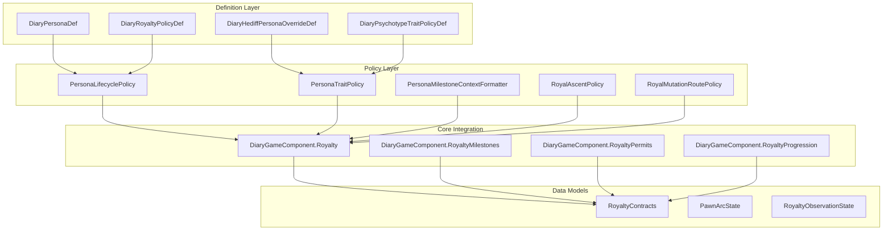
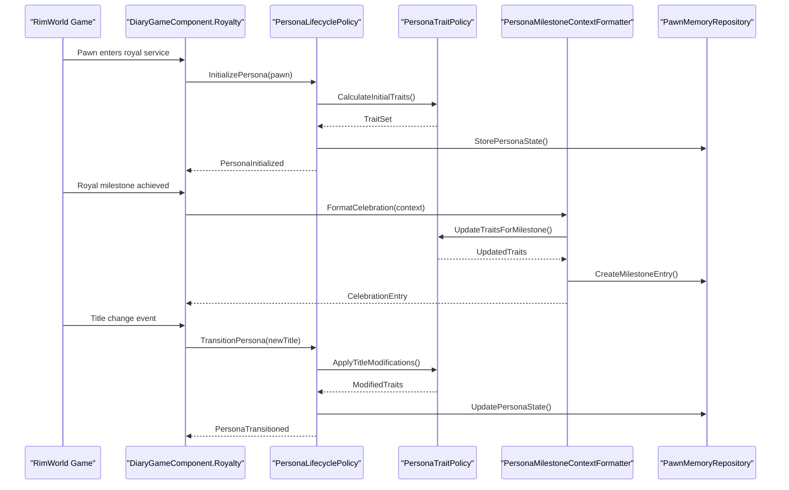
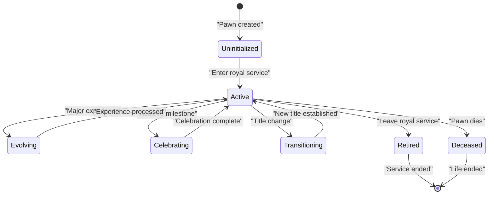
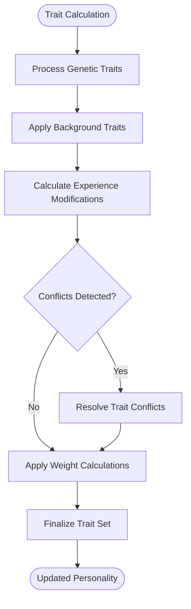
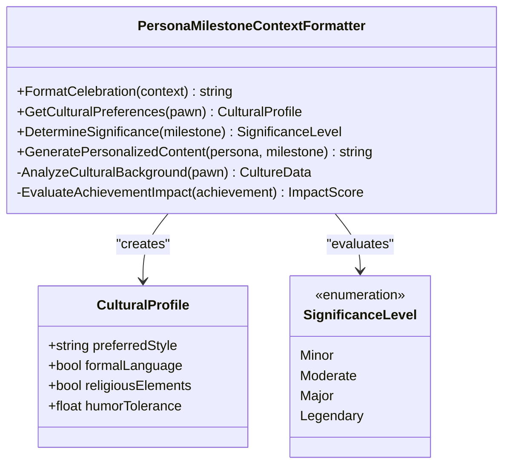
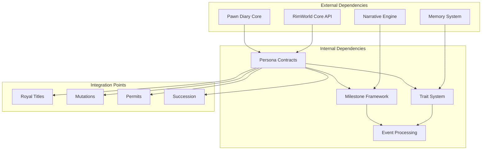

# Royal Persona Management

## Table of Contents
1. [Introduction](#introduction)
2. [Project Structure](#project-structure)
3. [Core Components](#core-components)
4. [Architecture Overview](#architecture-overview)
5. [Detailed Component Analysis](#detailed-component-analysis)
6. [Dependency Analysis](#dependency-analysis)
7. [Performance Considerations](#performance-considerations)
8. [Troubleshooting Guide](#troubleshooting-guide)
9. [Conclusion](#conclusion)
9. [Appendices](#appendices)

## Introduction

The Royal Persona Management system is a sophisticated framework within the Pawn Diary mod that manages the creation, tracking, and evolution of royal personas throughout a pawn's royal journey in RimWorld. This system provides dynamic personality adaptation, milestone celebration, trait inheritance, and seamless integration with various royal mechanics including titles, mutations, permits, and succession events.

The system operates through a policy-based architecture that allows for flexible customization and extensibility while maintaining consistency across different royal scenarios. It captures significant life events, adapts personality traits based on royal experiences, and generates meaningful diary entries that reflect the pawn's evolving identity as they navigate their royal path.

## Project Structure

The Royal Persona Management system is organized into several key architectural layers:

**Diagram sources**
- [DiaryPersonaDef.cs](../../../../../../Source/Defs/DiaryPersonaDef.cs)
- [PersonaLifecyclePolicy.cs](../../../../../../Source/Pipeline/Royalty/PersonaLifecyclePolicy.cs)
- [PersonaTraitPolicy.cs](../../../../../../Source/Pipeline/Royalty/PersonaTraitPolicy.cs)
- [PersonaMilestoneContextFormatter.cs](../../../../../../Source/Pipeline/Royalty/PersonaMilestoneContextFormatter.cs)
- [DiaryGameComponent.Royalty.cs](../../../../../../Source/Core/DiaryGameComponent.Royalty.cs)

**Section sources**
- [DiaryPersonaDef.cs](../../../../../../Source/Defs/DiaryPersonaDef.cs)
- [DiaryRoyaltyPolicyDef.cs](../../../../../../Source/Defs/DiaryRoyaltyPolicyDef.cs)
- [DiaryHediffPersonaOverrideDef.cs](../../../../../../Source/Defs/DiaryHediffPersonaOverrideDef.cs)
- [DiaryPsychotypeTraitPolicyDef.cs](../../../../../../Source/Defs/DiaryPsychotypeTraitPolicyDef.cs)

## Core Components

### Persona Lifecycle Management

The `PersonaLifecyclePolicy` serves as the central coordinator for persona creation, modification, and removal events throughout a pawn's royal journey. It handles the complete lifecycle from initial persona generation to eventual retirement or death.

Key responsibilities include:
- **Initial Persona Creation**: Establishing baseline personality traits when a pawn first enters royal service
- **Dynamic Adaptation**: Modifying personality characteristics based on royal experiences and achievements
- **Conflict Resolution**: Managing overlapping persona influences from multiple sources
- **Memory Integration**: Ensuring persona changes are properly reflected in diary entries and memory systems
- **Cleanup Procedures**: Handling persona removal during title transitions or pawn retirement

### Trait Tracking and Personality Evolution

The `PersonaTraitPolicy` manages the complex web of personality traits that define a royal persona. It tracks both inherited traits and those acquired through royal experiences, ensuring proper weight calculation and conflict resolution.

Core functionality encompasses:
- **Trait Inheritance**: Processing genetic and background trait inheritance patterns
- **Experience-Based Modification**: Adjusting traits based on royal milestones and events
- **Weight Calculation**: Determining the relative importance of different personality aspects
- **Conflict Resolution**: Handling contradictory traits and establishing priority rules
- **Diary Impact**: Influencing how personality traits affect narrative generation

### Milestone Celebration System

The `PersonaMilestoneContextFormatter` specializes in creating celebratory content for significant royal achievements. It transforms mechanical milestones into meaningful narrative moments that enhance player engagement.

Features include:
- **Achievement Recognition**: Identifying and celebrating major royal accomplishments
- **Contextual Formatting**: Adapting celebration messages to fit the pawn's current persona
- **Cultural Sensitivity**: Respecting cultural and personal preferences in celebration styles
- **Memory Integration**: Creating lasting impressions through memorable milestone entries
- **Customization Support**: Allowing for modder-defined celebration templates

**Section sources**
- [PersonaLifecyclePolicy.cs](../../../../../../Source/Pipeline/Royalty/PersonaLifecyclePolicy.cs)
- [PersonaTraitPolicy.cs](../../../../../../Source/Pipeline/Royalty/PersonaTraitPolicy.cs)
- [PersonaMilestoneContextFormatter.cs](../../../../../../Source/Pipeline/Royalty/PersonaMilestoneContextFormatter.cs)

## Architecture Overview

The Royal Persona Management system follows a layered architecture pattern that separates concerns while maintaining tight integration with the broader Pawn Diary ecosystem.

**Diagram sources**
- [DiaryGameComponent.Royalty.cs](../../../../../../Source/Core/DiaryGameComponent.Royalty.cs)
- [PersonaLifecyclePolicy.cs](../../../../../../Source/Pipeline/Royalty/PersonaLifecyclePolicy.cs)
- [PersonaTraitPolicy.cs](../../../../../../Source/Pipeline/Royalty/PersonaTraitPolicy.cs)
- [PersonaMilestoneContextFormatter.cs](../../../../../../Source/Pipeline/Royalty/PersonaMilestoneContextFormatter.cs)

The system integrates with multiple royal subsystems through well-defined contracts and policies, ensuring consistent behavior across different royal mechanics while allowing for specialized handling of unique scenarios.

## Detailed Component Analysis

### Persona Lifecycle Policy Implementation

The `PersonaLifecyclePolicy` implements a state machine pattern to manage the various phases of a royal persona's existence. Each phase has specific entry and exit conditions, along with associated data transformations.

**Diagram sources**
- [PersonaLifecyclePolicy.cs](../../../../../../Source/Pipeline/Royalty/PersonaLifecyclePolicy.cs)

The policy coordinates with other royal policies to ensure consistent state management across the entire royal system, preventing conflicts and maintaining data integrity.

### Trait Inheritance and Modification Patterns

The trait system supports complex inheritance patterns that combine genetic predispositions with acquired experiences. The implementation uses a weighted scoring system to determine final personality composition.

**Diagram sources**
- [PersonaTraitPolicy.cs](../../../../../../Source/Pipeline/Royalty/PersonaTraitPolicy.cs)

### Milestone Context Formatting

The milestone formatter creates culturally appropriate celebration content by analyzing the pawn's current persona, cultural background, and the significance of the achievement.

**Diagram sources**
- [PersonaMilestoneContextFormatter.cs](../../../../../../Source/Pipeline/Royalty/PersonaMilestoneContextFormatter.cs)

**Section sources**
- [PersonaLifecyclePolicy.cs](../../../../../../Source/Pipeline/Royalty/PersonaLifecyclePolicy.cs)
- [PersonaTraitPolicy.cs](../../../../../../Source/Pipeline/Royalty/PersonaTraitPolicy.cs)
- [PersonaMilestoneContextFormatter.cs](../../../../../../Source/Pipeline/Royalty/PersonaMilestoneContextFormatter.cs)

## Dependency Analysis

The Royal Persona Management system maintains careful dependency relationships to ensure modularity and testability while providing rich functionality.

**Diagram sources**
- [RoyaltyContracts.cs](../../../../../../Source/Pipeline/Royalty/RoyaltyContracts.cs)
- [DiaryGameComponent.Royalty.cs](../../../../../../Source/Core/DiaryGameComponent.Royalty.cs)

The system exhibits low coupling with external dependencies while maintaining high cohesion within its own components. This design facilitates testing, debugging, and future extensibility.

**Section sources**
- [RoyaltyContracts.cs](../../../../../../Source/Pipeline/Royalty/RoyaltyContracts.cs)
- [DiaryGameComponent.Royalty.cs](../../../../../../Source/Core/DiaryGameComponent.Royalty.cs)

## Performance Considerations

The Royal Persona Management system is designed with performance optimization in mind, particularly for long-running games where persona states may persist for thousands of game days.

Key performance strategies include:
- **Lazy Evaluation**: Trait calculations are performed only when needed, not continuously
- **State Caching**: Frequently accessed persona data is cached to reduce computation overhead
- **Batch Processing**: Multiple persona updates are batched together when possible
- **Memory Management**: Automatic cleanup of obsolete persona data during save/load cycles
- **Asynchronous Operations**: Heavy computations are deferred to off-peak processing times

The system also implements efficient serialization formats for save game compatibility, minimizing storage requirements while preserving all necessary state information.

## Troubleshooting Guide

### Common Persona Conflicts

When multiple persona influences compete for dominance, the system employs a priority resolution algorithm. Common issues include:

**Trait Contradictions**: When genetic traits conflict with acquired personality modifications, the system uses weighted scoring to determine precedence. Check the trait conflict logs for detailed resolution information.

**Memory Inconsistencies**: If diary entries don't reflect recent persona changes, verify that the memory repository is properly synchronized with the persona state.

**Milestone Duplication**: Ensure that milestone tracking doesn't create duplicate celebrations for the same achievement. The system includes deduplication logic, but custom milestones may require manual intervention.

### Memory Management Issues

Persona data persistence relies on careful memory management to prevent leaks and maintain performance:

**State Synchronization**: Verify that persona state changes are properly propagated to dependent systems like memory and narrative engines.

**Cleanup Procedures**: During title transitions or persona retirement, ensure all temporary data structures are properly disposed of.

**Save Game Compatibility**: When updating mods or game versions, check for persona state migration requirements to prevent corruption.

### Debugging Tools

The system includes comprehensive debugging capabilities accessible through the development interface:

- **Persona State Inspector**: View current persona configuration and active influences
- **Trait Conflict Analyzer**: Identify and resolve conflicting personality modifications
- **Milestone History**: Track all past celebrations and their impact on persona evolution
- **Performance Metrics**: Monitor computation costs and memory usage patterns

**Section sources**
- [PersonaLifecyclePolicy.cs](../../../../../../Source/Pipeline/Royalty/PersonaLifecyclePolicy.cs)
- [PersonaTraitPolicy.cs](../../../../../../Source/Pipeline/Royalty/PersonaTraitPolicy.cs)

## Conclusion

The Royal Persona Management system represents a sophisticated approach to character development in RimWorld, providing deep customization and meaningful progression opportunities for royal characters. Through its policy-based architecture, the system maintains flexibility while ensuring consistency across diverse royal scenarios.

The combination of lifecycle management, trait evolution, and milestone celebration creates a rich narrative experience that adapts to player choices and in-game events. The modular design facilitates easy extension and customization, making it suitable for both vanilla gameplay and complex modded environments.

Future enhancements could include more sophisticated personality modeling, additional cultural variations, and deeper integration with other character development systems. The current architecture provides a solid foundation for such expansions while maintaining backward compatibility and performance standards.

## Appendices

### Configuration Examples

The system supports extensive configuration through XML definitions and runtime settings, allowing for fine-tuned control over persona behavior and appearance.

### Integration Patterns

Common integration patterns for extending the royal persona system include:

- **Custom Trait Sources**: Adding new sources of personality influence
- **Alternative Milestone Types**: Defining custom achievement categories
- **Cultural Variations**: Implementing culture-specific persona behaviors
- **Mod Compatibility**: Ensuring smooth interaction with other character development mods

### API Reference

The public API provides controlled access to persona management functionality for mod developers, including methods for querying persona state, triggering updates, and accessing diagnostic information.
