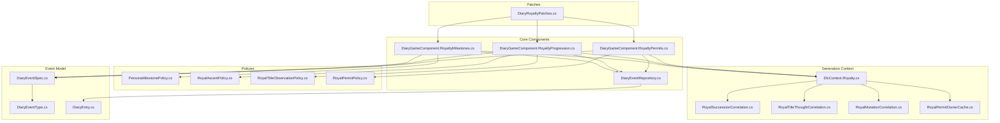
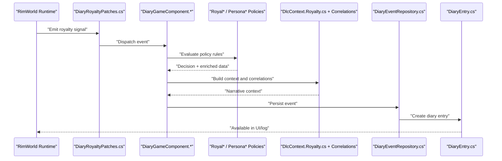
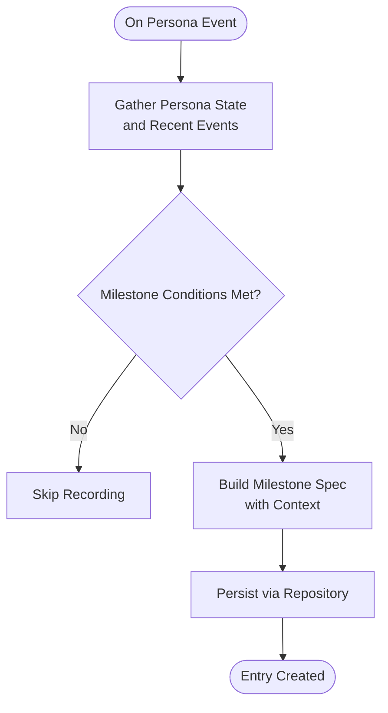
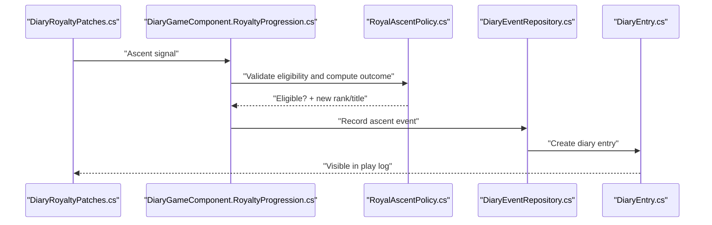
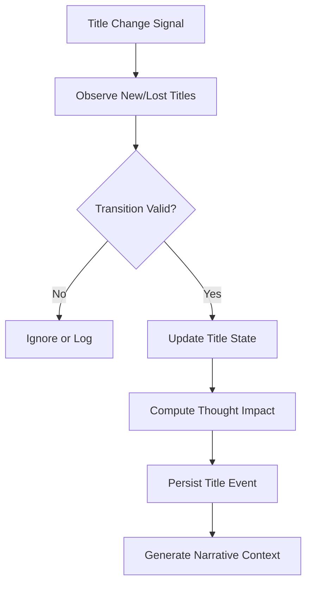
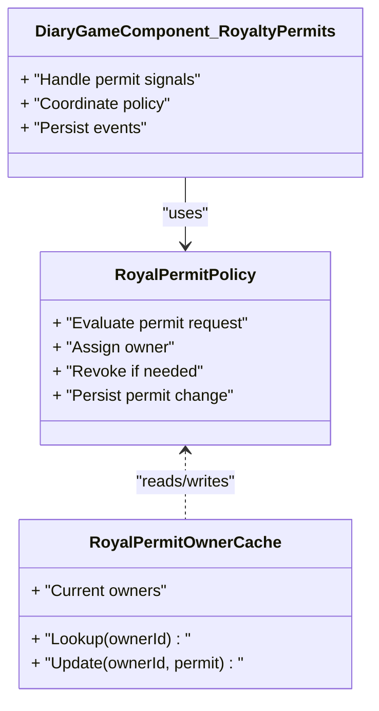
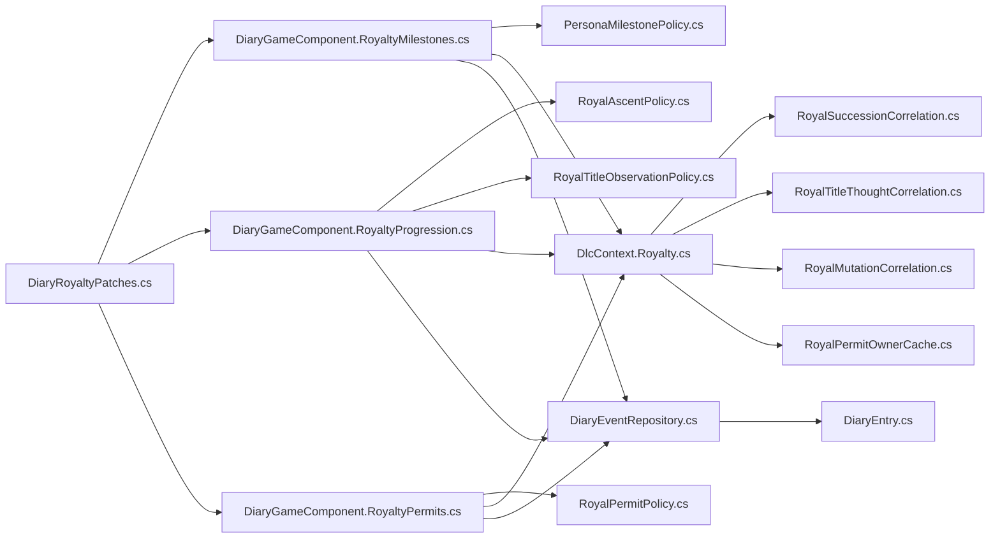

# Royal Progression & Milestones

- DiaryEventSpec.cs
- [DiaryEventType.cs](../../../../../Source/Capture/DiaryEventType.cs)
- [DiaryEventRepository.cs](../../../../../Source/Core/DiaryEventRepository.cs)
- [DiaryEntry.cs](../../../../../Source/Models/DiaryEntry.cs)
## Table of Contents
1. [Introduction](#introduction)
2. [Project Structure](#project-structure)
3. [Core Components](#core-components)
4. [Architecture Overview](#architecture-overview)
5. [Detailed Component Analysis](#detailed-component-analysis)
6. [Dependency Analysis](#dependency-analysis)
7. [Performance Considerations](#performance-considerations)
8. [Troubleshooting Guide](#troubleshooting-guide)
9. [Conclusion](#conclusion)
10. [Appendices](#appendices)

## Introduction
This document explains how royal achievements, title acquisitions, and ceremonial events are monitored and recorded across the game’s narrative system. It focuses on:
- Persona milestone tracking for individual pawns’ royal-related accomplishments
- Royal ascent (promotion) event handling
- Title monitoring and transitions
- Permit management for royal privileges

It also covers configuration options for thresholds and custom achievement definitions, and shows how these components integrate with the broader diary and narrative pipeline.

## Project Structure
The royal progression and milestones feature spans several layers:
- Patches capture in-game signals from the Royalty DLC
- Core game components orchestrate processing and persistence
- Policies implement domain-specific logic for milestones, ascent, titles, and permits
- Generation context enriches entries with correlations and narrative details
- Event specs and types define the canonical event model used throughout

**Diagram sources**
- [DiaryRoyaltyPatches.cs](../../../../../Source/Patches/DiaryRoyaltyPatches.cs)
- [DiaryGameComponent.RoyaltyMilestones.cs](../../../../../Source/Core/DiaryGameComponent.RoyaltyMilestones.cs)
- [DiaryGameComponent.RoyaltyProgression.cs](../../../../../Source/Core/DiaryGameComponent.RoyaltyProgression.cs)
- [DiaryGameComponent.RoyaltyPermits.cs](../../../../../Source/Core/DiaryGameComponent.RoyaltyPermits.cs)
- [PersonaMilestonePolicy.cs](../../../../../Source/Pipeline/Royalty/PersonaMilestonePolicy.cs)
- [RoyalAscentPolicy.cs](../../../../../Source/Pipeline/Royalty/RoyalAscentPolicy.cs)
- [RoyalTitleObservationPolicy.cs](../../../../../Source/Pipeline/Royalty/RoyalTitleObservationPolicy.cs)
- [RoyalPermitPolicy.cs](../../../../../Source/Pipeline/Royalty/RoyalPermitPolicy.cs)
- [DlcContext.Royalty.cs](../../../../../Source/Generation/DlcContext.Royalty.cs)
- [RoyalSuccessionCorrelation.cs](../../../../../Source/Generation/RoyalSuccessionCorrelation.cs)
- [RoyalTitleThoughtCorrelation.cs](../../../../../Source/Generation/RoyalTitleThoughtCorrelation.cs)
- [RoyalMutationCorrelation.cs](../../../../../Source/Generation/RoyalMutationCorrelation.cs)
- [RoyalPermitOwnerCache.cs](../../../../../Source/Generation/RoyalPermitOwnerCache.cs)
- DiaryEventSpec.cs
- [DiaryEventType.cs](../../../../../Source/Capture/DiaryEventType.cs)
- [DiaryEventRepository.cs](../../../../../Source/Core/DiaryEventRepository.cs)
- [DiaryEntry.cs](../../../../../Source/Models/DiaryEntry.cs)

**Section sources**
- [DiaryRoyaltyPatches.cs](../../../../../Source/Patches/DiaryRoyaltyPatches.cs)
- [DiaryGameComponent.RoyaltyMilestones.cs](../../../../../Source/Core/DiaryGameComponent.RoyaltyMilestones.cs)
- [DiaryGameComponent.RoyaltyProgression.cs](../../../../../Source/Core/DiaryGameComponent.RoyaltyProgression.cs)
- [DiaryGameComponent.RoyaltyPermits.cs](../../../../../Source/Core/DiaryGameComponent.RoyaltyPermits.cs)
- DiaryEventSpec.cs
- [DiaryEventType.cs](../../../../../Source/Capture/DiaryEventType.cs)
- [DiaryEventRepository.cs](../../../../../Source/Core/DiaryEventRepository.cs)
- [DiaryEntry.cs](../../../../../Source/Models/DiaryEntry.cs)

## Core Components
- DiaryGameComponent.RoyaltyMilestones: Coordinates persona milestone detection and recording.
- DiaryGameComponent.RoyaltyProgression: Manages royal ascent and title observation flows.
- DiaryGameComponent.RoyaltyPermits: Handles permit issuance, revocation, and ownership changes.
- Policies:
  - PersonaMilestonePolicy: Evaluates and records persona-level milestones.
  - RoyalAscentPolicy: Processes promotion events and updates state.
  - RoyalTitleObservationPolicy: Observes title acquisition and transitions.
  - RoyalPermitPolicy: Enforces permit rules and tracks ownership.

These components collaborate to transform low-level game signals into structured diary entries that feed the narrative engine.

**Section sources**
- [DiaryGameComponent.RoyaltyMilestones.cs](../../../../../Source/Core/DiaryGameComponent.RoyaltyMilestones.cs)
- [DiaryGameComponent.RoyaltyProgression.cs](../../../../../Source/Core/DiaryGameComponent.RoyaltyProgression.cs)
- [DiaryGameComponent.RoyaltyPermits.cs](../../../../../Source/Core/DiaryGameComponent.RoyaltyPermits.cs)
- [PersonaMilestonePolicy.cs](../../../../../Source/Pipeline/Royalty/PersonaMilestonePolicy.cs)
- [RoyalAscentPolicy.cs](../../../../../Source/Pipeline/Royalty/RoyalAscentPolicy.cs)
- [RoyalTitleObservationPolicy.cs](../../../../../Source/Pipeline/Royalty/RoyalTitleObservationPolicy.cs)
- [RoyalPermitPolicy.cs](../../../../../Source/Pipeline/Royalty/RoyalPermitPolicy.cs)

## Architecture Overview
The flow begins with patches capturing royalty-related signals from the game runtime. These signals are dispatched to core components, which apply policies to evaluate conditions, update state, and persist events. The generation layer enriches entries with contextual correlations before they are stored as diary entries.

**Diagram sources**
- [DiaryRoyaltyPatches.cs](../../../../../Source/Patches/DiaryRoyaltyPatches.cs)
- [DiaryGameComponent.RoyaltyMilestones.cs](../../../../../Source/Core/DiaryGameComponent.RoyaltyMilestones.cs)
- [DiaryGameComponent.RoyaltyProgression.cs](../../../../../Source/Core/DiaryGameComponent.RoyaltyProgression.cs)
- [DiaryGameComponent.RoyaltyPermits.cs](../../../../../Source/Core/DiaryGameComponent.RoyaltyPermits.cs)
- [PersonaMilestonePolicy.cs](../../../../../Source/Pipeline/Royalty/PersonaMilestonePolicy.cs)
- [RoyalAscentPolicy.cs](../../../../../Source/Pipeline/Royalty/RoyalAscentPolicy.cs)
- [RoyalTitleObservationPolicy.cs](../../../../../Source/Pipeline/Royalty/RoyalTitleObservationPolicy.cs)
- [RoyalPermitPolicy.cs](../../../../../Source/Pipeline/Royalty/RoyalPermitPolicy.cs)
- [DlcContext.Royalty.cs](../../../../../Source/Generation/DlcContext.Royalty.cs)
- [RoyalSuccessionCorrelation.cs](../../../../../Source/Generation/RoyalSuccessionCorrelation.cs)
- [RoyalTitleThoughtCorrelation.cs](../../../../../Source/Generation/RoyalTitleThoughtCorrelation.cs)
- [RoyalMutationCorrelation.cs](../../../../../Source/Generation/RoyalMutationCorrelation.cs)
- [RoyalPermitOwnerCache.cs](../../../../../Source/Generation/RoyalPermitOwnerCache.cs)
- [DiaryEventRepository.cs](../../../../../Source/Core/DiaryEventRepository.cs)
- [DiaryEntry.cs](../../../../../Source/Models/DiaryEntry.cs)

## Detailed Component Analysis

### Persona Milestone Tracking
Persona milestones capture significant personal achievements tied to a pawn’s royal journey (e.g., first coronation, notable ritual participation). The policy evaluates conditions against current state and emits a milestone event when thresholds are met.

**Diagram sources**
- [PersonaMilestonePolicy.cs](../../../../../Source/Pipeline/Royalty/PersonaMilestonePolicy.cs)
- [DiaryGameComponent.RoyaltyMilestones.cs](../../../../../Source/Core/DiaryGameComponent.RoyaltyMilestones.cs)
- DiaryEventSpec.cs
- [DiaryEventRepository.cs](../../../../../Source/Core/DiaryEventRepository.cs)

Key behaviors:
- Threshold evaluation based on persona history and recent events
- Deduplication to avoid duplicate milestone entries
- Integration with generation context for richer narrative lines

Configuration considerations:
- Milestone type catalog and thresholds are defined via policy and spec structures
- Custom achievement definitions can be added by extending the policy’s condition set and registering new spec variants

**Section sources**
- [PersonaMilestonePolicy.cs](../../../../../Source/Pipeline/Royalty/PersonaMilestonePolicy.cs)
- [DiaryGameComponent.RoyaltyMilestones.cs](../../../../../Source/Core/DiaryGameComponent.RoyaltyMilestones.cs)
- DiaryEventSpec.cs
- [DiaryEventRepository.cs](../../../../../Source/Core/DiaryEventRepository.cs)

### Royal Ascent (Promotion) Events
Royal ascent handles promotions such as ascending to higher ranks or receiving investiture. The ascent policy validates eligibility, updates state, and records the event.

**Diagram sources**
- [DiaryRoyaltyPatches.cs](../../../../../Source/Patches/DiaryRoyaltyPatches.cs)
- [DiaryGameComponent.RoyaltyProgression.cs](../../../../../Source/Core/DiaryGameComponent.RoyaltyProgression.cs)
- [RoyalAscentPolicy.cs](../../../../../Source/Pipeline/Royalty/RoyalAscentPolicy.cs)
- [DiaryEventRepository.cs](../../../../../Source/Core/DiaryEventRepository.cs)
- [DiaryEntry.cs](../../../../../Source/Models/DiaryEntry.cs)

Notes:
- Eligibility checks consider prior rank, rituals, and colony status
- Succession correlation may influence outcomes and narrative framing

**Section sources**
- [DiaryGameComponent.RoyaltyProgression.cs](../../../../../Source/Core/DiaryGameComponent.RoyaltyProgression.cs)
- [RoyalAscentPolicy.cs](../../../../../Source/Pipeline/Royalty/RoyalAscentPolicy.cs)
- [RoyalSuccessionCorrelation.cs](../../../../../Source/Generation/RoyalSuccessionCorrelation.cs)

### Title Monitoring and Transitions
Title observation tracks when a pawn gains, loses, or changes titles. It integrates with thought correlations to reflect social impact.

**Diagram sources**
- [RoyalTitleObservationPolicy.cs](../../../../../Source/Pipeline/Royalty/RoyalTitleObservationPolicy.cs)
- [RoyalTitleThoughtCorrelation.cs](../../../../../Source/Generation/RoyalTitleThoughtCorrelation.cs)
- [DiaryGameComponent.RoyaltyProgression.cs](../../../../../Source/Core/DiaryGameComponent.RoyaltyProgression.cs)
- [DiaryEventRepository.cs](../../../../../Source/Core/DiaryEventRepository.cs)

Integration points:
- Thought correlation adjusts mood and narrative tone
- Context enrichment references succession and mutation background

**Section sources**
- [RoyalTitleObservationPolicy.cs](../../../../../Source/Pipeline/Royalty/RoyalTitleObservationPolicy.cs)
- [RoyalTitleThoughtCorrelation.cs](../../../../../Source/Generation/RoyalTitleThoughtCorrelation.cs)
- [DiaryGameComponent.RoyaltyProgression.cs](../../../../../Source/Core/DiaryGameComponent.RoyaltyProgression.cs)

### Permit Management
Permit policy manages issuance, revocation, and ownership changes for royal privileges. It ensures consistent ownership tracking and prevents conflicts.

**Diagram sources**
- [RoyalPermitPolicy.cs](../../../../../Source/Pipeline/Royalty/RoyalPermitPolicy.cs)
- [RoyalPermitOwnerCache.cs](../../../../../Source/Generation/RoyalPermitOwnerCache.cs)
- [DiaryGameComponent.RoyaltyPermits.cs](../../../../../Source/Core/DiaryGameComponent.RoyaltyPermits.cs)

Operational notes:
- Ownership cache avoids redundant lookups
- Policy enforces rules like exclusivity and validity windows
- Events are persisted for historical continuity

**Section sources**
- [RoyalPermitPolicy.cs](../../../../../Source/Pipeline/Royalty/RoyalPermitPolicy.cs)
- [RoyalPermitOwnerCache.cs](../../../../../Source/Generation/RoyalPermitOwnerCache.cs)
- [DiaryGameComponent.RoyaltyPermits.cs](../../../../../Source/Core/DiaryGameComponent.RoyaltyPermits.cs)

### Configuration Options and Custom Achievements
- Milestone thresholds: Defined within policy and spec structures; adjust conditions and counts to tune sensitivity.
- Custom achievement definitions: Extend the policy’s condition set and register new spec variants to introduce bespoke milestones.
- Permit rules: Governed by policy logic and owner cache behavior; modify to support additional permit types or constraints.
- Title transitions: Controlled by observation policy and thought correlation; customize narrative impact and transition validation.

Where to configure:
- Policy files for rule sets and thresholds
- Event spec definitions for new milestone types
- Generation context for enriched narrative fields

**Section sources**
- [PersonaMilestonePolicy.cs](../../../../../Source/Pipeline/Royalty/PersonaMilestonePolicy.cs)
- [RoyalAscentPolicy.cs](../../../../../Source/Pipeline/Royalty/RoyalAscentPolicy.cs)
- [RoyalTitleObservationPolicy.cs](../../../../../Source/Pipeline/Royalty/RoyalTitleObservationPolicy.cs)
- [RoyalPermitPolicy.cs](../../../../../Source/Pipeline/Royalty/RoyalPermitPolicy.cs)
- DiaryEventSpec.cs

## Dependency Analysis
The royal subsystem depends on:
- Patches for signal ingestion
- Core components for orchestration
- Policies for domain logic
- Generation context for narrative enrichment
- Repositories and models for persistence

**Diagram sources**
- [DiaryRoyaltyPatches.cs](../../../../../Source/Patches/DiaryRoyaltyPatches.cs)
- [DiaryGameComponent.RoyaltyMilestones.cs](../../../../../Source/Core/DiaryGameComponent.RoyaltyMilestones.cs)
- [DiaryGameComponent.RoyaltyProgression.cs](../../../../../Source/Core/DiaryGameComponent.RoyaltyProgression.cs)
- [DiaryGameComponent.RoyaltyPermits.cs](../../../../../Source/Core/DiaryGameComponent.RoyaltyPermits.cs)
- [PersonaMilestonePolicy.cs](../../../../../Source/Pipeline/Royalty/PersonaMilestonePolicy.cs)
- [RoyalAscentPolicy.cs](../../../../../Source/Pipeline/Royalty/RoyalAscentPolicy.cs)
- [RoyalTitleObservationPolicy.cs](../../../../../Source/Pipeline/Royalty/RoyalTitleObservationPolicy.cs)
- [RoyalPermitPolicy.cs](../../../../../Source/Pipeline/Royalty/RoyalPermitPolicy.cs)
- [DlcContext.Royalty.cs](../../../../../Source/Generation/DlcContext.Royalty.cs)
- [RoyalSuccessionCorrelation.cs](../../../../../Source/Generation/RoyalSuccessionCorrelation.cs)
- [RoyalTitleThoughtCorrelation.cs](../../../../../Source/Generation/RoyalTitleThoughtCorrelation.cs)
- [RoyalMutationCorrelation.cs](../../../../../Source/Generation/RoyalMutationCorrelation.cs)
- [RoyalPermitOwnerCache.cs](../../../../../Source/Generation/RoyalPermitOwnerCache.cs)
- [DiaryEventRepository.cs](../../../../../Source/Core/DiaryEventRepository.cs)
- [DiaryEntry.cs](../../../../../Source/Models/DiaryEntry.cs)

**Section sources**
- [DiaryRoyaltyPatches.cs](../../../../../Source/Patches/DiaryRoyaltyPatches.cs)
- [DiaryGameComponent.RoyaltyMilestones.cs](../../../../../Source/Core/DiaryGameComponent.RoyaltyMilestones.cs)
- [DiaryGameComponent.RoyaltyProgression.cs](../../../../../Source/Core/DiaryGameComponent.RoyaltyProgression.cs)
- [DiaryGameComponent.RoyaltyPermits.cs](../../../../../Source/Core/DiaryGameComponent.RoyaltyPermits.cs)
- [DiaryEventRepository.cs](../../../../../Source/Core/DiaryEventRepository.cs)
- [DiaryEntry.cs](../../../../../Source/Models/DiaryEntry.cs)

## Performance Considerations
- Minimize repeated lookups using caches (e.g., permit owner cache)
- Batch event creation where possible to reduce repository pressure
- Keep policy evaluations efficient by leveraging recent event summaries
- Avoid heavy computations during peak gameplay moments; defer to off-peak or background tasks

[No sources needed since this section provides general guidance]

## Troubleshooting Guide
Common issues and resolutions:
- Missing diary entries for royal events: Verify patch hooks are active and signals are being dispatched.
- Duplicate milestone entries: Check deduplication logic and ensure unique keys per milestone instance.
- Incorrect title thoughts: Validate thought correlation mappings and ensure title transitions are recognized.
- Permit ownership conflicts: Inspect owner cache consistency and policy enforcement rules.

Diagnostic steps:
- Confirm event types and specs match expected schemas
- Review repository persistence logs for errors
- Validate generation context inputs for required fields

**Section sources**
- [DiaryRoyaltyPatches.cs](../../../../../Source/Patches/DiaryRoyaltyPatches.cs)
- DiaryEventSpec.cs
- [DiaryEventRepository.cs](../../../../../Source/Core/DiaryEventRepository.cs)

## Conclusion
The royal progression and milestones system integrates patches, core components, policies, and generation context to record and narrate royal achievements, promotions, titles, and permits. By tuning thresholds and extending policies, modders can craft rich, personalized royal narratives aligned with their colonies’ stories.

[No sources needed since this section summarizes without analyzing specific files]

## Appendices

### Example Milestone Types and Progression Paths
- First Coronation: Triggered upon initial investiture; includes context about ceremony participants and colony morale impact.
- Ritual Mastery: Accumulated after participating in multiple key rituals; reflects growing prestige.
- Title Ascension: Records transitions between noble ranks; ties into thought adjustments and succession implications.
- Permit Grant/Revocation: Tracks privilege changes with ownership attribution and duration.

These examples map to policy conditions and event specs, enabling customization through configuration.

[No sources needed since this section provides conceptual examples]
