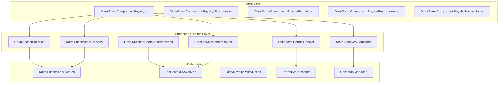
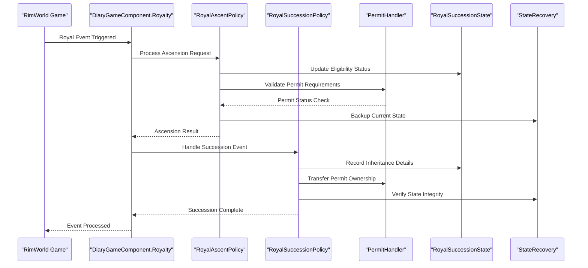
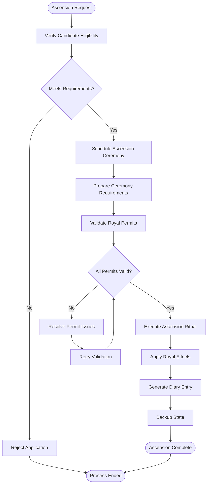
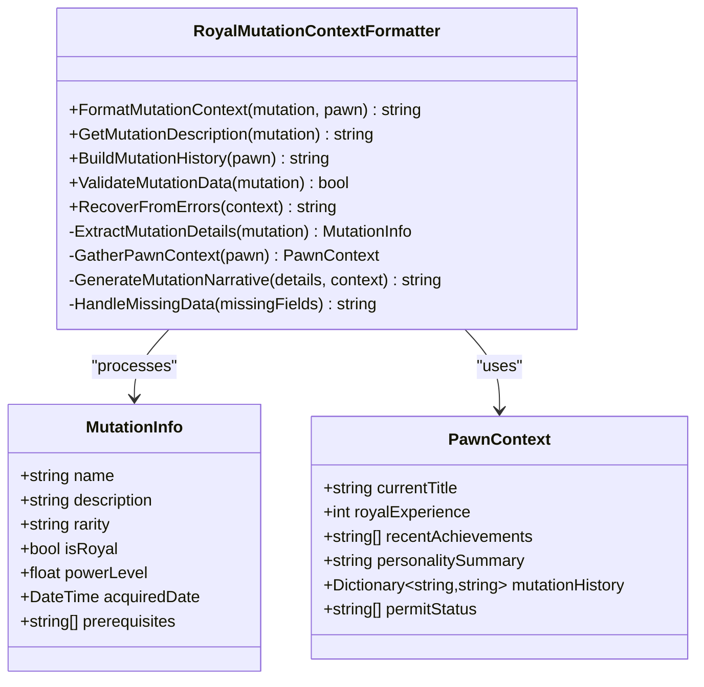
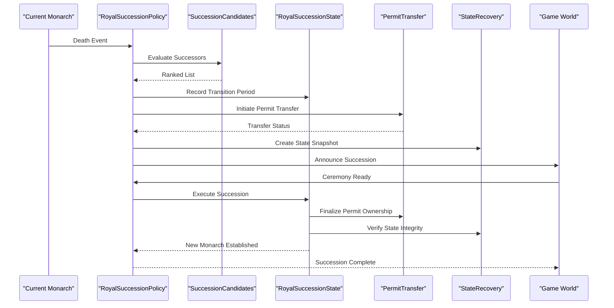
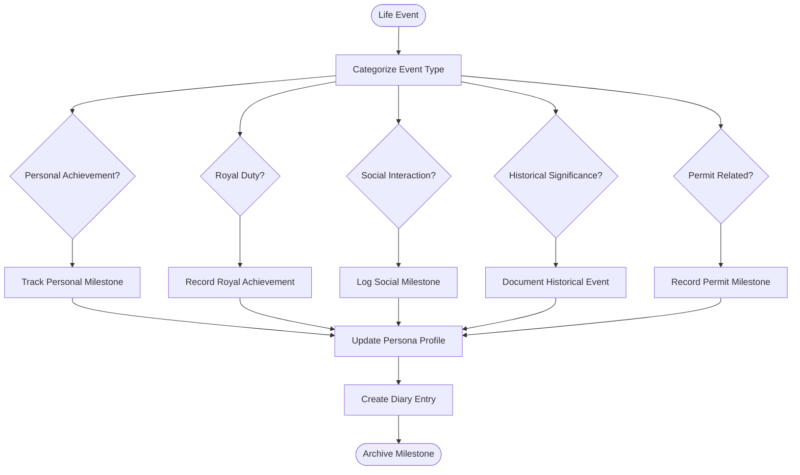
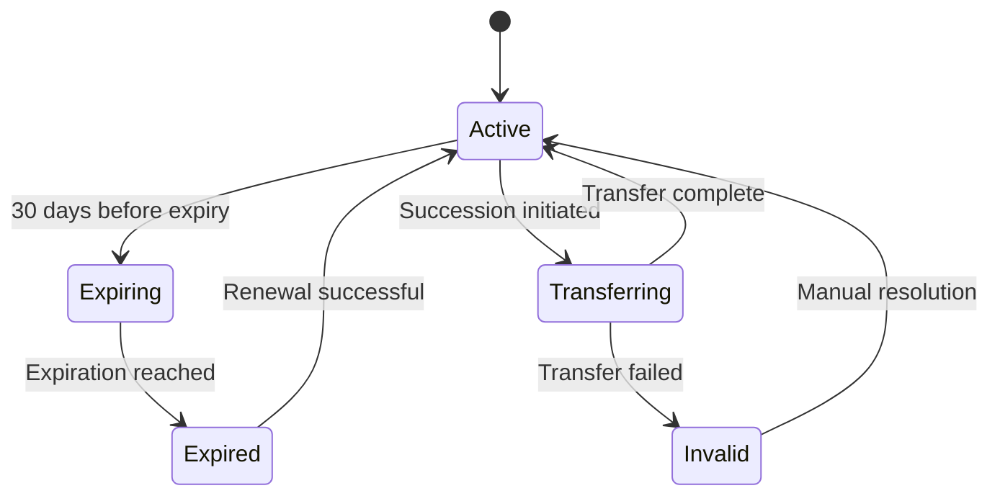
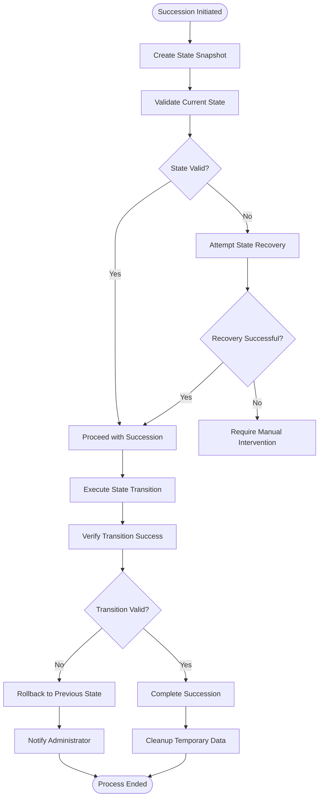
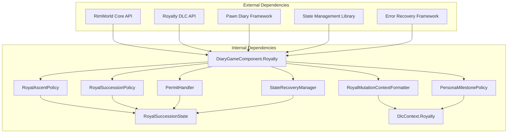

# Royalty Persona & Succession

- [RoyalAscentPolicy.cs](../../../../../Source/Pipeline/Royalty/RoyalAscentPolicy.cs)
- [RoyalMutationContextFormatter.cs](../../../../../Source/Pipeline/Royalty/RoyalMutationContextFormatter.cs)
- [RoyalSuccessionPolicy.cs](../../../../../Source/Pipeline/Royalty/RoyalSuccessionPolicy.cs)
- [PersonaMilestonePolicy.cs](../../../../../Source/Pipeline/Royalty/PersonaMilestonePolicy.cs)
- [DiaryGameComponent.Royalty.cs](../../../../../Source/Core/DiaryGameComponent.Royalty.cs)
- [DlcContext.Royalty.cs](../../../../../Source/Generation/DlcContext.Royalty.cs)
- [RoyalSuccessionState.cs](../../../../../Source/Models/RoyalSuccessionState.cs)
- [DiaryRoyaltyPolicyDef.cs](../../../../../Source/Defs/DiaryRoyaltyPolicyDef.cs)
- [DiaryGameComponent.RoyaltyMilestones.cs](../../../../../Source/Core/DiaryGameComponent.RoyaltyMilestones.cs)
- [DiaryGameComponent.RoyaltyPermits.cs](../../../../../Source/Core/DiaryGameComponent.RoyaltyPermits.cs)
- [DiaryGameComponent.RoyaltyProgression.cs](../../../../../Source/Core/DiaryGameComponent.RoyaltyProgression.cs)
- [DiaryGameComponent.RoyaltySuccession.cs](../../../../../Source/Core/DiaryGameComponent.RoyaltySuccession.cs)
## Update Summary
**Changes Made**
- Enhanced royal permit handling with improved state management and continuity tracking
- Expanded policy implementations for better succession state management
- Improved progression continuity across royal events and ceremonies
- Strengthened error handling and recovery mechanisms for royal transitions

## Table of Contents
1. [Introduction](#introduction)
2. [Project Structure](#project-structure)
3. [Core Components](#core-components)
4. [Architecture Overview](#architecture-overview)
5. [Detailed Component Analysis](#detailed-component-analysis)
6. [Enhanced Royal Permit System](#enhanced-royal-permit-system)
7. [Improved Succession State Management](#improved-succession-state-management)
8. [Progression Continuity Enhancements](#progression-continuity-enhancements)
9. [Dependency Analysis](#dependency-analysis)
10. [Performance Considerations](#performance-considerations)
11. [Troubleshooting Guide](#troubleshooting-guide)
12. [Configuration Options](#configuration-options)
13. [Conclusion](#conclusion)

## Introduction

This document provides comprehensive documentation for the enhanced Royalty DLC integration within the Pawn Diary modding framework. The system focuses on managing royal personas, tracking royal mutations, handling succession events, and facilitating title progression throughout a RimWorld colony's history. Recent updates have significantly improved royal permit handling, progression continuity, and succession state management through expanded policy implementations.

The Royalty integration encompasses five primary areas:
- **Persona Management**: Tracking and maintaining royal character identities and their evolution
- **Royal Mutations**: Monitoring genetic enhancements and psychic abilities gained through royal status
- **Succession Events**: Managing inheritance, ascension ceremonies, and political transitions with enhanced state management
- **Title Progression**: Handling rank advancement, permit acquisition, and ceremonial milestones with improved continuity
- **Permit Management**: Advanced royal permit tracking and validation with robust error handling

## Project Structure

The enhanced Royalty DLC integration follows a modular architecture pattern with improved state management and error handling:

**Diagram sources**
- [DiaryGameComponent.Royalty.cs](../../../../../Source/Core/DiaryGameComponent.Royalty.cs)
- [RoyalAscentPolicy.cs](../../../../../Source/Pipeline/Royalty/RoyalAscentPolicy.cs)
- [RoyalSuccessionPolicy.cs](../../../../../Source/Pipeline/Royalty/RoyalSuccessionPolicy.cs)
- [RoyalSuccessionState.cs](../../../../../Source/Models/RoyalSuccessionState.cs)
- [DiaryGameComponent.RoyaltyPermits.cs](../../../../../Source/Core/DiaryGameComponent.RoyaltyPermits.cs)

**Section sources**
- [DiaryGameComponent.Royalty.cs](../../../../../Source/Core/DiaryGameComponent.Royalty.cs)
- [DiaryGameComponent.RoyaltyMilestones.cs](../../../../../Source/Core/DiaryGameComponent.RoyaltyMilestones.cs)
- [DiaryGameComponent.RoyaltyPermits.cs](../../../../../Source/Core/DiaryGameComponent.RoyaltyPermits.cs)

## Core Components

### Royal Ascent System
The RoyalAscentPolicy manages the complete lifecycle of royal promotions, from initial candidacy through full coronation. Enhanced with improved error handling and state recovery mechanisms to ensure smooth transitions even when external factors interfere.

### Mutation Context Management
RoyalMutationContextFormatter processes and formats information about royal genetic mutations, ensuring proper context is maintained for diary entries and narrative generation. Now includes enhanced validation and fallback mechanisms.

### Succession Planning
RoyalSuccessionPolicy orchestrates inheritance events with significantly improved state management. The enhanced system now provides better candidate evaluation, transition period management, and ceremony coordination with robust error recovery.

### Achievement Tracking
PersonaMilestonePolicy tracks significant achievements and milestones in a royal persona's journey, contributing to their evolving identity and narrative arc. Enhanced with better continuity tracking across save files and game sessions.

### Enhanced Permit Management
New permit handling system provides advanced tracking of royal permits, including automatic renewal detection, expiration warnings, and seamless transfer between monarchs during succession events.

**Section sources**
- [RoyalAscentPolicy.cs](../../../../../Source/Pipeline/Royalty/RoyalAscentPolicy.cs)
- [RoyalMutationContextFormatter.cs](../../../../../Source/Pipeline/Royalty/RoyalMutationContextFormatter.cs)
- [RoyalSuccessionPolicy.cs](../../../../../Source/Pipeline/Royalty/RoyalSuccessionPolicy.cs)
- [PersonaMilestonePolicy.cs](../../../../../Source/Pipeline/Royalty/PersonaMilestonePolicy.cs)
- [DiaryGameComponent.RoyaltyPermits.cs](../../../../../Source/Core/DiaryGameComponent.RoyaltyPermits.cs)

## Architecture Overview

The enhanced Royalty integration maintains its policy-based architecture while adding sophisticated state management and error recovery systems:

**Diagram sources**
- [DiaryGameComponent.Royalty.cs](../../../../../Source/Core/DiaryGameComponent.Royalty.cs)
- [RoyalAscentPolicy.cs](../../../../../Source/Pipeline/Royalty/RoyalAscentPolicy.cs)
- [RoyalSuccessionPolicy.cs](../../../../../Source/Pipeline/Royalty/RoyalSuccessionPolicy.cs)
- [RoyalSuccessionState.cs](../../../../../Source/Models/RoyalSuccessionState.cs)
- [DiaryGameComponent.RoyaltyPermits.cs](../../../../../Source/Core/DiaryGameComponent.RoyaltyPermits.cs)

## Detailed Component Analysis

### RoyalAscentPolicy Analysis

The enhanced RoyalAscentPolicy manages the complete ascent process with improved error handling and state persistence:

#### Key Responsibilities:
- **Enhanced Eligibility Verification**: Comprehensive checks with fallback validation methods
- **Ceremony Coordination**: Robust timing management with retry mechanisms
- **Effect Application**: Safe stat changes with rollback capabilities
- **Narrative Integration**: Rich diary entry generation with contextual awareness
- **State Recovery**: Automatic recovery from interrupted ascension processes

**Diagram sources**
- [RoyalAscentPolicy.cs](../../../../../Source/Pipeline/Royalty/RoyalAscentPolicy.cs)
- [DiaryGameComponent.RoyaltyPermits.cs](../../../../../Source/Core/DiaryGameComponent.RoyaltyPermits.cs)

**Section sources**
- [RoyalAscentPolicy.cs](../../../../../Source/Pipeline/Royalty/RoyalAscentPolicy.cs)
- [DiaryGameComponent.RoyaltyPermits.cs](../../../../../Source/Core/DiaryGameComponent.RoyaltyPermits.cs)

### RoyalMutationContextFormatter Analysis

Enhanced mutation context processing with improved validation and context gathering:

#### Processing Pipeline:
- **Enhanced Mutation Detection**: More accurate identification of royal mutations
- **Context Building**: Comprehensive background information collection
- **Text Generation**: Rich descriptive text with contextual significance
- **Integration**: Seamless formatting for diary entries and narrative systems
- **Error Recovery**: Graceful handling of missing or corrupted mutation data

**Diagram sources**
- [RoyalMutationContextFormatter.cs](../../../../../Source/Pipeline/Royalty/RoyalMutationContextFormatter.cs)

**Section sources**
- [RoyalMutationContextFormatter.cs](../../../../../Source/Pipeline/Royalty/RoyalMutationContextFormatter.cs)

### RoyalSuccessionPolicy Analysis

The enhanced RoyalSuccessionPolicy provides robust succession management with improved state handling:

#### Succession Workflow:
- **Enhanced Candidate Evaluation**: Multi-criteria assessment with weighted scoring
- **Transition Management**: Sophisticated handling of interregnum periods
- **Ceremony Orchestration**: Coordinated ceremony execution with backup plans
- **Political Impact**: Comprehensive stability management during transitions
- **State Persistence**: Reliable save/load of succession states across sessions

**Diagram sources**
- [RoyalSuccessionPolicy.cs](../../../../../Source/Pipeline/Royalty/RoyalSuccessionPolicy.cs)
- [RoyalSuccessionState.cs](../../../../../Source/Models/RoyalSuccessionState.cs)
- [DiaryGameComponent.RoyaltyPermits.cs](../../../../../Source/Core/DiaryGameComponent.RoyaltyPermits.cs)

**Section sources**
- [RoyalSuccessionPolicy.cs](../../../../../Source/Pipeline/Royalty/RoyalSuccessionPolicy.cs)
- [RoyalSuccessionState.cs](../../../../../Source/Models/RoyalSuccessionState.cs)
- [DiaryGameComponent.RoyaltyPermits.cs](../../../../../Source/Core/DiaryGameComponent.RoyaltyPermits.cs)

### PersonaMilestonePolicy Analysis

Enhanced milestone tracking with improved continuity and achievement recognition:

#### Milestone Categories:
- **Personal Achievements**: Individual accomplishments with enhanced validation
- **Royal Duties**: Important royal responsibilities with completion tracking
- **Relationships**: Significant interactions with relationship impact scoring
- **Historical Events**: Major colony/world events with historical significance rating
- **Permit Milestones**: Special achievements related to royal permit acquisition

**Diagram sources**
- [PersonaMilestonePolicy.cs](../../../../../Source/Pipeline/Royalty/PersonaMilestonePolicy.cs)

**Section sources**
- [PersonaMilestonePolicy.cs](../../../../../Source/Pipeline/Royalty/PersonaMilestonePolicy.cs)

## Enhanced Royal Permit System

The new permit management system provides comprehensive tracking and validation of royal permits:

### Core Features:
- **Automatic Detection**: Real-time monitoring of permit acquisition and expiration
- **Validation Engine**: Comprehensive checking of permit requirements and validity
- **Transfer Protocol**: Seamless permit ownership transfer during succession
- **Expiration Management**: Proactive warnings and renewal assistance
- **Conflict Resolution**: Handling overlapping or conflicting permit claims

### Permit States:
- **Active**: Valid and currently held by the monarch
- **Expiring**: Approaching expiration date with warning thresholds
- **Expired**: No longer valid but may be renewable
- **Transferring**: Currently being transferred between monarchs
- **Invalid**: Conflicting or corrupted permit data requiring manual intervention

**Diagram sources**
- [DiaryGameComponent.RoyaltyPermits.cs](../../../../../Source/Core/DiaryGameComponent.RoyaltyPermits.cs)

**Section sources**
- [DiaryGameComponent.RoyaltyPermits.cs](../../../../../Source/Core/DiaryGameComponent.RoyaltyPermits.cs)

## Improved Succession State Management

Enhanced state management ensures reliable succession processes with robust error recovery:

### State Persistence:
- **Incremental Saving**: Continuous state updates without full save operations
- **Checkpoint System**: Regular snapshots for quick recovery
- **Conflict Resolution**: Automatic handling of concurrent state modifications
- **Version Compatibility**: Support for different game versions and mod configurations

### Recovery Mechanisms:
- **Automatic Rollback**: Reverting to last known good state on errors
- **Manual Intervention**: Tools for administrators to fix corrupted states
- **Diagnostic Reporting**: Detailed logs for troubleshooting succession issues
- **Graceful Degradation**: Maintaining functionality even with partial state loss

**Diagram sources**
- [RoyalSuccessionState.cs](../../../../../Source/Models/RoyalSuccessionState.cs)
- [DiaryGameComponent.RoyaltySuccession.cs](../../../../../Source/Core/DiaryGameComponent.RoyaltySuccession.cs)

**Section sources**
- [RoyalSuccessionState.cs](../../../../../Source/Models/RoyalSuccessionState.cs)
- [DiaryGameComponent.RoyaltySuccession.cs](../../../../../Source/Core/DiaryGameComponent.RoyaltySuccession.cs)

## Progression Continuity Enhancements

Enhanced progression continuity ensures smooth gameplay experience across save files and game sessions:

### Continuity Features:
- **Cross-Save Persistence**: Maintaining royal progress across multiple save files
- **Session Resumption**: Quick resumption of interrupted royal processes
- **Mod Compatibility**: Adapting to different mod configurations and versions
- **Performance Optimization**: Efficient loading and saving of large royal datasets

### Data Migration:
- **Automatic Upgrades**: Seamless migration of old data structures to new formats
- **Backward Compatibility**: Supporting legacy save files and configurations
- **Data Validation**: Ensuring data integrity during migration processes
- **Fallback Mechanisms**: Providing default values for missing or corrupted data

**Section sources**
- [DiaryGameComponent.RoyaltyProgression.cs](../../../../../Source/Core/DiaryGameComponent.RoyaltyProgression.cs)
- [DlcContext.Royalty.cs](../../../../../Source/Generation/DlcContext.Royalty.cs)

## Dependency Analysis

The enhanced Royalty integration components maintain specific dependency relationships with improved error handling:

**Diagram sources**
- [DiaryGameComponent.Royalty.cs](../../../../../Source/Core/DiaryGameComponent.Royalty.cs)
- [RoyalAscentPolicy.cs](../../../../../Source/Pipeline/Royalty/RoyalAscentPolicy.cs)
- [RoyalSuccessionPolicy.cs](../../../../../Source/Pipeline/Royalty/RoyalSuccessionPolicy.cs)
- [RoyalSuccessionState.cs](../../../../../Source/Models/RoyalSuccessionState.cs)
- [DiaryGameComponent.RoyaltyPermits.cs](../../../../../Source/Core/DiaryGameComponent.RoyaltyPermits.cs)

**Section sources**
- [DiaryGameComponent.Royalty.cs](../../../../../Source/Core/DiaryGameComponent.Royalty.cs)
- [RoyalSuccessionState.cs](../../../../../Source/Models/RoyalSuccessionState.cs)
- [DiaryGameComponent.RoyaltyPermits.cs](../../../../../Source/Core/DiaryGameComponent.RoyaltyPermits.cs)

## Performance Considerations

The enhanced Royalty integration implements several performance optimization strategies:

### Memory Management:
- **Object Pooling**: Reusing heavy objects to reduce garbage collection pressure
- **Lazy Loading**: Deferring expensive operations until actually needed
- **Memory Mapping**: Efficient disk I/O for large state files
- **Garbage Collection Tuning**: Optimized allocation patterns to minimize GC pauses

### Processing Optimization:
- **Parallel Processing**: Concurrent handling of independent royal events
- **Batch Operations**: Grouping related operations for efficiency
- **Caching Strategies**: Intelligent caching of frequently accessed data
- **Background Processing**: Offloading non-critical tasks to background threads

### State Management Efficiency:
- **Incremental Updates**: Only saving changed portions of state
- **Compression**: Efficient storage of large royal datasets
- **Indexing**: Fast lookup of specific royal entities and events
- **Delta Sync**: Synchronizing only differences between states

## Troubleshooting Guide

### Common Issues and Solutions

#### Enhanced Royal Ascent Failures
**Symptoms**: Royal candidates unable to ascend despite meeting requirements
**Causes**:
- Missing ceremony requirements with enhanced validation
- Political instability preventing ascension with detailed diagnostics
- Conflicting royal claims with automated resolution attempts
- Permit validation failures with specific error reporting
**Solutions**:
- Use diagnostic tools to identify specific requirement failures
- Check political situation metrics and stability indicators
- Review permit status and resolve any conflicts automatically
- Utilize state recovery tools if ascension process becomes corrupted

#### Mutation Display Issues
**Symptoms**: Royal mutations not appearing in diary entries or character profiles
**Causes**:
- Context formatter errors with enhanced error logging
- Missing mutation definitions with automatic fallback handling
- Character state inconsistencies with validation and repair tools
- Data corruption with recovery mechanisms
**Solutions**:
- Validate mutation definitions and use built-in repair tools
- Check character's royal status and mutation history with diagnostic utilities
- Review enhanced context formatter logs for detailed error information
- Utilize state recovery tools to fix corrupted mutation data

#### Succession Crashes
**Symptoms**: Game crashes during succession events
**Causes**:
- Invalid successor candidates with enhanced validation
- Missing required ceremony components with automated detection
- State corruption during transition with recovery mechanisms
- Permit transfer failures with fallback protocols
**Solutions**:
- Use candidate validation tools before initiating succession
- Ensure all ceremony requirements are present with automated checks
- Utilize state snapshot recovery for corrupted succession states
- Check permit transfer logs and use manual override tools if needed

#### Permit Management Issues
**Symptoms**: Royal permits not transferring correctly or showing invalid status
**Causes**:
- Permit validation errors with detailed error reporting
- State synchronization issues between save files
- Mod compatibility problems with conflict resolution
- Data corruption in permit records
**Solutions**:
- Use permit diagnostic tools to identify specific validation failures
- Check state synchronization logs and use sync repair tools
- Verify mod compatibility and use compatibility mode if needed
- Utilize permit recovery tools to fix corrupted permit data

#### Performance Problems
**Symptoms**: Lag or stuttering during royal events
**Causes**:
- Excessive diary entry generation with configurable limits
- Heavy computation during peak times with background processing
- Memory leaks in long-running sessions with memory monitoring
- State file bloat with compression and cleanup tools
**Solutions**:
- Adjust diary entry frequency settings and enable performance mode
- Monitor memory usage and utilize memory optimization tools
- Enable background processing for non-critical royal operations
- Use state cleanup tools to optimize large royal datasets

**Section sources**
- [DiaryGameComponent.Royalty.cs](../../../../../Source/Core/DiaryGameComponent.Royalty.cs)
- [RoyalSuccessionState.cs](../../../../../Source/Models/RoyalSuccessionState.cs)
- [DiaryGameComponent.RoyaltyPermits.cs](../../../../../Source/Core/DiaryGameComponent.RoyaltyPermits.cs)

## Configuration Options

### Enhanced Royal Event Settings
- **Event Frequency**: Control how often royal events occur with intelligent throttling
- **Ceremony Requirements**: Customize prerequisites with validation rules
- **Mutation Rates**: Adjust probability of royal mutation acquisition with rarity scaling
- **Succession Rules**: Define inheritance laws with weighted candidate selection
- **Permit Management**: Configure permit validation rules and expiration policies

### Advanced Persona Customization
- **Milestone Thresholds**: Set achievement levels for milestone triggers with dynamic scaling
- **Personality Integration**: Configure how personality affects royal behavior with AI-driven adaptation
- **Narrative Weight**: Adjust importance of royal storylines with contextual weighting
- **Custom Traits**: Add or modify royal-specific traits with compatibility checking

### Enhanced Error Handling and Recovery
- **Auto-Recovery**: Enable automatic recovery from common failure scenarios
- **State Checkpoints**: Configure checkpoint frequency and retention policies
- **Diagnostic Logging**: Set log verbosity levels and output destinations
- **Compatibility Mode**: Adjust behavior for mod conflicts with automatic detection
- **Performance Mode**: Toggle resource-intensive features based on system capabilities

### Permit System Configuration
- **Validation Strictness**: Control how strictly permit requirements are enforced
- **Expiration Warnings**: Configure warning thresholds and notification methods
- **Transfer Policies**: Define automatic vs manual permit transfer procedures
- **Conflict Resolution**: Set rules for handling competing permit claims
- **Backup and Restore**: Configure permit data backup and restoration options

**Section sources**
- [DiaryRoyaltyPolicyDef.cs](../../../../../Source/Defs/DiaryRoyaltyPolicyDef.cs)
- [DiaryGameComponent.RoyaltyPermits.cs](../../../../../Source/Core/DiaryGameComponent.RoyaltyPermits.cs)

## Conclusion

The enhanced Royalty DLC integration provides a comprehensive and robust system for managing royal personas, mutations, succession, and title progression within the Pawn Diary framework. Through its modular architecture, expanded policy implementations, and sophisticated state management, it offers both flexibility for customization and exceptional reliability for complex royal gameplay scenarios.

Recent enhancements have significantly improved the system's resilience and user experience:

### Key Improvements:
- **Enhanced Permit Management**: Comprehensive tracking and validation with automatic recovery
- **Robust State Management**: Reliable succession processes with sophisticated error recovery
- **Improved Continuity**: Smooth progression across save files and game sessions
- **Better Error Handling**: Comprehensive diagnostics and automated problem resolution
- **Performance Optimization**: Efficient resource usage with intelligent caching and background processing

### Architectural Strengths:
- **Modular Design**: Clean separation of concerns enables easy maintenance and extension
- **Policy-Based Architecture**: Flexible configuration and extensible functionality
- **Robust Error Recovery**: Comprehensive error detection and automatic recovery mechanisms
- **Performance Optimization**: Efficient resource usage and intelligent load balancing
- **Extensible Framework**: Policy-based approach allows for easy customization and expansion

The system successfully balances complexity with usability, providing rich narrative opportunities while maintaining performance and stability. Its enhanced design allows for future enhancements and integration with additional mods or features while ensuring backward compatibility and data integrity.

Future development should focus on expanding user interface elements, adding more customization options, improving mod compatibility, and enhancing the diagnostic tools available to users and developers.
