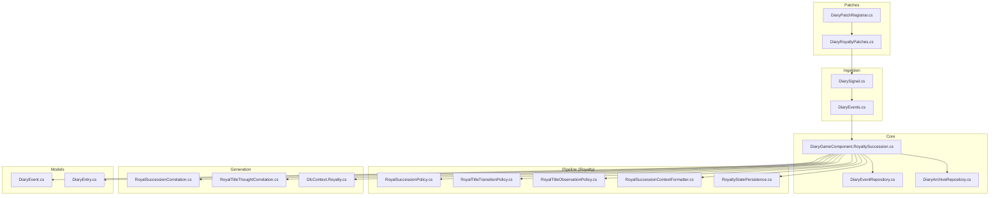
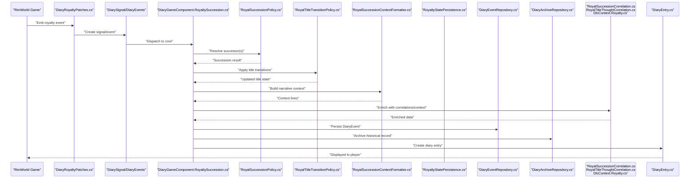
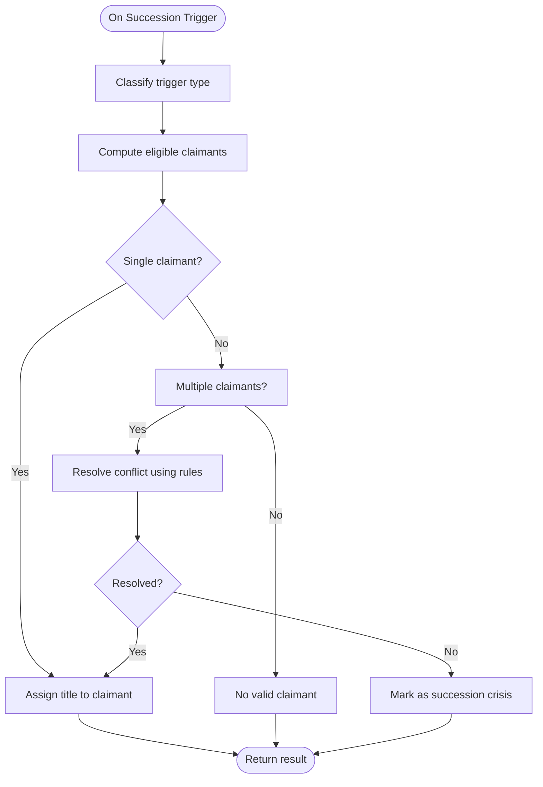
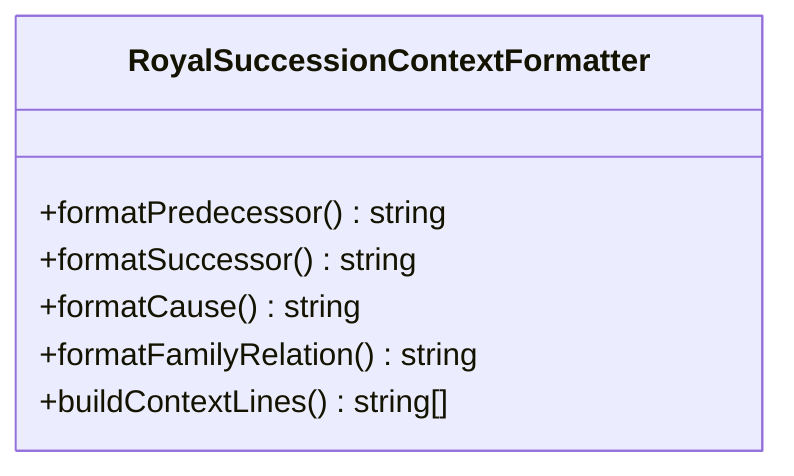
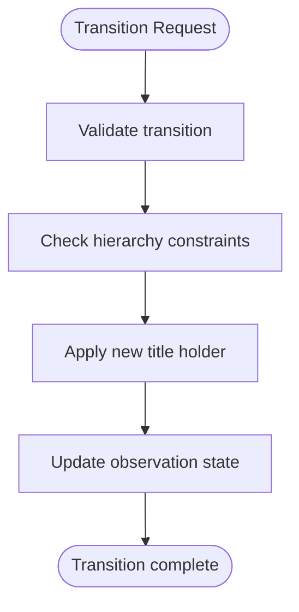
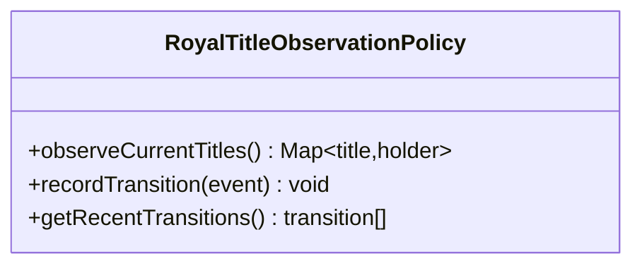
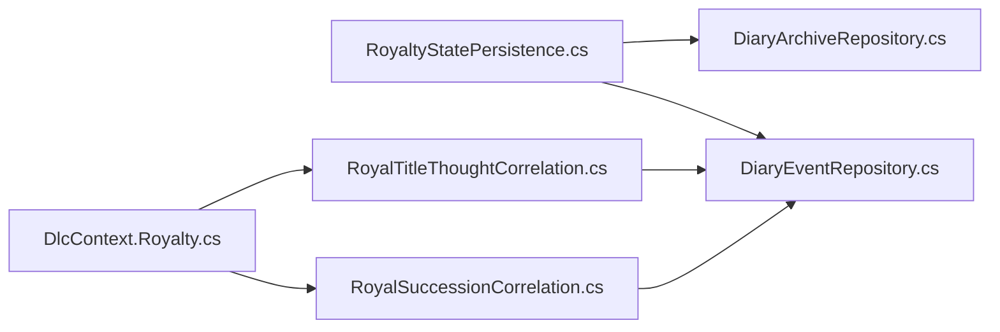
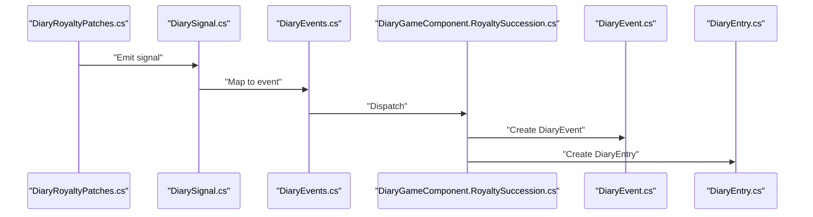
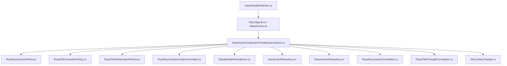

# Succession & Title Inheritance

## Table of Contents
1. [Introduction](#introduction)
2. [Project Structure](#project-structure)
3. [Core Components](#core-components)
4. [Architecture Overview](#architecture-overview)
5. [Detailed Component Analysis](#detailed-component-analysis)
6. [Dependency Analysis](#dependency-analysis)
7. [Performance Considerations](#performance-considerations)
8. [Troubleshooting Guide](#troubleshooting-guide)
9. [Conclusion](#conclusion)
10. [Appendices](#appendices)

## Introduction
This document explains the Succession and Title Inheritance system that captures royal succession events, applies inheritance rules, and integrates outcomes into diary entries. It focuses on:
- How succession triggers are detected and processed
- The RoyalSuccessionPolicy for determining successors and handling edge cases
- The RoyalSuccessionContextFormatter for generating contextual narrative about title transfers
- Title hierarchy tracking and integration with family relationships
- Scenarios such as death, abdication, assassination, multiple claimants, and succession crises

## Project Structure
The Succession and Title Inheritance system spans several layers:
- Patches detect royalty-related game events and emit signals
- Core components orchestrate processing and persistence
- Policies implement succession logic and title transitions
- Context formatters produce narrative context for diary entries
- Generation utilities correlate titles and thoughts to enrich entries
- Repositories persist events and archive them for later retrieval

**Diagram sources**
- [DiaryRoyaltyPatches.cs](../../../../../Source/Patches/DiaryRoyaltyPatches.cs)
- [DiaryPatchRegistrar.cs](../../../../../Source/Patches/DiaryPatchRegistrar.cs)
- [DiarySignal.cs](../../../../../Source/Ingestion/DiarySignal.cs)
- [DiaryEvents.cs](../../../../../Source/Ingestion/DiaryEvents.cs)
- [DiaryGameComponent.RoyaltySuccession.cs](../../../../../Source/Core/DiaryGameComponent.RoyaltySuccession.cs)
- [RoyalSuccessionPolicy.cs](../../../../../Source/Pipeline/Royalty/RoyalSuccessionPolicy.cs)
- [RoyalTitleTransitionPolicy.cs](../../../../../Source/Pipeline/Royalty/RoyalTitleTransitionPolicy.cs)
- [RoyalTitleObservationPolicy.cs](../../../../../Source/Pipeline/Royalty/RoyalTitleObservationPolicy.cs)
- [RoyalSuccessionContextFormatter.cs](../../../../../Source/Pipeline/Royalty/RoyalSuccessionContextFormatter.cs)
- [RoyaltyStatePersistence.cs](../../../../../Source/Pipeline/Royalty/RoyaltyStatePersistence.cs)
- [RoyalSuccessionCorrelation.cs](../../../../../Source/Generation/RoyalSuccessionCorrelation.cs)
- [RoyalTitleThoughtCorrelation.cs](../../../../../Source/Generation/RoyalTitleThoughtCorrelation.cs)
- [DlcContext.Royalty.cs](../../../../../Source/Generation/DlcContext.Royalty.cs)
- [DiaryEvent.cs](../../../../../Source/Models/DiaryEvent.cs)
- [DiaryEntry.cs](../../../../../Source/Models/DiaryEntry.cs)

**Section sources**
- [DiaryGameComponent.RoyaltySuccession.cs](../../../../../Source/Core/DiaryGameComponent.RoyaltySuccession.cs)
- [DiaryEventRepository.cs](../../../../../Source/Core/DiaryEventRepository.cs)
- [DiaryArchiveRepository.cs](../../../../../Source/Core/DiaryArchiveRepository.cs)
- [DiaryEvent.cs](../../../../../Source/Models/DiaryEvent.cs)
- [DiaryEntry.cs](../../../../../Source/Models/DiaryEntry.cs)
- [DiarySignal.cs](../../../../../Source/Ingestion/DiarySignal.cs)
- [DiaryEvents.cs](../../../../../Source/Ingestion/DiaryEvents.cs)
- [DiaryRoyaltyPatches.cs](../../../../../Source/Patches/DiaryRoyaltyPatches.cs)
- [DiaryPatchRegistrar.cs](../../../../../Source/Patches/DiaryPatchRegistrar.cs)

## Core Components
- DiaryGameComponent.RoyaltySuccession: Orchestrates succession event ingestion, policy application, state updates, and diary entry creation.
- RoyalSuccessionPolicy: Encapsulates succession triggers and inheritance rules, including resolution of multiple claimants and crisis handling.
- RoyalSuccessionContextFormatter: Produces contextual text describing who inherited which title(s), reasons, and related family dynamics.
- RoyalTitleTransitionPolicy: Manages transitions between title holders and enforces hierarchy constraints.
- RoyalTitleObservationPolicy: Observes current title holdings and changes for correlation and narrative continuity.
- RoyaltyStatePersistence: Persists succession state across sessions and ensures consistency after reloads.
- Correlations and Context: RoyalSuccessionCorrelation and RoyalTitleThoughtCorrelation link succession events to pawns’ thoughts and memories; DlcContext.Royalty supplies DLC-specific context.

**Section sources**
- [DiaryGameComponent.RoyaltySuccession.cs](../../../../../Source/Core/DiaryGameComponent.RoyaltySuccession.cs)
- [RoyalSuccessionPolicy.cs](../../../../../Source/Pipeline/Royalty/RoyalSuccessionPolicy.cs)
- [RoyalSuccessionContextFormatter.cs](../../../../../Source/Pipeline/Royalty/RoyalSuccessionContextFormatter.cs)
- [RoyalTitleTransitionPolicy.cs](../../../../../Source/Pipeline/Royalty/RoyalTitleTransitionPolicy.cs)
- [RoyalTitleObservationPolicy.cs](../../../../../Source/Pipeline/Royalty/RoyalTitleObservationPolicy.cs)
- [RoyaltyStatePersistence.cs](../../../../../Source/Pipeline/Royalty/RoyaltyStatePersistence.cs)
- [RoyalSuccessionCorrelation.cs](../../../../../Source/Generation/RoyalSuccessionCorrelation.cs)
- [RoyalTitleThoughtCorrelation.cs](../../../../../Source/Generation/RoyalTitleThoughtCorrelation.cs)
- [DlcContext.Royalty.cs](../../../../../Source/Generation/DlcContext.Royalty.cs)

## Architecture Overview
The system follows a signal-driven pipeline:
- Patches intercept royalty events and publish signals
- The core component consumes signals, validates them, and delegates to policies
- Policies compute successors and title transitions
- Context formatters generate narrative details
- Repositories persist events and archive them for history
- Generation utilities enrich entries with correlations and context

**Diagram sources**
- [DiaryRoyaltyPatches.cs](../../../../../Source/Patches/DiaryRoyaltyPatches.cs)
- [DiarySignal.cs](../../../../../Source/Ingestion/DiarySignal.cs)
- [DiaryEvents.cs](../../../../../Source/Ingestion/DiaryEvents.cs)
- [DiaryGameComponent.RoyaltySuccession.cs](../../../../../Source/Core/DiaryGameComponent.RoyaltySuccession.cs)
- [RoyalSuccessionPolicy.cs](../../../../../Source/Pipeline/Royalty/RoyalSuccessionPolicy.cs)
- [RoyalTitleTransitionPolicy.cs](../../../../../Source/Pipeline/Royalty/RoyalTitleTransitionPolicy.cs)
- [RoyalSuccessionContextFormatter.cs](../../../../../Source/Pipeline/Royalty/RoyalSuccessionContextFormatter.cs)
- [RoyaltyStatePersistence.cs](../../../../../Source/Pipeline/Royalty/RoyaltyStatePersistence.cs)
- [DiaryEventRepository.cs](../../../../../Source/Core/DiaryEventRepository.cs)
- [DiaryArchiveRepository.cs](../../../../../Source/Core/DiaryArchiveRepository.cs)
- [RoyalSuccessionCorrelation.cs](../../../../../Source/Generation/RoyalSuccessionCorrelation.cs)
- [RoyalTitleThoughtCorrelation.cs](../../../../../Source/Generation/RoyalTitleThoughtCorrelation.cs)
- [DlcContext.Royalty.cs](../../../../../Source/Generation/DlcContext.Royalty.cs)
- [DiaryEntry.cs](../../../../../Source/Models/DiaryEntry.cs)

## Detailed Component Analysis

### RoyalSuccessionPolicy
Responsibilities:
- Identify succession triggers (e.g., death, abdication, assassination)
- Determine eligible claimants based on title hierarchy and family relations
- Resolve conflicts when multiple claimants exist
- Handle succession crises by applying fallback rules or deferring resolution
- Return a deterministic outcome for consistent diary generation

Key behaviors:
- Trigger classification maps game events to internal categories
- Claimant ranking uses title precedence and familial ties
- Conflict resolution considers legitimacy, age order, and special conditions
- Crisis handling may mark the event as unresolved until further conditions are met

**Diagram sources**
- [RoyalSuccessionPolicy.cs](../../../../../Source/Pipeline/Royalty/RoyalSuccessionPolicy.cs)

**Section sources**
- [RoyalSuccessionPolicy.cs](../../../../../Source/Pipeline/Royalty/RoyalSuccessionPolicy.cs)

### RoyalSuccessionContextFormatter
Responsibilities:
- Generate contextual narrative lines describing title transfer
- Include predecessor, successor, cause of vacancy, and any notable circumstances
- Integrate family relationship context (e.g., sibling, child, cousin)
- Reflect DLC-specific nuances via context providers

Output characteristics:
- Human-readable summaries suitable for diary entries
- Structured context fields consumed by generation utilities
- Consistent phrasing across scenarios while allowing variation

**Diagram sources**
- [RoyalSuccessionContextFormatter.cs](../../../../../Source/Pipeline/Royalty/RoyalSuccessionContextFormatter.cs)

**Section sources**
- [RoyalSuccessionContextFormatter.cs](../../../../../Source/Pipeline/Royalty/RoyalSuccessionContextFormatter.cs)

### RoyalTitleTransitionPolicy
Responsibilities:
- Apply title ownership changes atomically
- Enforce hierarchy constraints (e.g., primary vs. secondary titles)
- Update observation state for downstream correlation
- Ensure idempotency and rollback safety if needed

**Diagram sources**
- [RoyalTitleTransitionPolicy.cs](../../../../../Source/Pipeline/Royalty/RoyalTitleTransitionPolicy.cs)

**Section sources**
- [RoyalTitleTransitionPolicy.cs](../../../../../Source/Pipeline/Royalty/RoyalTitleTransitionPolicy.cs)

### RoyalTitleObservationPolicy
Responsibilities:
- Track current title holders and changes over time
- Provide snapshots for correlation and narrative continuity
- Support queries for lineage and recent transitions

**Diagram sources**
- [RoyalTitleObservationPolicy.cs](../../../../../Source/Pipeline/Royalty/RoyalTitleObservationPolicy.cs)

**Section sources**
- [RoyalTitleObservationPolicy.cs](../../../../../Source/Pipeline/Royalty/RoyalTitleObservationPolicy.cs)

### State Persistence and Integration
- RoyaltyStatePersistence ensures succession state survives saves and reloads
- DiaryEventRepository persists structured events for querying and replay
- DiaryArchiveRepository maintains historical records for long-term continuity
- Correlations (RoyalSuccessionCorrelation, RoyalTitleThoughtCorrelation) tie events to pawn thoughts and memories
- DlcContext.Royalty provides additional context for DLC features

**Diagram sources**
- [RoyaltyStatePersistence.cs](../../../../../Source/Pipeline/Royalty/RoyaltyStatePersistence.cs)
- [DiaryEventRepository.cs](../../../../../Source/Core/DiaryEventRepository.cs)
- [DiaryArchiveRepository.cs](../../../../../Source/Core/DiaryArchiveRepository.cs)
- [RoyalSuccessionCorrelation.cs](../../../../../Source/Generation/RoyalSuccessionCorrelation.cs)
- [RoyalTitleThoughtCorrelation.cs](../../../../../Source/Generation/RoyalTitleThoughtCorrelation.cs)
- [DlcContext.Royalty.cs](../../../../../Source/Generation/DlcContext.Royalty.cs)

**Section sources**
- [RoyaltyStatePersistence.cs](../../../../../Source/Pipeline/Royalty/RoyaltyStatePersistence.cs)
- [DiaryEventRepository.cs](../../../../../Source/Core/DiaryEventRepository.cs)
- [DiaryArchiveRepository.cs](../../../../../Source/Core/DiaryArchiveRepository.cs)
- [RoyalSuccessionCorrelation.cs](../../../../../Source/Generation/RoyalSuccessionCorrelation.cs)
- [RoyalTitleThoughtCorrelation.cs](../../../../../Source/Generation/RoyalTitleThoughtCorrelation.cs)
- [DlcContext.Royalty.cs](../../../../../Source/Generation/DlcContext.Royalty.cs)

### Event Capture and Processing Flow
- Patches intercept royalty events and create signals/events
- The core component processes signals, invokes policies, and creates diary entries
- Events are persisted and archived; entries are rendered to the player

**Diagram sources**
- [DiaryRoyaltyPatches.cs](../../../../../Source/Patches/DiaryRoyaltyPatches.cs)
- [DiarySignal.cs](../../../../../Source/Ingestion/DiarySignal.cs)
- [DiaryEvents.cs](../../../../../Source/Ingestion/DiaryEvents.cs)
- [DiaryGameComponent.RoyaltySuccession.cs](../../../../../Source/Core/DiaryGameComponent.RoyaltySuccession.cs)
- [DiaryEvent.cs](../../../../../Source/Models/DiaryEvent.cs)
- [DiaryEntry.cs](../../../../../Source/Models/DiaryEntry.cs)

**Section sources**
- [DiaryRoyaltyPatches.cs](../../../../../Source/Patches/DiaryRoyaltyPatches.cs)
- [DiarySignal.cs](../../../../../Source/Ingestion/DiarySignal.cs)
- [DiaryEvents.cs](../../../../../Source/Ingestion/DiaryEvents.cs)
- [DiaryGameComponent.RoyaltySuccession.cs](../../../../../Source/Core/DiaryGameComponent.RoyaltySuccession.cs)
- [DiaryEvent.cs](../../../../../Source/Models/DiaryEvent.cs)
- [DiaryEntry.cs](../../../../../Source/Models/DiaryEntry.cs)

### Succession Scenarios and Edge Cases
- Death: Standard vacancy; successor selected by hierarchy and family relations
- Abdication: Voluntary relinquishment; successor chosen per policy rules
- Assassination: Premature vacancy; may influence thought correlations and narrative tone
- Multiple claimants: Conflict resolution prioritizes legitimacy and order; unresolved cases marked as crises
- Succession crises: Marked for later resolution; diary entries reflect uncertainty and political tension

Integration with family relationships:
- Family ties influence claimant eligibility and priority
- Context formatter includes relation descriptors (e.g., “younger brother”, “cousin”)
- Thought correlations capture emotional reactions among family members

**Section sources**
- [RoyalSuccessionPolicy.cs](../../../../../Source/Pipeline/Royalty/RoyalSuccessionPolicy.cs)
- [RoyalSuccessionContextFormatter.cs](../../../../../Source/Pipeline/Royalty/RoyalSuccessionContextFormatter.cs)
- [RoyalTitleThoughtCorrelation.cs](../../../../../Source/Generation/RoyalTitleThoughtCorrelation.cs)

## Dependency Analysis
The system exhibits clear separation of concerns:
- Patches depend only on game hooks and signal emission
- Core depends on policies, repositories, and models
- Policies are cohesive around succession and title management
- Generation utilities depend on observation and correlation services
- Persistence is isolated to repositories and state persistence

**Diagram sources**
- [DiaryRoyaltyPatches.cs](../../../../../Source/Patches/DiaryRoyaltyPatches.cs)
- [DiarySignal.cs](../../../../../Source/Ingestion/DiarySignal.cs)
- [DiaryEvents.cs](../../../../../Source/Ingestion/DiaryEvents.cs)
- [DiaryGameComponent.RoyaltySuccession.cs](../../../../../Source/Core/DiaryGameComponent.RoyaltySuccession.cs)
- [RoyalSuccessionPolicy.cs](../../../../../Source/Pipeline/Royalty/RoyalSuccessionPolicy.cs)
- [RoyalTitleTransitionPolicy.cs](../../../../../Source/Pipeline/Royalty/RoyalTitleTransitionPolicy.cs)
- [RoyalTitleObservationPolicy.cs](../../../../../Source/Pipeline/Royalty/RoyalTitleObservationPolicy.cs)
- [RoyalSuccessionContextFormatter.cs](../../../../../Source/Pipeline/Royalty/RoyalSuccessionContextFormatter.cs)
- [RoyaltyStatePersistence.cs](../../../../../Source/Pipeline/Royalty/RoyaltyStatePersistence.cs)
- [DiaryEventRepository.cs](../../../../../Source/Core/DiaryEventRepository.cs)
- [DiaryArchiveRepository.cs](../../../../../Source/Core/DiaryArchiveRepository.cs)
- [RoyalSuccessionCorrelation.cs](../../../../../Source/Generation/RoyalSuccessionCorrelation.cs)
- [RoyalTitleThoughtCorrelation.cs](../../../../../Source/Generation/RoyalTitleThoughtCorrelation.cs)
- [DlcContext.Royalty.cs](../../../../../Source/Generation/DlcContext.Royalty.cs)

**Section sources**
- [DiaryGameComponent.RoyaltySuccession.cs](../../../../../Source/Core/DiaryGameComponent.RoyaltySuccession.cs)
- [RoyalSuccessionPolicy.cs](../../../../../Source/Pipeline/Royalty/RoyalSuccessionPolicy.cs)
- [RoyalTitleTransitionPolicy.cs](../../../../../Source/Pipeline/Royalty/RoyalTitleTransitionPolicy.cs)
- [RoyalTitleObservationPolicy.cs](../../../../../Source/Pipeline/Royalty/RoyalTitleObservationPolicy.cs)
- [RoyalSuccessionContextFormatter.cs](../../../../../Source/Pipeline/Royalty/RoyalSuccessionContextFormatter.cs)
- [RoyaltyStatePersistence.cs](../../../../../Source/Pipeline/Royalty/RoyaltyStatePersistence.cs)
- [DiaryEventRepository.cs](../../../../../Source/Core/DiaryEventRepository.cs)
- [DiaryArchiveRepository.cs](../../../../../Source/Core/DiaryArchiveRepository.cs)
- [RoyalSuccessionCorrelation.cs](../../../../../Source/Generation/RoyalSuccessionCorrelation.cs)
- [RoyalTitleThoughtCorrelation.cs](../../../../../Source/Generation/RoyalTitleThoughtCorrelation.cs)
- [DlcContext.Royalty.cs](../../../../../Source/Generation/DlcContext.Royalty.cs)

## Performance Considerations
- Minimize repeated lookups by caching observation snapshots where appropriate
- Defer heavy correlation computations to background or batched phases
- Keep policy decisions deterministic and fast to avoid stutter during event spikes
- Use repositories efficiently by batching writes and avoiding redundant archives

[No sources needed since this section provides general guidance]

## Troubleshooting Guide
Common issues and resolutions:
- Missing diary entries after reload: Verify state persistence and repository writes
- Incorrect successor selection: Inspect policy rules and claimant eligibility
- Conflicting title assignments: Check hierarchy constraints in transition policy
- Narrative inconsistencies: Review context formatter inputs and correlation outputs
- Patch registration failures: Confirm patch registrar configuration and load order

Diagnostic references:
- Patch registration and lifecycle
- Signal emission and mapping
- Repository persistence and archival
- State persistence integrity

**Section sources**
- [DiaryPatchRegistrar.cs](../../../../../Source/Patches/DiaryPatchRegistrar.cs)
- [DiarySignal.cs](../../../../../Source/Ingestion/DiarySignal.cs)
- [DiaryEvents.cs](../../../../../Source/Ingestion/DiaryEvents.cs)
- [DiaryEventRepository.cs](../../../../../Source/Core/DiaryEventRepository.cs)
- [DiaryArchiveRepository.cs](../../../../../Source/Core/DiaryArchiveRepository.cs)
- [RoyaltyStatePersistence.cs](../../../../../Source/Pipeline/Royalty/RoyaltyStatePersistence.cs)

## Conclusion
The Succession and Title Inheritance system provides a robust, modular framework for capturing royal succession events, applying inheritance rules, and integrating outcomes into rich diary narratives. By separating concerns across patches, core orchestration, policies, context formatting, and persistence, it remains maintainable and extensible. Edge cases like multiple claimants and succession crises are handled explicitly, ensuring consistent and meaningful storytelling.

[No sources needed since this section summarizes without analyzing specific files]

## Appendices

### Configuration and Defs
- Policy definitions and tuning are provided via XML defs and language injections
- These allow modders and players to adjust behavior and localization

**Section sources**
- [DiaryRoyaltyPolicyDefs.xml](../../../../../1.6/Defs/DiaryRoyaltyPolicyDefs.xml)
- [PawnDiary.DiaryRoyaltyPolicyDef](../../../../../Languages/English/DefInjected/PawnDiary.DiaryRoyaltyPolicyDef/DiaryRoyaltyPolicyDefs.xml)
