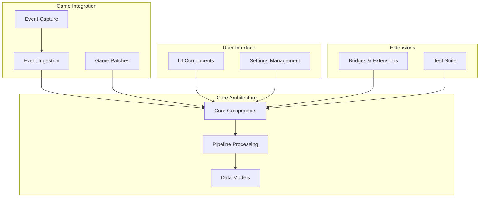
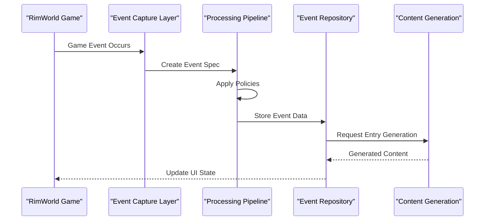
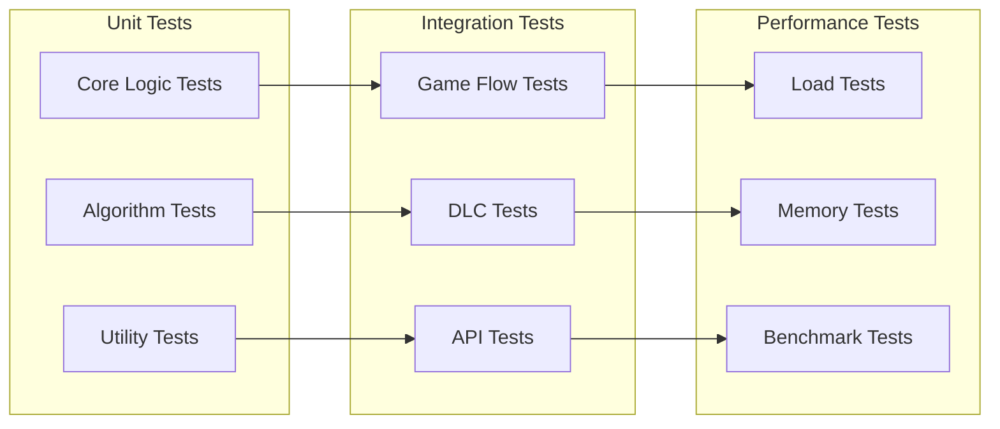

# Contribution Guidelines

<cite>
**Referenced Files in This Document**
- [README.md](../../../../README.md)
- [About/About.xml](../../../../About/About.xml)
- [LoadFolders.xml](../../../../LoadFolders.xml)
- [Source/PawnDiary.csproj](../../../../Source/PawnDiary.csproj)
- [Source/PawnDiary.slnx](../../../../Source/PawnDiary.slnx)
- [.github/workflows](../../../../.github/workflows)
- [.githooks/verify.ps1](../../../../.githooks/verify.ps1)
- [integrations/README.md](../../../../integrations/README.md)
- [EXTERNAL_API.md](../../../../EXTERNAL_API.md)
- [DOCUMENTATION.md](../../../../DOCUMENTATION.md)
</cite>

## Table of Contents
1. [Introduction](#introduction)
2. [Project Overview](#project-overview)
3. [Code Organization Principles](#code-organization-principles)
4. [Naming Conventions](#naming-conventions)
5. [Architectural Patterns](#architectural-patterns)
6. [Development Environment Setup](#development-environment-setup)
7. [Pull Request Process](#pull-request-process)
8. [Code Review Standards](#code-review-standards)
9. [Quality Assurance Requirements](#quality-assurance-requirements)
10. [Adding New Features](#adding-new-features)
11. [Extending Existing Functionality](#extending-existing-functionality)
12. [Backward Compatibility Guidelines](#backward-compatibility-guidelines)
13. [Documentation Standards](#documentation-standards)
14. [Translation Processes](#translation-processes)
15. [Release Procedures](#release-procedures)
16. [Issue Templates](#issue-templates)
17. [Licensing and Intellectual Property](#licensing-and-intellectual-property)
18. [Community Interaction Guidelines](#community-interaction-guidelines)
19. [Troubleshooting Common Issues](#troubleshooting-common-issues)
20. [Conclusion](#conclusion)

## Introduction

Welcome to the Pawn Diary mod development community! This document provides comprehensive guidelines for contributors who want to participate in the development, maintenance, and enhancement of this RimWorld mod. Whether you're fixing bugs, adding new features, or improving documentation, your contributions are valuable to the community.

Pawn Diary is a sophisticated mod that enhances the narrative experience in RimWorld by providing AI-generated diary entries, character development tracking, and rich storytelling capabilities. The codebase follows modern software engineering practices with clear separation of concerns, extensive testing coverage, and modular architecture.

## Project Overview

This is a complex C# .NET project designed as a RimWorld mod with the following key characteristics:

- **Multi-version Support**: Supports multiple RimWorld versions (1.6+)
- **Modular Architecture**: Separated into core functionality, DLC integrations, and external bridges
- **Extensive Testing**: Comprehensive test suite covering various game scenarios
- **Internationalization**: Multi-language support with English and Russian translations
- **API Integration**: External API support for AI text generation
- **Plugin System**: Bridge architecture for third-party mod integration

The project follows industry-standard practices including Git hooks, GitHub Actions workflows, and structured error reporting.

## Code Organization Principles

### Directory Structure Philosophy

The codebase follows a feature-based organization with clear separation between different concerns:



**Diagram sources**
- [Source/Core](../../../../Source/Core)
- [Source/Pipeline](../../../../Source/Pipeline)
- [Source/Models](../../../../Source/Models)
- [Source/Capture](../../../../Source/Capture)
- [Source/Ingestion](../../../../Source/Ingestion)
- [Source/Patches](../../../../Source/Patches)
- [Source/UI](../../../../Source/UI)
- [Source/Settings](../../../../Source/Settings)
- [integrations](../../../../integrations)
- [tests](../../../../tests)

### Key Organizational Principles

1. **Separation of Concerns**: Each directory focuses on specific responsibilities
2. **Feature-Based Grouping**: Related functionality is grouped together
3. **Clear Dependencies**: Minimal coupling between components
4. **Testability**: All major components have corresponding tests
5. **Configuration-Driven**: Behavior controlled through XML definitions and settings

**Section sources**
- [Source/Core](../../../../Source/Core)
- [Source/Pipeline](../../../../Source/Pipeline)
- [Source/Models](../../../../Source/Models)

## Naming Conventions

### File and Class Naming

- **Classes**: PascalCase with descriptive names (e.g., `DiaryGameComponent`, `CaptureContext`)
- **Methods**: PascalCase with action-oriented names (e.g., `ProcessEvent`, `GenerateEntry`)
- **Properties**: PascalCase for public properties (e.g., `EventId`, `PawnName`)
- **Private Fields**: camelCase with underscore prefix (e.g., `_eventRepository`)
- **Constants**: UPPER_SNAKE_CASE (e.g., `MAX_EVENT_AGE_DAYS`)
- **Interfaces**: IPascalCase (e.g., `ICapturePolicy`, `IPromptBuilder`)

### Namespace Organization

- **Root Namespace**: `PawnDiary`
- **Feature Namespaces**: `PawnDiary.Core`, `PawnDiary.Pipeline`, `PawnDiary.Capture`
- **Extension Namespaces**: `PawnDiary.Integration`, `PawnDiary.Bridge`

### XML Definition Naming

- **Def Classes**: PascalCase with Def suffix (e.g., `DiaryPromptDef`, `DiaryTuningDef`)
- **XML Files**: PascalCase with Def suffix (e.g., `DiaryPromptDefs.xml`)
- **Injected Text**: PascalCase with target namespace (e.g., `DiaryPromptDef_PromptText`)

**Section sources**
- [Source/Defs](../../../../Source/Defs)
- [Source/Models](../../../../Source/Models)
- [1.6/Defs](../../../../1.6/Defs)

## Architectural Patterns

### Event-Driven Architecture

The system uses an event-driven pattern where game events are captured, processed, and transformed into diary entries:



**Diagram sources**
- [Source/Capture](../../../../Source/Capture)
- [Source/Pipeline](../../../../Source/Pipeline)
- [Source/Core](../../../../Source/Core)

### Policy Pattern Implementation

The system extensively uses the policy pattern for configurable behavior:

- **Capture Policies**: Determine which events to capture
- **Processing Policies**: Transform and enrich event data
- **Generation Policies**: Control content generation behavior
- **Retention Policies**: Manage event lifecycle and storage

### Repository Pattern

Data persistence is abstracted through repository interfaces:

- **DiaryEventRepository**: Manages event storage and retrieval
- **DiaryArchiveRepository**: Handles archived entry management
- **PawnMemoryRepository**: Maintains pawn-specific memory state

### Plugin Architecture

The bridge system allows third-party extensions:

- **Bridge Contracts**: Well-defined interfaces for extension points
- **Discovery Mechanism**: Automatic loading of compatible bridges
- **Version Compatibility**: Runtime version checking and graceful degradation

**Section sources**
- [Source/Pipeline](../../../../Source/Pipeline)
- [Source/Integration](../../../../Source/Integration)
- [Source/Core](../../../../Source/Core)

## Development Environment Setup

### Prerequisites

1. **Visual Studio 2022** with .NET Desktop Development workload
2. **RimWorld** installed and running
3. **Git** for version control
4. **.NET SDK 8.0+** for building and testing

### Project Structure Understanding

The main solution contains:

- **Main Project**: `Source/PawnDiary.csproj` - Core mod functionality
- **Integration Projects**: Individual bridge implementations
- **Test Projects**: Comprehensive test suite
- **Service Projects**: External API endpoints

### Building the Project

```bash
# Clone the repository
git clone <repository-url>
cd <project-directory>

# Build the main project
dotnet build Source/PawnDiary.slnx

# Run all tests
dotnet test tests/

# Build specific integration
dotnet build integrations/PawnDiary.ExampleAdapter/
```

### Debugging Setup

1. Configure Visual Studio to launch RimWorld
2. Set breakpoints in source files
3. Use the debug configuration to attach to RimWorld process
4. Utilize the built-in diagnostic tools and logging

**Section sources**
- [Source/PawnDiary.csproj](../../../../Source/PawnDiary.csproj)
- [Source/PawnDiary.slnx](../../../../Source/PawnDiary.slnx)
- [.githooks/verify.ps1](../../../../.githooks/verify.ps1)

## Pull Request Process

### Pre-Submission Checklist

Before creating a pull request, ensure:

1. **Code Quality**: All tests pass locally
2. **Build Success**: Project builds without errors or warnings
3. **Documentation Updated**: Relevant documentation is current
4. **No Breaking Changes**: Backward compatibility maintained
5. **Performance Impact**: No significant performance regressions

### Creating a Pull Request

1. **Fork the Repository**: Create your own fork on GitHub
2. **Create Feature Branch**: Use descriptive branch names (`feature/add-diary-entry-type`)
3. **Make Changes**: Implement your feature or fix
4. **Write Tests**: Add comprehensive test coverage
5. **Update Documentation**: Modify relevant docs and comments
6. **Submit PR**: Create detailed pull request description

### Pull Request Template

Your PR should include:

- **Description**: Clear explanation of changes
- **Motivation**: Why these changes are needed
- **Testing**: How changes were tested
- **Breaking Changes**: Any API or behavior changes
- **Migration Guide**: Steps for users if applicable

### Review Process

1. **Automated Checks**: CI pipeline validates code quality
2. **Code Review**: Maintainers review for correctness and style
3. **Testing**: Integration tests run against latest game version
4. **Approval**: At least one maintainer approval required
5. **Merge**: Squash merge to maintain clean history

**Section sources**
- [.github/workflows](../../../../.github/workflows)
- [.githooks/verify.ps1](../../../../.githooks/verify.ps1)

## Code Review Standards

### Code Quality Requirements

- **Readability**: Code should be self-documenting with clear variable names
- **Simplicity**: Prefer simple solutions over complex ones
- **Consistency**: Follow established patterns and conventions
- **Error Handling**: Proper exception handling and logging
- **Performance**: Consider performance implications of changes

### Review Criteria

1. **Functionality**: Does the code work as intended?
2. **Architecture**: Does it fit within the existing design?
3. **Testing**: Is there adequate test coverage?
4. **Documentation**: Are changes properly documented?
5. **Security**: Are there any security implications?
6. **Compatibility**: Does it work with supported RimWorld versions?

### Style Guidelines

- **Indentation**: 4 spaces (no tabs)
- **Line Length**: Maximum 120 characters
- **Braces**: Opening brace on same line
- **Comments**: XML documentation for public APIs
- **Null Checks**: Explicit null parameter validation

**Section sources**
- [.githooks/verify.ps1](../../../../.githooks/verify.ps1)

## Quality Assurance Requirements

### Testing Strategy

The project implements a comprehensive testing strategy:

#### Unit Tests
- **Isolation**: Each test focuses on a single unit of functionality
- **Mocking**: External dependencies are mocked
- **Coverage**: Target >80% code coverage for critical paths

#### Integration Tests
- **Game Simulation**: Tests simulate actual RimWorld gameplay
- **End-to-End Flows**: Complete user scenarios are tested
- **DLC Compatibility**: Tests cover DLC-specific functionality

#### Performance Tests
- **Memory Usage**: Monitor memory consumption during long sessions
- **CPU Impact**: Ensure minimal performance overhead
- **Load Testing**: Handle large numbers of pawns and events

### Test Organization



### Continuous Integration

GitHub Actions workflows automatically:
- Build the project across multiple configurations
- Run all test suites
- Check code formatting and style
- Validate XML definitions
- Generate build artifacts

**Section sources**
- [tests](../../../../tests)
- [.github/workflows](../../../../.github/workflows)

## Adding New Features

### Feature Development Workflow

1. **Issue Creation**: Create a detailed issue describing the feature
2. **Design Discussion**: Discuss implementation approach with maintainers
3. **Prototype Development**: Create proof-of-concept if complexity warrants
4. **Implementation**: Develop the feature following architectural patterns
5. **Testing**: Write comprehensive tests for the new functionality
6. **Documentation**: Update user-facing and developer documentation

### Adding New Event Types

To add support for new game events:

1. **Define Event Spec**: Create class in `Source/Capture/Specs/`
2. **Implement Capture Policy**: Add logic in `Source/Capture/Policies/`
3. **Create Signal Handler**: Add signal processing in `Source/Ingestion/Sources/`
4. **Update Definitions**: Add XML definitions if needed
5. **Add Tests**: Include test cases in appropriate test project

### Extending the Pipeline

For new processing stages:

1. **Implement Policy Interface**: Create class implementing relevant policy interface
2. **Register Policy**: Add to appropriate registry or configuration
3. **Configure Behavior**: Define policy parameters in XML or settings
4. **Test Integration**: Verify interaction with other policies

**Section sources**
- [Source/Capture](../../../../Source/Capture)
- [Source/Pipeline](../../../../Source/Pipeline)
- [Source/Ingestion](../../../../Source/Ingestion)

## Extending Existing Functionality

### Using the Public API

The mod exposes a well-documented API for other mods:

- **Entry Submission**: Submit custom diary entries
- **Context Provision**: Provide additional context for generation
- **Style Override**: Customize writing style and tone
- **Event Filtering**: Control which events are processed

### Creating Bridges

Third-party integrations use the bridge architecture:

1. **Implement Bridge Contract**: Follow the defined interface
2. **Handle Version Compatibility**: Gracefully handle missing features
3. **Provide Configuration**: Allow users to configure the bridge
4. **Include Tests**: Test bridge functionality independently

### Modifying Core Behavior

When extending core functionality:

1. **Prefer Composition**: Add new behaviors rather than modifying existing code
2. **Use Configuration**: Make behavior configurable when possible
3. **Maintain Backward Compatibility**: Ensure existing functionality continues to work
4. **Document Changes**: Clearly document any behavioral changes

**Section sources**
- [Source/Integration](../../../../Source/Integration)
- [EXTERNAL_API.md](../../../../EXTERNAL_API.md)

## Backward Compatibility Guidelines

### API Stability

- **Public API**: Maintain stable interfaces across minor versions
- **Breaking Changes**: Only introduce in major version updates
- **Deprecation Warnings**: Provide migration guidance for deprecated features
- **Graceful Degradation**: Handle missing features in older versions

### Data Format Compatibility

- **Save File Formats**: Maintain compatibility across updates
- **Configuration Migration**: Provide automatic migration for settings
- **Definition Schema**: Keep XML definition schemas backward compatible

### Version Detection

Implement proper version detection for:
- **RimWorld Versions**: Detect and adapt to different game versions
- **DLC Availability**: Check for optional DLC features
- **Dependency Versions**: Ensure compatible dependency versions

**Section sources**
- [Source/Patches](../../../../Source/Patches)
- [Source/Settings](../../../../Source/Settings)

## Documentation Standards

### Code Documentation

All public APIs must include XML documentation:

- **Class Descriptions**: Explain purpose and usage
- **Method Documentation**: Describe parameters, return values, and exceptions
- **Property Documentation**: Clarify property behavior and constraints
- **Example Usage**: Provide practical examples where helpful

### User Documentation

- **Installation Guides**: Step-by-step setup instructions
- **Configuration Examples**: Common configuration scenarios
- **Troubleshooting**: Common issues and solutions
- **API Reference**: Complete API documentation for developers

### Developer Documentation

- **Architecture Overview**: High-level system design
- **Contributing Guide**: Development workflow and standards
- **Testing Guide**: How to write and run tests
- **Release Process**: Steps for creating new releases

### Documentation Maintenance

- **Review Schedule**: Regular documentation reviews
- **Change Tracking**: Link documentation changes to code commits
- **Community Feedback**: Incorporate user feedback into docs
- **Translation Updates**: Keep documentation synchronized with translations

**Section sources**
- [DOCUMENTATION.md](../../../../DOCUMENTATION.md)
- [EXTERNAL_API.md](../../../../EXTERNAL_API.md)

## Translation Processes

### Language File Structure

Translations are organized by language and category:

```
Languages/[Language]/
├── DefInjected/
│   └── [TargetNamespace]/
│       └── [TargetFile].xml
└── Keyed/
    └── [Category].xml
```

### Translation Guidelines

1. **Preserve Placeholders**: Don't modify XML tags or placeholders
2. **Context Awareness**: Consider how translations will appear in-game
3. **Cultural Adaptation**: Adapt idioms and cultural references appropriately
4. **Length Considerations**: Account for text expansion in UI elements
5. **Consistent Terminology**: Maintain consistent terms across all translations

### Adding New Languages

1. **Create Language Directory**: Copy structure from existing languages
2. **Translate Key Files**: Translate all Keyed XML files
3. **Translate Definitions**: Translate all DefInjected files
4. **Test Integration**: Verify translations load correctly
5. **Community Review**: Have native speakers review translations

### Translation Quality Assurance

- **Automated Validation**: Check for missing translations
- **Context Preview**: Provide screenshots for translators
- **Native Speaker Review**: Ensure natural language usage
- **Regular Updates**: Keep translations synchronized with code changes

**Section sources**
- [Languages](../../../../Languages)

## Release Procedures

### Version Management

Follow semantic versioning:
- **Major**: Breaking changes (1.0.0 → 2.0.0)
- **Minor**: New features, backward compatible (1.0.0 → 1.1.0)
- **Patch**: Bug fixes, no breaking changes (1.0.0 → 1.0.1)

### Pre-Release Checklist

1. **All Tests Pass**: Complete test suite execution
2. **Build Verification**: Clean build across all configurations
3. **Manual Testing**: Playtest in real RimWorld session
4. **Documentation Update**: Update changelog and release notes
5. **Compatibility Check**: Verify with latest RimWorld version
6. **Performance Review**: Check for performance regressions

### Release Process

1. **Create Release Branch**: From latest stable commit
2. **Update Version Numbers**: In project files and About.xml
3. **Generate Build Artifacts**: Create distribution packages
4. **Publish to Steam Workshop**: Upload mod package
5. **Update Documentation**: Publish release notes and guides
6. **Notify Community**: Announce release through appropriate channels

### Post-Release Monitoring

- **Error Reporting**: Monitor crash reports and error logs
- **Community Feedback**: Track user feedback and bug reports
- **Hotfix Process**: Quick response to critical issues
- **Rollback Plan**: Procedure for reverting problematic releases

**Section sources**
- [About/About.xml](../../../../About/About.xml)
- [LoadFolders.xml](../../../../LoadFolders.xml)

## Issue Templates

### Bug Report Template

```markdown
## Bug Report

### Description
A clear and concise description of what the bug is.

### Steps to Reproduce
1. Go to '...'
2. Click on '...'
3. Scroll down to '...'
4. See error

### Expected Behavior
What you expected to happen.

### Actual Behavior
What actually happened.

### Screenshots
If applicable, add screenshots to help explain your problem.

### Environment
- RimWorld Version:
- Mod Version:
- Operating System:

### Additional Context
Add any other context about the problem here.
```

### Feature Request Template

```markdown
## Feature Request

### Problem Statement
A clear and concise description of what problem this feature solves.

### Proposed Solution
A clear and concise description of what you want to happen.

### Alternatives Considered
A clear and concise description of any alternative solutions or features you've considered.

### Additional Context
Add any other context or screenshots about the feature request here.
```

### Contribution Proposal Template

```markdown
## Contribution Proposal

### Overview
Brief description of the proposed contribution.

### Technical Details
Detailed technical description of the implementation approach.

### Benefits
How this contribution benefits the project and users.

### Risks and Mitigations
Potential risks and how they will be addressed.

### Timeline
Estimated timeline for completion.

### Resources Needed
Any additional resources or support required.
```

## Licensing and Intellectual Property

### License Information

This project uses the MIT License, which allows:
- **Commercial Use**: Use in commercial projects
- **Modification**: Modify the source code
- **Distribution**: Distribute modified versions
- **Private Use**: Use privately without restrictions

### Contributor Agreement

By contributing to this project, you agree that:
- Your contributions are licensed under the project's license
- You have the right to contribute the code
- Your contributions don't violate third-party rights

### Third-Party Dependencies

- **License Compliance**: Ensure all dependencies have compatible licenses
- **Attribution**: Provide proper attribution for third-party code
- **Vulnerability Management**: Keep dependencies updated for security

### Trademark and Branding

- **Mod Name**: Respect the project name and branding guidelines
- **Attribution**: Maintain proper attribution in derivative works
- **Logo Usage**: Follow logo usage guidelines

**Section sources**
- [About/About.xml](../../../../About/About.xml)

## Community Interaction Guidelines

### Communication Channels

- **GitHub Issues**: For bug reports and feature requests
- **Discussions**: For general questions and community discussion
- **Pull Requests**: For code contributions and reviews
- **Documentation**: For project information and guides

### Code of Conduct

1. **Be Respectful**: Treat all community members with respect
2. **Be Collaborative**: Work together to solve problems
3. **Be Constructive**: Provide helpful feedback and suggestions
4. **Be Patient**: Understand that volunteers contribute their time
5. **Be Inclusive**: Welcome contributors of all backgrounds and skill levels

### Contribution Recognition

- **Commit History**: All contributions are tracked in git history
- **Acknowledgments**: Contributors are acknowledged in release notes
- **Mentorship**: Experienced contributors help newcomers
- **Recognition**: Outstanding contributions may receive special recognition

### Decision Making

- **Consensus Building**: Major decisions seek community consensus
- **Maintainer Authority**: Core maintainers have final decision authority
- **Transparency**: Decision-making process is documented and transparent
- **Feedback Opportunity**: Community input is welcomed before major decisions

**Section sources**
- [.github](../../../../.github)

## Troubleshooting Common Issues

### Build Issues

**Problem**: Project fails to build
**Solution**:
- Ensure .NET SDK 8.0+ is installed
- Restore NuGet packages: `dotnet restore`
- Check for conflicting Visual Studio installations

**Problem**: Missing dependencies
**Solution**:
- Run `dotnet restore` to download dependencies
- Check network connectivity for package downloads
- Verify package source configuration

### Runtime Issues

**Problem**: Mod doesn't load in RimWorld
**Solution**:
- Check LoadFolders.xml configuration
- Verify mod version compatibility with RimWorld
- Review error logs in RimWorld's log files

**Problem**: Performance problems
**Solution**:
- Enable performance profiling
- Check for memory leaks using debugging tools
- Review event processing efficiency

### Development Issues

**Problem**: Tests fail locally but pass in CI
**Solution**:
- Ensure environment matches CI configuration
- Check for timing-sensitive test issues
- Verify test data consistency

**Problem**: Debugging difficult
**Solution**:
- Use Visual Studio debugger with proper configuration
- Enable verbose logging
- Use diagnostic tools and profilers

**Section sources**
- [Source/Diagnostics](../../../../Source/Diagnostics)
- [tests](../../../../tests)

## Conclusion

Thank you for your interest in contributing to Pawn Diary! This project thrives on the contributions of passionate developers and community members who share our vision of enhancing the RimWorld narrative experience.

Whether you're fixing a small bug, adding a major feature, or improving documentation, every contribution matters. By following these guidelines, you help ensure that the project remains high-quality, maintainable, and welcoming to all contributors.

Remember that open-source development is a collaborative effort. Be patient, be respectful, and enjoy the process of building something meaningful together.

For any questions about these guidelines or the contribution process, don't hesitate to reach out through the project's communication channels. We're here to help you succeed as a contributor!

---

*Last Updated: 2024*
*Project Maintainers: [Contact Information]*
*Community Channels: [Links to Discord, Forums, etc.]*
