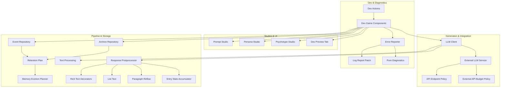
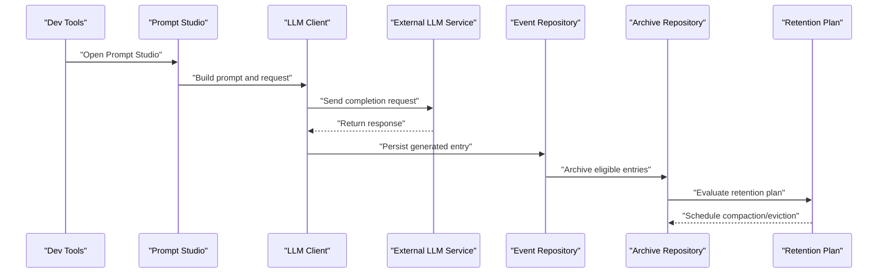
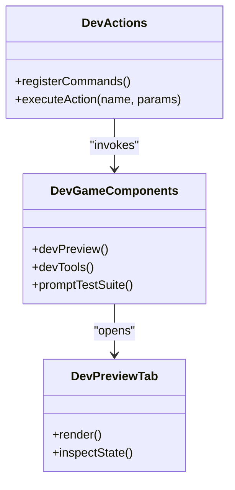
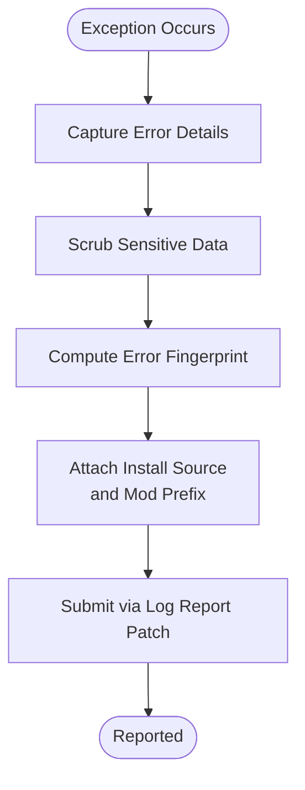
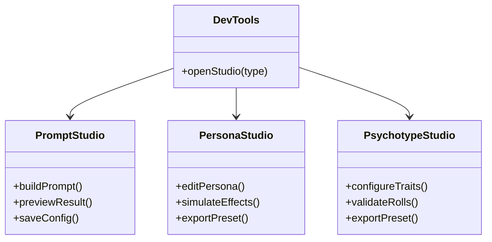
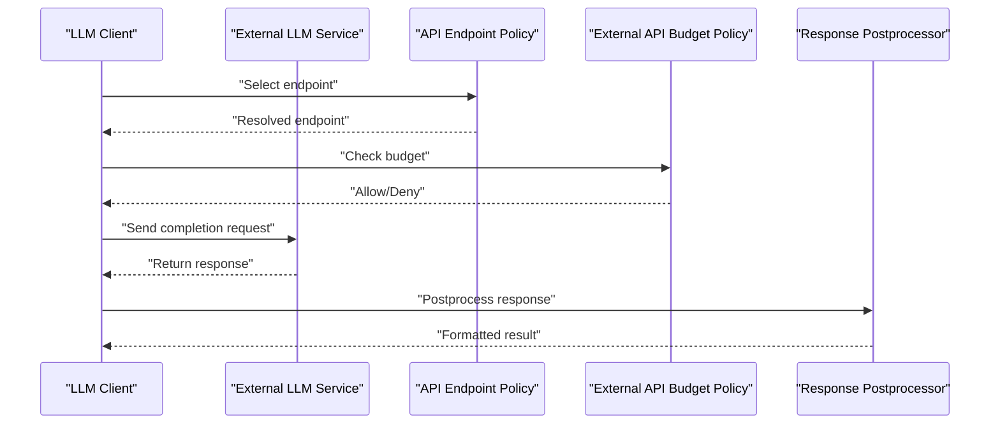
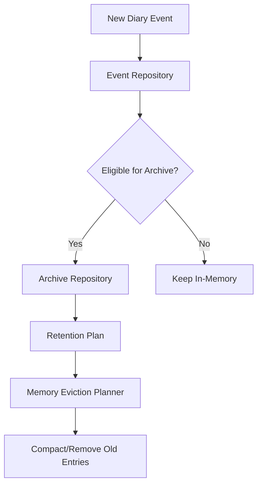
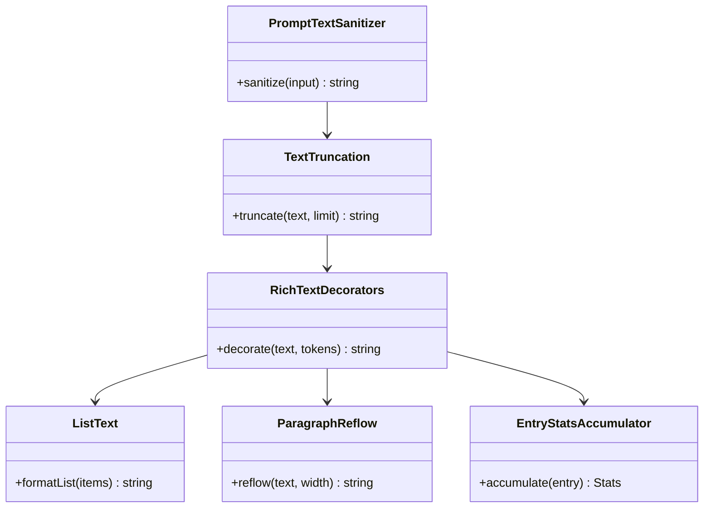
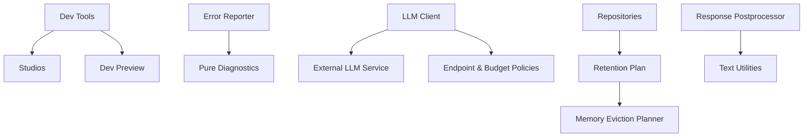

# Debugging & Profiling Tools

## Table of Contents
1. Introduction
2. Project Structure
3. Core Components
4. Architecture Overview
5. Detailed Component Analysis
6. Dependency Analysis
7. Performance Considerations
8. Troubleshooting Guide
9. Conclusion
10. Appendices

## Introduction
This document provides a comprehensive guide to debugging and profiling for the project. It explains built-in debug actions, diagnostic tools, logging mechanisms, performance profiling techniques, memory usage analysis, and bottleneck identification strategies. It also covers how to use the prompt studio, error reporting system, and development utilities, with step-by-step guides for investigating issues in event processing, AI generation, and integration points.

## Project Structure
The codebase organizes debugging and diagnostics across several areas:
- Development utilities and dev-only game components
- Diagnostics and error reporting
- Settings UI including studios (prompt, persona, psychotype)
- UI developer preview features
- Generation pipeline and external LLM client
- Integration layer for external APIs
- Pipeline policies for API endpoints, budgets, text processing, and retention

**Diagram sources**
- [PawnDiaryDebugActions.cs](../../../../Source/Dev/PawnDiaryDebugActions.cs)
- [DiaryGameComponent.Dev.cs](../../../../Source/Core/DiaryGameComponent.Dev.cs)
- [DiaryGameComponent.DevTools.cs](../../../../Source/Core/DiaryGameComponent.DevTools.cs)
- [DiaryErrorReporter.cs](../../../../Source/Diagnostics/DiaryErrorReporter.cs)
- [DiaryLogReportPatch.cs](../../../../Source/Diagnostics/DiaryLogReportPatch.cs)
- [ErrorFingerprint.cs](../../../../Source/Diagnostics/Pure/ErrorFingerprint.cs)
- [ErrorReportPayload.cs](../../../../Source/Diagnostics/Pure/ErrorReportPayload.cs)
- [ErrorScrub.cs](../../../../Source/Diagnostics/Pure/ErrorScrub.cs)
- [InstallSource.cs](../../../../Source/Diagnostics/Pure/InstallSource.cs)
- [ModErrorPrefixPolicy.cs](../../../../Source/Diagnostics/Pure/ModErrorPrefixPolicy.cs)
- [PawnDiaryMod.PromptStudio.cs](../../../../Source/Settings/PawnDiaryMod.PromptStudio.cs)
- [PawnDiaryMod.PersonaStudio.cs](../../../../Source/Settings/PawnDiaryMod.PersonaStudio.cs)
- [PawnDiaryMod.PsychotypeStudio.cs](../../../../Source/Settings/PawnDiaryMod.PsychotypeStudio.cs)
- [ITab_Pawn_Diary.DevPreview.cs](../../../../Source/UI/ITab_Pawn_Diary.DevPreview.cs)
- [LlmClient.cs](../../../../Source/Generation/LlmClient.cs)
- [ExternalLlmCompletionService.cs](../../../../Source/Integration/ExternalLlmCompletionService.cs)
- [ApiEndpointPolicy.cs](../../../../Source/Pipeline/ApiEndpointPolicy.cs)
- [ExternalApiBudgetPolicy.cs](../../../../Source/Pipeline/ExternalApiBudgetPolicy.cs)
- [DiaryEventRepository.cs](../../../../Source/Core/DiaryEventRepository.cs)
- [DiaryArchiveRepository.cs](../../../../Source/Core/DiaryArchiveRepository.cs)
- [DiaryRetentionPlan.cs](../../../../Source/Pipeline/DiaryRetentionPlan.cs)
- [MemoryEvictionPlanner.cs](../../../../Source/Pipeline/Memory/MemoryEvictionPlanner.cs)
- [TextTruncation.cs](../../../../Source/Pipeline/TextTruncation.cs)
- [PromptTextSanitizer.cs](../../../../Source/Pipeline/PromptTextSanitizer.cs)
- [DiaryResponsePostprocessor.cs](../../../../Source/Pipeline/DiaryResponsePostprocessor.cs)
- [DiaryRichTextDecorators.cs](../../../../Source/Pipeline/DiaryRichTextDecorators.cs)
- [DiaryListText.cs](../../../../Source/Pipeline/DiaryListText.cs)
- [DiaryParagraphReflow.cs](../../../../Source/Pipeline/DiaryParagraphReflow.cs)
- [DiaryEntryStatsAccumulator.cs](../../../../Source/Pipeline/DiaryEntryStatsAccumulator.cs)

**Section sources**
- [PawnDiaryDebugActions.cs](../../../../Source/Dev/PawnDiaryDebugActions.cs)
- [DiaryGameComponent.Dev.cs](../../../../Source/Core/DiaryGameComponent.Dev.cs)
- [DiaryGameComponent.DevTools.cs](../../../../Source/Core/DiaryGameComponent.DevTools.cs)
- [DiaryErrorReporter.cs](../../../../Source/Diagnostics/DiaryErrorReporter.cs)
- [DiaryLogReportPatch.cs](../../../../Source/Diagnostics/DiaryLogReportPatch.cs)
- [ErrorFingerprint.cs](../../../../Source/Diagnostics/Pure/ErrorFingerprint.cs)
- [ErrorReportPayload.cs](../../../../Source/Diagnostics/Pure/ErrorReportPayload.cs)
- [ErrorScrub.cs](../../../../Source/Diagnostics/Pure/ErrorScrub.cs)
- [InstallSource.cs](../../../../Source/Diagnostics/Pure/InstallSource.cs)
- [ModErrorPrefixPolicy.cs](../../../../Source/Diagnostics/Pure/ModErrorPrefixPolicy.cs)
- [PawnDiaryMod.PromptStudio.cs](../../../../Source/Settings/PawnDiaryMod.PromptStudio.cs)
- [PawnDiaryMod.PersonaStudio.cs](../../../../Source/Settings/PawnDiaryMod.PersonaStudio.cs)
- [PawnDiaryMod.PsychotypeStudio.cs](../../../../Source/Settings/PawnDiaryMod.PsychotypeStudio.cs)
- [ITab_Pawn_Diary.DevPreview.cs](../../../../Source/UI/ITab_Pawn_Diary.DevPreview.cs)
- [LlmClient.cs](../../../../Source/Generation/LlmClient.cs)
- [ExternalLlmCompletionService.cs](../../../../Source/Integration/ExternalLlmCompletionService.cs)
- [ApiEndpointPolicy.cs](../../../../Source/Pipeline/ApiEndpointPolicy.cs)
- [ExternalApiBudgetPolicy.cs](../../../../Source/Pipeline/ExternalApiBudgetPolicy.cs)
- [DiaryEventRepository.cs](../../../../Source/Core/DiaryEventRepository.cs)
- [DiaryArchiveRepository.cs](../../../../Source/Core/DiaryArchiveRepository.cs)
- [DiaryRetentionPlan.cs](../../../../Source/Pipeline/DiaryRetentionPlan.cs)
- [MemoryEvictionPlanner.cs](../../../../Source/Pipeline/Memory/MemoryEvictionPlanner.cs)
- [TextTruncation.cs](../../../../Source/Pipeline/TextTruncation.cs)
- [PromptTextSanitizer.cs](../../../../Source/Pipeline/PromptTextSanitizer.cs)
- [DiaryResponsePostprocessor.cs](../../../../Source/Pipeline/DiaryResponsePostprocessor.cs)
- [DiaryRichTextDecorators.cs](../../../../Source/Pipeline/DiaryRichTextDecorators.cs)
- [DiaryListText.cs](../../../../Source/Pipeline/DiaryListText.cs)
- [DiaryParagraphReflow.cs](../../../../Source/Pipeline/DiaryParagraphReflow.cs)
- [DiaryEntryStatsAccumulator.cs](../../../../Source/Pipeline/DiaryEntryStatsAccumulator.cs)

## Core Components
- Built-in debug actions and dev tools: Provide runtime controls for testing prompts, generating previews, running test suites, and inspecting state.
- Diagnostics and error reporting: Centralized error reporting, log patching, fingerprinting, scrubbing, install source detection, and mod prefix policies.
- Studios and UI: Prompt studio, persona studio, psychotype studio, and dev preview tab for interactive experimentation.
- Generation and integration: LLM client and external completion service with endpoint policy and budget enforcement.
- Pipeline and storage: Repositories for events and archives, retention planning, memory eviction, text processing, response postprocessing, rich text decoration, list formatting, paragraph reflow, and stats accumulation.

**Section sources**
- [DiaryGameComponent.Dev.cs](../../../../Source/Core/DiaryGameComponent.Dev.cs)
- [DiaryGameComponent.DevTools.cs](../../../../Source/Core/DiaryGameComponent.DevTools.cs)
- [DiaryErrorReporter.cs](../../../../Source/Diagnostics/DiaryErrorReporter.cs)
- [DiaryLogReportPatch.cs](../../../../Source/Diagnostics/DiaryLogReportPatch.cs)
- [ErrorFingerprint.cs](../../../../Source/Diagnostics/Pure/ErrorFingerprint.cs)
- [ErrorReportPayload.cs](../../../../Source/Diagnostics/Pure/ErrorReportPayload.cs)
- [ErrorScrub.cs](../../../../Source/Diagnostics/Pure/ErrorScrub.cs)
- [InstallSource.cs](../../../../Source/Diagnostics/Pure/InstallSource.cs)
- [ModErrorPrefixPolicy.cs](../../../../Source/Diagnostics/Pure/ModErrorPrefixPolicy.cs)
- [PawnDiaryMod.PromptStudio.cs](../../../../Source/Settings/PawnDiaryMod.PromptStudio.cs)
- [PawnDiaryMod.PersonaStudio.cs](../../../../Source/Settings/PawnDiaryMod.PersonaStudio.cs)
- [PawnDiaryMod.PsychotypeStudio.cs](../../../../Source/Settings/PawnDiaryMod.PsychotypeStudio.cs)
- [ITab_Pawn_Diary.DevPreview.cs](../../../../Source/UI/ITab_Pawn_Diary.DevPreview.cs)
- [LlmClient.cs](../../../../Source/Generation/LlmClient.cs)
- [ExternalLlmCompletionService.cs](../../../../Source/Integration/ExternalLlmCompletionService.cs)
- [ApiEndpointPolicy.cs](../../../../Source/Pipeline/ApiEndpointPolicy.cs)
- [ExternalApiBudgetPolicy.cs](../../../../Source/Pipeline/ExternalApiBudgetPolicy.cs)
- [DiaryEventRepository.cs](../../../../Source/Core/DiaryEventRepository.cs)
- [DiaryArchiveRepository.cs](../../../../Source/Core/DiaryArchiveRepository.cs)
- [DiaryRetentionPlan.cs](../../../../Source/Pipeline/DiaryRetentionPlan.cs)
- [MemoryEvictionPlanner.cs](../../../../Source/Pipeline/Memory/MemoryEvictionPlanner.cs)
- [TextTruncation.cs](../../../../Source/Pipeline/TextTruncation.cs)
- [PromptTextSanitizer.cs](../../../../Source/Pipeline/PromptTextSanitizer.cs)
- [DiaryResponsePostprocessor.cs](../../../../Source/Pipeline/DiaryResponsePostprocessor.cs)
- [DiaryRichTextDecorators.cs](../../../../Source/Pipeline/DiaryRichTextDecorators.cs)
- [DiaryListText.cs](../../../../Source/Pipeline/DiaryListText.cs)
- [DiaryParagraphReflow.cs](../../../../Source/Pipeline/DiaryParagraphReflow.cs)
- [DiaryEntryStatsAccumulator.cs](../../../../Source/Pipeline/DiaryEntryStatsAccumulator.cs)

## Architecture Overview
The debugging and profiling architecture centers on dev components that expose interactive controls, integrated diagnostics for robust error handling, and studios for iterative prompt and persona tuning. The generation pipeline integrates with external LLM services under endpoint and budget policies, while the storage and retention layers ensure efficient memory and disk usage.

**Diagram sources**
- [DiaryGameComponent.DevTools.cs](../../../../Source/Core/DiaryGameComponent.DevTools.cs)
- [PawnDiaryMod.PromptStudio.cs](../../../../Source/Settings/PawnDiaryMod.PromptStudio.cs)
- [LlmClient.cs](../../../../Source/Generation/LlmClient.cs)
- [ExternalLlmCompletionService.cs](../../../../Source/Integration/ExternalLlmCompletionService.cs)
- [DiaryEventRepository.cs](../../../../Source/Core/DiaryEventRepository.cs)
- [DiaryArchiveRepository.cs](../../../../Source/Core/DiaryArchiveRepository.cs)
- [DiaryRetentionPlan.cs](../../../../Source/Pipeline/DiaryRetentionPlan.cs)

## Detailed Component Analysis

### Built-in Debug Actions and Dev Tools
- Purpose: Provide runtime commands and utilities to trigger tests, generate previews, and inspect internal state.
- Key capabilities:
  - Trigger prompt previews and test suites
  - Inspect repositories and retention plans
  - Execute targeted operations via dev actions
- Typical workflow:
  - Open dev menu or tab
  - Select action (e.g., run prompt test suite)
  - Observe results in logs or UI

**Diagram sources**
- [PawnDiaryDebugActions.cs](../../../../Source/Dev/PawnDiaryDebugActions.cs)
- [DiaryGameComponent.Dev.cs](../../../../Source/Core/DiaryGameComponent.Dev.cs)
- [DiaryGameComponent.DevTools.cs](../../../../Source/Core/DiaryGameComponent.DevTools.cs)
- [ITab_Pawn_Diary.DevPreview.cs](../../../../Source/UI/ITab_Pawn_Diary.DevPreview.cs)

**Section sources**
- [PawnDiaryDebugActions.cs](../../../../Source/Dev/PawnDiaryDebugActions.cs)
- [DiaryGameComponent.Dev.cs](../../../../Source/Core/DiaryGameComponent.Dev.cs)
- [DiaryGameComponent.DevTools.cs](../../../../Source/Core/DiaryGameComponent.DevTools.cs)
- [ITab_Pawn_Diary.DevPreview.cs](../../../../Source/UI/ITab_Pawn_Diary.DevPreview.cs)

### Diagnostics and Error Reporting System
- Purpose: Centralize error reporting, sanitize sensitive data, fingerprint errors for deduplication, and annotate reports with install source and mod prefixes.
- Key capabilities:
  - Aggregate and report errors
  - Patch log output for structured reporting
  - Fingerprint and scrub payloads
  - Detect installation source and apply mod-specific prefixes
- Typical flow:
  - Exception occurs
  - Error reporter captures details
  - Scrub sensitive fields
  - Generate fingerprint
  - Attach install source and mod prefix
  - Submit report via patched logger

**Diagram sources**
- [DiaryErrorReporter.cs](../../../../Source/Diagnostics/DiaryErrorReporter.cs)
- [DiaryLogReportPatch.cs](../../../../Source/Diagnostics/DiaryLogReportPatch.cs)
- [ErrorScrub.cs](../../../../Source/Diagnostics/Pure/ErrorScrub.cs)
- [ErrorFingerprint.cs](../../../../Source/Diagnostics/Pure/ErrorFingerprint.cs)
- [InstallSource.cs](../../../../Source/Diagnostics/Pure/InstallSource.cs)
- [ModErrorPrefixPolicy.cs](../../../../Source/Diagnostics/Pure/ModErrorPrefixPolicy.cs)
- [ErrorReportPayload.cs](../../../../Source/Diagnostics/Pure/ErrorReportPayload.cs)

**Section sources**
- [DiaryErrorReporter.cs](../../../../Source/Diagnostics/DiaryErrorReporter.cs)
- [DiaryLogReportPatch.cs](../../../../Source/Diagnostics/DiaryLogReportPatch.cs)
- [ErrorScrub.cs](../../../../Source/Diagnostics/Pure/ErrorScrub.cs)
- [ErrorFingerprint.cs](../../../../Source/Diagnostics/Pure/ErrorFingerprint.cs)
- [InstallSource.cs](../../../../Source/Diagnostics/Pure/InstallSource.cs)
- [ModErrorPrefixPolicy.cs](../../../../Source/Diagnostics/Pure/ModErrorPrefixPolicy.cs)
- [ErrorReportPayload.cs](../../../../Source/Diagnostics/Pure/ErrorReportPayload.cs)

### Prompt Studio, Persona Studio, and Psychotype Studio
- Purpose: Interactive environments to author, test, and refine prompts, personas, and psychotypes.
- Capabilities:
  - Build and preview prompts
  - Adjust persona attributes and observe effects
  - Configure psychotype settings and validate outcomes
- Usage pattern:
  - Open studio from dev tools or settings
  - Modify inputs and see live previews
  - Export or save configurations for reuse

**Diagram sources**
- [PawnDiaryMod.PromptStudio.cs](../../../../Source/Settings/PawnDiaryMod.PromptStudio.cs)
- [PawnDiaryMod.PersonaStudio.cs](../../../../Source/Settings/PawnDiaryMod.PersonaStudio.cs)
- [PawnDiaryMod.PsychotypeStudio.cs](../../../../Source/Settings/PawnDiaryMod.PsychotypeStudio.cs)
- [DiaryGameComponent.DevTools.cs](../../../../Source/Core/DiaryGameComponent.DevTools.cs)

**Section sources**
- [PawnDiaryMod.PromptStudio.cs](../../../../Source/Settings/PawnDiaryMod.PromptStudio.cs)
- [PawnDiaryMod.PersonaStudio.cs](../../../../Source/Settings/PawnDiaryMod.PersonaStudio.cs)
- [PawnDiaryMod.PsychotypeStudio.cs](../../../../Source/Settings/PawnDiaryMod.PsychotypeStudio.cs)
- [DiaryGameComponent.DevTools.cs](../../../../Source/Core/DiaryGameComponent.DevTools.cs)

### AI Generation and External Integration
- Purpose: Generate content via external LLM services with endpoint selection and budget enforcement.
- Flow:
  - Client builds request
  - External service handles completion
  - Endpoint policy selects target
  - Budget policy enforces limits
  - Response is postprocessed and stored

**Diagram sources**
- [LlmClient.cs](../../../../Source/Generation/LlmClient.cs)
- [ExternalLlmCompletionService.cs](../../../../Source/Integration/ExternalLlmCompletionService.cs)
- [ApiEndpointPolicy.cs](../../../../Source/Pipeline/ApiEndpointPolicy.cs)
- [ExternalApiBudgetPolicy.cs](../../../../Source/Pipeline/ExternalApiBudgetPolicy.cs)
- [DiaryResponsePostprocessor.cs](../../../../Source/Pipeline/DiaryResponsePostprocessor.cs)

**Section sources**
- [LlmClient.cs](../../../../Source/Generation/LlmClient.cs)
- [ExternalLlmCompletionService.cs](../../../../Source/Integration/ExternalLlmCompletionService.cs)
- [ApiEndpointPolicy.cs](../../../../Source/Pipeline/ApiEndpointPolicy.cs)
- [ExternalApiBudgetPolicy.cs](../../../../Source/Pipeline/ExternalApiBudgetPolicy.cs)
- [DiaryResponsePostprocessor.cs](../../../../Source/Pipeline/DiaryResponsePostprocessor.cs)

### Event Processing and Storage
- Purpose: Persist diary events, manage archives, and enforce retention plans to control memory and disk usage.
- Flow:
  - Events are recorded into repository
  - Eligible entries are archived
  - Retention plan schedules compaction and eviction
  - Memory eviction planner manages in-memory structures

**Diagram sources**
- [DiaryEventRepository.cs](../../../../Source/Core/DiaryEventRepository.cs)
- [DiaryArchiveRepository.cs](../../../../Source/Core/DiaryArchiveRepository.cs)
- [DiaryRetentionPlan.cs](../../../../Source/Pipeline/DiaryRetentionPlan.cs)
- [MemoryEvictionPlanner.cs](../../../../Source/Pipeline/Memory/MemoryEvictionPlanner.cs)

**Section sources**
- [DiaryEventRepository.cs](../../../../Source/Core/DiaryEventRepository.cs)
- [DiaryArchiveRepository.cs](../../../../Source/Core/DiaryArchiveRepository.cs)
- [DiaryRetentionPlan.cs](../../../../Source/Pipeline/DiaryRetentionPlan.cs)
- [MemoryEvictionPlanner.cs](../../../../Source/Pipeline/Memory/MemoryEvictionPlanner.cs)

### Text Processing and Output Formatting
- Purpose: Sanitize prompts, truncate text, decorate rich text, format lists, reflow paragraphs, and accumulate stats for insights.
- Components:
  - Prompt text sanitizer
  - Text truncation
  - Rich text decorators
  - List text formatter
  - Paragraph reflow
  - Entry stats accumulator

**Diagram sources**
- [PromptTextSanitizer.cs](../../../../Source/Pipeline/PromptTextSanitizer.cs)
- [TextTruncation.cs](../../../../Source/Pipeline/TextTruncation.cs)
- [DiaryRichTextDecorators.cs](../../../../Source/Pipeline/DiaryRichTextDecorators.cs)
- [DiaryListText.cs](../../../../Source/Pipeline/DiaryListText.cs)
- [DiaryParagraphReflow.cs](../../../../Source/Pipeline/DiaryParagraphReflow.cs)
- [DiaryEntryStatsAccumulator.cs](../../../../Source/Pipeline/DiaryEntryStatsAccumulator.cs)

**Section sources**
- [PromptTextSanitizer.cs](../../../../Source/Pipeline/PromptTextSanitizer.cs)
- [TextTruncation.cs](../../../../Source/Pipeline/TextTruncation.cs)
- [DiaryRichTextDecorators.cs](../../../../Source/Pipeline/DiaryRichTextDecorators.cs)
- [DiaryListText.cs](../../../../Source/Pipeline/DiaryListText.cs)
- [DiaryParagraphReflow.cs](../../../../Source/Pipeline/DiaryParagraphReflow.cs)
- [DiaryEntryStatsAccumulator.cs](../../../../Source/Pipeline/DiaryEntryStatsAccumulator.cs)

## Dependency Analysis
Key dependencies among debugging and profiling components:
- Dev tools depend on studios and dev preview UI
- Error reporter depends on pure diagnostics utilities
- LLM client depends on external service and policies
- Repositories depend on retention plan and memory eviction planner
- Response postprocessor depends on text processing utilities

**Diagram sources**
- [DiaryGameComponent.DevTools.cs](../../../../Source/Core/DiaryGameComponent.DevTools.cs)
- [PawnDiaryMod.PromptStudio.cs](../../../../Source/Settings/PawnDiaryMod.PromptStudio.cs)
- [ITab_Pawn_Diary.DevPreview.cs](../../../../Source/UI/ITab_Pawn_Diary.DevPreview.cs)
- [DiaryErrorReporter.cs](../../../../Source/Diagnostics/DiaryErrorReporter.cs)
- [ErrorFingerprint.cs](../../../../Source/Diagnostics/Pure/ErrorFingerprint.cs)
- [ErrorReportPayload.cs](../../../../Source/Diagnostics/Pure/ErrorReportPayload.cs)
- [ErrorScrub.cs](../../../../Source/Diagnostics/Pure/ErrorScrub.cs)
- [InstallSource.cs](../../../../Source/Diagnostics/Pure/InstallSource.cs)
- [ModErrorPrefixPolicy.cs](../../../../Source/Diagnostics/Pure/ModErrorPrefixPolicy.cs)
- [LlmClient.cs](../../../../Source/Generation/LlmClient.cs)
- [ExternalLlmCompletionService.cs](../../../../Source/Integration/ExternalLlmCompletionService.cs)
- [ApiEndpointPolicy.cs](../../../../Source/Pipeline/ApiEndpointPolicy.cs)
- [ExternalApiBudgetPolicy.cs](../../../../Source/Pipeline/ExternalApiBudgetPolicy.cs)
- [DiaryEventRepository.cs](../../../../Source/Core/DiaryEventRepository.cs)
- [DiaryArchiveRepository.cs](../../../../Source/Core/DiaryArchiveRepository.cs)
- [DiaryRetentionPlan.cs](../../../../Source/Pipeline/DiaryRetentionPlan.cs)
- [MemoryEvictionPlanner.cs](../../../../Source/Pipeline/Memory/MemoryEvictionPlanner.cs)
- [DiaryResponsePostprocessor.cs](../../../../Source/Pipeline/DiaryResponsePostprocessor.cs)
- [PromptTextSanitizer.cs](../../../../Source/Pipeline/PromptTextSanitizer.cs)
- [TextTruncation.cs](../../../../Source/Pipeline/TextTruncation.cs)
- [DiaryRichTextDecorators.cs](../../../../Source/Pipeline/DiaryRichTextDecorators.cs)
- [DiaryListText.cs](../../../../Source/Pipeline/DiaryListText.cs)
- [DiaryParagraphReflow.cs](../../../../Source/Pipeline/DiaryParagraphReflow.cs)
- [DiaryEntryStatsAccumulator.cs](../../../../Source/Pipeline/DiaryEntryStatsAccumulator.cs)

**Section sources**
- [DiaryGameComponent.DevTools.cs](../../../../Source/Core/DiaryGameComponent.DevTools.cs)
- [PawnDiaryMod.PromptStudio.cs](../../../../Source/Settings/PawnDiaryMod.PromptStudio.cs)
- [ITab_Pawn_Diary.DevPreview.cs](../../../../Source/UI/ITab_Pawn_Diary.DevPreview.cs)
- [DiaryErrorReporter.cs](../../../../Source/Diagnostics/DiaryErrorReporter.cs)
- [ErrorFingerprint.cs](../../../../Source/Diagnostics/Pure/ErrorFingerprint.cs)
- [ErrorReportPayload.cs](../../../../Source/Diagnostics/Pure/ErrorReportPayload.cs)
- [ErrorScrub.cs](../../../../Source/Diagnostics/Pure/ErrorScrub.cs)
- [InstallSource.cs](../../../../Source/Diagnostics/Pure/InstallSource.cs)
- [ModErrorPrefixPolicy.cs](../../../../Source/Diagnostics/Pure/ModErrorPrefixPolicy.cs)
- [LlmClient.cs](../../../../Source/Generation/LlmClient.cs)
- [ExternalLlmCompletionService.cs](../../../../Source/Integration/ExternalLlmCompletionService.cs)
- [ApiEndpointPolicy.cs](../../../../Source/Pipeline/ApiEndpointPolicy.cs)
- [ExternalApiBudgetPolicy.cs](../../../../Source/Pipeline/ExternalApiBudgetPolicy.cs)
- [DiaryEventRepository.cs](../../../../Source/Core/DiaryEventRepository.cs)
- [DiaryArchiveRepository.cs](../../../../Source/Core/DiaryArchiveRepository.cs)
- [DiaryRetentionPlan.cs](../../../../Source/Pipeline/DiaryRetentionPlan.cs)
- [MemoryEvictionPlanner.cs](../../../../Source/Pipeline/Memory/MemoryEvictionPlanner.cs)
- [DiaryResponsePostprocessor.cs](../../../../Source/Pipeline/DiaryResponsePostprocessor.cs)
- [PromptTextSanitizer.cs](../../../../Source/Pipeline/PromptTextSanitizer.cs)
- [TextTruncation.cs](../../../../Source/Pipeline/TextTruncation.cs)
- [DiaryRichTextDecorators.cs](../../../../Source/Pipeline/DiaryRichTextDecorators.cs)
- [DiaryListText.cs](../../../../Source/Pipeline/DiaryListText.cs)
- [DiaryParagraphReflow.cs](../../../../Source/Pipeline/DiaryParagraphReflow.cs)
- [DiaryEntryStatsAccumulator.cs](../../../../Source/Pipeline/DiaryEntryStatsAccumulator.cs)

## Performance Considerations
- Use retention plans and memory eviction planners to prevent unbounded growth of in-memory structures and archives.
- Monitor text processing costs; prefer sanitization and truncation before expensive operations.
- Enforce external API budgets to avoid excessive calls and latency spikes.
- Leverage stats accumulation to identify hotspots and optimize frequently executed paths.
- Profile prompt building and response postprocessing to reduce overhead during high-frequency events.

[No sources needed since this section provides general guidance]

## Troubleshooting Guide

### Investigating Event Processing Issues
- Steps:
  - Use dev tools to trigger relevant events and capture outputs
  - Inspect event repository for persisted entries
  - Check archive repository for eligibility and archival behavior
  - Review retention plan decisions and memory eviction actions
- Tips:
  - Filter logs by event type and timestamp
  - Validate retention thresholds and compaction schedules
  - Confirm memory eviction planner targets old or low-priority entries

**Section sources**
- [DiaryGameComponent.DevTools.cs](../../../../Source/Core/DiaryGameComponent.DevTools.cs)
- [DiaryEventRepository.cs](../../../../Source/Core/DiaryEventRepository.cs)
- [DiaryArchiveRepository.cs](../../../../Source/Core/DiaryArchiveRepository.cs)
- [DiaryRetentionPlan.cs](../../../../Source/Pipeline/DiaryRetentionPlan.cs)
- [MemoryEvictionPlanner.cs](../../../../Source/Pipeline/Memory/MemoryEvictionPlanner.cs)

### Investigating AI Generation Problems
- Steps:
  - Open prompt studio to reproduce the failing prompt
  - Verify endpoint selection and budget allowance
  - Send a completion request via external LLM service
  - Inspect postprocessing steps for formatting issues
- Tips:
  - Compare sanitized input against expected templates
  - Check truncation limits and rich text decorations
  - Use dev preview tab to visualize intermediate results

**Section sources**
- [PawnDiaryMod.PromptStudio.cs](../../../../Source/Settings/PawnDiaryMod.PromptStudio.cs)
- [LlmClient.cs](../../../../Source/Generation/LlmClient.cs)
- [ExternalLlmCompletionService.cs](../../../../Source/Integration/ExternalLlmCompletionService.cs)
- [ApiEndpointPolicy.cs](../../../../Source/Pipeline/ApiEndpointPolicy.cs)
- [ExternalApiBudgetPolicy.cs](../../../../Source/Pipeline/ExternalApiBudgetPolicy.cs)
- [DiaryResponsePostprocessor.cs](../../../../Source/Pipeline/DiaryResponsePostprocessor.cs)
- [ITab_Pawn_Diary.DevPreview.cs](../../../../Source/UI/ITab_Pawn_Diary.DevPreview.cs)

### Investigating Integration Points
- Steps:
  - Confirm external service connectivity and credentials
  - Validate endpoint policy configuration
  - Ensure budget policy permits requests
  - Examine postprocessed responses for correctness
- Tips:
  - Use dev actions to simulate integration calls
  - Review logs patched by the log report patch for structured diagnostics
  - Cross-check install source and mod prefix annotations in error reports

**Section sources**
- [ExternalLlmCompletionService.cs](../../../../Source/Integration/ExternalLlmCompletionService.cs)
- [ApiEndpointPolicy.cs](../../../../Source/Pipeline/ApiEndpointPolicy.cs)
- [ExternalApiBudgetPolicy.cs](../../../../Source/Pipeline/ExternalApiBudgetPolicy.cs)
- [DiaryLogReportPatch.cs](../../../../Source/Diagnostics/DiaryLogReportPatch.cs)
- [InstallSource.cs](../../../../Source/Diagnostics/Pure/InstallSource.cs)
- [ModErrorPrefixPolicy.cs](../../../../Source/Diagnostics/Pure/ModErrorPrefixPolicy.cs)

### Analyzing Logs and Errors
- Steps:
  - Enable structured logging via the log report patch
  - Use error reporter to capture exceptions
  - Apply scrubbing to remove sensitive data
  - Compute fingerprints to group similar errors
  - Attach install source and mod prefix for context
- Tips:
  - Search logs by fingerprint to identify recurring issues
  - Correlate errors with specific prompts or events
  - Use dev tools to replay problematic scenarios

**Section sources**
- [DiaryLogReportPatch.cs](../../../../Source/Diagnostics/DiaryLogReportPatch.cs)
- [DiaryErrorReporter.cs](../../../../Source/Diagnostics/DiaryErrorReporter.cs)
- [ErrorScrub.cs](../../../../Source/Diagnostics/Pure/ErrorScrub.cs)
- [ErrorFingerprint.cs](../../../../Source/Diagnostics/Pure/ErrorFingerprint.cs)
- [InstallSource.cs](../../../../Source/Diagnostics/Pure/InstallSource.cs)
- [ModErrorPrefixPolicy.cs](../../../../Source/Diagnostics/Pure/ModErrorPrefixPolicy.cs)
- [ErrorReportPayload.cs](../../../../Source/Diagnostics/Pure/ErrorReportPayload.cs)

## Conclusion
This guide consolidates the debugging and profiling capabilities available in the project. By leveraging dev tools, studios, diagnostics, and pipeline utilities, developers can efficiently investigate issues in event processing, AI generation, and integrations. Adopting the recommended workflows and performance practices will improve reliability and maintainability.

[No sources needed since this section summarizes without analyzing specific files]

## Appendices

### Step-by-Step Guides

#### Using the Prompt Studio
- Open the prompt studio from dev tools
- Construct or load an existing prompt template
- Preview the generated output and adjust parameters
- Save configurations for future runs

**Section sources**
- [DiaryGameComponent.DevTools.cs](../../../../Source/Core/DiaryGameComponent.DevTools.cs)
- [PawnDiaryMod.PromptStudio.cs](../../../../Source/Settings/PawnDiaryMod.PromptStudio.cs)

#### Running the Prompt Test Suite
- Access the test suite via dev components
- Execute tests targeting specific prompts or scenarios
- Review results and failures in logs or UI

**Section sources**
- [DiaryGameComponent.PromptTestSuite.cs](../../../../Source/Core/DiaryGameComponent.PromptTestSuite.cs)

#### Inspecting State with Dev Preview
- Open the dev preview tab
- Inspect current state and recent entries
- Trigger targeted operations for diagnosis

**Section sources**
- [ITab_Pawn_Diary.DevPreview.cs](../../../../Source/UI/ITab_Pawn_Diary.DevPreview.cs)

#### Managing Memory and Archives
- Review retention plan policies
- Monitor memory eviction planner actions
- Adjust thresholds based on observed usage patterns

**Section sources**
- [DiaryRetentionPlan.cs](../../../../Source/Pipeline/DiaryRetentionPlan.cs)
- [MemoryEvictionPlanner.cs](../../../../Source/Pipeline/Memory/MemoryEvictionPlanner.cs)
