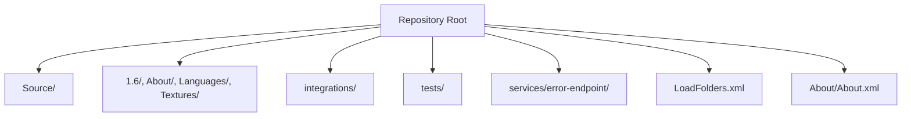
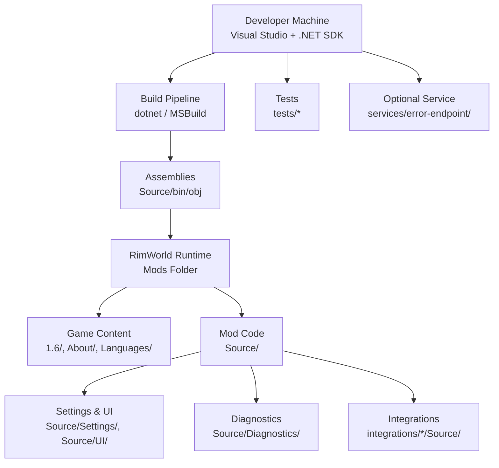
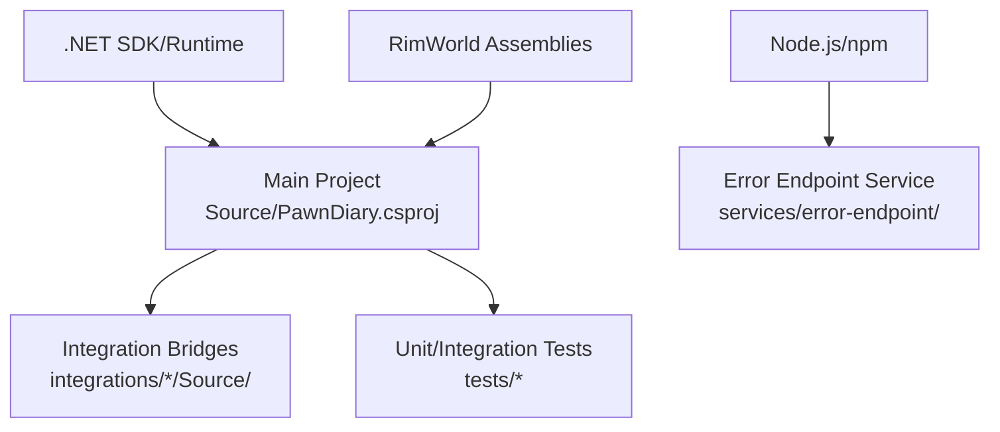

# Development Environment Setup

<cite>
**Referenced Files in This Document**
- [LoadFolders.xml](../../../../LoadFolders.xml)
- [About/About.xml](../../../../About/About.xml)
- [Source/PawnDiary.csproj](../../../../Source/PawnDiary.csproj)
- [.githooks/verify.ps1](../../../../.githooks/verify.ps1)
- [.github/workflows](../../../../.github/workflows)
- [integrations/README.md](../../../../integrations/README.md)
- [tests/PawnDiary.RimTest/README.md](../../../../tests/PawnDiary.RimTest/README.md)
- [services/error-endpoint/README.md](../../../../services/error-endpoint/README.md)
</cite>

## Table of Contents
1. Introduction
2. Project Structure
3. Core Components
4. Architecture Overview
5. Detailed Component Analysis
6. Dependency Analysis
7. Performance Considerations
8. Troubleshooting Guide
9. Conclusion
10. Appendices

## Introduction
This document provides a complete guide to setting up a development environment for the RimWorld mod project. It covers required tools (Visual Studio, .NET SDK), RimWorld modding dependencies, workspace organization, build configuration, IDE setup, debugging workflows, version control with Git hooks, code formatting rules, and pre-commit validation. It also includes troubleshooting guidance for common setup issues and dependency conflicts.

## Project Structure
The repository is organized as a multi-target RimWorld mod solution with:
- Source code under Source/
- Game assets and definitions under 1.6/, About/, Languages/, Textures/
- Integration bridges under integrations/
- Unit and integration tests under tests/
- Optional backend service under services/error-endpoint/
- Build and load configuration files at the root

**Diagram sources**
- [LoadFolders.xml](../../../../LoadFolders.xml)
- [About/About.xml](../../../../About/About.xml)

Key folders and their roles:
- Source/: C# source code, game components, patches, UI, settings, models, pipeline logic, and diagnostics.
- 1.6/: Versioned game content (Defs, Patches, Assemblies).
- About/: Mod metadata and published file IDs.
- Languages/: Localized text and DefInjected resources.
- integrations/: Companion mods bridging external systems into the core mod.
- tests/: Unit and integration test projects, including a RimWorld runtime test harness.
- services/error-endpoint/: Optional Node.js service for error reporting.

**Section sources**
- [LoadFolders.xml](../../../../LoadFolders.xml)
- [About/About.xml](../../../../About/About.xml)

## Core Components
- Build system: The main C# project is defined by a .csproj file under Source/. Use Visual Studio to open the solution or build via dotnet CLI.
- RimWorld integration: The mod uses XML Defs and Patches under 1.6/ and loads through LoadFolders.xml.
- Settings and UI: Configuration windows and runtime settings are implemented under Source/Settings/ and Source/UI/.
- Diagnostics: Error reporting and logging utilities are under Source/Diagnostics/.
- Integrations: Bridges to other mods live under integrations/ and each bridge has its own Source/ and 1.6/ layout mirroring the main mod structure.

Recommended workflow:
- Open the Solution Explorer in Visual Studio and build the main project.
- Launch RimWorld with the mod enabled using the provided folder layout.
- Use the in-game settings window to configure API endpoints and behavior.

**Section sources**
- [Source/PawnDiary.csproj](../../../../Source/PawnDiary.csproj)
- [LoadFolders.xml](../../../../LoadFolders.xml)
- [About/About.xml](../../../../About/About.xml)

## Architecture Overview
High-level architecture for development and runtime:

[No sources needed since this diagram shows conceptual workflow, not actual code structure]

## Detailed Component Analysis

### Required Tools and Versions
- Visual Studio 2022 (recommended) with C# workload installed.
- .NET SDK compatible with the project’s target framework (check the .csproj).
- RimWorld game installation with Steam Workshop enabled for testing.
- Git for version control and hook management.
- PowerShell (Windows) for running pre-commit hooks.

Notes:
- Ensure your .NET SDK matches the project’s requirements; mismatched versions will cause build failures.
- For integration tests that run inside RimWorld, ensure the game path is correctly configured in the test project.

**Section sources**
- [Source/PawnDiary.csproj](../../../../Source/PawnDiary.csproj)
- [tests/PawnDiary.RimTest/README.md](../../../../tests/PawnDiary.RimTest/README.md)

### Workspace Organization and Conventions
- Place all C# source code under Source/.
- Keep version-specific assets under 1.6/.
- Store localized strings under Languages/<Language>/DefInjected and Keyed.
- Maintain mod metadata and IDs under About/.
- Each integration bridge under integrations/ mirrors the main mod structure.

Folder layout conventions:
- Source/Core: Core game component and lifecycle.
- Source/Capture: Event capture policies and catalogs.
- Source/Generation: Prompt generation and LLM client logic.
- Source/Ingestion: Signals and event ingestion.
- Source/Integration: Public API and snapshot types.
- Source/Models: Data models and state holders.
- Source/Patches: Harmony-style patches for RimWorld.
- Source/Pipeline: Processing pipelines, context builders, and decorators.
- Source/Settings: In-game settings UI and persistence.
- Source/UI: Tab and dialog implementations.
- Source/Util: Shared utilities.

**Section sources**
- [LoadFolders.xml](../../../../LoadFolders.xml)
- [About/About.xml](../../../../About/About.xml)

### Build Configuration
- Main project file: Source/PawnDiary.csproj defines targets, references, and outputs.
- LoadFolders.xml configures how RimWorld discovers mod folders.
- About/About.xml contains mod metadata and versioning.

Steps:
- Open the solution in Visual Studio and restore NuGet packages if any.
- Build the project to produce assemblies under Source/bin.
- Verify that LoadFolders.xml points to the correct output directories.

**Section sources**
- [Source/PawnDiary.csproj](../../../../Source/PawnDiary.csproj)
- [LoadFolders.xml](../../../../LoadFolders.xml)
- [About/About.xml](../../../../About/About.xml)

### IDE Setup (Visual Studio)
- Install the C# workload.
- Open the solution or project file from Source/.
- Configure the debugger to launch RimWorld executable and pass necessary arguments if required by the test harness.
- Enable automatic package restore and format-on-save if desired.

Tips:
- Use the built-in Test Explorer to run unit tests.
- For integration tests that require RimWorld, follow instructions in the test README.

**Section sources**
- [tests/PawnDiary.RimTest/README.md](../../../../tests/PawnDiary.RimTest/README.md)

### Debugging Environments
- Attach to RimWorld process after launching the game with the mod enabled.
- Set breakpoints in Source/ for core logic, patches, and UI.
- Use the in-game settings window to toggle diagnostic features and adjust behavior.
- For integration tests, use the provided test runner to simulate gameplay scenarios.

**Section sources**
- [Source/Diagnostics](../../../../Source/Diagnostics)
- [tests/PawnDiary.RimTest/README.md](../../../../tests/PawnDiary.RimTest/README.md)

### Version Control and Git Hooks
- Pre-commit hook script: .githooks/verify.ps1 performs validation before commits.
- GitHub Actions workflows under .github/workflows can be used for CI builds and checks.

Setup steps:
- Initialize Git in the repository if not already done.
- Configure Git to use local hooks from .githooks/verify.ps1.
- Ensure PowerShell execution policy allows running scripts locally.

Validation performed by the hook:
- Runs verification tasks defined in the script to enforce quality gates prior to commit.

**Section sources**
- [.githooks/verify.ps1](../../../../.githooks/verify.ps1)
- [.github/workflows](../../../../.github/workflows)

### Code Formatting Rules and Pre-commit Validation
- The pre-commit hook enforces formatting and validation rules.
- Align editor settings with the project’s expectations (e.g., indentation, line endings).
- Run the hook manually if needed to diagnose issues before committing.

Recommendations:
- Configure Visual Studio to match the project’s formatting preferences.
- Use consistent line endings (CRLF on Windows) to avoid diffs.

**Section sources**
- [.githooks/verify.ps1](../../../../.githooks/verify.ps1)

### Integrations and Bridges
- Each bridge under integrations/ is a self-contained mod with its own Source/, 1.6/, and About/.
- Bridges expose APIs and sync data with external systems.
- Refer to integrations/README.md for details on building and testing bridges.

**Section sources**
- [integrations/README.md](../../../../integrations/README.md)

### Optional Backend Service
- A Node.js service under services/error-endpoint/ supports error reporting.
- Follow the service README to install dependencies and run locally for development.

**Section sources**
- [services/error-endpoint/README.md](../../../../services/error-endpoint/README.md)

## Dependency Analysis
External dependencies include:
- .NET SDK and runtime targeted by the C# project.
- RimWorld assemblies referenced by the mod and tests.
- Optional Node.js dependencies for the error endpoint service.

Dependency relationships:
- Main mod depends on RimWorld APIs and may reference third-party libraries via NuGet.
- Integration bridges depend on both the main mod and external mod APIs.
- Tests depend on the main mod and possibly on test frameworks.

[No sources needed since this diagram shows conceptual workflow, not actual code structure]

**Section sources**
- [Source/PawnDiary.csproj](../../../../Source/PawnDiary.csproj)
- [integrations/README.md](../../../../integrations/README.md)
- [services/error-endpoint/README.md](../../../../services/error-endpoint/README.md)

## Performance Considerations
- Avoid heavy synchronous operations in patch callbacks; prefer asynchronous patterns where supported.
- Cache frequently accessed data and minimize allocations in hot paths.
- Use profiling tools in Visual Studio to identify bottlenecks during gameplay.
- Limit network calls in the main thread; batch requests when possible.

[No sources needed since this section provides general guidance]

## Troubleshooting Guide
Common issues and resolutions:
- Build fails due to missing .NET SDK: Install the correct SDK version specified by the project file.
- RimWorld cannot find mod assemblies: Verify LoadFolders.xml and output directories.
- Hook errors on commit: Check PowerShell execution policy and ensure verify.ps1 is accessible.
- Integration tests fail to locate RimWorld: Confirm the game path in the test project configuration.
- Bridge build errors: Ensure dependent mods’ assemblies are available and versions align.

Diagnostic aids:
- Use the in-game settings window to enable detailed logs.
- Review the diagnostics module for error reporting and scrubbing utilities.
- Consult the test README for running and interpreting results.

**Section sources**
- [LoadFolders.xml](../../../../LoadFolders.xml)
- [.githooks/verify.ps1](../../../../.githooks/verify.ps1)
- [tests/PawnDiary.RimTest/README.md](../../../../tests/PawnDiary.RimTest/README.md)
- [Source/Diagnostics](../../../../Source/Diagnostics)

## Conclusion
You now have a comprehensive guide to set up the development environment, organize the workspace, build and debug the mod, manage integrations, and maintain code quality with Git hooks and formatting rules. Follow the steps above to get started, and refer to the troubleshooting section for resolving common issues.

## Appendices

### Step-by-step Setup Checklist
- Install Visual Studio with C# workload and the required .NET SDK.
- Clone the repository and open the project in Visual Studio.
- Restore packages and build the main project.
- Configure RimWorld to load the mod via LoadFolders.xml.
- Enable the mod in-game and verify functionality.
- Set up Git hooks and ensure pre-commit validation runs successfully.
- Run unit tests and integration tests as needed.

[No sources needed since this section summarizes without analyzing specific files]
