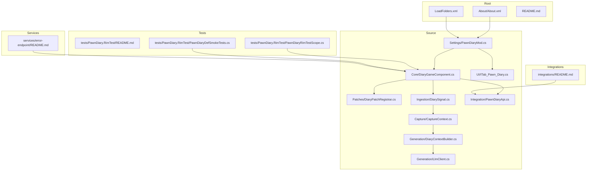
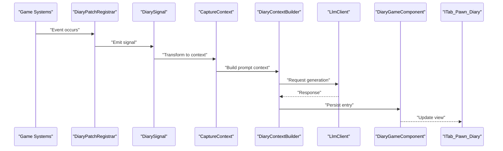
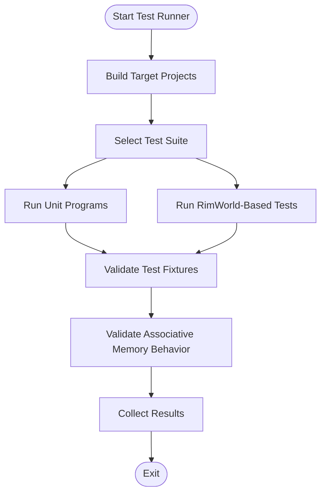
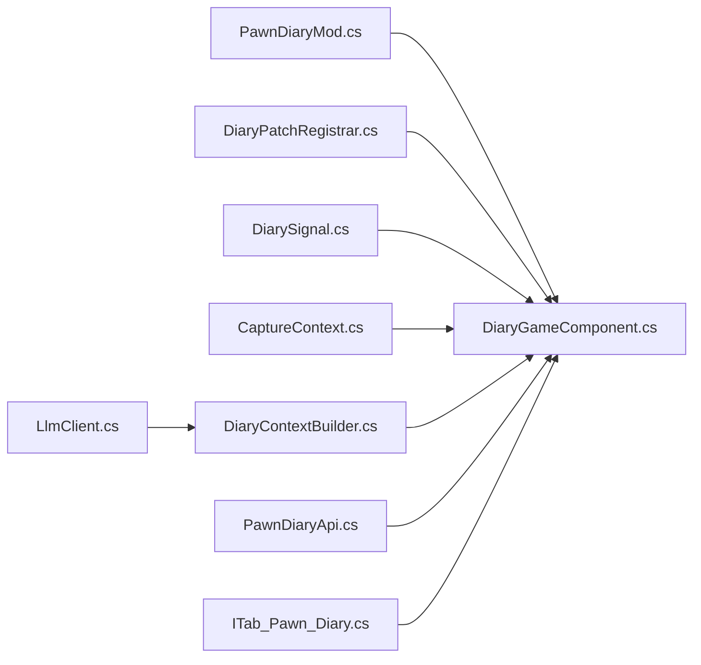

# Development Guide

- [README.md](../../../../README.md)
- [LoadFolders.xml](../../../../LoadFolders.xml)
- [About/About.xml](../../../../About/About.xml)
- [Source/PawnDiary.csproj](../../../../Source/PawnDiary.csproj)
- [Source/PawnDiary.slnx](../../../../Source/PawnDiary.slnx)
- [Source/Core/DiaryGameComponent.cs](../../../../Source/Core/DiaryGameComponent.cs)
- [Source/Patches/DiaryPatchRegistrar.cs](../../../../Source/Patches/DiaryPatchRegistrar.cs)
- [Source/Ingestion/DiarySignal.cs](../../../../Source/Ingestion/DiarySignal.cs)
- [Source/Capture/CaptureContext.cs](../../../../Source/Capture/CaptureContext.cs)
- [Source/Generation/DiaryContextBuilder.cs](../../../../Source/Generation/DiaryContextBuilder.cs)
- [Source/Generation/LlmClient.cs](../../../../Source/Generation/LlmClient.cs)
- [Source/Integration/PawnDiaryApi.cs](../../../../Source/Integration/PawnDiaryApi.cs)
- [Source/Settings/PawnDiaryMod.cs](../../../../Source/Settings/PawnDiaryMod.cs)
- [Source/UI/ITab_Pawn_Diary.cs](../../../../Source/UI/ITab_Pawn_Diary.cs)
- [tests/PawnDiary.RimTest/README.md](../../../../tests/PawnDiary.RimTest/README.md)
- [tests/PawnDiary.RimTest/PawnDiaryRimTestScope.cs](../../../../tests/PawnDiary.RimTest/PawnDiaryRimTestScope.cs)
- [tests/PawnDiary.RimTest/PawnDiaryDefSmokeTests.cs](../../../../tests/PawnDiary.RimTest/PawnDiaryDefSmokeTests.cs)
- [integrations/README.md](../../../../integrations/README.md)
- [services/error-endpoint/README.md](../../../../services/error-endpoint/README.md)
## Update Summary
**Changes Made**
- Enhanced testing strategy documentation with improved fixture validation and associative memory system behavior
- Updated test execution guidance to reflect repaired test fixtures and enhanced capabilities
- Added comprehensive coverage of memory system testing patterns and expectations
- Expanded debugging techniques for associative memory validation

## Table of Contents
1. Introduction
2. Project Structure
3. Core Components
4. Architecture Overview
5. Detailed Component Analysis
6. Dependency Analysis
7. Performance Considerations
8. Troubleshooting Guide
9. Contribution Guidelines
10. Conclusion

## Introduction
This guide is intended for contributors and advanced users who want to develop, extend, and maintain the project. It explains how to set up the development environment, understand the codebase structure, build and run tests, debug issues, profile performance, and follow contribution practices. The project integrates with a game modding framework and provides a diary system that captures events, builds context, and generates narrative content via an external LLM service.

## Project Structure
The repository follows a modular layout:
- Root-level metadata and configuration files define load order and mod identity.
- Source code is organized by feature area (Core, Capture, Ingestion, Generation, Integration, Settings, UI, Patches).
- Tests include unit-style programs and integration/smoke tests using a RimWorld test harness.
- Integrations provide bridges to other mods.
- A small Node.js service exists for error reporting.

Key areas:
- About and LoadFolders: Mod metadata and folder mapping for the game runtime.
- Source: Main C# implementation split into logical subsystems.
- tests: Unit and integration tests; includes a dedicated RimWorld-based test suite with enhanced fixture validation.
- integrations: Bridge modules for third-party mods.
- services: Optional backend component for error endpoint.

**Diagram sources**
- [About/About.xml](../../../../About/About.xml)
- [LoadFolders.xml](../../../../LoadFolders.xml)
- [Source/Core/DiaryGameComponent.cs](../../../../Source/Core/DiaryGameComponent.cs)
- [Source/Patches/DiaryPatchRegistrar.cs](../../../../Source/Patches/DiaryPatchRegistrar.cs)
- [Source/Ingestion/DiarySignal.cs](../../../../Source/Ingestion/DiarySignal.cs)
- [Source/Capture/CaptureContext.cs](../../../../Source/Capture/CaptureContext.cs)
- [Source/Generation/DiaryContextBuilder.cs](../../../../Source/Generation/DiaryContextBuilder.cs)
- [Source/Generation/LlmClient.cs](../../../../Source/Generation/LlmClient.cs)
- [Source/Integration/PawnDiaryApi.cs](../../../../Source/Integration/PawnDiaryApi.cs)
- [Source/Settings/PawnDiaryMod.cs](../../../../Source/Settings/PawnDiaryMod.cs)
- [Source/UI/ITab_Pawn_Diary.cs](../../../../Source/UI/ITab_Pawn_Diary.cs)
- [tests/PawnDiary.RimTest/README.md](../../../../tests/PawnDiary.RimTest/README.md)
- [tests/PawnDiary.RimTest/PawnDiaryRimTestScope.cs](../../../../tests/PawnDiary.RimTest/PawnDiaryRimTestScope.cs)
- [tests/PawnDiary.RimTest/PawnDiaryDefSmokeTests.cs](../../../../tests/PawnDiary.RimTest/PawnDiaryDefSmokeTests.cs)
- [integrations/README.md](../../../../integrations/README.md)
- [services/error-endpoint/README.md](../../../../services/error-endpoint/README.md)

**Section sources**
- [README.md](../../../../README.md)
- [LoadFolders.xml](../../../../LoadFolders.xml)
- [About/About.xml](../../../../About/About.xml)

## Core Components
- Game entry and lifecycle:
  - The main mod class initializes settings, registers patches, and wires UI.
  - The core game component orchestrates event ingestion, capture, generation, and persistence.
- Patching layer:
  - Central patch registrar coordinates hooks into game systems to emit signals.
- Event ingestion and capture:
  - Signals represent raw game events; capture policies transform them into structured contexts.
- Context building and generation:
  - Builders assemble narrative context from captured data and interact with the LLM client.
- Integration API:
  - Public surface for other mods or tools to submit events and query state.
- UI:
  - Tab and controls for viewing and interacting with diary entries.

**Section sources**
- [Source/Settings/PawnDiaryMod.cs](../../../../Source/Settings/PawnDiaryMod.cs)
- [Source/Core/DiaryGameComponent.cs](../../../../Source/Core/DiaryGameComponent.cs)
- [Source/Patches/DiaryPatchRegistrar.cs](../../../../Source/Patches/DiaryPatchRegistrar.cs)
- [Source/Ingestion/DiarySignal.cs](../../../../Source/Ingestion/DiarySignal.cs)
- [Source/Capture/CaptureContext.cs](../../../../Source/Capture/CaptureContext.cs)
- [Source/Generation/DiaryContextBuilder.cs](../../../../Source/Generation/DiaryContextBuilder.cs)
- [Source/Generation/LlmClient.cs](../../../../Source/Generation/LlmClient.cs)
- [Source/Integration/PawnDiaryApi.cs](../../../../Source/Integration/PawnDiaryApi.cs)
- [Source/UI/ITab_Pawn_Diary.cs](../../../../Source/UI/ITab_Pawn_Diary.cs)

## Architecture Overview
High-level flow:
- Patches detect game events and publish signals.
- Signals are captured and transformed into rich contexts.
- Context builders prepare prompts and call the LLM client.
- Responses are post-processed and persisted as diary entries.
- The UI renders entries and exposes actions.
- External integrations can submit events via the public API.

**Diagram sources**
- [Source/Patches/DiaryPatchRegistrar.cs](../../../../Source/Patches/DiaryPatchRegistrar.cs)
- [Source/Ingestion/DiarySignal.cs](../../../../Source/Ingestion/DiarySignal.cs)
- [Source/Capture/CaptureContext.cs](../../../../Source/Capture/CaptureContext.cs)
- [Source/Generation/DiaryContextBuilder.cs](../../../../Source/Generation/DiaryContextBuilder.cs)
- [Source/Generation/LlmClient.cs](../../../../Source/Generation/LlmClient.cs)
- [Source/Core/DiaryGameComponent.cs](../../../../Source/Core/DiaryGameComponent.cs)
- [Source/UI/ITab_Pawn_Diary.cs](../../../../Source/UI/ITab_Pawn_Diary.cs)

## Detailed Component Analysis

### Build and Run
- Project files:
  - The solution and project definitions are located under Source. Use your IDE or CLI to build the C# projects.
- Mod packaging:
  - About metadata and LoadFolders map the compiled output into the game's mod directory.
- Running:
  - Launch the game with the mod enabled. The mod class initializes during startup.

**Section sources**
- [Source/PawnDiary.csproj](../../../../Source/PawnDiary.csproj)
- [Source/PawnDiary.slnx](../../../../Source/PawnDiary.slnx)
- [About/About.xml](../../../../About/About.xml)
- [LoadFolders.xml](../../../../LoadFolders.xml)
- [Source/Settings/PawnDiaryMod.cs](../../../../Source/Settings/PawnDiaryMod.cs)

### Testing Strategy
- Unit-style tests:
  - Many test projects contain simple Program entry points exercising specific logic paths.
- Integration and smoke tests:
  - The RimWorld-based test suite provides fixtures and scopes to validate end-to-end flows and def loading.
- **Enhanced Fixture Validation**:
  - Test fixtures have been repaired to properly validate associative memory system behavior and ensure consistent test outcomes.
  - Memory system validation now includes comprehensive checks for associative recall patterns and memory retention accuracy.
- Running tests:
  - Build and execute test projects individually. For RimWorld-based tests, follow the README instructions for setting up the test harness.

**Updated** Enhanced testing capabilities with improved fixture validation and associative memory system behavior verification.

**Diagram sources**
- [tests/PawnDiary.RimTest/README.md](../../../../tests/PawnDiary.RimTest/README.md)
- [tests/PawnDiary.RimTest/PawnDiaryRimTestScope.cs](../../../../tests/PawnDiary.RimTest/PawnDiaryRimTestScope.cs)
- [tests/PawnDiary.RimTest/PawnDiaryDefSmokeTests.cs](../../../../tests/PawnDiary.RimTest/PawnDiaryDefSmokeTests.cs)

**Section sources**
- [tests/PawnDiary.RimTest/README.md](../../../../tests/PawnDiary.RimTest/README.md)
- [tests/PawnDiary.RimTest/PawnDiaryRimTestScope.cs](../../../../tests/PawnDiary.RimTest/PawnDiaryRimTestScope.cs)
- [tests/PawnDiary.RimTest/PawnDiaryDefSmokeTests.cs](../../../../tests/PawnDiary.RimTest/PawnDiaryDefSmokeTests.cs)

### Debugging Techniques
- Logging and diagnostics:
  - Use the mod's logging facilities and any provided diagnostic utilities to trace event flows and errors.
- Dev tools:
  - The UI includes developer preview features and settings windows to inspect internal state and tweak behavior.
- Error reporting:
  - The optional error endpoint service can be used to collect crash reports and diagnostics.
- **Enhanced Memory System Debugging**:
  - New debugging capabilities for associative memory validation allow developers to verify memory recall accuracy and retention patterns.
  - Test fixtures provide detailed assertions on memory system behavior for comprehensive debugging support.

**Updated** Added enhanced debugging techniques for associative memory system validation through improved test fixtures.

**Section sources**
- [Source/UI/ITab_Pawn_Diary.cs](../../../../Source/UI/ITab_Pawn_Diary.cs)
- [Source/Settings/PawnDiaryMod.cs](../../../../Source/Settings/PawnDiaryMod.cs)
- [services/error-endpoint/README.md](../../../../services/error-endpoint/README.md)

### Performance Profiling
- Identify hotspots:
  - Focus on LLM calls, context building, and batched event processing.
- Reduce overhead:
  - Minimize redundant context assembly and avoid excessive allocations in tight loops.
- Monitor budgets:
  - Respect external API budget policies to prevent throttling and ensure stable frame times.

[No sources needed since this section provides general guidance]

### Code Organization Patterns and Naming Conventions
- Feature-based folders:
  - Core, Capture, Ingestion, Generation, Integration, Settings, UI, Patches.
- Clear responsibilities:
  - Each folder encapsulates a distinct concern (e.g., signals vs. capture vs. generation).
- Consistent naming:
  - Classes and methods use descriptive PascalCase names aligned with domain concepts.
- Separation of concerns:
  - Patches only emit signals; business logic resides in capture/generation layers.

**Section sources**
- [Source/Core/DiaryGameComponent.cs](../../../../Source/Core/DiaryGameComponent.cs)
- [Source/Ingestion/DiarySignal.cs](../../../../Source/Ingestion/DiarySignal.cs)
- [Source/Capture/CaptureContext.cs](../../../../Source/Capture/CaptureContext.cs)
- [Source/Generation/DiaryContextBuilder.cs](../../../../Source/Generation/DiaryContextBuilder.cs)
- [Source/Integration/PawnDiaryApi.cs](../../../../Source/Integration/PawnDiaryApi.cs)
- [Source/Settings/PawnDiaryMod.cs](../../../../Source/Settings/PawnDiaryMod.cs)
- [Source/UI/ITab_Pawn_Diary.cs](../../../../Source/UI/ITab_Pawn_Diary.cs)

### Architectural Principles
- Signal-driven architecture:
  - Decouple event detection from processing via signals.
- Policy and pipeline composition:
  - Compose behaviors through policies and pluggable steps.
- Extensibility:
  - Public API enables third-party integrations without modifying core.
- Resilience:
  - Budgeting and error handling protect against external service failures.

**Section sources**
- [Source/Ingestion/DiarySignal.cs](../../../../Source/Ingestion/DiarySignal.cs)
- [Source/Integration/PawnDiaryApi.cs](../../../../Source/Integration/PawnDiaryApi.cs)
- [Source/Core/DiaryGameComponent.cs](../../../../Source/Core/DiaryGameComponent.cs)

## Dependency Analysis
Internal dependencies:
- Settings initializes core components and UI.
- Core depends on Patches, Ingestion, Capture, Generation, and Integration.
- Generation depends on LLM client and context builders.
- UI depends on Core for rendering and actions.

External dependencies:
- Game modding framework APIs.
- Optional external LLM service.
- Optional error reporting service.

**Diagram sources**
- [Source/Settings/PawnDiaryMod.cs](../../../../Source/Settings/PawnDiaryMod.cs)
- [Source/Core/DiaryGameComponent.cs](../../../../Source/Core/DiaryGameComponent.cs)
- [Source/Patches/DiaryPatchRegistrar.cs](../../../../Source/Patches/DiaryPatchRegistrar.cs)
- [Source/Ingestion/DiarySignal.cs](../../../../Source/Ingestion/DiarySignal.cs)
- [Source/Capture/CaptureContext.cs](../../../../Source/Capture/CaptureContext.cs)
- [Source/Generation/DiaryContextBuilder.cs](../../../../Source/Generation/DiaryContextBuilder.cs)
- [Source/Generation/LlmClient.cs](../../../../Source/Generation/LlmClient.cs)
- [Source/Integration/PawnDiaryApi.cs](../../../../Source/Integration/PawnDiaryApi.cs)
- [Source/UI/ITab_Pawn_Diary.cs](../../../../Source/UI/ITab_Pawn_Diary.cs)

**Section sources**
- [Source/Settings/PawnDiaryMod.cs](../../../../Source/Settings/PawnDiaryMod.cs)
- [Source/Core/DiaryGameComponent.cs](../../../../Source/Core/DiaryGameComponent.cs)
- [Source/Integration/PawnDiaryApi.cs](../../../../Source/Integration/PawnDiaryApi.cs)

## Performance Considerations
- Batch operations:
  - Prefer batching events and responses to reduce overhead.
- Avoid heavy work on main thread:
  - Offload non-essential tasks where possible.
- Cache reusable data:
  - Memoize expensive computations and frequently accessed lookups.
- Tune LLM requests:
  - Limit payload size and reuse common context fragments.

[No sources needed since this section provides general guidance]

## Troubleshooting Guide
Common issues and resolutions:
- Missing dependencies:
  - Ensure all required assemblies and defs are present in the mod package.
- LLM connectivity:
  - Verify endpoint configuration and network access; check error logs.
- Def validation:
  - Use smoke tests to catch missing or malformed definitions early.
- UI not updating:
  - Confirm that Core updates the UI after persisting entries.
- **Enhanced Test Fixture Issues**:
  - If test fixtures fail, verify associative memory system behavior and ensure proper fixture initialization.
  - Check memory recall validation and retention pattern assertions in test suites.

**Updated** Added troubleshooting guidance for enhanced test fixture validation and associative memory system behavior.

**Section sources**
- [tests/PawnDiary.RimTest/PawnDiaryDefSmokeTests.cs](../../../../tests/PawnDiary.RimTest/PawnDiaryDefSmokeTests.cs)
- [Source/Core/DiaryGameComponent.cs](../../../../Source/Core/DiaryGameComponent.cs)
- [Source/Generation/LlmClient.cs](../../../../Source/Generation/LlmClient.cs)

## Contribution Guidelines
- Environment setup:
  - Install a compatible .NET SDK and open the Solution file in your IDE.
  - Configure the game path if running RimWorld-based tests.
- Coding standards:
  - Follow existing folder organization and naming conventions.
  - Keep changes focused and well-scoped; add tests for new behavior.
- Testing:
  - Add unit tests for pure logic and integration tests for flows involving game systems.
  - Run smoke tests to validate defs and basic functionality.
  - **Enhanced Testing Requirements**:
    - Ensure test fixtures properly validate associative memory system behavior when implementing new features.
    - Include comprehensive memory recall and retention pattern validation in integration tests.
- Pull request process:
  - Include a clear description of changes, rationale, and testing performed.
  - Update documentation when introducing new public APIs or settings.
- Integrations:
  - Use the public API for cross-mod interactions; document usage in the integration module.

**Updated** Enhanced testing requirements to include associative memory system validation and improved fixture usage.

**Section sources**
- [Source/PawnDiary.csproj](../../../../Source/PawnDiary.csproj)
- [Source/PawnDiary.slnx](../../../../Source/PawnDiary.slnx)
- [tests/PawnDiary.RimTest/README.md](../../../../tests/PawnDiary.RimTest/README.md)
- [integrations/README.md](../../../../integrations/README.md)

## Conclusion
This guide outlines how to set up the development environment, understand the architecture, build and test the project, and contribute effectively. By following the patterns and principles described here, you can implement new features, extend functionality, and maintain high quality across the codebase. The enhanced testing capabilities and improved fixture validation ensure robust validation of associative memory system behavior throughout development.
