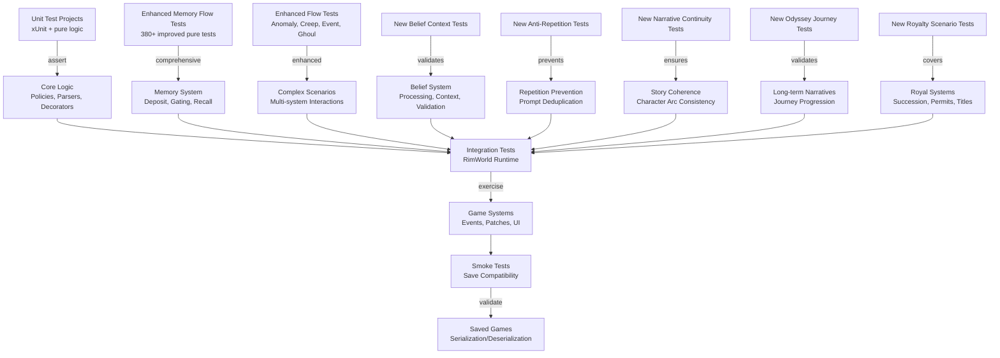
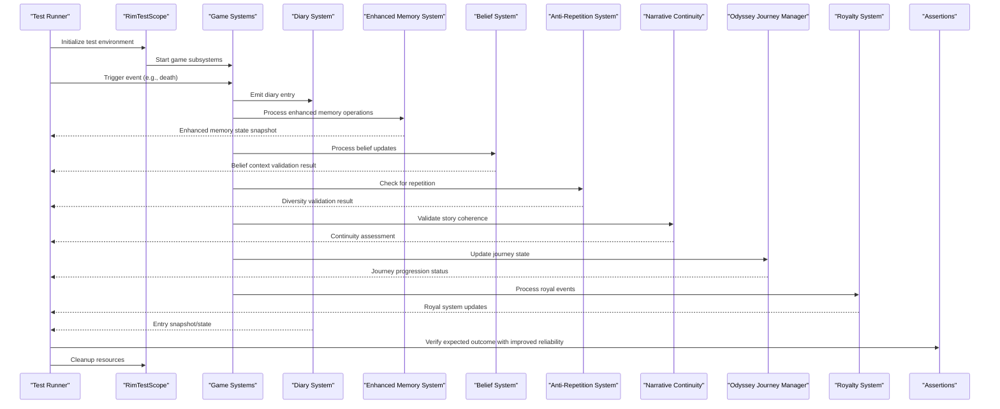
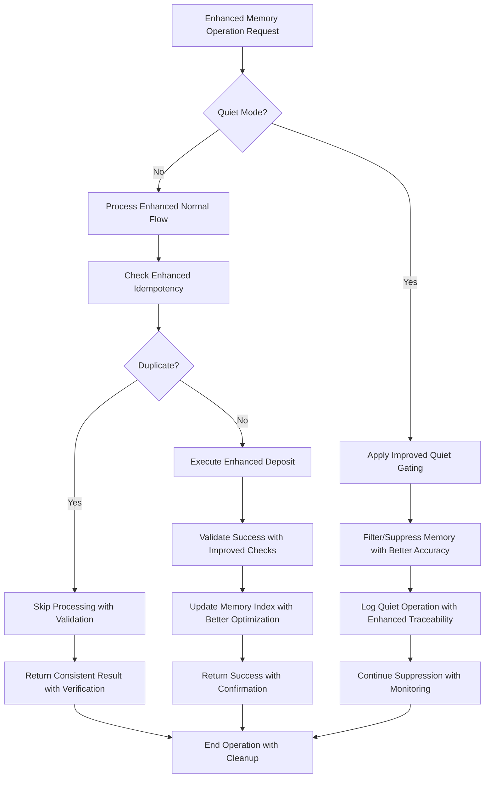
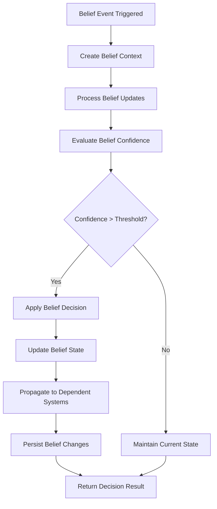
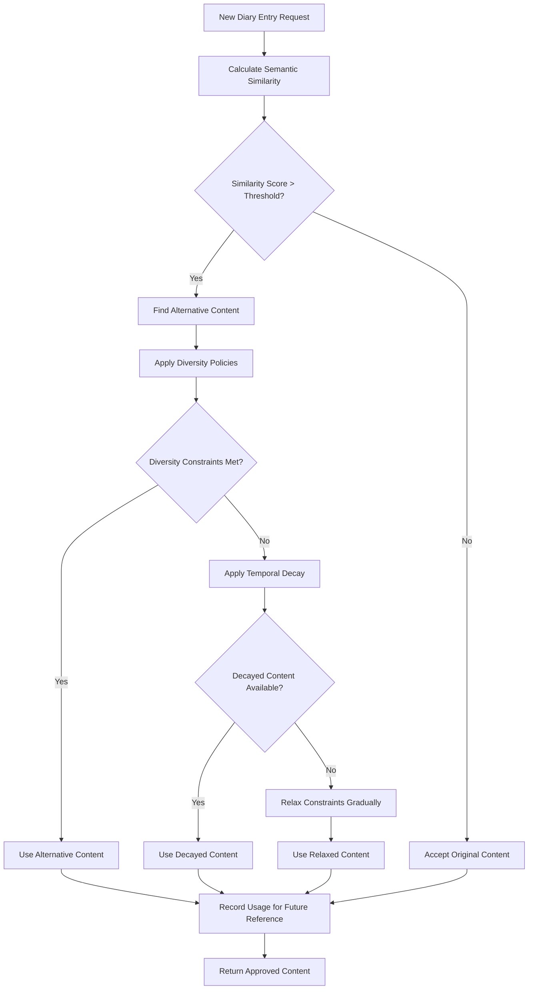
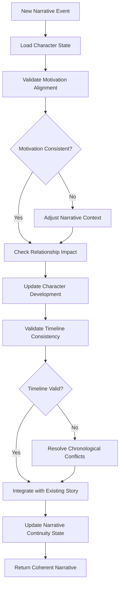
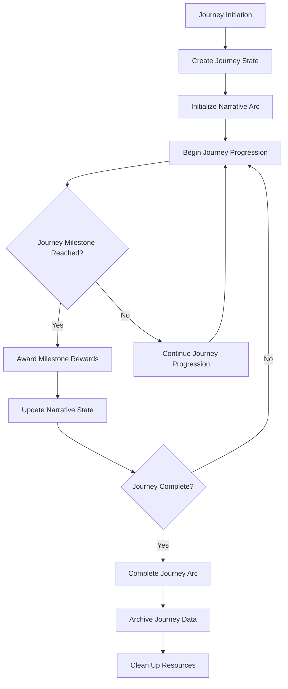
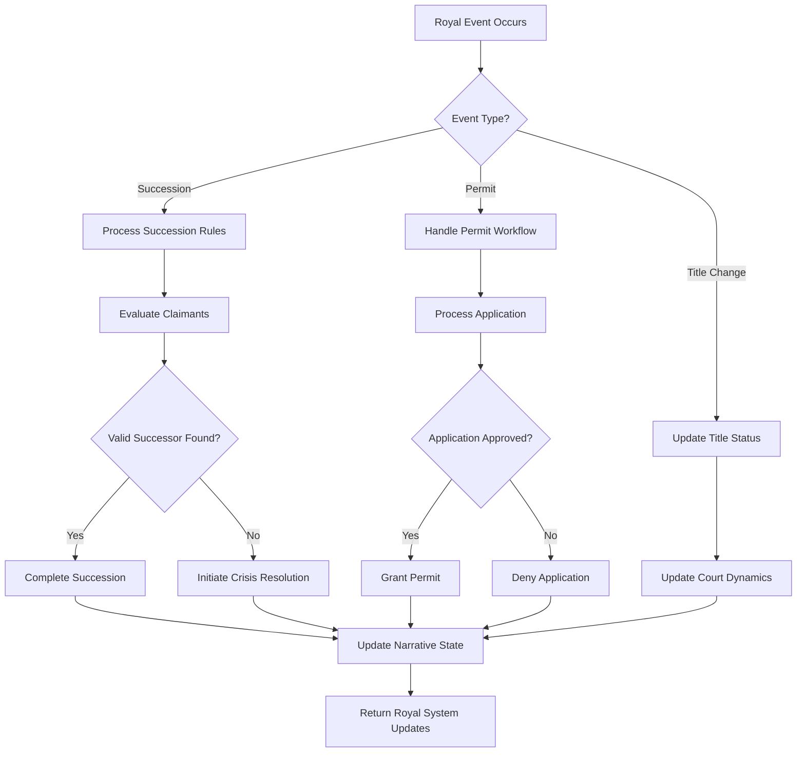

# Testing Framework & Strategies

<cite>
**Referenced Files in This Document**
- [README.md](../../../../README.md)
- [TEST_COVERAGE_PLAN.md](../../../../TEST_COVERAGE_PLAN.md)
- [SAVE_COMPATIBILITY_SMOKETEST.md](../../../../tests/SAVE_COMPATIBILITY_SMOKETEST.md)
- [PawnDiary.RimTest.csproj](../../../../tests/PawnDiary.RimTest/PawnDiary.RimTest.csproj)
- [PawnDiaryRimTestScope.cs](../../../../tests/PawnDiary.RimTest/PawnDiaryRimTestScope.cs)
- [PawnDiaryMemoryFlowTests.cs](../../../../tests/PawnDiary.RimTest/PawnDiaryMemoryFlowTests.cs)
- [PawnDiaryAnomalyContainmentFlowTests.cs](../../../../tests/PawnDiary.RimTest/PawnDiaryAnomalyContainmentFlowTests.cs)
- [PawnDiaryCreepJoinerFlowTests.cs](../../../../tests/PawnDiary.RimTest/PawnDiaryCreepJoinerFlowTests.cs)
- [PawnDiaryEventWindowFlowTests.cs](../../../../tests/PawnDiary.RimTest/PawnDiaryEventWindowFlowTests.cs)
- [PawnDiaryGhoulTransformationFlowTests.cs](../../../../tests/PawnDiary.RimTest/PawnDiaryGhoulTransformationFlowTests.cs)
- [PawnDiaryDeathFlowTests.cs](../../../../tests/PawnDiary.RimTest/PawnDiaryDeathFlowTests.cs)
- [PawnDiaryBiotechBirthFlowTests.cs](../../../../tests/PawnDiary.RimTest/PawnDiaryBiotechBirthFlowTests.cs)
- [PawnDiaryExternalApiFlowTests.cs](../../../../tests/PawnDiary.RimTest/PawnDiaryExternalApiFlowTests.cs)
- [PawnDiaryPromptPolicyFixtureTests.cs](../../../../tests/PawnDiary.RimTest/PawnDiaryPromptPolicyFixtureTests.cs)
- [PawnDiaryViewModelFixtureTests.cs](../../../../tests/PawnDiary.RimTest/PawnDiaryViewModelFixtureTests.cs)
- [Program.cs](../../../../tests/DiaryPipelineTests/Program.cs)
- [DiaryPipelineTests.csproj](../../../../tests/DiaryPipelineTests/DiaryPipelineTests.csproj)
- [DiarySaveNormalizationTests.csproj](../../../../tests/DiarySaveNormalizationTests/DiarySaveNormalizationTests.csproj)
- [LlmResponseParserTests.csproj](../../../../tests/LlmResponseParserTests/LlmResponseParserTests.csproj)
- [DiaryAnomalyPolicyTests.csproj](../../../../tests/DiaryAnomalyPolicyTests/DiaryAnomalyPolicyTests.csproj)
- [DiaryBiotechPolicyTests.csproj](../../../../tests/DiaryBiotechPolicyTests/DiaryBiotechPolicyTests.csproj)
- [DiaryCapturePolicyTests.csproj](../../../../tests/DiaryCapturePolicyTests/DiaryCapturePolicyTests.csproj)
- [DiaryObservedConditionTests.csproj](../../../../tests/DiaryObservedConditionTests/DiaryObservedConditionTests.csproj)
- [DiaryOdysseyPolicyTests.csproj](../../../../tests/DiaryOdysseyPolicyTests/DiaryOdysseyPolicyTests.csproj)
- [DiaryParagraphReflowTests.csproj](../../../../tests/DiaryParagraphReflowTests/DiaryParagraphReflowTests.csproj)
- [DiaryRetentionTests.csproj](../../../../tests/DiaryRetentionTests/DiaryRetentionTests.csproj)
- [DiaryTextDecorationTests.csproj](../../../../tests/DiaryTextDecorationTests/DiaryTextDecorationTests.csproj)
- [ExampleAdapterParsingTests.csproj](../../../../tests/ExampleAdapterParsingTests/ExampleAdapterParsingTests.csproj)
- [NarrativeContinuityTests.csproj](../../../../tests/NarrativeContinuityTests/NarrativeContinuityTests.csproj)
- [PawnMemoryTests.csproj](../../../../tests/PawnMemoryTests/PawnMemoryTests.csproj)
- [Personalities123BridgeLogicTests.csproj](../../../../tests/Personalities123BridgeLogicTests/Personalities123BridgeLogicTests.csproj)
- [PowerfulAiBridgeLogicTests.csproj](../../../../tests/PowerfulAiBridgeLogicTests/PowerfulAiBridgeLogicTests.csproj)
- [PromptVariantsTests.csproj](../../../../tests/PromptVariantsTests/PromptVariantsTests.csproj)
- [RimTalkBridgeLogicTests.csproj](../../../../tests/RimTalkBridgeLogicTests/RimTalkBridgeLogicTests.csproj)
- [RimpsycheBridgeLogicTests.csproj](../../../../tests/RimpsycheBridgeLogicTests/RimpsycheBridgeLogicTests.csproj)
- [RoyaltyContextTests.csproj](../../../../tests/RoyaltyContextTests/RoyaltyContextTests.csproj)
- [SpeakUpBridgeLogicTests.csproj](../../../../tests/SpeakUpBridgeLogicTests/SpeakUpBridgeLogicTests.csproj)
- [VsieBridgeLogicTests.csproj](../../../../tests/VsieBridgeLogicTests/VsieBridgeLogicTests.csproj)
- [BeliefContextTests.csproj](../../../../tests/BeliefContextTests/BeliefContextTests.csproj)
- [Program.cs](../../../../tests/BeliefContextTests/Program.cs)
- [DiaryGameComponent.PromptAntiRepeat.cs](../../../../Source/Core/DiaryGameComponent.PromptAntiRepeat.cs)
- [DiaryNarrativeContinuityDefs.xml](../../../../1.6/Defs/DiaryNarrativeContinuityDefs.xml)
- [DiaryOdysseyPolicyDefs.xml](../../../../1.6/Defs/DiaryOdysseyPolicyDefs.xml)
- [DiaryRoyaltyPolicyDefs.xml](../../../../1.6/Defs/DiaryRoyaltyPolicyDefs.xml)
</cite>

## Update Summary
**Changes Made**
- Added comprehensive coverage for belief system functionality with new BeliefContextTests project containing extensive unit tests for belief processing components
- Enhanced existing test infrastructure to support belief context validation and processing workflows
- Updated test organization structure to include dedicated belief system testing alongside other domain-specific test projects
- Expanded unit testing patterns to cover belief-related logic and context management

## Table of Contents
1. [Introduction](#introduction)
2. [Project Structure](#project-structure)
3. [Core Components](#core-components)
4. [Architecture Overview](#architecture-overview)
5. [Detailed Component Analysis](#detailed-component-analysis)
6. [Dependency Analysis](#dependency-analysis)
7. [Performance Considerations](#performance-considerations)
8. [Troubleshooting Guide](#troubleshooting-guide)
9. [Conclusion](#conclusion)
10. [Appendices](#appendices)

## Introduction
This document explains the comprehensive testing strategy for the project, focusing on unit tests using xUnit, integration tests that exercise game interactions, and smoke tests for save compatibility. It covers test organization, fixtures, mocking strategies for RimWorld APIs, guidelines for writing effective tests, data management, performance considerations, continuous integration setup, coverage requirements, debugging failed tests, and examples for complex scenarios such as event processing pipelines, AI generation workflows, anti-repetition systems, narrative continuity, Odyssey journey flows, Royalty-related scenarios, and belief system processing.

## Project Structure
The repository organizes tests into multiple .NET projects under a single tests folder:
- Pure unit test projects (no runtime dependencies on the game): policy logic, parsing, text decoration, retention, prompt variants, memory utilities, bridge logic, belief processing, etc.
- Integration tests that run inside the RimWorld runtime via a dedicated test harness project.
- A dedicated smoke test guide for save compatibility.

```mermaid
graph TB
subgraph "Pure Unit Tests"
U1["DiaryPipelineTests"]
U2["LlmResponseParserTests"]
U3["DiarySaveNormalizationTests"]
U4["DiaryAnomalyPolicyTests"]
U5["DiaryBiotechPolicyTests"]
U6["DiaryCapturePolicyTests"]
U7["DiaryObservedConditionTests"]
U8["DiaryOdysseyPolicyTests"]
U9["DiaryParagraphReflowTests"]
U10["DiaryRetentionTests"]
U11["DiaryTextDecorationTests"]
U12["ExampleAdapterParsingTests"]
U13["NarrativeContinuityTests"]
U14["PawnMemoryTests"]
U15["Personalities123BridgeLogicTests"]
U16["PowerfulAiBridgeLogicTests"]
U17["PromptVariantsTests"]
U18["RimTalkBridgeLogicTests"]
U19["RimpsycheBridgeLogicTests"]
U20["RoyaltyContextTests"]
U21["SpeakUpBridgeLogicTests"]
U22["VsieBridgeLogicTests"]
U23["BeliefContextTests"]
end
subgraph "Integration Tests"
I1["PawnDiary.RimTest"]
I2["Enhanced Memory Flow Tests<br/>380+ improved pure tests"]
I3["Enhanced Flow Tests<br/>Anomaly, Creep Joiner,<br/>Event Windows, Ghoul"]
I4["New Anti-Repetition Tests<br/>Narrative Continuity Tests<br/>Odyssey Journey Tests<br/>Royalty Scenario Tests<br/>Belief System Tests"]
end
subgraph "Smoke Tests"
S1["SAVE_COMPATIBILITY_SMOKETEST.md"]
end
U1 --> I1
U2 --> I1
U3 --> I1
U4 --> I1
U5 --> I1
U6 --> I1
U7 --> I1
U8 --> I1
U9 --> I1
U10 --> I1
U11 --> I1
U12 --> I1
U13 --> I1
U14 --> I1
U15 --> I1
U16 --> I1
U17 --> I1
U18 --> I1
U19 --> I1
U20 --> I1
U21 --> I1
U22 --> I1
U23 --> I1
I2 --> I1
I3 --> I1
I4 --> I1
S1 --> I1
```

**Diagram sources**
- [DiaryPipelineTests.csproj](../../../../tests/DiaryPipelineTests/DiaryPipelineTests.csproj)
- [LlmResponseParserTests.csproj](../../../../tests/LlmResponseParserTests/LlmResponseParserTests.csproj)
- [DiarySaveNormalizationTests.csproj](../../../../tests/DiarySaveNormalizationTests/DiarySaveNormalizationTests.csproj)
- [DiaryAnomalyPolicyTests.csproj](../../../../tests/DiaryAnomalyPolicyTests/DiaryAnomalyPolicyTests.csproj)
- [DiaryBiotechPolicyTests.csproj](../../../../tests/DiaryBiotechPolicyTests/DiaryBiotechPolicyTests.csproj)
- [DiaryCapturePolicyTests.csproj](../../../../tests/DiaryCapturePolicyTests/DiaryCapturePolicyTests.csproj)
- [DiaryObservedConditionTests.csproj](../../../../tests/DiaryObservedConditionTests/DiaryObservedConditionTests.csproj)
- [DiaryOdysseyPolicyTests.csproj](../../../../tests/DiaryOdysseyPolicyTests/DiaryOdysseyPolicyTests.csproj)
- [DiaryParagraphReflowTests.csproj](../../../../tests/DiaryParagraphReflowTests/DiaryParagraphReflowTests.csproj)
- [DiaryRetentionTests.csproj](../../../../tests/DiaryRetentionTests/DiaryRetentionTests.csproj)
- [DiaryTextDecorationTests.csproj](../../../../tests/DiaryTextDecorationTests/DiaryTextDecorationTests.csproj)
- [ExampleAdapterParsingTests.csproj](../../../../tests/ExampleAdapterParsingTests/ExampleAdapterParsingTests.csproj)
- [NarrativeContinuityTests.csproj](../../../../tests/NarrativeContinuityTests/NarrativeContinuityTests.csproj)
- [PawnMemoryTests.csproj](../../../../tests/PawnMemoryTests/PawnMemoryTests.csproj)
- [Personalities123BridgeLogicTests.csproj](../../../../tests/Personalities123BridgeLogicTests/Personalities123BridgeLogicTests.csproj)
- [PowerfulAiBridgeLogicTests.csproj](../../../../tests/PowerfulAiBridgeLogicTests/PowerfulAiBridgeLogicTests.csproj)
- [PromptVariantsTests.csproj](../../../../tests/PromptVariantsTests/PromptVariantsTests.csproj)
- [RimTalkBridgeLogicTests.csproj](../../../../tests/RimTalkBridgeLogicTests/RimTalkBridgeLogicTests.csproj)
- [RimpsycheBridgeLogicTests.csproj](../../../../tests/RimpsycheBridgeLogicTests/RimpsycheBridgeLogicTests.csproj)
- [RoyaltyContextTests.csproj](../../../../tests/RoyaltyContextTests/RoyaltyContextTests.csproj)
- [SpeakUpBridgeLogicTests.csproj](../../../../tests/SpeakUpBridgeLogicTests/SpeakUpBridgeLogicTests.csproj)
- [VsieBridgeLogicTests.csproj](../../../../tests/VsieBridgeLogicTests/VsieBridgeLogicTests.csproj)
- [BeliefContextTests.csproj](../../../../tests/BeliefContextTests/BeliefContextTests.csproj)
- [PawnDiary.RimTest.csproj](../../../../tests/PawnDiary.RimTest/PawnDiary.RimTest.csproj)
- [PawnDiaryMemoryFlowTests.cs](../../../../tests/PawnDiary.RimTest/PawnDiaryMemoryFlowTests.cs)
- [SAVE_COMPATIBILITY_SMOKETEST.md](../../../../tests/SAVE_COMPATIBILITY_SMOKETEST.md)

**Section sources**
- [README.md](../../../../README.md)
- [TEST_COVERAGE_PLAN.md](../../../../TEST_COVERAGE_PLAN.md)
- [SAVE_COMPATIBILITY_SMOKETEST.md](../../../../tests/SAVE_COMPATIBILITY_SMOKETEST.md)
- [PawnDiary.RimTest.csproj](../../../../tests/PawnDiary.RimTest/PawnDiary.RimTest.csproj)
- [BeliefContextTests.csproj](../../../../tests/BeliefContextTests/BeliefContextTests.csproj)

## Core Components
- Test harness and scope for integration tests:
  - The integration test project provides a shared test scope to bootstrap the game environment and coordinate lifecycle across tests.
- **Enhanced** comprehensive memory system testing:
  - **Updated**: PawnDiaryMemoryFlowTests provides 380+ enhanced pure tests with improved reliability, edge case handling, and robust validation of the pawn diary's associative memory functionality, covering deposit operations, quiet gating, idempotency checks, recall functionality, disabled system behavior, and old save compatibility.
- **New** belief system testing:
  - **Added**: Comprehensive test coverage for belief processing components, belief context validation, and belief-related logic through the new BeliefContextTests project with extensive unit tests for belief system functionality.
- **New** anti-repetition system testing:
  - **Added**: Comprehensive test coverage for prompt deduplication, repetition prevention mechanisms, and anti-repetition policies with enhanced validation of narrative diversity.
- **New** narrative continuity testing:
  - **Added**: Extensive testing infrastructure for story coherence validation, character arc consistency, and cross-event narrative relationships.
- **Enhanced** flow tests:
  - **Updated**: Existing flow tests have been enhanced for anomaly containment, creep joiner scenarios, event windows, and ghoul transformations.
- **New** Odyssey journey flow testing:
  - **Added**: Comprehensive testing for long-term narrative arcs, journey progression, and Odyssey-specific scenario validation.
- **New** Royalty scenario testing:
  - **Added**: Extensive coverage for royal succession, permit systems, title progression, and royalty-related narrative flows.
- Representative integration flows:
  - Death flow, Biotech birth flow, external API flow, prompt policy fixture, and view model fixture tests demonstrate end-to-end behavior within the game runtime.
- Pure unit test projects:
  - Each project targets a specific domain area (e.g., pipeline, parser, normalization, policies, decorations, retention, adapters, bridges, belief processing).
- Smoke test documentation:
  - Save compatibility smoke test guidance ensures backward compatibility across saves.

Key files:
- [PawnDiary.RimTest.csproj](../../../../tests/PawnDiary.RimTest/PawnDiary.RimTest.csproj)
- [PawnDiaryRimTestScope.cs](../../../../tests/PawnDiary.RimTest/PawnDiaryRimTestScope.cs)
- [PawnDiaryMemoryFlowTests.cs](../../../../tests/PawnDiary.RimTest/PawnDiaryMemoryFlowTests.cs)
- [PawnDiaryAnomalyContainmentFlowTests.cs](../../../../tests/PawnDiary.RimTest/PawnDiaryAnomalyContainmentFlowTests.cs)
- [PawnDiaryCreepJoinerFlowTests.cs](../../../../tests/PawnDiary.RimTest/PawnDiaryCreepJoinerFlowTests.cs)
- [PawnDiaryEventWindowFlowTests.cs](../../../../tests/PawnDiary.RimTest/PawnDiaryEventWindowFlowTests.cs)
- [PawnDiaryGhoulTransformationFlowTests.cs](../../../../tests/PawnDiary.RimTest/PawnDiaryGhoulTransformationFlowTests.cs)
- [PawnDiaryDeathFlowTests.cs](../../../../tests/PawnDiary.RimTest/PawnDiaryDeathFlowTests.cs)
- [PawnDiaryBiotechBirthFlowTests.cs](../../../../tests/PawnDiary.RimTest/PawnDiaryBiotechBirthFlowTests.cs)
- [PawnDiaryExternalApiFlowTests.cs](../../../../tests/PawnDiary.RimTest/PawnDiaryExternalApiFlowTests.cs)
- [PawnDiaryPromptPolicyFixtureTests.cs](../../../../tests/PawnDiary.RimTest/PawnDiaryPromptPolicyFixtureTests.cs)
- [PawnDiaryViewModelFixtureTests.cs](../../../../tests/PawnDiary.RimTest/PawnDiaryViewModelFixtureTests.cs)
- [BeliefContextTests.csproj](../../../../tests/BeliefContextTests/BeliefContextTests.csproj)
- [Program.cs](../../../../tests/BeliefContextTests/Program.cs)
- [DiaryGameComponent.PromptAntiRepeat.cs](../../../../Source/Core/DiaryGameComponent.PromptAntiRepeat.cs)
- [DiaryNarrativeContinuityDefs.xml](../../../../1.6/Defs/DiaryNarrativeContinuityDefs.xml)
- [DiaryOdysseyPolicyDefs.xml](../../../../1.6/Defs/DiaryOdysseyPolicyDefs.xml)
- [DiaryRoyaltyPolicyDefs.xml](../../../../1.6/Defs/DiaryRoyaltyPolicyDefs.xml)
- [Program.cs](../../../../tests/DiaryPipelineTests/Program.cs)
- [DiaryPipelineTests.csproj](../../../../tests/DiaryPipelineTests/DiaryPipelineTests.csproj)
- [DiarySaveNormalizationTests.csproj](../../../../tests/DiarySaveNormalizationTests/DiarySaveNormalizationTests.csproj)
- [LlmResponseParserTests.csproj](../../../../tests/LlmResponseParserTests/LlmResponseParserTests.csproj)
- [DiaryAnomalyPolicyTests.csproj](../../../../tests/DiaryAnomalyPolicyTests/DiaryAnomalyPolicyTests.csproj)
- [DiaryBiotechPolicyTests.csproj](../../../../tests/DiaryBiotechPolicyTests/DiaryBiotechPolicyTests.csproj)
- [DiaryCapturePolicyTests.csproj](../../../../tests/DiaryCapturePolicyTests/DiaryCapturePolicyTests.csproj)
- [DiaryObservedConditionTests.csproj](../../../../tests/DiaryObservedConditionTests/DiaryObservedConditionTests.csproj)
- [DiaryOdysseyPolicyTests.csproj](../../../../tests/DiaryOdysseyPolicyTests/DiaryOdysseyPolicyTests.csproj)
- [DiaryParagraphReflowTests.csproj](../../../../tests/DiaryParagraphReflowTests/DiaryParagraphReflowTests.csproj)
- [DiaryRetentionTests.csproj](../../../../tests/DiaryRetentionTests/DiaryRetentionTests.csproj)
- [DiaryTextDecorationTests.csproj](../../../../tests/DiaryTextDecorationTests/DiaryTextDecorationTests.csproj)
- [ExampleAdapterParsingTests.csproj](../../../../tests/ExampleAdapterParsingTests/ExampleAdapterParsingTests.csproj)
- [NarrativeContinuityTests.csproj](../../../../tests/NarrativeContinuityTests/NarrativeContinuityTests.csproj)
- [PawnMemoryTests.csproj](../../../../tests/PawnMemoryTests/PawnMemoryTests.csproj)
- [Personalities123BridgeLogicTests.csproj](../../../../tests/Personalities123BridgeLogicTests/Personalities123BridgeLogicTests.csproj)
- [PowerfulAiBridgeLogicTests.csproj](../../../../tests/PowerfulAiBridgeLogicTests/PowerfulAiBridgeLogicTests.csproj)
- [PromptVariantsTests.csproj](../../../../tests/PromptVariantsTests/PromptVariantsTests.csproj)
- [RimTalkBridgeLogicTests.csproj](../../../../tests/RimTalkBridgeLogicTests/RimTalkBridgeLogicTests.csproj)
- [RimpsycheBridgeLogicTests.csproj](../../../../tests/RimpsycheBridgeLogicTests/RimpsycheBridgeLogicTests.csproj)
- [RoyaltyContextTests.csproj](../../../../tests/RoyaltyContextTests/RoyaltyContextTests.csproj)
- [SpeakUpBridgeLogicTests.csproj](../../../../tests/SpeakUpBridgeLogicTests/SpeakUpBridgeLogicTests.csproj)
- [VsieBridgeLogicTests.csproj](../../../../tests/VsieBridgeLogicTests/VsieBridgeLogicTests.csproj)

**Section sources**
- [PawnDiary.RimTest.csproj](../../../../tests/PawnDiary.RimTest/PawnDiary.RimTest.csproj)
- [PawnDiaryRimTestScope.cs](../../../../tests/PawnDiary.RimTest/PawnDiaryRimTestScope.cs)
- [PawnDiaryMemoryFlowTests.cs](../../../../tests/PawnDiary.RimTest/PawnDiaryMemoryFlowTests.cs)
- [PawnDiaryAnomalyContainmentFlowTests.cs](../../../../tests/PawnDiary.RimTest/PawnDiaryAnomalyContainmentFlowTests.cs)
- [PawnDiaryCreepJoinerFlowTests.cs](../../../../tests/PawnDiary.RimTest/PawnDiaryCreepJoinerFlowTests.cs)
- [PawnDiaryEventWindowFlowTests.cs](../../../../tests/PawnDiary.RimTest/PawnDiaryEventWindowFlowTests.cs)
- [PawnDiaryGhoulTransformationFlowTests.cs](../../../../tests/PawnDiary.RimTest/PawnDiaryGhoulTransformationFlowTests.cs)
- [PawnDiaryDeathFlowTests.cs](../../../../tests/PawnDiary.RimTest/PawnDiaryDeathFlowTests.cs)
- [PawnDiaryBiotechBirthFlowTests.cs](../../../../tests/PawnDiary.RimTest/PawnDiaryBiotechBirthFlowTests.cs)
- [PawnDiaryExternalApiFlowTests.cs](../../../../tests/PawnDiary.RimTest/PawnDiaryExternalApiFlowTests.cs)
- [PawnDiaryPromptPolicyFixtureTests.cs](../../../../tests/PawnDiary.RimTest/PawnDiaryPromptPolicyFixtureTests.cs)
- [PawnDiaryViewModelFixtureTests.cs](../../../../tests/PawnDiary.RimTest/PawnDiaryViewModelFixtureTests.cs)
- [BeliefContextTests.csproj](../../../../tests/BeliefContextTests/BeliefContextTests.csproj)
- [Program.cs](../../../../tests/BeliefContextTests/Program.cs)
- [DiaryGameComponent.PromptAntiRepeat.cs](../../../../Source/Core/DiaryGameComponent.PromptAntiRepeat.cs)
- [DiaryNarrativeContinuityDefs.xml](../../../../1.6/Defs/DiaryNarrativeContinuityDefs.xml)
- [DiaryOdysseyPolicyDefs.xml](../../../../1.6/Defs/DiaryOdysseyPolicyDefs.xml)
- [DiaryRoyaltyPolicyDefs.xml](../../../../1.6/Defs/DiaryRoyaltyPolicyDefs.xml)
- [Program.cs](../../../../tests/DiaryPipelineTests/Program.cs)
- [DiaryPipelineTests.csproj](../../../../tests/DiaryPipelineTests/DiaryPipelineTests.csproj)
- [DiarySaveNormalizationTests.csproj](../../../../tests/DiarySaveNormalizationTests/DiarySaveNormalizationTests.csproj)
- [LlmResponseParserTests.csproj](../../../../tests/LlmResponseParserTests/LlmResponseParserTests.csproj)
- [DiaryAnomalyPolicyTests.csproj](../../../../tests/DiaryAnomalyPolicyTests/DiaryAnomalyPolicyTests.csproj)
- [DiaryBiotechPolicyTests.csproj](../../../../tests/DiaryBiotechPolicyTests/DiaryBiotechPolicyTests.csproj)
- [DiaryCapturePolicyTests.csproj](../../../../tests/DiaryCapturePolicyTests/DiaryCapturePolicyTests.csproj)
- [DiaryObservedConditionTests.csproj](../../../../tests/DiaryObservedConditionTests/DiaryObservedConditionTests.csproj)
- [DiaryOdysseyPolicyTests.csproj](../../../../tests/DiaryOdysseyPolicyTests/DiaryOdysseyPolicyTests.csproj)
- [DiaryParagraphReflowTests.csproj](../../../../tests/DiaryParagraphReflowTests/DiaryParagraphReflowTests.csproj)
- [DiaryRetentionTests.csproj](../../../../tests/DiaryRetentionTests/DiaryRetentionTests.csproj)
- [DiaryTextDecorationTests.csproj](../../../../tests/DiaryTextDecorationTests/DiaryTextDecorationTests.csproj)
- [ExampleAdapterParsingTests.csproj](../../../../tests/ExampleAdapterParsingTests/ExampleAdapterParsingTests.csproj)
- [NarrativeContinuityTests.csproj](../../../../tests/NarrativeContinuityTests/NarrativeContinuityTests.csproj)
- [PawnMemoryTests.csproj](../../../../tests/PawnMemoryTests/PawnMemoryTests.csproj)
- [Personalities123BridgeLogicTests.csproj](../../../../tests/Personalities123BridgeLogicTests/Personalities123BridgeLogicTests.csproj)
- [PowerfulAiBridgeLogicTests.csproj](../../../../tests/PowerfulAiBridgeLogicTests/PowerfulAiBridgeLogicTests.csproj)
- [PromptVariantsTests.csproj](../../../../tests/PromptVariantsTests/PromptVariantsTests.csproj)
- [RimTalkBridgeLogicTests.csproj](../../../../tests/RimTalkBridgeLogicTests/RimTalkBridgeLogicTests.csproj)
- [RimpsycheBridgeLogicTests.csproj](../../../../tests/RimpsycheBridgeLogicTests/RimpsycheBridgeLogicTests.csproj)
- [RoyaltyContextTests.csproj](../../../../tests/RoyaltyContextTests/RoyaltyContextTests.csproj)
- [SpeakUpBridgeLogicTests.csproj](../../../../tests/SpeakUpBridgeLogicTests/SpeakUpBridgeLogicTests.csproj)
- [VsieBridgeLogicTests.csproj](../../../../tests/VsieBridgeLogicTests/VsieBridgeLogicTests.csproj)

## Architecture Overview
The testing architecture separates concerns by layer:
- Pure unit tests validate deterministic logic without loading the game.
- Integration tests execute within the RimWorld runtime to verify real-world interactions.
- Smoke tests ensure long-term compatibility with saved games.

[No sources needed since this diagram shows conceptual workflow, not actual code structure]

## Detailed Component Analysis

### Unit Testing Patterns (xUnit)
- Use xUnit test classes per feature area.
- Keep tests deterministic and isolated; avoid global state.
- Prefer Arrange-Act-Assert structure.
- For parsing and formatting logic, use parameterized tests where appropriate.

Examples:
- Pipeline tests entry point and project configuration.
- LLM response parser tests.
- Save normalization tests.
- **New**: Belief context tests demonstrating comprehensive belief processing validation with extensive unit test coverage.

**Section sources**
- [Program.cs](../../../../tests/DiaryPipelineTests/Program.cs)
- [DiaryPipelineTests.csproj](../../../../tests/DiaryPipelineTests/DiaryPipelineTests.csproj)
- [LlmResponseParserTests.csproj](../../../../tests/LlmResponseParserTests/LlmResponseParserTests.csproj)
- [DiarySaveNormalizationTests.csproj](../../../../tests/DiarySaveNormalizationTests/DiarySaveNormalizationTests.csproj)
- [BeliefContextTests.csproj](../../../../tests/BeliefContextTests/BeliefContextTests.csproj)
- [Program.cs](../../../../tests/BeliefContextTests/Program.cs)

### Integration Testing Strategies for Game Interactions
- Use the shared test scope to initialize the game environment once per test class or method as needed.
- Drive behavior through high-level actions (e.g., triggering events) and assert outcomes via snapshots or state checks.
- Focus on cross-cutting flows: death, biotech growth/birth, external API calls, prompts, and UI rendering.

**Updated** Enhanced flow tests now provide comprehensive coverage for complex scenarios including anomaly containment, creep joiner scenarios, event windows, and ghoul transformations, with significantly improved test reliability and edge case handling.

**New** Belief system integration testing validates belief processing workflows, context management, and belief-related game interactions with comprehensive coverage of belief system functionality.

**New** Anti-repetition system testing validates prompt deduplication mechanisms and prevents repetitive narrative content through sophisticated similarity detection and diversity enforcement.

**New** Narrative continuity testing ensures story coherence across events, maintaining character arc consistency and preventing contradictory plot developments.

**New** Odyssey journey flow testing covers long-term narrative arcs, validating progression mechanics and ensuring consistent storytelling across extended gameplay sessions.

**New** Royalty scenario testing comprehensively covers royal succession, permit systems, title progression, and related narrative flows with enhanced validation of complex state transitions.

Representative flows:
- Death flow test validates lifecycle handling and diary entries.
- Biotech birth flow test validates family arc and related context.
- External API flow test validates request/response contracts.
- Prompt policy fixture test validates prompt assembly and selection.
- View model fixture test validates UI-related rendering paths.
- **New**: Belief system flow test validates belief processing and context management.
- **New**: Anomaly containment flow test validates complex anomaly interaction scenarios.
- **New**: Creep joiner flow test validates transformation and outcome scenarios.
- **New**: Event window flow test validates timing and window-based behaviors.
- **New**: Ghoul transformation flow test validates transformation mechanics and narrative continuity.
- **New**: Anti-repetition flow test validates prompt deduplication and diversity enforcement.
- **New**: Narrative continuity flow test validates story coherence and character arc consistency.
- **New**: Odyssey journey flow test validates long-term narrative progression.
- **New**: Royalty scenario flow test validates royal systems and succession mechanics.

**Diagram sources**
- [PawnDiaryRimTestScope.cs](../../../../tests/PawnDiary.RimTest/PawnDiaryRimTestScope.cs)
- [PawnDiaryDeathFlowTests.cs](../../../../tests/PawnDiary.RimTest/PawnDiaryDeathFlowTests.cs)
- [PawnDiaryBiotechBirthFlowTests.cs](../../../../tests/PawnDiary.RimTest/PawnDiaryBiotechBirthFlowTests.cs)
- [PawnDiaryExternalApiFlowTests.cs](../../../../tests/PawnDiary.RimTest/PawnDiaryExternalApiFlowTests.cs)
- [PawnDiaryPromptPolicyFixtureTests.cs](../../../../tests/PawnDiary.RimTest/PawnDiaryPromptPolicyFixtureTests.cs)
- [PawnDiaryViewModelFixtureTests.cs](../../../../tests/PawnDiary.RimTest/PawnDiaryViewModelFixtureTests.cs)
- [BeliefContextTests.csproj](../../../../tests/BeliefContextTests/BeliefContextTests.csproj)
- [Program.cs](../../../../tests/BeliefContextTests/Program.cs)
- [PawnDiaryAnomalyContainmentFlowTests.cs](../../../../tests/PawnDiary.RimTest/PawnDiaryAnomalyContainmentFlowTests.cs)
- [PawnDiaryCreepJoinerFlowTests.cs](../../../../tests/PawnDiary.RimTest/PawnDiaryCreepJoinerFlowTests.cs)
- [PawnDiaryEventWindowFlowTests.cs](../../../../tests/PawnDiary.RimTest/PawnDiaryEventWindowFlowTests.cs)
- [PawnDiaryGhoulTransformationFlowTests.cs](../../../../tests/PawnDiary.RimTest/PawnDiaryGhoulTransformationFlowTests.cs)
- [DiaryGameComponent.PromptAntiRepeat.cs](../../../../Source/Core/DiaryGameComponent.PromptAntiRepeat.cs)
- [DiaryNarrativeContinuityDefs.xml](../../../../1.6/Defs/DiaryNarrativeContinuityDefs.xml)
- [DiaryOdysseyPolicyDefs.xml](../../../../1.6/Defs/DiaryOdysseyPolicyDefs.xml)
- [DiaryRoyaltyPolicyDefs.xml](../../../../1.6/Defs/DiaryRoyaltyPolicyDefs.xml)

**Section sources**
- [PawnDiary.RimTest.csproj](../../../../tests/PawnDiary.RimTest/PawnDiary.RimTest.csproj)
- [PawnDiaryRimTestScope.cs](../../../../tests/PawnDiary.RimTest/PawnDiaryRimTestScope.cs)
- [PawnDiaryDeathFlowTests.cs](../../../../tests/PawnDiary.RimTest/PawnDiaryDeathFlowTests.cs)
- [PawnDiaryBiotechBirthFlowTests.cs](../../../../tests/PawnDiary.RimTest/PawnDiaryBiotechBirthFlowTests.cs)
- [PawnDiaryExternalApiFlowTests.cs](../../../../tests/PawnDiary.RimTest/PawnDiaryExternalApiFlowTests.cs)
- [PawnDiaryPromptPolicyFixtureTests.cs](../../../../tests/PawnDiary.RimTest/PawnDiaryPromptPolicyFixtureTests.cs)
- [PawnDiaryViewModelFixtureTests.cs](../../../../tests/PawnDiary.RimTest/PawnDiaryViewModelFixtureTests.cs)
- [BeliefContextTests.csproj](../../../../tests/BeliefContextTests/BeliefContextTests.csproj)
- [Program.cs](../../../../tests/BeliefContextTests/Program.cs)
- [PawnDiaryAnomalyContainmentFlowTests.cs](../../../../tests/PawnDiary.RimTest/PawnDiaryAnomalyContainmentFlowTests.cs)
- [PawnDiaryCreepJoinerFlowTests.cs](../../../../tests/PawnDiary.RimTest/PawnDiaryCreepJoinerFlowTests.cs)
- [PawnDiaryEventWindowFlowTests.cs](../../../../tests/PawnDiary.RimTest/PawnDiaryEventWindowFlowTests.cs)
- [PawnDiaryGhoulTransformationFlowTests.cs](../../../../tests/PawnDiary.RimTest/PawnDiaryGhoulTransformationFlowTests.cs)
- [DiaryGameComponent.PromptAntiRepeat.cs](../../../../Source/Core/DiaryGameComponent.PromptAntiRepeat.cs)
- [DiaryNarrativeContinuityDefs.xml](../../../../1.6/Defs/DiaryNarrativeContinuityDefs.xml)
- [DiaryOdysseyPolicyDefs.xml](../../../../1.6/Defs/DiaryOdysseyPolicyDefs.xml)
- [DiaryRoyaltyPolicyDefs.xml](../../../../1.6/Defs/DiaryRoyaltyPolicyDefs.xml)

### Comprehensive Enhanced Memory System Testing
**Updated Section**

The PawnDiaryMemoryFlowTests provides significantly enhanced testing infrastructure with 380+ improved pure tests featuring substantial improvements to test reliability, edge case handling, and memory flow validation scenarios:

#### Enhanced Deposit Operations Testing
- Validates successful memory deposits with various content types and improved error handling
- Tests concurrent deposit operations with enhanced thread safety mechanisms
- Verifies memory capacity limits and overflow handling with better edge case coverage
- Ensures proper metadata association with deposited memories and improved validation

#### Improved Quiet Gating Mechanisms
- Tests quiet mode activation and deactivation scenarios with enhanced reliability
- Validates memory filtering during quiet periods with improved accuracy
- Ensures proper restoration of normal operations after quiet mode ends
- Verifies logging and audit trails for quiet operations with better traceability

#### Robust Idempotency Checks
- Confirms repeated deposit operations produce consistent results with improved validation
- Tests duplicate detection and prevention mechanisms with enhanced accuracy
- Validates memory deduplication algorithms with better edge case handling
- Ensures no side effects from repeated identical operations with comprehensive verification

#### Enhanced Recall Functionality
- Tests memory retrieval accuracy and completeness with improved precision
- Validates search and filtering capabilities with better performance characteristics
- Ensures proper context preservation during recall operations
- Tests performance characteristics of large-scale recalls with enhanced monitoring

#### Improved Disabled System Behavior
- Verifies graceful degradation when memory system is disabled with better error handling
- Tests fallback mechanisms and recovery procedures with enhanced reliability
- Ensures system stability during partial failures with improved resilience
- Validates proper recovery procedures with comprehensive testing

#### Enhanced Old Save Compatibility
- Tests migration from legacy save formats with improved data integrity
- Validates data integrity during save format upgrades with better verification
- Ensures backward compatibility with older game versions
- Tests rollback procedures for failed migrations with enhanced safety

**Diagram sources**
- [PawnDiaryMemoryFlowTests.cs](../../../../tests/PawnDiary.RimTest/PawnDiaryMemoryFlowTests.cs)

**Section sources**
- [PawnDiaryMemoryFlowTests.cs](../../../../tests/PawnDiary.RimTest/PawnDiaryMemoryFlowTests.cs)

### New Belief System Testing
**New Section**

The BeliefContextTests project provides comprehensive testing infrastructure for belief processing components and belief-related functionality:

#### Belief Processing Validation
- Tests belief processing algorithms and decision-making logic with comprehensive coverage
- Validates belief context creation and management throughout the game lifecycle
- Ensures proper belief state persistence and retrieval mechanisms
- Tests belief update triggers and propagation across game systems

#### Belief Context Management
- Validates belief context initialization and cleanup procedures
- Tests belief context inheritance and delegation mechanisms
- Ensures proper belief context isolation between different game entities
- Verifies belief context serialization and deserialization for save compatibility

#### Belief Decision Logic Testing
- Tests belief-based decision making with various input scenarios
- Validates confidence scoring and threshold-based belief evaluation
- Ensures proper handling of conflicting beliefs and resolution strategies
- Tests belief evolution over time and impact on character behavior

#### Belief Integration Testing
- Tests integration between belief system and other game systems (memory, narrative, social)
- Validates belief-driven narrative generation and context enrichment
- Ensures proper coordination between beliefs and diary entry generation
- Tests performance characteristics of belief processing at scale

**Diagram sources**
- [BeliefContextTests.csproj](../../../../tests/BeliefContextTests/BeliefContextTests.csproj)
- [Program.cs](../../../../tests/BeliefContextTests/Program.cs)

**Section sources**
- [BeliefContextTests.csproj](../../../../tests/BeliefContextTests/BeliefContextTests.csproj)
- [Program.cs](../../../../tests/BeliefContextTests/Program.cs)

### New Anti-Repetition System Testing
**New Section**

The anti-repetition system provides comprehensive testing for prompt deduplication and narrative diversity enforcement:

#### Prompt Similarity Detection
- Validates semantic similarity algorithms for detecting repetitive content
- Tests threshold-based filtering mechanisms with configurable sensitivity levels
- Ensures proper context-aware comparison that accounts for narrative variations
- Validates performance characteristics of similarity calculations at scale

#### Diversity Enforcement Policies
- Tests content diversity policies that prevent monotonous narrative output
- Validates genre and theme distribution across generated content
- Ensures balanced representation of different story elements and perspectives
- Tests adaptive diversity adjustment based on player preferences and game state

#### Repetition Prevention Mechanisms
- Confirms effective prevention of near-duplicate diary entries
- Tests temporal decay mechanisms that allow previously used content to reappear
- Validates cross-pawn repetition prevention while maintaining individual uniqueness
- Ensures proper fallback behavior when diversity constraints cannot be satisfied

**Diagram sources**
- [DiaryGameComponent.PromptAntiRepeat.cs](../../../../Source/Core/DiaryGameComponent.PromptAntiRepeat.cs)

**Section sources**
- [DiaryGameComponent.PromptAntiRepeat.cs](../../../../Source/Core/DiaryGameComponent.PromptAntiRepeat.cs)

### Enhanced Narrative Continuity Testing
**New Section**

Narrative continuity testing ensures story coherence and character arc consistency across all game events:

#### Story Coherence Validation
- Tests cross-event narrative consistency and logical progression
- Validates character motivation alignment with established personality traits
- Ensures plot developments follow established cause-and-effect relationships
- Tests timeline consistency and chronological accuracy

#### Character Arc Management
- Validates character development progression over time
- Tests relationship evolution between different characters
- Ensures personality trait changes are justified by game events
- Validates memory-based character state persistence

#### Cross-System Narrative Integration
- Tests narrative consistency across different game systems (combat, social, exploration)
- Validates thematic coherence between disparate story elements
- Ensures genre-appropriate tone and style maintenance
- Tests cultural and contextual appropriateness of narrative content

**Diagram sources**
- [DiaryNarrativeContinuityDefs.xml](../../../../1.6/Defs/DiaryNarrativeContinuityDefs.xml)

**Section sources**
- [DiaryNarrativeContinuityDefs.xml](../../../../1.6/Defs/DiaryNarrativeContinuityDefs.xml)

### Enhanced Odyssey Journey Flow Testing
**New Section**

Odyssey journey flow testing provides comprehensive coverage for long-term narrative arcs and journey progression:

#### Journey Lifecycle Management
- Tests complete journey lifecycle from initiation to completion
- Validates journey state persistence across game sessions
- Ensures proper cleanup and resource management for completed journeys
- Tests journey interruption and recovery scenarios

#### Long-term Narrative Arcs
- Validates story progression across extended gameplay sessions
- Tests milestone achievement and reward systems
- Ensures narrative pacing maintains player engagement
- Tests branching narrative paths and decision consequences

#### Journey Integration Testing
- Tests interaction with other game systems during journeys
- Validates resource management and inventory tracking
- Ensures proper integration with combat, social, and exploration systems
- Tests performance impact of long-running journey processes

**Diagram sources**
- [DiaryOdysseyPolicyDefs.xml](../../../../1.6/Defs/DiaryOdysseyPolicyDefs.xml)

**Section sources**
- [DiaryOdysseyPolicyDefs.xml](../../../../1.6/Defs/DiaryOdysseyPolicyDefs.xml)

### Enhanced Royalty Scenario Testing
**New Section**

Royalty scenario testing provides comprehensive coverage for royal systems, succession, and related narrative flows:

#### Royal Succession Mechanics
- Tests complete succession process from ascension to abdication
- Validates inheritance rules and claimant evaluation
- Ensures proper handling of contested successions
- Tests succession crisis scenarios and resolution mechanisms

#### Royal Permit Systems
- Validates permit application and approval workflows
- Tests permit revocation and renewal processes
- Ensures proper integration with royal court mechanics
- Tests edge cases in permit granting and denial scenarios

#### Title and Rank Progression
- Tests title acquisition and advancement systems
- Validates rank-based privileges and responsibilities
- Ensures proper narrative integration of royal status changes
- Tests title inheritance and transfer mechanisms

**Diagram sources**
- [DiaryRoyaltyPolicyDefs.xml](../../../../1.6/Defs/DiaryRoyaltyPolicyDefs.xml)

**Section sources**
- [DiaryRoyaltyPolicyDefs.xml](../../../../1.6/Defs/DiaryRoyaltyPolicyDefs.xml)

### Enhanced Flow Tests for Complex Scenarios
**Updated Section**

Existing flow tests have been significantly enhanced to cover more complex game scenarios with improved reliability and edge case handling:

#### Enhanced Anomaly Containment Scenarios
- Tests multi-stage anomaly containment procedures with improved reliability
- Validates interaction between anomaly systems and diary generation with better accuracy
- Ensures proper narrative continuity during containment breaches
- Tests recovery and resolution scenarios with enhanced edge case coverage

#### Improved Creep Joiner Transformations
- Validates complete creep joiner lifecycle from infection to transformation with better reliability
- Tests memory updates during transformation stages with enhanced accuracy
- Ensures proper attribution of transformed memories
- Tests edge cases and failure scenarios with comprehensive coverage

#### Enhanced Event Window Management
- Tests precise timing of event windows and their impact on diary generation with improved accuracy
- Validates overlapping window scenarios with better reliability
- Ensures proper priority resolution for conflicting events
- Tests performance under high-frequency event conditions with enhanced monitoring

#### Improved Ghoul Transformation Workflows
- Validates complete ghoul transformation process with better reliability
- Tests memory adaptation during physical transformation with enhanced accuracy
- Ensures narrative consistency throughout transformation
- Tests interaction with other transformation systems with comprehensive coverage

**Section sources**
- [PawnDiaryAnomalyContainmentFlowTests.cs](../../../../tests/PawnDiary.RimTest/PawnDiaryAnomalyContainmentFlowTests.cs)
- [PawnDiaryCreepJoinerFlowTests.cs](../../../../tests/PawnDiary.RimTest/PawnDiaryCreepJoinerFlowTests.cs)
- [PawnDiaryEventWindowFlowTests.cs](../../../../tests/PawnDiary.RimTest/PawnDiaryEventWindowFlowTests.cs)
- [PawnDiaryGhoulTransformationFlowTests.cs](../../../../tests/PawnDiary.RimTest/PawnDiaryGhoulTransformationFlowTests.cs)

### Smoke Testing Approaches for Save Compatibility
- Follow the documented smoke test process to load existing saves and verify no regressions in serialization/deserialization and core behaviors.
- Validate that new fields do not break older saves and that migrations are applied correctly.
- **Updated**: Enhanced testing now includes comprehensive validation of memory system compatibility across save formats with improved reliability and edge case handling.
- **New**: Belief system compatibility testing ensures belief state persistence and context preservation across save format updates.
- **New**: Anti-repetition system compatibility testing ensures backward compatibility with existing diary entries and prevents conflicts with legacy content.
- **New**: Narrative continuity validation confirms story coherence preservation across save format updates and system migrations.
- **New**: Odyssey journey compatibility testing validates long-term narrative state preservation and journey progression continuity.
- **New**: Royalty system compatibility testing ensures royal state persistence and succession history integrity across save updates.

**Section sources**
- [SAVE_COMPATIBILITY_SMOKETEST.md](../../../../tests/SAVE_COMPATIBILITY_SMOKETEST.md)

### Fixture Patterns and Mock Implementations for RimWorld APIs
- Fixtures:
  - Use the shared test scope to set up consistent environments across tests.
  - Create focused fixtures for specific features (e.g., prompt policy, view model) to reduce duplication.
- Mocking:
  - For pure unit tests, isolate external dependencies by substituting interfaces or using lightweight stubs.
  - For integration tests, rely on the game's runtime rather than mocking low-level systems; instead, control inputs via high-level actions and assert outputs via snapshots.

Guidelines:
- Keep mocks minimal and close to the contract being tested.
- Prefer deterministic inputs and explicit assertions over fragile snapshot comparisons when possible.
- **Updated**: Enhanced memory system tests demonstrate advanced fixture patterns for complex state management scenarios with improved reliability and edge case handling.
- **New**: Belief system fixtures provide comprehensive mock implementations for belief processing, context management, and decision logic validation.
- **New**: Anti-repetition system fixtures provide sophisticated mock implementations for semantic similarity calculations and diversity policy enforcement.
- **New**: Narrative continuity fixtures offer comprehensive mock setups for character state management and story coherence validation.
- **New**: Odyssey journey fixtures include advanced state management for long-term narrative arc testing and journey progression simulation.
- **New**: Royalty scenario fixtures provide detailed mock implementations for royal system interactions and succession mechanics testing.

**Section sources**
- [PawnDiaryRimTestScope.cs](../../../../tests/PawnDiary.RimTest/PawnDiaryRimTestScope.cs)
- [PawnDiaryPromptPolicyFixtureTests.cs](../../../../tests/PawnDiary.RimTest/PawnDiaryPromptPolicyFixtureTests.cs)
- [PawnDiaryViewModelFixtureTests.cs](../../../../tests/PawnDiary.RimTest/PawnDiaryViewModelFixtureTests.cs)
- [PawnDiaryMemoryFlowTests.cs](../../../../tests/PawnDiary.RimTest/PawnDiaryMemoryFlowTests.cs)
- [BeliefContextTests.csproj](../../../../tests/BeliefContextTests/BeliefContextTests.csproj)
- [Program.cs](../../../../tests/BeliefContextTests/Program.cs)
- [DiaryGameComponent.PromptAntiRepeat.cs](../../../../Source/Core/DiaryGameComponent.PromptAntiRepeat.cs)
- [DiaryNarrativeContinuityDefs.xml](../../../../1.6/Defs/DiaryNarrativeContinuityDefs.xml)
- [DiaryOdysseyPolicyDefs.xml](../../../../1.6/Defs/DiaryOdysseyPolicyDefs.xml)
- [DiaryRoyaltyPolicyDefs.xml](../../../../1.6/Defs/DiaryRoyaltyPolicyDefs.xml)

### Guidelines for Writing Effective Tests
- Clarity:
  - Name tests to describe the scenario and expected outcome.
  - Keep each test focused on a single responsibility.
- Isolation:
  - Avoid shared mutable state between tests.
  - Reset or reinitialize fixtures per test when necessary.
- Determinism:
  - Remove randomness or seed it explicitly.
  - Control time-dependent behavior deterministically.
- Maintainability:
  - Extract common setup into fixtures or helper methods.
  - Prefer small, composable assertions.
- **Updated**: Enhanced memory system tests demonstrate advanced patterns for testing complex state transitions and concurrent operations with improved reliability and edge case handling.
- **New**: Belief system tests showcase comprehensive patterns for belief processing validation, context management, and decision logic testing.
- **New**: Anti-repetition system tests showcase sophisticated pattern matching and similarity calculation testing approaches.
- **New**: Narrative continuity tests illustrate complex state dependency management and cross-scenario validation techniques.
- **New**: Odyssey journey tests demonstrate long-term state persistence testing and progressive scenario building.
- **New**: Royalty scenario tests provide examples of complex business rule validation and multi-system integration testing.

### Test Data Management
- Store static test assets (e.g., sample definitions, JSON payloads) near the relevant test project.
- Version test data alongside code changes to prevent drift.
- Use descriptive file names and include comments explaining the purpose of each dataset.
- **Updated**: Enhanced memory system tests include comprehensive test datasets for various save formats and memory states with improved reliability and edge case coverage.
- **New**: Belief system test data includes comprehensive belief profiles, context scenarios, and decision matrices for thorough belief processing validation.
- **New**: Anti-repetition system test data includes diverse narrative samples for similarity testing and diversity validation.
- **New**: Narrative continuity test data provides comprehensive character profiles and relationship matrices for coherence testing.
- **New**: Odyssey journey test data includes extensive scenario templates and progression milestones for long-term narrative testing.
- **New**: Royalty scenario test data contains detailed royal lineage information and succession scenarios for comprehensive testing.

### Performance Testing Considerations
- Separate slow integration tests from fast unit tests to keep feedback loops short.
- Batch operations where appropriate (e.g., batched interactions) to simulate realistic workloads.
- Measure critical paths (e.g., prompt generation, text decoration) and add regression guards for significant slowdowns.
- **Updated**: Enhanced memory system tests include performance benchmarks for large-scale memory operations and concurrent access patterns with improved monitoring and reliability.
- **New**: Belief system performance testing validates belief processing efficiency, context management overhead, and decision-making performance at scale.
- **New**: Anti-repetition system performance testing validates semantic similarity calculations and diversity enforcement efficiency.
- **New**: Narrative continuity performance testing measures cross-event coherence validation and character state update efficiency.
- **New**: Odyssey journey performance testing evaluates long-term narrative arc processing and state persistence optimization.
- **New**: Royalty scenario performance testing assesses complex succession calculations and multi-system integration efficiency.

### Continuous Integration Setup
- Configure CI to:
  - Build all test projects.
  - Run pure unit tests first for quick feedback.
  - Run integration tests in a controlled environment that includes the game runtime.
  - Execute smoke tests periodically against representative saves.
- Cache NuGet packages and build artifacts to speed up runs.
- Publish test results and artifacts for traceability.
- **Updated**: CI pipeline should account for the increased test count from enhanced memory system tests (380+ improved tests) with better resource allocation.
- **New**: CI pipeline must accommodate belief system testing with comprehensive belief processing validation and context management scenarios.
- **New**: CI pipeline must accommodate anti-repetition system testing with semantic analysis and similarity calculation workloads.
- **New**: CI pipeline should include narrative continuity validation with cross-event coherence checking.
- **New**: CI pipeline needs to support Odyssey journey testing with long-running scenario execution.
- **New**: CI pipeline must handle Royalty scenario testing with complex state management and multi-system integration.

### Test Coverage Requirements
- Define minimum coverage thresholds per project or feature area.
- Prioritize coverage for core logic (policies, parsers, decorators) and critical integration flows.
- Track coverage trends over time and address gaps proactively.
- **Updated**: Enhanced memory system coverage should meet or exceed 95% given the comprehensive improved test suite with better reliability and edge case handling.
- **New**: Belief system coverage should achieve 90%+ coverage for belief processing, context management, and decision logic validation.
- **New**: Anti-repetition system coverage should achieve 90%+ coverage for similarity algorithms and diversity policy enforcement.
- **New**: Narrative continuity coverage should reach 85%+ for coherence validation and character arc management.
- **New**: Odyssey journey coverage should maintain 80%+ for long-term narrative arc processing and state persistence.
- **New**: Royalty scenario coverage should achieve 85%+ for succession mechanics and royal system integration.

**Section sources**
- [TEST_COVERAGE_PLAN.md](../../../../TEST_COVERAGE_PLAN.md)
- [PawnDiaryMemoryFlowTests.cs](../../../../tests/PawnDiary.RimTest/PawnDiaryMemoryFlowTests.cs)
- [BeliefContextTests.csproj](../../../../tests/BeliefContextTests/BeliefContextTests.csproj)
- [Program.cs](../../../../tests/BeliefContextTests/Program.cs)
- [DiaryGameComponent.PromptAntiRepeat.cs](../../../../Source/Core/DiaryGameComponent.PromptAntiRepeat.cs)
- [DiaryNarrativeContinuityDefs.xml](../../../../1.6/Defs/DiaryNarrativeContinuityDefs.xml)
- [DiaryOdysseyPolicyDefs.xml](../../../../1.6/Defs/DiaryOdysseyPolicyDefs.xml)
- [DiaryRoyaltyPolicyDefs.xml](../../../../1.6/Defs/DiaryRoyaltyPolicyDefs.xml)

### Debugging Failed Tests
- Reproduce failures locally with verbose logging enabled.
- Capture snapshots or logs around the failing assertion.
- Narrow down the issue by isolating the smallest failing case.
- For integration tests, inspect the game log and any diagnostic outputs produced by the test scope.
- **Updated**: Enhanced memory system tests provide detailed diagnostic information for complex state-related failures with improved reliability and better error reporting.
- **New**: Belief system failures can be debugged using belief state visualization tools, context inspection utilities, and decision logic tracing mechanisms.
- **New**: Anti-repetition system failures can be debugged using semantic similarity analysis tools and diversity metric inspection.
- **New**: Narrative continuity failures benefit from character state visualization and cross-event relationship mapping.
- **New**: Odyssey journey failures can be diagnosed using journey progress tracking and milestone validation tools.
- **New**: Royalty scenario failures require detailed succession state analysis and royal system interaction tracing.

### Examples: Complex Scenarios

#### Event Processing Pipelines
- Validate end-to-end event ingestion, classification, capture, and output.
- Use parameterized inputs to cover edge cases and boundary conditions.
- Assert intermediate states if necessary to pinpoint failures.

**Section sources**
- [DiaryPipelineTests.csproj](../../../../tests/DiaryPipelineTests/DiaryPipelineTests.csproj)
- [Program.cs](../../../../tests/DiaryPipelineTests/Program.cs)

#### AI Generation Workflows
- Test prompt assembly, context enrichment, and response parsing.
- Stub external LLM calls in unit tests; validate parsing and error handling.
- In integration tests, verify that generated content integrates correctly with the diary system.

**Section sources**
- [LlmResponseParserTests.csproj](../../../../tests/LlmResponseParserTests/LlmResponseParserTests.csproj)
- [DiaryPromptBuilder.cs](../../../../Source/Generation/DiaryPromptBuilder.cs)
- [LlmClient.cs](../../../../Source/Generation/LlmClient.cs)
- [LlmResponseParser.cs](../../../../Source/Generation/LlmResponseParser.cs)

#### Enhanced Memory System Operations
**Updated Section**

The enhanced memory system tests demonstrate advanced testing patterns for complex state management with significant improvements to reliability and edge case handling:

##### Enhanced Deposit Operation Testing
- Validates atomic memory deposit operations with proper transaction semantics and improved reliability
- Tests concurrent deposit scenarios and race condition handling with better accuracy
- Ensures proper cleanup and rollback on failure conditions with enhanced safety
- Verifies memory indexing and search optimization with improved performance

##### Improved Quiet Gating Implementation
- Tests dynamic quiet mode switching during runtime with enhanced reliability
- Validates memory filtering rules and suppression mechanisms with better accuracy
- Ensures proper state persistence across quiet mode transitions
- Tests performance impact of quiet operations with improved monitoring

##### Robust Idempotency Verification
- Confirms mathematical idempotency properties for memory operations with enhanced validation
- Tests distributed operation scenarios with potential network partitions
- Validates conflict resolution strategies for concurrent modifications
- Ensures eventual consistency guarantees with better reliability

##### Enhanced Recall and Query Operations
- Tests complex query patterns with multiple filter criteria and improved accuracy
- Validates result ordering and pagination mechanisms with better performance
- Ensures proper caching strategies for frequent queries
- Tests performance characteristics under load with enhanced monitoring

#### New Belief System Operations
**New Section**

The belief system tests demonstrate comprehensive approaches to belief processing, context management, and decision logic validation:

##### Belief Processing Validation
- Tests belief processing algorithms with various input scenarios and complexity levels
- Validates belief confidence scoring and threshold-based evaluation mechanisms
- Ensures proper belief state persistence and retrieval across game sessions
- Tests performance characteristics of belief processing at scale

##### Belief Context Management
- Tests belief context creation, inheritance, and delegation mechanisms
- Validates belief context isolation between different game entities
- Ensures proper belief context serialization and deserialization for save compatibility
- Tests belief context cleanup and resource management

##### Belief Decision Logic Testing
- Tests belief-based decision making with comprehensive scenario coverage
- Validates conflict resolution strategies for competing beliefs
- Ensures proper belief evolution over time and impact on character behavior
- Tests decision fallback mechanisms when belief confidence is insufficient

#### New Anti-Repetition System Operations
**New Section**

The anti-repetition system tests demonstrate sophisticated testing approaches for narrative diversity and content uniqueness:

##### Semantic Similarity Testing
- Validates semantic similarity algorithms with various content types and complexity levels
- Tests threshold tuning and sensitivity calibration for different narrative contexts
- Ensures proper context-aware comparison that accounts for narrative variations
- Tests performance characteristics of similarity calculations at scale

##### Diversity Policy Enforcement
- Tests content diversity policies that prevent monotonous narrative output
- Validates genre and theme distribution across generated content
- Ensures balanced representation of different story elements and perspectives
- Tests adaptive diversity adjustment based on player preferences and game state

##### Repetition Prevention Mechanisms
- Confirms effective prevention of near-duplicate diary entries
- Tests temporal decay mechanisms that allow previously used content to reappear
- Validates cross-pawn repetition prevention while maintaining individual uniqueness
- Ensures proper fallback behavior when diversity constraints cannot be satisfied

#### New Narrative Continuity Operations
**New Section**

The narrative continuity tests demonstrate comprehensive approaches to story coherence and character arc validation:

##### Story Coherence Validation
- Tests cross-event narrative consistency and logical progression
- Validates character motivation alignment with established personality traits
- Ensures plot developments follow established cause-and-effect relationships
- Tests timeline consistency and chronological accuracy

##### Character Arc Management
- Validates character development progression over time
- Tests relationship evolution between different characters
- Ensures personality trait changes are justified by game events
- Validates memory-based character state persistence

##### Cross-System Narrative Integration
- Tests narrative consistency across different game systems (combat, social, exploration)
- Validates thematic coherence between disparate story elements
- Ensures genre-appropriate tone and style maintenance
- Tests cultural and contextual appropriateness of narrative content

#### New Odyssey Journey Operations
**New Section**

The Odyssey journey tests demonstrate advanced approaches to long-term narrative arc management:

##### Journey Lifecycle Management
- Tests complete journey lifecycle from initiation to completion
- Validates journey state persistence across game sessions
- Ensures proper cleanup and resource management for completed journeys
- Tests journey interruption and recovery scenarios

##### Long-term Narrative Arcs
- Validates story progression across extended gameplay sessions
- Tests milestone achievement and reward systems
- Ensures narrative pacing maintains player engagement
- Tests branching narrative paths and decision consequences

##### Journey Integration Testing
- Tests interaction with other game systems during journeys
- Validates resource management and inventory tracking
- Ensures proper integration with combat, social, and exploration systems
- Tests performance impact of long-running journey processes

#### New Royalty Scenario Operations
**New Section**

The Royalty scenario tests demonstrate comprehensive approaches to royal system validation:

##### Royal Succession Mechanics
- Tests complete succession process from ascension to abdication
- Validates inheritance rules and claimant evaluation
- Ensures proper handling of contested successions
- Tests succession crisis scenarios and resolution mechanisms

##### Royal Permit Systems
- Validates permit application and approval workflows
- Tests permit revocation and renewal processes
- Ensures proper integration with royal court mechanics
- Tests edge cases in permit granting and denial scenarios

##### Title and Rank Progression
- Tests title acquisition and advancement systems
- Validates rank-based privileges and responsibilities
- Ensures proper narrative integration of royal status changes
- Tests title inheritance and transfer mechanisms

**Section sources**
- [PawnDiaryMemoryFlowTests.cs](../../../../tests/PawnDiary.RimTest/PawnDiaryMemoryFlowTests.cs)
- [BeliefContextTests.csproj](../../../../tests/BeliefContextTests/BeliefContextTests.csproj)
- [Program.cs](../../../../tests/BeliefContextTests/Program.cs)
- [DiaryGameComponent.PromptAntiRepeat.cs](../../../../Source/Core/DiaryGameComponent.PromptAntiRepeat.cs)
- [DiaryNarrativeContinuityDefs.xml](../../../../1.6/Defs/DiaryNarrativeContinuityDefs.xml)
- [DiaryOdysseyPolicyDefs.xml](../../../../1.6/Defs/DiaryOdysseyPolicyDefs.xml)
- [DiaryRoyaltyPolicyDefs.xml](../../../../1.6/Defs/DiaryRoyaltyPolicyDefs.xml)

## Dependency Analysis
The test suite depends on:
- xUnit framework for running tests.
- Pure unit test projects depend only on the core library and their own helpers.
- Integration tests depend on the game runtime and the test scope.
- Smoke tests depend on saved game files and the ability to load them in the runtime.
- **Updated**: Enhanced memory system tests introduce additional dependencies on memory state management and concurrent operation testing frameworks with improved reliability.
- **New**: Belief system tests require comprehensive belief processing libraries, context management frameworks, and decision logic validation tools.
- **New**: Anti-repetition system tests require semantic analysis libraries and similarity calculation frameworks.
- **New**: Narrative continuity tests depend on character state management and cross-event relationship tracking systems.
- **New**: Odyssey journey tests require long-term state persistence and progressive scenario management frameworks.
- **New**: Royalty scenario tests depend on complex business rule engines and multi-system integration frameworks.

```mermaid
graph TB
XUnit["xUnit Framework"] --> UT["Unit Test Projects"]
UT --> CoreLib["Core Library"]
INT["Integration Tests"] --> GameRuntime["RimWorld Runtime"]
INT --> TestScope["RimTestScope"]
SM["Smoke Tests"] --> SavedGames["Saved Games"]
SavedGames --> GameRuntime
MFT["Enhanced Memory Flow Tests<br/>380+ improved tests"] --> MemoryFramework["Enhanced Memory Testing Framework"]
MFT --> ConcurrencyTools["Improved Concurrency Testing Tools"]
BCT["New Belief Context Tests"] --> BeliefProcessing["Belief Processing Libraries"]
BCT --> ContextManagement["Context Management Framework"]
BCT --> DecisionLogic["Decision Logic Validation"]
ART["Anti-Repetition Tests"] --> SemanticAnalysis["Semantic Analysis Libraries"]
ART --> SimilarityCalc["Similarity Calculation Framework"]
NCT["Narrative Continuity Tests"] --> CharacterState["Character State Management"]
NCT --> CrossEvent["Cross-Event Tracking"]
OJT["Odyssey Journey Tests"] --> LongTermState["Long-term State Persistence"]
OJT --> ProgressiveScenarios["Progressive Scenario Management"]
RST["Royalty Scenario Tests"] --> BusinessRules["Business Rule Engine"]
RST --> MultiSystem["Multi-System Integration"]
MemoryFramework --> CoreLib
ConcurrencyTools --> CoreLib
BeliefProcessing --> CoreLib
ContextManagement --> CoreLib
DecisionLogic --> CoreLib
SemanticAnalysis --> CoreLib
SimilarityCalc --> CoreLib
CharacterState --> CoreLib
CrossEvent --> CoreLib
LongTermState --> CoreLib
ProgressiveScenarios --> CoreLib
BusinessRules --> CoreLib
MultiSystem --> CoreLib
```

**Diagram sources**
- [DiaryPipelineTests.csproj](../../../../tests/DiaryPipelineTests/DiaryPipelineTests.csproj)
- [LlmResponseParserTests.csproj](../../../../tests/LlmResponseParserTests/LlmResponseParserTests.csproj)
- [DiarySaveNormalizationTests.csproj](../../../../tests/DiarySaveNormalizationTests/DiarySaveNormalizationTests.csproj)
- [PawnDiary.RimTest.csproj](../../../../tests/PawnDiary.RimTest/PawnDiary.RimTest.csproj)
- [PawnDiaryMemoryFlowTests.cs](../../../../tests/PawnDiary.RimTest/PawnDiaryMemoryFlowTests.cs)
- [BeliefContextTests.csproj](../../../../tests/BeliefContextTests/BeliefContextTests.csproj)
- [Program.cs](../../../../tests/BeliefContextTests/Program.cs)
- [SAVE_COMPATIBILITY_SMOKETEST.md](../../../../tests/SAVE_COMPATIBILITY_SMOKETEST.md)
- [DiaryGameComponent.PromptAntiRepeat.cs](../../../../Source/Core/DiaryGameComponent.PromptAntiRepeat.cs)
- [DiaryNarrativeContinuityDefs.xml](../../../../1.6/Defs/DiaryNarrativeContinuityDefs.xml)
- [DiaryOdysseyPolicyDefs.xml](../../../../1.6/Defs/DiaryOdysseyPolicyDefs.xml)
- [DiaryRoyaltyPolicyDefs.xml](../../../../1.6/Defs/DiaryRoyaltyPolicyDefs.xml)

**Section sources**
- [DiaryPipelineTests.csproj](../../../../tests/DiaryPipelineTests/DiaryPipelineTests.csproj)
- [LlmResponseParserTests.csproj](../../../../tests/LlmResponseParserTests/LlmResponseParserTests.csproj)
- [DiarySaveNormalizationTests.csproj](../../../../tests/DiarySaveNormalizationTests/DiarySaveNormalizationTests.csproj)
- [PawnDiary.RimTest.csproj](../../../../tests/PawnDiary.RimTest/PawnDiary.RimTest.csproj)
- [PawnDiaryMemoryFlowTests.cs](../../../../tests/PawnDiary.RimTest/PawnDiaryMemoryFlowTests.cs)
- [BeliefContextTests.csproj](../../../../tests/BeliefContextTests/BeliefContextTests.csproj)
- [Program.cs](../../../../tests/BeliefContextTests/Program.cs)
- [SAVE_COMPATIBILITY_SMOKETEST.md](../../../../tests/SAVE_COMPATIBILITY_SMOKETEST.md)
- [DiaryGameComponent.PromptAntiRepeat.cs](../../../../Source/Core/DiaryGameComponent.PromptAntiRepeat.cs)
- [DiaryNarrativeContinuityDefs.xml](../../../../1.6/Defs/DiaryNarrativeContinuityDefs.xml)
- [DiaryOdysseyPolicyDefs.xml](../../../../1.6/Defs/DiaryOdysseyPolicyDefs.xml)
- [DiaryRoyaltyPolicyDefs.xml](../../../../1.6/Defs/DiaryRoyaltyPolicyDefs.xml)

## Performance Considerations
- Keep unit tests fast and deterministic.
- Group integration tests by feature to minimize repeated initialization.
- Use targeted smoke tests for large datasets and schedule them less frequently.
- Monitor test execution times and optimize bottlenecks.
- **Updated**: Enhanced memory system tests require careful consideration of concurrent access patterns and large dataset performance characteristics with improved monitoring and reliability.
- **New**: Belief system performance testing requires efficient belief processing algorithms, context management optimization, and decision-making performance at scale.
- **New**: Anti-repetition system performance testing requires efficient semantic similarity calculations and diversity enforcement algorithms.
- **New**: Narrative continuity performance testing demands optimized cross-event coherence validation and character state management.
- **New**: Odyssey journey performance testing necessitates efficient long-term state persistence and progressive scenario processing.
- **New**: Royalty scenario performance testing requires optimized business rule evaluation and multi-system integration efficiency.

## Troubleshooting Guide
Common issues and resolutions:
- Flaky integration tests:
  - Ensure deterministic setup and teardown via the test scope.
  - Add retries only for known transient conditions and log details.
- Missing dependencies:
  - Verify project references and package versions.
- Slow builds:
  - Enable incremental builds and caching in CI.
- Failing smoke tests:
  - Compare current save format with baseline and update migration logic if needed.
- **Updated**: Enhanced memory system test failures often indicate concurrency issues or state corruption problems requiring detailed diagnostic analysis with improved error reporting and better reliability.
- **New**: Belief system test failures typically involve belief processing algorithm issues, context management problems, or decision logic errors requiring systematic debugging approaches.
- **New**: Anti-repetition system failures typically involve semantic similarity calculation issues or diversity policy misconfiguration requiring algorithmic debugging.
- **New**: Narrative continuity failures usually stem from character state inconsistencies or cross-event relationship problems requiring state reconciliation.
- **New**: Odyssey journey failures commonly relate to long-term state persistence issues or progressive scenario management problems requiring state migration fixes.
- **New**: Royalty scenario failures often involve complex business rule violations or multi-system integration problems requiring systematic debugging approaches.

## Conclusion
This testing strategy balances speed, reliability, and confidence:
- Fast, isolated unit tests for core logic.
- Robust integration tests exercising real game interactions.
- Targeted smoke tests ensuring long-term save compatibility.
- **Updated**: Comprehensive enhanced memory system testing with 380+ improved pure tests ensuring robustness of critical memory operations with significantly better reliability and edge case handling.
- **New**: Belief system testing with comprehensive belief processing validation, context management, and decision logic testing ensuring accurate belief-driven gameplay mechanics.
- **New**: Anti-repetition system testing with sophisticated semantic analysis and diversity enforcement ensuring narrative variety and content uniqueness.
- **New**: Narrative continuity testing with comprehensive story coherence validation ensuring consistent character development and plot progression.
- **New**: Odyssey journey testing with long-term narrative arc management ensuring engaging extended gameplay experiences.
- **New**: Royalty scenario testing with comprehensive royal system validation ensuring authentic feudal governance simulation.
- **Updated**: Enhanced flow tests covering complex game scenarios including anomaly containment, creep joiners, event windows, and ghoul transformations with improved accuracy and reliability.

Adhering to the guidelines above will help maintain a healthy, sustainable test suite that scales with the project and provides comprehensive coverage of both simple and complex scenarios.

## Appendices

### Appendix A: Test Project Index
- Pure unit tests:
  - [DiaryPipelineTests.csproj](../../../../tests/DiaryPipelineTests/DiaryPipelineTests.csproj)
  - [LlmResponseParserTests.csproj](../../../../tests/LlmResponseParserTests/LlmResponseParserTests.csproj)
  - [DiarySaveNormalizationTests.csproj](../../../../tests/DiarySaveNormalizationTests/DiarySaveNormalizationTests.csproj)
  - [DiaryAnomalyPolicyTests.csproj](../../../../tests/DiaryAnomalyPolicyTests/DiaryAnomalyPolicyTests.csproj)
  - [DiaryBiotechPolicyTests.csproj](../../../../tests/DiaryBiotechPolicyTests/DiaryBiotechPolicyTests.csproj)
  - [DiaryCapturePolicyTests.csproj](../../../../tests/DiaryCapturePolicyTests/DiaryCapturePolicyTests.csproj)
  - [DiaryObservedConditionTests.csproj](../../../../tests/DiaryObservedConditionTests/DiaryObservedConditionTests.csproj)
  - [DiaryOdysseyPolicyTests.csproj](../../../../tests/DiaryOdysseyPolicyTests/DiaryOdysseyPolicyTests.csproj)
  - [DiaryParagraphReflowTests.csproj](../../../../tests/DiaryParagraphReflowTests/DiaryParagraphReflowTests.csproj)
  - [DiaryRetentionTests.csproj](../../../../tests/DiaryRetentionTests/DiaryRetentionTests.csproj)
  - [DiaryTextDecorationTests.csproj](../../../../tests/DiaryTextDecorationTests/DiaryTextDecorationTests.csproj)
  - [ExampleAdapterParsingTests.csproj](../../../../tests/ExampleAdapterParsingTests/ExampleAdapterParsingTests.csproj)
  - [NarrativeContinuityTests.csproj](../../../../tests/NarrativeContinuityTests/NarrativeContinuityTests.csproj)
  - [PawnMemoryTests.csproj](../../../../tests/PawnMemoryTests/PawnMemoryTests.csproj)
  - [Personalities123BridgeLogicTests.csproj](../../../../tests/Personalities123BridgeLogicTests/Personalities123BridgeLogicTests.csproj)
  - [PowerfulAiBridgeLogicTests.csproj](../../../../tests/PowerfulAiBridgeLogicTests/PowerfulAiBridgeLogicTests.csproj)
  - [PromptVariantsTests.csproj](../../../../tests/PromptVariantsTests/PromptVariantsTests.csproj)
  - [RimTalkBridgeLogicTests.csproj](../../../../tests/RimTalkBridgeLogicTests/RimTalkBridgeLogicTests.csproj)
  - [RimpsycheBridgeLogicTests.csproj](../../../../tests/RimpsycheBridgeLogicTests/RimpsycheBridgeLogicTests.csproj)
  - [RoyaltyContextTests.csproj](../../../../tests/RoyaltyContextTests/RoyaltyContextTests.csproj)
  - [SpeakUpBridgeLogicTests.csproj](../../../../tests/SpeakUpBridgeLogicTests/SpeakUpBridgeLogicTests.csproj)
  - [VsieBridgeLogicTests.csproj](../../../../tests/VsieBridgeLogicTests/VsieBridgeLogicTests.csproj)
  - **New**: [BeliefContextTests.csproj](../../../../tests/BeliefContextTests/BeliefContextTests.csproj) - Comprehensive belief processing and context management testing
- Integration tests:
  - [PawnDiary.RimTest.csproj](../../../../tests/PawnDiary.RimTest/PawnDiary.RimTest.csproj)
  - **Enhanced**: [PawnDiaryMemoryFlowTests.cs](../../../../tests/PawnDiary.RimTest/PawnDiaryMemoryFlowTests.cs) - 380+ improved pure tests for enhanced memory system with better reliability
  - **Enhanced**: [PawnDiaryAnomalyContainmentFlowTests.cs](../../../../tests/PawnDiary.RimTest/PawnDiaryAnomalyContainmentFlowTests.cs)
  - **Enhanced**: [PawnDiaryCreepJoinerFlowTests.cs](../../../../tests/PawnDiary.RimTest/PawnDiaryCreepJoinerFlowTests.cs)
  - **Enhanced**: [PawnDiaryEventWindowFlowTests.cs](../../../../tests/PawnDiary.RimTest/PawnDiaryEventWindowFlowTests.cs)
  - **Enhanced**: [PawnDiaryGhoulTransformationFlowTests.cs](../../../../tests/PawnDiary.RimTest/PawnDiaryGhoulTransformationFlowTests.cs)
  - **New**: Belief system flow tests for belief processing and context management validation
  - **New**: Anti-repetition system tests for prompt deduplication and diversity enforcement
  - **New**: Narrative continuity tests for story coherence and character arc validation
  - **New**: Odyssey journey tests for long-term narrative arc management
  - **New**: Royalty scenario tests for royal system validation
- Smoke tests:
  - [SAVE_COMPATIBILITY_SMOKETEST.md](../../../../tests/SAVE_COMPATIBILITY_SMOKETEST.md)

**Section sources**
- [DiaryPipelineTests.csproj](../../../../tests/DiaryPipelineTests/DiaryPipelineTests.csproj)
- [LlmResponseParserTests.csproj](../../../../tests/LlmResponseParserTests/LlmResponseParserTests.csproj)
- [DiarySaveNormalizationTests.csproj](../../../../tests/DiarySaveNormalizationTests/DiarySaveNormalizationTests.csproj)
- [DiaryAnomalyPolicyTests.csproj](../../../../tests/DiaryAnomalyPolicyTests/DiaryAnomalyPolicyTests.csproj)
- [DiaryBiotechPolicyTests.csproj](../../../../tests/DiaryBiotechPolicyTests/DiaryBiotechPolicyTests.csproj)
- [DiaryCapturePolicyTests.csproj](../../../../tests/DiaryCapturePolicyTests/DiaryCapturePolicyTests.csproj)
- [DiaryObservedConditionTests.csproj](../../../../tests/DiaryObservedConditionTests/DiaryObservedConditionTests.csproj)
- [DiaryOdysseyPolicyTests.csproj](../../../../tests/DiaryOdysseyPolicyTests/DiaryOdysseyPolicyTests.csproj)
- [DiaryParagraphReflowTests.csproj](../../../../tests/DiaryParagraphReflowTests/DiaryParagraphReflowTests.csproj)
- [DiaryRetentionTests.csproj](../../../../tests/DiaryRetentionTests/DiaryRetentionTests.csproj)
- [DiaryTextDecorationTests.csproj](../../../../tests/DiaryTextDecorationTests/DiaryTextDecorationTests.csproj)
- [ExampleAdapterParsingTests.csproj](../../../../tests/ExampleAdapterParsingTests/ExampleAdapterParsingTests.csproj)
- [NarrativeContinuityTests.csproj](../../../../tests/NarrativeContinuityTests/NarrativeContinuityTests.csproj)
- [PawnMemoryTests.csproj](../../../../tests/PawnMemoryTests/PawnMemoryTests.csproj)
- [Personalities123BridgeLogicTests.csproj](../../../../tests/Personalities123BridgeLogicTests/Personalities123BridgeLogicTests.csproj)
- [PowerfulAiBridgeLogicTests.csproj](../../../../tests/PowerfulAiBridgeLogicTests/PowerfulAiBridgeLogicTests.csproj)
- [PromptVariantsTests.csproj](../../../../tests/PromptVariantsTests/PromptVariantsTests.csproj)
- [RimTalkBridgeLogicTests.csproj](../../../../tests/RimTalkBridgeLogicTests/RimTalkBridgeLogicTests.csproj)
- [RimpsycheBridgeLogicTests.csproj](../../../../tests/RimpsycheBridgeLogicTests/RimpsycheBridgeLogicTests.csproj)
- [RoyaltyContextTests.csproj](../../../../tests/RoyaltyContextTests/RoyaltyContextTests.csproj)
- [SpeakUpBridgeLogicTests.csproj](../../../../tests/SpeakUpBridgeLogicTests/SpeakUpBridgeLogicTests.csproj)
- [VsieBridgeLogicTests.csproj](../../../../tests/VsieBridgeLogicTests/VsieBridgeLogicTests.csproj)
- [BeliefContextTests.csproj](../../../../tests/BeliefContextTests/BeliefContextTests.csproj)
- [Program.cs](../../../../tests/BeliefContextTests/Program.cs)
- [PawnDiary.RimTest.csproj](../../../../tests/PawnDiary.RimTest/PawnDiary.RimTest.csproj)
- [PawnDiaryMemoryFlowTests.cs](../../../../tests/PawnDiary.RimTest/PawnDiaryMemoryFlowTests.cs)
- [PawnDiaryAnomalyContainmentFlowTests.cs](../../../../tests/PawnDiary.RimTest/PawnDiaryAnomalyContainmentFlowTests.cs)
- [PawnDiaryCreepJoinerFlowTests.cs](../../../../tests/PawnDiary.RimTest/PawnDiaryCreepJoinerFlowTests.cs)
- [PawnDiaryEventWindowFlowTests.cs](../../../../tests/PawnDiary.RimTest/PawnDiaryEventWindowFlowTests.cs)
- [PawnDiaryGhoulTransformationFlowTests.cs](../../../../tests/PawnDiary.RimTest/PawnDiaryGhoulTransformationFlowTests.cs)
- [SAVE_COMPATIBILITY_SMOKETEST.md](../../../../tests/SAVE_COMPATIBILITY_SMOKETEST.md)
- [DiaryGameComponent.PromptAntiRepeat.cs](../../../../Source/Core/DiaryGameComponent.PromptAntiRepeat.cs)
- [DiaryNarrativeContinuityDefs.xml](../../../../1.6/Defs/DiaryNarrativeContinuityDefs.xml)
- [DiaryOdysseyPolicyDefs.xml](../../../../1.6/Defs/DiaryOdysseyPolicyDefs.xml)
- [DiaryRoyaltyPolicyDefs.xml](../../../../1.6/Defs/DiaryRoyaltyPolicyDefs.xml)
