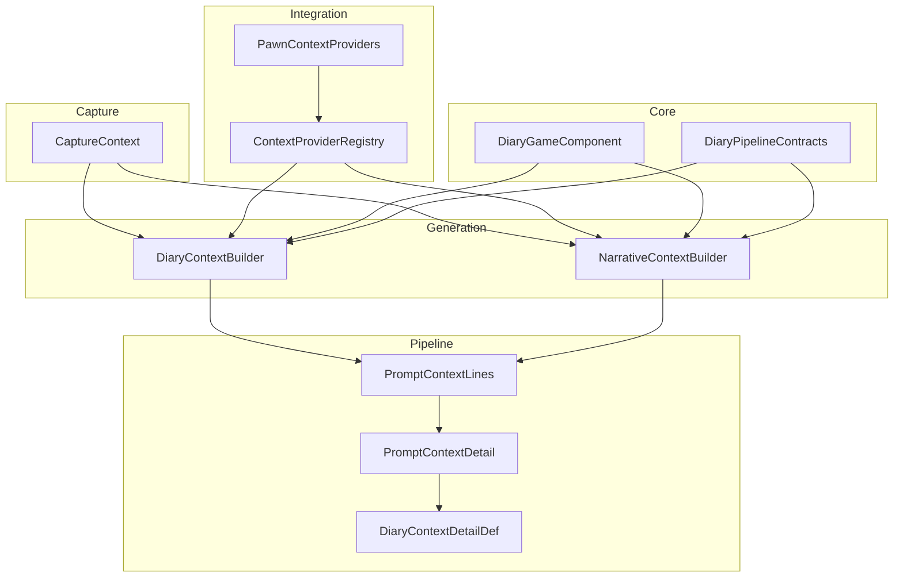
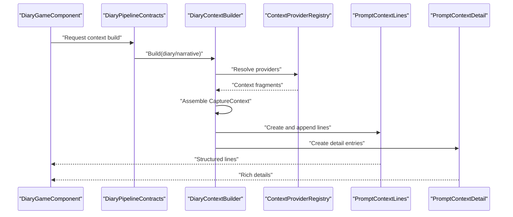
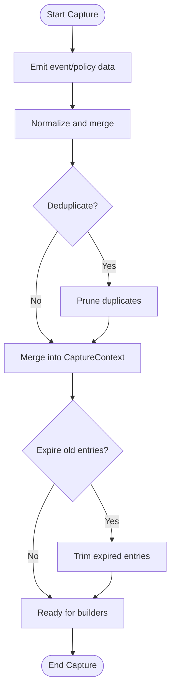
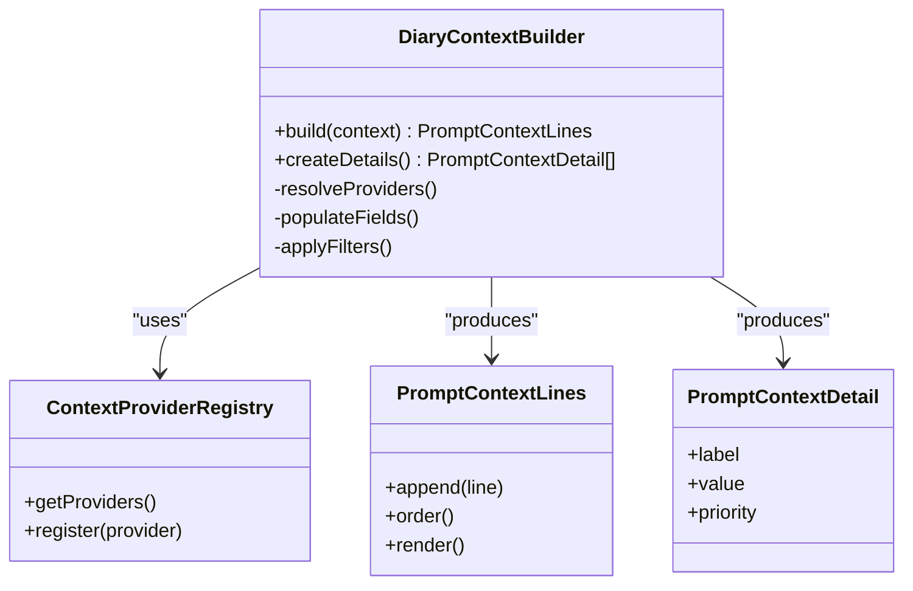
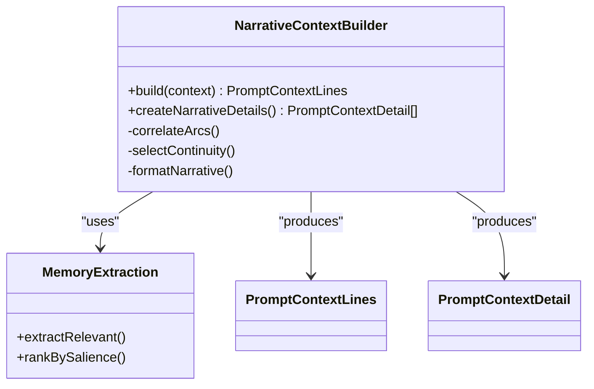
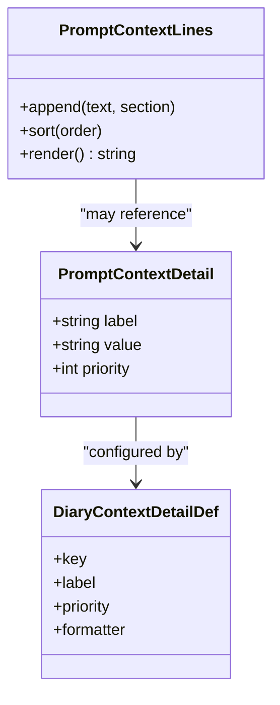
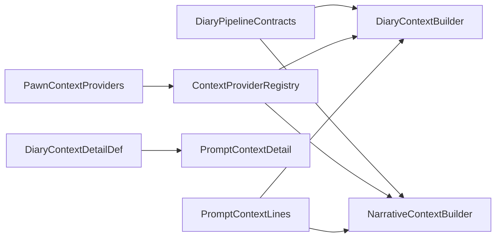

# Context Building Engine

- [CaptureContext.cs](../../../../Source/Capture/CaptureContext.cs)
- [DiaryContextBuilder.cs](../../../../Source/Generation/DiaryContextBuilder.cs)
- [NarrativeContextBuilder.cs](../../../../Source/Generation/NarrativeContextBuilder.cs)
- [PromptContextLines.cs](../../../../Source/Pipeline/PromptContextLines.cs)
- [PromptContextDetail.cs](../../../../Source/Pipeline/PromptContextDetail.cs)
- [DiaryContextDetailDef.cs](../../../../Source/Defs/DiaryContextDetailDef.cs)
- [DiaryGameComponent.cs](../../../../Source/Core/DiaryGameComponent.cs)
- [DiaryPipelineContracts.cs](../../../../Source/Pipeline/DiaryPipelineContracts.cs)
- [MemoryExtraction.cs](../../../../Source/Pipeline/Memory/MemoryExtraction.cs)
- [TextTruncation.cs](../../../../Source/Pipeline/TextTruncation.cs)
- [PawnContextProviders.cs](../../../../Source/Integration/PawnContextProviders.cs)
- [ContextProviderRegistry.cs](../../../../Source/Pipeline/ContextProviderRegistry.cs)
## Table of Contents
1. [Introduction](#introduction)
2. [Project Structure](#project-structure)
3. [Core Components](#core-components)
4. [Architecture Overview](#architecture-overview)
5. [Detailed Component Analysis](#detailed-component-analysis)
6. [Dependency Analysis](#dependency-analysis)
7. [Performance Considerations](#performance-considerations)
8. [Troubleshooting Guide](#troubleshooting-guide)
9. [Conclusion](#conclusion)
10. [Appendices](#appendices)

## Introduction
This document explains the context building engine used to assemble rich, structured contextual data for AI prompts. It focuses on how CaptureContext objects are constructed from multiple sources, how DiaryContextBuilder and NarrativeContextBuilder orchestrate assembly, and how PromptContextLines and PromptContextDetail organize and present context information. It also covers extending builders with custom providers, caching strategies, memory management, performance optimization, debugging techniques, and prompt size control.

## Project Structure
The context building system spans several layers:
- Capture layer: collects raw events and facts into CaptureContext instances.
- Generation layer: orchestrates context assembly via builders (diary and narrative).
- Pipeline layer: formats and structures context lines and details for downstream consumers.
- Integration layer: exposes provider APIs and registries for modders and integrators.

**Diagram sources**
- [CaptureContext.cs](../../../../Source/Capture/CaptureContext.cs)
- [DiaryContextBuilder.cs](../../../../Source/Generation/DiaryContextBuilder.cs)
- [NarrativeContextBuilder.cs](../../../../Source/Generation/NarrativeContextBuilder.cs)
- [PromptContextLines.cs](../../../../Source/Pipeline/PromptContextLines.cs)
- [PromptContextDetail.cs](../../../../Source/Pipeline/PromptContextDetail.cs)
- [DiaryContextDetailDef.cs](../../../../Source/Defs/DiaryContextDetailDef.cs)
- [PawnContextProviders.cs](../../../../Source/Integration/PawnContextProviders.cs)
- [ContextProviderRegistry.cs](../../../../Source/Pipeline/ContextProviderRegistry.cs)
- [DiaryGameComponent.cs](../../../../Source/Core/DiaryGameComponent.cs)
- [DiaryPipelineContracts.cs](../../../../Source/Pipeline/DiaryPipelineContracts.cs)

**Section sources**
- [CaptureContext.cs](../../../../Source/Capture/CaptureContext.cs)
- [DiaryContextBuilder.cs](../../../../Source/Generation/DiaryContextBuilder.cs)
- [NarrativeContextBuilder.cs](../../../../Source/Generation/NarrativeContextBuilder.cs)
- [PromptContextLines.cs](../../../../Source/Pipeline/PromptContextLines.cs)
- [PromptContextDetail.cs](../../../../Source/Pipeline/PromptContextDetail.cs)
- [DiaryContextDetailDef.cs](../../../../Source/Defs/DiaryContextDetailDef.cs)
- [PawnContextProviders.cs](../../../../Source/Integration/PawnContextProviders.cs)
- [ContextProviderRegistry.cs](../../../../Source/Pipeline/ContextProviderRegistry.cs)
- [DiaryGameComponent.cs](../../../../Source/Core/DiaryGameComponent.cs)
- [DiaryPipelineContracts.cs](../../../../Source/Pipeline/DiaryPipelineContracts.cs)

## Core Components
- CaptureContext: The central payload carrying contextual data collected from game events, policies, and external sources. It is populated by capture policies and signals, then consumed by builders.
- DiaryContextBuilder: Assembles diary-oriented context for a specific pawn or event, coordinating providers, enriching fields, and producing structured output for prompt generation.
- NarrativeContextBuilder: Builds narrative-focused context, often combining long-term arcs, continuity, and cross-event relationships into a coherent narrative snapshot.
- PromptContextLines: A container that organizes context as ordered lines suitable for prompt text, supporting sections, ordering, and formatting.
- PromptContextDetail: Represents detailed context entries with metadata, enabling rich rendering and filtering based on definitions.
- DiaryContextDetailDef: Definition-driven configuration for context detail types, including labels, priorities, and display rules.
- ContextProviderRegistry and PawnContextProviders: Registry and built-in providers that supply domain-specific context fragments (e.g., mood, hediffs, interactions).
- DiaryGameComponent and DiaryPipelineContracts: Entry points and contracts that drive pipeline execution and expose integration surfaces.

Key responsibilities:
- CaptureContext holds normalized, typed data ready for consumption.
- Builders transform CaptureContext into PromptContextLines and PromptContextDetail collections.
- Definitions and registry enable extensibility without modifying core logic.

**Section sources**
- [CaptureContext.cs](../../../../Source/Capture/CaptureContext.cs)
- [DiaryContextBuilder.cs](../../../../Source/Generation/DiaryContextBuilder.cs)
- [NarrativeContextBuilder.cs](../../../../Source/Generation/NarrativeContextBuilder.cs)
- [PromptContextLines.cs](../../../../Source/Pipeline/PromptContextLines.cs)
- [PromptContextDetail.cs](../../../../Source/Pipeline/PromptContextDetail.cs)
- [DiaryContextDetailDef.cs](../../../../Source/Defs/DiaryContextDetailDef.cs)
- [ContextProviderRegistry.cs](../../../../Source/Pipeline/ContextProviderRegistry.cs)
- [PawnContextProviders.cs](../../../../Source/Integration/PawnContextProviders.cs)
- [DiaryGameComponent.cs](../../../../Source/Core/DiaryGameComponent.cs)
- [DiaryPipelineContracts.cs](../../../../Source/Pipeline/DiaryPipelineContracts.cs)

## Architecture Overview
The context building pipeline follows a producer-consumer pattern:
- Producers (signals, policies, integrations) populate CaptureContext.
- Builders read CaptureContext and produce PromptContextLines and PromptContextDetail.
- Consumers render or serialize context for prompts, UI, or storage.

**Diagram sources**
- [DiaryGameComponent.cs](../../../../Source/Core/DiaryGameComponent.cs)
- [DiaryPipelineContracts.cs](../../../../Source/Pipeline/DiaryPipelineContracts.cs)
- [DiaryContextBuilder.cs](../../../../Source/Generation/DiaryContextBuilder.cs)
- [NarrativeContextBuilder.cs](../../../../Source/Generation/NarrativeContextBuilder.cs)
- [ContextProviderRegistry.cs](../../../../Source/Pipeline/ContextProviderRegistry.cs)
- [PromptContextLines.cs](../../../../Source/Pipeline/PromptContextLines.cs)
- [PromptContextDetail.cs](../../../../Source/Pipeline/PromptContextDetail.cs)

## Detailed Component Analysis

### CaptureContext Construction
CaptureContext is the canonical representation of assembled context. It aggregates:
- Event snapshots and timestamps
- Pawn state and attributes
- Relationship and arc references
- External integration payloads
- Flags and metadata for filtering and prioritization

Construction flow:
- Signals and policies emit structured data.
- Policies normalize and merge data into CaptureContext.
- Deduplication and expiry policies prune stale entries.
- Final CaptureContext is passed to builders.

**Diagram sources**
- [CaptureContext.cs](../../../../Source/Capture/CaptureContext.cs)

**Section sources**
- [CaptureContext.cs](../../../../Source/Capture/CaptureContext.cs)

### DiaryContextBuilder
Responsibilities:
- Resolve relevant providers via ContextProviderRegistry.
- Populate CaptureContext with diary-relevant fields.
- Generate PromptContextLines for prompt text.
- Create PromptContextDetail entries for rich metadata.

Key behaviors:
- Applies filters and policies to include only necessary context.
- Orders lines by relevance and recency.
- Integrates with definitions (DiaryContextDetailDef) to format details.

**Diagram sources**
- [DiaryContextBuilder.cs](../../../../Source/Generation/DiaryContextBuilder.cs)
- [ContextProviderRegistry.cs](../../../../Source/Pipeline/ContextProviderRegistry.cs)
- [PromptContextLines.cs](../../../../Source/Pipeline/PromptContextLines.cs)
- [PromptContextDetail.cs](../../../../Source/Pipeline/PromptContextDetail.cs)

**Section sources**
- [DiaryContextBuilder.cs](../../../../Source/Generation/DiaryContextBuilder.cs)
- [ContextProviderRegistry.cs](../../../../Source/Pipeline/ContextProviderRegistry.cs)
- [PromptContextLines.cs](../../../../Source/Pipeline/PromptContextLines.cs)
- [PromptContextDetail.cs](../../../../Source/Pipeline/PromptContextDetail.cs)

### NarrativeContextBuilder
Responsibilities:
- Assemble long-term narrative context across events and arcs.
- Correlate relationships, milestones, and continuity markers.
- Produce narrative-focused PromptContextLines and PromptContextDetail.

Key behaviors:
- Uses narrative-specific policies to select salient history.
- Emphasizes continuity and thematic coherence.
- May integrate with memory recall and extraction components.

**Diagram sources**
- [NarrativeContextBuilder.cs](../../../../Source/Generation/NarrativeContextBuilder.cs)
- [MemoryExtraction.cs](../../../../Source/Pipeline/Memory/MemoryExtraction.cs)
- [PromptContextLines.cs](../../../../Source/Pipeline/PromptContextLines.cs)
- [PromptContextDetail.cs](../../../../Source/Pipeline/PromptContextDetail.cs)

**Section sources**
- [NarrativeContextBuilder.cs](../../../../Source/Generation/NarrativeContextBuilder.cs)
- [MemoryExtraction.cs](../../../../Source/Pipeline/Memory/MemoryExtraction.cs)
- [PromptContextLines.cs](../../../../Source/Pipeline/PromptContextLines.cs)
- [PromptContextDetail.cs](../../../../Source/Pipeline/PromptContextDetail.cs)

### PromptContextLines and PromptContextDetail Systems
- PromptContextLines:
  - Organizes context as ordered, sectioned lines.
  - Supports appending, sorting, and rendering into plain text.
  - Enables modular composition of context segments.
- PromptContextDetail:
  - Encapsulates key-value pairs with metadata (labels, priorities).
  - Driven by DiaryContextDetailDef for consistent formatting and filtering.

**Diagram sources**
- [PromptContextLines.cs](../../../../Source/Pipeline/PromptContextLines.cs)
- [PromptContextDetail.cs](../../../../Source/Pipeline/PromptContextDetail.cs)
- [DiaryContextDetailDef.cs](../../../../Source/Defs/DiaryContextDetailDef.cs)

**Section sources**
- [PromptContextLines.cs](../../../../Source/Pipeline/PromptContextLines.cs)
- [PromptContextDetail.cs](../../../../Source/Pipeline/PromptContextDetail.cs)
- [DiaryContextDetailDef.cs](../../../../Source/Defs/DiaryContextDetailDef.cs)

### Extending Context Builders and Adding Custom Providers
To add custom context:
- Implement a provider that supplies context fragments.
- Register the provider via ContextProviderRegistry.
- Use PawnContextProviders as a reference for built-in patterns.
- In builders, resolve your provider and incorporate its output into PromptContextLines and PromptContextDetail.

Steps:
- Define provider interface implementation.
- Register provider at startup or via integration hooks.
- Update builder logic to call provider and append results.
- Optionally define new DiaryContextDetailDef entries for richer details.

**Section sources**
- [PawnContextProviders.cs](../../../../Source/Integration/PawnContextProviders.cs)
- [ContextProviderRegistry.cs](../../../../Source/Pipeline/ContextProviderRegistry.cs)
- [DiaryContextDetailDef.cs](../../../../Source/Defs/DiaryContextDetailDef.cs)
- [DiaryContextBuilder.cs](../../../../Source/Generation/DiaryContextBuilder.cs)
- [NarrativeContextBuilder.cs](../../../../Source/Generation/NarrativeContextBuilder.cs)

## Dependency Analysis
The context building system exhibits clear separation of concerns:
- Builders depend on providers and definitions but not on concrete game internals.
- Providers encapsulate domain knowledge and are pluggable.
- Pipeline components (lines, details) are reusable and definition-driven.

**Diagram sources**
- [DiaryPipelineContracts.cs](../../../../Source/Pipeline/DiaryPipelineContracts.cs)
- [DiaryContextBuilder.cs](../../../../Source/Generation/DiaryContextBuilder.cs)
- [NarrativeContextBuilder.cs](../../../../Source/Generation/NarrativeContextBuilder.cs)
- [ContextProviderRegistry.cs](../../../../Source/Pipeline/ContextProviderRegistry.cs)
- [PawnContextProviders.cs](../../../../Source/Integration/PawnContextProviders.cs)
- [DiaryContextDetailDef.cs](../../../../Source/Defs/DiaryContextDetailDef.cs)
- [PromptContextDetail.cs](../../../../Source/Pipeline/PromptContextDetail.cs)
- [PromptContextLines.cs](../../../../Source/Pipeline/PromptContextLines.cs)

**Section sources**
- [DiaryPipelineContracts.cs](../../../../Source/Pipeline/DiaryPipelineContracts.cs)
- [DiaryContextBuilder.cs](../../../../Source/Generation/DiaryContextBuilder.cs)
- [NarrativeContextBuilder.cs](../../../../Source/Generation/NarrativeContextBuilder.cs)
- [ContextProviderRegistry.cs](../../../../Source/Pipeline/ContextProviderRegistry.cs)
- [PawnContextProviders.cs](../../../../Source/Integration/PawnContextProviders.cs)
- [DiaryContextDetailDef.cs](../../../../Source/Defs/DiaryContextDetailDef.cs)
- [PromptContextDetail.cs](../../../../Source/Pipeline/PromptContextDetail.cs)
- [PromptContextLines.cs](../../../../Source/Pipeline/PromptContextLines.cs)

## Performance Considerations
- Caching:
  - Cache provider outputs keyed by stable identifiers (pawn ID, time windows).
  - Reuse PromptContextLines where possible; avoid rebuilding identical segments.
  - Employ memory extraction caches for narrative context to reduce recomputation.
- Memory Management:
  - Limit the number of PromptContextDetail entries per category.
  - Apply truncation policies to keep context within token budgets.
  - Prefer lightweight representations in CaptureContext; defer heavy formatting until rendering.
- Optimization Techniques:
  - Batch provider calls and merge results efficiently.
  - Use priority-based selection to drop low-salience details early.
  - Defer expensive computations until context is actually needed.

[No sources needed since this section provides general guidance]

## Troubleshooting Guide
Common issues and remedies:
- Missing context fragments:
  - Verify provider registration and resolution order.
  - Check filters applied by builders; ensure conditions match expected states.
- Excessive context size:
  - Adjust priorities in DiaryContextDetailDef.
  - Enable truncation and review TextTruncation behavior.
- Slow context assembly:
  - Profile provider implementations; cache repeated work.
  - Reduce unnecessary fields in CaptureContext.
- Incorrect ordering or duplication:
  - Inspect PromptContextLines ordering logic and deduplication steps.
  - Validate policy decisions affecting inclusion/exclusion.

Debugging tips:
- Log provider inputs and outputs during development.
- Inspect intermediate CaptureContext snapshots before builders.
- Use definitions to toggle detail visibility for targeted testing.

**Section sources**
- [TextTruncation.cs](../../../../Source/Pipeline/TextTruncation.cs)
- [DiaryContextDetailDef.cs](../../../../Source/Defs/DiaryContextDetailDef.cs)
- [ContextProviderRegistry.cs](../../../../Source/Pipeline/ContextProviderRegistry.cs)
- [PromptContextLines.cs](../../../../Source/Pipeline/PromptContextLines.cs)

## Conclusion
The context building engine provides a robust, extensible framework for assembling rich contextual data for AI prompts. By leveraging CaptureContext, specialized builders, and well-defined pipeline components, it balances flexibility with performance. Modders can extend functionality through providers and definitions while maintaining predictable behavior and efficient memory usage.

[No sources needed since this section summarizes without analyzing specific files]

## Appendices

### Example: Adding a Custom Provider
- Implement a provider that returns context fragments for a specific domain.
- Register the provider using the registry.
- Integrate provider output into builders by appending to PromptContextLines and creating PromptContextDetail entries.
- Define any new DiaryContextDetailDef entries required for formatting.

**Section sources**
- [PawnContextProviders.cs](../../../../Source/Integration/PawnContextProviders.cs)
- [ContextProviderRegistry.cs](../../../../Source/Pipeline/ContextProviderRegistry.cs)
- [DiaryContextDetailDef.cs](../../../../Source/Defs/DiaryContextDetailDef.cs)
- [DiaryContextBuilder.cs](../../../../Source/Generation/DiaryContextBuilder.cs)
- [NarrativeContextBuilder.cs](../../../../Source/Generation/NarrativeContextBuilder.cs)

### Example: Optimizing Context Size
- Set appropriate priorities in definitions to prioritize important details.
- Apply truncation policies to enforce token limits.
- Use selective provider activation based on current game state.

**Section sources**
- [DiaryContextDetailDef.cs](../../../../Source/Defs/DiaryContextDetailDef.cs)
- [TextTruncation.cs](../../../../Source/Pipeline/TextTruncation.cs)
