# Custom Event Development

- DiaryWorkPatches.cs
- [DiaryHealthPatches.cs](../../../../Source/Patches/DiaryHealthPatches.cs)
- [DiaryOdysseyPatches.cs](../../../../Source/Patches/DiaryOdysseyPatches.cs)
- [DiaryBiotechMechanitorPatches.cs](../../../../Source/Patches/DiaryBiotechMechanitorPatches.cs)
## Table of Contents
1. [Introduction](#introduction)
2. [Project Structure](#project-structure)
3. [Core Components](#core-components)
4. [Architecture Overview](#architecture-overview)
5. [Detailed Component Analysis](#detailed-component-analysis)
6. [Dependency Analysis](#dependency-analysis)
7. [Performance Considerations](#performance-considerations)
8. [Troubleshooting Guide](#troubleshooting-guide)
9. [Conclusion](#conclusion)
10. [Appendices](#appendices)

## Introduction
This document explains how to create custom events and handlers for the Diary system, focusing on end-to-end implementation: defining signal classes, implementing capture policies, integrating with the event pipeline, and registering patches. It also documents the CaptureDecision control flow and provides reference implementations via BodyPartEventPolicy and ThoughtCapturePolicy. You will learn step-by-step how to add new event sources, implement policies, register them, handle errors, test your changes, and follow best practices for performance, compatibility, and mod integration.

## Project Structure
The event system is organized into clear layers:
- Ingestion: Signals emitted by game code and patches funnel into a unified ingestion layer.
- Capture: Policies decide whether and how to capture an event, producing typed data and decisions.
- Pipeline: Context building, prompt generation, retention, and persistence.
- Core: Game component orchestration, repositories, and dispatching.
- Patches: Integration points that emit signals from game code.
- Integration: Public API surface for external mods and tools.

```mermaid
graph TB
subgraph "Patches"
P1["DiaryThoughtPatches.cs"]
P2["DiaryDeathPatches.cs"]
P3["DiaryBiotechPatches.cs"]
P4["DiaryRoyaltyPatches.cs"]
P5["DiaryQuestPatches.cs"]
P6["DiarySocialLogPatches.cs"]
P7["DiaryWorkPatches.cs"]
P8["DiaryHealthPatches.cs"]
P9["DiaryOdysseyPatches.cs"]
P10["DiaryBiotechMechanitorPatches.cs"]
P11["DiaryAnomalyPatches.cs"]
P12["DiaryArrivalPatches.cs"]
end
subgraph "Ingestion"
S1["DiarySignal.cs"]
S2["ThoughtSignal.cs"]
S3["HediffSignal.cs"]
E1["DiaryEvents.cs"]
end
subgraph "Capture"
C1["CaptureDecision.cs"]
C2["BodyPartEventPolicy.cs"]
C3["ThoughtCapturePolicy.cs"]
C4["DiaryEventSpec.cs"]
C5["DiaryEventCatalog.cs"]
C6["DiaryEventType.cs"]
C7["DiaryEventData.cs"]
end
subgraph "Pipeline"
L1["ListenerRegistry.cs"]
L2["CaptureCapabilityRegistry.cs"]
L3["DiaryContextBuilder.cs"]
L4["DiaryPromptBuilder.cs"]
L5["DiaryPipelineContracts.cs"]
end
subgraph "Core"
G1["DiaryGameComponent.Dispatch.cs"]
R1["DiaryEventRepository.cs"]
R2["DiaryArchiveRepository.cs"]
end
subgraph "Integration"
I1["PawnDiaryApi.cs"]
I2["ExternalEventRequest.cs"]
I3["SubmitEventOutcome.cs"]
end
P1 --> S2
P2 --> S1
P3 --> S3
P4 --> S1
P5 --> S1
P6 --> S1
P7 --> S1
P8 --> S1
P9 --> S1
P10 --> S1
P11 --> S1
P12 --> S1
S2 --> E1
S3 --> E1
E1 --> G1
G1 --> C1
G1 --> C2
G1 --> C3
G1 --> C4
G1 --> C5
G1 --> C6
G1 --> C7
G1 --> L1
G1 --> L2
G1 --> L3
G1 --> L4
G1 --> L5
G1 --> R1
G1 --> R2
I1 --> G1
I2 --> G1
I3 --> G1
```

**Diagram sources**
- [DiaryThoughtPatches.cs](../../../../Source/Patches/DiaryThoughtPatches.cs)
- [DiaryDeathPatches.cs](../../../../Source/Patches/DiaryDeathPatches.cs)
- [DiaryBiotechPatches.cs](../../../../Source/Patches/DiaryBiotechPatches.cs)
- [DiaryRoyaltyPatches.cs](../../../../Source/Patches/DiaryRoyaltyPatches.cs)
- [DiaryQuestPatches.cs](../../../../Source/Patches/DiaryQuestPatches.cs)
- [DiarySocialLogPatches.cs](../../../../Source/Patches/DiarySocialLogPatches.cs)
- DiaryWorkPatches.cs
- [DiaryHealthPatches.cs](../../../../Source/Patches/DiaryHealthPatches.cs)
- [DiaryOdysseyPatches.cs](../../../../Source/Patches/DiaryOdysseyPatches.cs)
- [DiaryBiotechMechanitorPatches.cs](../../../../Source/Patches/DiaryBiotechMechanitorPatches.cs)
- [DiaryAnomalyPatches.cs](../../../../Source/Patches/DiaryAnomalyPatches.cs)
- [DiaryArrivalPatches.cs](../../../../Source/Patches/DiaryArrivalPatches.cs)
- [DiarySignal.cs](../../../../Source/Ingestion/DiarySignal.cs)
- [ThoughtSignal.cs](../../../../Source/Ingestion/Sources/ThoughtSignal.cs)
- [HediffSignal.cs](../../../../Source/Ingestion/Sources/HediffSignal.cs)
- [DiaryEvents.cs](../../../../Source/Ingestion/DiaryEvents.cs)
- [CaptureDecision.cs](../../../../Source/Capture/CaptureDecision.cs)
- [BodyPartEventPolicy.cs](../../../../Source/Capture/BodyPartEventPolicy.cs)
- [ThoughtCapturePolicy.cs](../../../../Source/Capture/ThoughtCapturePolicy.cs)
- [DiaryEventSpec.cs](../../../../Source/Capture/Catalog/DiaryEventSpec.cs)
- [DiaryEventCatalog.cs](../../../../Source/Capture/Catalog/DiaryEventCatalog.cs)
- [DiaryEventType.cs](../../../../Source/Capture/DiaryEventType.cs)
- [DiaryEventData.cs](../../../../Source/Capture/DiaryEventData.cs)
- [ListenerRegistry.cs](../../../../Source/Pipeline/ListenerRegistry.cs)
- [CaptureCapabilityRegistry.cs](../../../../Source/Pipeline/CaptureCapabilityRegistry.cs)
- [DiaryContextBuilder.cs](../../../../Source/Generation/DiaryContextBuilder.cs)
- [DiaryPromptBuilder.cs](../../../../Source/Generation/DiaryPromptBuilder.cs)
- [DiaryPipelineContracts.cs](../../../../Source/Pipeline/DiaryPipelineContracts.cs)
- [DiaryGameComponent.Dispatch.cs](../../../../Source/Core/DiaryGameComponent.Dispatch.cs)
- [DiaryEventRepository.cs](../../../../Source/Core/DiaryEventRepository.cs)
- [DiaryArchiveRepository.cs](../../../../Source/Core/DiaryArchiveRepository.cs)
- [PawnDiaryApi.cs](../../../../Source/Integration/PawnDiaryApi.cs)
- [ExternalEventRequest.cs](../../../../Source/Integration/ExternalEventRequest.cs)
- [SubmitEventOutcome.cs](../../../../Source/Integration/SubmitEventOutcome.cs)

**Section sources**
- [DiarySignal.cs](../../../../Source/Ingestion/DiarySignal.cs)
- [ThoughtSignal.cs](../../../../Source/Ingestion/Sources/ThoughtSignal.cs)
- [HediffSignal.cs](../../../../Source/Ingestion/Sources/HediffSignal.cs)
- [DiaryEvents.cs](../../../../Source/Ingestion/DiaryEvents.cs)
- [DiaryGameComponent.Dispatch.cs](../../../../Source/Core/DiaryGameComponent.Dispatch.cs)
- [DiaryPatchRegistrar.cs](../../../../Source/Patches/DiaryPatchRegistrar.cs)
- [DiaryModStartup.cs](../../../../Source/Patches/DiaryModStartup.cs)

## Core Components
- Signal model: A base type for all ingestion signals and concrete signals per domain (e.g., thought, hediff).
- Capture decision: A result type used by policies to control processing flow (e.g., accept, reject, defer).
- Policies: Domain-specific logic that inspects signals and decides what to capture and how to enrich context.
- Catalog and specs: Typed definitions for event kinds and their payloads.
- Dispatch and registries: Orchestration of policy execution, capability registration, and listener invocation.
- Repositories: Persistence of diary entries and archives.
- Integration API: External submission and outcome reporting.

Key responsibilities:
- Signals carry minimal, immutable event facts.
- Policies transform signals into structured capture decisions and enriched context.
- The dispatcher coordinates policy evaluation and subsequent pipeline stages.
- Registries manage capabilities and listeners for extensibility.

**Section sources**
- [CaptureDecision.cs](../../../../Source/Capture/CaptureDecision.cs)
- [DiaryEventSpec.cs](../../../../Source/Capture/Catalog/DiaryEventSpec.cs)
- [DiaryEventCatalog.cs](../../../../Source/Capture/Catalog/DiaryEventCatalog.cs)
- [DiaryEventType.cs](../../../../Source/Capture/DiaryEventType.cs)
- [DiaryEventData.cs](../../../../Source/Capture/DiaryEventData.cs)
- [ListenerRegistry.cs](../../../../Source/Pipeline/ListenerRegistry.cs)
- [CaptureCapabilityRegistry.cs](../../../../Source/Pipeline/CaptureCapabilityRegistry.cs)
- [DiaryEventRepository.cs](../../../../Source/Core/DiaryEventRepository.cs)
- [DiaryArchiveRepository.cs](../../../../Source/Core/DiaryArchiveRepository.cs)
- [PawnDiaryApi.cs](../../../../Source/Integration/PawnDiaryApi.cs)
- [ExternalEventRequest.cs](../../../../Source/Integration/ExternalEventRequest.cs)
- [SubmitEventOutcome.cs](../../../../Source/Integration/SubmitEventOutcome.cs)

## Architecture Overview
The event pipeline follows a consistent flow:
1. Patch emits a signal.
2. Ingestion routes the signal to the dispatcher.
3. Dispatcher invokes relevant capture policies.
4. Policies return CaptureDecision values to control flow.
5. Accepted events proceed through context building and prompt generation.
6. Results are persisted and optionally exposed via the integration API.

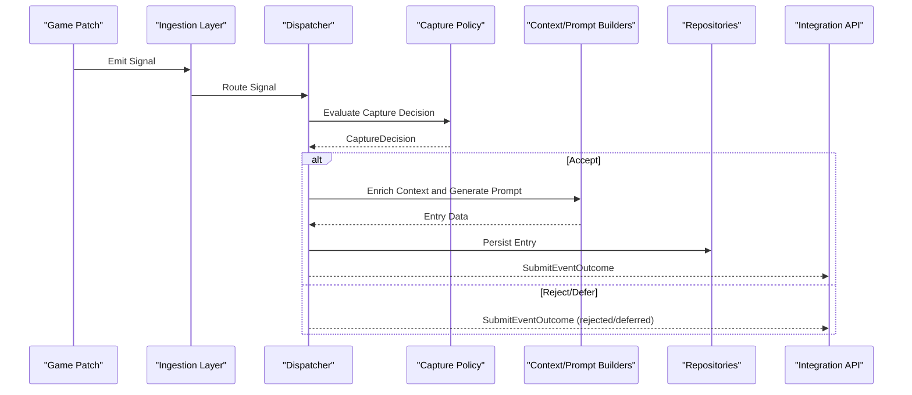

**Diagram sources**
- [DiaryThoughtPatches.cs](../../../../Source/Patches/DiaryThoughtPatches.cs)
- [DiarySignal.cs](../../../../Source/Ingestion/DiarySignal.cs)
- [DiaryEvents.cs](../../../../Source/Ingestion/DiaryEvents.cs)
- [DiaryGameComponent.Dispatch.cs](../../../../Source/Core/DiaryGameComponent.Dispatch.cs)
- [CaptureDecision.cs](../../../../Source/Capture/CaptureDecision.cs)
- [DiaryContextBuilder.cs](../../../../Source/Generation/DiaryContextBuilder.cs)
- [DiaryPromptBuilder.cs](../../../../Source/Generation/DiaryPromptBuilder.cs)
- [DiaryEventRepository.cs](../../../../Source/Core/DiaryEventRepository.cs)
- [DiaryArchiveRepository.cs](../../../../Source/Core/DiaryArchiveRepository.cs)
- [PawnDiaryApi.cs](../../../../Source/Integration/PawnDiaryApi.cs)
- [SubmitEventOutcome.cs](../../../../Source/Integration/SubmitEventOutcome.cs)

## Detailed Component Analysis

### CaptureDecision System
CaptureDecision controls the lifecycle of an event through the pipeline. Typical outcomes include accepting an event for capture, rejecting it, or deferring it for later consideration. Policies use this to gate expensive operations and ensure only relevant events proceed.

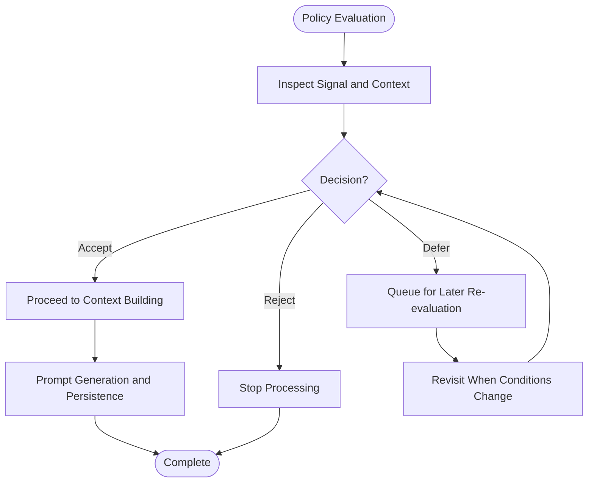

**Diagram sources**
- [CaptureDecision.cs](../../../../Source/Capture/CaptureDecision.cs)
- [DiaryGameComponent.Dispatch.cs](../../../../Source/Core/DiaryGameComponent.Dispatch.cs)

**Section sources**
- [CaptureDecision.cs](../../../../Source/Capture/CaptureDecision.cs)
- [DiaryGameComponent.Dispatch.cs](../../../../Source/Core/DiaryGameComponent.Dispatch.cs)

### Reference Implementation: ThoughtCapturePolicy
ThoughtCapturePolicy demonstrates a complete capture policy:
- Matches specific thought-related signals.
- Applies filtering rules based on pawn state and thought properties.
- Produces a CaptureDecision indicating acceptance or rejection.
- Enriches context fields for downstream prompt generation.

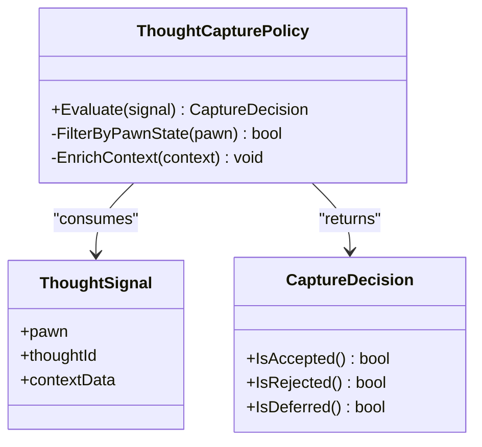

**Diagram sources**
- [ThoughtCapturePolicy.cs](../../../../Source/Capture/ThoughtCapturePolicy.cs)
- [ThoughtSignal.cs](../../../../Source/Ingestion/Sources/ThoughtSignal.cs)
- [CaptureDecision.cs](../../../../Source/Capture/CaptureDecision.cs)

**Section sources**
- [ThoughtCapturePolicy.cs](../../../../Source/Capture/ThoughtCapturePolicy.cs)
- [ThoughtSignal.cs](../../../../Source/Ingestion/Sources/ThoughtSignal.cs)
- [CaptureDecision.cs](../../../../Source/Capture/CaptureDecision.cs)

### Reference Implementation: BodyPartEventPolicy
BodyPartEventPolicy shows how to handle body modification events:
- Targets hediff-related signals associated with body parts.
- Validates ownership and relevance to the active pawn.
- Returns CaptureDecision to accept or ignore based on criteria.
- Adds contextual details such as part location and severity.

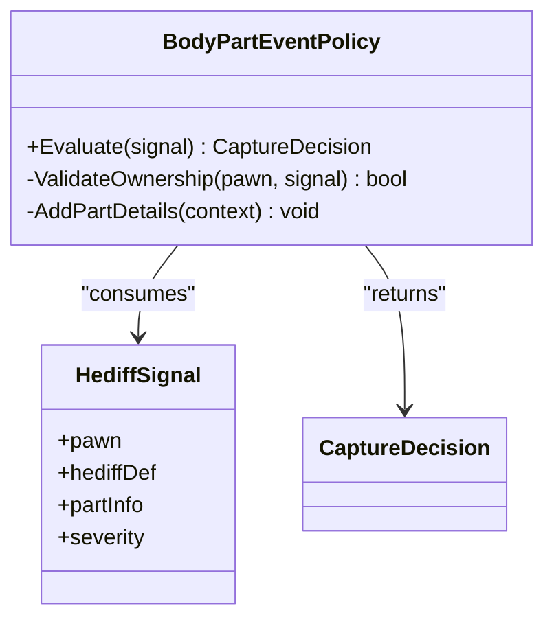

**Diagram sources**
- [BodyPartEventPolicy.cs](../../../../Source/Capture/BodyPartEventPolicy.cs)
- [HediffSignal.cs](../../../../Source/Ingestion/Sources/HediffSignal.cs)
- [CaptureDecision.cs](../../../../Source/Capture/CaptureDecision.cs)

**Section sources**
- [BodyPartEventPolicy.cs](../../../../Source/Capture/BodyPartEventPolicy.cs)
- [HediffSignal.cs](../../../../Source/Ingestion/Sources/HediffSignal.cs)
- [CaptureDecision.cs](../../../../Source/Capture/CaptureDecision.cs)

### Creating Custom Event Sources
To introduce a new event source:
1. Define a new signal class derived from the base signal type.
2. Add patch hooks in your mod to emit the signal at appropriate game moments.
3. Register any necessary patch entry points during mod startup.

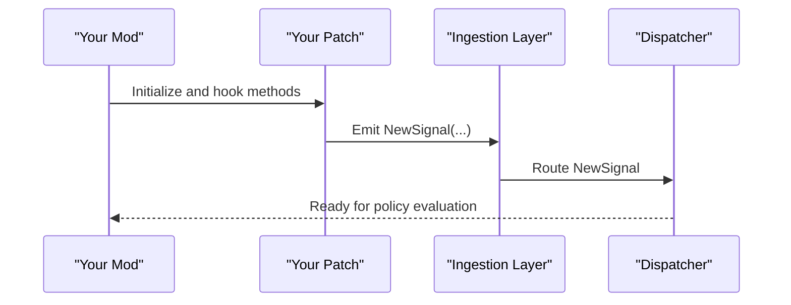

**Diagram sources**
- [DiarySignal.cs](../../../../Source/Ingestion/DiarySignal.cs)
- [DiaryEvents.cs](../../../../Source/Ingestion/DiaryEvents.cs)
- [DiaryPatchRegistrar.cs](../../../../Source/Patches/DiaryPatchRegistrar.cs)
- [DiaryModStartup.cs](../../../../Source/Patches/DiaryModStartup.cs)

**Section sources**
- [DiarySignal.cs](../../../../Source/Ingestion/DiarySignal.cs)
- [DiaryEvents.cs](../../../../Source/Ingestion/DiaryEvents.cs)
- [DiaryPatchRegistrar.cs](../../../../Source/Patches/DiaryPatchRegistrar.cs)
- [DiaryModStartup.cs](../../../../Source/Patches/DiaryModStartup.cs)

### Implementing Capture Policies
Steps to implement a capture policy:
1. Create a policy class that evaluates incoming signals.
2. Use filtering logic to determine relevance (e.g., pawn identity, event attributes).
3. Return CaptureDecision to accept, reject, or defer.
4. Optionally enrich context fields for downstream builders.

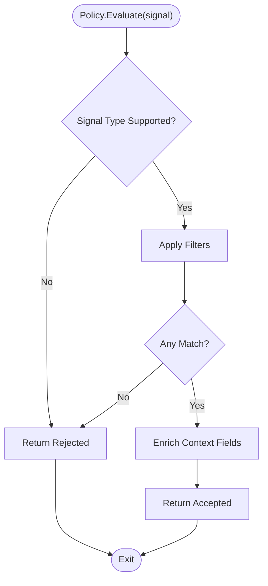

**Diagram sources**
- [CaptureDecision.cs](../../../../Source/Capture/CaptureDecision.cs)
- [ThoughtCapturePolicy.cs](../../../../Source/Capture/ThoughtCapturePolicy.cs)
- [BodyPartEventPolicy.cs](../../../../Source/Capture/BodyPartEventPolicy.cs)

**Section sources**
- [CaptureDecision.cs](../../../../Source/Capture/CaptureDecision.cs)
- [ThoughtCapturePolicy.cs](../../../../Source/Capture/ThoughtCapturePolicy.cs)
- [BodyPartEventPolicy.cs](../../../../Source/Capture/BodyPartEventPolicy.cs)

### Registering Policies with the Patch System
Registration typically occurs during mod initialization:
- Use the patch registrar to bind your patch methods.
- Ensure your policy is discoverable by the dispatcher (via capability registry or explicit registration).
- Confirm that your patch emits signals before policy evaluation.

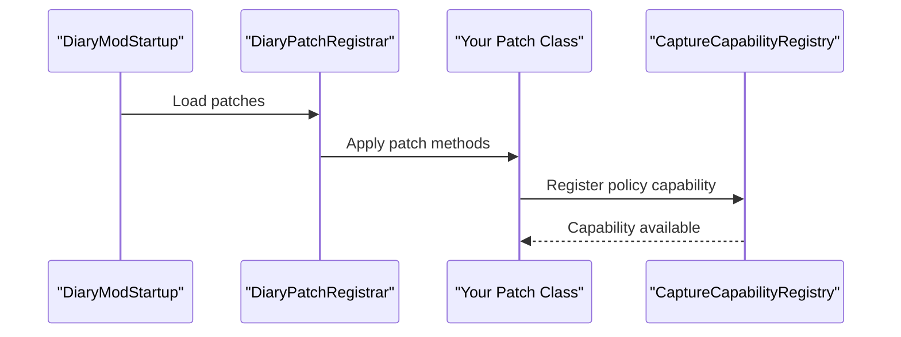

**Diagram sources**
- [DiaryModStartup.cs](../../../../Source/Patches/DiaryModStartup.cs)
- [DiaryPatchRegistrar.cs](../../../../Source/Patches/DiaryPatchRegistrar.cs)
- [CaptureCapabilityRegistry.cs](../../../../Source/Pipeline/CaptureCapabilityRegistry.cs)

**Section sources**
- [DiaryModStartup.cs](../../../../Source/Patches/DiaryModStartup.cs)
- [DiaryPatchRegistrar.cs](../../../../Source/Patches/DiaryPatchRegistrar.cs)
- [CaptureCapabilityRegistry.cs](../../../../Source/Pipeline/CaptureCapabilityRegistry.cs)

### Complex Event Scenarios
- Multi-pawn interactions: Combine multiple signals and correlate contexts before deciding to capture.
- Conditional enrichment: Only add heavy context when certain flags are set to avoid overhead.
- Deferred processing: Defer events until related conditions stabilize (e.g., after batch updates).

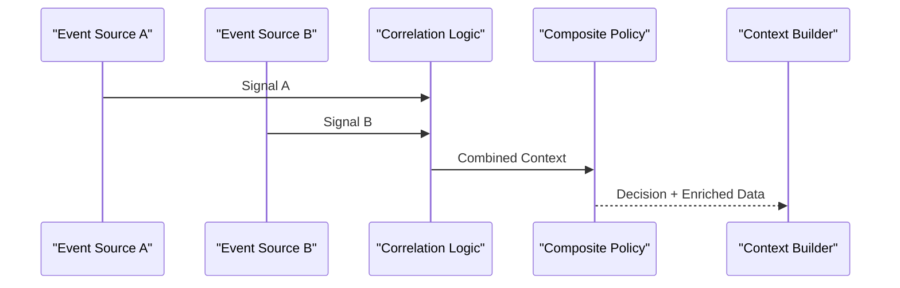

[No sources needed since this diagram shows conceptual workflow, not actual code structure]

### Error Handling Strategies
- Wrap policy evaluation in try/catch blocks to prevent crashes.
- Report errors through the error reporter and log actionable diagnostics.
- Use defensive checks for nulls and missing references.
- Provide fallback behaviors when dependencies are unavailable.

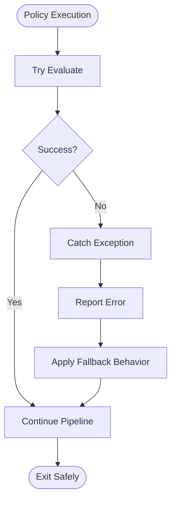

**Diagram sources**
- [DiaryErrorReporter.cs](../../../../Source/Diagnostics/DiaryErrorReporter.cs)
- [DiaryLogReportPatch.cs](../../../../Source/Diagnostics/DiaryLogReportPatch.cs)

**Section sources**
- [DiaryErrorReporter.cs](../../../../Source/Diagnostics/DiaryErrorReporter.cs)
- [DiaryLogReportPatch.cs](../../../../Source/Diagnostics/DiaryLogReportPatch.cs)

### Testing Approaches
- Unit tests for policies: Assert CaptureDecision outcomes under varied inputs.
- Integration tests for signal flows: Verify end-to-end behavior from patch emission to persistence.
- Fixture-based scenarios: Reuse common setup for pawns, contexts, and repositories.
- Regression suites: Cover known edge cases and DLC-specific paths.

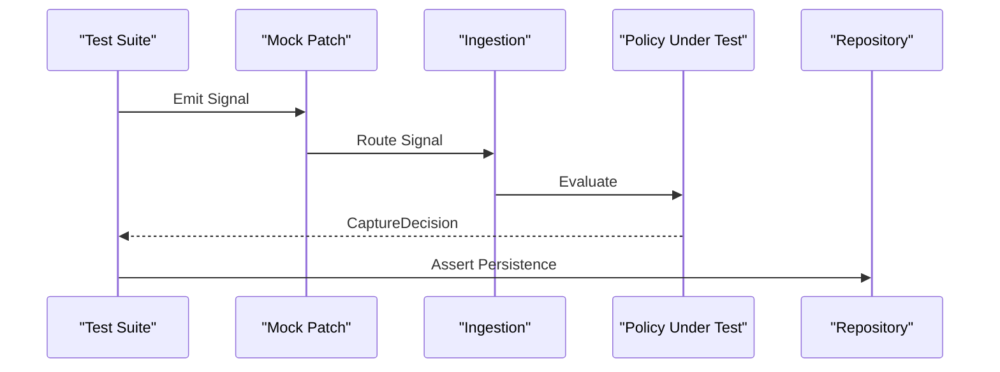

[No sources needed since this diagram shows conceptual workflow, not actual code structure]

## Dependency Analysis
The following diagram highlights key dependencies between core components involved in custom event development.

```mermaid
graph TB
SignalBase["DiarySignal.cs"]
ThoughtSig["ThoughtSignal.cs"]
HediffSig["HediffSignal.cs"]
Events["DiaryEvents.cs"]
Dispatch["DiaryGameComponent.Dispatch.cs"]
Decision["CaptureDecision.cs"]
ThoughtPol["ThoughtCapturePolicy.cs"]
BodyPol["BodyPartEventPolicy.cs"]
Spec["DiaryEventSpec.cs"]
Catalog["DiaryEventCatalog.cs"]
Type["DiaryEventType.cs"]
Data["DiaryEventData.cs"]
ListenerReg["ListenerRegistry.cs"]
CapReg["CaptureCapabilityRegistry.cs"]
CtxBuild["DiaryContextBuilder.cs"]
PromptBuild["DiaryPromptBuilder.cs"]
Contracts["DiaryPipelineContracts.cs"]
EventRepo["DiaryEventRepository.cs"]
ArchiveRepo["DiaryArchiveRepository.cs"]
Api["PawnDiaryApi.cs"]
ExtReq["ExternalEventRequest.cs"]
Outcome["SubmitEventOutcome.cs"]
ThoughtSig --> SignalBase
HediffSig --> SignalBase
Events --> Dispatch
Dispatch --> Decision
Dispatch --> ThoughtPol
Dispatch --> BodyPol
ThoughtPol --> Decision
BodyPol --> Decision
Dispatch --> Spec
Dispatch --> Catalog
Dispatch --> Type
Dispatch --> Data
Dispatch --> ListenerReg
Dispatch --> CapReg
Dispatch --> CtxBuild
Dispatch --> PromptBuild
Dispatch --> Contracts
Dispatch --> EventRepo
Dispatch --> ArchiveRepo
Api --> Dispatch
ExtReq --> Dispatch
Outcome --> Dispatch
```

**Diagram sources**
- [DiarySignal.cs](../../../../Source/Ingestion/DiarySignal.cs)
- [ThoughtSignal.cs](../../../../Source/Ingestion/Sources/ThoughtSignal.cs)
- [HediffSignal.cs](../../../../Source/Ingestion/Sources/HediffSignal.cs)
- [DiaryEvents.cs](../../../../Source/Ingestion/DiaryEvents.cs)
- [DiaryGameComponent.Dispatch.cs](../../../../Source/Core/DiaryGameComponent.Dispatch.cs)
- [CaptureDecision.cs](../../../../Source/Capture/CaptureDecision.cs)
- [ThoughtCapturePolicy.cs](../../../../Source/Capture/ThoughtCapturePolicy.cs)
- [BodyPartEventPolicy.cs](../../../../Source/Capture/BodyPartEventPolicy.cs)
- [DiaryEventSpec.cs](../../../../Source/Capture/Catalog/DiaryEventSpec.cs)
- [DiaryEventCatalog.cs](../../../../Source/Capture/Catalog/DiaryEventCatalog.cs)
- [DiaryEventType.cs](../../../../Source/Capture/DiaryEventType.cs)
- [DiaryEventData.cs](../../../../Source/Capture/DiaryEventData.cs)
- [ListenerRegistry.cs](../../../../Source/Pipeline/ListenerRegistry.cs)
- [CaptureCapabilityRegistry.cs](../../../../Source/Pipeline/CaptureCapabilityRegistry.cs)
- [DiaryContextBuilder.cs](../../../../Source/Generation/DiaryContextBuilder.cs)
- [DiaryPromptBuilder.cs](../../../../Source/Generation/DiaryPromptBuilder.cs)
- [DiaryPipelineContracts.cs](../../../../Source/Pipeline/DiaryPipelineContracts.cs)
- [DiaryEventRepository.cs](../../../../Source/Core/DiaryEventRepository.cs)
- [DiaryArchiveRepository.cs](../../../../Source/Core/DiaryArchiveRepository.cs)
- [PawnDiaryApi.cs](../../../../Source/Integration/PawnDiaryApi.cs)
- [ExternalEventRequest.cs](../../../../Source/Integration/ExternalEventRequest.cs)
- [SubmitEventOutcome.cs](../../../../Source/Integration/SubmitEventOutcome.cs)

**Section sources**
- [DiarySignal.cs](../../../../Source/Ingestion/DiarySignal.cs)
- [ThoughtSignal.cs](../../../../Source/Ingestion/Sources/ThoughtSignal.cs)
- [HediffSignal.cs](../../../../Source/Ingestion/Sources/HediffSignal.cs)
- [DiaryEvents.cs](../../../../Source/Ingestion/DiaryEvents.cs)
- [DiaryGameComponent.Dispatch.cs](../../../../Source/Core/DiaryGameComponent.Dispatch.cs)
- [CaptureDecision.cs](../../../../Source/Capture/CaptureDecision.cs)
- [ThoughtCapturePolicy.cs](../../../../Source/Capture/ThoughtCapturePolicy.cs)
- [BodyPartEventPolicy.cs](../../../../Source/Capture/BodyPartEventPolicy.cs)
- [DiaryEventSpec.cs](../../../../Source/Capture/Catalog/DiaryEventSpec.cs)
- [DiaryEventCatalog.cs](../../../../Source/Capture/Catalog/DiaryEventCatalog.cs)
- [DiaryEventType.cs](../../../../Source/Capture/DiaryEventType.cs)
- [DiaryEventData.cs](../../../../Source/Capture/DiaryEventData.cs)
- [ListenerRegistry.cs](../../../../Source/Pipeline/ListenerRegistry.cs)
- [CaptureCapabilityRegistry.cs](../../../../Source/Pipeline/CaptureCapabilityRegistry.cs)
- [DiaryContextBuilder.cs](../../../../Source/Generation/DiaryContextBuilder.cs)
- [DiaryPromptBuilder.cs](../../../../Source/Generation/DiaryPromptBuilder.cs)
- [DiaryPipelineContracts.cs](../../../../Source/Pipeline/DiaryPipelineContracts.cs)
- [DiaryEventRepository.cs](../../../../Source/Core/DiaryEventRepository.cs)
- [DiaryArchiveRepository.cs](../../../../Source/Core/DiaryArchiveRepository.cs)
- [PawnDiaryApi.cs](../../../../Source/Integration/PawnDiaryApi.cs)
- [ExternalEventRequest.cs](../../../../Source/Integration/ExternalEventRequest.cs)
- [SubmitEventOutcome.cs](../../../../Source/Integration/SubmitEventOutcome.cs)

## Performance Considerations
- Minimize work in hot paths: Keep policy filters lightweight; defer heavy computations.
- Avoid allocations: Reuse buffers and objects where possible.
- Batch operations: Group related signals to reduce repeated context building.
- Early exits: Reject irrelevant events quickly using simple checks.
- Cache lookups: Store frequently accessed data to avoid redundant queries.
- Guard against DLC absence: Check feature availability before accessing DLC-specific APIs.

[No sources needed since this section provides general guidance]

## Troubleshooting Guide
Common issues and resolutions:
- Missing patches: Ensure your patch methods are registered during startup and that patch order does not conflict.
- Null references: Validate pawn and object references before access; provide safe defaults.
- Errors in policy evaluation: Use the error reporter to capture stack traces and context; apply fallbacks.
- Log noise: Filter out expected non-events to keep logs actionable.
- Compatibility: Gracefully handle absent DLC features and version differences.

**Section sources**
- [DiaryErrorReporter.cs](../../../../Source/Diagnostics/DiaryErrorReporter.cs)
- [DiaryLogReportPatch.cs](../../../../Source/Diagnostics/DiaryLogReportPatch.cs)
- [DiaryThoughtPatches.cs](../../../../Source/Patches/DiaryThoughtPatches.cs)
- [DiaryDeathPatches.cs](../../../../Source/Patches/DiaryDeathPatches.cs)
- [DiaryBiotechPatches.cs](../../../../Source/Patches/DiaryBiotechPatches.cs)
- [DiaryRoyaltyPatches.cs](../../../../Source/Patches/DiaryRoyaltyPatches.cs)
- [DiaryQuestPatches.cs](../../../../Source/Patches/DiaryQuestPatches.cs)
- [DiarySocialLogPatches.cs](../../../../Source/Patches/DiarySocialLogPatches.cs)
- DiaryWorkPatches.cs
- [DiaryHealthPatches.cs](../../../../Source/Patches/DiaryHealthPatches.cs)
- [DiaryOdysseyPatches.cs](../../../../Source/Patches/DiaryOdysseyPatches.cs)
- [DiaryBiotechMechanitorPatches.cs](../../../../Source/Patches/DiaryBiotechMechanitorPatches.cs)
- [DiaryAnomalyPatches.cs](../../../../Source/Patches/DiaryAnomalyPatches.cs)
- [DiaryArrivalPatches.cs](../../../../Source/Patches/DiaryArrivalPatches.cs)

## Conclusion
Custom event development in the Diary system centers on clean signal design, precise capture policies, and robust pipeline integration. By leveraging CaptureDecision, reference policies like ThoughtCapturePolicy and BodyPartEventPolicy, and the established patch and registration mechanisms, you can extend the system safely and efficiently. Follow the testing and troubleshooting guidance to maintain reliability across versions and DLCs, and adhere to performance best practices to keep gameplay smooth.

## Appendices

### Step-by-Step Checklist
- Define a new signal class extending the base signal type.
- Add patch hooks to emit the signal at appropriate game moments.
- Implement a capture policy evaluating signals and returning CaptureDecision.
- Register your policy capability and ensure patch registration during startup.
- Add unit and integration tests covering acceptance, rejection, and deferred scenarios.
- Integrate error handling and logging for resilient operation.
- Validate compatibility with DLCs and other mods.

[No sources needed since this section summarizes without analyzing specific files]
