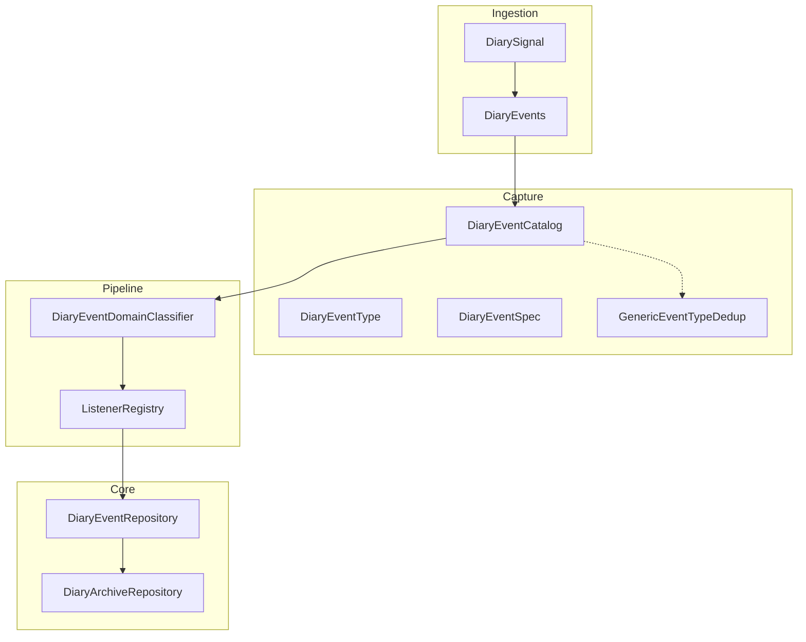
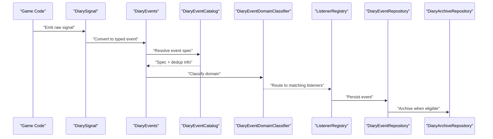
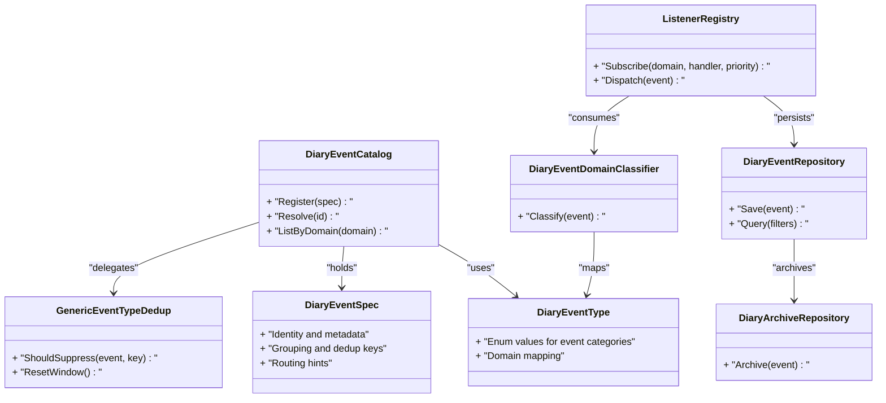

# Event Catalog and Types

## Table of Contents
1. [Introduction](#introduction)
2. [Project Structure](#project-structure)
3. [Core Components](#core-components)
4. [Architecture Overview](#architecture-overview)
5. [Detailed Component Analysis](#detailed-component-analysis)
6. [Dependency Analysis](#dependency-analysis)
7. [Performance Considerations](#performance-considerations)
8. [Troubleshooting Guide](#troubleshooting-guide)
9. [Conclusion](#conclusion)
10. [Appendices](#appendices)

## Introduction
This document explains the event catalog system used to register, categorize, and manage events across game domains. It focuses on:
- How events are registered and managed through the DiaryEventCatalog
- The DiaryEventType enumeration and its relationship to different game domains
- The event specification system using DiaryEventSpec for defining metadata and behavior
- Deduplication strategies and conflict resolution
- Examples of registering new event types and configuring routing rules
- Filtering, priority handling, and debugging techniques

The goal is to provide a clear mental model for both newcomers and experienced developers working with the event system.

## Project Structure
The event catalog system spans several core areas:
- Capture layer: defines event types, specifications, and the catalog registry
- Ingestion layer: converts signals into typed events and dispatches them
- Pipeline layer: classifies domains, routes events, and manages listeners
- Core layer: persists events and archives them

**Diagram sources**
- [DiaryEventCatalog.cs](../../../../Source/Capture/Catalog/DiaryEventCatalog.cs)
- [DiaryEventSpec.cs](../../../../Source/Capture/Catalog/DiaryEventSpec.cs)
- [DiaryEventType.cs](../../../../Source/Capture/DiaryEventType.cs)
- [GenericEventTypeDedup.cs](../../../../Source/Capture/GenericEventTypeDedup.cs)
- [DiarySignal.cs](../../../../Source/Ingestion/DiarySignal.cs)
- [DiaryEvents.cs](../../../../Source/Ingestion/DiaryEvents.cs)
- [DiaryEventDomainClassifier.cs](../../../../Source/Pipeline/DiaryEventDomainClassifier.cs)
- [ListenerRegistry.cs](../../../../Source/Pipeline/ListenerRegistry.cs)
- [DiaryEventRepository.cs](../../../../Source/Core/DiaryEventRepository.cs)
- [DiaryArchiveRepository.cs](../../../../Source/Core/DiaryArchiveRepository.cs)

**Section sources**
- [DiaryEventCatalog.cs](../../../../Source/Capture/Catalog/DiaryEventCatalog.cs)
- [DiaryEventSpec.cs](../../../../Source/Capture/Catalog/DiaryEventSpec.cs)
- [DiaryEventType.cs](../../../../Source/Capture/DiaryEventType.cs)
- [GenericEventTypeDedup.cs](../../../../Source/Capture/GenericEventTypeDedup.cs)
- [DiarySignal.cs](../../../../Source/Ingestion/DiarySignal.cs)
- [DiaryEvents.cs](../../../../Source/Ingestion/DiaryEvents.cs)
- [DiaryEventDomainClassifier.cs](../../../../Source/Pipeline/DiaryEventDomainClassifier.cs)
- [ListenerRegistry.cs](../../../../Source/Pipeline/ListenerRegistry.cs)
- [DiaryEventRepository.cs](../../../../Source/Core/DiaryEventRepository.cs)
- [DiaryArchiveRepository.cs](../../../../Source/Core/DiaryArchiveRepository.cs)

## Core Components
- DiaryEventType: enumerates all supported event categories and maps them to game domains (e.g., social, combat, progression).
- DiaryEventSpec: defines metadata and behavior for an event type, including identifiers, grouping, deduplication keys, and routing hints.
- DiaryEventCatalog: central registry that holds event specs, resolves conflicts, and provides lookup and iteration over available event types.
- GenericEventTypeDedup: implements generic deduplication logic based on spec-defined keys and time windows.
- Domain classifier and listener registry: route events by domain and deliver them to subscribers with priority ordering.

Key responsibilities:
- Registration: add or override event specs at startup or via patches
- Categorization: map events to domains for targeted processing
- Deduplication: prevent redundant entries using spec-defined identity
- Routing: deliver events to appropriate listeners based on domain and filters

**Section sources**
- [DiaryEventType.cs](../../../../Source/Capture/DiaryEventType.cs)
- [DiaryEventSpec.cs](../../../../Source/Capture/Catalog/DiaryEventSpec.cs)
- [DiaryEventCatalog.cs](../../../../Source/Capture/Catalog/DiaryEventCatalog.cs)
- [GenericEventTypeDedup.cs](../../../../Source/Capture/GenericEventTypeDedup.cs)
- [DiaryEventDomainClassifier.cs](../../../../Source/Pipeline/DiaryEventDomainClassifier.cs)
- [ListenerRegistry.cs](../../../../Source/Pipeline/ListenerRegistry.cs)

## Architecture Overview
End-to-end flow from signal ingestion to persistence and archival:

**Diagram sources**
- [DiarySignal.cs](../../../../Source/Ingestion/DiarySignal.cs)
- [DiaryEvents.cs](../../../../Source/Ingestion/DiaryEvents.cs)
- [DiaryEventCatalog.cs](../../../../Source/Capture/Catalog/DiaryEventCatalog.cs)
- [DiaryEventDomainClassifier.cs](../../../../Source/Pipeline/DiaryEventDomainClassifier.cs)
- [ListenerRegistry.cs](../../../../Source/Pipeline/ListenerRegistry.cs)
- [DiaryEventRepository.cs](../../../../Source/Core/DiaryEventRepository.cs)
- [DiaryArchiveRepository.cs](../../../../Source/Core/DiaryArchiveRepository.cs)

## Detailed Component Analysis

### DiaryEventType Enumeration
Purpose:
- Centralizes all event categories and associates each with a domain tag
- Provides stable IDs for cross-mod compatibility and UI labeling

Relationship to game domains:
- Each enum value corresponds to a domain such as social interactions, combat, progression, rituals, anomalies, etc.
- Domain classification drives filtering and routing decisions downstream

Usage patterns:
- Used by the catalog to group and filter events
- Consumed by domain classifiers to select relevant listeners

**Section sources**
- [DiaryEventType.cs](../../../../Source/Capture/DiaryEventType.cs)
- [DiaryEventDomainClassifier.cs](../../../../Source/Pipeline/DiaryEventDomainClassifier.cs)

### DiaryEventSpec System
Purpose:
- Defines metadata and behavior for an event type
- Includes fields for identification, grouping, deduplication keys, and routing hints

Key aspects:
- Identity: unique ID and human-readable name
- Grouping: logical grouping for UI and filtering
- Deduplication: keys and policies to avoid duplicates
- Routing: domain hints and optional priority modifiers

Extensibility:
- New event types are added by creating a spec and registering it with the catalog
- Specs can be overridden or extended by other mods via patching mechanisms

**Section sources**
- [DiaryEventSpec.cs](../../../../Source/Capture/Catalog/DiaryEventSpec.cs)
- [DiaryEventCatalog.cs](../../../../Source/Capture/Catalog/DiaryEventCatalog.cs)

### DiaryEventCatalog
Responsibilities:
- Holds all registered event specs
- Resolves conflicts when multiple mods define overlapping specs
- Provides lookups by ID, domain, and grouping
- Exposes iteration for discovery and diagnostics

Conflict resolution strategy:
- Last-wins or policy-based override depending on load order and explicit overrides
- Validation ensures required fields are present and consistent

Integration points:
- Consumed by ingestion pipeline during event creation
- Used by UI and settings to enumerate available event types

**Section sources**
- [DiaryEventCatalog.cs](../../../../Source/Capture/Catalog/DiaryEventCatalog.cs)

### Deduplication and Conflict Resolution
Deduplication:
- GenericEventTypeDedup uses spec-defined keys and time windows to suppress repeated events
- Keys may include entity IDs, context tags, and normalized content hashes

Conflict resolution:
- When multiple specs target the same event, catalog applies precedence rules
- Load order and explicit override flags determine final behavior

Operational guidance:
- Define minimal but sufficient dedup keys to avoid false positives
- Use grouping to cluster related events and reduce noise

**Section sources**
- [GenericEventTypeDedup.cs](../../../../Source/Capture/GenericEventTypeDedup.cs)
- [DiaryEventCatalog.cs](../../../../Source/Capture/Catalog/DiaryEventCatalog.cs)

### Event Routing and Priority Handling
Routing:
- DiaryEventDomainClassifier maps events to domains based on type and spec hints
- ListenerRegistry subscribes to domains and delivers events to handlers

Priority:
- Handlers can declare priorities; higher-priority handlers run first
- Filters allow selective delivery based on domain, grouping, or custom predicates

Configuration:
- Routing rules are primarily driven by spec metadata and domain mapping
- Additional runtime filters can be applied via settings or API

**Section sources**
- [DiaryEventDomainClassifier.cs](../../../../Source/Pipeline/DiaryEventDomainClassifier.cs)
- [ListenerRegistry.cs](../../../../Source/Pipeline/ListenerRegistry.cs)

### Persistence and Archival
Persistence:
- DiaryEventRepository stores events with metadata and relationships
- Supports querying by domain, grouping, and time ranges

Archival:
- DiaryArchiveRepository moves older or less relevant events to archive storage
- Ensures performance remains stable over long play sessions

**Section sources**
- [DiaryEventRepository.cs](../../../../Source/Core/DiaryEventRepository.cs)
- [DiaryArchiveRepository.cs](../../../../Source/Core/DiaryArchiveRepository.cs)

## Dependency Analysis
High-level dependencies among components:

**Diagram sources**
- [DiaryEventCatalog.cs](../../../../Source/Capture/Catalog/DiaryEventCatalog.cs)
- [DiaryEventSpec.cs](../../../../Source/Capture/Catalog/DiaryEventSpec.cs)
- [DiaryEventType.cs](../../../../Source/Capture/DiaryEventType.cs)
- [GenericEventTypeDedup.cs](../../../../Source/Capture/GenericEventTypeDedup.cs)
- [DiaryEventDomainClassifier.cs](../../../../Source/Pipeline/DiaryEventDomainClassifier.cs)
- [ListenerRegistry.cs](../../../../Source/Pipeline/ListenerRegistry.cs)
- [DiaryEventRepository.cs](../../../../Source/Core/DiaryEventRepository.cs)
- [DiaryArchiveRepository.cs](../../../../Source/Core/DiaryArchiveRepository.cs)

**Section sources**
- [DiaryEventCatalog.cs](../../../../Source/Capture/Catalog/DiaryEventCatalog.cs)
- [DiaryEventSpec.cs](../../../../Source/Capture/Catalog/DiaryEventSpec.cs)
- [DiaryEventType.cs](../../../../Source/Capture/DiaryEventType.cs)
- [GenericEventTypeDedup.cs](../../../../Source/Capture/GenericEventTypeDedup.cs)
- [DiaryEventDomainClassifier.cs](../../../../Source/Pipeline/DiaryEventDomainClassifier.cs)
- [ListenerRegistry.cs](../../../../Source/Pipeline/ListenerRegistry.cs)
- [DiaryEventRepository.cs](../../../../Source/Core/DiaryEventRepository.cs)
- [DiaryArchiveRepository.cs](../../../../Source/Core/DiaryArchiveRepository.cs)

## Performance Considerations
- Deduplication efficiency: ensure dedup keys are stable and not overly broad to minimize suppression errors
- Domain classification cost: keep classification logic lightweight; prefer spec-driven hints
- Listener dispatch: use priority and filters to limit unnecessary processing
- Repository operations: batch writes where possible and leverage archival to maintain query performance

[No sources needed since this section provides general guidance]

## Troubleshooting Guide
Common issues and remedies:
- Duplicate events appearing: verify dedup keys and time windows in specs; check GenericEventTypeDedup behavior
- Missing events in certain domains: confirm DiaryEventType mapping and domain classifier rules
- Conflicting event definitions: inspect catalog resolution and load order; adjust override flags if applicable
- Slow event processing: audit listener priorities and filters; consider reducing scope of handlers
- Debugging techniques:
  - Inspect catalog state and resolved specs
  - Log domain classification results and listener dispatch paths
  - Validate repository queries and archival eligibility

**Section sources**
- [DiaryEventCatalog.cs](../../../../Source/Capture/Catalog/DiaryEventCatalog.cs)
- [GenericEventTypeDedup.cs](../../../../Source/Capture/GenericEventTypeDedup.cs)
- [DiaryEventDomainClassifier.cs](../../../../Source/Pipeline/DiaryEventDomainClassifier.cs)
- [ListenerRegistry.cs](../../../../Source/Pipeline/ListenerRegistry.cs)
- [DiaryEventRepository.cs](../../../../Source/Core/DiaryEventRepository.cs)
- [DiaryArchiveRepository.cs](../../../../Source/Core/DiaryArchiveRepository.cs)

## Conclusion
The event catalog system provides a robust foundation for registering, categorizing, and managing events across diverse game domains. By leveraging well-defined specs, a centralized catalog, and clear routing and deduplication strategies, the system supports extensibility and maintainability. Proper configuration of dedup keys, domain mappings, and listener priorities ensures reliable performance and predictable behavior.

[No sources needed since this section summarizes without analyzing specific files]

## Appendices

### Registering a New Event Type
Steps:
- Define a new DiaryEventType value and associate it with a domain
- Create a DiaryEventSpec with identity, grouping, dedup keys, and routing hints
- Register the spec with DiaryEventCatalog during mod initialization
- Ensure any new listeners subscribe to the appropriate domain and set correct priorities

**Section sources**
- [DiaryEventType.cs](../../../../Source/Capture/DiaryEventType.cs)
- [DiaryEventSpec.cs](../../../../Source/Capture/Catalog/DiaryEventSpec.cs)
- [DiaryEventCatalog.cs](../../../../Source/Capture/Catalog/DiaryEventCatalog.cs)
- [ListenerRegistry.cs](../../../../Source/Pipeline/ListenerRegistry.cs)

### Configuring Event Routing Rules
Guidance:
- Use spec metadata to guide domain classification
- Apply filters in listeners to narrow event scope
- Adjust priorities to control execution order among competing handlers

**Section sources**
- [DiaryEventSpec.cs](../../../../Source/Capture/Catalog/DiaryEventSpec.cs)
- [DiaryEventDomainClassifier.cs](../../../../Source/Pipeline/DiaryEventDomainClassifier.cs)
- [ListenerRegistry.cs](../../../../Source/Pipeline/ListenerRegistry.cs)

### Deduplication Strategies and Conflict Resolution
Best practices:
- Choose minimal, stable dedup keys to avoid suppressing legitimate events
- Use grouping to organize related events and simplify filtering
- Resolve conflicts by adjusting load order or explicit overrides in the catalog

**Section sources**
- [GenericEventTypeDedup.cs](../../../../Source/Capture/GenericEventTypeDedup.cs)
- [DiaryEventCatalog.cs](../../../../Source/Capture/Catalog/DiaryEventCatalog.cs)
