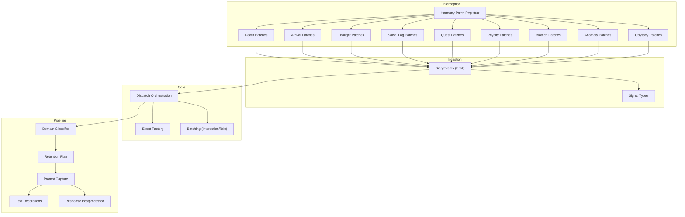
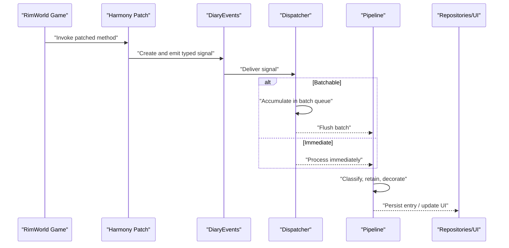
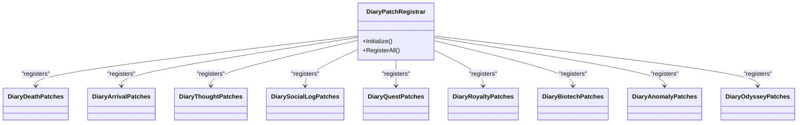
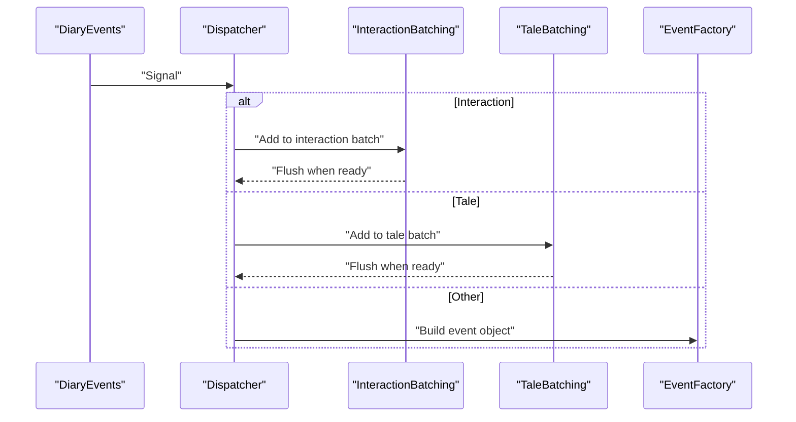
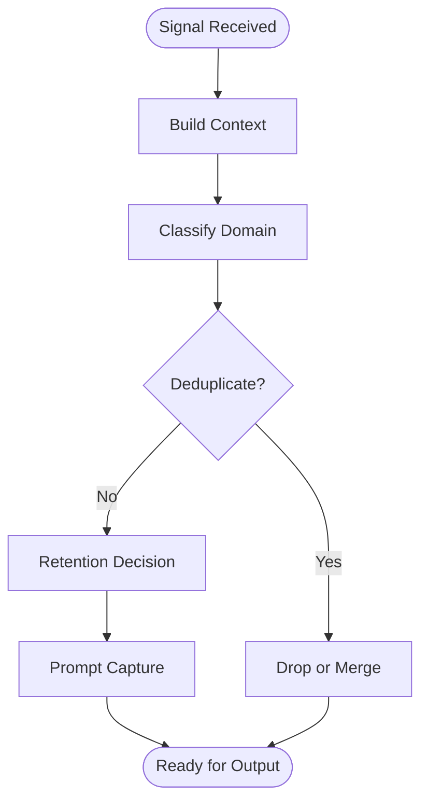
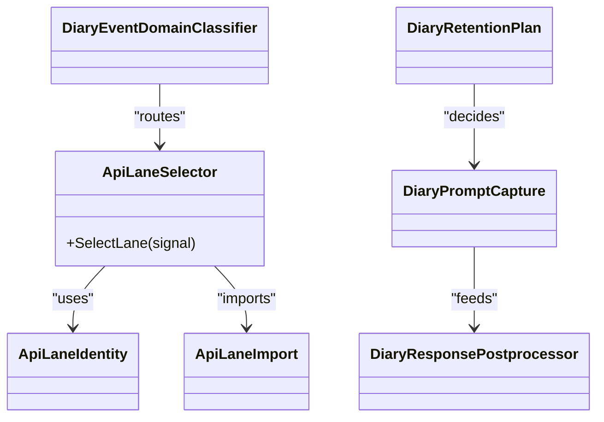
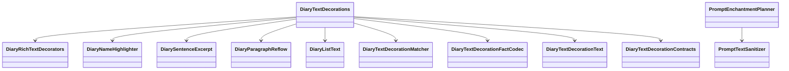
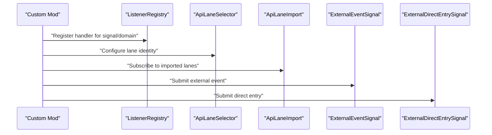
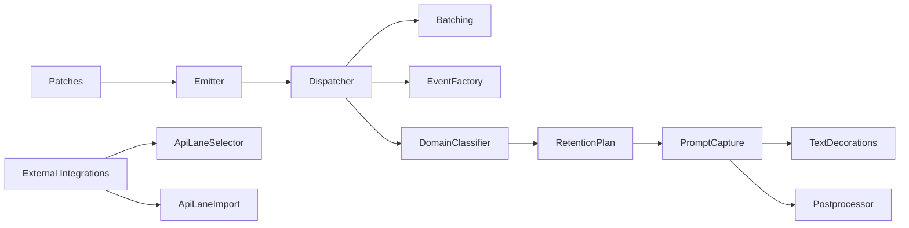

# Event System

<cite>
**Referenced Files in This Document**
- [DiaryPatchRegistrar.cs](../../../../Source/Patches/DiaryPatchRegistrar.cs)
- [DiaryModStartup.cs](../../../../Source/Patches/DiaryModStartup.cs)
- [DiaryDeathPatches.cs](../../../../Source/Patches/DiaryDeathPatches.cs)
- [DiaryArrivalPatches.cs](../../../../Source/Patches/DiaryArrivalPatches.cs)
- [DiaryThoughtPatches.cs](../../../../Source/Patches/DiaryThoughtPatches.cs)
- [DiarySocialLogPatches.cs](../../../../Source/Patches/DiarySocialLogPatches.cs)
- [DiaryQuestPatches.cs](../../../../Source/Patches/DiaryQuestPatches.cs)
- [DiaryRoyaltyPatches.cs](../../../../Source/Patches/DiaryRoyaltyPatches.cs)
- [DiaryBiotechPatches.cs](../../../../Source/Patches/DiaryBiotechPatches.cs)
- [DiaryAnomalyPatches.cs](../../../../Source/Patches/DiaryAnomalyPatches.cs)
- [DiaryOdysseyPatches.cs](../../../../Source/Patches/DiaryOdysseyPatches.cs)
- [DiarySignalPatches.cs](../../../../Source/Patches/DiaryEventSignalPatches.cs)
- [DiaryGameComponent.Dispatch.cs](../../../../Source/Core/DiaryGameComponent.Dispatch.cs)
- [DiaryGameComponent.EventFactory.cs](../../../../Source/Core/DiaryGameComponent.EventFactory.cs)
- [DiaryGameComponent.InteractionBatching.cs](../../../../Source/Core/DiaryGameComponent.InteractionBatching.cs)
- [DiaryGameComponent.TaleBatching.cs](../../../../Source/Core/DiaryGameComponent.TaleBatching.cs)
- [DiaryEvents.cs](../../../../Source/Ingestion/DiaryEvents.cs)
- [DiarySignal.cs](../../../../Source/Ingestion/DiarySignal.cs)
- DeathSignal.cs
- [ArrivalSignal.cs](../../../../Source/Ingestion/Sources/ArrivalSignal.cs)
- [ThoughtSignal.cs](../../../../Source/Ingestion/Sources/ThoughtSignal.cs)
- [InteractionSignal.cs](../../../../Source/Ingestion/Sources/InteractionSignal.cs)
- [RaidSignal.cs](../../../../Source/Ingestion/Sources/RaidSignal.cs)
- [QuestSignal.cs](../../../../Source/Ingestion/Sources/QuestSignal.cs)
- [RitualSignal.cs](../../../../Source/Ingestion/Sources/RitualSignal.cs)
- [RomanceSignal.cs](../../../../Source/Ingestion/Sources/RomanceSignal.cs)
- [MoodEventSignal.cs](../../../../Source/Ingestion/Sources/MoodEventSignal.cs)
- [InspirationSignal.cs](../../../../Source/Ingestion/Sources/InspirationSignal.cs)
- [WorkSignal.cs](../../../../Source/Ingestion/Sources/WorkSignal.cs)
- [HediffSignal.cs](../../../../Source/Ingestion/Sources/HediffSignal.cs)
- [AbilitySignal.cs](../../../../Source/Ingestion/Sources/AbilitySignal.cs)
- [ArcReflectionSignal.cs](../../../../Source/Ingestion/Sources/ArcReflectionSignal.cs)
- [FamilyBirthSignal.cs](../../../../Source/Ingestion/Sources/FamilyBirthSignal.cs)
- [GrowthMomentSignal.cs](../../../../Source/Ingestion/Sources/GrowthMomentSignal.cs)
- [CreepJoinerOutcomeSignal.cs](../../../../Source/Ingestion/Sources/CreepJoinerOutcomeSignal.cs)
- [ExternalEventSignal.cs](../../../../Source/Ingestion/Sources/ExternalEventSignal.cs)
- [ExternalDirectEntrySignal.cs](../../../../Source/Ingestion/Sources/ExternalDirectEntrySignal.cs)
- [DiaryEventCatalog.cs](../../../../Source/Capture/Catalog/DiaryEventCatalog.cs)
- [DiaryEventSpec.cs](../../../../Source/Capture/Catalog/DiaryEventSpec.cs)
- [CaptureContext.cs](../../../../Source/Capture/CaptureContext.cs)
- [CaptureDecision.cs](../../../../Source/Capture/CaptureDecision.cs)
- [DiaryEventType.cs](../../../../Source/Capture/DiaryEventType.cs)
- [GenericEventTypeDedup.cs](../../../../Source/Capture/GenericEventTypeDedup.cs)
- [RecentEventExpiry.cs](../../../../Source/Capture/RecentEventExpiry.cs)
- [DiaryPromptCapture.cs](../../../../Source/Pipeline/DiaryPromptCapture.cs)
- [ListenerRegistry.cs](../../../../Source/Pipeline/ListenerRegistry.cs)
- [ApiLaneSelector.cs](../../../../Source/Pipeline/ApiLaneSelector.cs)
- [ApiLaneIdentity.cs](../../../../Source/Pipeline/ApiLaneIdentity.cs)
- [ApiLaneImport.cs](../../../../Source/Pipeline/ApiLaneImport.cs)
- [DiaryEventDomainClassifier.cs](../../../../Source/Pipeline/DiaryEventDomainClassifier.cs)
- [DiaryRetentionPlan.cs](../../../../Source/Pipeline/DiaryRetentionPlan.cs)
- [DiaryArchiveEligibility.cs](../../../../Source/Pipeline/DiaryArchiveEligibility.cs)
- [DiaryLifeBoundaryPolicy.cs](../../../../Source/Pipeline/DiaryLifeBoundaryPolicy.cs)
- [DiaryResponsePostprocessor.cs](../../../../Source/Pipeline/DiaryResponsePostprocessor.cs)
- [DiaryTextDecorations.cs](../../../../Source/Pipeline/DiaryTextDecorations.cs)
- [DiaryRichTextDecorators.cs](../../../../Source/Pipeline/DiaryRichTextDecorators.cs)
- [DiarySentenceExcerpt.cs](../../../../Source/Pipeline/DiarySentenceExcerpt.cs)
- [DiaryParagraphReflow.cs](../../../../Source/Pipeline/DiaryParagraphReflow.cs)
- [DiaryListText.cs](../../../../Source/Pipeline/DiaryListText.cs)
- [DiaryNameHighlighter.cs](../../../../Source/Pipeline/DiaryNameHighlighter.cs)
- [DiarySaveNormalization.cs](../../../../Source/Pipeline/DiarySaveNormalization.cs)
- [DiaryEntryTitleFilter.cs](../../../../Source/Pipeline/DiaryEntryTitleFilter.cs)
- [DiaryGenerationStatus.cs](../../../../Source/Pipeline/DiaryGenerationStatus.cs)
- [HumorChancePolicy.cs](../../../../Source/Pipeline/HumorChancePolicy.cs)
- [PsychotypeResolutionPolicy.cs](../../../../Source/Pipeline/PsychotypeResolutionPolicy.cs)
- [WritingStyleResolutionPolicy.cs](../../../../Source/Pipeline/WritingStyleResolutionPolicy.cs)
- [ProgressionMilestonePolicy.cs](../../../../Source/Pipeline/ProgressionMilestonePolicy.cs)
- [EventWindowPolicy.cs](../../../../Source/Pipeline/EventWindowPolicy.cs)
- [ExternalApiBudgetPolicy.cs](../../../../Source/Pipeline/ExternalApiBudgetPolicy.cs)
- [ExternalOverrideArbitration.cs](../../../../Source/Pipeline/ExternalOverrideArbitration.cs)
- [ExternalEntryAttribution.cs](../../../../Source/Pipeline/ExternalEntryAttribution.cs)
- [ExternalEventRequestText.cs](../../../../Source/Pipeline/ExternalEventRequestText.cs)
- [ExternalWritingStyleOverrideText.cs](../../../../Source/Pipeline/ExternalWritingStyleOverrideText.cs)
- [DiaryPipelineContracts.cs](../../../../Source/Pipeline/DiaryPipelineContracts.cs)
- [DiaryPromptPlanner.cs](../../../../Source/Pipeline/DiaryPromptPlanner.cs)
- [PromptContextDetail.cs](../../../../Source/Pipeline/PromptContextDetail.cs)
- [PromptContextLines.cs](../../../../Source/Pipeline/PromptContextLines.cs)
- [PromptEnchantmentPlanner.cs](../../../../Source/Pipeline/PromptEnchantmentPlanner.cs)
- [PromptTextSanitizer.cs](../../../../Source/Pipeline/PromptTextSanitizer.cs)
- [DiaryPromptCapture.cs](../../../../Source/Pipeline/DiaryPromptCapture.cs)
- [DiaryTextDecorationMatcher.cs](../../../../Source/Pipeline/DiaryTextDecorationMatcher.cs)
- [DiaryTextDecorationFactCodec.cs](../../../../Source/Pipeline/DiaryTextDecorationFactCodec.cs)
- [DiaryTextDecorationText.cs](../../../../Source/Pipeline/DiaryTextDecorationText.cs)
- [DiaryTextDecorationContracts.cs](../../../../Source/Pipeline/DiaryTextDecorationContracts.cs)
- [DiaryTextDecorations.cs](../../../../Source/Pipeline/DiaryTextDecorations.cs)
- [DiaryTextDecorationText.cs](../../../../Source/Pipeline/DiaryTextDecorationText.cs)
- [DiaryTextDecorationFactCodec.cs](../../../../Source/Pipeline/DiaryTextDecorationFactCodec.cs)
- [DiaryTextDecorationMatcher.cs](../../../../Source/Pipeline/DiaryTextDecorationMatcher.cs)
- [DiaryTextDecorationContracts.cs](../../../../Source/Pipeline/DiaryTextDecorationContracts.cs)
- [DiaryTextDecorations.cs](../../../../Source/Pipeline/DiaryTextDecorations.cs)
- [DiaryTextDecorationText.cs](../../../../Source/Pipeline/DiaryTextDecorationText.cs)
- [DiaryTextDecorationFactCodec.cs](../../../../Source/Pipeline/DiaryTextDecorationFactCodec.cs)
- [DiaryTextDecorationMatcher.cs](../../../../Source/Pipeline/DiaryTextDecorationMatcher.cs)
- [DiaryTextDecorationContracts.cs](../../../../Source/Pipeline/DiaryTextDecorationContracts.cs)
- [DiaryTextDecorations.cs](../../../../Source/Pipeline/DiaryTextDecorations.cs)
- [DiaryTextDecorationText.cs](../../../../Source/Pipeline/DiaryTextDecorationText.cs)
- [DiaryTextDecorationFactCodec.cs](../../../../Source/Pipeline/DiaryTextDecorationFactCodec.cs)
- [DiaryTextDecorationMatcher.cs](../../../../Source/Pipeline/DiaryTextDecorationMatcher.cs)
- [DiaryTextDecorationContracts.cs](../../../../Source/Pipeline/DiaryTextDecorationContracts.cs)
- [DiaryTextDecorations.cs](../../../../Source/Pipeline/DiaryTextDecorations.cs)
- [DiaryTextDecorationText.cs](../../../../Source/Pipeline/DiaryTextDecorationText.cs)
- [DiaryTextDecorationFactCodec.cs](../../../../Source/Pipeline/DiaryTextDecorationFactCodec.cs)
- DiaryTextDecorationMatcher.cs
</cite>

## Table of Contents
1. [Introduction](#introduction)
2. [Project Structure](#project-structure)
3. [Core Components](#core-components)
4. [Architecture Overview](#architecture-overview)
5. [Detailed Component Analysis](#detailed-component-analysis)
6. [Dependency Analysis](#dependency-analysis)
7. [Performance Considerations](#performance-considerations)
8. [Troubleshooting Guide](#troubleshooting-guide)
9. [Conclusion](#conclusion)
10. [Appendices](#appendices)

## Introduction
This document explains the event capture and processing system used by the mod to intercept RimWorld game events, convert them into structured signals, and process them through a robust pipeline. It covers Harmony-based interception, signal architecture, context building, registration and dispatch mechanisms, policy-based routing, and extensibility points for custom handlers. It also provides guidance on performance optimization, filtering, and debugging techniques.

## Project Structure
The event system spans several layers:
- Interception layer: Harmony patches that detect game events and create signals.
- Ingestion layer: Signal types and a central registry for emitting signals.
- Core orchestration: Dispatch, batching, and lifecycle management.
- Pipeline layer: Policies, classification, retention, text decoration, and response postprocessing.
- Catalog and specs: Event type definitions and metadata for routing and UI.

**Diagram sources**
- [DiaryPatchRegistrar.cs](../../../../Source/Patches/DiaryPatchRegistrar.cs)
- [DiaryDeathPatches.cs](../../../../Source/Patches/DiaryDeathPatches.cs)
- [DiaryArrivalPatches.cs](../../../../Source/Patches/DiaryArrivalPatches.cs)
- [DiaryThoughtPatches.cs](../../../../Source/Patches/DiaryThoughtPatches.cs)
- [DiarySocialLogPatches.cs](../../../../Source/Patches/DiarySocialLogPatches.cs)
- [DiaryQuestPatches.cs](../../../../Source/Patches/DiaryQuestPatches.cs)
- [DiaryRoyaltyPatches.cs](../../../../Source/Patches/DiaryRoyaltyPatches.cs)
- [DiaryBiotechPatches.cs](../../../../Source/Patches/DiaryBiotechPatches.cs)
- [DiaryAnomalyPatches.cs](../../../../Source/Patches/DiaryAnomalyPatches.cs)
- [DiaryOdysseyPatches.cs](../../../../Source/Patches/DiaryOdysseyPatches.cs)
- [DiaryEvents.cs](../../../../Source/Ingestion/DiaryEvents.cs)
- [DiarySignal.cs](../../../../Source/Ingestion/DiarySignal.cs)
- [DiaryGameComponent.Dispatch.cs](../../../../Source/Core/DiaryGameComponent.Dispatch.cs)
- [DiaryGameComponent.EventFactory.cs](../../../../Source/Core/DiaryGameComponent.EventFactory.cs)
- [DiaryGameComponent.InteractionBatching.cs](../../../../Source/Core/DiaryGameComponent.InteractionBatching.cs)
- [DiaryGameComponent.TaleBatching.cs](../../../../Source/Core/DiaryGameComponent.TaleBatching.cs)
- [DiaryEventDomainClassifier.cs](../../../../Source/Pipeline/DiaryEventDomainClassifier.cs)
- [DiaryRetentionPlan.cs](../../../../Source/Pipeline/DiaryRetentionPlan.cs)
- [DiaryPromptCapture.cs](../../../../Source/Pipeline/DiaryPromptCapture.cs)
- [DiaryTextDecorations.cs](../../../../Source/Pipeline/DiaryTextDecorations.cs)
- [DiaryResponsePostprocessor.cs](../../../../Source/Pipeline/DiaryResponsePostprocessor.cs)

**Section sources**
- [DiaryPatchRegistrar.cs](../../../../Source/Patches/DiaryPatchRegistrar.cs)
- [DiaryModStartup.cs](../../../../Source/Patches/DiaryModStartup.cs)
- [DiaryEvents.cs](../../../../Source/Ingestion/DiaryEvents.cs)
- [DiaryGameComponent.Dispatch.cs](../../../../Source/Core/DiaryGameComponent.Dispatch.cs)

## Core Components
- Interception via Harmony: A registrar initializes and manages patch sets for various game systems (death, arrivals, thoughts, social logs, quests, royalty, biotech, anomaly, odyssey). Each patch set translates raw game callbacks into typed signals.
- Signal emission: A centralized emitter publishes signals to the core dispatcher.
- Dispatch and batching: The dispatcher coordinates immediate and batched processing paths (e.g., interactions and tales).
- Context and catalog: Event catalogs and specs define event types and metadata; context builders enrich signals with narrative and gameplay state.
- Policy-driven pipeline: Domain classifiers, retention plans, prompt capture, text decorations, and postprocessors shape final outputs.

Key responsibilities:
- Convert low-level game events into high-level signals.
- Provide consistent context for downstream processing.
- Route events to appropriate lanes and policies.
- Ensure efficient batching and deduplication where applicable.

**Section sources**
- [DiaryPatchRegistrar.cs](../../../../Source/Patches/DiaryPatchRegistrar.cs)
- [DiaryEvents.cs](../../../../Source/Ingestion/DiaryEvents.cs)
- [DiaryGameComponent.Dispatch.cs](../../../../Source/Core/DiaryGameComponent.Dispatch.cs)
- [DiaryEventCatalog.cs](../../../../Source/Capture/Catalog/DiaryEventCatalog.cs)
- [DiaryEventSpec.cs](../../../../Source/Capture/Catalog/DiaryEventSpec.cs)
- [CaptureContext.cs](../../../../Source/Capture/CaptureContext.cs)

## Architecture Overview
The system follows an interceptor-to-signal-to-pipeline flow:
1. Game code triggers an event.
2. A Harmony patch captures it and constructs a typed signal.
3. The signal is emitted to the central emitter.
4. The dispatcher routes the signal through batching or direct processing.
5. The pipeline applies classification, retention decisions, prompt capture, and formatting.
6. Final entries are produced and persisted or forwarded to external consumers.

**Diagram sources**
- [DiaryDeathPatches.cs](../../../../Source/Patches/DiaryDeathPatches.cs)
- [DiaryArrivalPatches.cs](../../../../Source/Patches/DiaryArrivalPatches.cs)
- [DiaryThoughtPatches.cs](../../../../Source/Patches/DiaryThoughtPatches.cs)
- [DiarySocialLogPatches.cs](../../../../Source/Patches/DiarySocialLogPatches.cs)
- [DiaryQuestPatches.cs](../../../../Source/Patches/DiaryQuestPatches.cs)
- [DiaryRoyaltyPatches.cs](../../../../Source/Patches/DiaryRoyaltyPatches.cs)
- [DiaryBiotechPatches.cs](../../../../Source/Patches/DiaryBiotechPatches.cs)
- [DiaryAnomalyPatches.cs](../../../../Source/Patches/DiaryAnomalyPatches.cs)
- [DiaryOdysseyPatches.cs](../../../../Source/Patches/DiaryOdysseyPatches.cs)
- [DiaryEvents.cs](../../../../Source/Ingestion/DiaryEvents.cs)
- [DiaryGameComponent.Dispatch.cs](../../../../Source/Core/DiaryGameComponent.Dispatch.cs)
- [DiaryRetentionPlan.cs](../../../../Source/Pipeline/DiaryRetentionPlan.cs)
- [DiaryPromptCapture.cs](../../../../Source/Pipeline/DiaryPromptCapture.cs)
- [DiaryTextDecorations.cs](../../../../Source/Pipeline/DiaryTextDecorations.cs)

## Detailed Component Analysis

### Interception Layer (Harmony Patches)
- Patch registrar: Centralizes patch initialization and lifecycle.
- Domain-specific patches: Implement per-event interception logic and construct signals.
- Safety and startup: Startup component ensures patches are applied safely at load time.

**Diagram sources**
- [DiaryPatchRegistrar.cs](../../../../Source/Patches/DiaryPatchRegistrar.cs)
- [DiaryDeathPatches.cs](../../../../Source/Patches/DiaryDeathPatches.cs)
- [DiaryArrivalPatches.cs](../../../../Source/Patches/DiaryArrivalPatches.cs)
- [DiaryThoughtPatches.cs](../../../../Source/Patches/DiaryThoughtPatches.cs)
- [DiarySocialLogPatches.cs](../../../../Source/Patches/DiarySocialLogPatches.cs)
- [DiaryQuestPatches.cs](../../../../Source/Patches/DiaryQuestPatches.cs)
- [DiaryRoyaltyPatches.cs](../../../../Source/Patches/DiaryRoyaltyPatches.cs)
- [DiaryBiotechPatches.cs](../../../../Source/Patches/DiaryBiotechPatches.cs)
- [DiaryAnomalyPatches.cs](../../../../Source/Patches/DiaryAnomalyPatches.cs)
- [DiaryOdysseyPatches.cs](../../../../Source/Patches/DiaryOdysseyPatches.cs)

**Section sources**
- [DiaryPatchRegistrar.cs](../../../../Source/Patches/DiaryPatchRegistrar.cs)
- [DiaryModStartup.cs](../../../../Source/Patches/DiaryModStartup.cs)
- [DiaryDeathPatches.cs](../../../../Source/Patches/DiaryDeathPatches.cs)
- [DiaryArrivalPatches.cs](../../../../Source/Patches/DiaryArrivalPatches.cs)
- [DiaryThoughtPatches.cs](../../../../Source/Patches/DiaryThoughtPatches.cs)
- [DiarySocialLogPatches.cs](../../../../Source/Patches/DiarySocialLogPatches.cs)
- [DiaryQuestPatches.cs](../../../../Source/Patches/DiaryQuestPatches.cs)
- [DiaryRoyaltyPatches.cs](../../../../Source/Patches/DiaryRoyaltyPatches.cs)
- [DiaryBiotechPatches.cs](../../../../Source/Patches/DiaryBiotechPatches.cs)
- [DiaryAnomalyPatches.cs](../../../../Source/Patches/DiaryAnomalyPatches.cs)
- [DiaryOdysseyPatches.cs](../../../../Source/Patches/DiaryOdysseyPatches.cs)

### Signal Architecture and Emission
- Signal base: Common interface/type for all signals.
- Typed signals: One per event domain (death, arrival, thought, interaction, raid, quest, ritual, romance, mood, inspiration, work, hediff, ability, arc reflection, family birth, growth moment, creep joiner outcome, external events/direct entries).
- Emitter: Centralized API to publish signals.

```mermaid
classDiagram
class DiarySignal
class DeathSignal
class ArrivalSignal
class ThoughtSignal
class InteractionSignal
class RaidSignal
class QuestSignal
class RitualSignal
class RomanceSignal
class MoodEventSignal
class InspirationSignal
class WorkSignal
class HediffSignal
class AbilitySignal
class ArcReflectionSignal
class FamilyBirthSignal
class GrowthMomentSignal
class CreepJoinerOutcomeSignal
class ExternalEventSignal
class ExternalDirectEntrySignal
DiarySignal <|-- DeathSignal
DiarySignal <|-- ArrivalSignal
DiarySignal <|-- ThoughtSignal
DiarySignal <|-- InteractionSignal
DiarySignal <|-- RaidSignal
DiarySignal <|-- QuestSignal
DiarySignal <|-- RitualSignal
DiarySignal <|-- RomanceSignal
DiarySignal <|-- MoodEventSignal
DiarySignal <|-- InspirationSignal
DiarySignal <|-- WorkSignal
DiarySignal <|-- HediffSignal
DiarySignal <|-- AbilitySignal
DiarySignal <|-- ArcReflectionSignal
DiarySignal <|-- FamilyBirthSignal
DiarySignal <|-- GrowthMomentSignal
DiarySignal <|-- CreepJoinerOutcomeSignal
DiarySignal <|-- ExternalEventSignal
DiarySignal <|-- ExternalDirectEntrySignal
```

**Diagram sources**
- [DiarySignal.cs](../../../../Source/Ingestion/DiarySignal.cs)
- DeathSignal.cs
- [ArrivalSignal.cs](../../../../Source/Ingestion/Sources/ArrivalSignal.cs)
- [ThoughtSignal.cs](../../../../Source/Ingestion/Sources/ThoughtSignal.cs)
- [InteractionSignal.cs](../../../../Source/Ingestion/Sources/InteractionSignal.cs)
- [RaidSignal.cs](../../../../Source/Ingestion/Sources/RaidSignal.cs)
- [QuestSignal.cs](../../../../Source/Ingestion/Sources/QuestSignal.cs)
- [RitualSignal.cs](../../../../Source/Ingestion/Sources/RitualSignal.cs)
- [RomanceSignal.cs](../../../../Source/Ingestion/Sources/RomanceSignal.cs)
- [MoodEventSignal.cs](../../../../Source/Ingestion/Sources/MoodEventSignal.cs)
- [InspirationSignal.cs](../../../../Source/Ingestion/Sources/InspirationSignal.cs)
- [WorkSignal.cs](../../../../Source/Ingestion/Sources/WorkSignal.cs)
- [HediffSignal.cs](../../../../Source/Ingestion/Sources/HediffSignal.cs)
- [AbilitySignal.cs](../../../../Source/Ingestion/Sources/AbilitySignal.cs)
- [ArcReflectionSignal.cs](../../../../Source/Ingestion/Sources/ArcReflectionSignal.cs)
- [FamilyBirthSignal.cs](../../../../Source/Ingestion/Sources/FamilyBirthSignal.cs)
- [GrowthMomentSignal.cs](../../../../Source/Ingestion/Sources/GrowthMomentSignal.cs)
- [CreepJoinerOutcomeSignal.cs](../../../../Source/Ingestion/Sources/CreepJoinerOutcomeSignal.cs)
- [ExternalEventSignal.cs](../../../../Source/Ingestion/Sources/ExternalEventSignal.cs)
- [ExternalDirectEntrySignal.cs](../../../../Source/Ingestion/Sources/ExternalDirectEntrySignal.cs)

**Section sources**
- [DiarySignal.cs](../../../../Source/Ingestion/DiarySignal.cs)
- [DiaryEvents.cs](../../../../Source/Ingestion/DiaryEvents.cs)
- DeathSignal.cs
- [ArrivalSignal.cs](../../../../Source/Ingestion/Sources/ArrivalSignal.cs)
- [ThoughtSignal.cs](../../../../Source/Ingestion/Sources/ThoughtSignal.cs)
- [InteractionSignal.cs](../../../../Source/Ingestion/Sources/InteractionSignal.cs)
- [RaidSignal.cs](../../../../Source/Ingestion/Sources/RaidSignal.cs)
- [QuestSignal.cs](../../../../Source/Ingestion/Sources/QuestSignal.cs)
- [RitualSignal.cs](../../../../Source/Ingestion/Sources/RitualSignal.cs)
- [RomanceSignal.cs](../../../../Source/Ingestion/Sources/RomanceSignal.cs)
- [MoodEventSignal.cs](../../../../Source/Ingestion/Sources/MoodEventSignal.cs)
- [InspirationSignal.cs](../../../../Source/Ingestion/Sources/InspirationSignal.cs)
- [WorkSignal.cs](../../../../Source/Ingestion/Sources/WorkSignal.cs)
- [HediffSignal.cs](../../../../Source/Ingestion/Sources/HediffSignal.cs)
- [AbilitySignal.cs](../../../../Source/Ingestion/Sources/AbilitySignal.cs)
- [ArcReflectionSignal.cs](../../../../Source/Ingestion/Sources/ArcReflectionSignal.cs)
- [FamilyBirthSignal.cs](../../../../Source/Ingestion/Sources/FamilyBirthSignal.cs)
- [GrowthMomentSignal.cs](../../../../Source/Ingestion/Sources/GrowthMomentSignal.cs)
- [CreepJoinerOutcomeSignal.cs](../../../../Source/Ingestion/Sources/CreepJoinerOutcomeSignal.cs)
- [ExternalEventSignal.cs](../../../../Source/Ingestion/Sources/ExternalEventSignal.cs)
- [ExternalDirectEntrySignal.cs](../../../../Source/Ingestion/Sources/ExternalDirectEntrySignal.cs)

### Dispatch and Batching
- Dispatcher: Receives signals from the emitter and orchestrates processing.
- Batching: Aggregates high-frequency events (interactions, tales) to reduce overhead.
- Event factory: Builds higher-level event objects from signals for downstream use.

**Diagram sources**
- [DiaryGameComponent.Dispatch.cs](../../../../Source/Core/DiaryGameComponent.Dispatch.cs)
- [DiaryGameComponent.InteractionBatching.cs](../../../../Source/Core/DiaryGameComponent.InteractionBatching.cs)
- [DiaryGameComponent.TaleBatching.cs](../../../../Source/Core/DiaryGameComponent.TaleBatching.cs)
- [DiaryGameComponent.EventFactory.cs](../../../../Source/Core/DiaryGameComponent.EventFactory.cs)

**Section sources**
- [DiaryGameComponent.Dispatch.cs](../../../../Source/Core/DiaryGameComponent.Dispatch.cs)
- [DiaryGameComponent.InteractionBatching.cs](../../../../Source/Core/DiaryGameComponent.InteractionBatching.cs)
- [DiaryGameComponent.TaleBatching.cs](../../../../Source/Core/DiaryGameComponent.TaleBatching.cs)
- [DiaryGameComponent.EventFactory.cs](../../../../Source/Core/DiaryGameComponent.EventFactory.cs)

### Context Building and Event Catalog
- Context builder: Enriches signals with narrative, pawn, and colony state.
- Event catalog/specs: Define event types, grouping, and metadata used by UI and policies.
- Deduplication and expiry: Prevent redundant entries and manage recent event windows.

**Diagram sources**
- [DiaryEventCatalog.cs](../../../../Source/Capture/Catalog/DiaryEventCatalog.cs)
- [DiaryEventSpec.cs](../../../../Source/Capture/Catalog/DiaryEventSpec.cs)
- [CaptureContext.cs](../../../../Source/Capture/CaptureContext.cs)
- [GenericEventTypeDedup.cs](../../../../Source/Capture/GenericEventTypeDedup.cs)
- [RecentEventExpiry.cs](../../../../Source/Capture/RecentEventExpiry.cs)

**Section sources**
- [DiaryEventCatalog.cs](../../../../Source/Capture/Catalog/DiaryEventCatalog.cs)
- [DiaryEventSpec.cs](../../../../Source/Capture/Catalog/DiaryEventSpec.cs)
- [CaptureContext.cs](../../../../Source/Capture/CaptureContext.cs)
- [GenericEventTypeDedup.cs](../../../../Source/Capture/GenericEventTypeDedup.cs)
- [RecentEventExpiry.cs](../../../../Source/Capture/RecentEventExpiry.cs)

### Policy-Based Routing and Pipeline
- Domain classifier: Routes signals to domain-specific policies.
- Retention plan: Determines whether to keep, archive, or discard entries.
- Prompt capture and enrichment: Gathers context lines, decorations, and writing style.
- Response postprocessing: Applies final transformations before persistence.

**Diagram sources**
- [ApiLaneSelector.cs](../../../../Source/Pipeline/ApiLaneSelector.cs)
- [ApiLaneIdentity.cs](../../../../Source/Pipeline/ApiLaneIdentity.cs)
- [ApiLaneImport.cs](../../../../Source/Pipeline/ApiLaneImport.cs)
- [DiaryEventDomainClassifier.cs](../../../../Source/Pipeline/DiaryEventDomainClassifier.cs)
- [DiaryRetentionPlan.cs](../../../../Source/Pipeline/DiaryRetentionPlan.cs)
- [DiaryPromptCapture.cs](../../../../Source/Pipeline/DiaryPromptCapture.cs)
- [DiaryResponsePostprocessor.cs](../../../../Source/Pipeline/DiaryResponsePostprocessor.cs)

**Section sources**
- [ApiLaneSelector.cs](../../../../Source/Pipeline/ApiLaneSelector.cs)
- [ApiLaneIdentity.cs](../../../../Source/Pipeline/ApiLaneIdentity.cs)
- [ApiLaneImport.cs](../../../../Source/Pipeline/ApiLaneImport.cs)
- [DiaryEventDomainClassifier.cs](../../../../Source/Pipeline/DiaryEventDomainClassifier.cs)
- [DiaryRetentionPlan.cs](../../../../Source/Pipeline/DiaryRetentionPlan.cs)
- [DiaryPromptCapture.cs](../../../../Source/Pipeline/DiaryPromptCapture.cs)
- [DiaryResponsePostprocessor.cs](../../../../Source/Pipeline/DiaryResponsePostprocessor.cs)

### Text Decoration and Formatting
- Decorations: Apply rich text features like name highlighting, excerpts, lists, and reflow.
- Matchers and codecs: Match facts and encode/decode decorations consistently.
- Sanitization and planning: Clean prompts and plan enchantments or stylistic overrides.

**Diagram sources**
- [DiaryTextDecorations.cs](../../../../Source/Pipeline/DiaryTextDecorations.cs)
- [DiaryRichTextDecorators.cs](../../../../Source/Pipeline/DiaryRichTextDecorators.cs)
- [DiaryNameHighlighter.cs](../../../../Source/Pipeline/DiaryNameHighlighter.cs)
- [DiarySentenceExcerpt.cs](../../../../Source/Pipeline/DiarySentenceExcerpt.cs)
- [DiaryParagraphReflow.cs](../../../../Source/Pipeline/DiaryParagraphReflow.cs)
- [DiaryListText.cs](../../../../Source/Pipeline/DiaryListText.cs)
- [DiaryTextDecorationMatcher.cs](../../../../Source/Pipeline/DiaryTextDecorationMatcher.cs)
- [DiaryTextDecorationFactCodec.cs](../../../../Source/Pipeline/DiaryTextDecorationFactCodec.cs)
- [DiaryTextDecorationText.cs](../../../../Source/Pipeline/DiaryTextDecorationText.cs)
- [DiaryTextDecorationContracts.cs](../../../../Source/Pipeline/DiaryTextDecorationContracts.cs)
- [PromptTextSanitizer.cs](../../../../Source/Pipeline/PromptTextSanitizer.cs)
- [PromptEnchantmentPlanner.cs](../../../../Source/Pipeline/PromptEnchantmentPlanner.cs)

**Section sources**
- [DiaryTextDecorations.cs](../../../../Source/Pipeline/DiaryTextDecorations.cs)
- [DiaryRichTextDecorators.cs](../../../../Source/Pipeline/DiaryRichTextDecorators.cs)
- [DiaryNameHighlighter.cs](../../../../Source/Pipeline/DiaryNameHighlighter.cs)
- [DiarySentenceExcerpt.cs](../../../../Source/Pipeline/DiarySentenceExcerpt.cs)
- [DiaryParagraphReflow.cs](../../../../Source/Pipeline/DiaryParagraphReflow.cs)
- [DiaryListText.cs](../../../../Source/Pipeline/DiaryListText.cs)
- [DiaryTextDecorationMatcher.cs](../../../../Source/Pipeline/DiaryTextDecorationMatcher.cs)
- [DiaryTextDecorationFactCodec.cs](../../../../Source/Pipeline/DiaryTextDecorationFactCodec.cs)
- [DiaryTextDecorationText.cs](../../../../Source/Pipeline/DiaryTextDecorationText.cs)
- [DiaryTextDecorationContracts.cs](../../../../Source/Pipeline/DiaryTextDecorationContracts.cs)
- [PromptTextSanitizer.cs](../../../../Source/Pipeline/PromptTextSanitizer.cs)
- [PromptEnchantmentPlanner.cs](../../../../Source/Pipeline/PromptEnchantmentPlanner.cs)

### Extensibility Points and Custom Handlers
- Listener registry: Allows registering listeners for specific signals or domains.
- API lane selection/import: Enables external integrations to subscribe and import events.
- Direct entry and external events: Support programmatic submission of events and direct diary entries.

**Diagram sources**
- [ListenerRegistry.cs](../../../../Source/Pipeline/ListenerRegistry.cs)
- [ApiLaneSelector.cs](../../../../Source/Pipeline/ApiLaneSelector.cs)
- [ApiLaneImport.cs](../../../../Source/Pipeline/ApiLaneImport.cs)
- [ExternalEventSignal.cs](../../../../Source/Ingestion/Sources/ExternalEventSignal.cs)
- [ExternalDirectEntrySignal.cs](../../../../Source/Ingestion/Sources/ExternalDirectEntrySignal.cs)

**Section sources**
- [ListenerRegistry.cs](../../../../Source/Pipeline/ListenerRegistry.cs)
- [ApiLaneSelector.cs](../../../../Source/Pipeline/ApiLaneSelector.cs)
- [ApiLaneImport.cs](../../../../Source/Pipeline/ApiLaneImport.cs)
- [ExternalEventSignal.cs](../../../../Source/Ingestion/Sources/ExternalEventSignal.cs)
- [ExternalDirectEntrySignal.cs](../../../../Source/Ingestion/Sources/ExternalDirectEntrySignal.cs)

## Dependency Analysis
High-level dependencies among key components:
- Patches depend on the emitter to publish signals.
- Dispatcher depends on batching modules and the event factory.
- Pipeline components depend on classification, retention, and decoration subsystems.
- External integrations depend on API lane selection and import facilities.

**Diagram sources**
- [DiaryPatchRegistrar.cs](../../../../Source/Patches/DiaryPatchRegistrar.cs)
- [DiaryEvents.cs](../../../../Source/Ingestion/DiaryEvents.cs)
- [DiaryGameComponent.Dispatch.cs](../../../../Source/Core/DiaryGameComponent.Dispatch.cs)
- [DiaryGameComponent.InteractionBatching.cs](../../../../Source/Core/DiaryGameComponent.InteractionBatching.cs)
- [DiaryGameComponent.TaleBatching.cs](../../../../Source/Core/DiaryGameComponent.TaleBatching.cs)
- [DiaryGameComponent.EventFactory.cs](../../../../Source/Core/DiaryGameComponent.EventFactory.cs)
- [DiaryEventDomainClassifier.cs](../../../../Source/Pipeline/DiaryEventDomainClassifier.cs)
- [DiaryRetentionPlan.cs](../../../../Source/Pipeline/DiaryRetentionPlan.cs)
- [DiaryPromptCapture.cs](../../../../Source/Pipeline/DiaryPromptCapture.cs)
- [DiaryTextDecorations.cs](../../../../Source/Pipeline/DiaryTextDecorations.cs)
- [DiaryResponsePostprocessor.cs](../../../../Source/Pipeline/DiaryResponsePostprocessor.cs)
- [ApiLaneSelector.cs](../../../../Source/Pipeline/ApiLaneSelector.cs)
- [ApiLaneImport.cs](../../../../Source/Pipeline/ApiLaneImport.cs)

**Section sources**
- [DiaryPatchRegistrar.cs](../../../../Source/Patches/DiaryPatchRegistrar.cs)
- [DiaryEvents.cs](../../../../Source/Ingestion/DiaryEvents.cs)
- [DiaryGameComponent.Dispatch.cs](../../../../Source/Core/DiaryGameComponent.Dispatch.cs)
- [DiaryEventDomainClassifier.cs](../../../../Source/Pipeline/DiaryEventDomainClassifier.cs)
- [DiaryRetentionPlan.cs](../../../../Source/Pipeline/DiaryRetentionPlan.cs)
- [DiaryPromptCapture.cs](../../../../Source/Pipeline/DiaryPromptCapture.cs)
- [DiaryTextDecorations.cs](../../../../Source/Pipeline/DiaryTextDecorations.cs)
- [DiaryResponsePostprocessor.cs](../../../../Source/Pipeline/DiaryResponsePostprocessor.cs)
- [ApiLaneSelector.cs](../../../../Source/Pipeline/ApiLaneSelector.cs)
- [ApiLaneImport.cs](../../../../Source/Pipeline/ApiLaneImport.cs)

## Performance Considerations
- Prefer batching for high-frequency events (interactions, tales) to minimize pipeline churn.
- Use deduplication and recent event expiry to avoid redundant processing and storage.
- Keep context building lightweight; defer expensive computations to background or scheduled tasks.
- Limit text decoration operations to necessary fields; reuse matchers and codecs.
- Apply retention policies early to drop low-value events before heavy processing.
- Avoid synchronous I/O in hot paths; prefer asynchronous or deferred writes.

[No sources needed since this section provides general guidance]

## Troubleshooting Guide
Common issues and diagnostics:
- Missing patches: Verify patch registrar initialization and startup sequence.
- Duplicate entries: Inspect deduplication and expiry policies; adjust thresholds if needed.
- Stalled batches: Check batching flush conditions and timers.
- Incorrect routing: Validate domain classifier rules and lane identities.
- Excessive memory usage: Review retention plans and archive eligibility.
- Formatting anomalies: Inspect text decorators and sanitizers; validate fact codecs.

Practical steps:
- Enable debug logging around patch emission and dispatcher entry points.
- Add targeted listeners to trace signal flows for problematic domains.
- Use external direct entry to reproduce scenarios deterministically.
- Monitor retention and archive metrics to identify bottlenecks.

**Section sources**
- [DiaryPatchRegistrar.cs](../../../../Source/Patches/DiaryPatchRegistrar.cs)
- [DiaryModStartup.cs](../../../../Source/Patches/DiaryModStartup.cs)
- [DiaryGameComponent.Dispatch.cs](../../../../Source/Core/DiaryGameComponent.Dispatch.cs)
- [GenericEventTypeDedup.cs](../../../../Source/Capture/GenericEventTypeDedup.cs)
- [RecentEventExpiry.cs](../../../../Source/Capture/RecentEventExpiry.cs)
- [DiaryRetentionPlan.cs](../../../../Source/Pipeline/DiaryRetentionPlan.cs)
- [DiaryArchiveEligibility.cs](../../../../Source/Pipeline/DiaryArchiveEligibility.cs)
- [DiaryTextDecorations.cs](../../../../Source/Pipeline/DiaryTextDecorations.cs)
- [PromptTextSanitizer.cs](../../../../Source/Pipeline/PromptTextSanitizer.cs)

## Conclusion
The event system cleanly separates interception, ingestion, orchestration, and processing. By using typed signals, a central dispatcher, and a policy-driven pipeline, it achieves scalability, maintainability, and extensibility. Developers can extend functionality by adding new patches, signals, policies, and decorations while leveraging batching, deduplication, and retention to ensure performance.

[No sources needed since this section summarizes without analyzing specific files]

## Appendices

### Creating a Custom Event Handler
- Register a listener for a specific signal or domain.
- Optionally configure API lane identity and imports for external consumption.
- Submit external events or direct entries programmatically when needed.

**Section sources**
- [ListenerRegistry.cs](../../../../Source/Pipeline/ListenerRegistry.cs)
- [ApiLaneSelector.cs](../../../../Source/Pipeline/ApiLaneSelector.cs)
- [ApiLaneImport.cs](../../../../Source/Pipeline/ApiLaneImport.cs)
- [ExternalEventSignal.cs](../../../../Source/Ingestion/Sources/ExternalEventSignal.cs)
- [ExternalDirectEntrySignal.cs](../../../../Source/Ingestion/Sources/ExternalDirectEntrySignal.cs)

### Extending the Event System
- Add a new patch to capture a game event and emit a corresponding signal.
- Define a new signal type if not covered by existing ones.
- Integrate with the dispatcher and consider batching if frequent.
- Update catalog/specs for UI and policy routing.
- Add relevant text decorations and retention rules.

**Section sources**
- [DiaryPatchRegistrar.cs](../../../../Source/Patches/DiaryPatchRegistrar.cs)
- [DiaryEvents.cs](../../../../Source/Ingestion/DiaryEvents.cs)
- [DiarySignal.cs](../../../../Source/Ingestion/DiarySignal.cs)
- [DiaryEventCatalog.cs](../../../../Source/Capture/Catalog/DiaryEventCatalog.cs)
- [DiaryEventSpec.cs](../../../../Source/Capture/Catalog/DiaryEventSpec.cs)
- [DiaryRetentionPlan.cs](../../../../Source/Pipeline/DiaryRetentionPlan.cs)
- [DiaryTextDecorations.cs](../../../../Source/Pipeline/DiaryTextDecorations.cs)
