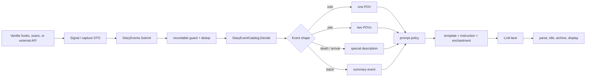

# Event-to-Prompt Map

This page explains the stable shape of the event-to-diary pipeline. The detailed implementation remains in code and XML; this page keeps the human model and the important policy tables together.

## End-to-end path

Event windows and observed conditions enter through the same `DiaryEvent` and generation path. A `HistoryEvent` observer may correlate context, but it does not emit a second diary event by itself.

## What can create a signal?

| Source family | Examples | Typical policy question |
|---|---|---|
| Social and interaction | play logs, romance, interaction outcomes | solo or paired POV? |
| Pawn state | thoughts, mood, health, mental state, inspirations, abilities | is the state important enough to record? |
| Progression and world | quests, raids, arrivals, death, tales, rituals | special event shape or batch? |
| DLC-aware content | growth, titles, permits, roles | can it enrich a prompt without requiring the DLC? |
| Time and observation | event windows, observed conditions, reflections | should a current condition become a diary moment? |
| External integrations | `PawnDiaryApi.SubmitEvent` and related calls | is the key claimed and is the request eligible? |

## Prompt resolution

| Stage | Input | Result |
|---|---|---|
| Classify | payload source, defName, interaction group | domain/classifier key |
| Find candidates | source key, group key, classifier, fallback | ordered XML prompt candidates |
| Resolve policy | Prompt Studio override, then XML Defs | instruction, enhancement, forced model |
| Select template | solo/pair, importance, combat, batch, reflection, death, arrival | one template key |
| Render | typed context + sanitized event facts | bounded prompt sent to the selected lane |

Common template keys:

| Shape | Keys |
|---|---|
| Pair | `PairDefault`, `PairImportant`, `PairCombat`, `PairBatched` |
| Solo | `SoloDefault`, `SoloImportant`, `SoloInternalState`, `SoloBatched` |
| Reflection | `SoloDayReflection`, `SoloQuadrumReflection`, `SoloArcReflection`, `SoloBeliefReflection` |
| Special | `DeathDescription`, `ArrivalDescription` |

### Color cues

A group's `colorCue` is a stable string saved on the entry; `DiaryUiStyleDef.xml` maps it to an accent
stripe, page tint and header rule. Each paid expansion owns one hue taken from its own icon, split
into three shades by emotional weight:

| DLC | hue | cues |
|---|---|---|
| Royalty | crown gold | `royaltyDeep` · `royalty` · `royaltyBright` |
| Ideology | flame coral | `ideologyDeep` · `ideology` · `ideologyBright` |
| Biotech | hexagon teal | `biotechDeep` · `biotech` · `biotechBright` |
| Anomaly | arrowhead olive | `anomalyDeep` · `anomaly` · `anomalyBright` |
| Odyssey | star violet | `odysseyDeep` · `odyssey` · `odysseyBright` |

`Deep` is dread/loss and is the only shade that draws its own header rule; `Bright` is triumph. Anomaly
dread therefore stays heavy through *value* while still reading as its expansion through *hue*.

**The cue string is persisted and load-bearing beyond color.** `DiaryMemoryTuningDef.xml` maps it to
memory importance and tags, and `DiaryTextDecorationDefs.xml` keys the dimmed-speech decoration off it.
Changing which cue a group stamps therefore changes what pawns remember — move those rows together.
`extremeDark` and `eventful` are retired: no group stamps them, but their rows stay forever so pages
saved before the DLC families still render and still dim correctly.

### Output-language directive

Every template — including `Title`, so a page and its title cannot disagree — ends its **system**
prompt with one localized line naming the active RimWorld language ("Write the diary entry in
Русский."). Without it a small model infers the output language from the prompt's own wording, which
is how a Russian install could receive English pages.

`DiaryPipelineAdapters.OutputLanguageDirective` resolves the line on the main thread (`.Translate()` is
not thread-safe) from `LanguageDatabase.activeLanguage.FriendlyNameNative`, and freezes it on
`DiaryPromptRequest.outputLanguageDirective`; the pure planner only appends it. No active language, no
resolvable language name, or `outputLanguageDirectiveEnabled=false` in `DiaryTuningDef.xml` leaves the
composed system prompt byte-identical to before.

## XML ownership

| File | Owns |
|---|---|
| `DiaryInteractionGroupDefs.xml` | event domains, matchers, labels, group instructions |
| `DiaryEventPromptDefs.xml` | source/classifier-specific prompt selection |
| `DiaryPromptTemplateDefs.xml` | prompt structure and template text |
| `DiaryPromptEnchantmentDefs.xml` | optional live context/enchantment candidates |
| `DiaryEventWindowDefs.xml` | timed conditions and windows |
| `DiaryObservedConditionDefs.xml` | observed state conditions |
| `DiaryHumorCueDefs.xml` | humor cues and weights |
| `DiaryTuningDef.xml` | caps, weights, thresholds, budget, retention tuning |
| `DiarySignalPolicyDefs.xml` | signal admission and suppression policy |

## Safe extension checklist

1. Capture a plain payload and submit it through `DiaryEvents.Submit`.
2. Prefer a new XML matcher or policy row before adding C# branching.
3. Keep DLC references string-based or guarded in `DlcContext`.
4. Add a pure test for classification, planning, parsing, or formatting when logic permits.
5. Update the relevant DefInjected/Keyed localization and the changelog.

## Related pages

- [Repository Map & Runtime Flow](../Core%20Architecture/Repository%20Map%20%26%20Runtime%20Flow.md)
- [AI Generation Engine](../AI%20Generation%20Engine/AI%20Generation%20Engine.md)
- [Configuration & Customization](../Configuration%20%26%20Customization/Configuration%20%26%20Customization.md)
