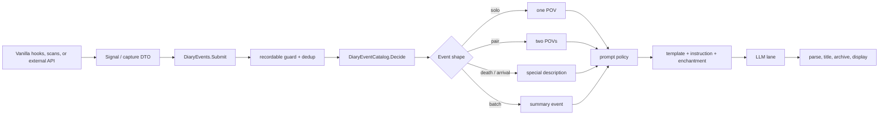

# Event-to-Prompt Map

This page explains the stable shape of the event-to-diary pipeline. The detailed implementation remains in code and XML; this page keeps the human model and the important policy tables together.

## End-to-end path

```mermaid
flowchart LR
    A["Vanilla hooks, scans, or external API"] --> B["Signal / capture DTO"]
    B --> C["DiaryEvents.Submit"]
    C --> D["recordable guard + dedup"]
    D --> E["DiaryEventCatalog.Decide"]
    E --> F{"Event shape"}
    F -->|"solo"| G["one POV"]
    F -->|"pair"| H["two POVs"]
    F -->|"death / arrival"| I["special description"]
    F -->|"batch"| J["summary event"]
    G --> K["prompt policy"]
    H --> K
    I --> K
    J --> K
    K --> L["template + instruction + enchantment"]
    L --> M["LLM lane"]
    M --> N["parse, title, archive, display"]
```

Event windows and observed conditions enter through the same `DiaryEvent` and generation path. A `HistoryEvent` observer may correlate context, but it does not emit a second diary event by itself.

## What can create a signal?

| Source family | Examples | Typical policy question |
|---|---|---|
| Social and interaction | play logs, romance, interaction outcomes | solo or paired POV? |
| Pawn state | thoughts, mood, health, mental state, inspirations, abilities | is the state important enough to record? |
| Progression and world | quests, raids, arrivals, death, tales, rituals | special event shape or batch? |
| DLC-aware content | growth, titles, permits, roles | can it enrich a prompt without requiring the DLC? |
| Time and observation | event windows, observed conditions, reflections | should a current condition become a diary moment? |
| External integrations | `PawnDiaryApi.SubmitEvent` and related calls | is the key claimed and is the request eligible? |

## Prompt resolution

| Stage | Input | Result |
|---|---|---|
| Classify | payload source, defName, interaction group | domain/classifier key |
| Find candidates | source key, group key, classifier, fallback | ordered XML prompt candidates |
| Resolve policy | Prompt Studio override, then XML Defs | instruction, enhancement, forced model |
| Select template | solo/pair, importance, combat, batch, reflection, death, arrival | one template key |
| Render | typed context + sanitized event facts | bounded prompt sent to the selected lane |

Common template keys:

| Shape | Keys |
|---|---|
| Pair | `PairDefault`, `PairImportant`, `PairCombat`, `PairBatched` |
| Solo | `SoloDefault`, `SoloImportant`, `SoloInternalState`, `SoloBatched` |
| Reflection | `SoloDayReflection`, `SoloQuadrumReflection`, `SoloArcReflection`, `SoloBeliefReflection` |
| Special | `DeathDescription`, `ArrivalDescription` |

### Color cues

A group's `colorCue` is a stable string saved on the entry; `DiaryUiStyleDef.xml` maps it to an accent
stripe, page tint and header rule. Each paid expansion owns one hue taken from its own icon, split
into three shades by emotional weight:

| DLC | hue | cues |
|---|---|---|
| Royalty | crown gold | `royaltyDeep` · `royalty` · `royaltyBright` |
| Ideology | flame coral | `ideologyDeep` · `ideology` · `ideologyBright` |
| Biotech | hexagon teal | `biotechDeep` · `biotech` · `biotechBright` |
| Anomaly | arrowhead olive | `anomalyDeep` · `anomaly` · `anomalyBright` |
| Odyssey | star violet | `odysseyDeep` · `odyssey` · `odysseyBright` |

`Deep` is dread/loss and is the only shade that draws its own header rule; `Bright` is triumph. Anomaly
dread therefore stays heavy through *value* while still reading as its expansion through *hue*.

**The cue string is persisted and load-bearing beyond color.** `DiaryMemoryTuningDef.xml` maps it to
memory importance and tags, and `DiaryTextDecorationDefs.xml` keys the dimmed-speech decoration off it.
Changing which cue a group stamps therefore changes what pawns remember — move those rows together.
`extremeDark` and `eventful` are retired: no group stamps them, but their rows stay forever so pages
saved before the DLC families still render and still dim correctly.

### Output-language directive

Every template — including `Title`, so a page and its title cannot disagree — ends its **system**
prompt with one localized line naming the active RimWorld language ("Write the diary entry in
Русский."). Without it a small model infers the output language from the prompt's own wording, which
is how a Russian install could receive English pages.

`DiaryPipelineAdapters.OutputLanguageDirective` resolves the line on the main thread (`.Translate()` is
not thread-safe) from `LanguageDatabase.activeLanguage.FriendlyNameNative`, and freezes it on
`DiaryPromptRequest.outputLanguageDirective`; the pure planner only appends it. No active language, no
resolvable language name, or `outputLanguageDirectiveEnabled=false` in `DiaryTuningDef.xml` leaves the
composed system prompt byte-identical to before.

### Per-POV frozen context

First-person events persist optional context in separate initiator and recipient slots so prompt
assembly never has to re-read live pawn state. The additive `IdentitySummary` and `MoodSnapshot`
fields follow that path from `DiaryEvent.PovSlot` through `DiaryPovPayload` and `PromptValues`;
neutral chronicle pages cannot receive them. Missing old-save keys normalize to empty, each saved
value has a defensive 600-character cap, and an empty field costs no prompt tokens. Their owning
capture policies decide whether and when to populate them.

Quality Wave A5 populates `IdentitySummary` only while creating a live pair event. For each POV it
excludes the current partner, reserves the strongest named direct relation among living free
colonists, then fills the XML-tuned two-row roster by absolute opinion strength. The saved
`relationships=` value contains localized names, relation labels and qualitative sentiment only;
numeric opinion never reaches the prompt. A historical birth with an older capture DTO stays empty
rather than mixing today's colony roster into a past event.

Quality Wave B2 populates `MoodSnapshot` only for exact internal-state (`mood_event`, `thought`,
`inspiration`, `work`, `hediff`) and batch context markers. Inclusion multiplies the XML master chance
by the pawn's authored mood-band chance, then compares one stable event/pawn/role hash roll, so the two
POVs sample independently without consuming gameplay randomness. Interaction and ambient batches
retain each POV's most emotionally extreme contributing event-time candidate (lower mood, then earlier
tick breaks ties); the final page never re-reads live mood at flush. The compact saved value is
`mood=<qualitative bucket>` plus at most one formatted top thought.

### Reflection evidence

Day and quadrum reflections can use the newest allowed RimWorld archive letter as low-weight colony
news. `DiaryContextReactionDefs.xml` classifies exact `LetterDef` names as `threat`, `quest`, or
`positive`, and maps each category to stable direct-event domains/context markers. A same-category
direct page for that pawn in hot or archived diary history suppresses the letter, while unrelated
categories remain eligible. The scan is bounded, shared across map and caravan colonists, and clipped
to the pawn's first arrival page so nobody remembers colony news from before joining.

Quadrum reflections can also add one `memory` cue from the same quadrum one year earlier. The
collector reads both hot events and compact archive rows, keeps only important non-reflection pages
for that pawn, deduplicates their stable event identities, and wraps the maximum-weight remaining
line in the localized “a year ago, same season” frame. The XML tuning switch defaults on; the callback
is impossible during the first four absolute quadrums and its final weight is half a major event.

### Daily pacing and digest lines

Quality Wave B6 paces low-salience pages — those whose classified group is neither `important` nor
`combat`, which in practice means the interaction catch-all plus the ordinary thought and work groups.
`DiaryGameComponent.Dispatch` consults `lowSalienceDailySoftCap` immediately before `Emit`, after the
catalog decision and dedup marking, so pacing changes only whether a page is written, never whether an
event was captured. Batched and ambient routes are untouched because they never produced a page.

A page folds away only when every diarist it belongs to is already at cap, so a shared pair page is
never half-visible: while either POV has room the page emits for both and both counts advance. Counts
advance only after a successful emit. A folded page instead deposits one cleaned POV-specific line in
each writer's buffer, which keeps the `dayDigestMaxLines` newest unique rows per pawn/day.

Those lines return as `digest` day-reflection candidates at weight `daySummaryWeightDigest`. They are
always non-important regardless of `daySummaryImportantSignalKinds`, so a day of nothing but folded
moments still writes no reflection. Highlight selection now runs important-first: the evidence that
earned the reflection claims slots before any news, filler, or digest candidate can. The reflection's
flush/settle/baseline paths release the buffered lines alongside filler and hediff evidence.

The pacing rows are saved (`dayDigestStates`, additive; old saves load empty) because a mid-day reload
must not hand out a fresh allowance. Rows for earlier days are discarded at the day rollover, which is
also what resets the allowance. Pure decisions — cap arithmetic, buffer dedup/eviction, and the
important-first slot split — live in `Source/Pipeline/DigestPacingPolicy.cs`.

## XML ownership

| File | Owns |
|---|---|
| `DiaryInteractionGroupDefs.xml` | event domains, matchers, labels, group instructions |
| `DiaryEventPromptDefs.xml` | source/classifier-specific prompt selection |
| `DiaryPromptTemplateDefs.xml` | prompt structure and template text |
| `DiaryPromptEnchantmentDefs.xml` | optional live context/enchantment candidates |
| `DiaryEventWindowDefs.xml` | timed conditions and windows |
| `DiaryObservedConditionDefs.xml` | observed state conditions |
| `DiaryHumorCueDefs.xml` | humor cues and weights |
| `DiaryTuningDef.xml` | caps, weights, thresholds, budget, retention tuning |
| `DiarySignalPolicyDefs.xml` | signal admission and suppression policy |

## Safe extension checklist

1. Capture a plain payload and submit it through `DiaryEvents.Submit`.
2. Prefer a new XML matcher or policy row before adding C# branching.
3. Keep DLC references string-based or guarded in `DlcContext`.
4. Add a pure test for classification, planning, parsing, or formatting when logic permits.
5. Update the relevant DefInjected/Keyed localization and the changelog.

## Related pages

- [Repository Map & Runtime Flow](../Core%20Architecture/Repository%20Map%20%26%20Runtime%20Flow.md)
- [AI Generation Engine](../AI%20Generation%20Engine/AI%20Generation%20Engine.md)
- [Configuration & Customization](../Configuration%20%26%20Customization/Configuration%20%26%20Customization.md)
