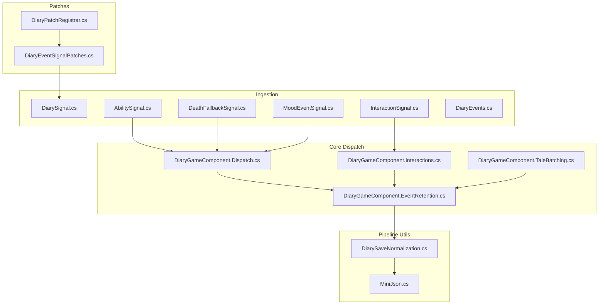
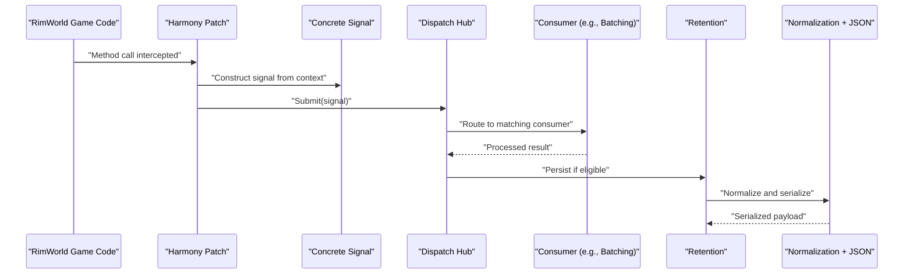
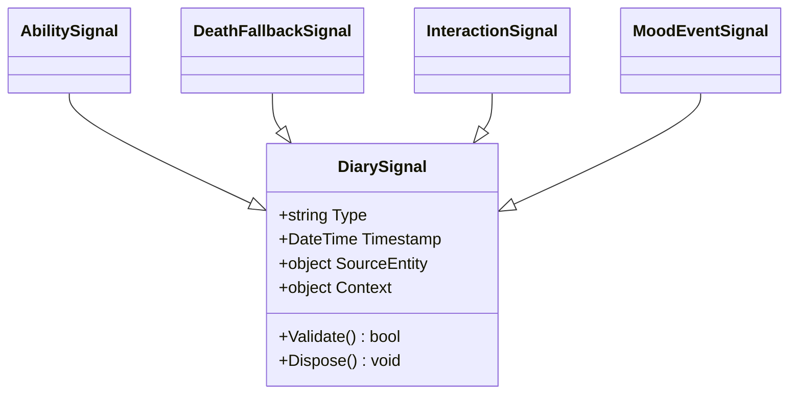
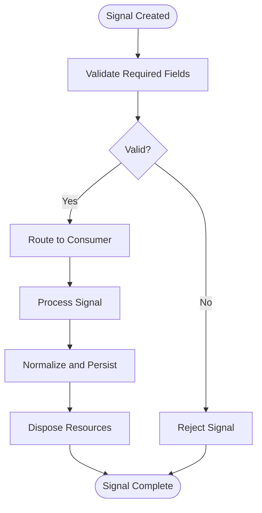

# Signal Processing Pipeline

<cite>
**Referenced Files in This Document**
- [DiarySignal.cs](../../../../Source/Ingestion/DiarySignal.cs)
- [AbilitySignal.cs](../../../../Source/Ingestion/Sources/AbilitySignal.cs)
- [DeathFallbackSignal.cs](../../../../Source/Ingestion/Sources/DeathFallbackSignal.cs)
- [InteractionSignal.cs](../../../../Source/Ingestion/Sources/InteractionSignal.cs)
- [MoodEventSignal.cs](../../../../Source/Ingestion/Sources/MoodEventSignal.cs)
- [DiaryEvents.cs](../../../../Source/Ingestion/DiaryEvents.cs)
- [DiaryGameComponent.Dispatch.cs](../../../../Source/Core/DiaryGameComponent.Dispatch.cs)
- [DiaryPatchRegistrar.cs](../../../../Source/Patches/DiaryPatchRegistrar.cs)
- [DiaryEventSignalPatches.cs](../../../../Source/Patches/DiaryEventSignalPatches.cs)
- [DiaryGameComponent.Interactions.cs](../../../../Source/Core/DiaryGameComponent.Interactions.cs)
- [DiaryGameComponent.TaleBatching.cs](../../../../Source/Core/DiaryGameComponent.TaleBatching.cs)
- [DiaryGameComponent.EventRetention.cs](../../../../Source/Core/DiaryGameComponent.EventRetention.cs)
- [DiarySaveNormalization.cs](../../../../Source/Pipeline/DiarySaveNormalization.cs)
- [MiniJson.cs](../../../../Source/Util/MiniJson.cs)
</cite>

## Table of Contents
1. [Introduction](#introduction)
2. [Project Structure](#project-structure)
3. [Core Components](#core-components)
4. [Architecture Overview](#architecture-overview)
5. [Detailed Component Analysis](#detailed-component-analysis)
6. [Dependency Analysis](#dependency-analysis)
7. [Performance Considerations](#performance-considerations)
8. [Troubleshooting Guide](#troubleshooting-guide)
9. [Conclusion](#conclusion)
10. [Appendices](#appendices)

## Introduction
This document explains the signal processing pipeline that intercepts game events, converts them into structured signals, and routes them through a dispatch system for downstream processing. It focuses on:
- How Harmony patches capture events and produce DiarySignal instances
- The base signal architecture and shared properties
- Implementation details for specific signal types (AbilitySignal, DeathSignal via DeathFallbackSignal, InteractionSignal, MoodEventSignal)
- Creating custom signals and handling lifecycle
- Serialization/deserialization considerations
- Performance strategies for high-frequency events

## Project Structure
The signal pipeline spans several areas:
- Ingestion layer: defines the base signal type and concrete signal classes
- Patch layer: uses Harmony to intercept game methods and emit signals
- Core dispatch: receives signals, batches, filters, and persists them
- Pipeline utilities: normalization and JSON helpers for serialization

**Diagram sources**
- [DiaryEventSignalPatches.cs](../../../../Source/Patches/DiaryEventSignalPatches.cs)
- [DiaryPatchRegistrar.cs](../../../../Source/Patches/DiaryPatchRegistrar.cs)
- [DiarySignal.cs](../../../../Source/Ingestion/DiarySignal.cs)
- [AbilitySignal.cs](../../../../Source/Ingestion/Sources/AbilitySignal.cs)
- [DeathFallbackSignal.cs](../../../../Source/Ingestion/Sources/DeathFallbackSignal.cs)
- [InteractionSignal.cs](../../../../Source/Ingestion/Sources/InteractionSignal.cs)
- [MoodEventSignal.cs](../../../../Source/Ingestion/Sources/MoodEventSignal.cs)
- [DiaryEvents.cs](../../../../Source/Ingestion/DiaryEvents.cs)
- [DiaryGameComponent.Dispatch.cs](../../../../Source/Core/DiaryGameComponent.Dispatch.cs)
- [DiaryGameComponent.Interactions.cs](../../../../Source/Core/DiaryGameComponent.Interactions.cs)
- [DiaryGameComponent.TaleBatching.cs](../../../../Source/Core/DiaryGameComponent.TaleBatching.cs)
- [DiaryGameComponent.EventRetention.cs](../../../../Source/Core/DiaryGameComponent.EventRetention.cs)
- [DiarySaveNormalization.cs](../../../../Source/Pipeline/DiarySaveNormalization.cs)
- [MiniJson.cs](../../../../Source/Util/MiniJson.cs)

**Section sources**
- [DiarySignal.cs](../../../../Source/Ingestion/DiarySignal.cs)
- [DiaryEventSignalPatches.cs](../../../../Source/Patches/DiaryEventSignalPatches.cs)
- [DiaryPatchRegistrar.cs](../../../../Source/Patches/DiaryPatchRegistrar.cs)
- [DiaryGameComponent.Dispatch.cs](../../../../Source/Core/DiaryGameComponent.Dispatch.cs)
- [DiaryGameComponent.Interactions.cs](../../../../Source/Core/DiaryGameComponent.Interactions.cs)
- [DiaryGameComponent.TaleBatching.cs](../../../../Source/Core/DiaryGameComponent.TaleBatching.cs)
- [DiaryGameComponent.EventRetention.cs](../../../../Source/Core/DiaryGameComponent.EventRetention.cs)
- [DiarySaveNormalization.cs](../../../../Source/Pipeline/DiarySaveNormalization.cs)
- [MiniJson.cs](../../../../Source/Util/MiniJson.cs)

## Core Components
- Base signal type: Defines common metadata and lifecycle hooks used by all signals.
- Concrete signals: Specialized types for ability usage, death fallback, interactions, and mood events.
- Event registry: Central mapping between event identifiers and their handlers.
- Dispatcher: Receives signals, applies policies, and forwards to retention or batching.
- Persistence and normalization: Ensures signals are serializable and normalized before saving.

Key responsibilities:
- Capture: Convert raw game events into strongly typed signals
- Route: Deliver signals to appropriate consumers
- Persist: Store normalized signals with consistent schemas
- Serialize: Provide JSON representation for save/load and external APIs

**Section sources**
- [DiarySignal.cs](../../../../Source/Ingestion/DiarySignal.cs)
- [DiaryEvents.cs](../../../../Source/Ingestion/DiaryEvents.cs)
- [DiaryGameComponent.Dispatch.cs](../../../../Source/Core/DiaryGameComponent.Dispatch.cs)
- [DiarySaveNormalization.cs](../../../../Source/Pipeline/DiarySaveNormalization.cs)

## Architecture Overview
The pipeline follows an event-driven pattern:
- Patches intercept game code and construct signals
- Signals are dispatched through a central hub
- Consumers process signals (e.g., interaction batching, tale generation)
- Retention policy stores normalized signals
- Normalization ensures stable schema for serialization

**Diagram sources**
- [DiaryEventSignalPatches.cs](../../../../Source/Patches/DiaryEventSignalPatches.cs)
- [DiarySignal.cs](../../../../Source/Ingestion/DiarySignal.cs)
- [DiaryGameComponent.Dispatch.cs](../../../../Source/Core/DiaryGameComponent.Dispatch.cs)
- [DiaryGameComponent.Interactions.cs](../../../../Source/Core/DiaryGameComponent.Interactions.cs)
- [DiaryGameComponent.TaleBatching.cs](../../../../Source/Core/DiaryGameComponent.TaleBatching.cs)
- [DiaryGameComponent.EventRetention.cs](../../../../Source/Core/DiaryGameComponent.EventRetention.cs)
- [DiarySaveNormalization.cs](../../../../Source/Pipeline/DiarySaveNormalization.cs)
- [MiniJson.cs](../../../../Source/Util/MiniJson.cs)

## Detailed Component Analysis

### Base Signal Architecture
The base signal type provides:
- Common identification fields (type, timestamp, source entity references)
- Lifecycle hooks for creation, validation, and disposal
- Shared metadata for routing and filtering
- Contract for serialization across the pipeline

Design patterns:
- Polymorphism: All signals inherit from the base type
- Contracts: Well-defined interfaces for consumers
- Extensibility: New signal types can be added without changing core logic

**Diagram sources**
- [DiarySignal.cs](../../../../Source/Ingestion/DiarySignal.cs)
- [AbilitySignal.cs](../../../../Source/Ingestion/Sources/AbilitySignal.cs)
- [DeathFallbackSignal.cs](../../../../Source/Ingestion/Sources/DeathFallbackSignal.cs)
- [InteractionSignal.cs](../../../../Source/Ingestion/Sources/InteractionSignal.cs)
- [MoodEventSignal.cs](../../../../Source/Ingestion/Sources/MoodEventSignal.cs)

**Section sources**
- [DiarySignal.cs](../../../../Source/Ingestion/DiarySignal.cs)

### AbilitySignal
Purpose:
- Captures ability activation events
- Stores target, caster, and ability-specific context

Implementation highlights:
- Inherits base signal properties
- Adds ability identifier and effect parameters
- Validates required context before submission

Lifecycle:
- Constructed during patch interception
- Validated by dispatcher
- Consumed by narrative or memory systems

**Section sources**
- [AbilitySignal.cs](../../../../Source/Ingestion/Sources/AbilitySignal.cs)
- [DiarySignal.cs](../../../../Source/Ingestion/DiarySignal.cs)

### DeathSignal (via DeathFallbackSignal)
Purpose:
- Represents pawn death events when primary capture fails
- Provides fallback data to ensure completeness

Implementation highlights:
- Uses minimal context to reconstruct death scenario
- Includes cause, location, and related entities
- Integrates with retention to mark entries as final

Lifecycle:
- Triggered when standard death path is unavailable
- Routes through dispatcher like other signals
- Persists with special flags for archival

**Section sources**
- [DeathFallbackSignal.cs](../../../../Source/Ingestion/Sources/DeathFallbackSignal.cs)
- [DiarySignal.cs](../../../../Source/Ingestion/DiarySignal.cs)

### InteractionSignal
Purpose:
- Records social and mechanical interactions between pawns
- Supports batching for high-frequency scenarios

Implementation highlights:
- Contains initiator, recipient, and interaction type
- Groups similar interactions for efficiency
- Applies deduplication policies

Lifecycle:
- Intercepted via dedicated patches
- Batched by interaction coordinator
- Persisted after aggregation

**Section sources**
- [InteractionSignal.cs](../../../../Source/Ingestion/Sources/InteractionSignal.cs)
- [DiaryGameComponent.Interactions.cs](../../../../Source/Core/DiaryGameComponent.Interactions.cs)
- [DiarySignal.cs](../../../../Source/Ingestion/DiarySignal.cs)

### MoodEventSignal
Purpose:
- Tracks emotional state changes and triggers
- Captures mood impact factors and thresholds

Implementation highlights:
- Stores current mood level and change delta
- Includes influencing factors (thoughts, events)
- Feeds into narrative context builders

Lifecycle:
- Emitted on mood updates
- Processed by mood analysis components
- Stored with contextual metadata

**Section sources**
- [MoodEventSignal.cs](../../../../Source/Ingestion/Sources/MoodEventSignal.cs)
- [DiarySignal.cs](../../../../Source/Ingestion/DiarySignal.cs)

### Custom Signal Creation
To create a new signal type:
1. Define a new class inheriting from the base signal
2. Add domain-specific properties
3. Implement validation logic
4. Register patch points to emit the signal
5. Update event registry if needed
6. Handle serialization requirements

Best practices:
- Keep payloads lightweight
- Use reference IDs instead of object references
- Validate all inputs before construction
- Consider performance implications for frequent events

**Section sources**
- [DiarySignal.cs](../../../../Source/Ingestion/DiarySignal.cs)
- [DiaryEvents.cs](../../../../Source/Ingestion/DiaryEvents.cs)

### Signal Lifecycle Management
Signals follow a consistent lifecycle:
- Creation: Patches construct signals from game state
- Validation: Dispatcher validates required fields
- Routing: Signals are forwarded to appropriate consumers
- Processing: Consumers may transform or aggregate signals
- Persistence: Valid signals are normalized and stored
- Disposal: Resources are cleaned up after processing

**Diagram sources**
- [DiaryGameComponent.Dispatch.cs](../../../../Source/Core/DiaryGameComponent.Dispatch.cs)
- [DiarySaveNormalization.cs](../../../../Source/Pipeline/DiarySaveNormalization.cs)

## Dependency Analysis
The signal system has clear separation of concerns:
- Patches depend only on signal definitions
- Dispatch depends on signal contracts, not implementations
- Consumers depend on specific signal types
- Persistence depends on normalization utilities

**Diagram sources**
- [DiaryEventSignalPatches.cs](../../../../Source/Patches/DiaryEventSignalPatches.cs)
- [DiarySignal.cs](../../../../Source/Ingestion/DiarySignal.cs)
- [DiaryGameComponent.Dispatch.cs](../../../../Source/Core/DiaryGameComponent.Dispatch.cs)
- [DiarySaveNormalization.cs](../../../../Source/Pipeline/DiarySaveNormalization.cs)
- [MiniJson.cs](../../../../Source/Util/MiniJson.cs)

**Section sources**
- [DiaryEventSignalPatches.cs](../../../../Source/Patches/DiaryEventSignalPatches.cs)
- [DiarySignal.cs](../../../../Source/Ingestion/DiarySignal.cs)
- [DiaryGameComponent.Dispatch.cs](../../../../Source/Core/DiaryGameComponent.Dispatch.cs)
- [DiarySaveNormalization.cs](../../../../Source/Pipeline/DiarySaveNormalization.cs)
- [MiniJson.cs](../../../../Source/Util/MiniJson.cs)

## Performance Considerations
For high-frequency events:
- Use batching for interaction signals to reduce persistence overhead
- Implement deduplication to avoid redundant processing
- Keep signal payloads minimal and use reference IDs
- Apply lazy loading for heavy context data
- Consider async processing for non-critical operations
- Monitor memory allocation patterns and reuse objects where possible

Optimization strategies:
- Pool frequently created signal instances
- Use efficient serialization formats for large datasets
- Implement circuit breakers for failing consumers
- Cache computed values in signal context

**Section sources**
- [DiaryGameComponent.Interactions.cs](../../../../Source/Core/DiaryGameComponent.Interactions.cs)
- [DiaryGameComponent.TaleBatching.cs](../../../../Source/Core/DiaryGameComponent.TaleBatching.cs)
- [DiaryGameComponent.EventRetention.cs](../../../../Source/Core/DiaryGameComponent.EventRetention.cs)

## Troubleshooting Guide
Common issues and solutions:
- Missing required fields: Ensure all validation passes before signal submission
- Circular dependencies: Break cycles using reference IDs instead of direct object references
- Memory leaks: Verify proper disposal of signal resources
- Serialization errors: Check that all properties are serializable
- Performance bottlenecks: Profile high-frequency signal paths and implement batching

Debugging techniques:
- Enable detailed logging for signal lifecycle
- Use test fixtures to validate signal behavior
- Monitor signal queue depths and processing times
- Inspect normalized output for consistency

**Section sources**
- [DiaryGameComponent.Dispatch.cs](../../../../Source/Core/DiaryGameComponent.Dispatch.cs)
- [DiarySaveNormalization.cs](../../../../Source/Pipeline/DiarySaveNormalization.cs)

## Conclusion
The signal processing pipeline provides a robust foundation for capturing and processing game events. By following established patterns for signal creation, validation, and persistence, developers can extend the system with new signal types while maintaining performance and reliability. The modular architecture allows for easy testing and debugging, while the serialization support ensures compatibility across different platforms and versions.

## Appendices

### Serialization Reference
Signal serialization relies on:
- Consistent property naming conventions
- Support for nullable reference types
- Version tolerance for schema evolution
- Efficient JSON encoding for large datasets

**Section sources**
- [DiarySaveNormalization.cs](../../../../Source/Pipeline/DiarySaveNormalization.cs)
- [MiniJson.cs](../../../../Source/Util/MiniJson.cs)
