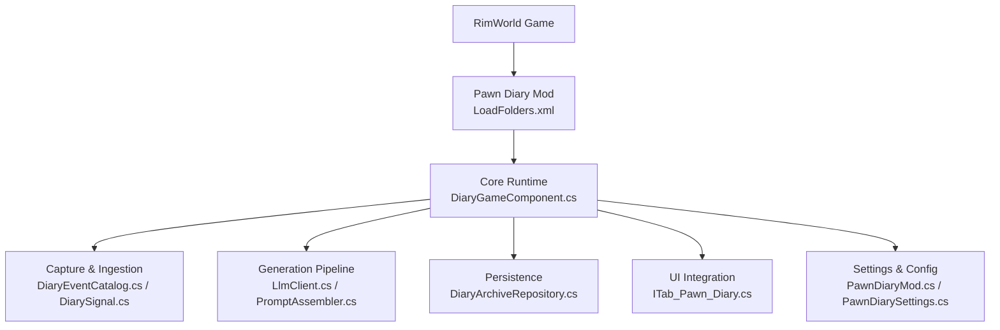
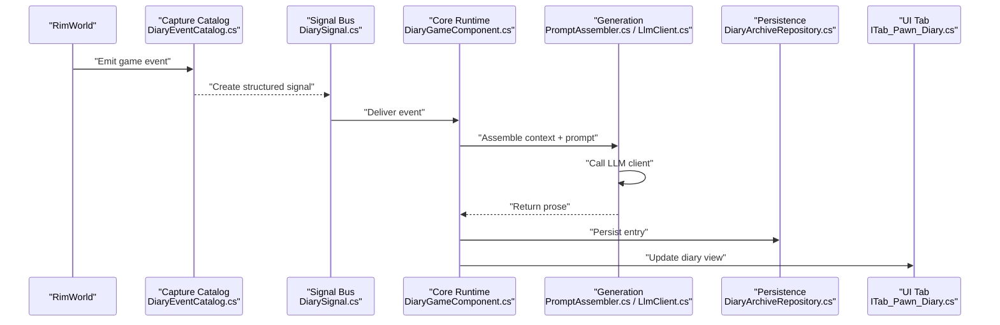
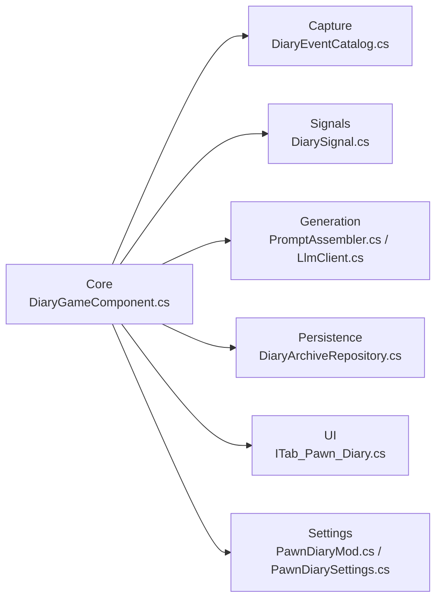
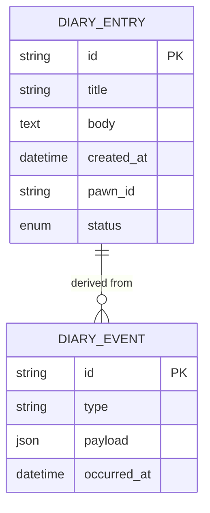

# Getting Started

- [About.xml](../../../About/About.xml)
- [LoadFolders.xml](../../../LoadFolders.xml)
- [README.md](../../../README.md)
- [DOCUMENTATION.md](../../../DOCUMENTATION.md)
- [EXTERNAL_API.md](../../../EXTERNAL_API.md)
- [PawnDiaryMod.cs](../../../Source/Settings/PawnDiaryMod.cs)
- [PawnDiarySettings.cs](../../../Source/Settings/PawnDiarySettings.cs)
- [ITab_Pawn_Diary.cs](../../../Source/UI/ITab_Pawn_Diary.cs)
- [DiaryGameComponent.cs](../../../Source/Core/DiaryGameComponent.cs)
- [LlmClient.cs](../../../Source/Generation/LlmClient.cs)
- [PromptAssembler.cs](../../../Source/Generation/PromptAssembler.cs)
- [DiaryEventCatalog.cs](../../../Source/Capture/Catalog/DiaryEventCatalog.cs)
- [DiarySignal.cs](../../../Source/Ingestion/DiarySignal.cs)
- [DiaryEntry.cs](../../../Source/Models/DiaryEntry.cs)
- [DiaryArchiveRepository.cs](../../../Source/Core/DiaryArchiveRepository.cs)
- [DiaryErrorReporter.cs](../../../Source/Diagnostics/DiaryErrorReporter.cs)
## Table of Contents
1. Introduction
2. Project Structure
3. Core Components
4. Architecture Overview
5. Detailed Component Analysis
6. Dependency Analysis
7. Performance Considerations
8. Troubleshooting Guide
9. Conclusion

## Introduction
Pawn Diary is an AI-powered diary system for RimWorld that transforms the game’s standard diary entries into personalized, contextually rich narratives using language models. It captures meaningful events from gameplay, builds contextual prompts, and generates narrative-style entries that reflect a pawn’s experiences, relationships, and growth over time. The mod integrates with RimWorld’s UI to present enhanced diary entries and provides configuration options to tailor behavior, tone, and integration points.

This guide helps you install Pawn Diary, configure it for your first session, understand the enhanced diary interface, and customize basic behavior. It also includes troubleshooting tips for common setup issues and foundational concepts for advanced usage.

## Project Structure
At a high level, the repository contains:
- About and load folder metadata for RimWorld compatibility
- Source code organized by feature areas (Core, Capture, Generation, Settings, UI, etc.)
- Defs and Language resources for content and localization
- Integrations and tests for extended functionality

**Diagram sources**
- [LoadFolders.xml](../../../LoadFolders.xml)
- [DiaryGameComponent.cs](../../../Source/Core/DiaryGameComponent.cs)
- [DiaryEventCatalog.cs](../../../Source/Capture/Catalog/DiaryEventCatalog.cs)
- [DiarySignal.cs](../../../Source/Ingestion/DiarySignal.cs)
- [LlmClient.cs](../../../Source/Generation/LlmClient.cs)
- [PromptAssembler.cs](../../../Source/Generation/PromptAssembler.cs)
- [DiaryArchiveRepository.cs](../../../Source/Core/DiaryArchiveRepository.cs)
- [ITab_Pawn_Diary.cs](../../../Source/UI/ITab_Pawn_Diary.cs)
- [PawnDiaryMod.cs](../../../Source/Settings/PawnDiaryMod.cs)
- [PawnDiarySettings.cs](../../../Source/Settings/PawnDiarySettings.cs)

**Section sources**
- [LoadFolders.xml](../../../LoadFolders.xml)
- [About.xml](../../../About/About.xml)

## Core Components
- Core runtime orchestrates event capture, generation, persistence, and UI updates.
- Capture subsystem collects relevant in-game events and structures them as signals.
- Generation pipeline composes prompts and calls external language model clients.
- Persistence stores generated entries and archives older data.
- UI exposes the enhanced diary tab and entry cards.
- Settings provide configuration controls for API endpoints, tuning, and behaviors.

Key responsibilities:
- Event ingestion and classification
- Context assembly and prompt construction
- LLM request/response handling
- Entry rendering and archival
- User-facing settings and diagnostics

**Section sources**
- [DiaryGameComponent.cs](../../../Source/Core/DiaryGameComponent.cs)
- [DiaryEventCatalog.cs](../../../Source/Capture/Catalog/DiaryEventCatalog.cs)
- [DiarySignal.cs](../../../Source/Ingestion/DiarySignal.cs)
- [LlmClient.cs](../../../Source/Generation/LlmClient.cs)
- [PromptAssembler.cs](../../../Source/Generation/PromptAssembler.cs)
- [DiaryArchiveRepository.cs](../../../Source/Core/DiaryArchiveRepository.cs)
- [ITab_Pawn_Diary.cs](../../../Source/UI/ITab_Pawn_Diary.cs)
- [PawnDiaryMod.cs](../../../Source/Settings/PawnDiaryMod.cs)
- [PawnDiarySettings.cs](../../../Source/Settings/PawnDiarySettings.cs)

## Architecture Overview
The end-to-end flow begins when RimWorld triggers an event. Pawn Diary captures it, enriches context, builds a prompt, sends it to a configured language model service, parses the response, persists the result, and renders it in the diary UI.

**Diagram sources**
- [DiaryEventCatalog.cs](../../../Source/Capture/Catalog/DiaryEventCatalog.cs)
- [DiarySignal.cs](../../../Source/Ingestion/DiarySignal.cs)
- [DiaryGameComponent.cs](../../../Source/Core/DiaryGameComponent.cs)
- [PromptAssembler.cs](../../../Source/Generation/PromptAssembler.cs)
- [LlmClient.cs](../../../Source/Generation/LlmClient.cs)
- [DiaryArchiveRepository.cs](../../../Source/Core/DiaryArchiveRepository.cs)
- [ITab_Pawn_Diary.cs](../../../Source/UI/ITab_Pawn_Diary.cs)

## Detailed Component Analysis

### Installation and First Launch
- Ensure RimWorld version compatibility and required dependencies are met.
- Install the mod via your preferred method (Workshop or manual).
- Verify the mod appears in the mod list and loads without errors.
- Start a new or existing save; the diary tab should be available.

What to check:
- Load folders include the correct versioned directory.
- No conflicting mods override diary tabs or core hooks.
- Initial launch completes without fatal exceptions.

**Section sources**
- [About.xml](../../../About/About.xml)
- [LoadFolders.xml](../../../LoadFolders.xml)

### Configuration Requirements
Before generating entries, configure your language model endpoint and authentication if required. Typical steps:
- Open the mod settings window from the main menu or in-game.
- Set the API endpoint URL and any required headers or tokens.
- Choose a writing style or persona preset if desired.
- Save settings and restart if prompted.

Where to look:
- Settings window and widgets
- API connection controller and auth helpers
- Tuning overrides and presets

**Section sources**
- [PawnDiaryMod.cs](../../../Source/Settings/PawnDiaryMod.cs)
- [PawnDiarySettings.cs](../../../Source/Settings/PawnDiarySettings.cs)
- [ApiConnectionController.cs](../../../Source/Settings/ApiConnectionController.cs)
- [ApiRequestAuth.cs](../../../Source/Settings/ApiRequestAuth.cs)

### Basic Usage Examples
- View the enhanced diary tab for a selected pawn to see AI-generated entries.
- Trigger events (e.g., interactions, raids, milestones) to generate new entries.
- Adjust settings like humor cues, memory retention, or prompt templates to refine output.
- Use the prompt preview or test suite features to validate configurations before play.

Relevant areas:
- Diary tab rendering and entry cards
- Prompt assembler and variants
- Memory tuning and retention policies

**Section sources**
- [ITab_Pawn_Diary.cs](../../../Source/UI/ITab_Pawn_Diary.cs)
- [PromptAssembler.cs](../../../Source/Generation/PromptAssembler.cs)
- [DiaryMemoryTuningDef.cs](../../../Source/Defs/DiaryMemoryTuningDef.cs)
- [DiaryRetentionPlan.cs](../../../Source/Pipeline/DiaryRetentionPlan.cs)

### Understanding the Enhanced Diary Interface
The diary tab presents:
- Chronological entries with titles and excerpts
- Rich text decorations and name highlights
- Filters and year-based paging for large histories
- Quick actions to regenerate or preview prompts (where enabled)

Navigation tips:
- Use filters to focus on specific event types or pawns.
- Expand entries to read full narrative text.
- Toggle decorations to control visual emphasis.

**Section sources**
- [ITab_Pawn_Diary.cs](../../../Source/UI/ITab_Pawn_Diary.cs)
- [DiaryTextDecorations.cs](../../../Source/Pipeline/DiaryTextDecorations.cs)
- [DiaryParagraphReflow.cs](../../../Source/Pipeline/DiaryParagraphReflow.cs)

### Customizing Behavior
You can influence how entries are generated and presented:
- Writing style and persona presets
- Humor cues and reflection frequency
- Memory recall and eviction policies
- Event windows and observed conditions

These are typically adjusted through the settings UI or tuning defs.

**Section sources**
- [PawnDiarySettings.cs](../../../Source/Settings/PawnDiarySettings.cs)
- [WritingStyleResolutionPolicy.cs](../../../Source/Pipeline/WritingStyleResolutionPolicy.cs)
- [HumorChancePolicy.cs](../../../Source/Pipeline/HumorChancePolicy.cs)
- [MemoryEvictionPlanner.cs](../../../Source/Pipeline/Memory/MemoryEvictionPlanner.cs)

## Dependency Analysis
High-level dependencies:
- Core depends on Capture, Generation, Persistence, UI, and Settings.
- Generation depends on LLM client and prompt assembly utilities.
- UI depends on Core for data and formatting services.
- Settings depend on API controllers and tuning stores.

**Diagram sources**
- [DiaryGameComponent.cs](../../../Source/Core/DiaryGameComponent.cs)
- [DiaryEventCatalog.cs](../../../Source/Capture/Catalog/DiaryEventCatalog.cs)
- [DiarySignal.cs](../../../Source/Ingestion/DiarySignal.cs)
- [PromptAssembler.cs](../../../Source/Generation/PromptAssembler.cs)
- [LlmClient.cs](../../../Source/Generation/LlmClient.cs)
- [DiaryArchiveRepository.cs](../../../Source/Core/DiaryArchiveRepository.cs)
- [ITab_Pawn_Diary.cs](../../../Source/UI/ITab_Pawn_Diary.cs)
- [PawnDiaryMod.cs](../../../Source/Settings/PawnDiaryMod.cs)
- [PawnDiarySettings.cs](../../../Source/Settings/PawnDiarySettings.cs)

**Section sources**
- [DiaryGameComponent.cs](../../../Source/Core/DiaryGameComponent.cs)
- [DiaryEventCatalog.cs](../../../Source/Capture/Catalog/DiaryEventCatalog.cs)
- [DiarySignal.cs](../../../Source/Ingestion/DiarySignal.cs)
- [PromptAssembler.cs](../../../Source/Generation/PromptAssembler.cs)
- [LlmClient.cs](../../../Source/Generation/LlmClient.cs)
- [DiaryArchiveRepository.cs](../../../Source/Core/DiaryArchiveRepository.cs)
- [ITab_Pawn_Diary.cs](../../../Source/UI/ITab_Pawn_Diary.cs)
- [PawnDiaryMod.cs](../../../Source/Settings/PawnDiaryMod.cs)
- [PawnDiarySettings.cs](../../../Source/Settings/PawnDiarySettings.cs)

## Performance Considerations
- Limit event capture scope to reduce prompt size and latency.
- Tune memory retention to balance richness and performance.
- Use batching where supported to avoid excessive LLM calls.
- Monitor API quotas and rate limits; adjust generation frequency accordingly.
- Prefer concise contexts and targeted prompts for faster responses.

[No sources needed since this section provides general guidance]

## Troubleshooting Guide
Common issues and resolutions:
- Mod fails to load: verify version compatibility and load order; ensure no conflicts with other diary-related mods.
- No entries appear: confirm event capture is active and that at least one triggerable event has occurred.
- API errors: check endpoint URL, authentication headers, and network connectivity; review error reports.
- Slow generation: reduce context size, lower humor/reflection frequency, or adjust memory policies.
- Corrupted saves: use built-in normalization and archive compaction tools; back up saves regularly.

Useful diagnostics:
- Error reporter and log patches
- Health summary and status snapshots
- Prompt preview and test suites

**Section sources**
- [DiaryErrorReporter.cs](../../../Source/Diagnostics/DiaryErrorReporter.cs)
- [DiaryLogReportPatch.cs](../../../Source/Diagnostics/DiaryLogReportPatch.cs)
- [DiarySaveNormalization.cs](../../../Source/Pipeline/DiarySaveNormalization.cs)
- [DiaryArchiveEligibility.cs](../../../Source/Pipeline/DiaryArchiveEligibility.cs)

## Conclusion
You now have the essentials to install, configure, and use Pawn Diary effectively. Start with default settings, observe how events become narrative entries, and gradually tune behavior to match your playstyle. For deeper customization, explore the settings, tuning definitions, and integration points documented in the repository.

[No sources needed since this section summarizes without analyzing specific files]

## Appendices

### Data Model Snapshot
A simplified view of key entities involved in entry creation and storage:

**Diagram sources**
- [DiaryEntry.cs](../../../Source/Models/DiaryEntry.cs)
- [DiaryEvent.cs](../../../Source/Models/DiaryEvent.cs)

### External API Notes
If integrating with external systems, consult the external API documentation for endpoints, request formats, and response schemas.

**Section sources**
- [EXTERNAL_API.md](../../../EXTERNAL_API.md)

### Additional Documentation
For comprehensive reference material, including architecture details and advanced topics, see the project documentation.

**Section sources**
- [DOCUMENTATION.md](../../../DOCUMENTATION.md)
- [README.md](../../../README.md)
