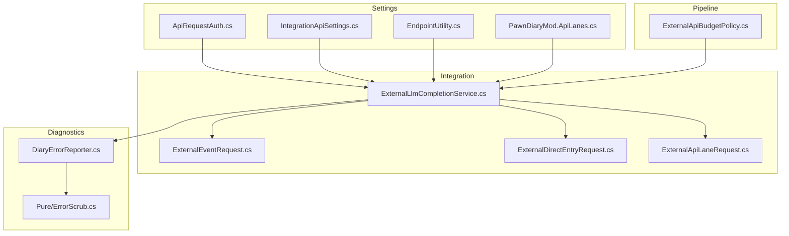
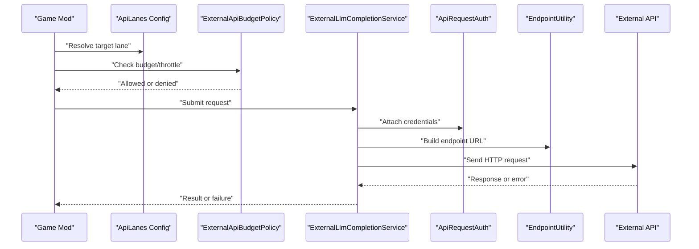
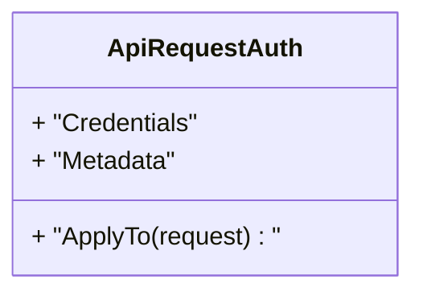
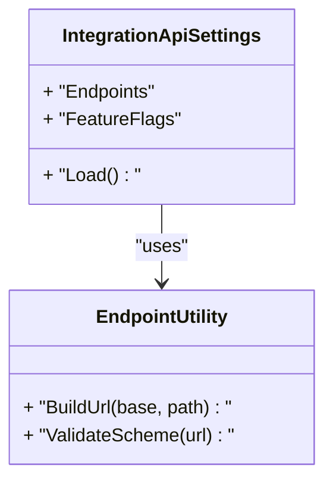
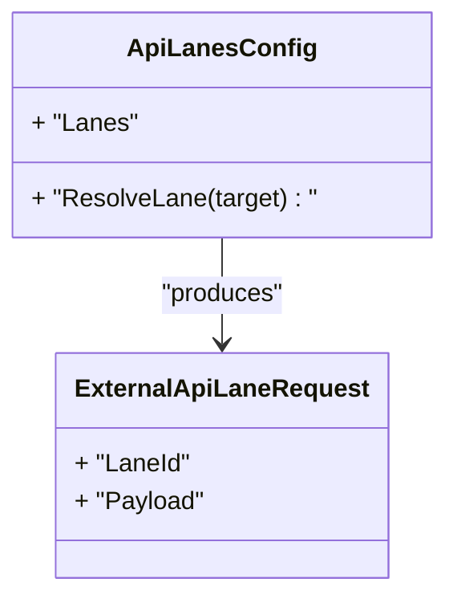
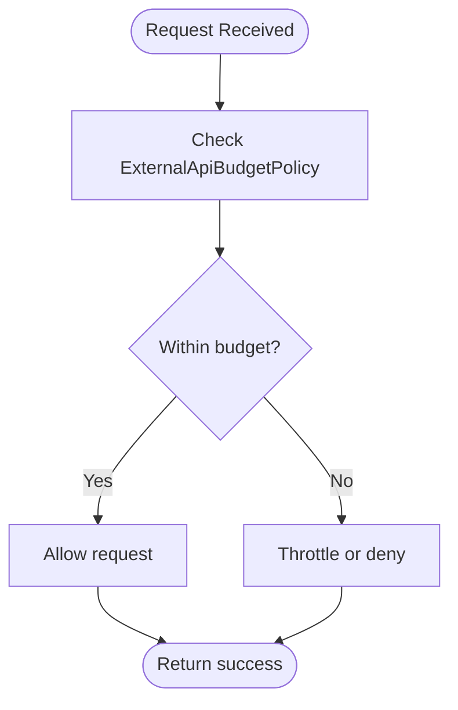
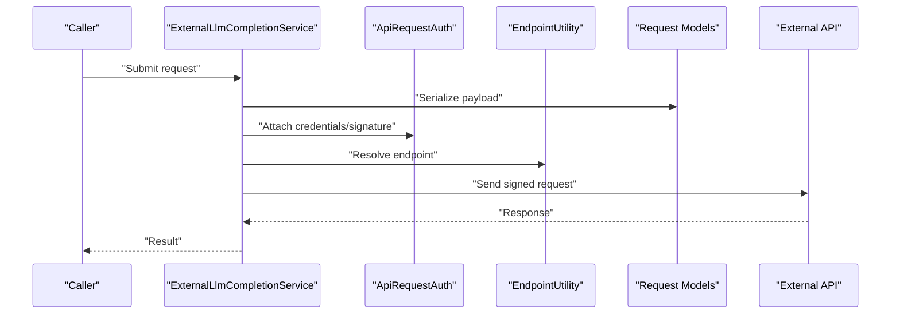
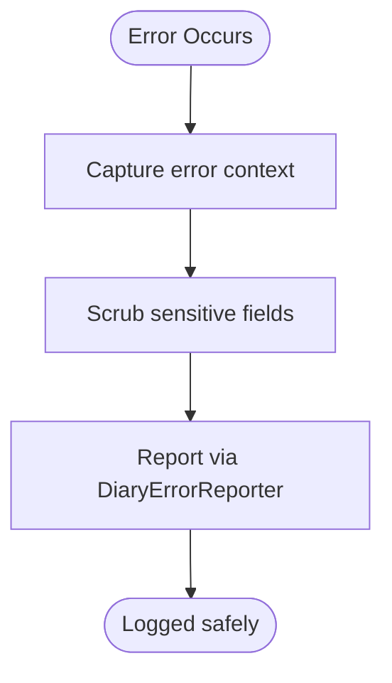
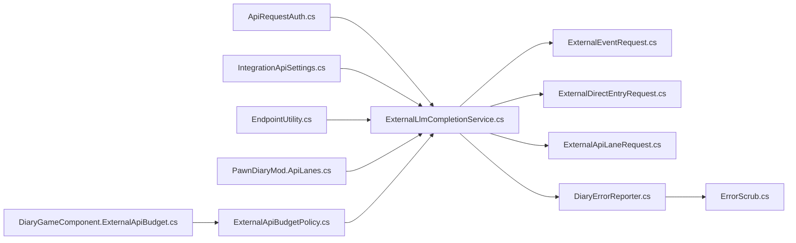

# Authentication & Security

## Table of Contents
1. [Introduction](#introduction)
2. [Project Structure](#project-structure)
3. [Core Components](#core-components)
4. [Architecture Overview](#architecture-overview)
5. [Detailed Component Analysis](#detailed-component-analysis)
6. [Dependency Analysis](#dependency-analysis)
7. [Performance Considerations](#performance-considerations)
8. [Troubleshooting Guide](#troubleshooting-guide)
9. [Conclusion](#conclusion)
10. [Appendices](#appendices)

## Introduction
This document explains authentication mechanisms and security considerations for the integration framework, focusing on API key management, request signing, secure communication protocols, rate limiting, budget controls, throttling, error handling, and best practices. It also provides configuration examples and troubleshooting guidance for common security-related issues.

## Project Structure
The authentication and security features are primarily implemented in the Settings, Pipeline, Integration, and Diagnostics layers:
- Settings layer manages credentials, endpoints, and lane configuration.
- Pipeline layer enforces budgets and policies around external requests.
- Integration layer composes outbound requests and payloads.
- Diagnostics layer reports errors and sanitizes sensitive data.

**Diagram sources**
- [ApiRequestAuth.cs](../../../../Source/Settings/ApiRequestAuth.cs)
- [IntegrationApiSettings.cs](../../../../Source/Settings/IntegrationApiSettings.cs)
- [EndpointUtility.cs](../../../../Source/Settings/EndpointUtility.cs)
- [PawnDiaryMod.ApiLanes.cs](../../../../Source/Settings/PawnDiaryMod.ApiLanes.cs)
- [ExternalApiBudgetPolicy.cs](../../../../Source/Pipeline/ExternalApiBudgetPolicy.cs)
- [ExternalLlmCompletionService.cs](../../../../Source/Integration/ExternalLlmCompletionService.cs)
- [ExternalEventRequest.cs](../../../../Source/Integration/ExternalEventRequest.cs)
- [ExternalDirectEntryRequest.cs](../../../../Source/Integration/ExternalDirectEntryRequest.cs)
- [ExternalApiLaneRequest.cs](../../../../Source/Integration/ExternalApiLaneRequest.cs)
- [DiaryErrorReporter.cs](../../../../Source/Diagnostics/DiaryErrorReporter.cs)
- [ErrorScrub.cs](../../../../Source/Diagnostics/Pure/ErrorScrub.cs)

**Section sources**
- [ApiRequestAuth.cs](../../../../Source/Settings/ApiRequestAuth.cs)
- [IntegrationApiSettings.cs](../../../../Source/Settings/IntegrationApiSettings.cs)
- [EndpointUtility.cs](../../../../Source/Settings/EndpointUtility.cs)
- [PawnDiaryMod.ApiLanes.cs](../../../../Source/Settings/PawnDiaryMod.ApiLanes.cs)
- [ExternalApiBudgetPolicy.cs](../../../../Source/Pipeline/ExternalApiBudgetPolicy.cs)
- [ExternalLlmCompletionService.cs](../../../../Source/Integration/ExternalLlmCompletionService.cs)
- [ExternalEventRequest.cs](../../../../Source/Integration/ExternalEventRequest.cs)
- [ExternalDirectEntryRequest.cs](../../../../Source/Integration/ExternalDirectEntryRequest.cs)
- [ExternalApiLaneRequest.cs](../../../../Source/Integration/ExternalApiLaneRequest.cs)
- [DiaryErrorReporter.cs](../../../../Source/Diagnostics/DiaryErrorReporter.cs)
- [ErrorScrub.cs](../../../../Source/Diagnostics/Pure/ErrorScrub.cs)

## Core Components
- ApiRequestAuth: Encapsulates authentication metadata used when constructing outbound requests (e.g., keys, tokens).
- IntegrationApiSettings: Centralized settings for external integrations, including endpoint configuration and feature toggles.
- ExternalApiBudgetPolicy: Enforces per-lane or global budgets to control usage and costs.
- DiaryGameComponent.ExternalApiBudget: Runtime component that tracks and applies budget constraints during gameplay.
- ExternalLlmCompletionService: Orchestrates outbound calls to external services, applying auth and policy checks.
- Request models (ExternalEventRequest, ExternalDirectEntryRequest, ExternalApiLaneRequest): Define structured payloads for different integration flows.
- EndpointUtility: Utilities for building and validating endpoints.
- Error reporting and scrubbing: Ensure failures are reported without leaking secrets.

**Section sources**
- [ApiRequestAuth.cs](../../../../Source/Settings/ApiRequestAuth.cs)
- [IntegrationApiSettings.cs](../../../../Source/Settings/IntegrationApiSettings.cs)
- [ExternalApiBudgetPolicy.cs](../../../../Source/Pipeline/ExternalApiBudgetPolicy.cs)
- [DiaryGameComponent.ExternalApiBudget.cs](../../../../Source/Core/DiaryGameComponent.ExternalApiBudget.cs)
- [ExternalLlmCompletionService.cs](../../../../Source/Integration/ExternalLlmCompletionService.cs)
- [ExternalEventRequest.cs](../../../../Source/Integration/ExternalEventRequest.cs)
- [ExternalDirectEntryRequest.cs](../../../../Source/Integration/ExternalDirectEntryRequest.cs)
- [ExternalApiLaneRequest.cs](../../../../Source/Integration/ExternalApiLaneRequest.cs)
- [EndpointUtility.cs](../../../../Source/Settings/EndpointUtility.cs)
- [DiaryErrorReporter.cs](../../../../Source/Diagnostics/DiaryErrorReporter.cs)
- [ErrorScrub.cs](../../../../Source/Diagnostics/Pure/ErrorScrub.cs)

## Architecture Overview
The system composes authenticated outbound requests through a layered approach:
- Configuration and credentials are loaded from settings and lane definitions.
- Budget policies constrain how many requests can be made and under what conditions.
- The completion service builds and sends requests with proper headers and body structures.
- Errors are captured and sanitized before being reported.

**Diagram sources**
- [PawnDiaryMod.ApiLanes.cs](../../../../Source/Settings/PawnDiaryMod.ApiLanes.cs)
- [ExternalApiBudgetPolicy.cs](../../../../Source/Pipeline/ExternalApiBudgetPolicy.cs)
- [ExternalLlmCompletionService.cs](../../../../Source/Integration/ExternalLlmCompletionService.cs)
- [ApiRequestAuth.cs](../../../../Source/Settings/ApiRequestAuth.cs)
- [EndpointUtility.cs](../../../../Source/Settings/EndpointUtility.cs)

## Detailed Component Analysis

### Authentication Metadata and Credentials
- Purpose: Provide a centralized place to attach authentication information to outbound requests.
- Responsibilities:
  - Hold API keys/tokens and related metadata.
  - Expose helpers to include credentials in request headers or bodies as required by the target service.
- Security considerations:
  - Avoid logging raw secrets; rely on diagnostics scrubbing.
  - Prefer minimal scopes and short-lived tokens where supported.

**Diagram sources**
- [ApiRequestAuth.cs](../../../../Source/Settings/ApiRequestAuth.cs)

**Section sources**
- [ApiRequestAuth.cs](../../../../Source/Settings/ApiRequestAuth.cs)

### Integration Settings and Endpoints
- Purpose: Centralize configuration for external integrations, including base URLs, lanes, and feature flags.
- Responsibilities:
  - Load and validate endpoint configurations.
  - Provide utilities to construct safe endpoint URIs.
- Security considerations:
  - Validate and normalize endpoints to prevent SSRF-like misuse.
  - Disallow insecure schemes unless explicitly allowed by policy.

**Diagram sources**
- [IntegrationApiSettings.cs](../../../../Source/Settings/IntegrationApiSettings.cs)
- [EndpointUtility.cs](../../../../Source/Settings/EndpointUtility.cs)

**Section sources**
- [IntegrationApiSettings.cs](../../../../Source/Settings/IntegrationApiSettings.cs)
- [EndpointUtility.cs](../../../../Source/Settings/EndpointUtility.cs)

### API Lanes and Routing
- Purpose: Organize outbound calls into lanes with distinct identities and policies.
- Responsibilities:
  - Define lane identity and selection logic.
  - Associate lanes with specific endpoints and capabilities.
- Security considerations:
  - Restrict which lanes can access sensitive endpoints.
  - Apply lane-specific rate limits and budgets.

**Diagram sources**
- [PawnDiaryMod.ApiLanes.cs](../../../../Source/Settings/PawnDiaryMod.ApiLanes.cs)
- [ExternalApiLaneRequest.cs](../../../../Source/Integration/ExternalApiLaneRequest.cs)

**Section sources**
- [PawnDiaryMod.ApiLanes.cs](../../../../Source/Settings/PawnDiaryMod.ApiLanes.cs)
- [ExternalApiLaneRequest.cs](../../../../Source/Integration/ExternalApiLaneRequest.cs)

### Budget Controls and Throttling
- Purpose: Prevent abuse and manage costs by enforcing budgets and throttling.
- Responsibilities:
  - Track usage per lane or globally.
  - Deny requests exceeding thresholds.
  - Integrate with runtime components to persist state across sessions.
- Security considerations:
  - Fail closed when budget state is unavailable.
  - Log only non-sensitive metrics.

**Diagram sources**
- [ExternalApiBudgetPolicy.cs](../../../../Source/Pipeline/ExternalApiBudgetPolicy.cs)
- [DiaryGameComponent.ExternalApiBudget.cs](../../../../Source/Core/DiaryGameComponent.ExternalApiBudget.cs)

**Section sources**
- [ExternalApiBudgetPolicy.cs](../../../../Source/Pipeline/ExternalApiBudgetPolicy.cs)
- [DiaryGameComponent.ExternalApiBudget.cs](../../../../Source/Core/DiaryGameComponent.ExternalApiBudget.cs)

### Outbound Request Composition and Signing
- Purpose: Build and sign outbound requests using configured credentials and endpoints.
- Responsibilities:
  - Compose request bodies based on typed request models.
  - Attach authentication headers or signatures.
  - Use validated endpoints to avoid unsafe URLs.
- Security considerations:
  - Sign critical fields to ensure integrity.
  - Never log full request payloads containing secrets.

**Diagram sources**
- [ExternalLlmCompletionService.cs](../../../../Source/Integration/ExternalLlmCompletionService.cs)
- [ApiRequestAuth.cs](../../../../Source/Settings/ApiRequestAuth.cs)
- [EndpointUtility.cs](../../../../Source/Settings/EndpointUtility.cs)
- [ExternalEventRequest.cs](../../../../Source/Integration/ExternalEventRequest.cs)
- [ExternalDirectEntryRequest.cs](../../../../Source/Integration/ExternalDirectEntryRequest.cs)
- [ExternalApiLaneRequest.cs](../../../../Source/Integration/ExternalApiLaneRequest.cs)

**Section sources**
- [ExternalLlmCompletionService.cs](../../../../Source/Integration/ExternalLlmCompletionService.cs)
- [ExternalEventRequest.cs](../../../../Source/Integration/ExternalEventRequest.cs)
- [ExternalDirectEntryRequest.cs](../../../../Source/Integration/ExternalDirectEntryRequest.cs)
- [ExternalApiLaneRequest.cs](../../../../Source/Integration/ExternalApiLaneRequest.cs)
- [ApiRequestAuth.cs](../../../../Source/Settings/ApiRequestAuth.cs)
- [EndpointUtility.cs](../../../../Source/Settings/EndpointUtility.cs)

### Error Handling and Privacy Safeguards
- Purpose: Report failures while protecting sensitive data.
- Responsibilities:
  - Capture network and authentication errors.
  - Scrub secrets from logs and diagnostics.
- Security considerations:
  - Redact keys, tokens, and personal data in all reports.
  - Provide actionable messages without exposing internals.

**Diagram sources**
- [DiaryErrorReporter.cs](../../../../Source/Diagnostics/DiaryErrorReporter.cs)
- [ErrorScrub.cs](../../../../Source/Diagnostics/Pure/ErrorScrub.cs)

**Section sources**
- [DiaryErrorReporter.cs](../../../../Source/Diagnostics/DiaryErrorReporter.cs)
- [ErrorScrub.cs](../../../../Source/Diagnostics/Pure/ErrorScrub.cs)

## Dependency Analysis
The following diagram shows key dependencies among authentication and security components:

**Diagram sources**
- [ApiRequestAuth.cs](../../../../Source/Settings/ApiRequestAuth.cs)
- [IntegrationApiSettings.cs](../../../../Source/Settings/IntegrationApiSettings.cs)
- [EndpointUtility.cs](../../../../Source/Settings/EndpointUtility.cs)
- [PawnDiaryMod.ApiLanes.cs](../../../../Source/Settings/PawnDiaryMod.ApiLanes.cs)
- [ExternalApiBudgetPolicy.cs](../../../../Source/Pipeline/ExternalApiBudgetPolicy.cs)
- [DiaryGameComponent.ExternalApiBudget.cs](../../../../Source/Core/DiaryGameComponent.ExternalApiBudget.cs)
- [ExternalLlmCompletionService.cs](../../../../Source/Integration/ExternalLlmCompletionService.cs)
- [ExternalEventRequest.cs](../../../../Source/Integration/ExternalEventRequest.cs)
- [ExternalDirectEntryRequest.cs](../../../../Source/Integration/ExternalDirectEntryRequest.cs)
- [ExternalApiLaneRequest.cs](../../../../Source/Integration/ExternalApiLaneRequest.cs)
- [DiaryErrorReporter.cs](../../../../Source/Diagnostics/DiaryErrorReporter.cs)
- [ErrorScrub.cs](../../../../Source/Diagnostics/Pure/ErrorScrub.cs)

**Section sources**
- [ApiRequestAuth.cs](../../../../Source/Settings/ApiRequestAuth.cs)
- [IntegrationApiSettings.cs](../../../../Source/Settings/IntegrationApiSettings.cs)
- [EndpointUtility.cs](../../../../Source/Settings/EndpointUtility.cs)
- [PawnDiaryMod.ApiLanes.cs](../../../../Source/Settings/PawnDiaryMod.ApiLanes.cs)
- [ExternalApiBudgetPolicy.cs](../../../../Source/Pipeline/ExternalApiBudgetPolicy.cs)
- [DiaryGameComponent.ExternalApiBudget.cs](../../../../Source/Core/DiaryGameComponent.ExternalApiBudget.cs)
- [ExternalLlmCompletionService.cs](../../../../Source/Integration/ExternalLlmCompletionService.cs)
- [ExternalEventRequest.cs](../../../../Source/Integration/ExternalEventRequest.cs)
- [ExternalDirectEntryRequest.cs](../../../../Source/Integration/ExternalDirectEntryRequest.cs)
- [ExternalApiLaneRequest.cs](../../../../Source/Integration/ExternalApiLaneRequest.cs)
- [DiaryErrorReporter.cs](../../../../Source/Diagnostics/DiaryErrorReporter.cs)
- [ErrorScrub.cs](../../../../Source/Diagnostics/Pure/ErrorScrub.cs)

## Performance Considerations
- Prefer connection reuse and pooling for outbound HTTP calls to reduce latency.
- Batch small events where possible to minimize overhead.
- Cache endpoint validation results to avoid repeated parsing.
- Keep budgets and throttling checks lightweight and deterministic.
- Avoid serializing large payloads unnecessarily; trim context before sending.

[No sources needed since this section provides general guidance]

## Troubleshooting Guide
Common security-related issues and resolutions:

- Authentication failures
  - Symptoms: Repeated 401/403 responses or explicit auth errors.
  - Checks:
    - Verify API keys/tokens are present and not expired.
    - Confirm correct lane-to-endpoint mapping.
    - Ensure headers/signatures are attached as expected.
  - Actions:
    - Rotate compromised credentials immediately.
    - Validate endpoint scheme and host allowlists.

- Network issues
  - Symptoms: Timeouts, DNS failures, TLS errors.
  - Checks:
    - Confirm connectivity and firewall rules.
    - Validate certificate trust chain and hostname verification.
  - Actions:
    - Update CA bundles if necessary.
    - Adjust timeouts and retry policies cautiously.

- Rate limiting and budget exceeded
  - Symptoms: Requests denied due to budget or throttle.
  - Checks:
    - Review per-lane quotas and current usage counters.
    - Inspect policy thresholds and decay windows.
  - Actions:
    - Increase budgets if appropriate.
    - Implement backoff and jitter for retries.

- Sensitive data exposure
  - Symptoms: Secrets appearing in logs or diagnostics.
  - Checks:
    - Ensure scrubbing is applied to all diagnostic paths.
    - Audit serialization of request/response objects.
  - Actions:
    - Redact keys, tokens, and PII at boundaries.
    - Enable strict logging modes in production.

- Endpoint safety
  - Symptoms: Unexpected redirects or internal addresses.
  - Checks:
    - Validate endpoint normalization and scheme restrictions.
    - Ensure no SSRF-prone behaviors.
  - Actions:
    - Enforce allowlists for domains and schemes.
    - Reject private ranges and loopbacks.

**Section sources**
- [ApiRequestAuth.cs](../../../../Source/Settings/ApiRequestAuth.cs)
- [IntegrationApiSettings.cs](../../../../Source/Settings/IntegrationApiSettings.cs)
- [EndpointUtility.cs](../../../../Source/Settings/EndpointUtility.cs)
- [ExternalApiBudgetPolicy.cs](../../../../Source/Pipeline/ExternalApiBudgetPolicy.cs)
- [DiaryGameComponent.ExternalApiBudget.cs](../../../../Source/Core/DiaryGameComponent.ExternalApiBudget.cs)
- [ExternalLlmCompletionService.cs](../../../../Source/Integration/ExternalLlmCompletionService.cs)
- [DiaryErrorReporter.cs](../../../../Source/Diagnostics/DiaryErrorReporter.cs)
- [ErrorScrub.cs](../../../../Source/Diagnostics/Pure/ErrorScrub.cs)

## Conclusion
The integration framework implements a layered security model centered on credential management, endpoint validation, budget enforcement, and robust error reporting with privacy safeguards. By adhering to the recommended configuration and operational practices, teams can maintain secure, resilient, and cost-controlled integrations.

[No sources needed since this section summarizes without analyzing specific files]

## Appendices

### Configuration Examples
- API Key Management
  - Store keys in secure settings and reference them via lane configuration.
  - Use short-lived tokens where supported and rotate regularly.
- Request Signing
  - Configure signing parameters in the auth module and ensure they are included in outbound requests.
- Secure Communication Protocols
  - Enforce HTTPS-only endpoints and validate certificates.
  - Disable legacy protocols and weak ciphers.
- Rate Limiting and Budgets
  - Set per-lane quotas and global caps.
  - Enable backoff strategies and circuit breakers for failing endpoints.
- Data Minimization
  - Trim context and remove PII before transmission.
  - Mask secrets in logs and telemetry.

[No sources needed since this section provides general guidance]
