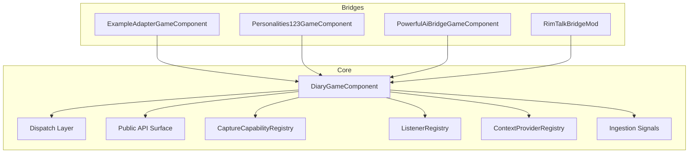
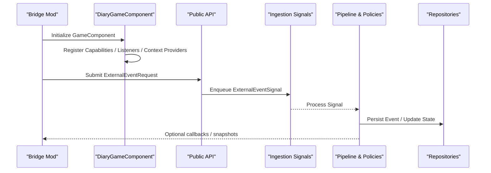
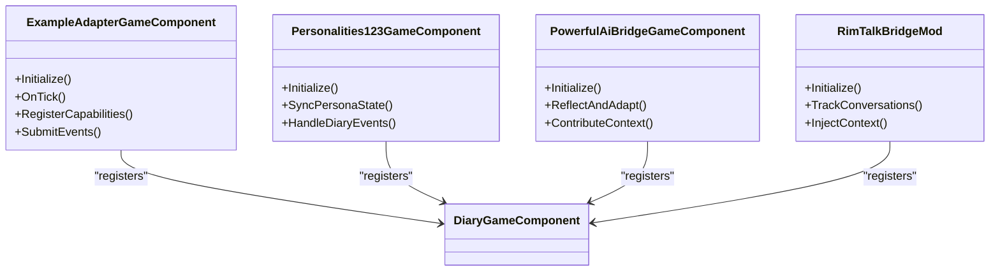
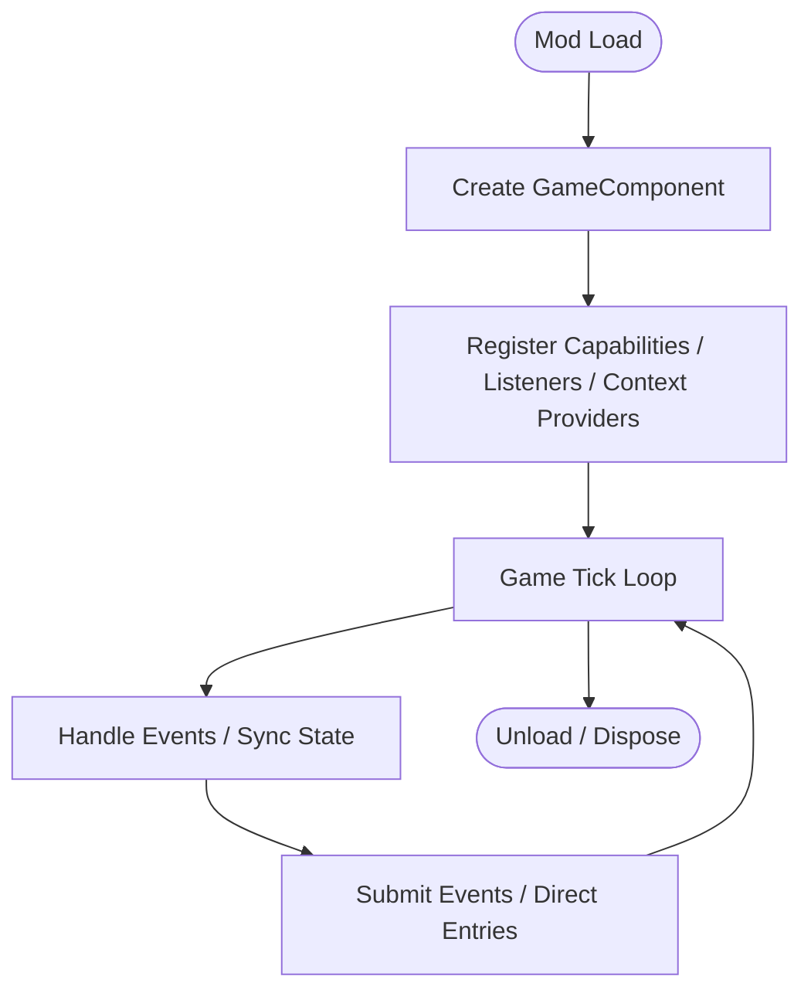
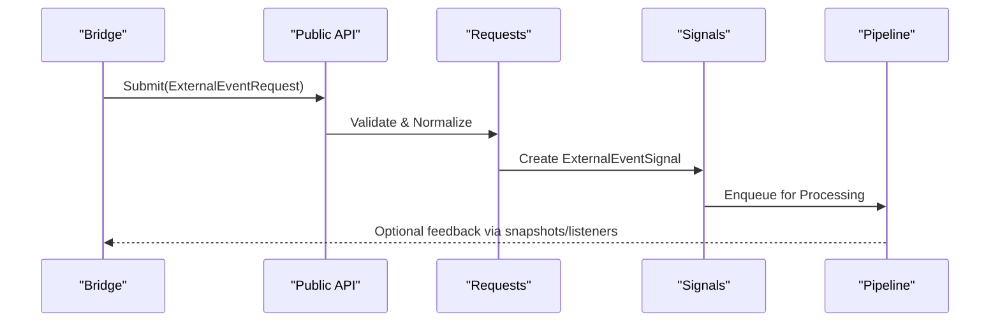
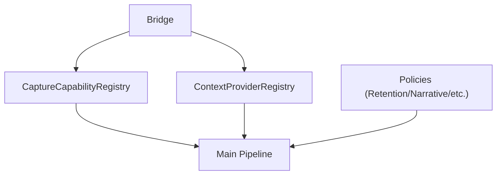
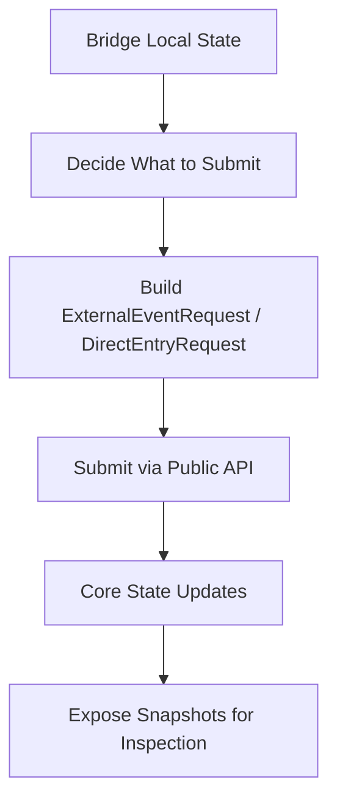
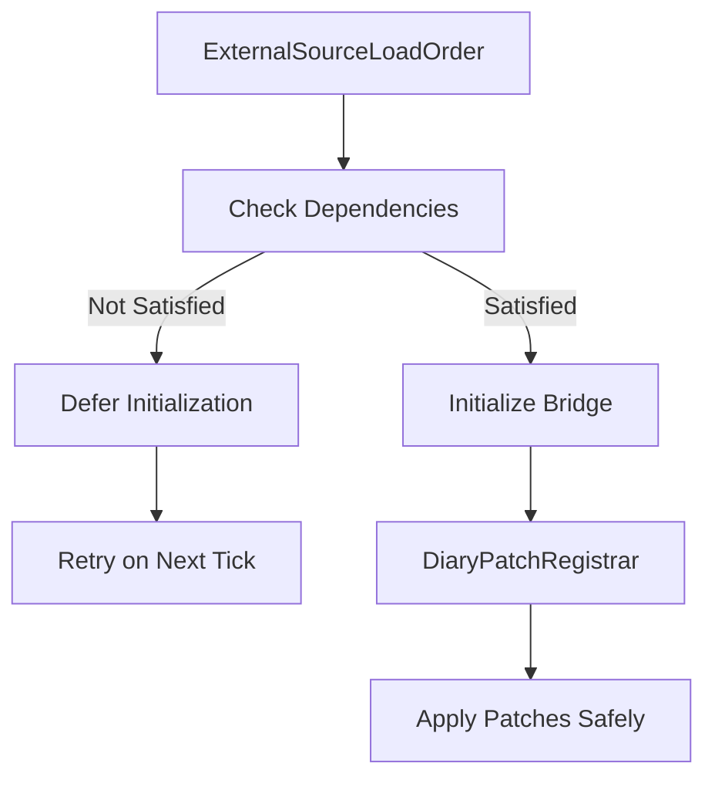
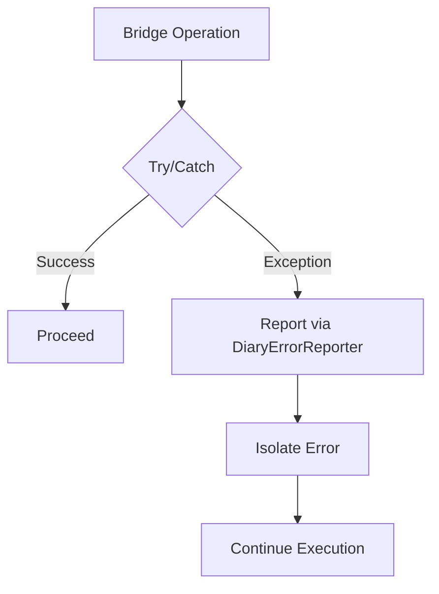
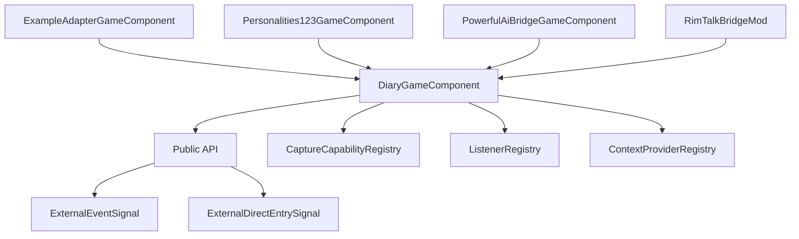

# Bridge Architecture

<cite>
**Referenced Files in This Document**
- [DiaryGameComponent.cs](../../../../../Source/Core/DiaryGameComponent.cs)
- [DiaryGameComponent.Dispatch.cs](../../../../../Source/Core/DiaryGameComponent.Dispatch.cs)
- [DiaryGameComponent.PublicApi.cs](../../../../../Source/Core/DiaryGameComponent.PublicApi.cs)
- [DiaryGameComponent.EventFactory.cs](../../../../../Source/Core/DiaryGameComponent.EventFactory.cs)
- [CaptureCapabilities.cs](../../../../../Source/Integration/CaptureCapabilities.cs)
- [DiaryApiLaneSnapshot.cs](../../../../../Source/Integration/DiaryApiLaneSnapshot.cs)
- [ExternalEventRequest.cs](../../../../../Source/Integration/ExternalEventRequest.cs)
- [ExternalDirectEntryRequest.cs](../../../../../Source/Integration/ExternalDirectEntryRequest.cs)
- [PawnDiaryApi.cs](../../../../../Source/Integration/PawnDiaryApi.cs)
- [ListenerRegistry.cs](../../../../../Source/Pipeline/ListenerRegistry.cs)
- [CaptureCapabilityRegistry.cs](../../../../../Source/Pipeline/CaptureCapabilityRegistry.cs)
- [ContextProviderRegistry.cs](../../../../../Source/Pipeline/ContextProviderRegistry.cs)
- [ExternalEventSignal.cs](../../../../../Source/Ingestion/Sources/ExternalEventSignal.cs)
- [ExternalDirectEntrySignal.cs](../../../../../Source/Ingestion/Sources/ExternalDirectEntrySignal.cs)
- [DiaryEvents.cs](../../../../../Source/Ingestion/DiaryEvents.cs)
- [DiarySignal.cs](../../../../../Source/Ingestion/DiarySignal.cs)
- [DiaryPatchRegistrar.cs](../../../../../Source/Patches/DiaryPatchRegistrar.cs)
- [DiaryModStartup.cs](../../../../../Source/Patches/DiaryModStartup.cs)
- [ExternalSourceLoadOrder.cs](../../../../../Source/Util/ExternalSourceLoadOrder.cs)
- [DiaryErrorReporter.cs](../../../../../Source/Diagnostics/DiaryErrorReporter.cs)
- [ExampleAdapterGameComponent.cs](../../../../../integrations/PawnDiary.ExampleAdapter/Source/ExampleAdapterGameComponent.cs)
- [Personalities123GameComponent.cs](../../../../../integrations/PawnDiary.PersonalitiesBridge/Source/Personalities123GameComponent.cs)
- [PowerfulAiBridgeGameComponent.cs](../../../../../integrations/PawnDiary.PowerfulAiBridge/Source/PowerfulAiBridgeGameComponent.cs)
- [RimTalkBridgeMod.cs](../../../../../integrations/PawnDiary.RimTalkBridge/Source/PawnDiaryRimTalkBridgeMod.cs)
</cite>

## Table of Contents
1. [Introduction](#introduction)
2. [Project Structure](#project-structure)
3. [Core Components](#core-components)
4. [Architecture Overview](#architecture-overview)
5. [Detailed Component Analysis](#detailed-component-analysis)
6. [Dependency Analysis](#dependency-analysis)
7. [Performance Considerations](#performance-considerations)
8. [Troubleshooting Guide](#troubleshooting-guide)
9. [Conclusion](#conclusion)
10. [Appendices](#appendices)

## Introduction
This document explains the bridge architecture that connects external mods with Pawn Diary. It focuses on:
- The bridge pattern implementation used by integration mods to interact with the diary system
- Lifecycle management via GameComponent integration
- Event-driven communication between bridges and the main diary pipeline
- The relationship between bridges, capture policies, and the core pipeline
- How bridges register with the system, handle events, and synchronize state
- Mod loading order considerations, dependency management, and error isolation patterns

The goal is to provide both a high-level understanding and code-level details for developers building or maintaining bridges.

## Project Structure
At a high level, the repository organizes core functionality under Source/, with integrations (bridges) under integrations/. Core components include:
- A central game component orchestrating lifecycle and dispatch
- Registries for capabilities, listeners, and context providers
- Ingestion signals for external events and direct entries
- Integration contracts and API surfaces for bridges
- Diagnostics and patching infrastructure

[No sources needed since this diagram shows conceptual workflow, not actual code structure]

## Core Components
- DiaryGameComponent: Central orchestrator for lifecycle, registration, and dispatch across features and bridges.
- CaptureCapabilityRegistry: Registry where bridges declare what they can capture and how.
- ListenerRegistry: Event bus-like registry enabling decoupled event handling.
- ContextProviderRegistry: Mechanism for bridges to contribute contextual data to prompts and generation.
- Ingestion Signals: ExternalEventSignal and ExternalDirectEntrySignal represent entry points for mod-provided content.
- Integration Contracts: Types like ExternalEventRequest, ExternalDirectEntryRequest, DiaryApiLaneSnapshot, and CaptureCapabilities define the bridge contract surface.

Key responsibilities:
- Bridges implement GameComponent-based lifecycles to initialize and participate in the game loop.
- Bridges use registries to advertise capabilities and subscribe to events.
- Bridges submit events through well-defined requests consumed by the ingestion layer.
- The core pipeline consumes signals, applies policies, and generates diary entries.

**Section sources**
- [DiaryGameComponent.cs](../../../../../Source/Core/DiaryGameComponent.cs)
- [DiaryGameComponent.Dispatch.cs](../../../../../Source/Core/DiaryGameComponent.Dispatch.cs)
- [CaptureCapabilityRegistry.cs](../../../../../Source/Pipeline/CaptureCapabilityRegistry.cs)
- [ListenerRegistry.cs](../../../../../Source/Pipeline/ListenerRegistry.cs)
- [ContextProviderRegistry.cs](../../../../../Source/Pipeline/ContextProviderRegistry.cs)
- [ExternalEventSignal.cs](../../../../../Source/Ingestion/Sources/ExternalEventSignal.cs)
- [ExternalDirectEntrySignal.cs](../../../../../Source/Ingestion/Sources/ExternalDirectEntrySignal.cs)
- [ExternalEventRequest.cs](../../../../../Source/Integration/ExternalEventRequest.cs)
- [ExternalDirectEntryRequest.cs](../../../../../Source/Integration/ExternalDirectEntryRequest.cs)
- [DiaryApiLaneSnapshot.cs](../../../../../Source/Integration/DiaryApiLaneSnapshot.cs)
- [CaptureCapabilities.cs](../../../../../Source/Integration/CaptureCapabilities.cs)

## Architecture Overview
The bridge architecture follows a clear separation of concerns:
- Bridges encapsulate mod-specific logic and expose a minimal interface to the core.
- The core provides stable contracts, registries, and an event-driven pipeline.
- Ingestion transforms bridge submissions into internal signals processed by the pipeline.
- Policies govern capture, retention, and narrative generation.

**Diagram sources**
- [DiaryGameComponent.cs](../../../../../Source/Core/DiaryGameComponent.cs)
- [DiaryGameComponent.PublicApi.cs](../../../../../Source/Core/DiaryGameComponent.PublicApi.cs)
- [ExternalEventSignal.cs](../../../../../Source/Ingestion/Sources/ExternalEventSignal.cs)
- [ExternalEventRequest.cs](../../../../../Source/Integration/ExternalEventRequest.cs)

**Section sources**
- [DiaryGameComponent.cs](../../../../../Source/Core/DiaryGameComponent.cs)
- [DiaryGameComponent.PublicApi.cs](../../../../../Source/Core/DiaryGameComponent.PublicApi.cs)
- [ExternalEventSignal.cs](../../../../../Source/Ingestion/Sources/ExternalEventSignal.cs)
- [ExternalEventRequest.cs](../../../../../Source/Integration/ExternalEventRequest.cs)

## Detailed Component Analysis

### Bridge Pattern Implementation
Bridges are implemented as GameComponents that:
- Initialize during mod startup and register their capabilities and listeners
- Consume events from the core or game world and translate them into bridge-specific actions
- Submit events or direct entries using the public API contracts

**Diagram sources**
- [ExampleAdapterGameComponent.cs](../../../../../integrations/PawnDiary.ExampleAdapter/Source/ExampleAdapterGameComponent.cs)
- [Personalities123GameComponent.cs](../../../../../integrations/PawnDiary.PersonalitiesBridge/Source/Personalities123GameComponent.cs)
- [PowerfulAiBridgeGameComponent.cs](../../../../../integrations/PawnDiary.PowerfulAiBridge/Source/PowerfulAiBridgeGameComponent.cs)
- [RimTalkBridgeMod.cs](../../../../../integrations/PawnDiary.RimTalkBridge/Source/PawnDiaryRimTalkBridgeMod.cs)
- [DiaryGameComponent.cs](../../../../../Source/Core/DiaryGameComponent.cs)

**Section sources**
- [ExampleAdapterGameComponent.cs](../../../../../integrations/PawnDiary.ExampleAdapter/Source/ExampleAdapterGameComponent.cs)
- [Personalities123GameComponent.cs](../../../../../integrations/PawnDiary.PersonalitiesBridge/Source/Personalities123GameComponent.cs)
- [PowerfulAiBridgeGameComponent.cs](../../../../../integrations/PawnDiary.PowerfulAiBridge/Source/PowerfulAiBridgeGameComponent.cs)
- [RimTalkBridgeMod.cs](../../../../../integrations/PawnDiary.RimTalkBridge/Source/PawnDiaryRimTalkBridgeMod.cs)

### Lifecycle Management Through GameComponent Integration
Lifecycle phases:
- Startup: Mods load and create their GameComponent instances
- Registration: Bridges register capabilities, listeners, and context providers
- Runtime: Bridges react to events and periodically sync state
- Shutdown: Bridges release resources and clean up

**Diagram sources**
- [DiaryGameComponent.cs](../../../../../Source/Core/DiaryGameComponent.cs)
- [DiaryGameComponent.Dispatch.cs](../../../../../Source/Core/DiaryGameComponent.Dispatch.cs)

**Section sources**
- [DiaryGameComponent.cs](../../../../../Source/Core/DiaryGameComponent.cs)
- [DiaryGameComponent.Dispatch.cs](../../../../../Source/Core/DiaryGameComponent.Dispatch.cs)

### Event-Driven Communication Architecture
Bridges communicate with the core via:
- ExternalEventRequest: Structured event submission
- ExternalDirectEntryRequest: Direct diary entry creation
- Signals: ExternalEventSignal and ExternalDirectEntrySignal consumed by the pipeline

**Diagram sources**
- [ExternalEventRequest.cs](../../../../../Source/Integration/ExternalEventRequest.cs)
- [ExternalDirectEntryRequest.cs](../../../../../Source/Integration/ExternalDirectEntryRequest.cs)
- [ExternalEventSignal.cs](../../../../../Source/Ingestion/Sources/ExternalEventSignal.cs)
- [ExternalDirectEntrySignal.cs](../../../../../Source/Ingestion/Sources/ExternalDirectEntrySignal.cs)
- [DiaryEvents.cs](../../../../../Source/Ingestion/DiaryEvents.cs)
- [DiarySignal.cs](../../../../../Source/Ingestion/DiarySignal.cs)

**Section sources**
- [ExternalEventRequest.cs](../../../../../Source/Integration/ExternalEventRequest.cs)
- [ExternalDirectEntryRequest.cs](../../../../../Source/Integration/ExternalDirectEntryRequest.cs)
- [ExternalEventSignal.cs](../../../../../Source/Ingestion/Sources/ExternalEventSignal.cs)
- [ExternalDirectEntrySignal.cs](../../../../../Source/Ingestion/Sources/ExternalDirectEntrySignal.cs)
- [DiaryEvents.cs](../../../../../Source/Ingestion/DiaryEvents.cs)
- [DiarySignal.cs](../../../../../Source/Ingestion/DiarySignal.cs)

### Relationship Between Bridges, Capture Policies, and Main Pipeline
- Bridges declare capture capabilities via CaptureCapabilities and the CaptureCapabilityRegistry.
- The pipeline uses these declarations to determine which events to capture and how to process them.
- Context providers allow bridges to enrich prompts and generation with domain-specific information.
- Policies govern retention, narrative continuity, and other aspects of diary behavior.

**Diagram sources**
- [CaptureCapabilities.cs](../../../../../Source/Integration/CaptureCapabilities.cs)
- [CaptureCapabilityRegistry.cs](../../../../../Source/Pipeline/CaptureCapabilityRegistry.cs)
- [ContextProviderRegistry.cs](../../../../../Source/Pipeline/ContextProviderRegistry.cs)

**Section sources**
- [CaptureCapabilities.cs](../../../../../Source/Integration/CaptureCapabilities.cs)
- [CaptureCapabilityRegistry.cs](../../../../../Source/Pipeline/CaptureCapabilityRegistry.cs)
- [ContextProviderRegistry.cs](../../../../../Source/Pipeline/ContextProviderRegistry.cs)

### Synchronization and State Management
- Bridges maintain local state relevant to their domain (e.g., persona traits, AI reflection state).
- They synchronize with the diary system by submitting events or updating context providers.
- Snapshots (e.g., DiaryApiLaneSnapshot) enable inspection and debugging of bridge contributions.

**Diagram sources**
- [DiaryApiLaneSnapshot.cs](../../../../../Source/Integration/DiaryApiLaneSnapshot.cs)
- [ExternalEventRequest.cs](../../../../../Source/Integration/ExternalEventRequest.cs)
- [ExternalDirectEntryRequest.cs](../../../../../Source/Integration/ExternalDirectEntryRequest.cs)

**Section sources**
- [DiaryApiLaneSnapshot.cs](../../../../../Source/Integration/DiaryApiLaneSnapshot.cs)
- [ExternalEventRequest.cs](../../../../../Source/Integration/ExternalEventRequest.cs)
- [ExternalDirectEntryRequest.cs](../../../../../Source/Integration/ExternalDirectEntryRequest.cs)

### Mod Loading Order and Dependency Management
- ExternalSourceLoadOrder provides utilities to manage load order dependencies among external sources.
- Patch registration occurs through DiaryPatchRegistrar and DiaryModStartup, ensuring hooks are applied safely after dependencies are available.
- Bridges should avoid hard coupling to specific mods; instead, rely on capability checks and optional initialization.

**Diagram sources**
- [ExternalSourceLoadOrder.cs](../../../../../Source/Util/ExternalSourceLoadOrder.cs)
- [DiaryPatchRegistrar.cs](../../../../../Source/Patches/DiaryPatchRegistrar.cs)
- [DiaryModStartup.cs](../../../../../Source/Patches/DiaryModStartup.cs)

**Section sources**
- [ExternalSourceLoadOrder.cs](../../../../../Source/Util/ExternalSourceLoadOrder.cs)
- [DiaryPatchRegistrar.cs](../../../../../Source/Patches/DiaryPatchRegistrar.cs)
- [DiaryModStartup.cs](../../../../../Source/Patches/DiaryModStartup.cs)

### Error Isolation Patterns
- Diagnostics are centralized via DiaryErrorReporter to isolate errors and prevent crashes from propagating.
- Bridges should wrap sensitive operations in try/catch blocks and report errors through the diagnostics layer.
- Safe patch application and deferred initialization reduce the risk of runtime failures due to missing dependencies.

**Diagram sources**
- [DiaryErrorReporter.cs](../../../../../Source/Diagnostics/DiaryErrorReporter.cs)

**Section sources**
- [DiaryErrorReporter.cs](../../../../../Source/Diagnostics/DiaryErrorReporter.cs)

## Dependency Analysis
The following diagram illustrates key dependencies between core components and bridge implementations.

**Diagram sources**
- [DiaryGameComponent.cs](../../../../../Source/Core/DiaryGameComponent.cs)
- [DiaryGameComponent.PublicApi.cs](../../../../../Source/Core/DiaryGameComponent.PublicApi.cs)
- [CaptureCapabilityRegistry.cs](../../../../../Source/Pipeline/CaptureCapabilityRegistry.cs)
- [ListenerRegistry.cs](../../../../../Source/Pipeline/ListenerRegistry.cs)
- [ContextProviderRegistry.cs](../../../../../Source/Pipeline/ContextProviderRegistry.cs)
- [ExternalEventSignal.cs](../../../../../Source/Ingestion/Sources/ExternalEventSignal.cs)
- [ExternalDirectEntrySignal.cs](../../../../../Source/Ingestion/Sources/ExternalDirectEntrySignal.cs)
- [ExampleAdapterGameComponent.cs](../../../../../integrations/PawnDiary.ExampleAdapter/Source/ExampleAdapterGameComponent.cs)
- [Personalities123GameComponent.cs](../../../../../integrations/PawnDiary.PersonalitiesBridge/Source/Personalities123GameComponent.cs)
- [PowerfulAiBridgeGameComponent.cs](../../../../../integrations/PawnDiary.PowerfulAiBridge/Source/PowerfulAiBridgeGameComponent.cs)
- [RimTalkBridgeMod.cs](../../../../../integrations/PawnDiary.RimTalkBridge/Source/PawnDiaryRimTalkBridgeMod.cs)

**Section sources**
- [DiaryGameComponent.cs](../../../../../Source/Core/DiaryGameComponent.cs)
- [DiaryGameComponent.PublicApi.cs](../../../../../Source/Core/DiaryGameComponent.PublicApi.cs)
- [CaptureCapabilityRegistry.cs](../../../../../Source/Pipeline/CaptureCapabilityRegistry.cs)
- [ListenerRegistry.cs](../../../../../Source/Pipeline/ListenerRegistry.cs)
- [ContextProviderRegistry.cs](../../../../../Source/Pipeline/ContextProviderRegistry.cs)
- [ExternalEventSignal.cs](../../../../../Source/Ingestion/Sources/ExternalEventSignal.cs)
- [ExternalDirectEntrySignal.cs](../../../../../Source/Ingestion/Sources/ExternalDirectEntrySignal.cs)
- [ExampleAdapterGameComponent.cs](../../../../../integrations/PawnDiary.ExampleAdapter/Source/ExampleAdapterGameComponent.cs)
- [Personalities123GameComponent.cs](../../../../../integrations/PawnDiary.PersonalitiesBridge/Source/Personalities123GameComponent.cs)
- [PowerfulAiBridgeGameComponent.cs](../../../../../integrations/PawnDiary.PowerfulAiBridge/Source/PowerfulAiBridgeGameComponent.cs)
- [RimTalkBridgeMod.cs](../../../../../integrations/PawnDiary.RimTalkBridge/Source/PawnDiaryRimTalkBridgeMod.cs)

## Performance Considerations
- Batch submissions: Avoid excessive per-tick event submissions; batch when possible to reduce overhead.
- Lazy initialization: Defer heavy computations until necessary to minimize tick impact.
- Efficient snapshots: Use snapshots judiciously; they are primarily for inspection and debugging.
- Policy tuning: Adjust retention and narrative policies to balance memory usage and narrative richness.

[No sources needed since this section provides general guidance]

## Troubleshooting Guide
Common issues and resolutions:
- Missing dependencies: Ensure load order is correct and use ExternalSourceLoadOrder utilities to check availability before initializing.
- Errors in bridge operations: Wrap critical paths in try/catch and report via DiaryErrorReporter to isolate failures.
- Patch conflicts: Verify patches are registered through DiaryPatchRegistrar and DiaryModStartup to ensure safe application.
- Event duplication: Deduplicate events at the bridge level or rely on core deduplication mechanisms if available.

**Section sources**
- [ExternalSourceLoadOrder.cs](../../../../../Source/Util/ExternalSourceLoadOrder.cs)
- [DiaryErrorReporter.cs](../../../../../Source/Diagnostics/DiaryErrorReporter.cs)
- [DiaryPatchRegistrar.cs](../../../../../Source/Patches/DiaryPatchRegistrar.cs)
- [DiaryModStartup.cs](../../../../../Source/Patches/DiaryModStartup.cs)

## Conclusion
The bridge architecture provides a robust, extensible mechanism for integrating external mods with Pawn Diary. By leveraging GameComponent lifecycles, registries, and event-driven communication, bridges can contribute rich, domain-specific content while maintaining stability and performance. Proper attention to load order, dependency management, and error isolation ensures a resilient ecosystem for modders and players alike.

[No sources needed since this section summarizes without analyzing specific files]

## Appendices
- For detailed API usage, refer to the integration contracts and examples within the integrations directory.
- For policy configuration and tuning, consult the core policy definitions and settings modules.

[No sources needed since this section provides general guidance]
