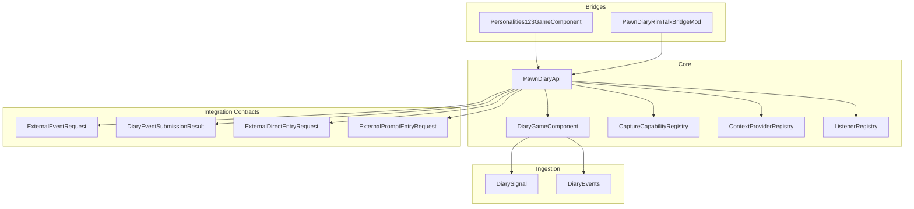
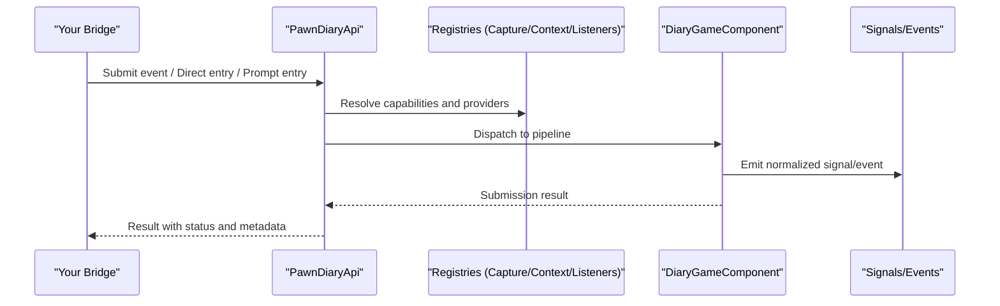
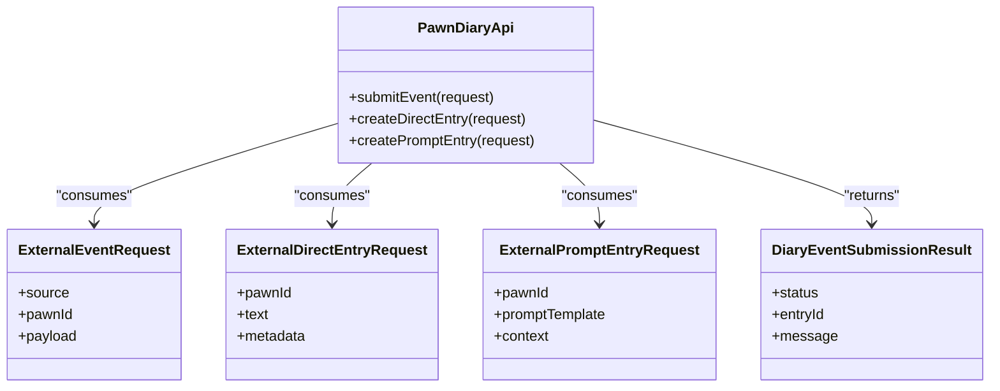
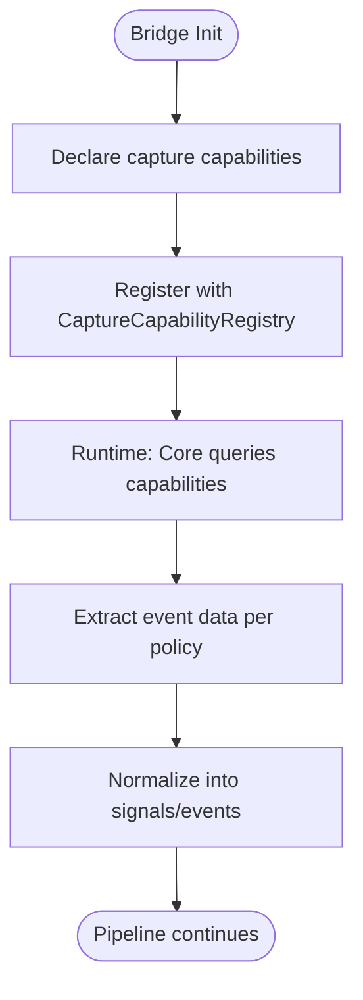
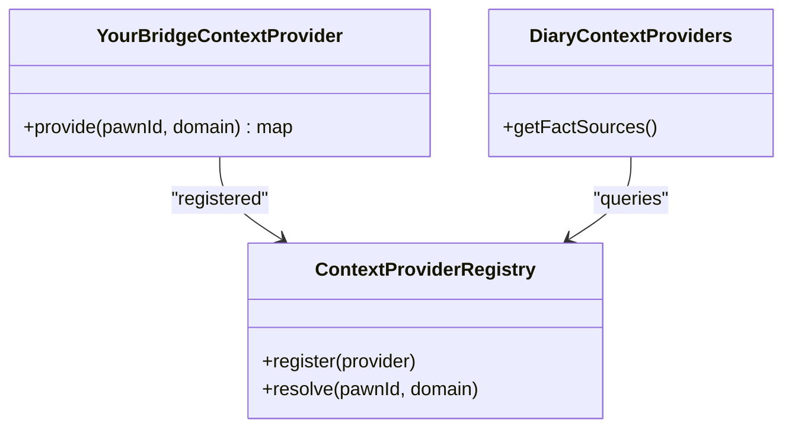
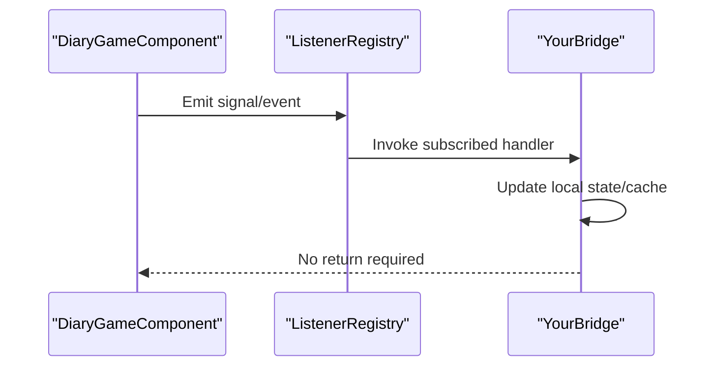
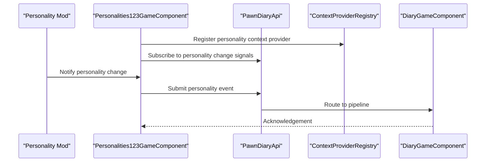
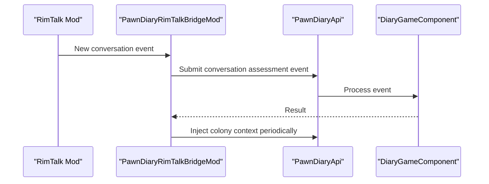
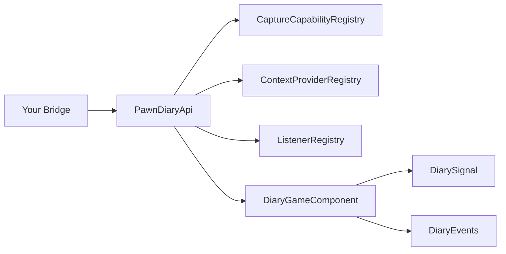

# Bridge Development Guide

<cite>
**Referenced Files in This Document**
- [PawnDiaryApi.cs](../../../../../Source/Integration/PawnDiaryApi.cs)
- [CaptureContext.cs](../../../../../Source/Capture/CaptureContext.cs)
- [CaptureCapabilityRegistry.cs](../../../../../Source/Pipeline/CaptureCapabilityRegistry.cs)
- [Personalities123GameComponent.cs](../../../../../integrations/PawnDiary.PersonalitiesBridge/Source/Personalities123GameComponent.cs)
- [PawnDiaryRimTalkBridgeMod.cs](../../../../../integrations/PawnDiary.RimTalkBridge/Source/PawnDiaryRimTalkBridgeMod.cs)
- [ExternalEventRequest.cs](../../../../../Source/Integration/ExternalEventRequest.cs)
- [DiaryEventSubmissionResult.cs](../../../../../Source/Integration/DiaryEventSubmissionResult.cs)
- [DiarySignal.cs](../../../../../Source/Ingestion/DiarySignal.cs)
- [DiaryEvents.cs](../../../../../Source/Ingestion/DiaryEvents.cs)
- [DiaryGameComponent.cs](../../../../../Source/Core/DiaryGameComponent.cs)
- [DiaryContextProviders.cs](../../../../../Source/Integration/PawnContextProviders.cs)
- [ContextProviderRegistry.cs](../../../../../Source/Pipeline/ContextProviderRegistry.cs)
- [ListenerRegistry.cs](../../../../../Source/Pipeline/ListenerRegistry.cs)
- [ExternalDirectEntryRequest.cs](../../../../../Source/Integration/ExternalDirectEntryRequest.cs)
- [ExternalPromptEntryRequest.cs](../../../../../Source/Integration/ExternalPromptEntryRequest.cs)
</cite>

## Table of Contents
1. [Introduction](#introduction)
2. [Project Structure](#project-structure)
3. [Core Components](#core-components)
4. [Architecture Overview](#architecture-overview)
5. [Detailed Component Analysis](#detailed-component-analysis)
6. [Dependency Analysis](#dependency-analysis)
7. [Performance Considerations](#performance-considerations)
8. [Troubleshooting Guide](#troubleshooting-guide)
9. [Conclusion](#conclusion)
10. [Appendices](#appendices)

## Introduction

This guide explains how to build bridge implementations that connect other mods with Pawn Diary. It covers the bridge architecture pattern, lifecycle management, data synchronization strategies, capture policies, context providers, event handlers, and step-by-step integration scenarios such as personality system bridges, conversation log integrations, and state synchronization. It also includes best practices for performance optimization and debugging techniques for bridge development.

## Project Structure

The repository organizes core functionality under Source/, with multiple integration bridges under integrations/. The key areas relevant to bridge development include:

- Integration APIs and request/response models
- Capture pipeline and policy registry
- Ingestion signals and events
- Core game component orchestration
- Context provider registries and listener mechanisms

**Diagram sources**
- [DiaryGameComponent.cs](../../../../../Source/Core/DiaryGameComponent.cs)
- [PawnDiaryApi.cs](../../../../../Source/Integration/PawnDiaryApi.cs)
- [CaptureCapabilityRegistry.cs](../../../../../Source/Pipeline/CaptureCapabilityRegistry.cs)
- [ContextProviderRegistry.cs](../../../../../Source/Pipeline/ContextProviderRegistry.cs)
- [ListenerRegistry.cs](../../../../../Source/Pipeline/ListenerRegistry.cs)
- [DiarySignal.cs](../../../../../Source/Ingestion/DiarySignal.cs)
- [DiaryEvents.cs](../../../../../Source/Ingestion/DiaryEvents.cs)
- [ExternalEventRequest.cs](../../../../../Source/Integration/ExternalEventRequest.cs)
- [DiaryEventSubmissionResult.cs](../../../../../Source/Integration/DiaryEventSubmissionResult.cs)
- [ExternalDirectEntryRequest.cs](../../../../../Source/Integration/ExternalDirectEntryRequest.cs)
- [ExternalPromptEntryRequest.cs](../../../../../Source/Integration/ExternalPromptEntryRequest.cs)
- [Personalities123GameComponent.cs](../../../../../integrations/PawnDiary.PersonalitiesBridge/Source/Personalities123GameComponent.cs)
- [PawnDiaryRimTalkBridgeMod.cs](../../../../../integrations/PawnDiary.RimTalkBridge/Source/PawnDiaryRimTalkBridgeMod.cs)

**Section sources**
- [DiaryGameComponent.cs](../../../../../Source/Core/DiaryGameComponent.cs)
- [PawnDiaryApi.cs](../../../../../Source/Integration/PawnDiaryApi.cs)
- [CaptureCapabilityRegistry.cs](../../../../../Source/Pipeline/CaptureCapabilityRegistry.cs)
- [ContextProviderRegistry.cs](../../../../../Source/Pipeline/ContextProviderRegistry.cs)
- [ListenerRegistry.cs](../../../../../Source/Pipeline/ListenerRegistry.cs)
- [DiarySignal.cs](../../../../../Source/Ingestion/DiarySignal.cs)
- [DiaryEvents.cs](../../../../../Source/Ingestion/DiaryEvents.cs)
- [ExternalEventRequest.cs](../../../../../Source/Integration/ExternalEventRequest.cs)
- [DiaryEventSubmissionResult.cs](../../../../../Source/Integration/DiaryEventSubmissionResult.cs)
- [ExternalDirectEntryRequest.cs](../../../../../Source/Integration/ExternalDirectEntryRequest.cs)
- [ExternalPromptEntryRequest.cs](../../../../../Source/Integration/ExternalPromptEntryRequest.cs)
- [Personalities123GameComponent.cs](../../../../../integrations/PawnDiary.PersonalitiesBridge/Source/Personalities123GameComponent.cs)
- [PawnDiaryRimTalkBridgeMod.cs](../../../../../integrations/PawnDiary.RimTalkBridge/Source/PawnDiaryRimTalkBridgeMod.cs)

## Core Components

- Bridge API surface: Bridges interact via a stable public API that exposes submission endpoints, direct entry points, prompt-based entries, and capability discovery.
- Capture capabilities: A registry allows external systems to declare what they can capture and how to do it; the core uses these declarations to coordinate ingestion.
- Context providers: External systems can contribute contextual facts used during narrative generation and memory selection.
- Event ingestion: Signals and typed events represent canonical payloads bridged into the diary pipeline.
- Game component lifecycle: The core orchestrates initialization, updates, and teardown; bridges should register their components and hooks accordingly.

Key responsibilities:
- Provide typed requests for submissions and direct entries
- Return structured results indicating success, rejection, or partial processing
- Register listeners and context providers at startup
- Consume signals/events from the core when needed

**Section sources**
- [PawnDiaryApi.cs](../../../../../Source/Integration/PawnDiaryApi.cs)
- [CaptureCapabilityRegistry.cs](../../../../../Source/Pipeline/CaptureCapabilityRegistry.cs)
- [DiaryContextProviders.cs](../../../../../Source/Integration/PawnContextProviders.cs)
- [ContextProviderRegistry.cs](../../../../../Source/Pipeline/ContextProviderRegistry.cs)
- [DiarySignal.cs](../../../../../Source/Ingestion/DiarySignal.cs)
- [DiaryEvents.cs](../../../../../Source/Ingestion/DiaryEvents.cs)
- [ExternalEventRequest.cs](../../../../../Source/Integration/ExternalEventRequest.cs)
- [DiaryEventSubmissionResult.cs](../../../../../Source/Integration/DiaryEventSubmissionResult.cs)
- [ExternalDirectEntryRequest.cs](../../../../../Source/Integration/ExternalDirectEntryRequest.cs)
- [ExternalPromptEntryRequest.cs](../../../../../Source/Integration/ExternalPromptEntryRequest.cs)
- [DiaryGameComponent.cs](../../../../../Source/Core/DiaryGameComponent.cs)

## Architecture Overview

The bridge architecture follows a decoupled, event-driven model:

- Bridges call into the public API to submit events or direct entries.
- The core validates, classifies, and routes requests through capture pipelines and policies.
- Context providers enrich prompts and memory selection.
- Listeners receive notifications for lifecycle and runtime events.
- Signals and typed events carry normalized payloads across mod boundaries.

**Diagram sources**
- [PawnDiaryApi.cs](../../../../../Source/Integration/PawnDiaryApi.cs)
- [CaptureCapabilityRegistry.cs](../../../../../Source/Pipeline/CaptureCapabilityRegistry.cs)
- [ContextProviderRegistry.cs](../../../../../Source/Pipeline/ContextProviderRegistry.cs)
- [ListenerRegistry.cs](../../../../../Source/Pipeline/ListenerRegistry.cs)
- [DiaryGameComponent.cs](../../../../../Source/Core/DiaryGameComponent.cs)
- [DiarySignal.cs](../../../../../Source/Ingestion/DiarySignal.cs)
- [DiaryEvents.cs](../../../../../Source/Ingestion/DiaryEvents.cs)

## Detailed Component Analysis

### Bridge API Surface

The public API provides:
- Event submission with typed requests and structured results
- Direct entry creation for immediate diary lines
- Prompt-based entry creation for LLM-assisted content
- Capability and context registration helpers

Typical flow:
- Build a request object with source attribution, target pawn, and payload
- Call the appropriate API method
- Handle the result to determine if the entry was accepted, deferred, or rejected

**Diagram sources**
- [ExternalEventRequest.cs](../../../../../Source/Integration/ExternalEventRequest.cs)
- [ExternalDirectEntryRequest.cs](../../../../../Source/Integration/ExternalDirectEntryRequest.cs)
- [ExternalPromptEntryRequest.cs](../../../../../Source/Integration/ExternalPromptEntryRequest.cs)
- [DiaryEventSubmissionResult.cs](../../../../../Source/Integration/DiaryEventSubmissionResult.cs)
- [PawnDiaryApi.cs](../../../../../Source/Integration/PawnDiaryApi.cs)

**Section sources**
- [ExternalEventRequest.cs](../../../../../Source/Integration/ExternalEventRequest.cs)
- [ExternalDirectEntryRequest.cs](../../../../../Source/Integration/ExternalDirectEntryRequest.cs)
- [ExternalPromptEntryRequest.cs](../../../../../Source/Integration/ExternalPromptEntryRequest.cs)
- [DiaryEventSubmissionResult.cs](../../../../../Source/Integration/DiaryEventSubmissionResult.cs)
- [PawnDiaryApi.cs](../../../../../Source/Integration/PawnDiaryApi.cs)

### Capture Policies and Capability Registry

Capture policies define how an external system contributes to capturing events and facts. The registry centralizes capability declarations so the core can discover and invoke them safely.

Implementation steps:
- Implement a capture policy type that describes supported event categories and data extraction logic
- Register the policy with the capability registry during bridge initialization
- Ensure idempotency and avoid duplicate captures by using provenance tags and deduplication keys

**Diagram sources**
- [CaptureCapabilityRegistry.cs](../../../../../Source/Pipeline/CaptureCapabilityRegistry.cs)
- [CaptureContext.cs](../../../../../Source/Capture/CaptureContext.cs)
- [DiarySignal.cs](../../../../../Source/Ingestion/DiarySignal.cs)
- [DiaryEvents.cs](../../../../../Source/Ingestion/DiaryEvents.cs)

**Section sources**
- [CaptureCapabilityRegistry.cs](../../../../../Source/Pipeline/CaptureCapabilityRegistry.cs)
- [CaptureContext.cs](../../../../../Source/Capture/CaptureContext.cs)
- [DiarySignal.cs](../../../../../Source/Ingestion/DiarySignal.cs)
- [DiaryEvents.cs](../../../../../Source/Ingestion/DiaryEvents.cs)

### Context Providers

Context providers supply additional facts for narrative generation and memory selection. They are registered centrally and queried during prompt assembly.

Steps:
- Implement a context provider that returns structured facts keyed by domain
- Register the provider with the context provider registry
- Keep provider methods lightweight and cache expensive computations

**Diagram sources**
- [ContextProviderRegistry.cs](../../../../../Source/Pipeline/ContextProviderRegistry.cs)
- [DiaryContextProviders.cs](../../../../../Source/Integration/PawnContextProviders.cs)

**Section sources**
- [ContextProviderRegistry.cs](../../../../../Source/Pipeline/ContextProviderRegistry.cs)
- [DiaryContextProviders.cs](../../../../../Source/Integration/PawnContextProviders.cs)

### Event Handlers and Listeners

Use the listener registry to subscribe to lifecycle and runtime events emitted by the core. This enables your bridge to react to changes without tight coupling.

Common patterns:
- Subscribe to high-level signals like arrivals, deaths, mood changes
- Maintain local caches or derived state
- Debounce frequent updates to reduce overhead

**Diagram sources**
- [ListenerRegistry.cs](../../../../../Source/Pipeline/ListenerRegistry.cs)
- [DiaryGameComponent.cs](../../../../../Source/Core/DiaryGameComponent.cs)
- [DiarySignal.cs](../../../../../Source/Ingestion/DiarySignal.cs)

**Section sources**
- [ListenerRegistry.cs](../../../../../Source/Pipeline/ListenerRegistry.cs)
- [DiaryGameComponent.cs](../../../../../Source/Core/DiaryGameComponent.cs)
- [DiarySignal.cs](../../../../../Source/Ingestion/DiarySignal.cs)

### Example Bridges

#### Personality System Bridge

A personality bridge typically synchronizes traits, affinities, or dynamic personality states into the diary context and may emit events when personality shifts occur.

Lifecycle:
- Initialize and register context providers and capture capabilities
- Subscribe to personality change signals
- On change, update context and optionally submit a diary event reflecting the shift

**Diagram sources**
- [Personalities123GameComponent.cs](../../../../../integrations/PawnDiary.PersonalitiesBridge/Source/Personalities123GameComponent.cs)
- [PawnDiaryApi.cs](../../../../../Source/Integration/PawnDiaryApi.cs)
- [ContextProviderRegistry.cs](../../../../../Source/Pipeline/ContextProviderRegistry.cs)
- [DiaryGameComponent.cs](../../../../../Source/Core/DiaryGameComponent.cs)

**Section sources**
- [Personalities123GameComponent.cs](../../../../../integrations/PawnDiary.PersonalitiesBridge/Source/Personalities123GameComponent.cs)

#### Conversation Log Integration

A conversation bridge integrates dialogue logs, assessments, and persona chattiness metrics into the diary. It often injects colony-level context and tracks recent interactions.

Key responsibilities:
- Track conversations and produce assessment summaries
- Inject colony context for richer narratives
- Periodically flush aggregated conversation insights

**Diagram sources**
- [PawnDiaryRimTalkBridgeMod.cs](../../../../../integrations/PawnDiary.RimTalkBridge/Source/PawnDiaryRimTalkBridgeMod.cs)
- [PawnDiaryApi.cs](../../../../../Source/Integration/PawnDiaryApi.cs)
- [DiaryGameComponent.cs](../../../../../Source/Core/DiaryGameComponent.cs)

**Section sources**
- [PawnDiaryRimTalkBridgeMod.cs](../../../../../integrations/PawnDiary.RimTalkBridge/Source/PawnDiaryRimTalkBridgeMod.cs)

### Step-by-Step Guides

#### Personality System Bridge

1. Create a game component for your bridge and initialize it during mod load.
2. Register a context provider that supplies personality-related facts keyed by pawn.
3. Subscribe to personality change signals via the listener registry.
4. On change, construct a typed event request and submit it through the API.
5. Cache recent personality transitions to avoid redundant entries.
6. Expose a small diagnostic endpoint to inspect current personality context.

Best practices:
- Use unique provenance identifiers to prevent duplicates
- Batch updates where possible
- Keep context provider responses fast and deterministic

#### Conversation Log Integration

1. Initialize the bridge and register any necessary context providers for conversation summaries.
2. Subscribe to conversation start/end signals and track participants, topics, and outcomes.
3. When a conversation concludes, compute a concise summary and submit it as an event.
4. Periodically aggregate and submit higher-level insights (e.g., relationship trends).
5. Optionally provide a UI tool to preview upcoming diary entries based on pending summaries.

Best practices:
- Limit summary length and avoid sensitive details
- Deduplicate near-duplicate summaries
- Respect rate limits and batch submissions

#### State Synchronization

1. Identify the authoritative state in the external mod.
2. Choose between push (event-driven) and pull (on-demand) synchronization strategies.
3. For push: subscribe to state change signals and submit minimal diffs.
4. For pull: expose a queryable snapshot interface and let the core fetch when needed.
5. Implement reconciliation to handle out-of-order updates and conflicts.
6. Add diagnostics to compare expected vs. actual state.

Best practices:
- Prefer immutable snapshots for consistency
- Use versioned state to detect stale updates
- Debounce rapid successive changes

## Dependency Analysis

Bridges depend on the public API and registries, while the core depends on signals and events. Registries mediate discovery and invocation, ensuring loose coupling.

**Diagram sources**
- [PawnDiaryApi.cs](../../../../../Source/Integration/PawnDiaryApi.cs)
- [CaptureCapabilityRegistry.cs](../../../../../Source/Pipeline/CaptureCapabilityRegistry.cs)
- [ContextProviderRegistry.cs](../../../../../Source/Pipeline/ContextProviderRegistry.cs)
- [ListenerRegistry.cs](../../../../../Source/Pipeline/ListenerRegistry.cs)
- [DiaryGameComponent.cs](../../../../../Source/Core/DiaryGameComponent.cs)
- [DiarySignal.cs](../../../../../Source/Ingestion/DiarySignal.cs)
- [DiaryEvents.cs](../../../../../Source/Ingestion/DiaryEvents.cs)

**Section sources**
- [PawnDiaryApi.cs](../../../../../Source/Integration/PawnDiaryApi.cs)
- [CaptureCapabilityRegistry.cs](../../../../../Source/Pipeline/CaptureCapabilityRegistry.cs)
- [ContextProviderRegistry.cs](../../../../../Source/Pipeline/ContextProviderRegistry.cs)
- [ListenerRegistry.cs](../../../../../Source/Pipeline/ListenerRegistry.cs)
- [DiaryGameComponent.cs](../../../../../Source/Core/DiaryGameComponent.cs)
- [DiarySignal.cs](../../../../../Source/Ingestion/DiarySignal.cs)
- [DiaryEvents.cs](../../../../../Source/Ingestion/DiaryEvents.cs)

## Performance Considerations

- Minimize allocations in hot paths: reuse buffers and avoid string concatenation in tight loops.
- Defer heavy computation: perform expensive work off the main thread or schedule it asynchronously.
- Batch submissions: group multiple related events into fewer API calls.
- Cache frequently accessed data: maintain in-memory caches with TTLs and invalidation rules.
- Avoid redundant captures: use provenance IDs and deduplication keys to prevent duplicate entries.
- Respect budgets: adhere to any external API budget policies enforced by the core.

[No sources needed since this section provides general guidance]

## Troubleshooting Guide

Common issues and remedies:
- Duplicate entries: ensure unique provenance identifiers and implement deduplication checks.
- Missing context: verify that context providers are registered and returning non-empty results for the requested domains.
- Stale state: implement versioning and reconcile out-of-order updates.
- Performance regressions: profile hot paths, add logging around critical sections, and consider batching or caching.
- Initialization order: confirm that your bridge registers capabilities and listeners before the core begins emitting signals.

Debugging techniques:
- Use the public API’s result objects to inspect acceptance/rejection reasons.
- Add targeted logging around submission and context resolution.
- Leverage existing diagnostic windows and actions if available.
- Write unit tests for capture policies and context providers to validate behavior deterministically.

**Section sources**
- [DiaryEventSubmissionResult.cs](../../../../../Source/Integration/DiaryEventSubmissionResult.cs)
- [PawnDiaryApi.cs](../../../../../Source/Integration/PawnDiaryApi.cs)

## Conclusion

By following the bridge architecture pattern—using the public API, registering capture capabilities and context providers, subscribing to signals, and normalizing data into signals/events—you can integrate external systems cleanly and efficiently. Adopt batching, caching, and deduplication to optimize performance, and use structured results and diagnostics to streamline troubleshooting.

[No sources needed since this section summarizes without analyzing specific files]

## Appendices

### Code Templates and Patterns

- Event submission template:
  - Construct a typed event request with source attribution and payload
  - Call the API submission method
  - Inspect the result for status and message
  - Handle retries or fallbacks as needed

- Direct entry template:
  - Build a direct entry request with text and metadata
  - Call the direct entry API
  - Validate the returned entry ID and status

- Prompt-based entry template:
  - Prepare a prompt template and context
  - Call the prompt entry API
  - Monitor completion and handle errors gracefully

- Context provider template:
  - Implement a provider that returns a map of facts for a given pawn and domain
  - Register the provider at startup
  - Cache computed facts and invalidate on relevant state changes

- Listener subscription template:
  - Subscribe to relevant signals during initialization
  - Update local caches and trigger downstream actions
  - Unsubscribe during cleanup to avoid leaks

[No sources needed since this section provides general guidance]
