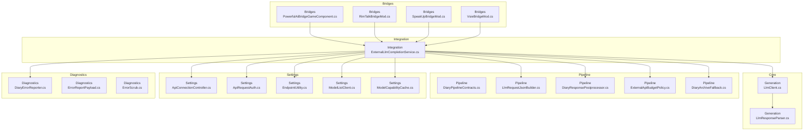
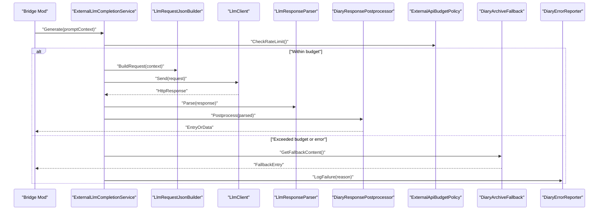
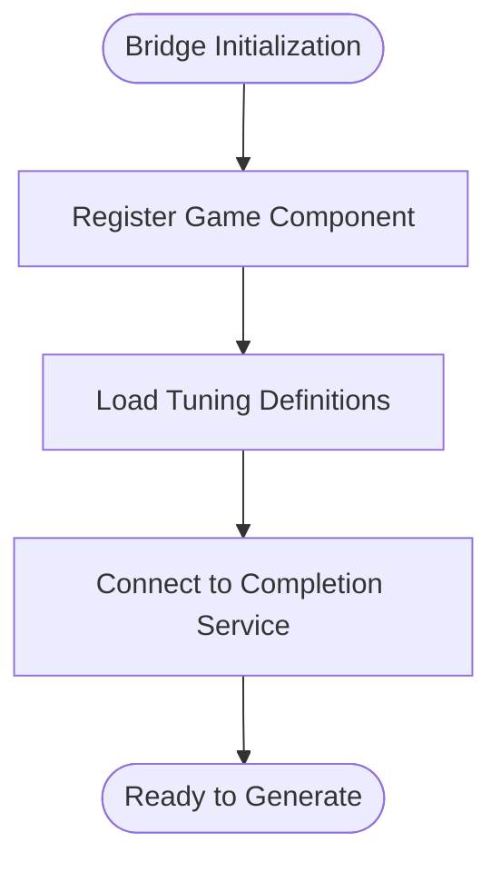
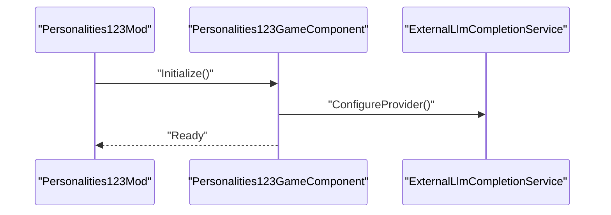
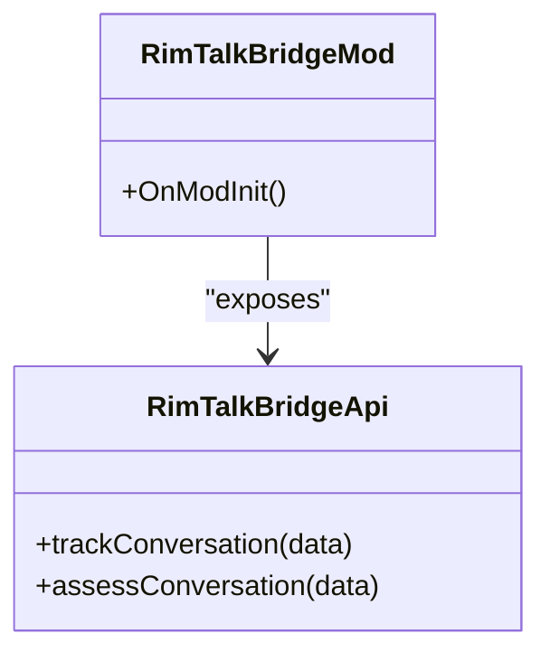
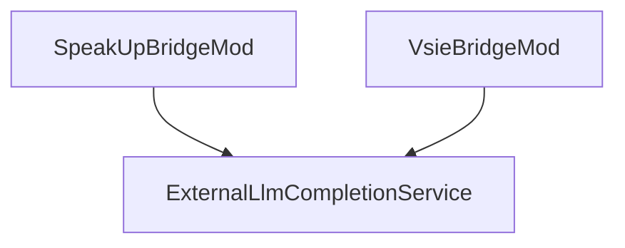
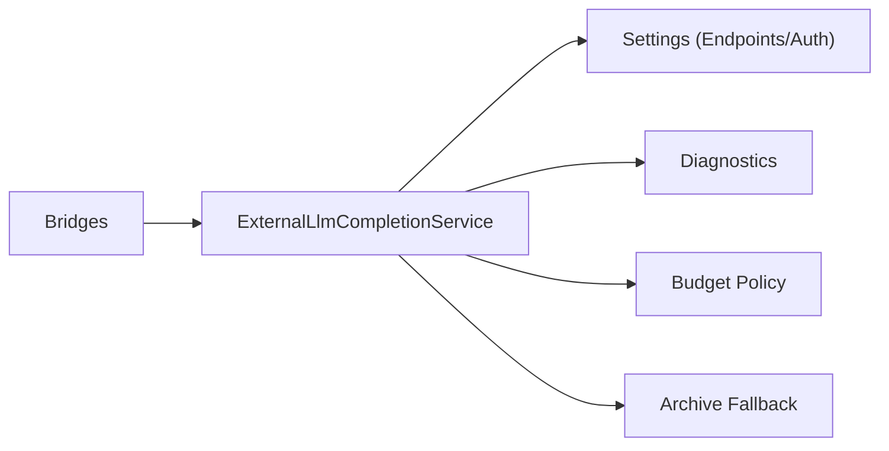

# AI Provider Bridges

## Table of Contents
1. [Introduction](#introduction)
2. [Project Structure](#project-structure)
3. [Core Components](#core-components)
4. [Architecture Overview](#architecture-overview)
5. [Detailed Component Analysis](#detailed-component-analysis)
6. [Dependency Analysis](#dependency-analysis)
7. [Performance Considerations](#performance-considerations)
8. [Troubleshooting Guide](#troubleshooting-guide)
9. [Conclusion](#conclusion)
10. [Appendices](#appendices)

## Introduction
This document provides detailed guidance for implementing and integrating AI provider bridges within the project. It explains alternative language model integration patterns, request/response handling, authentication methods, response format adaptation, error recovery strategies, rate limiting considerations, and fallback mechanisms. The content is designed to be accessible to both new and experienced contributors while remaining grounded in the actual codebase structure and implementation patterns.

## Project Structure
The repository organizes AI bridge-related functionality across several areas:
- Core generation and LLM client utilities under Source/Generation
- Integration services and API contracts under Source/Integration
- Pipeline components for building requests and postprocessing responses under Source/Pipeline
- Settings and configuration for endpoints and authentication under Source/Settings
- Diagnostics and error reporting under Source/Diagnostics
- Example and third-party bridges under integrations

**Diagram sources**
- [LlmClient.cs](../../../../../../Source/Generation/LlmClient.cs)
- [LlmResponseParser.cs](../../../../../../Source/Generation/LlmResponseParser.cs)
- [ExternalLlmCompletionService.cs](../../../../../../Source/Integration/ExternalLlmCompletionService.cs)
- [DiaryPipelineContracts.cs](../../../../../../Source/Pipeline/DiaryPipelineContracts.cs)
- [LlmRequestJsonBuilder.cs](../../../../../../Source/Pipeline/LlmRequestJsonBuilder.cs)
- [DiaryResponsePostprocessor.cs](../../../../../../Source/Pipeline/DiaryResponsePostprocessor.cs)
- [ExternalApiBudgetPolicy.cs](../../../../../../Source/Pipeline/ExternalApiBudgetPolicy.cs)
- [DiaryArchiveFallback.cs](../../../../../../Source/Pipeline/DiaryArchiveFallback.cs)
- [ApiConnectionController.cs](../../../../../../Source/Settings/ApiConnectionController.cs)
- [ApiRequestAuth.cs](../../../../../../Source/Settings/ApiRequestAuth.cs)
- [EndpointUtility.cs](../../../../../../Source/Settings/EndpointUtility.cs)
- [ModelListClient.cs](../../../../../../Source/Settings/ModelListClient.cs)
- [ModelCapabilityCache.cs](../../../../../../Source/Settings/ModelCapabilityCache.cs)
- [DiaryErrorReporter.cs](../../../../../../Source/Diagnostics/DiaryErrorReporter.cs)
- [ErrorReportPayload.cs](../../../../../../Source/Diagnostics/Pure/ErrorReportPayload.cs)
- [ErrorScrub.cs](../../../../../../Source/Diagnostics/Pure/ErrorScrub.cs)
- [PowerfulAiBridgeGameComponent.cs](../../../../../../integrations/PawnDiary.PowerfulAiBridge/Source/PowerfulAiBridgeGameComponent.cs)
- [RimTalkBridgeMod.cs](../../../../../../integrations/PawnDiary.RimTalkBridge/Source/PawnDiaryRimTalkBridgeMod.cs)
- [SpeakUpBridgeMod.cs](../../../../../../integrations/PawnDiary.SpeakUp/Source/SpeakUpBridgeMod.cs)
- [VsieBridgeMod.cs](../../../../../../integrations/PawnDiary.Vsie/Source/VsieBridgeMod.cs)

**Section sources**
- [README.md](../../../../../../README.md)
- [EXTERNAL_API.md](../../../../../../EXTERNAL_API.md)
- [DOCUMENTATION.md](../../../../../../DOCUMENTATION.md)

## Core Components
- LLM Client and Response Parsing
  - The core HTTP interaction with external models is encapsulated in a dedicated client component that handles connection lifecycle, retries, timeouts, and basic error classification.
  - A response parser normalizes heterogeneous provider outputs into a unified internal representation used by the rest of the system.

- External LLM Completion Service
  - Orchestrates prompt assembly, request construction, invocation via the LLM client, parsing, post-processing, budgeting, and fallbacks.
  - Integrates with settings for endpoint configuration and authentication, and with diagnostics for error reporting.

- Request Building and Response Postprocessing
  - A JSON builder constructs provider-specific payloads from standardized prompts and context.
  - A postprocessor adapts raw responses into diary entries or structured data, applying text decoration and formatting rules.

- Budgeting and Fallback
  - An external API budget policy enforces rate limits and cost controls.
  - A diary archive fallback ensures continuity when providers are unavailable or return errors.

- Settings and Authentication
  - Connection controller manages endpoint selection and connectivity checks.
  - Authentication helper abstracts token injection and credential management.
  - Endpoint utility standardizes URL resolution and path templating.
  - Model list client and capability cache support dynamic discovery and feature gating.

- Diagnostics and Error Reporting
  - Centralized error reporter aggregates failures, fingerprints, and scrubbed payloads for safe logging and analysis.

**Section sources**
- [LlmClient.cs](../../../../../../Source/Generation/LlmClient.cs)
- [LlmResponseParser.cs](../../../../../../Source/Generation/LlmResponseParser.cs)
- [ExternalLlmCompletionService.cs](../../../../../../Source/Integration/ExternalLlmCompletionService.cs)
- [LlmRequestJsonBuilder.cs](../../../../../../Source/Pipeline/LlmRequestJsonBuilder.cs)
- [DiaryResponsePostprocessor.cs](../../../../../../Source/Pipeline/DiaryResponsePostprocessor.cs)
- [ExternalApiBudgetPolicy.cs](../../../../../../Source/Pipeline/ExternalApiBudgetPolicy.cs)
- [DiaryArchiveFallback.cs](../../../../../../Source/Pipeline/DiaryArchiveFallback.cs)
- [ApiConnectionController.cs](../../../../../../Source/Settings/ApiConnectionController.cs)
- [ApiRequestAuth.cs](../../../../../../Source/Settings/ApiRequestAuth.cs)
- [EndpointUtility.cs](../../../../../../Source/Settings/EndpointUtility.cs)
- [ModelListClient.cs](../../../../../../Source/Settings/ModelListClient.cs)
- [ModelCapabilityCache.cs](../../../../../../Source/Settings/ModelCapabilityCache.cs)
- [DiaryErrorReporter.cs](../../../../../../Source/Diagnostics/DiaryErrorReporter.cs)
- [ErrorReportPayload.cs](../../../../../../Source/Diagnostics/Pure/ErrorReportPayload.cs)
- [ErrorScrub.cs](../../../../../../Source/Diagnostics/Pure/ErrorScrub.cs)

## Architecture Overview
The AI provider bridge architecture follows a layered approach:
- Bridge layer (mod-specific components) composes prompts and delegates to the completion service.
- Completion service coordinates request building, invocation, parsing, postprocessing, budgeting, and fallbacks.
- Settings layer configures endpoints and authentication.
- Diagnostics layer captures and reports errors safely.

**Diagram sources**
- [ExternalLlmCompletionService.cs](../../../../../../Source/Integration/ExternalLlmCompletionService.cs)
- [LlmRequestJsonBuilder.cs](../../../../../../Source/Pipeline/LlmRequestJsonBuilder.cs)
- [LlmClient.cs](../../../../../../Source/Generation/LlmClient.cs)
- [LlmResponseParser.cs](../../../../../../Source/Generation/LlmResponseParser.cs)
- [DiaryResponsePostprocessor.cs](../../../../../../Source/Pipeline/DiaryResponsePostprocessor.cs)
- [ExternalApiBudgetPolicy.cs](../../../../../../Source/Pipeline/ExternalApiBudgetPolicy.cs)
- [DiaryArchiveFallback.cs](../../../../../../Source/Pipeline/DiaryArchiveFallback.cs)
- [DiaryErrorReporter.cs](../../../../../../Source/Diagnostics/DiaryErrorReporter.cs)

## Detailed Component Analysis

### External LLM Completion Service
Responsibilities:
- Compose high-level orchestration for generation workflows.
- Apply budget policies before invoking providers.
- Build provider-specific requests using the JSON builder.
- Parse and postprocess responses into canonical forms.
- Handle fallbacks and report errors.

Key interactions:
- Uses ApiConnectionController and ApiRequestAuth for endpoint and credential management.
- Leverages ModelListClient and ModelCapabilityCache for model selection and feature detection.
- Integrates with DiaryErrorReporter for robust diagnostics.

```mermaid
classDiagram
class ExternalLlmCompletionService {
+generate(context) Result
-buildRequest(context) Request
-parseResponse(raw) Parsed
-postprocess(parsed) Entry
-checkBudget() bool
-getFallback() Entry
-reportError(reason) void
}
class LlmRequestJsonBuilder {
+build(context) Json
}
class LlmClient {
+send(request) HttpResponse
}
class LlmResponseParser {
+parse(httpResponse) Parsed
}
class DiaryResponsePostprocessor {
+apply(entry) Entry
}
class ExternalApiBudgetPolicy {
+allow() bool
}
class DiaryArchiveFallback {
+provideFallback() Entry
}
class ApiConnectionController {
+resolveEndpoint() string
}
class ApiRequestAuth {
+attachHeaders(request) Request
}
class ModelListClient {
+listModels() List
}
class ModelCapabilityCache {
+hasCapability(model, cap) bool
}
class DiaryErrorReporter {
+report(payload) void
}
ExternalLlmCompletionService --> LlmRequestJsonBuilder : "uses"
ExternalLlmCompletionService --> LlmClient : "invokes"
ExternalLlmCompletionService --> LlmResponseParser : "parses"
ExternalLlmCompletionService --> DiaryResponsePostprocessor : "postprocesses"
ExternalLlmCompletionService --> ExternalApiBudgetPolicy : "budget check"
ExternalLlmCompletionService --> DiaryArchiveFallback : "fallback"
ExternalLlmCompletionService --> ApiConnectionController : "endpoint"
ExternalLlmCompletionService --> ApiRequestAuth : "auth"
ExternalLlmCompletionService --> ModelListClient : "model list"
ExternalLlmCompletionService --> ModelCapabilityCache : "capabilities"
ExternalLlmCompletionService --> DiaryErrorReporter : "reports"
```

**Diagram sources**
- [ExternalLlmCompletionService.cs](../../../../../../Source/Integration/ExternalLlmCompletionService.cs)
- [LlmRequestJsonBuilder.cs](../../../../../../Source/Pipeline/LlmRequestJsonBuilder.cs)
- [LlmClient.cs](../../../../../../Source/Generation/LlmClient.cs)
- [LlmResponseParser.cs](../../../../../../Source/Generation/LlmResponseParser.cs)
- [DiaryResponsePostprocessor.cs](../../../../../../Source/Pipeline/DiaryResponsePostprocessor.cs)
- [ExternalApiBudgetPolicy.cs](../../../../../../Source/Pipeline/ExternalApiBudgetPolicy.cs)
- [DiaryArchiveFallback.cs](../../../../../../Source/Pipeline/DiaryArchiveFallback.cs)
- [ApiConnectionController.cs](../../../../../../Source/Settings/ApiConnectionController.cs)
- [ApiRequestAuth.cs](../../../../../../Source/Settings/ApiRequestAuth.cs)
- [ModelListClient.cs](../../../../../../Source/Settings/ModelListClient.cs)
- [ModelCapabilityCache.cs](../../../../../../Source/Settings/ModelCapabilityCache.cs)
- [DiaryErrorReporter.cs](../../../../../../Source/Diagnostics/DiaryErrorReporter.cs)

**Section sources**
- [ExternalLlmCompletionService.cs](../../../../../../Source/Integration/ExternalLlmCompletionService.cs)
- [LlmRequestJsonBuilder.cs](../../../../../../Source/Pipeline/LlmRequestJsonBuilder.cs)
- [LlmClient.cs](../../../../../../Source/Generation/LlmClient.cs)
- [LlmResponseParser.cs](../../../../../../Source/Generation/LlmResponseParser.cs)
- [DiaryResponsePostprocessor.cs](../../../../../../Source/Pipeline/DiaryResponsePostprocessor.cs)
- [ExternalApiBudgetPolicy.cs](../../../../../../Source/Pipeline/ExternalApiBudgetPolicy.cs)
- [DiaryArchiveFallback.cs](../../../../../../Source/Pipeline/DiaryArchiveFallback.cs)
- [ApiConnectionController.cs](../../../../../../Source/Settings/ApiConnectionController.cs)
- [ApiRequestAuth.cs](../../../../../../Source/Settings/ApiRequestAuth.cs)
- [ModelListClient.cs](../../../../../../Source/Settings/ModelListClient.cs)
- [ModelCapabilityCache.cs](../../../../../../Source/Settings/ModelCapabilityCache.cs)
- [DiaryErrorReporter.cs](../../../../../../Source/Diagnostics/DiaryErrorReporter.cs)

### PowerfulAI Bridge
Purpose:
- Provides an example bridge that integrates a specific AI provider through the common completion service.
- Exposes tuning definitions and game component initialization.

Key elements:
- Game component registers lifecycle hooks and wires up the bridge to the completion service.
- Tuning definition allows configuration of provider-specific parameters.

**Diagram sources**
- [PowerfulAiBridgeGameComponent.cs](../../../../../../integrations/PawnDiary.PowerfulAiBridge/Source/PowerfulAiBridgeGameComponent.cs)
- [PowerfulAiBridgeTuningDef.cs](../../../../../../integrations/PawnDiary.PowerfulAiBridge/Source/PowerfulAiBridgeTuningDef.cs)

**Section sources**
- [PowerfulAiBridgeGameComponent.cs](../../../../../../integrations/PawnDiary.PowerfulAiBridge/Source/PowerfulAiBridgeGameComponent.cs)
- [PowerfulAiBridgeTuningDef.cs](../../../../../../integrations/PawnDiary.PowerfulAiBridge/Source/PowerfulAiBridgeTuningDef.cs)

### Personalities 123 Bridge
Purpose:
- Demonstrates another provider integration pattern with mod-specific behavior and synchronization logic.

Key elements:
- Game component initializes and coordinates with the completion service.
- Sync logic aligns personality state with generated content.

**Diagram sources**
- [Personalities123GameComponent.cs](../../../../../../integrations/PawnDiary.PersonalitiesBridge/Source/Personalities123GameComponent.cs)

**Section sources**
- [Personalities123GameComponent.cs](../../../../../../integrations/PawnDiary.PersonalitiesBridge/Source/Personalities123GameComponent.cs)

### RimTalk Bridge
Purpose:
- Integrates conversational features and assessment coordination with the completion service.

Key elements:
- Mod entry point sets up bridge components.
- API exposes functions for conversation tracking and assessment.

**Diagram sources**
- [RimTalkBridgeMod.cs](../../../../../../integrations/PawnDiary.RimTalkBridge/Source/PawnDiaryRimTalkBridgeMod.cs)
- [RimTalkBridgeApi.cs](../../../../../../integrations/PawnDiary.RimTalkBridge/Source/PawnDiaryRimTalkBridgeApi.cs)

**Section sources**
- [RimTalkBridgeMod.cs](../../../../../../integrations/PawnDiary.RimTalkBridge/Source/PawnDiaryRimTalkBridgeMod.cs)
- [RimTalkBridgeApi.cs](../../../../../../integrations/PawnDiary.RimTalkBridge/Source/PawnDiaryRimTalkBridgeApi.cs)

### SpeakUp and Vsie Bridges
Purpose:
- Provide additional provider integrations following the same orchestration patterns.

Key elements:
- Mod entry points initialize components and register capabilities.
- Use the shared completion service for generation and fallback.

**Diagram sources**
- [SpeakUpBridgeMod.cs](../../../../../../integrations/PawnDiary.SpeakUp/Source/SpeakUpBridgeMod.cs)
- [VsieBridgeMod.cs](../../../../../../integrations/PawnDiary.Vsie/Source/VsieBridgeMod.cs)

**Section sources**
- [SpeakUpBridgeMod.cs](../../../../../../integrations/PawnDiary.SpeakUp/Source/SpeakUpBridgeMod.cs)
- [VsieBridgeMod.cs](../../../../../../integrations/PawnDiary.Vsie/Source/VsieBridgeMod.cs)

## Dependency Analysis
The bridge ecosystem depends on shared infrastructure for reliability and consistency:
- Bridges depend on the completion service for request orchestration.
- The completion service depends on settings for endpoints and authentication.
- Diagnostics capture errors across all layers.

**Diagram sources**
- [ExternalLlmCompletionService.cs](../../../../../../Source/Integration/ExternalLlmCompletionService.cs)
- [ApiConnectionController.cs](../../../../../../Source/Settings/ApiConnectionController.cs)
- [ApiRequestAuth.cs](../../../../../../Source/Settings/ApiRequestAuth.cs)
- [ExternalApiBudgetPolicy.cs](../../../../../../Source/Pipeline/ExternalApiBudgetPolicy.cs)
- [DiaryArchiveFallback.cs](../../../../../../Source/Pipeline/DiaryArchiveFallback.cs)
- [DiaryErrorReporter.cs](../../../../../../Source/Diagnostics/DiaryErrorReporter.cs)

**Section sources**
- [ExternalLlmCompletionService.cs](../../../../../../Source/Integration/ExternalLlmCompletionService.cs)
- [ApiConnectionController.cs](../../../../../../Source/Settings/ApiConnectionController.cs)
- [ApiRequestAuth.cs](../../../../../../Source/Settings/ApiRequestAuth.cs)
- [ExternalApiBudgetPolicy.cs](../../../../../../Source/Pipeline/ExternalApiBudgetPolicy.cs)
- [DiaryArchiveFallback.cs](../../../../../../Source/Pipeline/DiaryArchiveFallback.cs)
- [DiaryErrorReporter.cs](../../../../../../Source/Diagnostics/DiaryErrorReporter.cs)

## Performance Considerations
- Rate Limiting and Budgeting
  - Enforce per-provider budgets to avoid throttling and excessive costs.
  - Implement backoff and retry strategies for transient network issues.

- Caching and Capability Detection
  - Cache model lists and capabilities to reduce overhead during runtime.
  - Avoid redundant capability checks by leveraging cached metadata.

- Response Processing Efficiency
  - Minimize parsing overhead by normalizing responses early.
  - Defer expensive postprocessing until necessary.

- Fallback Optimization
  - Precompute or cache fallback entries to reduce latency when providers fail.

[No sources needed since this section provides general guidance]

## Troubleshooting Guide
Common issues and resolutions:
- Authentication Failures
  - Verify endpoint URLs and credentials.
  - Ensure headers are attached correctly via the authentication helper.

- Rate Limit Errors
  - Check budget policy thresholds and adjust quotas.
  - Enable fallback to maintain continuity.

- Malformed Responses
  - Inspect parser logs and normalize unexpected formats.
  - Update postprocessing rules to handle edge cases.

- Network Timeouts
  - Increase timeouts and implement exponential backoff.
  - Monitor error reporter for recurring patterns.

- Diagnostic Data Collection
  - Use centralized error reporter to gather scrubbed payloads and fingerprints.
  - Correlate failures with endpoint changes or provider outages.

**Section sources**
- [ApiConnectionController.cs](../../../../../../Source/Settings/ApiConnectionController.cs)
- [ApiRequestAuth.cs](../../../../../../Source/Settings/ApiRequestAuth.cs)
- [ExternalApiBudgetPolicy.cs](../../../../../../Source/Pipeline/ExternalApiBudgetPolicy.cs)
- [LlmResponseParser.cs](../../../../../../Source/Generation/LlmResponseParser.cs)
- [DiaryResponsePostprocessor.cs](../../../../../../Source/Pipeline/DiaryResponsePostprocessor.cs)
- [DiaryErrorReporter.cs](../../../../../../Source/Diagnostics/DiaryErrorReporter.cs)
- [ErrorReportPayload.cs](../../../../../../Source/Diagnostics/Pure/ErrorReportPayload.cs)
- [ErrorScrub.cs](../../../../../../Source/Diagnostics/Pure/ErrorScrub.cs)

## Conclusion
The AI provider bridge architecture offers a flexible, resilient foundation for integrating multiple language models. By centralizing request orchestration, response normalization, budgeting, and diagnostics, bridges can focus on provider-specific configuration and user experience. Following the patterns outlined here will help ensure consistent behavior, robust error handling, and smooth operation across diverse AI services.

[No sources needed since this section summarizes without analyzing specific files]

## Appendices

### Custom AI Provider Setup Checklist
- Define provider-specific tuning parameters and registration hooks.
- Configure endpoint and authentication via settings controllers.
- Validate model capabilities and integrate with capability cache.
- Test request building and response parsing against provider APIs.
- Implement fallback behavior and verify budget enforcement.
- Collect diagnostic data and confirm error reporting works end-to-end.

**Section sources**
- [PowerfulAiBridgeTuningDef.cs](../../../../../../integrations/PawnDiary.PowerfulAiBridge/Source/PowerfulAiBridgeTuningDef.cs)
- [ApiConnectionController.cs](../../../../../../Source/Settings/ApiConnectionController.cs)
- [ApiRequestAuth.cs](../../../../../../Source/Settings/ApiRequestAuth.cs)
- [ModelCapabilityCache.cs](../../../../../../Source/Settings/ModelCapabilityCache.cs)
- [LlmRequestJsonBuilder.cs](../../../../../../Source/Pipeline/LlmRequestJsonBuilder.cs)
- [LlmResponseParser.cs](../../../../../../Source/Generation/LlmResponseParser.cs)
- [ExternalApiBudgetPolicy.cs](../../../../../../Source/Pipeline/ExternalApiBudgetPolicy.cs)
- [DiaryArchiveFallback.cs](../../../../../../Source/Pipeline/DiaryArchiveFallback.cs)
- [DiaryErrorReporter.cs](../../../../../../Source/Diagnostics/DiaryErrorReporter.cs)

### Alternative Integration Patterns
- Direct Provider SDKs: For providers offering official SDKs, wrap them behind the LLM client abstraction to reuse budgeting and diagnostics.
- Streaming Responses: If supported, stream tokens and update UI incrementally; buffer partial results for fallback safety.
- Multi-Provider Routing: Route prompts based on capability flags or cost constraints using the model list client and capability cache.

[No sources needed since this section provides general guidance]
