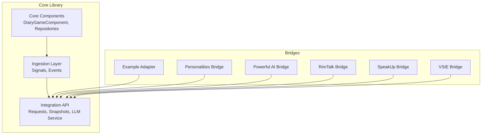
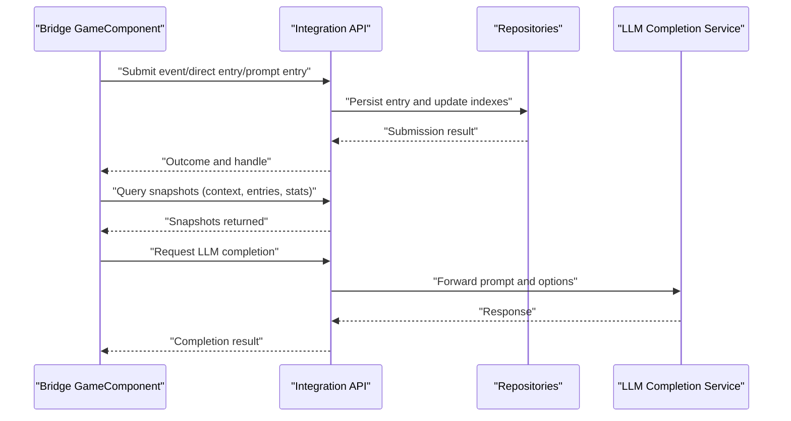
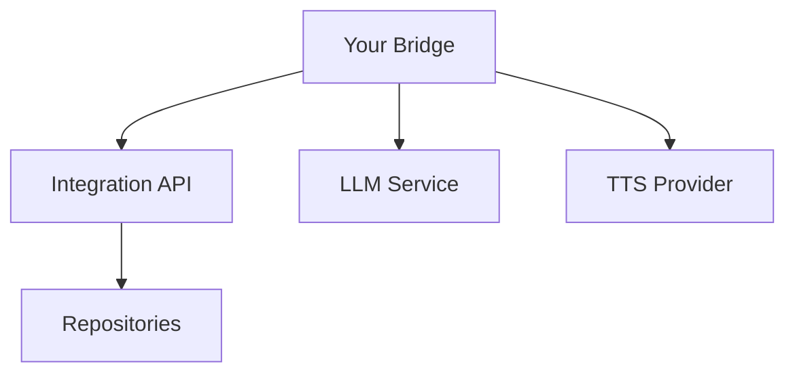

# Common Integration Scenarios

- Personalities123Mod.cs
- [EnneagramSync.cs](../../../../../../integrations/PawnDiary.PersonalitiesBridge/Source/EnneagramSync.cs)
- [PowerfulAiBridgeGameComponent.cs](../../../../../../integrations/PawnDiary.PowerfulAiBridge/Source/PowerfulAiBridgeGameComponent.cs)
- PowerfulAiBridgeMod.cs
- [PowerfulAiReflection.cs](../../../../../../integrations/PawnDiary.PowerfulAiBridge/Source/PowerfulAiReflection.cs)
- [RimTalkBridgeMod.cs](../../../../../../integrations/PawnDiary.RimTalkBridge/Source/PawnDiaryRimTalkBridgeMod.cs)
- [ConversationTracker.cs](../../../../../../integrations/PawnDiary.RimTalkBridge/Source/ConversationTracker.cs)
- [PersonaChattinessPolicyDef.cs](../../../../../../integrations/PawnDiary.RimTalkBridge/Source/PersonaChattinessPolicyDef.cs)
- [RecentDiaryEventCache.cs](../../../../../../integrations/PawnDiary.RimTalkBridge/Source/RecentDiaryEventCache.cs)
- SpeakUpGameComponent.cs
- SpeakUpMod.cs
- VoiceSynthesis.cs
- VsieGameComponent.cs
- VsieMod.cs
- VsieApi.cs
## Table of Contents
1. [Introduction](#introduction)
2. [Project Structure](#project-structure)
3. [Core Components](#core-components)
4. [Architecture Overview](#architecture-overview)
5. [Detailed Component Analysis](#detailed-component-analysis)
6. [Dependency Analysis](#dependency-analysis)
7. [Performance Considerations](#performance-considerations)
8. [Troubleshooting Guide](#troubleshooting-guide)
9. [Conclusion](#conclusion)
10. [Appendices](#appendices)

## Introduction
This document provides practical, step-by-step guides for integrating with the Pawn Diary bridge ecosystem. It focuses on four common scenarios:
- Personality system bridges
- Conversation log integrations
- AI provider bridges
- Voice synthesis connections

It explains data mapping strategies, state synchronization approaches, and performance optimization techniques using real-world examples from existing bridges. The guide also includes troubleshooting tips and debugging techniques specific to bridge development.

## Project Structure
The repository is organized into a core library (Source), multiple integration bridges under integrations/, tests, documentation, and supporting assets. Bridges typically implement a GameComponent that registers capabilities, subscribes to events, and uses the public API to submit entries or request completions.

[No sources needed since this diagram shows conceptual workflow, not actual code structure]

## Core Components
- Public API surface for external integrations: requests, snapshots, and outcomes are defined in the Integration layer.
- Event ingestion pipeline: signals and event types define how game events are captured and routed.
- Repository layer: persistence and retrieval of diary entries and archives.
- Game component orchestration: central lifecycle hooks for initialization, updates, and disposal.

Key responsibilities:
- External submissions: convert bridge-specific payloads into internal models and persist them.
- Context and prompts: provide snapshots and context bundles to external systems.
- LLM completion: route prompt generation through an external service abstraction.

**Section sources**
- [DiaryGameComponent.cs](../../../../../../Source/Core/DiaryGameComponent.cs)
- [DiaryEventRepository.cs](../../../../../../Source/Core/DiaryEventRepository.cs)
- [DiaryArchiveRepository.cs](../../../../../../Source/Core/DiaryArchiveRepository.cs)
- [DiarySignal.cs](../../../../../../Source/Ingestion/DiarySignal.cs)
- [DiaryEvents.cs](../../../../../../Source/Ingestion/DiaryEvents.cs)
- [ExternalEventRequest.cs](../../../../../../Source/Integration/ExternalEventRequest.cs)
- [ExternalDirectEntryRequest.cs](../../../../../../Source/Integration/ExternalDirectEntryRequest.cs)
- [ExternalPromptEntryRequest.cs](../../../../../../Source/Integration/ExternalPromptEntryRequest.cs)
- [ExternalApiLaneRequest.cs](../../../../../../Source/Integration/ExternalApiLaneRequest.cs)
- [DiaryEventSubmissionResult.cs](../../../../../../Source/Integration/DiaryEventSubmissionResult.cs)
- [SubmitEventOutcome.cs](../../../../../../Source/Integration/SubmitEventOutcome.cs)
- [CaptureCapabilities.cs](../../../../../../Source/Integration/CaptureCapabilities.cs)
- [DiaryApiSetupSnapshot.cs](../../../../../../Source/Integration/DiaryApiSetupSnapshot.cs)
- [DiaryContextBundleSnapshot.cs](../../../../../../Source/Integration/DiaryContextBundleSnapshot.cs)
- [DiaryContextSnapshot.cs](../../../../../../Source/Integration/DiaryContextSnapshot.cs)
- [DiaryEntryHandle.cs](../../../../../../Source/Integration/DiaryEntryHandle.cs)
- [DiaryEntrySnapshot.cs](../../../../../../Source/Integration/DiaryEntrySnapshot.cs)
- [DiaryEntryTitleSnapshot.cs](../../../../../../Source/Integration/DiaryEntryTitleSnapshot.cs)
- [DiaryEntryStatsSnapshot.cs](../../../../../../Source/Integration/DiaryEntryStatsSnapshot.cs)
- [DiaryEntryStatusSnapshot.cs](../../../../../../Source/Integration/DiaryEntryStatusSnapshot.cs)
- [DiaryHealthSummarySnapshot.cs](../../../../../../Source/Integration/DiaryHealthSummarySnapshot.cs)
- [DiaryPawnSummarySnapshot.cs](../../../../../../Source/Integration/DiaryPawnSummarySnapshot.cs)
- [DiaryPsychotypeSnapshot.cs](../../../../../../Source/Integration/DiaryPsychotypeSnapshot.cs)
- [DiaryWritingStyleSnapshot.cs](../../../../../../Source/Integration/DiaryWritingStyleSnapshot.cs)
- [DiaryPromptEnchantmentCandidateSnapshot.cs](../../../../../../Source/Integration/DiaryPromptEnchantmentCandidateSnapshot.cs)
- [DiaryPromptPreviewSnapshot.cs](../../../../../../Source/Integration/DiaryPromptPreviewSnapshot.cs)
- [EntryStatusListeners.cs](../../../../../../Source/Integration/EntryStatusListeners.cs)
- [ExternalLlmCompletionService.cs](../../../../../../Source/Integration/ExternalLlmCompletionService.cs)
- [PawnDiaryApi.cs](../../../../../../Source/Integration/PawnDiaryApi.cs)

## Architecture Overview
The bridge architecture follows a clear separation between capture, ingestion, processing, and presentation. Bridges interact via the Integration API, which exposes typed requests and snapshot queries.

**Diagram sources**
- [ExternalEventRequest.cs](../../../../../../Source/Integration/ExternalEventRequest.cs)
- [ExternalDirectEntryRequest.cs](../../../../../../Source/Integration/ExternalDirectEntryRequest.cs)
- [ExternalPromptEntryRequest.cs](../../../../../../Source/Integration/ExternalPromptEntryRequest.cs)
- [DiaryEventSubmissionResult.cs](../../../../../../Source/Integration/DiaryEventSubmissionResult.cs)
- [SubmitEventOutcome.cs](../../../../../../Source/Integration/SubmitEventOutcome.cs)
- [ExternalLlmCompletionService.cs](../../../../../../Source/Integration/ExternalLlmCompletionService.cs)
- [DiaryEventRepository.cs](../../../../../../Source/Core/DiaryEventRepository.cs)
- [DiaryArchiveRepository.cs](../../../../../../Source/Core/DiaryArchiveRepository.cs)

## Detailed Component Analysis

### Personality System Bridges
Goal: Synchronize personality traits, archetypes, or psychological profiles from a personality mod into Pawn Diary’s persona system.

Step-by-step implementation:
1. Initialize a GameComponent in your mod and register it during mod startup.
2. Subscribe to personality changes and expose a sync method that maps external personality fields to internal persona attributes.
3. Use the Integration API to push updates or create entries reflecting personality shifts.
4. Optionally, leverage snapshots to read current persona state for consistency checks.

Real-world example references:
- Mod registration and lifecycle: Personalities123Mod.cs
- GameComponent orchestration: [Personalities123GameComponent.cs](../../../../../../integrations/PawnDiary.PersonalitiesBridge/Source/Personalities123GameComponent.cs)
- Sync logic and mapping: [EnneagramSync.cs](../../../../../../integrations/PawnDiary.PersonalitiesBridge/Source/EnneagramSync.cs)

Data mapping strategy:
- Map external trait keys to internal persona identifiers.
- Normalize values (e.g., enums, scales) to canonical ranges.
- Maintain versioning for compatibility across personality mod updates.

State synchronization approach:
- Debounce frequent updates to avoid excessive writes.
- Apply idempotent updates keyed by personality ID and timestamp.
- Reconcile conflicts by preferring newer timestamps or explicit overrides.

Performance considerations:
- Batch personality updates when possible.
- Cache recent personality snapshots to reduce repeated lookups.
- Avoid heavy computations on the main thread; defer to background tasks if available.

**Section sources**
- Personalities123Mod.cs
- [Personalities123GameComponent.cs](../../../../../../integrations/PawnDiary.PersonalitiesBridge/Source/Personalities123GameComponent.cs)
- [EnneagramSync.cs](../../../../../../integrations/PawnDiary.PersonalitiesBridge/Source/EnneagramSync.cs)
- [DiaryContextSnapshot.cs](../../../../../../Source/Integration/DiaryContextSnapshot.cs)
- [DiaryEntrySnapshot.cs](../../../../../../Source/Integration/DiaryEntrySnapshot.cs)

### Conversation Log Integrations
Goal: Import conversation logs from another mod (e.g., RimTalk) into Pawn Diary to enrich narrative continuity and memory recall.

Step-by-step implementation:
1. Create a GameComponent that listens for conversation events or polls conversation logs at intervals.
2. Parse raw conversation lines into structured messages (speaker, text, timestamp).
3. Convert messages into Diary events or direct entries using the Integration API.
4. Attach metadata such as participants, location, and relationship context.

Real-world example references:
- Mod registration and setup: [RimTalkBridgeMod.cs](../../../../../../integrations/PawnDiary.RimTalkBridge/Source/PawnDiaryRimTalkBridgeMod.cs)
- Conversation tracking and batching: [ConversationTracker.cs](../../../../../../integrations/PawnDiary.RimTalkBridge/Source/ConversationTracker.cs)
- Chattiness policy definitions: [PersonaChattinessPolicyDef.cs](../../../../../../integrations/PawnDiary.RimTalkBridge/Source/PersonaChattinessPolicyDef.cs)
- Recent event caching for context: [RecentDiaryEventCache.cs](../../../../../../integrations/PawnDiary.RimTalkBridge/Source/RecentDiaryEventCache.cs)

Data mapping strategy:
- Map speakers to pawns using unique IDs or names.
- Preserve dialogue order and timing for accurate chronology.
- Extract sentiment cues or topics if available to enhance context.

State synchronization approach:
- Track last processed conversation index to avoid duplicates.
- Merge overlapping conversations by deduplicating based on time windows.
- Update persona chattiness scores incrementally.

Performance considerations:
- Process conversations in batches to reduce I/O pressure.
- Use lightweight parsing and skip unnecessary fields.
- Cache frequently accessed pawn summaries.

**Section sources**
- [RimTalkBridgeMod.cs](../../../../../../integrations/PawnDiary.RimTalkBridge/Source/PawnDiaryRimTalkBridgeMod.cs)
- [ConversationTracker.cs](../../../../../../integrations/PawnDiary.RimTalkBridge/Source/ConversationTracker.cs)
- [PersonaChattinessPolicyDef.cs](../../../../../../integrations/PawnDiary.RimTalkBridge/Source/PersonaChattinessPolicyDef.cs)
- [RecentDiaryEventCache.cs](../../../../../../integrations/PawnDiary.RimTalkBridge/Source/RecentDiaryEventCache.cs)
- [ExternalDirectEntryRequest.cs](../../../../../../Source/Integration/ExternalDirectEntryRequest.cs)
- [DiaryEntryHandle.cs](../../../../../../Source/Integration/DiaryEntryHandle.cs)

### AI Provider Bridges
Goal: Connect external AI providers to generate prompts, reflections, or responses integrated into the diary pipeline.

Step-by-step implementation:
1. Implement a GameComponent that configures provider credentials and endpoints.
2. Build prompts using context snapshots and writing style preferences.
3. Submit requests via the LLM completion service and handle retries/backoff.
4. Store generated content as entries or enrich existing ones with annotations.

Real-world example references:
- Mod registration and setup: PowerfulAiBridgeMod.cs
- GameComponent orchestration: [PowerfulAiBridgeGameComponent.cs](../../../../../../integrations/PawnDiary.PowerfulAiBridge/Source/PowerfulAiBridgeGameComponent.cs)
- Reflection generation and mapping: [PowerfulAiReflection.cs](../../../../../../integrations/PawnDiary.PowerfulAiBridge/Source/PowerfulAiReflection.cs)

Data mapping strategy:
- Translate provider-specific model parameters to internal tuning options.
- Normalize response formats (JSON vs. plain text) before ingestion.
- Tag generated content with provenance metadata for traceability.

State synchronization approach:
- Cache provider capabilities and model lists to minimize network calls.
- Persist partial results to recover from interruptions.
- Align generation schedules with low-activity periods.

Performance considerations:
- Implement exponential backoff and circuit breakers for remote calls.
- Limit concurrent requests to respect rate limits.
- Prefer streaming or chunked responses where supported.

**Section sources**
- PowerfulAiBridgeMod.cs
- [PowerfulAiBridgeGameComponent.cs](../../../../../../integrations/PawnDiary.PowerfulAiBridge/Source/PowerfulAiBridgeGameComponent.cs)
- [PowerfulAiReflection.cs](../../../../../../integrations/PawnDiary.PowerfulAiBridge/Source/PowerfulAiReflection.cs)
- [ExternalLlmCompletionService.cs](../../../../../../Source/Integration/ExternalLlmCompletionService.cs)
- [DiaryContextBundleSnapshot.cs](../../../../../../Source/Integration/DiaryContextBundleSnapshot.cs)

### Voice Synthesis Connections
Goal: Provide voice synthesis for diary entries or character speech, integrating with external TTS services.

Step-by-step implementation:
1. Register a GameComponent to manage TTS provider configuration and audio playback.
2. Generate speech from text using the provider’s API, handling language and voice selection.
3. Cache audio files locally to reduce redundant synthesis.
4. Trigger playback on relevant UI actions or events.

Real-world example references:
- Mod registration and setup: SpeakUpMod.cs
- GameComponent orchestration: SpeakUpGameComponent.cs
- Voice synthesis logic: VoiceSynthesis.cs

Data mapping strategy:
- Map text segments to phonetic tokens or SSML tags if supported.
- Select voices based on persona characteristics or player preferences.
- Preserve pacing and emphasis cues from diary formatting.

State synchronization approach:
- Track synthesized utterances to avoid re-synthesis.
- Invalidate cache entries when provider versions change.
- Queue playback jobs to prevent UI blocking.

Performance considerations:
- Compress audio outputs and use efficient codecs.
- Pre-warm popular voices and languages.
- Offload synthesis to background threads and limit concurrency.

**Section sources**
- SpeakUpMod.cs
- SpeakUpGameComponent.cs
- VoiceSynthesis.cs
- [DiaryEntrySnapshot.cs](../../../../../../Source/Integration/DiaryEntrySnapshot.cs)

### Example Adapter Reference
The Example Adapter demonstrates how to explore and consume the Integration API surface, including listing lanes, querying snapshots, and submitting entries.

Real-world example references:
- GameComponent and API exploration: [ExampleAdapterGameComponent.cs](../../../../../../integrations/PawnDiary.ExampleAdapter/Source/ExampleAdapterGameComponent.cs)
- Example API usage patterns: [PawnDiaryExampleApi.cs](../../../../../../integrations/PawnDiary.ExampleAdapter/Source/PawnDiaryExampleApi.cs)

Use this adapter as a template for building custom bridges:
- Inspect available snapshots and capabilities.
- Practice safe error handling and logging.
- Validate request/response contracts before production deployment.

**Section sources**
- [ExampleAdapterGameComponent.cs](../../../../../../integrations/PawnDiary.ExampleAdapter/Source/ExampleAdapterGameComponent.cs)
- [PawnDiaryExampleApi.cs](../../../../../../integrations/PawnDiary.ExampleAdapter/Source/PawnDiaryExampleApi.cs)

### VSIE Bridge Reference
The VSIE bridge showcases integration with an external system for enhanced interactions and state synchronization.

Real-world example references:
- Mod registration and setup: VsieMod.cs
- GameComponent orchestration: VsieGameComponent.cs
- API usage patterns: VsieApi.cs

Key takeaways:
- Establish robust connection management and health checks.
- Handle asynchronous operations gracefully.
- Keep local state consistent with remote state through reconciliation.

**Section sources**
- VsieMod.cs
- VsieGameComponent.cs
- VsieApi.cs

## Dependency Analysis
Bridges depend on the Integration API for data exchange and on repositories for persistence. They may also rely on external services (AI providers, TTS engines) and must manage their own lifecycle and configuration.

[No sources needed since this diagram shows conceptual workflow, not actual code structure]

## Performance Considerations
- Batch operations: Group multiple submissions or queries to reduce overhead.
- Caching: Store frequently accessed snapshots and computed results locally.
- Throttling: Respect rate limits for external services and implement backoff strategies.
- Background processing: Move heavy work off the main thread to maintain responsiveness.
- Memory management: Evict stale data and avoid retaining large objects unnecessarily.

[No sources needed since this section provides general guidance]

## Troubleshooting Guide
Common issues and debugging techniques:
- Verify API readiness: Check setup snapshots and capability flags before making requests.
- Inspect submission outcomes: Review submission results and status listeners for errors.
- Validate input schemas: Ensure all required fields are present and correctly typed.
- Monitor external service health: Implement health checks and fallbacks for AI/TTS providers.
- Use example adapter: Explore the API surface and reproduce issues in isolation.

Relevant components for diagnostics:
- Setup and capability snapshots: [DiaryApiSetupSnapshot.cs](../../../../../../Source/Integration/DiaryApiSetupSnapshot.cs), [CaptureCapabilities.cs](../../../../../../Source/Integration/CaptureCapabilities.cs)
- Submission results and outcomes: [DiaryEventSubmissionResult.cs](../../../../../../Source/Integration/DiaryEventSubmissionResult.cs), [SubmitEventOutcome.cs](../../../../../../Source/Integration/SubmitEventOutcome.cs)
- Status listeners: [EntryStatusListeners.cs](../../../../../../Source/Integration/EntryStatusListeners.cs)
- Example adapter for exploration: [ExampleAdapterGameComponent.cs](../../../../../../integrations/PawnDiary.ExampleAdapter/Source/ExampleAdapterGameComponent.cs)

**Section sources**
- [DiaryApiSetupSnapshot.cs](../../../../../../Source/Integration/DiaryApiSetupSnapshot.cs)
- [CaptureCapabilities.cs](../../../../../../Source/Integration/CaptureCapabilities.cs)
- [DiaryEventSubmissionResult.cs](../../../../../../Source/Integration/DiaryEventSubmissionResult.cs)
- [SubmitEventOutcome.cs](../../../../../../Source/Integration/SubmitEventOutcome.cs)
- [EntryStatusListeners.cs](../../../../../../Source/Integration/EntryStatusListeners.cs)
- [ExampleAdapterGameComponent.cs](../../../../../../integrations/PawnDiary.ExampleAdapter/Source/ExampleAdapterGameComponent.cs)

## Conclusion
By following the patterns demonstrated in the existing bridges—clear lifecycle management, robust data mapping, careful state synchronization, and performance-conscious design—you can build reliable integrations for personalities, conversations, AI providers, and voice synthesis. Use the Integration API’s typed requests and snapshots to ensure compatibility and maintainability, and leverage the example adapter and diagnostic tools to accelerate development and troubleshooting.

[No sources needed since this section summarizes without analyzing specific files]

## Appendices

### API References and Documentation
- High-level overview and usage: [README.md](../../../../../../README.md)
- External API specification: [EXTERNAL_API.md](../../../../../../EXTERNAL_API.md)
- Additional documentation: [DOCUMENTATION.md](../../../../../../DOCUMENTATION.md)

**Section sources**
- [README.md](../../../../../../README.md)
- [EXTERNAL_API.md](../../../../../../EXTERNAL_API.md)
- [DOCUMENTATION.md](../../../../../../DOCUMENTATION.md)
