# Conversation Log Integrations

<cite>
**Referenced Files in This Document**
- [ConversationAssessmentCoordinator.cs](../../../../../../integrations/PawnDiary.RimTalkBridge/Source/ConversationAssessmentCoordinator.cs)
- [ConversationTracker.cs](../../../../../../integrations/PawnDiary.RimTalkBridge/Source/ConversationTracker.cs)
- [DiaryContextInjector.cs](../../../../../../integrations/PawnDiary.RimTalkBridge/Source/DiaryContextInjector.cs)
- [PawnDiaryRimTalkBridgeApi.cs](../../../../../../integrations/PawnDiary.RimTalkBridge/Source/PawnDiaryRimTalkBridgeApi.cs)
- [DiaryGameComponent.PlayLogSpeech.cs](../../../../../../Source/Core/DiaryGameComponent.PlayLogSpeech.cs)
- [DiaryDirectSpeechParser.cs](../../../../../../Source/Pipeline/DiaryDirectSpeechParser.cs)
- [ExternalEventRequest.cs](../../../../../../Source/Integration/ExternalEventRequest.cs)
- [ExternalDirectEntryRequest.cs](../../../../../../Source/Integration/ExternalDirectEntryRequest.cs)
- [DiaryEventRepository.cs](../../../../../../Source/Core/DiaryEventRepository.cs)
- [DiaryArchiveRepository.cs](../../../../../../Source/Core/DiaryArchiveRepository.cs)
- [DiaryPipelineContracts.cs](../../../../../../Source/Pipeline/DiaryPipelineContracts.cs)
- [DiaryTextDecorations.cs](../../../../../../Source/Pipeline/DiaryTextDecorations.cs)
- [DiaryRichTextDecorators.cs](../../../../../../Source/Pipeline/DiaryRichTextDecorators.cs)
- [DiaryListText.cs](../../../../../../Source/Pipeline/DiaryListText.cs)
- [DiaryParagraphReflow.cs](../../../../../../Source/Pipeline/DiaryParagraphReflow.cs)
- [DiarySentenceExcerpt.cs](../../../../../../Source/Pipeline/DiarySentenceExcerpt.cs)
- [PromptTextSanitizer.cs](../../../../../../Source/Pipeline/PromptTextSanitizer.cs)
- [TextTruncation.cs](../../../../../../Source/Pipeline/TextTruncation.cs)
- [DiaryRetentionPlan.cs](../../../../../../Source/Pipeline/DiaryRetentionPlan.cs)
- [DiaryArchiveEligibility.cs](../../../../../../Source/Pipeline/DiaryArchiveEligibility.cs)
- [DiaryArchiveCompactionPlanner.cs](../../../../../../Source/Pipeline/DiaryArchiveCompactionPlanner.cs)
- [DiarySaveNormalization.cs](../../../../../../Source/Pipeline/DiarySaveNormalization.cs)
- [DiaryEntryStatsAccumulator.cs](../../../../../../Source/Pipeline/DiaryEntryStatsAccumulator.cs)
- [DiaryEventDomainClassifier.cs](../../../../../../Source/Pipeline/DiaryEventDomainClassifier.cs)
- [DiaryResponsePostprocessor.cs](../../../../../../Source/Pipeline/DiaryResponsePostprocessor.cs)
- [DiaryNameHighlighter.cs](../../../../../../Source/Pipeline/DiaryNameHighlighter.cs)
- [DiaryPromptCapture.cs](../../../../../../Source/Pipeline/DiaryPromptCapture.cs)
- [DiaryPromptPlanner.cs](../../../../../../Source/Pipeline/DiaryPromptPlanner.cs)
- [DiaryGenerationStatus.cs](../../../../../../Source/Pipeline/DiaryGenerationStatus.cs)
- [DiaryEventFilterSnapshot.cs](../../../../../../Source/Integration/DiaryEventFilterSnapshot.cs)
- [DiaryEntryHandle.cs](../../../../../../Source/Integration/DiaryEntryHandle.cs)
- [DiaryEntrySnapshot.cs](../../../../../../Source/Integration/DiaryEntrySnapshot.cs)
- [DiaryEntryTitleQuery.cs](../../../../../../Source/Integration/DiaryEntryTitleQuery.cs)
- [DiaryEntryTitleSnapshot.cs](../../../../../../Source/Integration/DiaryEntryTitleSnapshot.cs)
- [DiaryEntryProseSnapshot.cs](../../../../../../Source/Integration/DiaryEntryProseSnapshot.cs)
- [DiaryEntryStatsSnapshot.cs](../../../../../../Source/Integration/DiaryEntryStatsSnapshot.cs)
- [DiaryEntryStatusSnapshot.cs](../../../../../../Source/Integration/DiaryEntryStatusSnapshot.cs)
- [DiaryHealthSummarySnapshot.cs](../../../../../../Source/Integration/DiaryHealthSummarySnapshot.cs)
- [DiaryPromptPreviewSnapshot.cs](../../../../../../Source/Integration/DiaryPromptPreviewSnapshot.cs)
- [DiaryWritingStyleSnapshot.cs](../../../../../../Source/Integration/DiaryWritingStyleSnapshot.cs)
- [DiaryPsychotypeSnapshot.cs](../../../../../../Source/Integration/DiaryPsychotypeSnapshot.cs)
- [DiaryPromptEnchantmentCandidateSnapshot.cs](../../../../../../Source/Integration/DiaryPromptEnchantmentCandidateSnapshot.cs)
- [DiaryContextBundleSnapshot.cs](../../../../../../Source/Integration/DiaryContextBundleSnapshot.cs)
- [DiaryContextSnapshot.cs](../../../../../../Source/Integration/DiaryContextSnapshot.cs)
- [DiaryApiLaneSnapshot.cs](../../../../../../Source/Integration/DiaryApiLaneSnapshot.cs)
- [DiaryApiSetupSnapshot.cs](../../../../../../Source/Integration/DiaryApiSetupSnapshot.cs)
- [CaptureCapabilities.cs](../../../../../../Source/Integration/CaptureCapabilities.cs)
- [AddApiLaneResult.cs](../../../../../../Source/Integration/AddApiLaneResult.cs)
- [ExternalApiLaneRequest.cs](../../../../../../Source/Integration/ExternalApiLaneRequest.cs)
- [SubmitEventOutcome.cs](../../../../../../Source/Integration/SubmitEventOutcome.cs)
- [DiaryEventSubmissionResult.cs](../../../../../../Source/Integration/DiaryEventSubmissionResult.cs)
- [EntryStatusListeners.cs](../../../../../../Source/Integration/EntryStatusListeners.cs)
- [PawnContextProviders.cs](../../../../../../Source/Integration/PawnContextProviders.cs)
- [ExternalLlmCompletionService.cs](../../../../../../Source/Integration/ExternalLlmCompletionService.cs)
- [ExternalDirectEntryText.cs](../../../../../../Source/Pipeline/ExternalDirectEntryText.cs)
- [ExternalEventRequestText.cs](../../../../../../Source/Pipeline/ExternalEventRequestText.cs)
- [ExternalOverrideArbitration.cs](../../../../../../Source/Pipeline/ExternalOverrideArbitration.cs)
- [ExternalWritingStyleOverrideText.cs](../../../../../../Source/Pipeline/ExternalWritingStyleOverrideText.cs)
- [PlayerWritingStyleText.cs](../../../../../../Source/Pipeline/PlayerWritingStyleText.cs)
- [PsychotypeText.cs](../../../../../../Source/Pipeline/PsychotypeText.cs)
- [DiaryTextDecorationFactCodec.cs](../../../../../../Source/Pipeline/DiaryTextDecorationFactCodec.cs)
- [DiaryTextDecorationMatcher.cs](../../../../../../Source/Pipeline/DiaryTextDecorationMatcher.cs)
- [DiaryTextDecorationText.cs](../../../../../../Source/Pipeline/DiaryTextDecorationText.cs)
</cite>

## Table of Contents
1. [Introduction](#introduction)
2. [Project Structure](#project-structure)
3. [Core Components](#core-components)
4. [Architecture Overview](#architecture-overview)
5. [Detailed Component Analysis](#detailed-component-analysis)
6. [Dependency Analysis](#dependency-analysis)
7. [Performance Considerations](#performance-considerations)
8. [Troubleshooting Guide](#troubleshooting-guide)
9. [Conclusion](#conclusion)
10. [Appendices](#appendices)

## Introduction
This document explains how to integrate conversation logs into the diary system for real-time processing, text extraction, context preservation, and long-term synchronization. It focuses on:
- Conversation capture mechanisms from external mods (e.g., RimTalk)
- Assessment coordination across multiple sources
- Dialogue history synchronization with the core diary pipeline
- Real-time processing and text extraction techniques
- Context preservation strategies for coherent narrative generation
- Implementation examples for integrating with conversation mods
- Handling different conversation formats
- Performance optimization for large conversation histories

## Project Structure
The repository organizes conversation integration primarily under integrations and core/pipeline modules:
- Integration bridges (e.g., RimTalk bridge) provide capture, tracking, and assessment coordination
- Core components manage event repositories, play log speech, and API surfaces
- Pipeline utilities handle text parsing, decoration, retention, and archival

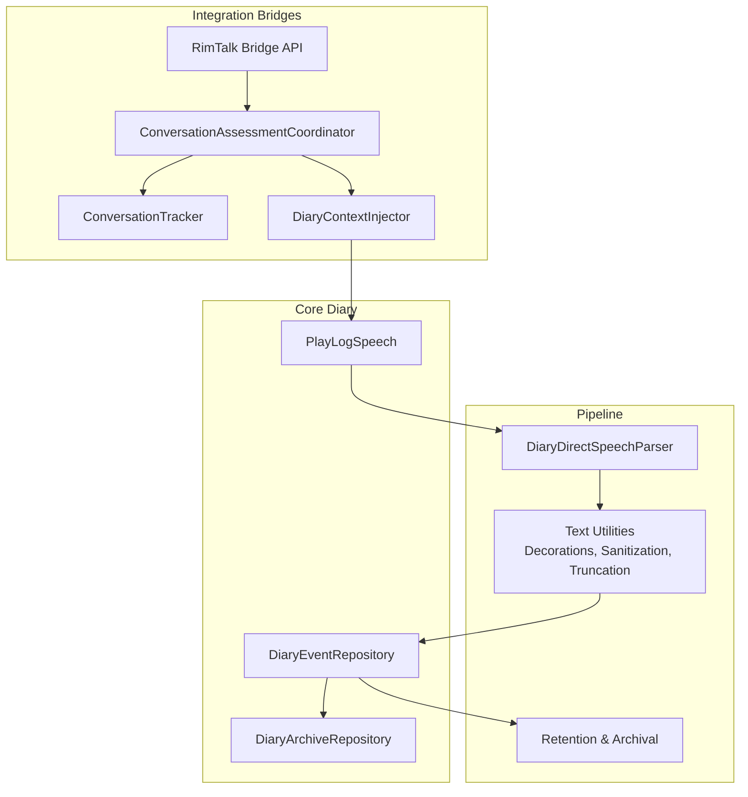

**Diagram sources**
- [ConversationAssessmentCoordinator.cs](../../../../../../integrations/PawnDiary.RimTalkBridge/Source/ConversationAssessmentCoordinator.cs)
- [ConversationTracker.cs](../../../../../../integrations/PawnDiary.RimTalkBridge/Source/ConversationTracker.cs)
- [DiaryContextInjector.cs](../../../../../../integrations/PawnDiary.RimTalkBridge/Source/DiaryContextInjector.cs)
- [DiaryGameComponent.PlayLogSpeech.cs](../../../../../../Source/Core/DiaryGameComponent.PlayLogSpeech.cs)
- [DiaryEventRepository.cs](../../../../../../Source/Core/DiaryEventRepository.cs)
- [DiaryArchiveRepository.cs](../../../../../../Source/Core/DiaryArchiveRepository.cs)
- [DiaryDirectSpeechParser.cs](../../../../../../Source/Pipeline/DiaryDirectSpeechParser.cs)
- [DiaryTextDecorations.cs](../../../../../../Source/Pipeline/DiaryTextDecorations.cs)
- [DiaryRetentionPlan.cs](../../../../../../Source/Pipeline/DiaryRetentionPlan.cs)

**Section sources**
- [ConversationAssessmentCoordinator.cs](../../../../../../integrations/PawnDiary.RimTalkBridge/Source/ConversationAssessmentCoordinator.cs)
- [ConversationTracker.cs](../../../../../../integrations/PawnDiary.RimTalkBridge/Source/ConversationTracker.cs)
- [DiaryContextInjector.cs](../../../../../../integrations/PawnDiary.RimTalkBridge/Source/DiaryContextInjector.cs)
- [DiaryGameComponent.PlayLogSpeech.cs](../../../../../../Source/Core/DiaryGameComponent.PlayLogSpeech.cs)
- [DiaryEventRepository.cs](../../../../../../Source/Core/DiaryEventRepository.cs)
- [DiaryArchiveRepository.cs](../../../../../../Source/Core/DiaryArchiveRepository.cs)
- [DiaryDirectSpeechParser.cs](../../../../../../Source/Pipeline/DiaryDirectSpeechParser.cs)
- [DiaryTextDecorations.cs](../../../../../../Source/Pipeline/DiaryTextDecorations.cs)
- [DiaryRetentionPlan.cs](../../../../../../Source/Pipeline/DiaryRetentionPlan.cs)

## Core Components
- ConversationAssessmentCoordinator: Coordinates assessments across multiple conversation sources, merges signals, and drives consistent entry creation.
- ConversationTracker: Tracks ongoing dialogues, manages turn state, and exposes recent conversation snapshots for injection.
- DiaryContextInjector: Injects conversation context into the diary pipeline, ensuring continuity and relevance.
- PlayLogSpeech: Bridges game play log speech events into the diary system for unified processing.
- Direct Speech Parser: Extracts structured dialogue lines from raw text, normalizing speaker, utterance, and metadata.
- Text Utilities: Provide sanitization, decoration, truncation, and formatting to preserve readability and performance.
- Retention and Archival: Plan retention windows, compact archives, and normalize saves for efficient storage.

**Section sources**
- [ConversationAssessmentCoordinator.cs](../../../../../../integrations/PawnDiary.RimTalkBridge/Source/ConversationAssessmentCoordinator.cs)
- [ConversationTracker.cs](../../../../../../integrations/PawnDiary.RimTalkBridge/Source/ConversationTracker.cs)
- [DiaryContextInjector.cs](../../../../../../integrations/PawnDiary.RimTalkBridge/Source/DiaryContextInjector.cs)
- [DiaryGameComponent.PlayLogSpeech.cs](../../../../../../Source/Core/DiaryGameComponent.PlayLogSpeech.cs)
- [DiaryDirectSpeechParser.cs](../../../../../../Source/Pipeline/DiaryDirectSpeechParser.cs)
- [DiaryTextDecorations.cs](../../../../../../Source/Pipeline/DiaryTextDecorations.cs)
- [DiaryRetentionPlan.cs](../../../../../../Source/Pipeline/DiaryRetentionPlan.cs)

## Architecture Overview
The integration architecture connects external conversation sources to the diary pipeline through a coordinated assessment and injection flow. The diagram maps actual source files to their roles.

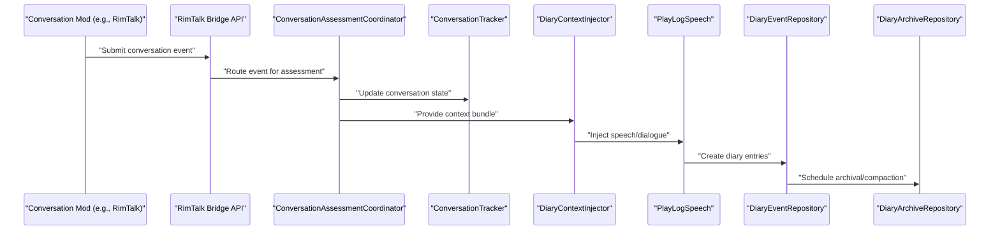

**Diagram sources**
- [ConversationAssessmentCoordinator.cs](../../../../../../integrations/PawnDiary.RimTalkBridge/Source/ConversationAssessmentCoordinator.cs)
- [ConversationTracker.cs](../../../../../../integrations/PawnDiary.RimTalkBridge/Source/ConversationTracker.cs)
- [DiaryContextInjector.cs](../../../../../../integrations/PawnDiary.RimTalkBridge/Source/DiaryContextInjector.cs)
- [DiaryGameComponent.PlayLogSpeech.cs](../../../../../../Source/Core/DiaryGameComponent.PlayLogSpeech.cs)
- [DiaryEventRepository.cs](../../../../../../Source/Core/DiaryEventRepository.cs)
- [DiaryArchiveRepository.cs](../../../../../../Source/Core/DiaryArchiveRepository.cs)

## Detailed Component Analysis

### Conversation Capture Mechanisms
- External mod submission flows through the RimTalk Bridge API into the assessment coordinator.
- The coordinator evaluates incoming events, merges overlapping conversations, and delegates to the tracker for state management.
- The injector prepares context bundles that include speaker identity, relationship context, and prior dialogue references.

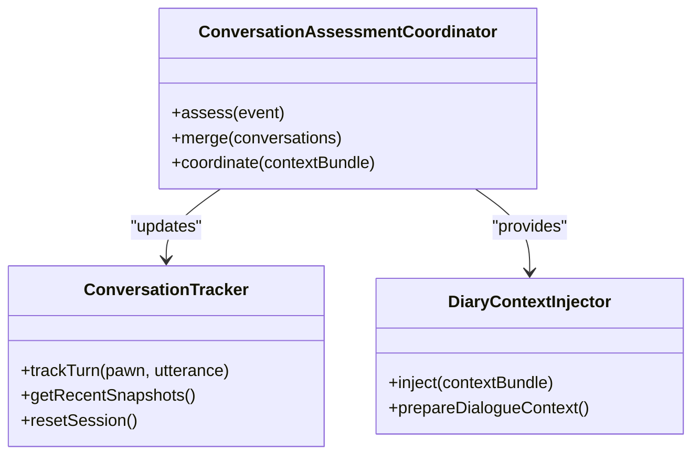

**Diagram sources**
- [ConversationAssessmentCoordinator.cs](../../../../../../integrations/PawnDiary.RimTalkBridge/Source/ConversationAssessmentCoordinator.cs)
- [ConversationTracker.cs](../../../../../../integrations/PawnDiary.RimTalkBridge/Source/ConversationTracker.cs)
- [DiaryContextInjector.cs](../../../../../../integrations/PawnDiary.RimTalkBridge/Source/DiaryContextInjector.cs)

**Section sources**
- [ConversationAssessmentCoordinator.cs](../../../../../../integrations/PawnDiary.RimTalkBridge/Source/ConversationAssessmentCoordinator.cs)
- [ConversationTracker.cs](../../../../../../integrations/PawnDiary.RimTalkBridge/Source/ConversationTracker.cs)
- [DiaryContextInjector.cs](../../../../../../integrations/PawnDiary.RimTalkBridge/Source/DiaryContextInjector.cs)

### Assessment Coordination
- The coordinator applies policies to decide whether to create new entries or append to existing ones.
- It coordinates with external prompts and writing style overrides to ensure consistent tone and content.
- It integrates with prompt planning and capture to enrich entries with relevant context.

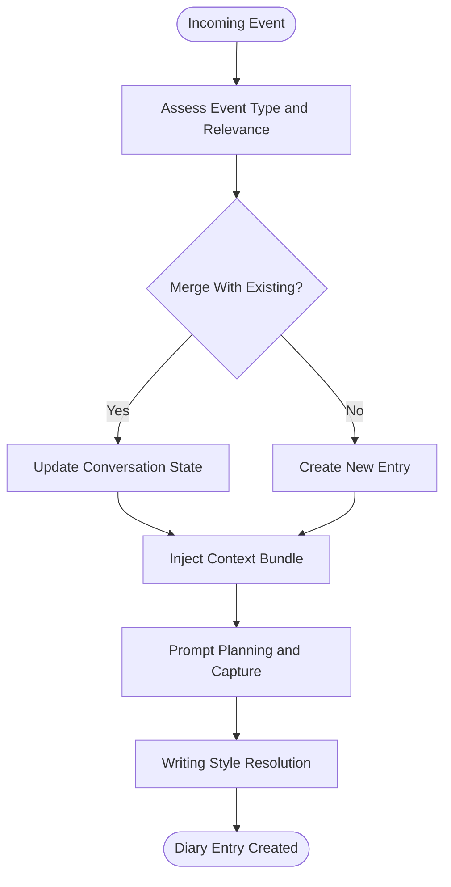

**Diagram sources**
- [ConversationAssessmentCoordinator.cs](../../../../../../integrations/PawnDiary.RimTalkBridge/Source/ConversationAssessmentCoordinator.cs)
- [DiaryPromptCapture.cs](../../../../../../Source/Pipeline/DiaryPromptCapture.cs)
- [DiaryPromptPlanner.cs](../../../../../../Source/Pipeline/DiaryPromptPlanner.cs)
- [ExternalWritingStyleOverrideText.cs](../../../../../../Source/Pipeline/ExternalWritingStyleOverrideText.cs)
- [PlayerWritingStyleText.cs](../../../../../../Source/Pipeline/PlayerWritingStyleText.cs)

**Section sources**
- [ConversationAssessmentCoordinator.cs](../../../../../../integrations/PawnDiary.RimTalkBridge/Source/ConversationAssessmentCoordinator.cs)
- [DiaryPromptCapture.cs](../../../../../../Source/Pipeline/DiaryPromptCapture.cs)
- [DiaryPromptPlanner.cs](../../../../../../Source/Pipeline/DiaryPromptPlanner.cs)
- [ExternalWritingStyleOverrideText.cs](../../../../../../Source/Pipeline/ExternalWritingStyleOverrideText.cs)
- [PlayerWritingStyleText.cs](../../../../../../Source/Pipeline/PlayerWritingStyleText.cs)

### Dialogue History Synchronization
- The tracker maintains recent snapshots and session boundaries to keep history synchronized across components.
- The injector ensures that newly created entries reference prior context accurately.
- Repositories persist entries and coordinate archival for long-term storage.

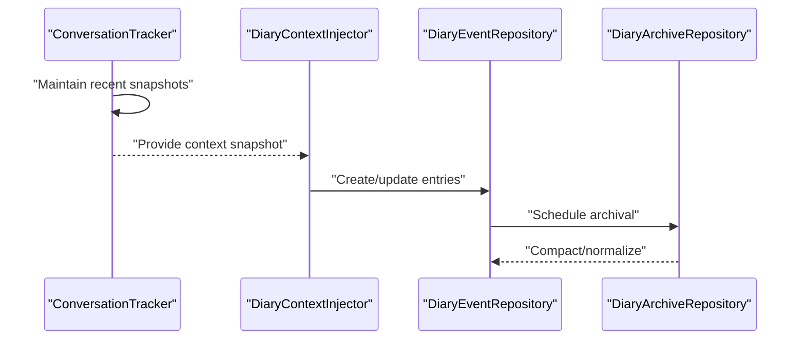

**Diagram sources**
- [ConversationTracker.cs](../../../../../../integrations/PawnDiary.RimTalkBridge/Source/ConversationTracker.cs)
- [DiaryContextInjector.cs](../../../../../../integrations/PawnDiary.RimTalkBridge/Source/DiaryContextInjector.cs)
- [DiaryEventRepository.cs](../../../../../../Source/Core/DiaryEventRepository.cs)
- [DiaryArchiveRepository.cs](../../../../../../Source/Core/DiaryArchiveRepository.cs)

**Section sources**
- [ConversationTracker.cs](../../../../../../integrations/PawnDiary.RimTalkBridge/Source/ConversationTracker.cs)
- [DiaryContextInjector.cs](../../../../../../integrations/PawnDiary.RimTalkBridge/Source/DiaryContextInjector.cs)
- [DiaryEventRepository.cs](../../../../../../Source/Core/DiaryEventRepository.cs)
- [DiaryArchiveRepository.cs](../../../../../../Source/Core/DiaryArchiveRepository.cs)

### Real-Time Conversation Processing
- Play log speech events are captured and routed to the direct speech parser for normalization.
- The parser extracts speaker, utterance, and metadata, enabling immediate entry creation and context updates.

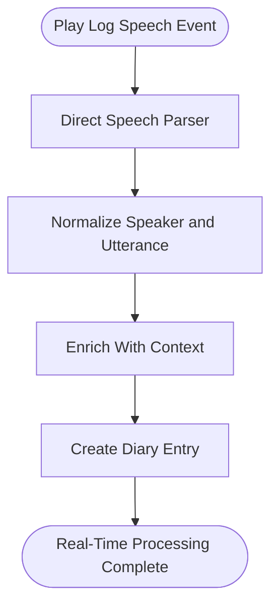

**Diagram sources**
- [DiaryGameComponent.PlayLogSpeech.cs](../../../../../../Source/Core/DiaryGameComponent.PlayLogSpeech.cs)
- [DiaryDirectSpeechParser.cs](../../../../../../Source/Pipeline/DiaryDirectSpeechParser.cs)

**Section sources**
- [DiaryGameComponent.PlayLogSpeech.cs](../../../../../../Source/Core/DiaryGameComponent.PlayLogSpeech.cs)
- [DiaryDirectSpeechParser.cs](../../../../../../Source/Pipeline/DiaryDirectSpeechParser.cs)

### Text Extraction Techniques
- Direct speech parsing isolates dialogue lines from raw text.
- Text decorations and name highlighting improve readability and context awareness.
- Sanitization removes unwanted artifacts; truncation controls size for performance.

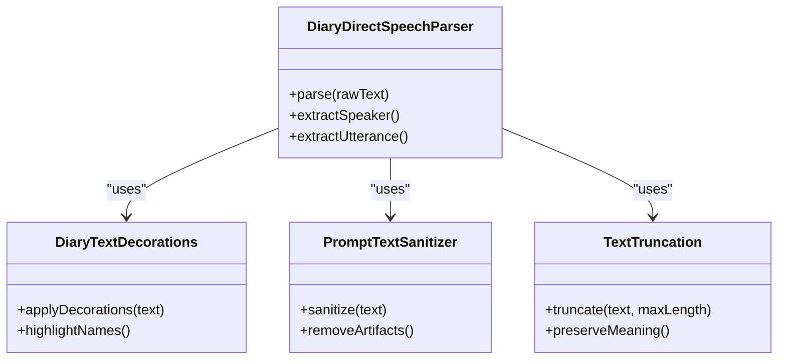

**Diagram sources**
- [DiaryDirectSpeechParser.cs](../../../../../../Source/Pipeline/DiaryDirectSpeechParser.cs)
- [DiaryTextDecorations.cs](../../../../../../Source/Pipeline/DiaryTextDecorations.cs)
- [DiaryNameHighlighter.cs](../../../../../../Source/Pipeline/DiaryNameHighlighter.cs)
- [PromptTextSanitizer.cs](../../../../../../Source/Pipeline/PromptTextSanitizer.cs)
- [TextTruncation.cs](../../../../../../Source/Pipeline/TextTruncation.cs)

**Section sources**
- [DiaryDirectSpeechParser.cs](../../../../../../Source/Pipeline/DiaryDirectSpeechParser.cs)
- [DiaryTextDecorations.cs](../../../../../../Source/Pipeline/DiaryTextDecorations.cs)
- [DiaryNameHighlighter.cs](../../../../../../Source/Pipeline/DiaryNameHighlighter.cs)
- [PromptTextSanitizer.cs](../../../../../../Source/Pipeline/PromptTextSanitizer.cs)
- [TextTruncation.cs](../../../../../../Source/Pipeline/TextTruncation.cs)

### Context Preservation Strategies
- Context bundles carry speaker identity, relationships, and prior dialogue references.
- Narrative continuity is maintained via prompt planning and response postprocessing.
- Writing style resolution ensures consistent voice across entries.

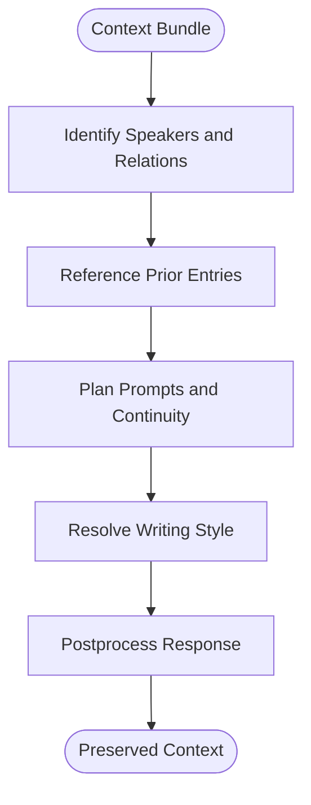

**Diagram sources**
- [DiaryContextInjector.cs](../../../../../../integrations/PawnDiary.RimTalkBridge/Source/DiaryContextInjector.cs)
- [DiaryPromptPlanner.cs](../../../../../../Source/Pipeline/DiaryPromptPlanner.cs)
- [DiaryResponsePostprocessor.cs](../../../../../../Source/Pipeline/DiaryResponsePostprocessor.cs)
- [ExternalWritingStyleOverrideText.cs](../../../../../../Source/Pipeline/ExternalWritingStyleOverrideText.cs)
- [PlayerWritingStyleText.cs](../../../../../../Source/Pipeline/PlayerWritingStyleText.cs)

**Section sources**
- [DiaryContextInjector.cs](../../../../../../integrations/PawnDiary.RimTalkBridge/Source/DiaryContextInjector.cs)
- [DiaryPromptPlanner.cs](../../../../../../Source/Pipeline/DiaryPromptPlanner.cs)
- [DiaryResponsePostprocessor.cs](../../../../../../Source/Pipeline/DiaryResponsePostprocessor.cs)
- [ExternalWritingStyleOverrideText.cs](../../../../../../Source/Pipeline/ExternalWritingStyleOverrideText.cs)
- [PlayerWritingStyleText.cs](../../../../../../Source/Pipeline/PlayerWritingStyleText.cs)

### Integration Examples
- Submitting conversation events via the RimTalk Bridge API
- Using external event requests and direct entry requests for custom formats
- Leveraging API lanes and snapshots for inspection and debugging

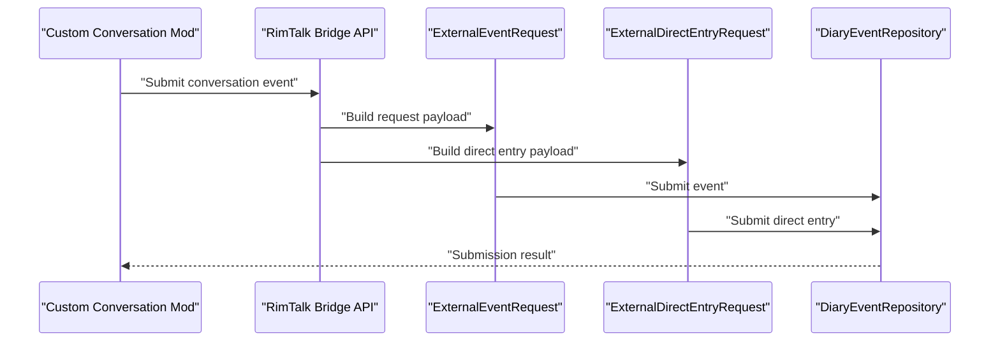

**Diagram sources**
- [PawnDiaryRimTalkBridgeApi.cs](../../../../../../integrations/PawnDiary.RimTalkBridge/Source/PawnDiaryRimTalkBridgeApi.cs)
- [ExternalEventRequest.cs](../../../../../../Source/Integration/ExternalEventRequest.cs)
- [ExternalDirectEntryRequest.cs](../../../../../../Source/Integration/ExternalDirectEntryRequest.cs)
- [DiaryEventRepository.cs](../../../../../../Source/Core/DiaryEventRepository.cs)

**Section sources**
- [PawnDiaryRimTalkBridgeApi.cs](../../../../../../integrations/PawnDiary.RimTalkBridge/Source/PawnDiaryRimTalkBridgeApi.cs)
- [ExternalEventRequest.cs](../../../../../../Source/Integration/ExternalEventRequest.cs)
- [ExternalDirectEntryRequest.cs](../../../../../../Source/Integration/ExternalDirectEntryRequest.cs)
- [DiaryEventRepository.cs](../../../../../../Source/Core/DiaryEventRepository.cs)

### Handling Different Conversation Formats
- External event requests support varied payloads and metadata.
- Direct entry requests allow raw text submissions with optional attribution and style overrides.
- Arbitration resolves conflicts between multiple sources and overrides.

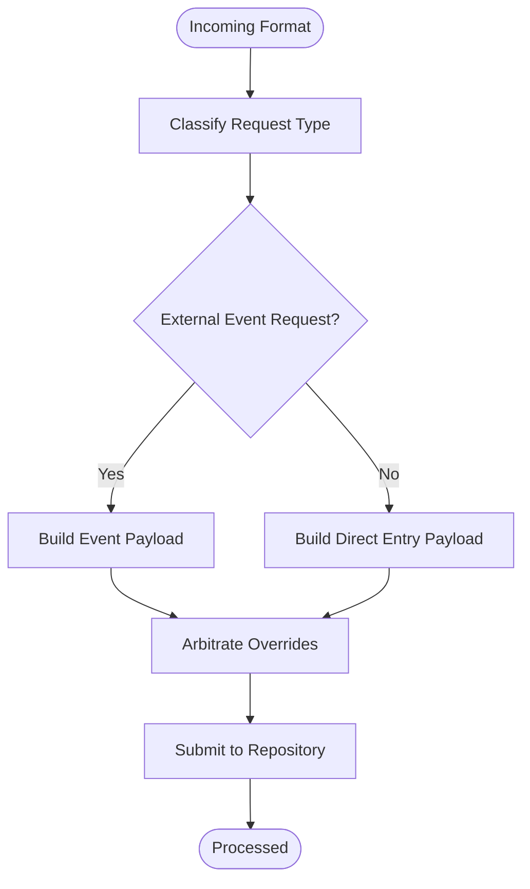

**Diagram sources**
- [ExternalEventRequest.cs](../../../../../../Source/Integration/ExternalEventRequest.cs)
- [ExternalDirectEntryRequest.cs](../../../../../../Source/Integration/ExternalDirectEntryRequest.cs)
- [ExternalOverrideArbitration.cs](../../../../../../Source/Pipeline/ExternalOverrideArbitration.cs)

**Section sources**
- [ExternalEventRequest.cs](../../../../../../Source/Integration/ExternalEventRequest.cs)
- [ExternalDirectEntryRequest.cs](../../../../../../Source/Integration/ExternalDirectEntryRequest.cs)
- [ExternalOverrideArbitration.cs](../../../../../../Source/Pipeline/ExternalOverrideArbitration.cs)

### Optimizing Performance for Large Histories
- Retention plans define windows for keeping active vs. archived entries.
- Archival eligibility determines when entries move to archive storage.
- Compaction planners reduce storage overhead while preserving retrieval efficiency.
- Save normalization ensures consistent serialization and faster load times.

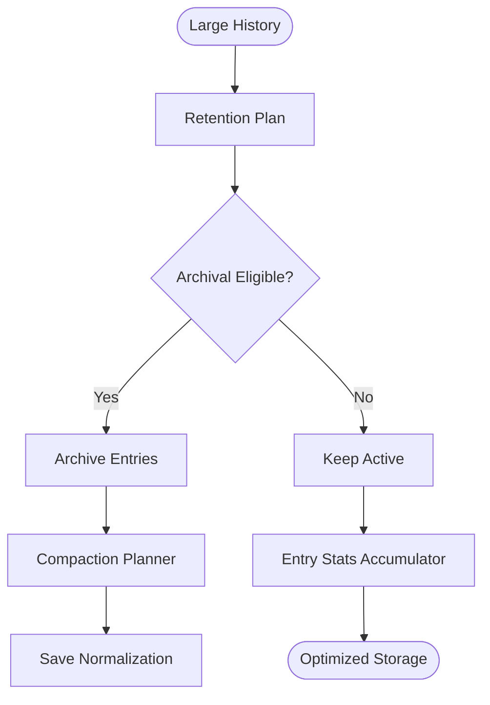

**Diagram sources**
- [DiaryRetentionPlan.cs](../../../../../../Source/Pipeline/DiaryRetentionPlan.cs)
- [DiaryArchiveEligibility.cs](../../../../../../Source/Pipeline/DiaryArchiveEligibility.cs)
- [DiaryArchiveCompactionPlanner.cs](../../../../../../Source/Pipeline/DiaryArchiveCompactionPlanner.cs)
- [DiarySaveNormalization.cs](../../../../../../Source/Pipeline/DiarySaveNormalization.cs)
- [DiaryEntryStatsAccumulator.cs](../../../../../../Source/Pipeline/DiaryEntryStatsAccumulator.cs)

**Section sources**
- [DiaryRetentionPlan.cs](../../../../../../Source/Pipeline/DiaryRetentionPlan.cs)
- [DiaryArchiveEligibility.cs](../../../../../../Source/Pipeline/DiaryArchiveEligibility.cs)
- [DiaryArchiveCompactionPlanner.cs](../../../../../../Source/Pipeline/DiaryArchiveCompactionPlanner.cs)
- [DiarySaveNormalization.cs](../../../../../../Source/Pipeline/DiarySaveNormalization.cs)
- [DiaryEntryStatsAccumulator.cs](../../../../../../Source/Pipeline/DiaryEntryStatsAccumulator.cs)

## Dependency Analysis
The following diagram shows key dependencies among integration and pipeline components.

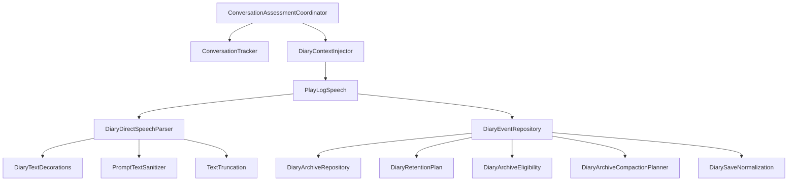

**Diagram sources**
- [ConversationAssessmentCoordinator.cs](../../../../../../integrations/PawnDiary.RimTalkBridge/Source/ConversationAssessmentCoordinator.cs)
- [ConversationTracker.cs](../../../../../../integrations/PawnDiary.RimTalkBridge/Source/ConversationTracker.cs)
- [DiaryContextInjector.cs](../../../../../../integrations/PawnDiary.RimTalkBridge/Source/DiaryContextInjector.cs)
- [DiaryGameComponent.PlayLogSpeech.cs](../../../../../../Source/Core/DiaryGameComponent.PlayLogSpeech.cs)
- [DiaryDirectSpeechParser.cs](../../../../../../Source/Pipeline/DiaryDirectSpeechParser.cs)
- [DiaryTextDecorations.cs](../../../../../../Source/Pipeline/DiaryTextDecorations.cs)
- [PromptTextSanitizer.cs](../../../../../../Source/Pipeline/PromptTextSanitizer.cs)
- [TextTruncation.cs](../../../../../../Source/Pipeline/TextTruncation.cs)
- [DiaryEventRepository.cs](../../../../../../Source/Core/DiaryEventRepository.cs)
- [DiaryArchiveRepository.cs](../../../../../../Source/Core/DiaryArchiveRepository.cs)
- [DiaryRetentionPlan.cs](../../../../../../Source/Pipeline/DiaryRetentionPlan.cs)
- [DiaryArchiveEligibility.cs](../../../../../../Source/Pipeline/DiaryArchiveEligibility.cs)
- [DiaryArchiveCompactionPlanner.cs](../../../../../../Source/Pipeline/DiaryArchiveCompactionPlanner.cs)
- [DiarySaveNormalization.cs](../../../../../../Source/Pipeline/DiarySaveNormalization.cs)

**Section sources**
- [ConversationAssessmentCoordinator.cs](../../../../../../integrations/PawnDiary.RimTalkBridge/Source/ConversationAssessmentCoordinator.cs)
- [ConversationTracker.cs](../../../../../../integrations/PawnDiary.RimTalkBridge/Source/ConversationTracker.cs)
- [DiaryContextInjector.cs](../../../../../../integrations/PawnDiary.RimTalkBridge/Source/DiaryContextInjector.cs)
- [DiaryGameComponent.PlayLogSpeech.cs](../../../../../../Source/Core/DiaryGameComponent.PlayLogSpeech.cs)
- [DiaryDirectSpeechParser.cs](../../../../../../Source/Pipeline/DiaryDirectSpeechParser.cs)
- [DiaryTextDecorations.cs](../../../../../../Source/Pipeline/DiaryTextDecorations.cs)
- [PromptTextSanitizer.cs](../../../../../../Source/Pipeline/PromptTextSanitizer.cs)
- [TextTruncation.cs](../../../../../../Source/Pipeline/TextTruncation.cs)
- [DiaryEventRepository.cs](../../../../../../Source/Core/DiaryEventRepository.cs)
- [DiaryArchiveRepository.cs](../../../../../../Source/Core/DiaryArchiveRepository.cs)
- [DiaryRetentionPlan.cs](../../../../../../Source/Pipeline/DiaryRetentionPlan.cs)
- [DiaryArchiveEligibility.cs](../../../../../../Source/Pipeline/DiaryArchiveEligibility.cs)
- [DiaryArchiveCompactionPlanner.cs](../../../../../../Source/Pipeline/DiaryArchiveCompactionPlanner.cs)
- [DiarySaveNormalization.cs](../../../../../../Source/Pipeline/DiarySaveNormalization.cs)

## Performance Considerations
- Use truncation and sanitization to control memory usage during parsing.
- Apply retention plans to limit active history size and defer heavy operations to archival.
- Leverage compaction and normalization to reduce I/O overhead on save/load cycles.
- Monitor entry stats to identify bottlenecks and adjust thresholds accordingly.

[No sources needed since this section provides general guidance]

## Troubleshooting Guide
Common issues and resolutions:
- Duplicate entries: Ensure assessment coordination merges overlapping conversations correctly.
- Missing context: Verify context bundles include speaker identity and prior references.
- Formatting problems: Check text decorations and name highlighting configurations.
- Slow archival: Review retention eligibility and compaction planner settings.

**Section sources**
- [ConversationAssessmentCoordinator.cs](../../../../../../integrations/PawnDiary.RimTalkBridge/Source/ConversationAssessmentCoordinator.cs)
- [DiaryContextInjector.cs](../../../../../../integrations/PawnDiary.RimTalkBridge/Source/DiaryContextInjector.cs)
- [DiaryTextDecorations.cs](../../../../../../Source/Pipeline/DiaryTextDecorations.cs)
- [DiaryRetentionPlan.cs](../../../../../../Source/Pipeline/DiaryRetentionPlan.cs)
- [DiaryArchiveCompactionPlanner.cs](../../../../../../Source/Pipeline/DiaryArchiveCompactionPlanner.cs)

## Conclusion
Integrating conversation logs into the diary system involves coordinated capture, assessment, and injection processes. By leveraging the RimTalk bridge, robust text extraction, and strong context preservation, developers can achieve real-time processing and reliable synchronization. Proper retention and archival strategies ensure scalability for large histories while maintaining performance and readability.

[No sources needed since this section summarizes without analyzing specific files]

## Appendices

### API Surface for Integrations
Key integration types and snapshots used by external mods:
- External event requests and direct entry requests for submission
- API lane snapshots and setup snapshots for inspection
- Entry handles and various entry snapshots for querying and display
- Health summaries, prompt previews, and psychotype/writing style snapshots for diagnostics

**Section sources**
- [ExternalEventRequest.cs](../../../../../../Source/Integration/ExternalEventRequest.cs)
- [ExternalDirectEntryRequest.cs](../../../../../../Source/Integration/ExternalDirectEntryRequest.cs)
- [DiaryApiLaneSnapshot.cs](../../../../../../Source/Integration/DiaryApiLaneSnapshot.cs)
- [DiaryApiSetupSnapshot.cs](../../../../../../Source/Integration/DiaryApiSetupSnapshot.cs)
- [DiaryEntryHandle.cs](../../../../../../Source/Integration/DiaryEntryHandle.cs)
- [DiaryEntrySnapshot.cs](../../../../../../Source/Integration/DiaryEntrySnapshot.cs)
- [DiaryEntryTitleQuery.cs](../../../../../../Source/Integration/DiaryEntryTitleQuery.cs)
- [DiaryEntryTitleSnapshot.cs](../../../../../../Source/Integration/DiaryEntryTitleSnapshot.cs)
- [DiaryEntryProseSnapshot.cs](../../../../../../Source/Integration/DiaryEntryProseSnapshot.cs)
- [DiaryEntryStatsSnapshot.cs](../../../../../../Source/Integration/DiaryEntryStatsSnapshot.cs)
- [DiaryEntryStatusSnapshot.cs](../../../../../../Source/Integration/DiaryEntryStatusSnapshot.cs)
- [DiaryHealthSummarySnapshot.cs](../../../../../../Source/Integration/DiaryHealthSummarySnapshot.cs)
- [DiaryPromptPreviewSnapshot.cs](../../../../../../Source/Integration/DiaryPromptPreviewSnapshot.cs)
- [DiaryWritingStyleSnapshot.cs](../../../../../../Source/Integration/DiaryWritingStyleSnapshot.cs)
- [DiaryPsychotypeSnapshot.cs](../../../../../../Source/Integration/DiaryPsychotypeSnapshot.cs)
- [DiaryPromptEnchantmentCandidateSnapshot.cs](../../../../../../Source/Integration/DiaryPromptEnchantmentCandidateSnapshot.cs)
- [DiaryContextBundleSnapshot.cs](../../../../../../Source/Integration/DiaryContextBundleSnapshot.cs)
- [DiaryContextSnapshot.cs](../../../../../../Source/Integration/DiaryContextSnapshot.cs)
- [CaptureCapabilities.cs](../../../../../../Source/Integration/CaptureCapabilities.cs)
- [AddApiLaneResult.cs](../../../../../../Source/Integration/AddApiLaneResult.cs)
- [ExternalApiLaneRequest.cs](../../../../../../Source/Integration/ExternalApiLaneRequest.cs)
- [SubmitEventOutcome.cs](../../../../../../Source/Integration/SubmitEventOutcome.cs)
- [DiaryEventSubmissionResult.cs](../../../../../../Source/Integration/DiaryEventSubmissionResult.cs)
- [EntryStatusListeners.cs](../../../../../../Source/Integration/EntryStatusListeners.cs)
- [PawnContextProviders.cs](../../../../../../Source/Integration/PawnContextProviders.cs)
- [ExternalLlmCompletionService.cs](../../../../../../Source/Integration/ExternalLlmCompletionService.cs)
