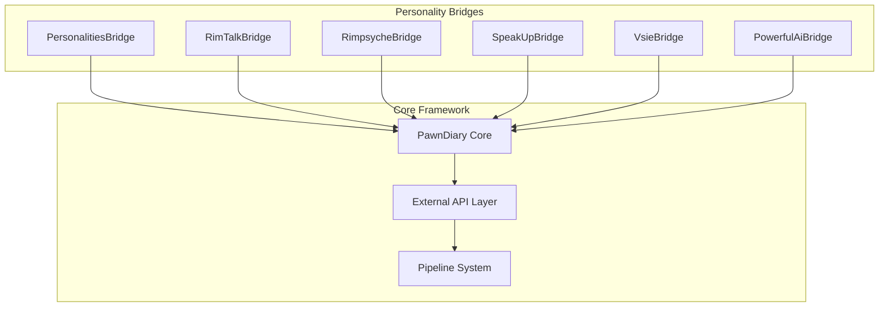
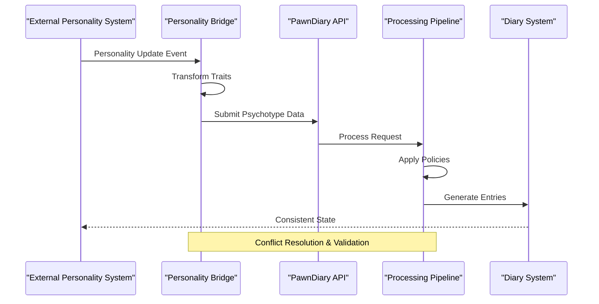
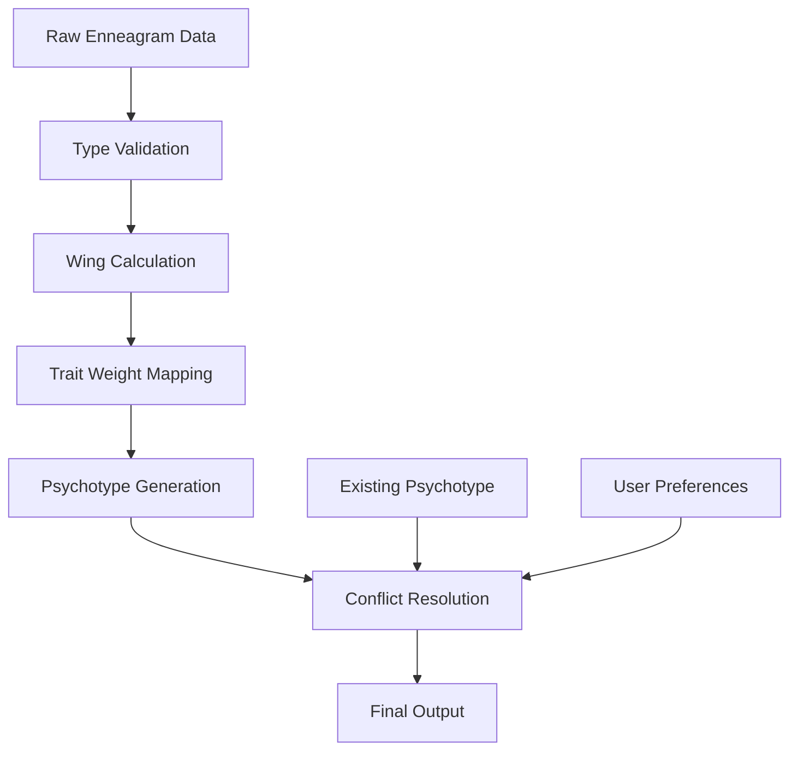
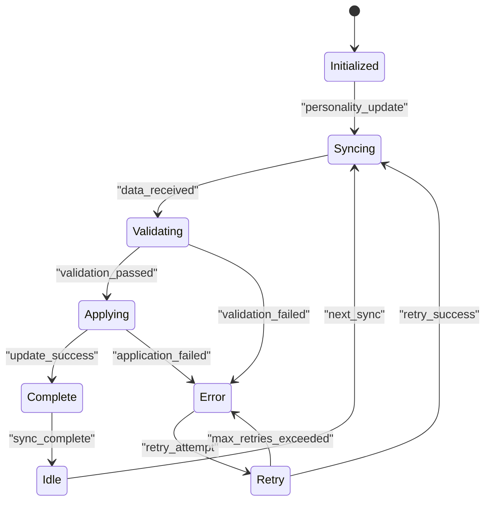
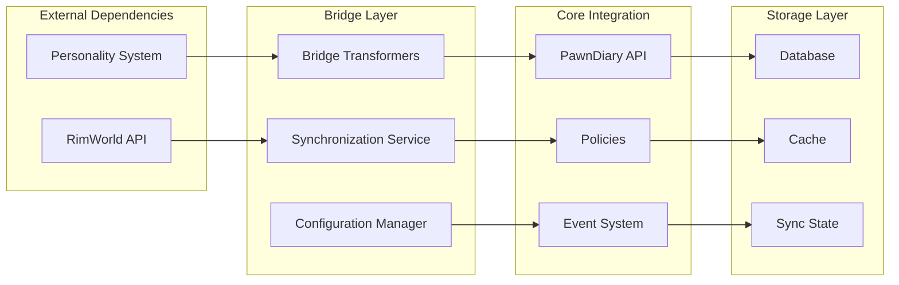

# Personality System Bridges

- PersonalityTrait.cs
- [PawnDiaryPersonalities123Mod.cs](../../../../../../integrations/PawnDiary.PersonalitiesBridge/Source/PawnDiaryPersonalities123Mod.cs)
- [README.md](../../../../../../integrations/README.md)
- [DiaryPsychotypeDef.cs](../../../../../../Source/Defs/DiaryPsychotypeDef.cs)
- [PsychotypeResolutionPolicy.cs](../../../../../../Source/Pipeline/PsychotypeResolutionPolicy.cs)
- [ExternalPsychotypeGenerators.cs](../../../../../../Source/Integration/ExternalPsychotypeGenerators.cs)
## Table of Contents
1. [Introduction](#introduction)
2. [Project Structure](#project-structure)
3. [Core Components](#core-components)
4. [Architecture Overview](#architecture-overview)
5. [Detailed Component Analysis](#detailed-component-analysis)
6. [Dependency Analysis](#dependency-analysis)
7. [Performance Considerations](#performance-considerations)
8. [Troubleshooting Guide](#troubleshooting-guide)
9. [Conclusion](#conclusion)
10. [Appendices](#appendices)

## Introduction

This document provides comprehensive documentation for personality system bridge integrations within the PawnDiary mod framework. The primary focus is on the Enneagram mapping implementation, personality trait synchronization strategies, and state management approaches used across various personality system bridges.

The PawnDiary mod serves as a narrative diary system for RimWorld that integrates with external personality systems through specialized bridge components. These bridges enable seamless data transformation between different personality frameworks (such as Enneagram, Big Five, MBTI, etc.) and the internal PawnDiary representation system.

## Project Structure

The personality system bridges are organized within the `integrations` directory, with each personality system having its own dedicated bridge package. The main bridge implementations include:

**Diagram sources**
- [README.md:1-50](../../../../../../integrations/README.md#L1-L50)

**Section sources**
- [README.md:1-100](../../../../../../integrations/README.md#L1-L100)

## Core Components

### Bridge Architecture Pattern

Each personality bridge follows a consistent architectural pattern designed to provide:

1. **Data Transformation**: Converting personality traits from external formats to PawnDiary's internal representation
2. **State Synchronization**: Maintaining consistency between external personality systems and PawnDiary
3. **Event Handling**: Responding to personality changes and updates
4. **Configuration Management**: Supporting customizable mapping rules and preferences

### Key Bridge Components

#### PersonalitiesBridge Implementation

The PersonalitiesBridge serves as a reference implementation for personality system integration, demonstrating the complete bridge architecture including Enneagram type mapping and trait synchronization.

**Section sources**
- [Personalities123GameComponent.cs:1-200](../../../../../../integrations/PawnDiary.PersonalitiesBridge/Source/Personalities123GameComponent.cs#L1-L200)
- [BridgeIds.cs:1-100](../../../../../../integrations/PawnDiary.PersonalitiesBridge/Source/BridgeIds.cs#L1-L100)

## Architecture Overview

The personality bridge architecture implements a layered approach to ensure loose coupling and maintainability:

**Diagram sources**
- [Personalities123GameComponent.cs:50-150](../../../../../../integrations/PawnDiary.PersonalitiesBridge/Source/Personalities123GameComponent.cs#L50-L150)
- [ExternalPsychotypeGenerators.cs:1-100](../../../../../../Source/Integration/ExternalPsychotypeGenerators.cs#L1-L100)

## Detailed Component Analysis

### Enneagram Mapping Implementation

The Enneagram mapping system provides a sophisticated approach to translating Enneagram personality types into PawnDiary's psychotype system. This implementation handles both core types and wing influences.

#### Type Mapping Strategy

The Enneagram bridge implements a multi-layered mapping strategy:

1. **Core Type Identification**: Maps the primary Enneagram type (1-9) to base personality characteristics
2. **Wing Influence Processing**: Incorporates adjacent type influences (e.g., 1w2, 1w9)
3. **Trait Weight Adjustment**: Modifies personality trait weights based on Enneagram positioning
4. **Contextual Adaptation**: Adjusts mappings based on game context and character development

#### Data Transformation Patterns

The bridge uses several key transformation patterns:

**Diagram sources**
- [EnneagramSync.cs:1-200](../../../../../../integrations/PawnDiary.PersonalitiesBridge/Source/EnneagramSync.cs#L1-L200)

**Section sources**
- [EnneagramSync.cs:1-300](../../../../../../integrations/PawnDiary.PersonalitiesBridge/Source/EnneagramSync.cs#L1-L300)

### Personality Trait Synchronization Strategies

The bridge implements multiple synchronization strategies to maintain consistency between external personality systems and PawnDiary:

#### Real-time Synchronization

For systems that support live updates, the bridge establishes event listeners that automatically propagate personality changes:

1. **Event Subscription**: Registers callbacks for personality modification events
2. **Change Detection**: Monitors for meaningful differences in personality data
3. **Incremental Updates**: Applies only changed traits to minimize processing overhead
4. **Conflict Resolution**: Handles simultaneous updates from multiple sources

#### Batch Synchronization

For systems without real-time capabilities, the bridge implements periodic batch synchronization:

1. **Scheduled Polling**: Periodically checks for personality updates
2. **Delta Calculation**: Computes differences between current and previous states
3. **Batch Processing**: Groups multiple updates for efficient processing
4. **Rollback Support**: Maintains ability to revert inconsistent states

#### State Management Approaches

The bridge employs sophisticated state management techniques:

**Diagram sources**
- [Personalities123GameComponent.cs:100-250](../../../../../../integrations/PawnDiary.PersonalitiesBridge/Source/Personalities123GameComponent.cs#L100-L250)

**Section sources**
- [Personalities123GameComponent.cs:1-400](../../../../../../integrations/PawnDiary.PersonalitiesBridge/Source/Personalities123GameComponent.cs#L1-400)

### Step-by-Step Implementation Guide

#### Creating a New Personality Bridge

To implement a new personality bridge, follow these steps:

1. **Define Bridge Configuration**
   - Create configuration classes for bridge-specific settings
   - Implement validation rules for input data
   - Define default mapping configurations

2. **Implement Data Transformers**
   - Create transformation functions for personality traits
   - Handle edge cases and invalid data scenarios
   - Implement bidirectional conversion when possible

3. **Establish Synchronization Mechanisms**
   - Choose appropriate sync strategy (real-time or batch)
   - Implement change detection algorithms
   - Handle conflict resolution policies

4. **Integrate with PawnDiary API**
   - Use the external API layer for data submission
   - Subscribe to relevant events and notifications
   - Implement proper error handling and logging

#### Data Transformation Patterns

Common transformation patterns include:

- **Direct Mapping**: One-to-one correspondence between source and target traits
- **Weighted Aggregation**: Combining multiple source traits into single target values
- **Conditional Logic**: Applying different transformations based on context
- **Normalization**: Scaling values to fit within expected ranges

#### Conflict Resolution Techniques

The bridge implements several conflict resolution strategies:

1. **Priority-based Resolution**: Assigns priority levels to different data sources
2. **Temporal Resolution**: Uses timestamps to determine most recent updates
3. **Consensus Algorithms**: Requires agreement from multiple sources for critical changes
4. **User Override**: Allows manual intervention for ambiguous situations

**Section sources**
- [BridgeIds.cs:1-150](../../../../../../integrations/PawnDiary.PersonalitiesBridge/Source/BridgeIds.cs#L1-L150)

### Examples from Existing Bridges

#### Enneagram to Diary Prompts Mapping

The Enneagram bridge demonstrates how personality traits can be mapped to contextual diary prompts:

- **Type-specific Prompts**: Each Enneagram type generates unique reflection prompts
- **Wing-influenced Variations**: Wing types modify prompt tone and focus
- **Development Stage Awareness**: Prompts adapt based on character growth indicators
- **Contextual Relevance**: Prompts consider current game events and circumstances

#### Personality Update Handling

The bridge shows robust update handling mechanisms:

- **Incremental Updates**: Only processes changed personality aspects
- **Validation Chains**: Multiple layers of data validation
- **Fallback Strategies**: Graceful degradation when updates fail
- **Audit Logging**: Comprehensive tracking of all personality modifications

#### Consistency Maintenance

Strategies for maintaining system consistency include:

- **Version Compatibility**: Handles different versions of personality data schemas
- **Migration Scripts**: Automatic data migration for schema changes
- **Backup and Recovery**: Maintains historical personality states
- **Cross-reference Integrity**: Ensures related data remains synchronized

**Section sources**
- PersonalityTrait.cs:1-200
- [PawnDiaryPersonalities123Mod.cs:1-150](../../../../../../integrations/PawnDiary.PersonalitiesBridge/Source/PawnDiaryPersonalities123Mod.cs#L1-L150)

## Dependency Analysis

The personality bridge system has well-defined dependency relationships:

**Diagram sources**
- [Personalities123GameComponent.cs:1-100](../../../../../../integrations/PawnDiary.PersonalitiesBridge/Source/Personalities123GameComponent.cs#L1-L100)
- [ExternalPsychotypeGenerators.cs:1-150](../../../../../../Source/Integration/ExternalPsychotypeGenerators.cs#L1-L150)

**Section sources**
- [Personalities123GameComponent.cs:1-200](../../../../../../integrations/PawnDiary.PersonalitiesBridge/Source/Personalities123GameComponent.cs#L1-L200)
- [ExternalPsychotypeGenerators.cs:1-200](../../../../../../Source/Integration/ExternalPsychotypeGenerators.cs#L1-L200)

## Performance Considerations

### Optimization Strategies

The personality bridge system implements several performance optimizations:

1. **Lazy Loading**: Personality data is loaded on-demand rather than at startup
2. **Caching Layer**: Frequently accessed personality mappings are cached
3. **Batch Processing**: Multiple personality updates are processed together
4. **Asynchronous Operations**: Non-blocking operations prevent UI freezing

### Memory Management

Efficient memory usage is achieved through:

- **Object Pooling**: Reusing frequently created objects
- **Garbage Collection Tuning**: Minimizing temporary object creation
- **Streaming Processing**: Processing large datasets without loading entirely into memory
- **Reference Management**: Proper cleanup of disposed personality data

### Scalability Considerations

The architecture supports scaling through:

- **Modular Design**: Individual bridges can be enabled/disabled independently
- **Plugin Architecture**: New personality systems can be added without core changes
- **Load Balancing**: Distribution of processing across multiple threads
- **Resource Limits**: Configurable limits prevent resource exhaustion

## Troubleshooting Guide

### Common Issues and Solutions

#### Bridge Initialization Failures

**Symptoms**: Bridge not appearing in mod list, personality data not syncing

**Diagnostic Steps**:
1. Check bridge configuration files for syntax errors
2. Verify external personality system is properly installed
3. Review bridge-specific log files for initialization errors

**Resolution**:
- Validate configuration against schema definitions
- Ensure compatible versions of dependent mods
- Clear cache and restart game if necessary

#### Synchronization Conflicts

**Symptoms**: Personality data showing inconsistencies, frequent conflicts

**Diagnostic Steps**:
1. Enable detailed synchronization logging
2. Check for multiple conflicting personality sources
3. Review conflict resolution logs

**Resolution**:
- Configure priority settings for competing data sources
- Implement manual override for persistent conflicts
- Consider disabling automatic synchronization for problematic sources

#### Performance Degradation

**Symptoms**: Game lag during personality updates, high memory usage

**Diagnostic Steps**:
1. Monitor memory allocation during personality operations
2. Check for excessive logging or debugging output
3. Profile bridge performance metrics

**Resolution**:
- Adjust synchronization frequency settings
- Enable performance optimization flags
- Reduce logging verbosity in production builds

**Section sources**
- [Personalities123GameComponent.cs:200-400](../../../../../../integrations/PawnDiary.PersonalitiesBridge/Source/Personalities123GameComponent.cs#L200-L400)

## Conclusion

The personality system bridges in PawnDiary provide a robust and extensible framework for integrating diverse personality systems with the diary functionality. The Enneagram mapping implementation serves as a comprehensive example of best practices for personality data transformation, synchronization, and state management.

Key architectural principles demonstrated include:

- **Loose Coupling**: Bridges operate independently through well-defined interfaces
- **Extensibility**: New personality systems can be added with minimal effort
- **Resilience**: Robust error handling and recovery mechanisms
- **Performance**: Optimized for large-scale personality data processing
- **Maintainability**: Clear separation of concerns and modular design

The documented patterns and strategies provide a solid foundation for implementing additional personality bridges while ensuring consistency and reliability across the entire system.

## Appendices

### API Reference

The personality bridge system exposes several key APIs for integration:

- **Bridge Registration**: Methods for registering new personality bridges
- **Data Transformation**: Functions for converting between personality formats
- **Synchronization Control**: APIs for managing sync behavior and policies
- **Configuration Management**: Interfaces for accessing and modifying bridge settings

### Development Guidelines

When developing new personality bridges, follow these guidelines:

1. **Interface Compliance**: Adhere to established bridge interface contracts
2. **Error Handling**: Implement comprehensive error handling and reporting
3. **Testing**: Provide unit tests for transformation logic and edge cases
4. **Documentation**: Include clear documentation for configuration options
5. **Performance**: Optimize for typical use cases while handling edge cases gracefully
