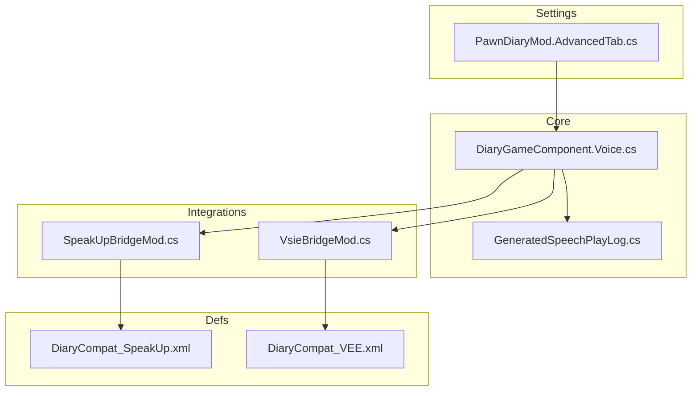
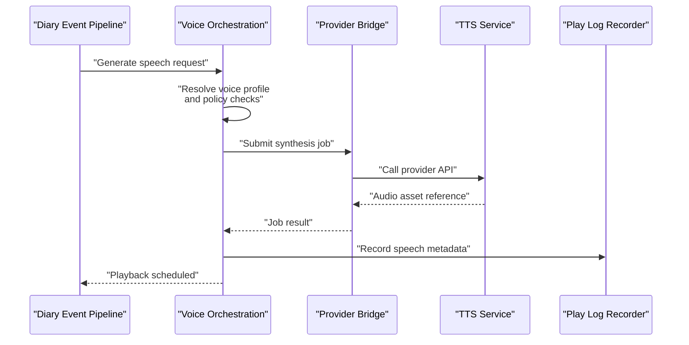
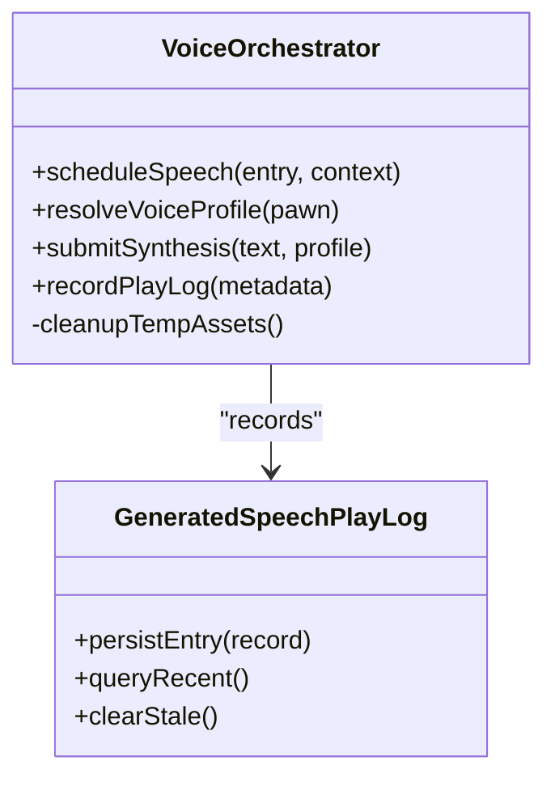
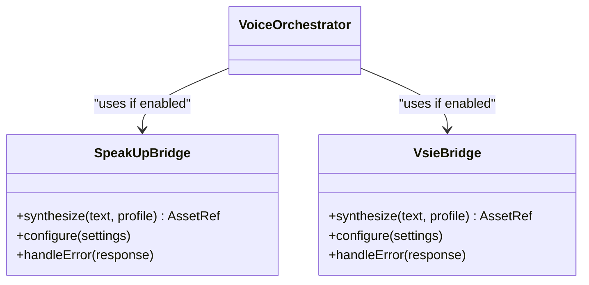
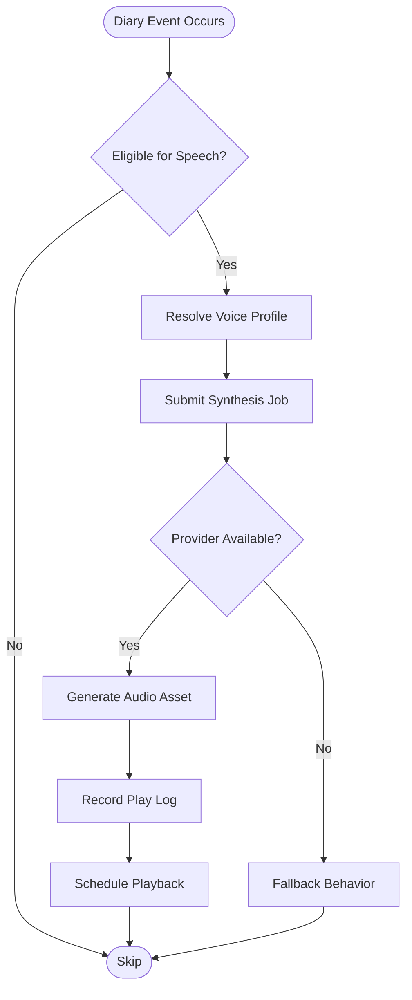
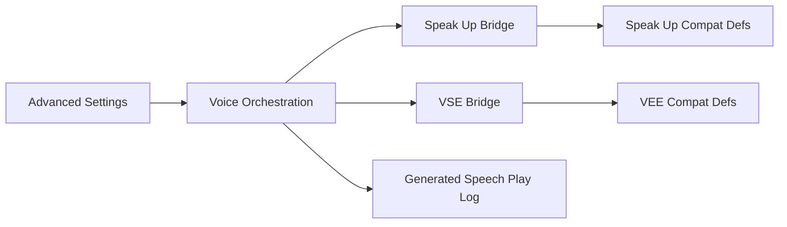

# Voice Synthesis Integrations

- [DiaryGameComponent.Voice.cs](../../../../../../Source/Core/DiaryGameComponent.Voice.cs)
- [GeneratedSpeechPlayLog.cs](../../../../../../Source/Core/GeneratedSpeechPlayLog.cs)
- [SpeakUpBridgeMod.cs](../../../../../../integrations/PawnDiary.SpeakUp/Source/SpeakUpBridgeMod.cs)
- [VsieBridgeMod.cs](../../../../../../integrations/PawnDiary.Vsie/Source/VsieBridgeMod.cs)
- [DiaryCompat_SpeakUp.xml](../../../../../../1.6/Defs/Compat/DiaryCompat_SpeakUp.xml)
- [DiaryCompat_VEE.xml](../../../../../../1.6/Defs/Compat/DiaryCompat_VEE.xml)
- [PawnDiaryMod.AdvancedTab.cs](../../../../../../Source/Settings/PawnDiaryMod.AdvancedTab.cs)
- [ExternalLlmCompletionService.cs](../../../../../../Source/Integration/ExternalLlmCompletionService.cs)
## Table of Contents
1. [Introduction](#introduction)
2. [Project Structure](#project-structure)
3. [Core Components](#core-components)
4. [Architecture Overview](#architecture-overview)
5. [Detailed Component Analysis](#detailed-component-analysis)
6. [Dependency Analysis](#dependency-analysis)
7. [Performance Considerations](#performance-considerations)
8. [Troubleshooting Guide](#troubleshooting-guide)
9. [Conclusion](#conclusion)
10. [Appendices](#appendices)

## Introduction
This document explains how voice synthesis integrates with diary entries and interactions. It covers speech generation workflows, audio file management, timing synchronization with diary events, character-specific voice profiles, performance optimization for playback, and troubleshooting techniques for common issues with voice synthesis services. The goal is to help modders and users understand the end-to-end flow from text generation to playable audio, and how to configure or extend it safely.

## Project Structure
The repository organizes voice-related functionality across core orchestration, integration bridges, compatibility definitions, and settings:
- Core orchestration handles scheduling, lifecycle, and play log recording for generated speech.
- Integration bridges connect to external voice synthesis providers (for example, Speak Up and VSE).
- Compatibility definitions map diary event windows and observed conditions to voice behaviors.
- Settings expose advanced configuration options for voice features.

**Diagram sources**
- [DiaryGameComponent.Voice.cs](../../../../../../Source/Core/DiaryGameComponent.Voice.cs)
- [GeneratedSpeechPlayLog.cs](../../../../../../Source/Core/GeneratedSpeechPlayLog.cs)
- [SpeakUpBridgeMod.cs](../../../../../../integrations/PawnDiary.SpeakUp/Source/SpeakUpBridgeMod.cs)
- [VsieBridgeMod.cs](../../../../../../integrations/PawnDiary.Vsie/Source/VsieBridgeMod.cs)
- [DiaryCompat_SpeakUp.xml](../../../../../../1.6/Defs/Compat/DiaryCompat_SpeakUp.xml)
- [DiaryCompat_VEE.xml](../../../../../../1.6/Defs/Compat/DiaryCompat_VEE.xml)
- [PawnDiaryMod.AdvancedTab.cs](../../../../../../Source/Settings/PawnDiaryMod.AdvancedTab.cs)

**Section sources**
- [DiaryGameComponent.Voice.cs](../../../../../../Source/Core/DiaryGameComponent.Voice.cs)
- [GeneratedSpeechPlayLog.cs](../../../../../../Source/Core/GeneratedSpeechPlayLog.cs)
- [SpeakUpBridgeMod.cs](../../../../../../integrations/PawnDiary.SpeakUp/Source/SpeakUpBridgeMod.cs)
- [VsieBridgeMod.cs](../../../../../../integrations/PawnDiary.Vsie/Source/VsieBridgeMod.cs)
- [DiaryCompat_SpeakUp.xml](../../../../../../1.6/Defs/Compat/DiaryCompat_SpeakUp.xml)
- [DiaryCompat_VEE.xml](../../../../../../1.6/Defs/Compat/DiaryCompat_VEE.xml)
- [PawnDiaryMod.AdvancedTab.cs](../../../../../../Source/Settings/PawnDiaryMod.AdvancedTab.cs)

## Core Components
- Voice orchestration component: centralizes scheduling, provider selection, and lifecycle management for voice synthesis tied to diary events.
- Play log recorder: persists metadata about generated speech for replay and debugging.
- Integration bridges: adapt core voice requests to specific providers (e.g., Speak Up, VSE).
- Compatibility definitions: declarative mappings that enable voice behavior for certain diary event windows and conditions.
- Advanced settings: UI-driven toggles and parameters for voice features.

Key responsibilities:
- Convert diary text into synthesized speech via configured provider.
- Manage temporary audio assets and cleanup.
- Synchronize audio playback with diary event timing.
- Provide per-character voice profile resolution.
- Expose diagnostics and controls for developers and users.

**Section sources**
- [DiaryGameComponent.Voice.cs](../../../../../../Source/Core/DiaryGameComponent.Voice.cs)
- [GeneratedSpeechPlayLog.cs](../../../../../../Source/Core/GeneratedSpeechPlayLog.cs)
- [SpeakUpBridgeMod.cs](../../../../../../integrations/PawnDiary.SpeakUp/Source/SpeakUpBridgeMod.cs)
- [VsieBridgeMod.cs](../../../../../../integrations/PawnDiary.Vsie/Source/VsieBridgeMod.cs)
- [DiaryCompat_SpeakUp.xml](../../../../../../1.6/Defs/Compat/DiaryCompat_SpeakUp.xml)
- [DiaryCompat_VEE.xml](../../../../../../1.6/Defs/Compat/DiaryCompat_VEE.xml)
- [PawnDiaryMod.AdvancedTab.cs](../../../../../../Source/Settings/PawnDiaryMod.AdvancedTab.cs)

## Architecture Overview
The voice synthesis architecture follows a layered approach:
- Diary event pipeline produces text content.
- Voice orchestration decides whether to synthesize speech based on context and policies.
- Provider bridge translates requests into provider-specific calls.
- Audio output is managed by the chosen provider; the core records metadata for replay.

**Diagram sources**
- [DiaryGameComponent.Voice.cs](../../../../../../Source/Core/DiaryGameComponent.Voice.cs)
- [GeneratedSpeechPlayLog.cs](../../../../../../Source/Core/GeneratedSpeechPlayLog.cs)
- [SpeakUpBridgeMod.cs](../../../../../../integrations/PawnDiary.SpeakUp/Source/SpeakUpBridgeMod.cs)
- [VsieBridgeMod.cs](../../../../../../integrations/PawnDiary.Vsie/Source/VsieBridgeMod.cs)

## Detailed Component Analysis

### Voice Orchestration Component
Responsibilities:
- Determine when to generate speech for diary entries and interactions.
- Resolve character-specific voice profiles.
- Schedule playback aligned with diary event timing.
- Coordinate with provider bridges and record play log data.

**Diagram sources**
- [DiaryGameComponent.Voice.cs](../../../../../../Source/Core/DiaryGameComponent.Voice.cs)
- [GeneratedSpeechPlayLog.cs](../../../../../../Source/Core/GeneratedSpeechPlayLog.cs)

**Section sources**
- [DiaryGameComponent.Voice.cs](../../../../../../Source/Core/DiaryGameComponent.Voice.cs)
- [GeneratedSpeechPlayLog.cs](../../../../../../Source/Core/GeneratedSpeechPlayLog.cs)

### Provider Bridges (Speak Up and VSE)
Responsibilities:
- Translate core voice requests into provider-specific calls.
- Handle provider authentication, rate limits, and error responses.
- Return references to generated audio assets for playback.

**Diagram sources**
- [SpeakUpBridgeMod.cs](../../../../../../integrations/PawnDiary.SpeakUp/Source/SpeakUpBridgeMod.cs)
- [VsieBridgeMod.cs](../../../../../../integrations/PawnDiary.Vsie/Source/VsieBridgeMod.cs)
- [DiaryGameComponent.Voice.cs](../../../../../../Source/Core/DiaryGameComponent.Voice.cs)

**Section sources**
- [SpeakUpBridgeMod.cs](../../../../../../integrations/PawnDiary.SpeakUp/Source/SpeakUpBridgeMod.cs)
- [VsieBridgeMod.cs](../../../../../../integrations/PawnDiary.Vsie/Source/VsieBridgeMod.cs)
- [DiaryGameComponent.Voice.cs](../../../../../../Source/Core/DiaryGameComponent.Voice.cs)

### Compatibility Definitions
Purpose:
- Declaratively enable voice behavior for specific diary event windows and observed conditions.
- Map provider capabilities to game contexts.

Examples:
- Speak Up compatibility mapping for diary event windows.
- VEE compatibility mapping for observed conditions and event windows.

**Section sources**
- [DiaryCompat_SpeakUp.xml](../../../../../../1.6/Defs/Compat/DiaryCompat_SpeakUp.xml)
- [DiaryCompat_VEE.xml](../../../../../../1.6/Defs/Compat/DiaryCompat_VEE.xml)

### Settings and Advanced Controls
Purpose:
- Provide user-facing toggles and parameters for voice synthesis.
- Allow fine-grained control over provider selection, caching, and playback behavior.

**Section sources**
- [PawnDiaryMod.AdvancedTab.cs](../../../../../../Source/Settings/PawnDiaryMod.AdvancedTab.cs)

### Conceptual Overview
End-to-end workflow:
- A diary event occurs and generates text.
- The voice orchestrator evaluates eligibility and resolves a voice profile.
- A provider bridge synthesizes speech and returns an audio asset reference.
- The orchestrator schedules playback synchronized with the diary event timeline.
- Metadata is recorded for replay and diagnostics.

[No sources needed since this diagram shows conceptual workflow, not actual code structure]

## Dependency Analysis
High-level dependencies:
- Voice orchestration depends on provider bridges and play log recorder.
- Provider bridges depend on external TTS services and may rely on compatibility definitions.
- Settings influence orchestration behavior at runtime.

**Diagram sources**
- [DiaryGameComponent.Voice.cs](../../../../../../Source/Core/DiaryGameComponent.Voice.cs)
- [SpeakUpBridgeMod.cs](../../../../../../integrations/PawnDiary.SpeakUp/Source/SpeakUpBridgeMod.cs)
- [VsieBridgeMod.cs](../../../../../../integrations/PawnDiary.Vsie/Source/VsieBridgeMod.cs)
- [GeneratedSpeechPlayLog.cs](../../../../../../Source/Core/GeneratedSpeechPlayLog.cs)
- [DiaryCompat_SpeakUp.xml](../../../../../../1.6/Defs/Compat/DiaryCompat_SpeakUp.xml)
- [DiaryCompat_VEE.xml](../../../../../../1.6/Defs/Compat/DiaryCompat_VEE.xml)
- [PawnDiaryMod.AdvancedTab.cs](../../../../../../Source/Settings/PawnDiaryMod.AdvancedTab.cs)

**Section sources**
- [DiaryGameComponent.Voice.cs](../../../../../../Source/Core/DiaryGameComponent.Voice.cs)
- [SpeakUpBridgeMod.cs](../../../../../../integrations/PawnDiary.SpeakUp/Source/SpeakUpBridgeMod.cs)
- [VsieBridgeMod.cs](../../../../../../integrations/PawnDiary.Vsie/Source/VsieBridgeMod.cs)
- [GeneratedSpeechPlayLog.cs](../../../../../../Source/Core/GeneratedSpeechPlayLog.cs)
- [DiaryCompat_SpeakUp.xml](../../../../../../1.6/Defs/Compat/DiaryCompat_SpeakUp.xml)
- [DiaryCompat_VEE.xml](../../../../../../1.6/Defs/Compat/DiaryCompat_VEE.xml)
- [PawnDiaryMod.AdvancedTab.cs](../../../../../../Source/Settings/PawnDiaryMod.AdvancedTab.cs)

## Performance Considerations
Recommendations:
- Prefer asynchronous synthesis jobs to avoid blocking the main thread.
- Cache frequently used voice profiles and short phrases where appropriate.
- Limit concurrent synthesis requests to respect provider rate limits.
- Clean up temporary audio assets promptly after playback to conserve disk space.
- Use lightweight fallbacks when providers are unavailable to maintain responsiveness.

[No sources needed since this section provides general guidance]

## Troubleshooting Guide
Common issues and debugging techniques:
- Provider connectivity failures: verify credentials and network access; check provider status pages.
- Rate limiting errors: reduce concurrency and implement backoff strategies.
- Missing audio assets: ensure cleanup routines run and storage paths are writable.
- Timing desynchronization: review scheduling logic and align playback with diary event timestamps.
- Diagnostics: consult the play log recorder for recent speech metadata and error traces.

Operational tips:
- Use advanced settings to toggle verbose logging for voice operations.
- Validate compatibility definitions for the active event windows and observed conditions.
- Test with small text samples before enabling full-scale synthesis.

**Section sources**
- [GeneratedSpeechPlayLog.cs](../../../../../../Source/Core/GeneratedSpeechPlayLog.cs)
- [PawnDiaryMod.AdvancedTab.cs](../../../../../../Source/Settings/PawnDiaryMod.AdvancedTab.cs)
- [DiaryCompat_SpeakUp.xml](../../../../../../1.6/Defs/Compat/DiaryCompat_SpeakUp.xml)
- [DiaryCompat_VEE.xml](../../../../../../1.6/Defs/Compat/DiaryCompat_VEE.xml)

## Conclusion
The voice synthesis integration connects diary-generated text to playable audio through a modular orchestration layer and provider bridges. By leveraging compatibility definitions and advanced settings, users can tailor voice behavior to their preferred providers while maintaining performance and reliability. Proper scheduling, asset management, and diagnostics ensure a smooth experience across diverse scenarios.

[No sources needed since this section summarizes without analyzing specific files]

## Appendices

### Implementation Examples (Paths Only)
- Voice-enabled diary entry generation: see the voice orchestration component for scheduling and submission flows.
- Character-specific voice profiles: refer to profile resolution methods within the orchestration component.
- Audio playback synchronization: examine scheduling logic and play log recording for alignment with diary events.

**Section sources**
- [DiaryGameComponent.Voice.cs](../../../../../../Source/Core/DiaryGameComponent.Voice.cs)
- [GeneratedSpeechPlayLog.cs](../../../../../../Source/Core/GeneratedSpeechPlayLog.cs)
